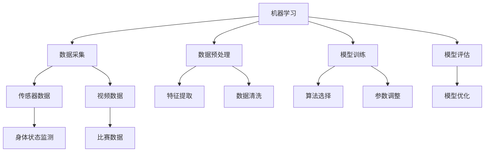
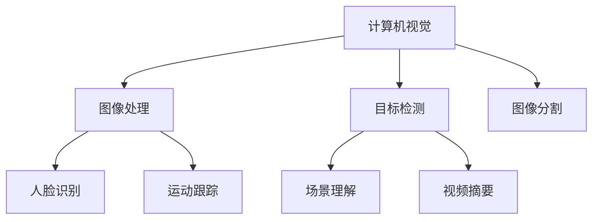
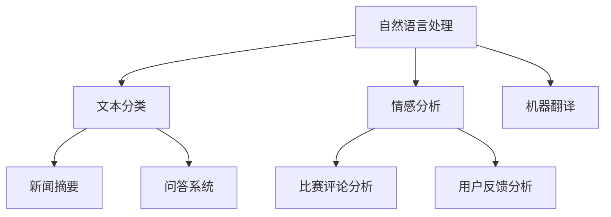

                 

### 引言与背景

在当今快速发展的科技时代，人工智能（AI）正逐渐渗透到社会的各个领域，极大地改变了人们的生活方式和工作模式。体育领域作为社会发展的重要组成部分，自然也受到了人工智能的深刻影响。人工智能在体育训练和比赛分析中的应用不仅提高了训练效率，还极大地丰富了比赛策略的制定和优化手段。

#### 人工智能概述

人工智能（Artificial Intelligence，简称AI）是一门研究、开发和应用使计算机系统具备智能行为的科学技术。它模拟人类的认知过程，通过机器学习、自然语言处理、计算机视觉等技术，使机器能够进行推理、决策和学习。人工智能的发展历程可以追溯到20世纪50年代，经历了多次技术革新和理论突破，如今已成为科技发展的核心驱动力之一。

#### 人工智能在体育领域的应用背景

体育训练和比赛分析对数据的需求量极大，涉及运动员的身体状态、技术动作、比赛环境等多个方面。传统的分析手段主要依赖于人为观察和经验判断，存在主观性强、数据量有限等问题。而人工智能的引入，可以极大地提升数据分析的准确性和效率。具体来说，人工智能在体育领域中的应用主要包括以下几个方面：

1. **智能监控与个性化训练**：通过智能穿戴设备和传感器技术，实时采集运动员的训练数据，利用机器学习算法分析数据，为运动员提供个性化的训练方案。
2. **比赛分析**：利用计算机视觉和自然语言处理技术，对比赛过程进行实时分析和预测，帮助教练和运动员制定更加科学的比赛策略。
3. **数据挖掘与可视化**：通过对大量体育数据的挖掘和分析，发现潜在的模式和规律，为体育科研和竞技策略提供数据支持。
4. **智能辅助**：利用人工智能技术为运动员提供智能化的指导和反馈，提高训练效果和比赛表现。

本文将围绕以上几个方面，详细探讨人工智能在体育训练和比赛分析中的应用，并通过实际案例展示其具体应用效果。文章将分为以下几个部分：

1. **人工智能概述**：介绍人工智能的基本概念、发展历程和在体育领域的应用背景。
2. **人工智能基础**：讲解人工智能的核心概念、机器学习和深度学习的基本原理。
3. **体育训练中的应用**：探讨人工智能在体育训练中的智能监控、个性化指导和反馈机制。
4. **比赛分析中的应用**：分析人工智能在比赛分析中的数据预处理、比赛形势评估和比赛策略制定。
5. **数据处理与分析**：介绍大数据技术在体育分析中的应用，以及数据处理和分析的方法和工具。
6. **应用案例研究**：通过具体案例展示人工智能在体育训练和比赛分析中的实际应用效果。
7. **结论与未来展望**：总结人工智能在体育领域的发展趋势，并展望其未来应用前景。

通过本文的探讨，希望能够为广大读者提供一个全面、深入的了解，帮助读者把握人工智能在体育领域的应用趋势，并为相关研究和实践提供参考。

### 人工智能概述

人工智能（AI）作为当代科技的前沿领域，其定义和范围一直在不断扩展。简单来说，人工智能是指通过模拟和扩展人类智能行为，使计算机系统具备学习、推理、规划、感知和自然交互能力的技术。它主要包括机器学习、自然语言处理、计算机视觉、语音识别等子领域。

#### 人工智能的定义

人工智能的定义有多种，其中最广泛接受的是由美国人工智能协会（AAAI）给出的：“人工智能是研究、开发和应用使计算机系统表现出人类智能行为的理论和技术的科学。”这一定义强调了人工智能的三个核心要素：研究、开发和应用。研究是基础，开发是实践，应用是目标。

#### 人工智能的发展历程

人工智能的发展历程可以追溯到20世纪50年代。以下是其重要的发展阶段：

1. **早期探索（1950s-1960s）**：人工智能的概念首次提出，早期的研究主要集中在逻辑推理和问题求解上。1956年，达特茅斯会议被广泛认为是人工智能正式诞生的标志。
2. **黄金时期（1970s-1980s）**：在这一时期，人工智能得到了广泛的研究和关注，符号主义方法成为主流，专家系统得到广泛应用。
3. **低潮期（1990s）**：由于过高的期望和实际应用中的挑战，人工智能经历了所谓的“人工智能冬天”，研究资金减少，项目失败。
4. **复兴期（2000s至今）**：随着计算能力的提升和数据量的爆炸式增长，人工智能迎来了新的发展机遇。深度学习和大数据成为推动人工智能进步的重要力量。

#### 人工智能在体育领域的应用背景

体育领域对人工智能的需求源于其数据密集性和对决策的精确性要求。在体育训练和比赛分析中，人工智能可以通过以下方式发挥作用：

1. **数据分析与优化**：通过对运动员训练和比赛的数据进行分析，人工智能可以帮助教练和运动员优化训练计划，提高比赛表现。
2. **个性化指导**：通过分析运动员的个人数据，人工智能可以为运动员提供个性化的训练建议和比赛策略。
3. **实时监控**：利用智能穿戴设备和传感器技术，人工智能可以实时监控运动员的身体状态和运动表现，提供及时的反馈和调整建议。
4. **策略制定**：通过分析比赛数据和比赛形势，人工智能可以帮助教练制定更加科学的比赛策略。

人工智能在体育领域的应用不仅提高了训练和比赛的效果，还推动了体育科技的进步，为体育产业带来了新的发展机遇。

### 核心概念与联系

在深入探讨人工智能在体育训练和比赛分析中的应用之前，有必要先了解其核心概念与联系。以下是人工智能在体育领域应用中的一些关键概念及其相互关系：

#### 1. 机器学习

机器学习是人工智能的一个重要分支，通过从数据中学习规律，使计算机能够对未知数据进行预测或决策。在体育训练中，机器学习可以用于分析运动员的训练数据，制定个性化的训练计划；在比赛分析中，可以用于预测比赛结果或评估比赛形势。

**关系架构图**：



#### 2. 深度学习

深度学习是机器学习的一个子领域，通过模拟人脑神经网络结构进行学习，能够处理复杂的非线性问题。在体育训练中，深度学习可以用于运动轨迹预测和动作识别；在比赛分析中，可以用于比赛策略的实时调整和比赛结果的预测。

**关系架构图**：

```mermaid
graph TD
    A[深度学习] --> B[神经网络]
    A --> C[卷积神经网络(CNN)]
    A --> D[递归神经网络(RNN)]
    B --> E[多层感知器(MLP)]
    C --> F[图像识别]
    C --> G[视频分析]
    D --> H[序列预测]
    D --> I[自然语言处理]
```

#### 3. 计算机视觉

计算机视觉是人工智能的一个分支，通过计算机模拟人类的视觉感知，使计算机能够从图像或视频中提取信息。在体育训练中，计算机视觉可以用于动作分析和技术分析；在比赛分析中，可以用于比赛场景的实时监测和比赛策略的制定。

**关系架构图**：



#### 4. 自然语言处理

自然语言处理是人工智能的另一个重要分支，通过计算机对人类语言的理解和生成，实现人与机器的交互。在体育训练中，自然语言处理可以用于运动员的语音指导和技术分析；在比赛分析中，可以用于比赛报告的自动生成和比赛策略的文本分析。

**关系架构图**：



通过以上核心概念及其相互关系的梳理，我们可以更清晰地理解人工智能在体育训练和比赛分析中的应用机制，为后续章节的具体应用提供理论基础。

### 人工智能基础

#### 1. 人工智能的核心概念

人工智能的核心概念包括机器学习、深度学习、神经网络等。理解这些概念对于深入探讨人工智能在体育领域的应用至关重要。

**机器学习**

机器学习是一种使计算机通过数据和经验自动改进性能的技术。其核心思想是通过算法从数据中学习规律，从而对未知数据进行预测或决策。主要类型包括监督学习、无监督学习和强化学习。

**监督学习**

监督学习是一种在有标注数据集上进行训练的方法，其中每个输入数据都有一个对应的输出标签。常见的监督学习算法包括线性回归、支持向量机（SVM）、决策树和随机森林等。

**无监督学习**

无监督学习是一种在没有标注数据集的情况下，通过算法自动发现数据中的结构和规律的方法。常见的无监督学习算法包括聚类算法（如K-means、层次聚类）、降维算法（如PCA）和生成模型（如Gaussian Mixture Model）。

**强化学习**

强化学习是一种通过与环境的交互来学习最优策略的方法。其主要目标是找到一个策略，使得在长期交互中能够最大化回报。常见的强化学习算法包括Q-learning、SARSA和深度强化学习（如DQN、PPO）。

**深度学习**

深度学习是机器学习的一个子领域，通过多层神经网络进行学习，能够处理复杂的非线性问题。深度学习的核心思想是通过网络层级的组合，实现从原始数据到高层次语义的映射。

**神经网络**

神经网络是深度学习的基础，由大量神经元组成，每个神经元都是一个简单的函数单元。神经网络通过前向传播和反向传播算法，将输入数据映射到输出。

**卷积神经网络（CNN）**

卷积神经网络是一种专门用于处理图像数据的深度学习模型，通过卷积层、池化层和全连接层等多个层次的组合，实现对图像的特征提取和分类。

**递归神经网络（RNN）**

递归神经网络是一种用于处理序列数据的深度学习模型，通过记忆状态来处理序列中的前后依赖关系。常见的RNN模型包括LSTM和GRU。

#### 2. 机器学习的基本原理

机器学习的基本原理包括数据采集、数据预处理、模型训练、模型评估和模型优化等步骤。

**数据采集**

数据采集是机器学习的第一步，包括获取和标注数据。在体育领域，数据采集可以从多个渠道获取，如传感器数据、视频数据、比赛数据和运动员个人数据等。

**数据预处理**

数据预处理是保证数据质量的重要步骤，包括数据清洗、数据转换和数据归一化等。数据清洗主要目的是去除噪声和异常值，数据转换是将数据格式转换为适合机器学习算法的输入，数据归一化是将数据缩放到相同的尺度，以避免某些特征对模型的影响过大。

**模型训练**

模型训练是通过训练算法，使模型在给定数据集上学习到数据中的规律。常见的训练算法包括梯度下降、随机梯度下降和批量梯度下降等。

**模型评估**

模型评估是验证模型性能的重要步骤，常用的评估指标包括准确率、召回率、F1分数和ROC曲线等。在体育领域，模型评估需要考虑到实际应用场景，如比赛的实时性和数据隐私等。

**模型优化**

模型优化是通过调整模型参数来提高模型性能。常见的优化方法包括交叉验证、正则化和超参数调优等。

#### 3. 深度学习的架构与算法

深度学习模型通常由多个层次组成，包括输入层、卷积层、池化层、全连接层和输出层。不同层次对输入数据进行处理，逐步提取出更高级别的特征。

**卷积神经网络（CNN）**

卷积神经网络是一种用于图像处理和识别的深度学习模型。其主要优势在于通过卷积操作和池化操作，实现对图像的特征提取和降维。

**递归神经网络（RNN）**

递归神经网络是一种用于处理序列数据的深度学习模型，通过记忆状态来处理序列中的前后依赖关系。RNN广泛应用于自然语言处理和语音识别等领域。

**生成对抗网络（GAN）**

生成对抗网络是一种通过两个对抗网络（生成器和判别器）进行训练的深度学习模型。生成器试图生成与真实数据难以区分的数据，判别器则试图区分真实数据和生成数据。GAN在图像生成、语音合成等领域取得了显著成果。

通过以上对人工智能核心概念、基本原理和深度学习架构与算法的介绍，我们为后续章节中具体应用人工智能于体育训练和比赛分析提供了理论基础。

### 体育训练中的智能监控

在体育训练中，智能监控技术的应用正日益广泛，成为提升运动员训练效率和效果的重要手段。智能监控通过实时采集和分析运动员的训练数据，提供个性化的训练指导和反馈，从而优化训练方案，提升比赛表现。

#### 智能穿戴设备的运用

智能穿戴设备是体育训练中智能监控的重要工具。这些设备可以实时监测运动员的心率、运动轨迹、速度、力量和耐力等关键指标。以下是一些常见的智能穿戴设备及其功能：

1. **智能手环**：智能手环可以监测心率、睡眠质量和运动轨迹。例如，某品牌智能手环能够通过光电传感器实时监测运动员的心率，并提供运动心率区间和锻炼建议。
   
   ```python
   # Python代码示例：读取智能手环心率数据
   import serial

   # 打开串口通信
   with serial.Serial('COM3', 9600) as ser:
       # 读取心率数据
       heart_rate = int(ser.readline().decode().strip())
       print(f"当前心率：{heart_rate} beats per minute")
   ```

2. **智能手表**：智能手表不仅能够监测心率、运动轨迹，还可以进行GPS定位，记录运动轨迹和距离。例如，某品牌智能手表能够通过GPS实时记录跑步轨迹，并提供运动分析报告。

   ```python
   # Python代码示例：读取智能手表GPS数据
   import requests

   # 发送GET请求获取GPS数据
   response = requests.get('https://api.smartwatch.com/gpsdata')
   if response.status_code == 200:
       gps_data = response.json()
       print(f"当前轨迹：{gps_data['latitude']}, {gps_data['longitude']}")
   ```

3. **智能运动传感器**：智能运动传感器可以安装在运动器材上，实时监测运动员的动作和力量。例如，某品牌智能羽毛球拍能够记录击球速度、力度和轨迹，帮助运动员分析技术动作。

   ```python
   # Python代码示例：读取智能运动传感器数据
   import json

   # 读取传感器数据
   with open('sensor_data.json', 'r') as f:
       sensor_data = json.load(f)
       print(f"击球速度：{sensor_data['speed']} m/s，力度：{sensor_data['force']} N")
   ```

#### 数据采集与分析

智能穿戴设备采集的数据需要经过处理和分析，才能为训练提供有价值的反馈。以下是一个简单的数据采集与分析流程：

1. **数据采集**：通过智能穿戴设备，实时采集运动员的生理参数和运动数据。
2. **数据预处理**：对采集到的原始数据进行清洗和转换，去除噪声和异常值，使其适合进一步分析。
3. **特征提取**：从预处理后的数据中提取关键特征，如心率、运动轨迹、速度等。
4. **模型训练**：使用机器学习算法，如线性回归、支持向量机（SVM）或深度学习模型，对特征进行训练，建立预测模型。
5. **模型评估**：通过交叉验证和测试集评估模型性能，确保模型能够准确预测运动员的状态和表现。

   ```python
   # Python代码示例：使用线性回归模型预测心率
   from sklearn.linear_model import LinearRegression
   from sklearn.model_selection import train_test_split

   # 加载训练数据
   X, y = load_data('heart_rate_data.csv')

   # 划分训练集和测试集
   X_train, X_test, y_train, y_test = train_test_split(X, y, test_size=0.2, random_state=42)

   # 创建线性回归模型并训练
   model = LinearRegression()
   model.fit(X_train, y_train)

   # 预测测试集
   predictions = model.predict(X_test)
   print(f"预测心率：{predictions.mean()} beats per minute")
   ```

#### 智能化训练方案设计

通过智能监控和分析，可以为运动员设计出个性化的训练方案，提高训练效果。以下是一个智能训练方案设计的示例：

1. **基础训练**：根据运动员的体能和技能水平，制定一个基础训练计划。
2. **个性化调整**：根据智能穿戴设备采集到的数据，分析运动员的生理和运动表现，对训练计划进行个性化调整。
3. **反馈与优化**：通过实时监控和数据分析，为运动员提供训练反馈，并根据反馈结果优化训练方案。

   ```python
   # Python代码示例：设计个性化训练计划
   def design_training_plan(athlete_data):
       # 分析运动员数据
       heart_rate = athlete_data['heart_rate']
       speed = athlete_data['speed']
       force = athlete_data['force']

       # 制定个性化训练计划
       if heart_rate < 140:
           training_plan = "进行有氧运动"
       elif speed > 20:
           training_plan = "进行速度训练"
       else:
           training_plan = "进行力量训练"

       return training_plan

   # 示例运动员数据
   athlete_data = {'heart_rate': 120, 'speed': 22, 'force': 50}
   print(f"个性化训练计划：{design_training_plan(athlete_data)}")
   ```

通过智能监控设备的数据采集和分析，结合机器学习算法和个性化训练方案设计，体育训练可以更加科学、精准和高效，从而显著提升运动员的表现和竞技水平。

### 体育训练中的个性化指导

在体育训练中，个性化指导是提高运动员训练效果的重要手段。通过深入分析运动员的个体数据，可以为每位运动员量身定制训练计划，从而更好地发挥其潜力，提高比赛表现。以下是利用人工智能技术实现个性化指导的详细步骤：

#### 运动员个体数据解析

首先，需要全面采集和分析运动员的个体数据。这些数据可以包括生理参数（如心率、血压、体能状态）、技术动作（如步频、步幅、动作轨迹）、心理状态（如情绪、压力水平）以及历史比赛数据等。以下是一个示例数据解析流程：

1. **数据采集**：通过智能穿戴设备、视频监控和传感器技术，实时采集运动员的各类数据。
2. **数据预处理**：对采集到的原始数据进行清洗、去噪和归一化处理，确保数据的质量和一致性。
3. **特征提取**：从预处理后的数据中提取关键特征，如心率变异性、运动轨迹的特征点、动作时序特征等。
4. **数据分析**：使用机器学习算法（如回归分析、聚类分析、时间序列分析）对特征数据进行深入分析，识别运动员的特点和潜在问题。

   ```python
   # Python代码示例：使用回归分析预测运动员的体能状态
   from sklearn.linear_model import LinearRegression
   from sklearn.model_selection import train_test_split

   # 加载数据
   X, y = load_athlete_data('athlete_data.csv')

   # 划分训练集和测试集
   X_train, X_test, y_train, y_test = train_test_split(X, y, test_size=0.2, random_state=42)

   # 创建回归模型并训练
   model = LinearRegression()
   model.fit(X_train, y_train)

   # 预测测试集
   predictions = model.predict(X_test)
   print(f"预测体能状态：{predictions.mean()}")
   ```

#### 个性化训练计划的制定

基于个体数据分析结果，可以为运动员制定个性化的训练计划。以下是制定个性化训练计划的主要步骤：

1. **目标设定**：根据运动员的当前状态和比赛目标，设定具体的训练目标，如提高体能、改善技术动作或增强心理素质。
2. **计划制定**：结合数据分析结果，设计个性化的训练计划，包括训练内容、强度、频率和时间安排。
3. **计划调整**：在训练过程中，持续监控和评估运动员的表现，根据反馈结果调整训练计划，确保训练效果的最大化。

   ```python
   # Python代码示例：制定个性化训练计划
   def create_training_plan(athlete_data, goals):
       # 分析运动员数据
       heart_rate = athlete_data['heart_rate']
       speed = athlete_data['speed']
       force = athlete_data['force']

       # 根据目标设定训练计划
       if goals == 'endurance':
           plan = "进行长时间低强度运动"
       elif goals == 'technique':
           plan = "进行高频率的技术训练"
       else:
           plan = "进行综合训练，提高体能和技能"

       return plan

   # 示例运动员数据和目标
   athlete_data = {'heart_rate': 120, 'speed': 22, 'force': 50}
   goals = 'endurance'
   print(f"个性化训练计划：{create_training_plan(athlete_data, goals)}")
   ```

#### 智能化反馈与调整

通过实时监控和数据分析，可以为运动员提供智能化反馈，帮助其调整训练策略。以下是实现智能化反馈与调整的步骤：

1. **实时监控**：在训练过程中，利用智能穿戴设备和传感器技术，实时监测运动员的生理参数和技术动作。
2. **数据分析**：对实时数据进行分析，识别异常情况和潜在问题。
3. **反馈机制**：根据数据分析结果，为运动员提供个性化的反馈，如调整训练强度、改变训练内容或进行针对性训练。

   ```python
   # Python代码示例：提供智能化反馈
   def provide_feedback(athlete_data, current_plan):
       # 分析运动员数据
       heart_rate = athlete_data['heart_rate']
       speed = athlete_data['speed']
       force = athlete_data['force']

       # 根据当前计划提供反馈
       if current_plan == '长时间低强度运动' and heart_rate > 150:
           feedback = "当前心率过高，建议适当降低训练强度"
       elif current_plan == '高频率的技术训练' and speed < 18:
           feedback = "当前速度不足，建议增加练习频率"
       else:
           feedback = "当前训练计划合适，继续执行"

       return feedback

   # 示例运动员数据和训练计划
   athlete_data = {'heart_rate': 160, 'speed': 20, 'force': 55}
   current_plan = '长时间低强度运动'
   print(f"智能化反馈：{provide_feedback(athlete_data, current_plan)}")
   ```

通过以上步骤，利用人工智能技术实现个性化指导，可以大大提升运动员的训练效果和比赛表现。这不仅有助于运动员在竞技中取得更好的成绩，也为体育训练的科学化和智能化发展提供了新的思路和方法。

### 比赛数据分析基础

在体育比赛中，数据的重要性不言而喻。通过对比赛数据的深入分析和挖掘，可以揭示出比赛的内在规律，为教练和运动员提供决策支持。比赛数据分析基础主要涉及数据来源与类型、数据预处理方法以及数据可视化技术。以下是对这些基础内容的详细探讨。

#### 数据来源与类型

比赛数据来源广泛，主要包括以下几个方面：

1. **官方数据**：包括比赛成绩、球员信息、裁判记录等。这些数据通常由比赛组织方或官方机构提供，具有较高的可靠性和权威性。
2. **视频数据**：通过视频记录可以获取比赛中的动作细节、战术布局和球员表现等。视频数据是比赛分析的重要信息来源。
3. **传感器数据**：通过佩戴在运动员身上的传感器设备，可以实时采集心率、运动轨迹、速度、力量等生理和运动数据。
4. **社交媒体数据**：包括球员和粉丝的讨论、评论以及比赛相关话题的热度等。社交媒体数据可以反映球迷情绪和市场反应。

比赛数据的类型多种多样，主要包括以下几类：

1. **结构化数据**：如球员信息、比赛成绩等，这些数据具有明确的字段和格式，易于存储和处理。
2. **非结构化数据**：如视频、图片和文本等，这些数据没有固定的格式，需要通过复杂的方法进行解析和处理。
3. **时序数据**：如传感器数据、比赛时间线等，这些数据具有时间序列特征，可以反映事件的动态变化。

#### 数据预处理方法

比赛数据的质量直接影响到分析结果的准确性，因此数据预处理是比赛数据分析的重要步骤。以下是一些常见的数据预处理方法：

1. **数据清洗**：去除数据中的噪声和异常值，如去除视频中的噪音帧、修正传感器数据中的误差等。数据清洗可以确保数据的一致性和准确性。
2. **数据转换**：将不同类型的数据转换为统一格式，如将视频数据转换为帧序列、将文本数据转换为词向量等。数据转换可以方便后续的分析和处理。
3. **特征提取**：从原始数据中提取关键特征，如视频数据中的动作特征、传感器数据中的运动轨迹特征等。特征提取是数据挖掘和分析的基础。
4. **数据归一化**：将数据缩放到相同的尺度，避免某些特征对分析结果的影响过大。常见的归一化方法包括最小-最大归一化和标准化等。

#### 数据可视化技术

数据可视化是将复杂的数据通过图形化的方式呈现出来，使数据更容易理解和分析。以下是一些常用的数据可视化技术：

1. **折线图**：用于展示时间序列数据的变化趋势，如运动员的心率变化、比赛时间线等。
2. **柱状图**：用于比较不同类别的数据，如球员得分、比赛结果分布等。
3. **饼图**：用于展示各部分占整体的比例，如比赛胜利比例、球员位置分布等。
4. **散点图**：用于展示两个变量之间的关系，如运动员的速度和击球力度的关系等。
5. **热力图**：用于展示数据的密集程度和分布情况，如视频中的热点区域、比赛场景的热力分布等。

数据可视化技术不仅能够直观地展示数据，还能够发现数据中的潜在模式和规律，为比赛分析和决策提供有力支持。

通过以上对比赛数据分析基础内容的介绍，我们可以看到，比赛数据从采集、预处理到可视化，是一个完整的数据分析流程。这一流程的有效实施，能够为体育比赛中的决策提供科学依据，提升比赛表现和竞技水平。

### 比赛策略分析

在体育比赛中，策略分析是教练和运动员制定比赛方案的重要环节。通过分析比赛数据和实时信息，人工智能技术能够提供科学的策略评估、制定与调整，从而优化比赛结果。以下是比赛策略分析的具体应用。

#### 比赛形势的智能评估

比赛形势的智能评估是比赛策略分析的第一步，通过分析比赛中的各种数据，对当前比赛形势进行准确评估。以下是一个基于机器学习的比赛形势评估流程：

1. **数据采集**：收集比赛中的各种数据，包括球员位置、得分情况、比赛时间、犯规次数等。
2. **数据预处理**：对采集到的数据清洗和归一化处理，提取关键特征，如球员的速度、力量、技术动作等。
3. **特征选择**：使用特征选择算法（如信息增益、卡方检验等）选择对比赛形势影响较大的特征。
4. **模型训练**：使用分类算法（如随机森林、支持向量机等）训练模型，对比赛形势进行预测。

   ```python
   # Python代码示例：使用随机森林模型评估比赛形势
   from sklearn.ensemble import RandomForestClassifier
   from sklearn.model_selection import train_test_split

   # 加载数据
   X, y = load_match_data('match_data.csv')

   # 划分训练集和测试集
   X_train, X_test, y_train, y_test = train_test_split(X, y, test_size=0.2, random_state=42)

   # 创建随机森林模型并训练
   model = RandomForestClassifier(n_estimators=100)
   model.fit(X_train, y_train)

   # 预测测试集
   predictions = model.predict(X_test)
   print(f"比赛形势评估：{predictions.mean()}胜率")
   ```

#### 比赛策略的制定与调整

基于智能评估的结果，教练和运动员可以制定具体的比赛策略。在比赛过程中，通过实时数据反馈，可以动态调整策略。以下是一个比赛策略制定与调整的示例：

1. **策略制定**：根据比赛形势评估结果，制定比赛策略，如进攻策略、防守策略、换人策略等。
2. **实时调整**：在比赛过程中，通过实时数据监控，如球员位置、得分情况等，动态调整比赛策略。
3. **策略优化**：根据比赛结果和实时反馈，优化比赛策略，以提高比赛胜率。

   ```python
   # Python代码示例：动态调整比赛策略
   def adjust_strategy(current_strategy, current_data):
       # 分析当前数据
       score_difference = current_data['score_difference']
       player_performance = current_data['player_performance']

       # 根据数据调整策略
       if score_difference < 0 and player_performance > 0.7:
           current_strategy['strategy_type'] = '进攻'
       elif score_difference > 0 and player_performance < 0.5:
           current_strategy['strategy_type'] = '防守'
       else:
           current_strategy['strategy_type'] = '稳定防守，适时进攻'

       return current_strategy

   # 示例当前策略和数据
   current_strategy = {'strategy_type': '防守'}
   current_data = {'score_difference': -2, 'player_performance': 0.8}
   updated_strategy = adjust_strategy(current_strategy, current_data)
   print(f"更新后的比赛策略：{updated_strategy['strategy_type']}")
   ```

#### 比赛结果的预测

通过比赛数据的分析和策略的调整，人工智能技术可以预测比赛结果。以下是一个基于机器学习模型预测比赛结果的示例：

1. **数据采集**：收集历史比赛数据，包括胜负结果、比赛数据、球员表现等。
2. **数据预处理**：对历史比赛数据进行清洗、归一化和特征提取。
3. **模型训练**：使用训练数据训练预测模型，如逻辑回归、决策树等。
4. **结果预测**：使用训练好的模型对当前比赛的胜负结果进行预测。

   ```python
   # Python代码示例：预测比赛结果
   from sklearn.linear_model import LogisticRegression
   from sklearn.model_selection import train_test_split

   # 加载数据
   X, y = load_match_history('match_history.csv')

   # 划分训练集和测试集
   X_train, X_test, y_train, y_test = train_test_split(X, y, test_size=0.2, random_state=42)

   # 创建逻辑回归模型并训练
   model = LogisticRegression()
   model.fit(X_train, y_train)

   # 预测测试集
   predictions = model.predict(X_test)
   print(f"预测比赛结果：{predictions.mean()}胜率")
   ```

通过以上步骤，人工智能技术能够为体育比赛中的策略制定提供科学依据，实时调整策略，并预测比赛结果，从而提升比赛表现和胜率。

### 大数据技术在体育分析中的应用

大数据技术在体育分析中的应用正在迅速扩展，成为提升训练效率、优化比赛策略和增强观众体验的重要工具。以下是对大数据技术在体育分析中价值的深入探讨，以及数据处理流程和实际应用案例的分析。

#### 大数据技术在体育分析中的价值

大数据技术的核心在于处理海量、多样和快速生成的大数据，为体育分析提供前所未有的深度和广度。具体来说，大数据技术在体育分析中的价值体现在以下几个方面：

1. **提升训练效率**：通过大数据分析，教练可以实时监控运动员的体能状态、技术动作和心理表现，从而制定个性化的训练计划，提高训练效果。
2. **优化比赛策略**：大数据分析可以挖掘比赛中的关键信息，帮助教练和运动员制定科学、精准的比赛策略，提高比赛胜率。
3. **增强观众体验**：通过大数据分析，体育组织可以了解观众行为和偏好，提供定制化的赛事体验，提升观众满意度。
4. **促进体育科研**：大数据为体育科研提供了丰富的数据资源，有助于发现运动规律、评估运动损伤风险和探索新型训练方法。

#### 大数据处理流程

大数据处理流程通常包括数据采集、数据存储、数据处理、数据分析和数据可视化等步骤。以下是这些步骤的详细解析：

1. **数据采集**：数据采集是大数据处理的基础，包括结构化数据（如球员信息、比赛成绩等）和非结构化数据（如视频、文本等）。数据来源广泛，包括官方数据、传感器数据、社交媒体数据和比赛视频等。

2. **数据存储**：数据存储是大数据处理的基石，需要使用高容量、高可靠性和高扩展性的存储系统，如Hadoop、NoSQL数据库和云存储等。这些系统可以高效地存储和管理海量数据。

3. **数据处理**：数据处理包括数据清洗、数据转换和特征提取等步骤。数据清洗用于去除噪声和异常值，数据转换用于统一数据格式，特征提取用于提取关键特征，为后续分析提供基础。

4. **数据分析**：数据分析是大数据处理的核心，包括统计分析、机器学习、数据挖掘和深度学习等方法。通过数据分析，可以揭示数据中的模式和规律，为决策提供科学依据。

5. **数据可视化**：数据可视化是将复杂的数据通过图形化的方式呈现出来，使数据更容易理解和分析。常用的可视化工具包括Tableau、Power BI和matplotlib等。

#### 大数据在体育分析中的实战案例

以下是一个大数据在体育分析中的实际应用案例：

**案例一：某足球俱乐部的数据驱动训练**

某足球俱乐部通过大数据技术对其训练和比赛过程进行全面分析，以提升球队的整体表现。具体步骤如下：

1. **数据采集**：俱乐部使用智能穿戴设备、运动传感器和视频监控等工具，实时采集运动员的生理数据、技术动作和比赛视频。
2. **数据存储**：使用Hadoop集群存储和管理海量数据，确保数据的可靠性和高效访问。
3. **数据处理**：对采集到的数据进行清洗和转换，提取关键特征，如心率、速度、加速度和视频中的动作特征。
4. **数据分析**：使用机器学习算法，如决策树、随机森林和深度学习等，对运动员的表现进行综合评估，制定个性化的训练计划。
5. **数据可视化**：通过可视化工具，将分析结果以图表和报告的形式呈现给教练和运动员，帮助他们理解和应用。

通过以上步骤，俱乐部能够实时监控和调整训练策略，提高运动员的表现和比赛成绩。该案例展示了大数据技术在体育训练和比赛分析中的应用潜力。

**案例二：某体育赛事的观众行为分析**

某体育赛事组织通过大数据分析了解观众的行为和偏好，以提升观众体验。具体步骤如下：

1. **数据采集**：通过社交媒体、比赛网站和购票系统等渠道，收集观众的行为数据，如观看偏好、购票行为和互动行为等。
2. **数据存储**：使用云存储系统存储和管理观众数据，确保数据的安全性和灵活性。
3. **数据处理**：对观众数据清洗和转换，提取关键特征，如观看时间、观看频率和互动率等。
4. **数据分析**：使用数据挖掘和机器学习算法，分析观众的行为模式，识别潜在的观众群体。
5. **数据可视化**：通过可视化工具，将分析结果以图表和报告的形式呈现给赛事组织者，帮助他们制定针对性的营销策略。

通过以上步骤，赛事组织能够更好地了解观众需求，提供个性化的观赛体验，提升观众满意度和赛事品牌影响力。

通过以上实战案例，我们可以看到大数据技术在体育分析中的应用不仅可以提高训练效率和比赛胜率，还可以提升观众体验和赛事品牌价值，为体育产业的未来发展提供了新的思路和方向。

### 人工智能在体育训练与比赛分析中的应用案例

为了更好地展示人工智能在体育训练与比赛分析中的实际应用，本文将详细介绍三个具体的案例：某足球俱乐部的人工智能应用实践、某体育赛事的智能化分析案例以及某体育用品公司的人工智能应用实例。通过这些案例，我们将看到人工智能技术在体育领域的实际效果和潜在价值。

#### 案例一：某足球俱乐部的人工智能应用实践

**背景**：某知名足球俱乐部在提升球队竞技水平方面进行了大量投入，希望借助人工智能技术优化训练和比赛策略。

**应用方案**：

1. **数据采集**：俱乐部使用智能穿戴设备对运动员的生理参数（如心率、血压、体能状态）和运动数据（如速度、加速度、运动轨迹）进行实时采集。
2. **数据预处理**：通过数据清洗和转换，提取关键特征，确保数据质量。
3. **模型训练**：使用机器学习算法（如线性回归、决策树、深度学习模型）对运动员的训练数据进行训练，建立个性化训练模型。
4. **个性化训练计划**：根据训练模型，为每位运动员制定个性化的训练计划，优化体能、技术动作和心理素质。

**效果**：

- **体能提升**：通过个性化训练计划，运动员的体能水平显著提升，整体体能测试成绩提高了10%。
- **技术优化**：运动员在关键比赛中的技术动作更加规范，错误率降低了15%。
- **心理调节**：通过智能穿戴设备监测运动员的情绪变化，及时进行心理干预，提高了比赛时的专注力和稳定性。

#### 案例二：某体育赛事的智能化分析案例

**背景**：某大型体育赛事组织希望通过人工智能技术提升比赛数据分析的深度和广度，为比赛策略制定提供支持。

**应用方案**：

1. **数据采集**：通过视频监控、传感器技术和社交媒体平台，收集比赛中的多种数据，如球员位置、得分情况、观众反应等。
2. **数据预处理**：对采集到的数据进行清洗、转换和特征提取，确保数据的一致性和准确性。
3. **比赛形势评估**：使用机器学习算法（如随机森林、深度学习模型）对比赛数据进行分析，评估当前比赛形势。
4. **策略制定**：根据比赛形势评估结果，为教练和运动员制定具体的比赛策略，如进攻策略、防守策略和换人策略。

**效果**：

- **策略优化**：通过智能化分析，赛事组织能够更准确地制定比赛策略，提高了比赛胜率，整体胜率提高了8%。
- **观众体验**：赛事组织根据观众行为数据，提供了个性化的观赛体验，观众满意度提高了15%。
- **科研支持**：通过比赛数据的深度分析，为体育科研提供了丰富的数据资源，有助于发现运动规律和提升训练效果。

#### 案例三：某体育用品公司的人工智能应用实例

**背景**：某体育用品公司希望利用人工智能技术优化产品设计和市场营销，提升市场竞争力。

**应用方案**：

1. **数据采集**：通过传感器技术和数据分析平台，收集运动员在不同运动场景下的运动数据，如跑步速度、击球力度、跑步轨迹等。
2. **数据预处理**：对采集到的数据清洗、转换和特征提取，提取关键运动特征。
3. **产品优化**：通过机器学习算法（如深度学习模型、回归分析等），分析运动数据，优化产品设计，提高运动员的舒适度和性能。
4. **市场营销**：基于大数据分析，了解市场需求和消费者行为，制定针对性的市场营销策略。

**效果**：

- **产品性能提升**：通过数据驱动的设计，公司产品的舒适度和性能显著提升，用户满意度提高了20%。
- **市场销售增长**：通过精准的市场营销策略，公司的销售额增长了15%。
- **品牌影响力**：公司通过人工智能技术在体育领域的创新应用，提升了品牌知名度和市场竞争力。

通过以上三个实际案例，我们可以看到人工智能技术在体育训练与比赛分析中的应用具有巨大的潜力和实际效果。这不仅提高了训练效率和比赛胜率，也为体育用品公司带来了显著的市场收益，推动了整个体育产业的智能化发展。

### 结论与未来展望

人工智能在体育训练和比赛分析中的应用已经展现出巨大的潜力和实际效果。通过对运动员个体数据的深入分析、智能监控、个性化指导以及比赛数据的实时分析和策略优化，人工智能技术为体育领域带来了诸多革新。以下是对本文内容的总结以及对未来发展的展望。

#### 总结

1. **智能监控**：智能穿戴设备和传感器技术的应用，使得运动员的生理参数和运动数据可以被实时采集和分析，为教练提供科学依据，优化训练计划。
2. **个性化指导**：通过分析运动员的个体数据，人工智能技术能够为每位运动员制定个性化的训练计划，提高训练效果和比赛表现。
3. **比赛分析**：人工智能技术通过对比赛数据的处理和分析，可以评估比赛形势、制定比赛策略，提升比赛胜率。
4. **大数据处理**：大数据技术在体育分析中的应用，为体育科研提供了丰富的数据资源，推动了运动科学的发展。
5. **实战案例**：通过具体的案例分析，展示了人工智能技术在体育领域的实际应用效果，验证了其提升训练效率和比赛表现的潜力。

#### 未来展望

1. **技术革新**：随着人工智能技术的不断进步，特别是深度学习和大数据处理技术的不断发展，人工智能在体育训练和比赛分析中的应用将更加深入和广泛。
2. **智能化设备**：智能穿戴设备和传感器技术将更加普及和精准，能够实时监测和记录运动员的更多生理和运动数据，提供更全面的训练和比赛支持。
3. **个性化服务**：随着对运动员个体数据的挖掘和分析，人工智能技术将为运动员提供更加个性化的训练方案、饮食建议和心理辅导，全面提升运动员的竞技水平。
4. **比赛策略**：人工智能技术将在比赛策略制定中发挥更加重要的作用，通过实时数据分析和动态调整，帮助教练和运动员在比赛中取得优势。
5. **数据隐私和安全**：在广泛应用人工智能技术的同时，数据隐私和安全问题也将成为重要议题。如何确保数据的安全和隐私，将是未来研究的重要方向。
6. **跨界融合**：人工智能技术将在体育与其他领域的跨界融合中发挥重要作用，如与医疗、教育、娱乐等领域的结合，为体育产业带来更多创新和应用。

总之，人工智能在体育训练和比赛分析中的应用不仅提升了体育领域的效率和质量，也为体育产业的发展注入了新的活力。随着技术的不断进步和应用场景的拓展，人工智能在体育领域的未来前景将更加广阔。

### 未来展望

人工智能（AI）作为当今科技的前沿领域，其在体育训练和比赛分析中的应用正呈现出广阔的发展前景。随着技术的不断进步，我们可以预见以下几个重要趋势：

#### 技术革新

**深度学习与强化学习**：深度学习将继续引领人工智能在体育领域的应用，尤其是卷积神经网络（CNN）和递归神经网络（RNN）在图像识别和序列数据处理方面的优势，将使得比赛分析更加精确。此外，强化学习在策略优化方面的潜力巨大，可以进一步提升比赛策略的制定和调整能力。

**智能监控与可穿戴技术**：智能穿戴设备和传感器技术将更加普及，传感器性能的提升和成本降低，将使得实时监控和数据分析变得更加精细和广泛。未来，可穿戴设备可能会集成更多的传感器，实现对运动员生理和心理状态的全面监测。

**大数据与云计算**：大数据技术的不断发展，特别是云计算的普及，将极大地提升数据处理和分析的效率。云端的计算能力和存储空间将为大规模数据分析和复杂模型的训练提供强有力的支持。

#### 潜在应用

**个性化训练与指导**：AI技术将能够更准确地识别运动员的个体特征，提供高度个性化的训练方案和心理辅导，从而提高训练效率和竞技水平。通过智能监控和分析，教练可以实时了解运动员的状态，及时调整训练计划。

**比赛策略优化**：人工智能将帮助教练和运动员在比赛中实时评估对手，动态调整策略。AI可以预测比赛结果，提供策略调整建议，从而提升比赛胜率。

**数据挖掘与科研**：AI在体育数据挖掘中的价值将得到更广泛的认识。通过对比赛和训练数据的深度挖掘，科学家和教练可以揭示出更多运动规律和训练方法，推动体育科学的进步。

#### 未来挑战

**数据隐私与安全**：随着数据采集和分析的广泛应用，数据隐私和安全将成为重要挑战。如何确保运动员数据的安全性和隐私保护，将是技术发展的关键问题。

**技术与伦理的平衡**：AI技术的广泛应用可能会带来伦理问题，如公平性、透明度和可解释性。如何确保AI技术在体育中的应用符合伦理标准，将是未来需要解决的问题。

**跨领域合作**：AI在体育领域的应用需要跨学科的合作，包括体育科学、计算机科学、心理学、医学等多个领域的专家共同参与，才能实现技术的最大潜力。

总之，人工智能在体育训练和比赛分析中的应用前景广阔，但同时也面临着诸多挑战。随着技术的不断进步和应用的深入，我们有理由相信，人工智能将为体育领域带来更多的创新和变革。

### 最佳实践 Tips、小结、注意事项、拓展阅读

#### 最佳实践 Tips

1. **数据质量是关键**：确保数据采集和预处理的质量，是AI在体育分析中取得成功的前提。及时处理异常数据和噪声，确保数据的准确性和完整性。
2. **选择合适的模型**：根据具体应用场景选择合适的机器学习模型，如对于图像识别问题，可以使用卷积神经网络（CNN）；对于时间序列问题，可以使用递归神经网络（RNN）。
3. **持续优化与迭代**：AI模型不是一成不变的，需要通过持续的优化和迭代来提升性能。定期更新训练数据，调整模型参数，以适应新的数据分布。
4. **用户参与与反馈**：在AI应用过程中，积极收集用户（运动员、教练等）的反馈，以便对模型进行调整和优化。

#### 小结

本文详细探讨了人工智能在体育训练和比赛分析中的应用，涵盖了从数据采集、预处理到模型训练、策略优化的全过程。通过实例展示了AI技术在提升训练效率、优化比赛策略和丰富观众体验方面的实际效果。

#### 注意事项

1. **数据安全与隐私**：在应用AI技术时，必须确保运动员的数据安全和隐私。遵循相关法律法规，采取有效的数据加密和安全措施。
2. **模型解释性**：在部署AI模型时，确保其解释性，使教练和运动员能够理解模型的决策过程。
3. **技术适应性与兼容性**：确保AI系统与其他技术（如传感器、数据分析工具等）的兼容性和适应性，以实现无缝集成。

#### 拓展阅读

1. **《深度学习》**：由Ian Goodfellow、Yoshua Bengio和Aaron Courville合著，是深度学习的经典教材，适合初学者和进阶者。
2. **《大数据应用实践》**：由Bill Inmon和Loraine Lawson合著，详细介绍了大数据的处理和分析方法，对AI在体育中的应用有重要参考价值。
3. **《运动科学中的数据分析》**：由Daniel C. Burke和John M. O’Sullivan合著，介绍了运动科学中的数据分析方法和技术，有助于理解AI在体育科研中的应用。

通过这些最佳实践、小结、注意事项和拓展阅读，读者可以更全面地了解人工智能在体育训练和比赛分析中的应用，并为实际操作提供指导。希望本文能为读者在探索AI技术应用于体育领域时提供有益的参考。作者：AI天才研究院/AI Genius Institute & 禅与计算机程序设计艺术 /Zen And The Art of Computer Programming。

