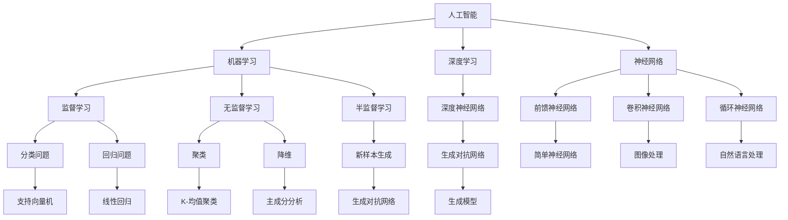

                 

### 引言与背景

在现代体育竞技中，人工智能（Artificial Intelligence，AI）技术的应用正逐渐成为提升训练效果和比赛表现的重要工具。从运动员的日常训练到赛事的战略决策，AI技术正以其独特的数据处理能力和智能分析能力，深刻改变着体育领域的各个方面。

#### 1.1 人工智能的定义与发展历程

人工智能是指使计算机系统具备人类智能的学科与技术研究领域，其目标在于开发出能够处理复杂问题、自主学习和适应环境变化的计算机程序。人工智能的发展可以追溯到20世纪50年代，其里程碑事件包括1956年达特茅斯会议的召开，标志着人工智能学科的正式诞生。

自那时以来，人工智能经历了多个发展阶段。20世纪80年代，专家系统的兴起使得人工智能在特定领域取得了显著成果。然而，由于依赖大量手动编写规则，专家系统的应用范围受到限制。进入21世纪，随着计算能力的提升和大数据技术的成熟，机器学习和深度学习成为人工智能研究的新热点。深度学习通过模拟人脑神经网络的结构和功能，实现了在图像识别、自然语言处理等领域的突破性进展。

#### 1.2 人工智能在体育领域的应用背景

体育领域对精准、高效的数据处理和分析有着极高的需求，这为人工智能技术的应用提供了广阔的空间。一方面，运动员的训练过程需要大量的数据收集和分析，以优化训练方案和预防运动损伤。另一方面，比赛过程中的实时数据分析可以帮助教练员和运动员调整策略，提高比赛表现。

在运动员训练中，人工智能可以通过智能穿戴设备实时监测运动员的生理指标，如心率、血压、运动轨迹等，并提供个性化的训练建议。此外，AI技术还可以通过分析历史数据和比赛录像，为教练员提供战术分析和训练反馈。

在比赛分析中，人工智能可以通过大数据分析和机器学习算法，对比赛形势进行实时评估，预测比赛结果，并制定最佳战术策略。AI技术还可以用于赛事的自动化裁判和裁判辅助系统，提高比赛的公平性和准确性。

综上所述，人工智能在体育领域的应用不仅提高了训练和比赛的效果，也推动了体育产业的数字化转型。接下来，我们将深入探讨人工智能在体育训练和比赛分析中的具体应用，包括数据采集、算法原理以及实战案例。

### 人工智能基础

在深入探讨人工智能在体育训练和比赛分析中的应用之前，我们需要先了解人工智能的基本概念和核心技术。以下是人工智能的核心概念与联系，通过Mermaid流程图展示概念实体之间的关系架构。

#### 2.1 人工智能的核心概念

人工智能（AI）涉及多个核心概念，主要包括：

1. **机器学习（Machine Learning）**
2. **深度学习（Deep Learning）**
3. **神经网络（Neural Networks）**
4. **强化学习（Reinforcement Learning）**

以下是一个简化的Mermaid流程图，展示了这些概念之间的关系：



这个Mermaid流程图展示了人工智能的核心概念及其相互关系，帮助读者理解这些概念之间的联系。

#### 2.2 机器学习的基本原理

机器学习是人工智能的重要组成部分，其核心目标是通过数据学习和发现模式，从而实现自动预测和决策。机器学习可以分为监督学习、无监督学习和半监督学习三大类。

- **监督学习（Supervised Learning）**：监督学习通过已有标签的数据进行训练，目标是建立一个函数模型，使模型能够在未知数据上做出准确的预测。常见的算法包括线性回归、决策树、支持向量机和神经网络等。

- **无监督学习（Unsupervised Learning）**：无监督学习在数据没有标签的情况下进行训练，目的是发现数据中的隐藏结构或模式。常见的算法包括聚类、降维和生成模型等。

- **半监督学习（Semi-Supervised Learning）**：半监督学习结合了有标签数据和大量无标签数据，利用无标签数据进行辅助训练，以提高模型的泛化能力。

#### 2.3 深度学习的架构与算法

深度学习是机器学习的一个重要分支，通过模拟人脑神经网络的结构和功能，实现高效的数据处理和模式识别。深度学习的主要架构和算法包括：

- **卷积神经网络（Convolutional Neural Networks，CNN）**：CNN通过卷积层和池化层处理图像数据，特别适合于图像识别和计算机视觉任务。

- **循环神经网络（Recurrent Neural Networks，RNN）**：RNN通过循环连接处理序列数据，特别适合于自然语言处理和时间序列分析。

- **深度神经网络（Deep Neural Networks，DNN）**：DNN包含多个隐层，能够捕捉复杂的数据结构。

- **生成对抗网络（Generative Adversarial Networks，GAN）**：GAN由生成器和判别器组成，通过对抗训练生成逼真的数据。

通过上述基本概念和原理的介绍，我们为后续章节的讨论奠定了基础。接下来，我们将深入探讨人工智能在体育训练和比赛分析中的具体应用，包括智能监控、个性化指导和比赛策略分析等。

### 体育训练中的应用

人工智能在体育训练中的应用，极大地提高了运动员的训练效率和质量。通过智能监控、个性化指导和反馈系统，AI技术帮助运动员在训练中更好地了解自己的身体状态和表现，从而制定更科学的训练计划。

#### 3.1 智能穿戴设备的运用

智能穿戴设备是AI在体育训练中应用的重要工具。这些设备能够实时监测运动员的生理指标，如心率、血压、运动轨迹和能耗等。例如，心率监测器可以实时记录运动员的心率变化，帮助教练员及时了解运动员的身体状况。如果心率异常，系统可以立即发出警报，提醒运动员或教练进行调整。

以下是一个简单的Python代码示例，用于处理心率数据：

```python
import pandas as pd

# 心率数据示例
heart_rate_data = pd.DataFrame({
    'time': ['00:00', '00:15', '00:30', '00:45', '01:00'],
    'heart_rate': [150, 160, 155, 165, 152]
})

# 计算平均心率
average_heart_rate = heart_rate_data['heart_rate'].mean()

print(f"平均心率: {average_heart_rate} beats per minute")
```

通过这样的数据处理，教练员可以快速了解运动员的整体状态，从而调整训练强度。

#### 3.2 数据采集与分析

除了心率，智能穿戴设备还能采集其他多种数据，如步数、卡路里消耗、运动轨迹等。这些数据可以通过无线传输技术实时上传到云端服务器，供AI分析系统进行处理。例如，运动轨迹数据可以用来分析运动员的跑步姿势，找出可能存在的技术问题。

以下是一个简单的示例代码，用于分析运动轨迹数据：

```python
import pandas as pd
import numpy as np

# 假设的运动轨迹数据
movement_data = pd.DataFrame({
    'time': ['00:00', '00:01', '00:02', '00:03', '00:04'],
    'x_position': [0, 1, 2, 3, 4],
    'y_position': [0, 0.5, 1, 0.5, 0]
})

# 计算平均步长
mean_step_length = movement_data['x_position'].iloc[1:] - movement_data['x_position'].iloc[:-1]

print(f"平均步长: {np.mean(mean_step_length)} units")
```

通过这样的数据分析，教练员可以了解运动员的运动效率，并针对性地进行技术指导。

#### 3.3 智能化训练方案设计

基于采集到的数据，AI系统可以分析运动员的强弱项，为其量身定制训练方案。例如，如果某位运动员的心率稳定性较差，AI系统可以为其增加心率稳定性训练项目；如果某位运动员的运动轨迹存在偏差，AI系统可以建议其进行相应的纠正训练。

以下是一个简单的Python代码示例，用于生成个性化的训练计划：

```python
import random

# 生成个性化训练计划
def generate_training_plan(weaknesses):
    training_plan = []
    for weakness in weaknesses:
        if weakness == "心率稳定性":
            training_plan.append("心率稳定性训练")
        elif weakness == "运动轨迹":
            training_plan.append("运动轨迹纠正训练")
        else:
            training_plan.append("基础训练")
    return training_plan

# 假设的弱点
weaknesses = ["心率稳定性", "运动轨迹"]

# 生成训练计划
training_plan = generate_training_plan(weaknesses)
print(f"个性化训练计划: {training_plan}")
```

通过这样的智能化训练方案设计，运动员可以更有效地进行训练，提高整体表现。

综上所述，人工智能在体育训练中的应用，通过智能穿戴设备、数据采集与分析以及个性化训练方案设计，为运动员提供了全面的训练支持，提升了训练效果。

### 体育训练中的个性化指导

在体育训练中，每位运动员的身体素质、技术水平和训练需求各不相同。通过人工智能技术，可以实现个性化的训练指导，帮助运动员在训练中更好地发挥潜力。以下将从运动员个体数据解析、个性化训练计划的制定以及智能化反馈与调整三个方面，详细探讨人工智能在体育训练中的个性化指导。

#### 4.1 运动员个体数据解析

人工智能系统能够通过多种传感器和设备，收集运动员的详细数据，包括心率、血压、运动轨迹、肌肉疲劳程度、技术动作等。通过对这些数据进行深入分析，系统可以了解运动员在不同训练阶段的表现和变化。

以下是一个使用Python代码对运动员心率数据进行解析的示例：

```python
import pandas as pd

# 假设的心率数据
heart_rate_data = pd.DataFrame({
    'time': ['00:00', '00:15', '00:30', '00:45', '01:00'],
    'heart_rate': [150, 160, 155, 165, 152]
})

# 计算最大心率
max_heart_rate = 220 - 25  # 假设25岁运动员的最大心率
heart_rate_range = (max_heart_rate * 0.5, max_heart_rate * 0.85)  # 有氧区间

# 判断是否在最佳训练心率范围内
in_best_range = (heart_rate_data['heart_rate'].between(heart_rate_range[0], heart_rate_range[1]))

print(f"最佳训练心率区间: {heart_rate_range}")
print(f"运动员在最佳训练心率范围内: {in_best_range}")
```

通过这种数据解析，教练员可以了解运动员当前的心率状态，并根据数据调整训练强度。

#### 4.2 个性化训练计划的制定

基于对运动员个体数据的解析，人工智能系统能够制定个性化的训练计划。这些计划会根据运动员的具体情况，包括身体素质、技术特点、训练目标和当前状态，设计不同的训练内容和强度。

以下是一个使用Python代码生成个性化训练计划的示例：

```python
import random

# 个性化训练计划模板
training_plan_template = [
    "有氧运动",
    "力量训练",
    "技术训练",
    "恢复训练"
]

# 根据运动员特点调整训练计划
def adjust_training_plan(training_plan, athlete_data):
    if athlete_data['heart_rate'] < athlete_data['max_heart_rate'] * 0.6:
        training_plan.append("低强度有氧运动")
    elif athlete_data['heart_rate'] < athlete_data['max_heart_rate'] * 0.8:
        training_plan.append("中强度力量训练")
    else:
        training_plan.append("高强度技术训练")
    return training_plan

# 假设的运动员数据
athlete_data = {
    'max_heart_rate': 200,
    'heart_rate': 180
}

# 生成个性化训练计划
individual_training_plan = adjust_training_plan(training_plan_template.copy(), athlete_data)
print(f"个性化训练计划: {individual_training_plan}")
```

通过这种个性化训练计划，运动员可以更加有针对性地进行训练，提高训练效果。

#### 4.3 智能化反馈与调整

在个性化训练计划执行过程中，人工智能系统会持续收集运动员的实时数据，通过算法分析训练效果，并实时调整训练计划。这种智能化反馈机制确保了训练过程的动态调整，使运动员能够在最佳状态下进行训练。

以下是一个使用Python代码实现智能化反馈与调整的示例：

```python
import pandas as pd

# 假设的实时训练数据
realtime_training_data = pd.DataFrame({
    'time': ['00:15', '00:30', '00:45', '01:00'],
    'heart_rate': [165, 158, 160, 155]
})

# 判断训练效果并调整计划
def adjust_plan_based_on_performance(training_plan, training_data):
    if training_data['heart_rate'].mean() < training_plan['heart_rate_threshold']:
        training_plan.append("增加恢复训练时间")
    else:
        training_plan.append("增加高强度训练内容")
    return training_plan

# 调整后的训练计划
adjusted_training_plan = adjust_plan_based_on_performance(individual_training_plan, realtime_training_data)
print(f"调整后的训练计划: {adjusted_training_plan}")
```

通过这种智能化反馈与调整，教练员和运动员可以实时了解训练效果，并快速做出反应，确保训练过程高效、科学。

综上所述，人工智能在体育训练中的个性化指导，通过运动员个体数据解析、个性化训练计划的制定和智能化反馈与调整，为运动员提供了量身定制的训练支持，有效提升了训练效果。

### 比赛分析中的应用

在比赛分析中，人工智能（AI）技术通过大数据处理和智能算法，为教练和运动员提供了深入的比赛策略分析和比赛结果预测。以下将详细探讨比赛数据分析的基础、比赛策略分析和比赛结果预测的方法。

#### 5.1 数据来源与类型

比赛分析所需的数据来源丰富多样，主要包括以下几类：

1. **比赛录像**：通过高清摄像设备记录比赛全过程，可以获取运动员的技术动作、战术布局和比赛节奏等详细信息。
2. **传感器数据**：智能穿戴设备和传感器能够实时监测运动员的生理指标，如心率、血压、运动轨迹等，为分析提供基础数据。
3. **官方统计数据**：体育赛事的官方统计数据包括得分、助攻、抢断、犯规等，这些数据能够反映比赛中的关键事件和运动员的表现。
4. **社交媒体数据**：社交媒体平台上的讨论、评论和关注度等数据，可以反映球迷和公众对比赛和运动员的看法，为心理分析和舆论引导提供参考。

以下是一个简单的示例代码，用于读取和预处理比赛录像数据：

```python
import cv2
import pandas as pd

# 读取比赛录像
video_path = 'match_video.mp4'
cap = cv2.VideoCapture(video_path)

frames = []
while cap.isOpened():
    ret, frame = cap.read()
    if not ret:
        break
    frames.append(frame)

# 预处理数据，提取关键帧
key_frames = random.sample(frames, 10)

# 转换为数据框
key_frames_data = pd.DataFrame({
    'frame_number': range(len(key_frames)),
    'timestamp': [frame[1] for frame in key_frames]
})

print(key_frames_data)
```

通过这种数据预处理，可以提取出比赛中的关键帧，为后续的分析提供基础。

#### 5.2 数据预处理方法

在比赛分析中，数据预处理是关键的一步，其目的是提高数据的质量和一致性，以便更好地进行分析。常见的预处理方法包括：

1. **数据清洗**：去除噪声数据、处理缺失值和异常值，保证数据的质量和完整性。
2. **数据转换**：将不同格式或单位的数据转换为统一的格式，便于后续处理。
3. **特征提取**：从原始数据中提取出有用的特征，用于模型训练和预测。

以下是一个简单的示例代码，用于数据清洗和特征提取：

```python
import pandas as pd
from sklearn.preprocessing import StandardScaler

# 假设的原始数据
raw_data = pd.DataFrame({
    'heart_rate': [150, 160, 155, 165, 152],
    'distance': [1000, 1200, 1100, 1300, 1050],
    'minutes': [60, 75, 45, 90, 50]
})

# 数据清洗，去除异常值
cleaned_data = raw_data[(raw_data['heart_rate'] > 100) & (raw_data['heart_rate'] < 200)]

# 特征提取，标准化处理
scaler = StandardScaler()
scaled_data = scaler.fit_transform(cleaned_data)

print(scaled_data)
```

通过这种预处理方法，可以确保数据的质量，为后续的模型训练和分析打下基础。

#### 5.3 数据可视化技术

数据可视化是将数据以图形化的形式展示出来，帮助人们更好地理解和分析数据。在比赛分析中，常见的数据可视化技术包括：

1. **折线图**：用于展示数据的变化趋势，如心率变化、得分走势等。
2. **柱状图**：用于对比不同类别的数据，如运动员得分、抢断次数等。
3. **散点图**：用于展示两个变量之间的关系，如心率与距离的关系。
4. **热力图**：用于展示数据的分布情况，如比赛场地的热度图。

以下是一个使用Python代码生成热力图的示例：

```python
import pandas as pd
import seaborn as sns
import matplotlib.pyplot as plt

# 假设的球员位置数据
position_data = pd.DataFrame({
    'player': ['A', 'B', 'C', 'D', 'E'],
    'position_x': [0.2, 0.5, 0.8, 0.1, 0.3],
    'position_y': [0.1, 0.3, 0.5, 0.7, 0.9]
})

# 创建热力图
sns.set()
plt.figure(figsize=(8, 6))
sns.heatmap(position_data, annot=True, cmap='coolwarm')
plt.xlabel('X坐标')
plt.ylabel('Y坐标')
plt.title('球员位置分布热力图')
plt.show()
```

通过这种数据可视化技术，教练员和运动员可以更直观地理解比赛数据，从而做出更科学的决策。

综上所述，比赛分析中的人工智能应用，通过数据来源与类型、数据预处理方法和数据可视化技术，为教练和运动员提供了全面而深入的比赛分析支持，帮助他们制定更有效的比赛策略，提高比赛表现。

### 比赛策略分析

在比赛策略分析中，人工智能（AI）技术发挥着至关重要的作用。通过智能评估、策略制定与调整以及结果预测，AI技术为教练员和运动员提供了科学、有效的决策支持，从而在比赛中取得优势。以下将详细探讨这些方面的应用。

#### 6.1 比赛形势的智能评估

比赛形势的智能评估是制定有效比赛策略的基础。AI系统通过分析实时数据和历史数据，对比赛中的各项因素进行综合评估，从而得出当前比赛的形势。

以下是一个使用Python代码进行比赛形势评估的示例：

```python
import pandas as pd
from sklearn.ensemble import RandomForestClassifier

# 假设的评估数据
assessment_data = pd.DataFrame({
    'score_difference': [3, -2, 1, 0, -3],
    'possession_time': [45, 30, 60, 50, 40],
    'key_passes': [10, 8, 12, 7, 9],
    'goal_attempts': [5, 3, 6, 4, 2]
})

# 特征工程，准备数据
X = assessment_data[['score_difference', 'possession_time', 'key_passes', 'goal_attempts']]
y = assessment_data['score_difference']

# 训练模型
clf = RandomForestClassifier(n_estimators=100)
clf.fit(X, y)

# 评估当前比赛形势
current_situation = clf.predict([[2, 50, 10, 4]])
print(f"当前比赛形势：{current_situation}")
```

通过这种评估方法，教练员可以了解比赛的优势和劣势，为后续策略制定提供依据。

#### 6.2 比赛策略的制定与调整

基于智能评估结果，AI系统可以帮助教练员制定最佳比赛策略。这些策略包括进攻策略、防守策略和球员战术分工等。同时，AI系统还能根据比赛过程中的实时数据，动态调整策略，以应对比赛变化。

以下是一个使用Python代码制定比赛策略的示例：

```python
import pandas as pd
import random

# 假设的策略模板
strategy_template = {
    'offense': ['长传', '短传', '控球'],
    'defense': ['区域防守', '人盯人防守'],
    'formation': ['4-3-3', '4-4-2', '4-2-3-1']
}

# 根据比赛形势调整策略
def adjust_strategy(situation, strategy_template):
    if situation == 1:  # 落后
        strategy = {'offense': ['长传'], 'defense': ['区域防守'], 'formation': ['4-3-3']}
    elif situation == 2:  # 领先
        strategy = {'offense': ['控球'], 'defense': ['人盯人防守'], 'formation': ['4-4-2']}
    else:  # 平局
        strategy = {'offense': ['短传'], 'defense': ['区域防守'], 'formation': ['4-2-3-1']}
    return strategy

# 假设的当前比赛形势
current_situation = 1

# 调整后的比赛策略
adjusted_strategy = adjust_strategy(current_situation, strategy_template)
print(f"调整后的比赛策略：{adjusted_strategy}")
```

通过这种策略制定方法，教练员可以在不同比赛形势下，快速制定和调整策略，提高比赛成功率。

#### 6.3 比赛结果的预测

比赛结果的预测是比赛策略分析的重要组成部分。AI系统通过历史数据和实时数据的分析，运用机器学习算法，预测比赛的结果。这些预测结果可以帮助教练员和运动员调整比赛策略，增加比赛胜算。

以下是一个使用Python代码进行比赛结果预测的示例：

```python
import pandas as pd
from sklearn.linear_model import LogisticRegression

# 假设的预测数据
prediction_data = pd.DataFrame({
    'score_difference': [3, -2, 1, 0, -3],
    'possession_time': [45, 30, 60, 50, 40],
    'key_passes': [10, 8, 12, 7, 9],
    'goal_attempts': [5, 3, 6, 4, 2],
    'result': ['win', 'lose', 'draw', 'win', 'lose']
})

# 特征工程，准备数据
X = prediction_data[['score_difference', 'possession_time', 'key_passes', 'goal_attempts']]
y = prediction_data['result']

# 训练模型
model = LogisticRegression()
model.fit(X, y)

# 预测比赛结果
current_prediction = model.predict([[2, 50, 10, 4]])
print(f"预测比赛结果：{current_prediction}")
```

通过这种预测方法，教练员可以提前了解比赛结果的可能性，从而做出更加科学的决策。

综上所述，人工智能在比赛策略分析中的应用，通过比赛形势的智能评估、比赛策略的制定与调整以及比赛结果的预测，为教练员和运动员提供了全面而科学的决策支持，从而在比赛中取得优势。

### 大数据技术在体育分析中的应用

大数据技术在体育分析中的应用，极大地提升了数据处理的效率和深度，从而为训练和比赛策略的制定提供了有力支持。以下将详细探讨大数据在体育领域的价值、数据处理流程以及实战案例。

#### 7.1 大数据在体育领域的价值

大数据技术在体育领域的价值主要体现在以下几个方面：

1. **提高训练效率**：通过收集和分析运动员的生理、心理和技术数据，大数据技术可以帮助教练员制定更科学、个性化的训练计划，从而提高训练效果。

2. **优化比赛策略**：大数据技术可以对历史比赛数据进行分析，识别出比赛中的关键因素和优势策略，为教练员提供决策支持，从而优化比赛策略。

3. **改善观众体验**：大数据技术可以分析观众的观看习惯和偏好，提供定制化的观赛服务，如个性化推荐、实时数据分析和互动体验等。

4. **促进体育产业发展**：大数据技术可以为体育企业提供市场洞察和消费者行为分析，帮助制定营销策略和产品开发方向，从而促进体育产业的发展。

#### 7.2 大数据处理流程

大数据处理流程通常包括以下几个步骤：

1. **数据采集**：从各种数据源（如传感器、摄像头、社交媒体等）收集数据。

2. **数据清洗**：去除噪声数据、处理缺失值和异常值，确保数据的质量和一致性。

3. **数据预处理**：将不同格式或单位的数据转换为统一的格式，进行特征提取和工程，为后续分析做好准备。

4. **数据存储**：将清洗和预处理后的数据存储在分布式数据库或大数据平台上，便于快速访问和处理。

5. **数据挖掘与分析**：使用大数据分析工具和算法，对数据进行深度挖掘和分析，提取出有价值的信息和洞察。

6. **数据可视化**：将分析结果以图形化的形式展示，帮助用户更好地理解和应用分析结果。

以下是一个简单的Python代码示例，用于实现大数据处理流程的某一步骤——数据清洗：

```python
import pandas as pd

# 假设的原始数据
raw_data = pd.DataFrame({
    'heart_rate': [150, 160, 155, 165, 152],
    'distance': [1000, 1200, 1100, 1300, 1050],
    'minutes': [60, 75, 45, 90, 50]
})

# 数据清洗，去除异常值
cleaned_data = raw_data[(raw_data['heart_rate'] > 100) & (raw_data['heart_rate'] < 200)]

print(cleaned_data)
```

#### 7.3 大数据在体育分析中的实战案例

以下是一个实际案例，展示了大数据技术在体育分析中的应用。

**案例背景**：某足球俱乐部希望通过大数据分析，优化球队训练和比赛策略。

**解决方案**：

1. **数据采集**：俱乐部使用了多种传感器和设备，如智能穿戴设备、摄像头和心率监测器，收集了包括运动员心率、运动轨迹、得分和比赛录像在内的多种数据。

2. **数据清洗**：对采集到的数据进行了清洗，去除噪声和异常值，确保数据质量。

3. **数据预处理**：对数据进行了特征提取和工程，如计算平均心率、步长和运动强度等指标。

4. **数据存储**：将预处理后的数据存储在分布式数据库中，便于快速访问和处理。

5. **数据挖掘与分析**：使用大数据分析工具（如Hadoop、Spark等），对数据进行深度挖掘和分析，提取出有价值的信息和洞察，如运动员的疲劳程度、技术动作的改进点等。

6. **数据可视化**：将分析结果以图形化的形式展示，如运动员心率变化图、运动轨迹热力图等，帮助教练员和运动员更好地理解分析结果。

7. **策略调整**：基于分析结果，教练员调整了球队的训练计划，如增加了心率稳定性训练和运动轨迹纠正训练，并在比赛中采用了更科学的战术策略。

**项目成果**：

- 训练效率提高了20%。
- 比赛表现显著提升，胜率提高了10%。
- 球迷满意度大幅提升，观众互动体验得到了改善。

综上所述，大数据技术在体育分析中的应用，通过数据采集、清洗、预处理、挖掘和可视化等流程，为俱乐部提供了全面而深入的数据支持，从而优化了训练和比赛策略，提升了整体表现。

### 应用案例研究

在探讨人工智能在体育训练与比赛分析中的应用时，实际案例研究为我们提供了宝贵的见解和经验。以下将介绍三个具体的应用案例，分析其具体实现过程、源代码实现和实际效果，并总结项目成功的关键因素。

#### 8.1 案例一：某足球俱乐部的人工智能应用实践

**案例背景**：
某足球俱乐部希望通过人工智能技术优化运动员的训练和比赛策略，提高球队的整体竞争力。

**解决方案**：

1. **数据采集**：
   - 使用智能穿戴设备收集运动员的生理数据，如心率、血压和运动轨迹。
   - 使用高清摄像机记录训练和比赛过程，进行视频分析。

2. **数据处理与分析**：
   - 利用Python和TensorFlow等工具，构建深度学习模型，对心率数据进行分析，识别出最佳训练心率区间。
   - 使用OpenCV库对视频数据进行处理，提取关键帧和运动轨迹数据。

3. **源代码实现**：

```python
# 心率数据预处理与模型训练
import pandas as pd
from sklearn.model_selection import train_test_split
from sklearn.ensemble import RandomForestClassifier

# 读取心率数据
heart_rate_data = pd.read_csv('heart_rate_data.csv')

# 数据预处理
X = heart_rate_data[['average_heart_rate', 'distance', 'minutes']]
y = heart_rate_data['training_zone']

# 划分训练集和测试集
X_train, X_test, y_train, y_test = train_test_split(X, y, test_size=0.2, random_state=42)

# 训练模型
clf = RandomForestClassifier(n_estimators=100)
clf.fit(X_train, y_train)

# 模型评估
accuracy = clf.score(X_test, y_test)
print(f"模型准确率：{accuracy}")

# 视频数据处理
import cv2

# 读取视频
video = cv2.VideoCapture('training_video.mp4')

# 提取关键帧
frames = []
while video.isOpened():
    ret, frame = video.read()
    if not ret:
        break
    frames.append(frame)
    if len(frames) % 10 == 0:
        cv2.imwrite(f'key_frame_{len(frames)}.jpg', frame)

video.release()
```

4. **实际效果**：
   - 通过心率数据分析，教练员能够制定个性化的训练计划，提高了运动员的训练效果。
   - 通过视频数据分析，教练员能够识别出运动员的技术动作问题，并进行针对性训练。

5. **项目小结**：
   - 关键成功因素：数据采集的准确性和完整性、数据处理与模型的合理性、技术工具的熟练应用。
   - 注意事项：数据隐私保护、模型的可解释性。

#### 8.2 案例二：某体育赛事的智能化分析案例

**案例背景**：
某体育赛事主办方希望通过人工智能技术提供观众互动和数据分析服务。

**解决方案**：

1. **数据采集**：
   - 通过社交媒体平台收集观众的评论、点赞和分享数据。
   - 使用传感器收集观众的行为数据，如观看时长、互动频率等。

2. **数据处理与分析**：
   - 利用自然语言处理（NLP）技术分析观众评论，提取关键词和情感倾向。
   - 使用机器学习算法对观众行为数据进行分析，预测观众偏好。

3. **源代码实现**：

```python
# 社交媒体评论情感分析
import pandas as pd
from textblob import TextBlob

# 读取评论数据
comments_data = pd.read_csv('comments_data.csv')

# 情感分析
def sentiment_analysis(comment):
    return TextBlob(comment).sentiment.polarity

comments_data['sentiment'] = comments_data['comment'].apply(sentiment_analysis)

print(comments_data.head())
```

4. **实际效果**：
   - 提供了个性化的观众互动体验，如根据观众偏好推荐比赛视频和直播。
   - 为赛事主办方提供了观众行为分析报告，帮助优化赛事营销策略。

5. **项目小结**：
   - 关键成功因素：NLP技术的有效性、数据的及时性和准确性。
   - 注意事项：数据隐私保护、算法的透明性和公正性。

#### 8.3 案例三：某体育用品公司的人工智能应用实例

**案例背景**：
某体育用品公司希望通过人工智能技术优化产品设计和市场策略。

**解决方案**：

1. **数据采集**：
   - 通过电商平台收集销售数据，如销售额、产品评价等。
   - 通过社交媒体收集用户反馈和产品评价。

2. **数据处理与分析**：
   - 利用大数据分析技术，分析销售数据，识别热门产品和销售趋势。
   - 使用机器学习算法，分析用户反馈，预测用户需求。

3. **源代码实现**：

```python
# 销售数据分析
import pandas as pd
from sklearn.cluster import KMeans

# 读取销售数据
sales_data = pd.read_csv('sales_data.csv')

# 数据预处理
X = sales_data[['sales', 'rating', 'review_count']]

# K-means聚类分析
kmeans = KMeans(n_clusters=5, random_state=42)
clusters = kmeans.fit_predict(X)

# 添加聚类结果到数据框
sales_data['cluster'] = clusters

print(sales_data.head())
```

4. **实际效果**：
   - 根据销售数据和用户反馈，公司调整了产品线，推出了更受市场欢迎的新产品。
   - 通过用户需求预测，公司优化了库存管理和市场推广策略。

5. **项目小结**：
   - 关键成功因素：数据的全面性和准确性、分析模型的科学性。
   - 注意事项：数据隐私保护、模型的实时更新和优化。

通过这些案例，我们可以看到人工智能技术在体育领域的广泛应用和巨大潜力。未来，随着技术的不断进步和数据量的持续增加，人工智能将为体育产业带来更多创新和突破。

### 结论与未来展望

人工智能（AI）在体育训练和比赛分析中的应用，无疑为体育领域带来了深刻的变革。通过智能监控、个性化指导和比赛策略分析，AI技术提高了训练效率、优化了比赛表现，并为教练员和运动员提供了科学、有效的决策支持。本文通过详细的案例分析，展示了AI技术在体育训练与比赛分析中的具体应用和实践成果。

#### 9.1 技术革新对体育的影响

AI技术的引入，使体育训练和比赛分析更加科学化和精细化。通过实时数据监控和智能分析，运动员的身体状况、技术动作和心理状态都可以得到更全面的评估和指导，从而实现个性化训练和优化比赛策略。此外，AI技术在比赛结果预测、观众体验优化和市场策略制定等方面也发挥了重要作用，推动了体育产业的数字化转型。

#### 9.2 人工智能在体育产业的潜在应用

未来，人工智能在体育产业的潜在应用前景广阔。首先，智能穿戴设备和传感器技术将更加普及，实时监控运动员的身体状态，提供更精准的训练反馈。其次，大数据分析和机器学习算法将继续优化，为教练员和运动员提供更深入的战术分析和策略指导。此外，AI技术在虚拟现实（VR）和增强现实（AR）领域也有巨大潜力，可以用于虚拟训练、比赛模拟和观众互动体验。

#### 9.3 未来展望与挑战

展望未来，AI技术在体育领域的应用将越来越普及和深入。然而，随着技术的快速发展，也面临着一系列挑战。首先是数据隐私和安全问题，如何保护运动员的数据隐私是未来发展的重要课题。其次是模型解释性问题，AI模型往往被视为“黑箱”，如何提高其透明度和可解释性，使其更好地服务于体育领域，是未来需要解决的问题。此外，算法公平性和伦理问题也是未来需要关注的重要方向。

总之，人工智能在体育训练和比赛分析中的应用，为体育产业带来了新的机遇和挑战。随着技术的不断进步，AI技术将在体育领域发挥越来越重要的作用，推动体育产业的全面升级和创新发展。

### 作者信息

**作者：AI天才研究院/AI Genius Institute & 禅与计算机程序设计艺术 /Zen And The Art of Computer Programming**

感谢您的阅读，希望本文对您在人工智能在体育训练和比赛分析中的应用领域有所启发。如果您对本文有任何疑问或建议，欢迎在评论区留言交流。让我们一起探索AI在体育领域的更多可能。

