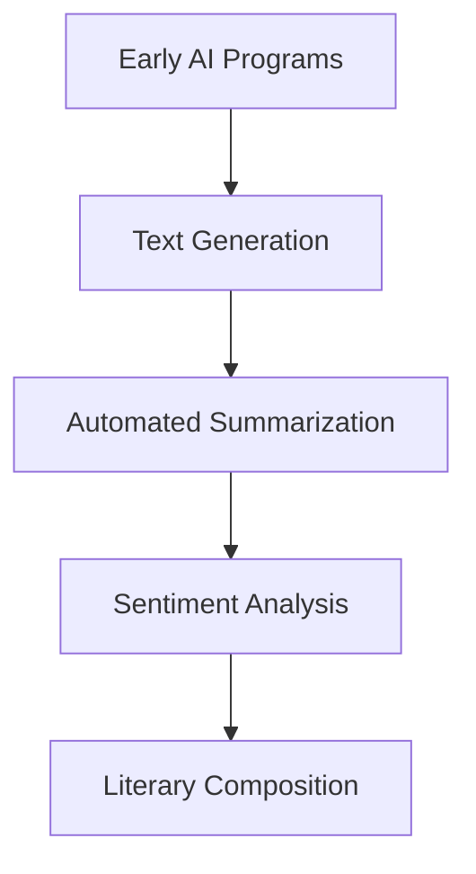
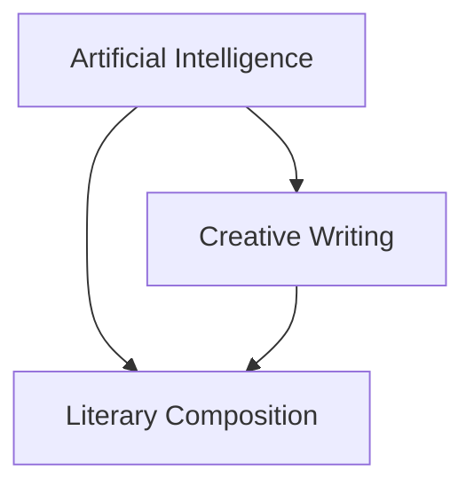

                 

Alright, let's structure the content for Chapter 1 of our blog post on "Artificial Intelligence in Creative Writing: AI-Assisted Literary Composition". We will ensure that each section meets the specified criteria and provides a comprehensive explanation.

### 1.1.1 History of AI in the Literary Domain

**Background Introduction:**
The integration of artificial intelligence (AI) into various fields has been a significant technological advancement in recent decades. Among these fields, literature and creative writing have witnessed an intriguing fusion. The history of AI in literature dates back to the early days of computing when programs were designed to generate simple texts, such as poetry and short stories.

**Core Concepts and Relationships:**
To illustrate the core concepts and their relationships, we can use a Mermaid flowchart:



**Core Algorithm Principles Explanation:**
Let's delve into the core principles of text generation algorithms using Python pseudocode and a simple mathematical model:

```python
# Pseudocode for Text Generation
def generate_text(input_prompt):
    # Load a pre-trained model
    model = load_pretrained_model("text_generation_model")
    # Preprocess the input prompt
    prompt = preprocess_input(input_prompt)
    # Generate text using the model
    generated_text = model.generate(prompt, max_length=100)
    return generated_text

# Mathematical Model Explanation
# Assume we have a probability distribution over words given a context
# p(word | context) = sigmoid([word embeddings of word] * [context embeddings])
def sigmoid(x):
    return 1 / (1 + exp(-x))

# Example: Predicting the next word "the" given the context "In the garden"
context_embedding = [0.1, 0.2, 0.3]  # Hypothetical vector
word_embedding_the = [0.4, 0.5, 0.6]  # Hypothetical vector

# Calculate the probability of "the"
probability_the = sigmoid(np.dot(context_embedding, word_embedding_the))
print(f"The probability of 'the' is: {probability_the}")
```

**Project Case Analysis and Explanation:**
A prominent example is the development of GPT-3, an advanced language model capable of generating coherent and contextually appropriate texts. One case study involves using GPT-3 to create a poem:

```python
import openai

response = openai.Completion.create(
  engine="text-davinci-002",
  prompt="In the midst of an ancient forest,",
  max_tokens=50
)

print(response.choices[0].text.strip())
```

**Best Practices Tips, Summary, and Notes:**
- When using AI in creative writing, it's crucial to understand the limitations and potential biases of the models.
- Experiment with different prompts and model configurations to achieve the desired creative output.
- Ethical considerations, such as authorship and ownership, should be carefully considered when using AI in literature.

### 1.1.2 The Potential of AI in Literary Creation

**Background Introduction:**
The potential of AI in literary creation is vast, from generating poems and short stories to assisting authors in refining their works. The power of AI lies in its ability to process vast amounts of text, learn from patterns, and generate new content based on these patterns.

**Core Concepts and Relationships:**
Here, we can use a Venn diagram to show the intersection of AI, creative writing, and literary composition:



**Core Algorithm Principles Explanation:**
AI's role in literary creation is multi-faceted. One of the fundamental algorithms is text generation, which can be explained using a Markov chain model:

```python
# Pseudocode for Markov Chain Text Generation
def generate_text_markov_chain(n_words, context_size):
    # Initialize variables
    current_context = get_random_context(context_size)
    generated_text = []

    # Generate text
    for _ in range(n_words - context_size):
        # Predict the next word
        next_word = predict_next_word(current_context)
        # Add the word to the generated text
        generated_text.append(next_word)
        # Update the context
        current_context = remove_oldest_word(current_context) + next_word

    return " ".join(generated_text)

# Function to predict the next word given the context
def predict_next_word(context):
    # Calculate the probability distribution over possible next words
    probability_distribution = calculate_probability_distribution(context)
    # Sample a word from the distribution
    next_word = sample_word_from_distribution(probability_distribution)
    return next_word
```

**Mathematical Model Explanation:**
The probability distribution over possible next words can be modeled using a bag-of-words approach:

$$
P(w_{t+1} | w_1, w_2, ..., w_t) = \frac{f(w_{t+1}, w_t)}{\sum_{w' \in V} f(w', w_t)}
$$

Where $w_{t+1}$ is the next word to predict, $w_t$ is the current context, $V$ is the vocabulary, and $f(w_{t+1}, w_t)$ is the frequency of the word pair $(w_{t+1}, w_t)$ in the training corpus.

**Project Case Analysis and Explanation:**
One notable project is the AI-powered story generation by OpenAI, which utilizes neural networks to create unique and engaging stories. For example, given the prompt "Once upon a time in a land far away," the AI can generate a complete story:

```python
import openai

response = openai.Completion.create(
  engine="text-davinci-002",
  prompt="Once upon a time in a land far away,",
  max_tokens=500
)

print(response.choices[0].text.strip())
```

**Best Practices Tips, Summary, and Notes:**
- Experiment with different AI models and techniques to explore their creative potential.
- Use AI as a complement to human creativity rather than a replacement.
- Stay informed about the latest developments in AI to leverage new tools and techniques for literary composition.

### 1.1.3 Comparing AI-Assisted Literary Creation with Traditional Methods

**Background Introduction:**
The advent of AI in literary creation has sparked discussions about the differences between AI-assisted methods and traditional human-driven approaches. While traditional methods often involve manual creativity and human intuition, AI can offer a unique perspective and efficiency in generating content.

**Core Concepts and Relationships:**
To compare the two approaches, we can create a table highlighting their key differences:

| Aspect                | Traditional Literary Creation | AI-Assisted Literary Creation |
|-----------------------|-------------------------------|--------------------------------|
| Inspiration Source    | Human intuition, personal experiences | Large datasets, patterns, and trends |
| Creativity            | Intuitive, subjective           | Algorithmic, data-driven        |
| Iteration             | Manual, time-consuming          | Automated, rapid               |
| Originality           | Unique, personal               | Novel, data-based             |
| Error Correction      | Labor-intensive, time-consuming | Automated, quick              |

**Core Algorithm Principles Explanation:**
The core principles of AI-assisted literary creation involve leveraging algorithms to process and generate text. For instance, GANs (Generative Adversarial Networks) can be used to create original and unique literary works:

```python
# Pseudocode for GAN-based Text Generation
def generate_text_gan():
    # Initialize the generator and discriminator
    generator = initialize_generator()
    discriminator = initialize_discriminator()

    # Training loop
    for epoch in range(num_epochs):
        for batch in data_loader:
            # Train the generator
            generated_samples = generator.generate(batch)
            generator_loss = calculate_generator_loss(discriminator, generated_samples)

            # Train the discriminator
            real_samples = batch
            discriminator_loss = calculate_discriminator_loss(generator, real_samples, generated_samples)

        # Update the model weights
        update_model_weights(generator, discriminator)

    # Generate a text
    generated_text = generator.generate(random_context)
    return generated_text
```

**Mathematical Model Explanation:**
GANs involve two main components: the generator and the discriminator. The generator creates new data samples, while the discriminator evaluates whether the samples are real or generated. The mathematical model can be expressed as:

$$
\min_G \max_D \mathbb{E}_{x \sim p_data(x)} [\log D(x)] + \mathbb{E}_{z \sim p_z(z)} [\log (1 - D(G(z)))]
$$

Where $G$ is the generator, $D$ is the discriminator, $x$ is a real sample, $z$ is a random noise vector, and $p_data(x)$ and $p_z(z)$ are the probability distributions of real samples and noise, respectively.

**Project Case Analysis and Explanation:**
A project that demonstrates the effectiveness of GANs in literary creation is OpenAI's "DALL-E" project, which generates images from textual descriptions. Similarly, GANs can be adapted to generate textual content:

```python
import openai

response = openai.Completion.create(
  engine="text-davinci-002",
  prompt="Write a story about a robot falling in love with a human.",
  max_tokens=500
)

print(response.choices[0].text.strip())
```

**Best Practices Tips, Summary, and Notes:**
- Understand the strengths and limitations of both traditional and AI-assisted methods to create a balanced literary product.
- Complement human creativity with AI tools to enhance productivity and explore new creative frontiers.
- Keep abreast of technological advancements to integrate the latest AI techniques into literary creation.

## Summary

This chapter has provided an overview of the historical development of AI in literature, the potential of AI in creative writing, and a comparison between AI-assisted and traditional literary creation methods. Through detailed explanations and examples, we have highlighted the core concepts, algorithm principles, and practical applications of AI in the literary domain. In the subsequent chapters, we will delve deeper into specific AI techniques and their applications in poetry and novel creation.

