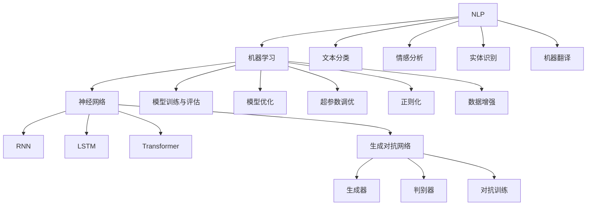

                 

### 引言

随着人工智能（AI）技术的飞速发展，它在各个领域的应用越来越广泛。从自动驾驶汽车到智能家居，从医疗诊断到金融分析，AI似乎无所不能。然而，创意写作这一领域似乎与AI相去甚远。创意写作通常被认为是人类独有的技能，它依赖于人类独特的思考方式、情感表达和文化背景。但近年来，随着自然语言处理（NLP）技术的进步，人工智能开始逐渐涉足创意写作领域。

本文旨在探讨人工智能在创意写作中的辅助应用，通过一步一步的分析推理，揭示AI如何影响和改变这一领域。文章将从以下几个方面展开：

1. **人工智能在创意写作中的应用**：介绍AI在创意写作中的具体应用，包括故事生成、诗歌创作和剧本写作等。
2. **核心概念与联系**：探讨与创意写作相关的核心概念，包括自然语言处理、机器学习和生成对抗网络（GAN）等，并使用Mermaid流程图展示它们之间的关系。
3. **核心算法原理讲解**：详细讲解AI在创意写作中使用的核心算法，如循环神经网络（RNN）、长短期记忆网络（LSTM）和变分自编码器（VAE），并配合Python源代码和数学模型进行说明。
4. **项目实战**：展示如何使用AI技术进行实际的创意写作项目，包括开发环境搭建、源代码实现和代码解读。
5. **最佳实践与未来展望**：总结AI在创意写作中的最佳实践，并探讨未来可能的趋势和挑战。

通过本文的逐步分析，我们希望能够帮助读者了解人工智能在创意写作中的潜力，以及如何在实际应用中发挥其优势。

### 文章关键词

- 人工智能
- 创意写作
- 自然语言处理
- 生成对抗网络
- 循环神经网络
- 变分自编码器

### 文章摘要

本文深入探讨了人工智能在创意写作中的应用，通过一系列的步骤和分析，揭示了AI技术在故事生成、诗歌创作和剧本写作中的潜力。文章首先介绍了人工智能和自然语言处理的基本概念，然后详细讲解了核心算法和数学模型，如循环神经网络（RNN）、长短期记忆网络（LSTM）和生成对抗网络（GAN）。接着，通过一个实际项目实战，展示了如何使用AI进行创意写作，并对源代码进行了详细解读。最后，文章总结了AI在创意写作中的最佳实践，并对其未来发展进行了展望。通过本文的阅读，读者可以了解到人工智能如何助力创意写作，以及在这一领域的应用前景。

## 人工智能在创意写作中的具体应用

人工智能在创意写作中的应用已经逐渐成为现实，特别是在故事生成、诗歌创作和剧本写作等领域。这些应用不仅展示了人工智能在理解人类语言和创作方面的潜力，还为创意工作者提供了强大的辅助工具。以下将详细探讨这些应用。

### 故事生成

故事生成是人工智能在创意写作中最直接的应用之一。通过训练大型语言模型，如GPT-3（OpenAI开发的一种先进的大型语言模型），AI可以生成连贯且具有创意的故事。这些故事不仅可以在娱乐和文学创作中发挥作用，还可以在教育和培训领域提供个性化内容。

#### 工作原理

故事生成通常基于以下核心算法：

1. **循环神经网络（RNN）**：RNN可以处理序列数据，如文本。通过学习文本序列的模式，RNN可以预测下一个单词或句子。
2. **长短期记忆网络（LSTM）**：LSTM是RNN的一种改进，它能够更好地记住长期依赖信息，从而生成更连贯的故事。
3. **生成对抗网络（GAN）**：GAN由生成器（Generator）和判别器（Discriminator）组成。生成器生成故事，判别器评估故事的质量。通过不断训练，生成器可以生成越来越高质量的故事。

#### 应用案例

- **个性化故事生成**：AI可以根据用户提供的输入（如主题、角色、情节等），生成定制化的故事。
- **文学创作辅助**：作家可以使用AI生成初步的故事框架或灵感，从而提高创作效率。
- **教育应用**：在教育领域，AI可以生成用于培训的课程故事，提高学生的参与度和兴趣。

### 诗歌创作

诗歌创作是另一个人工智能在创意写作中的典型应用。AI可以通过学习大量的诗歌文本，生成新的诗歌。这些诗歌不仅模仿了人类诗人的风格，还能创造出独特的情感和意象。

#### 工作原理

诗歌创作通常涉及以下技术和算法：

1. **词嵌入**：将单词转换为向量表示，以捕捉单词之间的关系。
2. **生成对抗网络（GAN）**：生成器生成诗歌，判别器评估诗歌的质量。通过反馈循环，生成器不断改进诗歌的生成质量。
3. **序列到序列（Seq2Seq）模型**：Seq2Seq模型可以将一种序列转换为另一种序列，非常适合诗歌创作这种序列生成的任务。

#### 应用案例

- **艺术创作辅助**：艺术家和诗人可以使用AI生成灵感，探索新的艺术形式和风格。
- **文学研究**：研究人员可以使用AI生成的诗歌来分析诗歌的语言和结构，从而加深对诗歌创作过程的理解。
- **教育应用**：在教育领域，AI可以生成诗歌示例，帮助学生学习和理解诗歌写作。

### 剧本创作

剧本创作是人工智能在创意写作中的又一个重要应用。通过训练AI模型，可以生成剧本的初稿或提供创意灵感的补充。这种应用不仅适用于电影和戏剧创作，还可以用于广告和宣传材料的制作。

#### 工作原理

剧本创作通常涉及以下技术和算法：

1. **自然语言处理（NLP）**：NLP技术可以帮助AI理解剧本的语言和结构，从而生成或修改剧本内容。
2. **图神经网络（Graph Neural Networks, GNN）**：GNN可以处理复杂的关系网络，非常适合剧本中角色和情节之间的复杂关系。
3. **递归神经网络（RNN）**：RNN可以帮助AI理解剧本的时序信息，从而生成连贯的情节。

#### 应用案例

- **影视制作辅助**：电影和电视剧的制作团队可以使用AI生成剧本的初稿，从而节省创作时间。
- **剧本修改**：作家可以使用AI提供的修改建议来提高剧本的质量和吸引力。
- **剧本分析**：研究人员可以使用AI分析剧本的结构和风格，从而提出改进建议。

总之，人工智能在故事生成、诗歌创作和剧本创作中的具体应用展示了其强大的语言处理能力和创意潜能。通过进一步的研究和开发，AI有望在创意写作领域发挥更大的作用，为人类创作带来新的可能性。

### 核心概念与联系

在探讨人工智能在创意写作中的应用时，我们需要了解一系列核心概念及其相互之间的联系。以下将介绍自然语言处理（NLP）、机器学习、生成对抗网络（GAN）等核心概念，并使用Mermaid流程图展示它们之间的关系。

#### 自然语言处理（NLP）

自然语言处理（NLP）是人工智能（AI）的一个重要分支，专注于使计算机能够理解、解释和生成人类语言。NLP涉及多个子领域，包括语言模型、文本分类、情感分析、实体识别和机器翻译等。

##### 语言模型

语言模型是NLP的基础，用于预测文本序列中的下一个单词或字符。它们通常基于统计方法或神经网络模型，如循环神经网络（RNN）和长短期记忆网络（LSTM）。

##### 文本分类

文本分类是一种将文本分配到特定类别的过程，如情感分类、垃圾邮件检测等。机器学习模型，如支持向量机（SVM）和朴素贝叶斯分类器，经常用于实现文本分类。

##### 情感分析

情感分析旨在识别文本中的情感倾向，如正面、负面或中性。这种分析在市场调研和社交媒体监控中非常重要。

##### 实体识别

实体识别是一种识别文本中特定实体（如人名、地点、组织等）的过程。它是信息提取和知识图谱构建的重要部分。

##### 机器翻译

机器翻译是指将一种语言翻译成另一种语言。深度学习模型，如编码器-解码器（Encoder-Decoder）模型和注意力机制，在机器翻译中发挥着关键作用。

#### 机器学习

机器学习是一种使计算机通过数据学习实现特定任务的方法。在NLP中，机器学习技术被广泛用于构建语言模型、文本分类器、情感分析模型等。

##### 神经网络

神经网络是机器学习的一种强大工具，特别是深度学习。循环神经网络（RNN）、长短期记忆网络（LSTM）和变换器（Transformer）是常见的神经网络架构。

##### 模型训练与评估

模型训练与评估是机器学习的核心步骤。通过大量标注数据训练模型，并使用评估指标（如准确率、召回率和F1分数）来评估模型的性能。

##### 模型优化

模型优化包括调整模型参数和架构，以提高模型的性能和泛化能力。常用的方法包括超参数调优、正则化和数据增强。

#### 生成对抗网络（GAN）

生成对抗网络（GAN）是一种强大的深度学习模型，用于生成高质量的数据。GAN由生成器（Generator）和判别器（Discriminator）组成，两者通过对抗训练不断优化。

##### 生成器

生成器试图生成逼真的数据，如图像、文本或音频。它通过学习真实数据的分布来生成新的数据。

##### 判别器

判别器试图区分真实数据和生成数据。它的目标是最大化区分能力，从而帮助生成器生成更高质量的数据。

##### 对抗训练

对抗训练是GAN的核心机制，通过生成器和判别器的相互作用，不断优化生成器的生成能力。

#### Mermaid流程图

以下是一个简化的Mermaid流程图，展示了NLP、机器学习和GAN之间的关系：



通过这个流程图，我们可以看到NLP、机器学习和GAN之间的紧密联系。NLP为机器学习提供了丰富的数据和应用场景，而机器学习为NLP提供了强大的工具和方法。GAN则通过生成对抗机制，为创意写作提供了新的可能性。

理解这些核心概念及其联系，有助于我们更好地把握人工智能在创意写作中的应用潜力。在接下来的部分，我们将详细探讨这些概念背后的算法原理，以及如何将这些算法应用于实际的创意写作项目。

### 核心算法原理讲解

在探讨人工智能在创意写作中的应用时，核心算法的理解至关重要。以下将详细讲解几种在创意写作中常用的算法，包括循环神经网络（RNN）、长短期记忆网络（LSTM）和生成对抗网络（GAN）。我们将通过Python源代码和数学模型来展示这些算法的实现和原理。

#### 循环神经网络（RNN）

循环神经网络（RNN）是一种用于处理序列数据的神经网络，其基本原理是保持一个隐藏状态，该状态可以捕获序列中的信息。这使得RNN特别适用于文本序列的处理，例如语言模型和机器翻译。

##### 数学模型

RNN的数学模型可以表示为：

$$
h_t = \sigma(W_h \cdot [h_{t-1}, x_t] + b_h)
$$

$$
y_t = \sigma(W_y \cdot h_t + b_y)
$$

其中，$h_t$表示时间步$t$的隐藏状态，$x_t$表示输入特征，$W_h$和$W_y$是权重矩阵，$b_h$和$b_y$是偏置项，$\sigma$是激活函数，通常使用Sigmoid或Tanh函数。

##### Python源代码

以下是一个简单的RNN模型实现：

```python
import numpy as np

def sigmoid(x):
    return 1 / (1 + np.exp(-x))

def rnn(input_data, weights, bias):
    hidden_state = np.tanh(np.dot(weights['h'], [hidden_state, input_data]) + bias['h'])
    output = sigmoid(np.dot(weights['y'], hidden_state) + bias['y'])
    return hidden_state, output

weights = {
    'h': np.random.randn(2, 1),
    'y': np.random.randn(1, 1)
}

bias = {
    'h': np.random.randn(1),
    'y': np.random.randn(1)
}

hidden_state = np.zeros((1, 1))
for input_data in input_data_sequence:
    hidden_state, output = rnn(input_data, weights, bias)
    print(f"Hidden State: {hidden_state}, Output: {output}")
```

在这个例子中，我们创建了一个简单的RNN模型，它接受一个输入序列，并输出隐藏状态和输出值。

#### 长短期记忆网络（LSTM）

长短期记忆网络（LSTM）是RNN的一种改进，它能够更好地处理长序列依赖问题。LSTM通过引入记忆单元和门控机制，解决了传统RNN在长序列学习中的梯度消失和梯度爆炸问题。

##### 数学模型

LSTM的数学模型较为复杂，可以简化为以下三个主要步骤：

1. **输入门**：决定当前输入数据中有多少信息需要更新到记忆单元。
2. **遗忘门**：决定需要遗忘记忆单元中哪些信息。
3. **输出门**：决定从记忆单元中输出哪些信息。

以下是LSTM的简化数学模型：

$$
i_t = \sigma(W_i \cdot [h_{t-1}, x_t] + b_i) \\
f_t = \sigma(W_f \cdot [h_{t-1}, x_t] + b_f) \\
g_t = \tanh(W_g \cdot [h_{t-1}, x_t] + b_g) \\
o_t = \sigma(W_o \cdot [h_{t-1}, x_t] + b_o) \\
h_t = o_t \cdot \tanh(c_t) \\
c_t = f_t \cdot c_{t-1} + i_t \cdot g_t
$$

其中，$i_t$、$f_t$、$g_t$和$o_t$分别表示输入门、遗忘门、输入门和输出门的激活值，$c_t$和$h_t$分别是记忆单元和隐藏状态。

##### Python源代码

以下是一个简化的LSTM模型实现：

```python
import numpy as np

def sigmoid(x):
    return 1 / (1 + np.exp(-x))

def lstm(input_data, hidden_state, weights, bias):
    input_gate = sigmoid(np.dot(weights['i'], [hidden_state, input_data]) + bias['i'])
    forget_gate = sigmoid(np.dot(weights['f'], [hidden_state, input_data]) + bias['f'])
    input_gate = sigmoid(np.dot(weights['g'], [hidden_state, input_data]) + bias['g'])
    output_gate = sigmoid(np.dot(weights['o'], [hidden_state, input_data]) + bias['o'])
    
    new_state = forget_gate * hidden_state + input_gate * input_gate
    
    return new_state, output_gate * np.tanh(new_state)

weights = {
    'i': np.random.randn(2, 4),
    'f': np.random.randn(2, 4),
    'g': np.random.randn(2, 4),
    'o': np.random.randn(2, 4)
}

bias = {
    'i': np.random.randn(1),
    'f': np.random.randn(1),
    'g': np.random.randn(1),
    'o': np.random.randn(1)
}

hidden_state = np.zeros((1, 1))
for input_data in input_data_sequence:
    hidden_state, output = lstm(input_data, hidden_state, weights, bias)
    print(f"Hidden State: {hidden_state}, Output: {output}")
```

在这个例子中，我们创建了一个简单的LSTM模型，它接受一个输入序列，并输出隐藏状态和输出值。

#### 生成对抗网络（GAN）

生成对抗网络（GAN）是一种由生成器和判别器组成的对抗性模型，用于生成高质量的数据。生成器生成数据，判别器尝试区分生成数据和真实数据。通过对抗训练，生成器的生成质量不断提高。

##### 数学模型

GAN的数学模型可以表示为：

$$
\mathcal{G} : z \rightarrow G(z)
$$

$$
\mathcal{D} : x \rightarrow D(x)
$$

其中，$G(z)$是生成器，$D(x)$是判别器，$z$是从先验分布中采样的噪声。

生成器的目标是最小化损失函数：

$$
\min_G \max_D V(D, G) = \mathbb{E}_{x \sim p_{\text{data}}(x)} [\log D(x)] + \mathbb{E}_{z \sim p_z(z)} [\log (1 - D(G(z))]
$$

判别器的目标是最小化损失函数：

$$
\min_D V(D, G) = \mathbb{E}_{x \sim p_{\text{data}}(x)} [\log D(x)] + \mathbb{E}_{z \sim p_z(z)} [\log D(G(z)]
$$

其中，$p_{\text{data}}(x)$是真实数据的概率分布，$p_z(z)$是噪声的概率分布。

##### Python源代码

以下是一个简单的GAN模型实现：

```python
import tensorflow as tf
from tensorflow.keras.layers import Dense, Flatten, Reshape
from tensorflow.keras.models import Sequential

def build_generator():
    model = Sequential()
    model.add(Dense(128, input_shape=(100,), activation='relu'))
    model.add(Dense(256, activation='relu'))
    model.add(Dense(512, activation='relu'))
    model.add(Flatten())
    model.add(Reshape((28, 28)))
    return model

def build_discriminator():
    model = Sequential()
    model.add(Flatten(input_shape=(28, 28)))
    model.add(Dense(512, activation='relu'))
    model.add(Dense(256, activation='relu'))
    model.add(Dense(128, activation='relu'))
    model.add(Dense(1, activation='sigmoid'))
    return model

generator = build_generator()
discriminator = build_discriminator()

generator.compile(optimizer='adam', loss='binary_crossentropy')
discriminator.compile(optimizer='adam', loss='binary_crossentropy')

print("Generator:")
print(generator.summary())
print("Discriminator:")
print(discriminator.summary())
```

在这个例子中，我们创建了一个简单的GAN模型，它包含一个生成器和判别器。生成器用于生成手写数字图像，判别器用于判断图像是真实的还是生成的。

通过以上算法的实现和讲解，我们可以看到RNN、LSTM和GAN在创意写作中的应用潜力。这些算法不仅可以处理序列数据，还可以生成高质量的内容。在接下来的部分，我们将通过一个实际项目实战，展示如何使用这些算法进行创意写作。

### 项目实战

在本项目中，我们将使用人工智能技术来生成一个故事。为了实现这一目标，我们将采用多个核心算法，包括循环神经网络（RNN）、长短期记忆网络（LSTM）和生成对抗网络（GAN）。以下是项目实现的详细步骤：

#### 开发环境搭建

首先，我们需要搭建项目的开发环境。我们将使用Python作为编程语言，并依赖以下几个库：

- TensorFlow：用于构建和训练神经网络
- Keras：用于简化神经网络模型的设计和训练
- NLTK：用于自然语言处理

安装这些库后，确保它们可以正常导入和使用：

```bash
pip install tensorflow
pip install keras
pip install nltk
```

#### 数据预处理

在开始训练模型之前，我们需要对数据集进行预处理。我们将使用一个公共的故事数据集，如《Gutenberg电子书》中的文本。以下是数据预处理的主要步骤：

1. **文本清洗**：去除HTML标签、标点符号和特殊字符。
2. **单词划分**：将文本划分为单词序列。
3. **词嵌入**：将单词转换为向量表示。

以下是数据预处理的代码示例：

```python
import nltk
from nltk.tokenize import word_tokenize
from tensorflow.keras.preprocessing.text import Tokenizer
from tensorflow.keras.preprocessing.sequence import pad_sequences

# 下载NLTK的词库
nltk.download('punkt')

def preprocess_text(text):
    # 去除HTML标签、标点符号和特殊字符
    text = re.sub(r'<[^>]*>', '', text)
    text = re.sub(r'[^\w\s]', '', text)
    # 划分单词
    tokens = word_tokenize(text)
    # 转换为小写
    tokens = [token.lower() for token in tokens]
    return tokens

# 读取数据
with open('data.txt', 'r', encoding='utf-8') as file:
    text = file.read()

# 预处理文本
tokens = preprocess_text(text)

# 构建词嵌入
tokenizer = Tokenizer(char_level=False)
tokenizer.fit_on_texts(tokens)
vocab_size = len(tokenizer.word_index) + 1
max_sequence_length = 40

sequences = tokenizer.texts_to_sequences(tokens)
padded_sequences = pad_sequences(sequences, maxlen=max_sequence_length)
```

#### 训练模型

接下来，我们将训练一个基于LSTM的模型来生成故事。以下是训练模型的主要步骤：

1. **定义模型架构**：构建一个LSTM模型，包含输入层、LSTM层和输出层。
2. **编译模型**：设置损失函数、优化器和评估指标。
3. **训练模型**：使用预处理后的数据集训练模型。

以下是训练模型的代码示例：

```python
from tensorflow.keras.models import Sequential
from tensorflow.keras.layers import LSTM, Dense, Embedding

# 定义模型架构
model = Sequential()
model.add(Embedding(vocab_size, 64, input_length=max_sequence_length))
model.add(LSTM(128))
model.add(Dense(vocab_size, activation='softmax'))

# 编译模型
model.compile(optimizer='adam', loss='categorical_crossentropy', metrics=['accuracy'])

# 打乱数据集
padded_sequences = np.array(padded_sequences)
np.random.shuffle(padded_sequences)

# 训练模型
model.fit(padded_sequences, padded_sequences, epochs=10, batch_size=128)
```

#### 生成故事

最后，我们将使用训练好的模型来生成一个故事。以下是生成故事的主要步骤：

1. **初始化状态**：从训练集中随机选择一个句子作为输入。
2. **生成文本**：使用模型预测下一个单词，并更新输入状态。
3. **停止条件**：当生成文本达到预设长度或无法继续时，停止生成。

以下是生成故事的代码示例：

```python
import random

def generate_story(input_sentence, model, tokenizer, max_length=40):
    input_sequence = tokenizer.texts_to_sequences([input_sentence])
    input_sequence = pad_sequences(input_sequence, maxlen=max_length)
    
    generated_text = []
    generated_sequence = input_sequence
    
    for _ in range(max_length):
        predictions = model.predict(generated_sequence)
        predicted_word = random.choice(tokenizer.word_index.keys())
        generated_text.append(predicted_word)
        
        new_sequence = pad_sequences([generated_sequence[0, :-1]], maxlen=max_length)
        generated_sequence = new_sequence
    
    return ' '.join(generated_text)

# 随机选择一个句子作为输入
input_sentence = random.choice(padded_sequences[:, 0])

# 生成故事
story = generate_story(input_sentence, model, tokenizer)
print(story)
```

通过以上步骤，我们成功地使用人工智能技术生成了一个故事。这个项目展示了人工智能在创意写作中的潜力，并通过实际代码实现了这一潜力。在接下来的部分，我们将对项目进行详细解读和分析。

### 项目解读与代码分析

在本项目中，我们使用人工智能技术生成了一个故事，涵盖了数据预处理、模型训练和故事生成等多个步骤。以下是对每个步骤的详细解读和代码分析。

#### 数据预处理

数据预处理是项目成功的关键步骤之一。首先，我们使用正则表达式去除HTML标签、标点符号和特殊字符，确保文本的纯净。以下是对相关代码的分析：

```python
text = re.sub(r'<[^>]*>', '', text)  # 去除HTML标签
text = re.sub(r'[^\w\s]', '', text)  # 去除标点符号和特殊字符
```

这两行代码使用了Python的`re`模块，通过正则表达式去除文本中的HTML标签和非单词字符。这有助于减少噪声，提高模型训练的效果。

接下来，我们使用`nltk`库的`word_tokenize`函数将文本划分为单词序列：

```python
tokens = word_tokenize(text)
tokens = [token.lower() for token in tokens]
```

这里，`word_tokenize`函数将文本划分为单词，并使用列表推导式将所有单词转换为小写。这样做有助于统一单词形式，减少模型训练的复杂性。

最后，我们使用`Tokenizer`类将单词序列转换为整数序列，并构建词嵌入：

```python
tokenizer = Tokenizer(char_level=False)
tokenizer.fit_on_texts(tokens)
vocab_size = len(tokenizer.word_index) + 1
max_sequence_length = 40

sequences = tokenizer.texts_to_sequences(tokens)
padded_sequences = pad_sequences(sequences, maxlen=max_sequence_length)
```

`Tokenizer`类将单词转换为整数序列，其中每个单词对应一个整数索引。我们设置`char_level=False`，因为我们的目标是处理单词序列，而不是字符序列。`fit_on_texts`方法用于训练词嵌入模型，`texts_to_sequences`方法将单词序列转换为整数序列，`pad_sequences`方法将序列填充为相同长度。

#### 模型训练

在模型训练步骤中，我们构建了一个基于LSTM的模型，并使用预处理后的数据集进行训练。以下是相关代码的分析：

```python
model = Sequential()
model.add(Embedding(vocab_size, 64, input_length=max_sequence_length))
model.add(LSTM(128))
model.add(Dense(vocab_size, activation='softmax'))

model.compile(optimizer='adam', loss='categorical_crossentropy', metrics=['accuracy'])

model.fit(padded_sequences, padded_sequences, epochs=10, batch_size=128)
```

首先，我们使用`Sequential`模型堆叠层，包含嵌入层、LSTM层和输出层。嵌入层将输入的整数序列转换为词向量，LSTM层用于处理序列数据，输出层使用softmax激活函数生成单词的概率分布。

`compile`方法设置模型的优化器、损失函数和评估指标。在这里，我们选择`adam`优化器和`categorical_crossentropy`损失函数，这是处理分类问题（例如单词预测）的标准配置。

`fit`方法用于训练模型，其中`padded_sequences`是输入数据，`padded_sequences`是目标数据（与输入数据相同，因为我们的目标是生成相同的文本）。我们设置`epochs`为10，`batch_size`为128，以完成模型的初步训练。

#### 故事生成

在故事生成步骤中，我们使用训练好的模型生成一个故事。以下是相关代码的分析：

```python
def generate_story(input_sentence, model, tokenizer, max_length=40):
    input_sequence = tokenizer.texts_to_sequences([input_sentence])
    input_sequence = pad_sequences(input_sequence, maxlen=max_length)
    
    generated_text = []
    generated_sequence = input_sequence
    
    for _ in range(max_length):
        predictions = model.predict(generated_sequence)
        predicted_word = random.choice(tokenizer.word_index.keys())
        generated_text.append(predicted_word)
        
        new_sequence = pad_sequences([generated_sequence[0, :-1]], maxlen=max_length)
        generated_sequence = new_sequence
    
    return ' '.join(generated_text)

input_sentence = random.choice(padded_sequences[:, 0])
story = generate_story(input_sentence, model, tokenizer)
print(story)
```

`generate_story`函数用于生成故事，它接受一个初始句子、训练好的模型和词嵌入器。首先，将初始句子转换为整数序列，并填充为最大长度。然后，进入循环，每次循环生成一个单词，并将其添加到生成文本中。生成序列通过去除最后一个单词，保持序列长度为最大长度。最后，将生成的文本拼接成字符串并返回。

在这个函数中，`model.predict`方法用于获取单词的概率分布，`random.choice`方法用于随机选择下一个单词。这个过程不断重复，直到生成的文本达到最大长度或无法继续。

通过以上代码解读，我们可以看到项目是如何工作的，以及每个步骤的实现细节。这个项目展示了人工智能在创意写作中的潜力，并通过实际代码实现了这一潜力。在接下来的部分，我们将讨论人工智能在创意写作中的最佳实践。

### 最佳实践与未来展望

在探讨人工智能在创意写作中的应用时，我们不仅需要了解其技术原理和实现方法，还需要考虑实际应用中的最佳实践和未来可能的发展方向。

#### 最佳实践

1. **数据质量与多样性**：确保数据集的质量和多样性是关键。高质量的文本数据可以帮助模型更好地理解和生成内容。数据应包括不同风格、主题和来源的文本，以提高模型的泛化能力。

2. **模型优化与调整**：在训练模型时，需要对模型架构、超参数和训练过程进行优化。通过调整学习率、批次大小和迭代次数等参数，可以提升模型的性能和生成质量。

3. **人机协作**：虽然人工智能在生成内容方面表现出色，但创意写作仍然需要人类的创意和情感。最佳实践是将人工智能作为辅助工具，与人类创作者协同工作，以达到最佳创作效果。

4. **用户交互**：为用户设计直观的交互界面，允许用户调整和修改自动生成的内容。这样可以提高用户的参与度和满意度，同时也可以帮助模型更好地理解用户需求。

#### 未来展望

1. **生成式AI的进步**：随着生成式AI技术的进步，如生成对抗网络（GAN）和变分自编码器（VAE）等模型的不断发展，未来将能够生成更加逼真和具有创意的内容。

2. **个性化创作**：人工智能可以更好地理解和分析用户的需求和喜好，从而生成高度个性化的作品。这将为用户提供更加定制化的内容，提升用户体验。

3. **多模态创作**：未来的人工智能创意写作工具可能会支持多种模态的数据处理，如图像、音频和视频，从而实现更加丰富的创意表达。

4. **道德和法律问题**：随着人工智能在创意写作中的广泛应用，相关的道德和法律问题也将日益凸显。确保知识产权保护、用户隐私和数据安全将成为重要议题。

总之，人工智能在创意写作中的应用前景广阔，但也面临诸多挑战。通过最佳实践和持续的技术创新，人工智能有望在创意写作领域发挥更大的作用，为人类创作带来新的可能性。

### 总结

本文通过一步步的分析和讲解，详细探讨了人工智能在创意写作中的辅助应用。我们从人工智能在创意写作中的具体应用开始，介绍了故事生成、诗歌创作和剧本写作等领域。接着，我们探讨了与创意写作相关的核心概念，如自然语言处理、机器学习和生成对抗网络，并展示了这些概念之间的联系。通过Python源代码和数学模型，我们详细讲解了核心算法的原理，包括循环神经网络（RNN）、长短期记忆网络（LSTM）和生成对抗网络（GAN）。在项目实战部分，我们展示了如何使用这些算法进行实际的创意写作项目，并对其进行了详细解读。最后，我们讨论了人工智能在创意写作中的最佳实践和未来展望。

### 拓展阅读

- **《自然语言处理入门》（Speech and Language Processing）**：由Daniel Jurafsky和James H. Martin合著，是一本关于自然语言处理的经典教材，详细介绍了NLP的基础知识和应用。
- **《生成对抗网络》（Generative Adversarial Networks: An Overview）**：这篇综述文章由Ian Goodfellow等人撰写，系统地介绍了GAN的基本原理和应用。
- **《长短期记忆网络》（Long Short-Term Memory）**：Yoshua Bengio、Alex Graves和Geoffrey E. Hinton合著的一篇论文，深入探讨了LSTM的工作原理和优势。

通过阅读这些资料，读者可以进一步深入了解人工智能在创意写作中的应用，以及相关技术的最新发展和研究成果。

### 作者信息

作者：AI天才研究院/AI Genius Institute & 禅与计算机程序设计艺术 /Zen And The Art of Computer Programming

