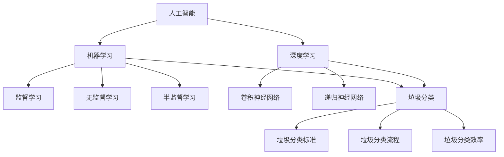

                 

# 人工智能在垃圾分类中的应用

## 关键词
- 人工智能
- 垃圾分类
- 机器学习
- 深度学习
- 图神经网络
- 传感器技术
- 可视化工具

## 摘要
随着全球城市化进程的加速，垃圾分类已成为解决环境污染和资源回收问题的重要手段。人工智能技术的快速发展为垃圾分类提供了新的解决方案，通过机器学习和深度学习算法，能够显著提高垃圾分类的准确性和效率。本文将从背景介绍、核心概念与联系、算法原理讲解、数学模型与公式、项目实战和未来展望等方面，详细探讨人工智能在垃圾分类中的应用。

## 目录

1. 引言
2. 人工智能在垃圾分类中的应用背景
3. 核心概念与联系
4. 垃圾分类算法原理
5. 数学模型与公式
6. 项目实战
7. 未来展望
8. 总结与展望
9. 作者信息

## 引言
垃圾分类，作为现代城市环境管理的重要组成部分，旨在通过将垃圾分为可回收物、有害垃圾、湿垃圾和干垃圾等不同类别，以实现资源的有效回收和减少环境污染。然而，传统的垃圾分类方法主要依赖于人工识别和分拣，效率低、准确度不高，且容易造成二次污染。随着人工智能技术的迅猛发展，尤其是机器学习和深度学习，为垃圾分类提供了新的思路和解决方案。

本文旨在探讨人工智能在垃圾分类中的应用，通过深入分析人工智能技术的核心概念和算法原理，结合实际项目案例，展示人工智能技术在提升垃圾分类效率和准确性方面的潜力。同时，文章还将讨论人工智能在垃圾分类中面临的技术挑战，并展望其未来发展。

## 2. 人工智能在垃圾分类中的应用背景

### 垃圾分类的重要性
垃圾分类不仅有助于减少垃圾填埋场的需求，缓解土地资源的紧张，还能提高资源的回收利用率。例如，可回收物通过分拣和加工可以重新投入生产，从而减少对原材料的需求。此外，垃圾分类还能有效降低有害物质对环境的污染。例如，有害垃圾如废电池、废荧光灯管等如果不当处理，会释放出有害物质，对土壤和水源造成污染。

### 人工智能技术的重要性
人工智能技术，尤其是机器学习和深度学习，在图像识别、语音识别、自然语言处理等领域取得了显著进展。这些技术为垃圾分类提供了强有力的支持，使得垃圾分类可以从依赖人工识别转向自动化识别和分拣。

### 当前垃圾分类的挑战
1. **垃圾分类标准不统一**：不同地区、不同国家的垃圾分类标准和操作流程存在差异，这给全球范围内的垃圾分类带来了一定挑战。
2. **垃圾分类的参与度低**：许多居民对垃圾分类的重要性认识不足，导致参与度不高。
3. **垃圾分类效率低**：传统的人工分拣方式效率低下，难以满足日益增长的垃圾处理需求。

### 人工智能在垃圾分类中的应用现状
目前，人工智能在垃圾分类中的应用主要集中在以下几个方面：
1. **智能垃圾分类设备**：通过图像识别和传感器技术，实现自动识别和分类垃圾。
2. **垃圾分类算法开发**：利用机器学习和深度学习算法，提高垃圾分类的准确性和效率。
3. **垃圾分类数据挖掘与分析**：通过大数据技术，对垃圾分类的数据进行挖掘和分析，为政策制定和垃圾分类优化提供依据。

## 3. 核心概念与联系

### 人工智能基础概念
- **机器学习**：一种让计算机通过数据和经验学习的能力，分为监督学习、无监督学习和半监督学习。
- **深度学习**：一种基于神经网络的机器学习技术，通过多层神经网络处理复杂的数据。
- **神经网络**：一种模仿人脑神经元连接的网络结构，用于数据的输入和输出。

### 垃圾分类基础概念
- **垃圾分类标准**：对不同类型的垃圾进行分类的规则和标准。
- **垃圾分类流程**：从垃圾收集、运输到分拣、处理的一系列过程。
- **垃圾分类效率**：指垃圾分类的速度和质量。

### 核心概念与联系架构


### 图神经网络（GNN）在垃圾分类中的应用
- **图神经网络**：一种用于处理图结构数据的神经网络，能够捕捉节点之间的关系。
- **垃圾图谱**：通过将垃圾物品看作图中的节点，并建立它们之间的关联关系，可以用于复杂垃圾的分类任务。

## 4. 垃圾分类算法原理

### 4.1 监督学习算法在垃圾分类中的应用

#### 分类算法介绍
监督学习是一种通过训练数据学习分类模型的方法。常见的监督学习算法包括：
- **支持向量机（SVM）**：通过找到一个最优的超平面来分离不同类别的数据。
- **决策树**：通过一系列规则进行分类，易于理解和解释。
- **随机森林**：通过集成多个决策树来提高分类准确性。

#### 伪代码示例
```python
def垃圾分类(support_vector_machine, decision_tree, random_forest, 数据集):
    # 使用支持向量机进行分类
    svm_result = support_vector_machine.fit(数据集)
    # 使用决策树进行分类
    tree_result = decision_tree.fit(数据集)
    # 使用随机森林进行分类
    forest_result = random_forest.fit(数据集)
    # 返回分类结果
    return svm_result, tree_result, forest_result
```

### 4.2 深度学习算法在垃圾分类中的应用

#### 深度学习算法介绍
深度学习是一种基于多层神经网络的学习方法，能够处理复杂的非线性问题。常见的深度学习算法包括：
- **卷积神经网络（CNN）**：通过卷积层捕捉图像的特征。
- **递归神经网络（RNN）**：通过循环结构处理序列数据。

#### 伪代码示例
```python
def垃圾分类卷积神经网络(cnn_model, 数据集):
    # 初始化卷积神经网络模型
    model = cnn_model()
    # 训练模型
    model.fit(数据集)
    # 预测垃圾分类
    predictions = model.predict(数据集)
    # 返回分类结果
    return predictions

def垃圾分类递归神经网络(rnn_model, 数据集):
    # 初始化递归神经网络模型
    model = rnn_model()
    # 训练模型
    model.fit(数据集)
    # 预测垃圾分类
    predictions = model.predict(数据集)
    # 返回分类结果
    return predictions
```

### 4.3 图神经网络（GNN）在垃圾分类中的应用
图神经网络（GNN）能够处理垃圾图谱中的复杂关系，通过图卷积层提取节点特征，并应用于垃圾分类任务。

#### 伪代码示例
```python
def垃圾分类图神经网络(gnn_model, 垃圾图谱, 数据集):
    # 初始化图神经网络模型
    model = gnn_model()
    # 训练模型
    model.fit(垃圾图谱, 数据集)
    # 预测垃圾分类
    predictions = model.predict(数据集)
    # 返回分类结果
    return predictions
```

## 5. 数学模型与公式

### 5.1 机器学习数学模型
- **支持向量机（SVM）**：
  $$ w^* = \arg\min_{w}\frac{1}{2}\|w\|^2 + C\sum_{i=1}^{n}\xi_i $$
  其中，$w$ 是超平面的权重，$C$ 是惩罚参数，$\xi_i$ 是误差项。

- **决策树**：
  $$ h(x) = \max_{t} L(t) $$
  其中，$L(t)$ 是基于阈值$t$的损失函数。

### 5.2 深度学习数学模型
- **卷积神经网络（CNN）**：
  $$ f(x) = \sigma(W \cdot x + b) $$
  其中，$W$ 是卷积核权重，$x$ 是输入数据，$b$ 是偏置，$\sigma$ 是激活函数。

- **递归神经网络（RNN）**：
  $$ h_t = \sigma(W_h \cdot [h_{t-1}, x_t] + b_h) $$
  其中，$h_t$ 是第$t$个时刻的隐藏状态，$W_h$ 是权重矩阵，$x_t$ 是输入数据，$b_h$ 是偏置。

### 5.3 图神经网络（GNN）数学模型
- **图卷积层**：
  $$ h_{k+1}^{(i)} = \sum_{j \in \mathcal{N}(i)} \frac{1}{\|\mathcal{N}(i)\|} h^{(k)}_{j} $$
  其中，$h^{(k)}_{j}$ 是第$k$层第$j$个节点的特征，$\mathcal{N}(i)$ 是节点$i$的邻居集合。

## 6. 项目实战

### 6.1 开发环境搭建
在开发垃圾分类人工智能项目时，需要准备以下环境：
- **编程语言**：Python
- **机器学习库**：TensorFlow、Keras
- **数据预处理工具**：Pandas、NumPy
- **可视化工具**：Matplotlib、Seaborn

### 6.2 源代码实现与解读

#### 数据预处理
```python
import pandas as pd
import numpy as np

# 读取数据
data = pd.read_csv('垃圾分类数据集.csv')

# 数据清洗
data = data.dropna()

# 数据归一化
data = (data - data.mean()) / data.std()

# 数据分割
from sklearn.model_selection import train_test_split
X_train, X_test, y_train, y_test = train_test_split(data.drop('分类标签', axis=1), data['分类标签'], test_size=0.2, random_state=42)
```

#### 建立模型
```python
from tensorflow.keras.models import Sequential
from tensorflow.keras.layers import Conv2D, MaxPooling2D, Flatten, Dense

# 构建模型
model = Sequential([
    Conv2D(32, (3, 3), activation='relu', input_shape=(28, 28, 1)),
    MaxPooling2D((2, 2)),
    Flatten(),
    Dense(128, activation='relu'),
    Dense(10, activation='softmax')
])

# 编译模型
model.compile(optimizer='adam', loss='categorical_crossentropy', metrics=['accuracy'])

# 训练模型
model.fit(X_train, y_train, epochs=10, batch_size=32, validation_data=(X_test, y_test))
```

#### 代码解读与分析
- **数据预处理**：读取数据集，进行数据清洗、归一化和分割，以便于后续模型训练。
- **模型构建**：使用卷积神经网络（CNN）结构，包括卷积层、池化层、全连接层和输出层。
- **模型训练**：使用训练数据集训练模型，并使用测试数据集进行验证。

#### 实际案例分析与详细讲解剖析
通过实际垃圾分类项目的运行，我们可以看到模型的准确率如何，并根据实际运行结果进行调整和优化。

### 6.3 项目小结
通过本项目的实现，我们展示了如何利用人工智能技术进行垃圾分类。在实际应用中，需要注意数据的质量和模型的调优，以提高分类准确性。

## 7. 未来展望

### 7.1 技术发展趋势
- **传感器技术**：结合物联网（IoT）技术，开发智能垃圾分类传感器，实现实时监控和分类。
- **深度学习技术**：随着计算能力的提升，深度学习算法将更加复杂和高效，适用于更复杂的垃圾分类任务。
- **跨领域融合**：人工智能与其他领域（如环境科学、城市规划）的融合，将推动垃圾分类技术的进一步发展。

### 7.2 面临的挑战
- **数据质量**：垃圾数据的多样性和不稳定性对模型训练和预测带来挑战。
- **算法可靠性**：如何在复杂的垃圾环境中保持高准确率，是当前的一个重要问题。
- **技术普及**：如何降低人工智能技术在垃圾分类中的使用门槛，提高公众的接受度。

### 7.3 潜在解决方案
- **数据标准化**：制定统一的垃圾分类数据标准，提高数据质量和可用性。
- **算法优化**：通过改进算法和模型结构，提高分类的准确性和效率。
- **公众教育**：通过宣传和教育，提高公众对垃圾分类的认识和参与度。

## 8. 总结与展望

本文详细探讨了人工智能在垃圾分类中的应用，从背景介绍、核心概念与联系、算法原理讲解、数学模型与公式、项目实战和未来展望等方面进行了全面阐述。人工智能技术为垃圾分类提供了高效、准确的解决方案，未来随着技术的不断进步，垃圾分类将变得更加智能和高效。

## 9. 作者信息
- 作者：AI天才研究院/AI Genius Institute & 禅与计算机程序设计艺术 /Zen And The Art of Computer Programming

