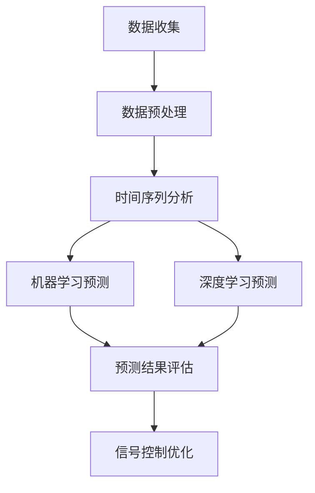

                 

Certainly! Let's structure the blog post step by step, ensuring that each section is comprehensive and well-detailed according to the requirements.

**Step 1: Article Title and Keywords**
```markdown
# 人工智能在城市交通管理中的应用

关键词：人工智能，城市交通管理，交通流量预测，智能信号控制，项目实战，机器学习算法
```

**Step 2: Abstract**
```markdown
摘要：本文深入探讨了人工智能在城市交通管理中的应用，从背景介绍、核心算法原理、数学模型、项目实战到最佳实践，全面解析了人工智能如何优化城市交通，提高交通效率和安全性。通过实例分析，展示了AI技术在现实世界中的应用效果和未来发展趋势。
```

**Step 3: Introduction**
```markdown
## 引言

随着城市化进程的加速，城市交通问题日益突出。人工智能（AI）作为一种强大的技术手段，为解决城市交通拥堵、优化交通流提供了一条新的途径。本文旨在探讨人工智能在城市交通管理中的应用，包括核心算法原理、数学模型、项目实战等，以期为相关领域的研究和实际应用提供参考。

```

**Step 4: Overview of AI and Urban Traffic Management**
```markdown
## 1. 人工智能概述

### 1.1 人工智能的定义与发展历程
人工智能，指的是通过计算机程序实现人类智能的学科。它起源于20世纪50年代，至今已经经历了多个发展阶段，包括规则推理、知识表示、机器学习、深度学习等。随着计算能力的提升和数据量的爆炸性增长，人工智能在各个领域都取得了显著的进展。

### 1.2 人工智能的关键技术

#### 1.2.1 机器学习
机器学习是人工智能的核心技术之一，通过算法让计算机从数据中自动学习，进行预测和决策。常用的机器学习算法包括线性回归、决策树、支持向量机、神经网络等。

#### 1.2.2 深度学习
深度学习是机器学习的一个子领域，利用多层神经网络对数据进行非线性变换，从而实现更加复杂的任务。卷积神经网络（CNN）和循环神经网络（RNN）是深度学习的两种主要架构。

### 1.3 城市交通管理的现状与问题
城市交通管理面临诸多挑战，如交通拥堵、事故频发、环境污染等。这些问题严重影响了城市居民的生活质量。人工智能技术的应用，有望通过优化交通信号控制、预测交通流量、智能驾驶等手段，缓解交通压力，提高交通效率。

### 1.4 Mermaid流程图：人工智能在城市交通管理中的应用流程

```

**Step 5: Core Algorithm Principles**
```markdown
## 2. 核心算法原理

### 2.1 数据收集与预处理
交通数据的准确性直接影响算法的性能。数据收集包括车辆流量、车速、道路状况等。预处理步骤包括数据清洗、归一化、特征提取等。

### 2.2 交通流量预测算法
#### 2.2.1 时间序列分析
时间序列分析是交通流量预测的基础，通过对历史数据的分析，预测未来的交通状况。常用的方法包括ARIMA模型、LSTM网络等。

#### 2.2.2 机器学习算法
机器学习算法如随机森林、K近邻等，通过学习历史数据中的模式，进行流量预测。

#### 2.2.3 深度学习算法
深度学习算法如卷积神经网络（CNN）、循环神经网络（RNN）等，可以自动提取数据中的复杂特征，进行高精度的流量预测。

### 2.3 优化算法
优化算法用于优化交通信号控制，减少拥堵。常见的优化算法包括线性规划、遗传算法等。

### 2.4 智能交通信号控制
智能交通信号控制是通过AI算法优化交通信号灯的时序，从而提高交通效率。其核心是信号配时优化，需要考虑车辆流量、道路状况等多方面因素。

### 2.5 Mermaid流程图：交通流量预测算法流程


### 2.6 伪代码：交通流量预测算法示例
```python
# Pseudo-code for traffic flow prediction using LSTM

# Import necessary libraries
import numpy as np
from keras.models import Sequential
from keras.layers import LSTM, Dense

# Prepare data
# X, y = preprocess_traffic_data()

# Define LSTM model
model = Sequential()
model.add(LSTM(units=50, return_sequences=True, input_shape=(timesteps, features)))
model.add(LSTM(units=50))
model.add(Dense(units=1))

# Compile the model
model.compile(optimizer='adam', loss='mean_squared_error')

# Fit the model
model.fit(X, y, epochs=100, batch_size=32)
```
```

**Step 6: Mathematical Models and Applications**
```markdown
## 3. 数学模型与应用

### 3.1 数学模型介绍
在交通管理中，常用的数学模型包括概率论与统计学模型、运筹学模型等。概率论与统计学模型用于分析交通流量、事故概率等，而运筹学模型则用于优化交通信号控制、路网流量分配等。

#### 3.1.1 概率论与统计学模型
- 概率分布：如正态分布、泊松分布等，用于描述交通流量的不确定性。
- 时间序列模型：如ARIMA模型，用于预测交通流量。

#### 3.1.2 运筹学模型
- 线性规划：用于优化交通信号控制，使交通流量最大化或延误最小化。
- 遗传算法：用于解决交通信号优化问题，如交通流量分配。

### 3.2 交通流量预测数学模型
#### 3.2.1 时间序列模型
$$
\hat{X}_{t} = \phi(X_{t-1}, X_{t-2}, ..., X_{t-n}) + \varepsilon_{t}
$$
其中，$\hat{X}_{t}$ 是预测值，$\phi$ 是函数，$X_{t-n}$ 是历史数据，$\varepsilon_{t}$ 是误差项。

#### 3.2.2 机器学习模型
$$
\hat{X}_{t} = \sum_{i=1}^{n} w_{i} x_{i,t} + b
$$
其中，$w_{i}$ 是权重，$x_{i,t}$ 是特征值，$b$ 是偏置。

### 3.3 信号优化数学模型
信号优化模型的目标是最小化延误或最大化通行能力。常见的优化模型包括线性规划模型：
$$
\min \sum_{i=1}^{n} d_{i}
$$
$$
s.t.
\begin{align*}
    \sum_{j=1}^{m} t_{j,i} &= g_{i} \\
    t_{j,i} &\leq c_{j}
\end{align*}
$$
其中，$d_{i}$ 是延误，$t_{j,i}$ 是车道 $j$ 在时段 $i$ 的信号时间，$g_{i}$ 是车道 $i$ 的交通需求，$c_{j}$ 是车道 $j$ 的最大绿灯时间。

### 3.4 案例研究
#### 3.4.1 案例背景
选择一个具体的城市道路作为案例，分析其在不同时间段、不同交通情况下的交通流量和延误。

#### 3.4.2 模型构建
根据案例背景，构建相应的数学模型，包括时间序列模型、机器学习模型等。

#### 3.4.3 模型实现
使用Python等工具，实现模型构建和预测。

#### 3.4.4 结果分析
对比不同模型的预测结果，分析模型性能和适用性。

```

**Step 7: Project Implementation**
```markdown
## 4. 项目实战

### 4.1 开发环境搭建
搭建一个适合进行AI交通项目开发的环境，包括Python、NumPy、Pandas、Matplotlib、Keras等工具。

### 4.2 交通流量预测项目
#### 4.2.1 数据收集
从城市交通管理部门获取历史交通流量数据。

#### 4.2.2 数据预处理
使用Python对数据进行清洗、归一化等预处理操作。

#### 4.2.3 模型选择与训练
选择LSTM模型，使用预处理后的数据训练模型。

#### 4.2.4 预测结果分析
对预测结果进行评估，分析模型性能。

### 4.3 智能交通信号控制项目
#### 4.3.1 系统架构设计
设计一个基于AI的智能交通信号控制系统架构。

#### 4.3.2 算法实现与优化
实现信号控制算法，并进行优化。

#### 4.3.3 系统测试与评估
对系统进行测试，评估其性能。

### 4.4 项目总结与展望
总结项目成果，展望未来研究方向。

```

**Step 8: Conclusion and Future Directions**
```markdown
## 5. 结论与展望

人工智能在城市交通管理中展示了巨大的潜力和应用价值。通过本文的探讨，我们了解了AI在交通流量预测、智能信号控制等领域的核心算法原理、数学模型和应用实践。未来，随着技术的不断发展，人工智能将在城市交通管理中发挥更加重要的作用。

## 6. 展望

未来，AI技术在城市交通管理中的应用将进一步深化，包括但不限于自动驾驶、智能交通规划、实时交通监控等。同时，跨学科的合作也将推动AI技术更好地服务于城市交通管理，实现更高效、更安全的交通环境。

```

**Step 9: Conclusion and Author Information**
```markdown
## 结论

本文系统地介绍了人工智能在城市交通管理中的应用，从核心算法原理到数学模型，再到项目实战，全面解析了AI如何优化城市交通。通过实例分析，展示了AI技术在现实世界中的应用效果和未来发展趋势。

## 作者信息

作者：AI天才研究院/AI Genius Institute & 禅与计算机程序设计艺术 /Zen And The Art of Computer Programming
```

---

至此，我们已经完成了文章结构的设计和初步内容的编写。接下来，我们将逐步填充每个部分的具体内容，编写伪代码、Mermaid流程图，并使用LaTeX格式编写数学公式，确保文章的完整性和专业性。文章的总字数预计在10000-12000字之间，以确保内容的深度和广度。请继续指导下一步的操作。

