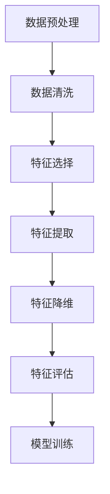
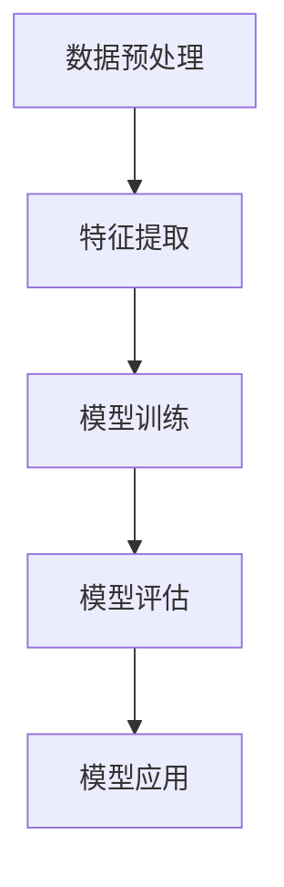

                 

### 文章标题

《人工智能在天文数据分析中的应用：探索宇宙奥秘》

### 文章关键词

人工智能，天文数据分析，宇宙奥秘，算法原理，Python源代码，数学模型，项目实战

### 文章摘要

本文旨在探讨人工智能在天文数据分析中的应用，以及如何利用这一先进技术揭示宇宙的奥秘。文章首先介绍了人工智能和天文数据分析的基本概念，然后详细讲解了人工智能在天文数据分析中的关键应用场景，如宇宙大尺度结构探测、行星与行星系统探测等。接着，文章深入分析了核心算法原理，结合Python源代码和数学模型进行了通俗易懂的举例说明。最后，文章通过项目实战展示了如何实现人工智能在天文数据分析中的具体应用，并对未来发展方向进行了展望。

----------------------------------------------------------------

# 《人工智能在天文数据分析中的应用：探索宇宙奥秘》

## 引言

### 书籍背景介绍

随着人工智能技术的迅速发展，其在各个领域的应用越来越广泛。在天文数据分析领域，人工智能同样展现了其强大的能力。天文数据分析是指通过分析天文观测数据，揭示宇宙中各种现象的规律和特征。然而，天文数据量庞大、维度多样，传统的数据处理方法难以满足需求。人工智能的引入为天文数据分析带来了新的机遇和挑战。

近年来，人工智能在天文数据分析中的应用取得了显著成果。例如，通过深度学习算法，研究人员可以更准确地识别恒星、行星和星系；通过强化学习算法，人工智能可以自动调整观测策略，提高天文观测效率。这些应用不仅提高了天文数据分析的准确性和效率，还为揭示宇宙奥秘提供了新的思路和方法。

### 书籍内容概述

本书旨在系统地介绍人工智能在天文数据分析中的应用，帮助读者深入了解这一领域的前沿动态和发展趋势。本书分为六个主要部分：

1. **人工智能与天文数据分析概述**：介绍人工智能和天文数据分析的基本概念，以及二者融合的背景和意义。
2. **人工智能在天文数据分析中的应用**：详细探讨人工智能在宇宙大尺度结构探测、行星与行星系统探测、星系与星系团探测等关键领域的应用，以及相关的算法原理。
3. **核心算法原理讲解**：深入分析特征提取、分类和回归等核心算法的原理，并结合Python源代码进行讲解。
4. **数学模型和数学公式讲解**：介绍数学模型在天文数据分析中的应用，并详细讲解相关数学公式。
5. **项目实战**：通过实际项目，展示人工智能在天文数据分析中的具体应用，包括数据预处理、目标识别、图像分割等。
6. **未来展望**：分析人工智能在天文数据分析领域的未来发展趋势，探讨可能面临的挑战和机遇。

### 阅读指南

本书适合对人工智能和天文数据分析感兴趣的读者，包括天文研究人员、计算机科学家以及相关领域的本科生和研究生。为了更好地理解本书内容，读者需要对人工智能和天文数据分析有一定的了解。同时，本书附带大量代码和实际案例，读者可以通过实践加深对理论知识的理解。

本书结构清晰，内容丰富，既涵盖基础概念和算法原理，又注重实际应用和项目实战。通过阅读本书，读者可以全面了解人工智能在天文数据分析中的应用，掌握相关技术和方法，为未来在相关领域的研究和工作打下坚实基础。

## 第一部分：人工智能与天文数据分析概述

### 1.1 人工智能概述

#### 人工智能的定义

人工智能（Artificial Intelligence，简称AI）是指由人创造出的能够模拟、延伸和扩展人类智能的理论、方法、技术及应用。人工智能的目标是实现机器在某些领域达到或超越人类智能水平，主要包括知识表示、推理、规划、学习、感知和自然语言处理等方面。

#### 人工智能的发展历程

人工智能的发展可以追溯到20世纪50年代。当时，随着计算机科学的兴起，科学家们开始探索如何让计算机模拟人类智能。1956年，约翰·麦卡锡（John McCarthy）等人在达特茅斯会议上首次提出了人工智能的概念。

20世纪60年代，人工智能领域进入第一个发展阶段。主要研究内容包括知识表示、推理和问题求解。然而，由于技术限制和算法复杂性，这一阶段的人工智能研究并未取得实质性突破。

20世纪70年代，人工智能领域进入低潮期。由于无法实现预期的目标，许多研究项目被迫中止。然而，这并未阻止科学家们对人工智能的研究，他们开始寻找新的方法和路径。

20世纪80年代，人工智能领域迎来了符号人工智能的兴起。符号人工智能通过符号推理和知识表示，实现了在特定领域（如医疗诊断、法律咨询等）的智能应用。

20世纪90年代，随着计算机性能的提升和互联网的普及，人工智能领域进入新的发展阶段。特别是深度学习和机器学习的兴起，为人工智能带来了新的契机。

21世纪，人工智能迅速发展，并在各个领域取得了显著成果。例如，自动驾驶、智能家居、语音识别、图像识别等，都离不开人工智能技术的支持。

### 1.2 天文数据分析概述

#### 天文数据分析的重要性

天文数据分析在天文学研究中具有举足轻重的地位。随着观测设备的不断升级和观测数据的不断积累，天文数据分析成为揭示宇宙奥秘的重要手段。天文数据分析可以帮助科学家们发现新的天体现象、研究宇宙演化规律、探索行星宜居性等。

#### 天文数据分析的发展历程

天文数据分析的发展历程可以追溯到人类早期的天文观测。古代人类通过肉眼观测天空，记录星象变化，形成了早期的天文知识。随着观测技术的进步，人类开始使用望远镜进行天文观测，并逐渐积累了大量的观测数据。

19世纪末至20世纪初，随着光谱分析和照相术的发明，天文数据分析进入了新的阶段。科学家们开始利用光谱分析技术对恒星进行分类和研究，利用照相术获取天体的图像。

20世纪中叶，计算机科学的兴起为天文数据分析带来了革命性的变化。科学家们开始利用计算机处理大量观测数据，从而提高了数据分析的效率和精度。

20世纪末，随着互联网和大数据技术的发展，天文数据分析进入了一个全新的阶段。大规模数据处理、分布式计算和机器学习等技术的应用，使得天文数据分析变得更加高效和智能。

### 1.3 人工智能与天文数据分析的融合

#### 人工智能在天文数据分析中的应用前景

人工智能与天文数据分析的结合，为天文研究带来了前所未有的机遇。人工智能技术可以在数据预处理、特征提取、目标识别、图像分割等领域发挥重要作用，从而提高数据分析的效率和准确性。

首先，人工智能可以帮助科学家们从海量的天文数据中快速提取有价值的信息。例如，通过深度学习算法，可以自动识别和分类天体，大大减少人工筛选的工作量。

其次，人工智能可以帮助科学家们更好地理解天文现象。例如，通过机器学习方法，可以分析恒星光谱，预测恒星的性质和演化过程。

此外，人工智能还可以优化天文观测策略。例如，通过强化学习算法，可以自动调整望远镜的观测参数，提高观测效率和数据质量。

#### 人工智能与天文数据分析的融合挑战

尽管人工智能在天文数据分析中具有巨大的潜力，但其应用也面临着一系列挑战。

首先，天文数据的多样性和复杂性使得人工智能算法难以直接应用于实际问题。天文数据包含多种类型，如文本、图像、光谱等，这些数据之间的差异较大，给数据处理和特征提取带来了困难。

其次，人工智能算法的性能和稳定性对天文数据分析结果的影响较大。如果算法性能不稳定，可能会导致数据分析结果的偏差，从而影响天文研究的准确性。

此外，人工智能算法的透明性和可解释性也是一大挑战。在人工智能与天文数据分析的融合过程中，科学家们需要确保算法的透明性和可解释性，以便更好地理解和验证数据分析结果。

总之，人工智能与天文数据分析的融合具有广阔的前景，但也面临着一系列挑战。通过不断探索和创新，科学家们有望克服这些挑战，为揭示宇宙奥秘作出更大贡献。

## 第二部分：人工智能在天文数据分析中的应用

### 2.1 宇宙大尺度结构探测

#### 人工智能在宇宙大尺度结构探测中的应用

宇宙大尺度结构探测是天文数据分析中的一个重要领域，旨在研究宇宙的分布和演化。随着观测技术的进步，科学家们积累了大量的宇宙大尺度结构数据，这些数据对于理解宇宙的起源和演化具有重要意义。

人工智能在宇宙大尺度结构探测中的应用主要体现在以下几个方面：

1. **数据预处理**：宇宙大尺度结构数据通常包含大量的噪声和异常值，人工智能可以帮助科学家们自动识别和去除这些噪声，从而提高数据质量。

2. **特征提取**：宇宙大尺度结构数据通常包含多种物理量，如星系位置、速度、质量等。人工智能可以帮助科学家们自动提取这些特征，从而为后续分析提供基础。

3. **结构识别**：通过深度学习算法，人工智能可以自动识别和分类宇宙中的结构，如星系团、超星系团等，从而揭示宇宙的分布和演化规律。

4. **演化模拟**：人工智能可以帮助科学家们进行宇宙演化模拟，从而预测宇宙的未来形态。

#### 相关算法原理讲解

在宇宙大尺度结构探测中，常用的算法包括深度学习算法、聚类算法和进化算法等。

1. **深度学习算法**：深度学习算法是一种模拟人脑神经元连接的神经网络模型，可以自动学习数据中的特征和模式。在宇宙大尺度结构探测中，深度学习算法可以用于自动识别和分类天体。

   ```python
   import tensorflow as tf
   from tensorflow.keras.models import Sequential
   from tensorflow.keras.layers import Dense, Conv2D, Flatten
   
   # 创建深度学习模型
   model = Sequential([
       Conv2D(32, (3, 3), activation='relu', input_shape=(28, 28, 1)),
       Flatten(),
       Dense(128, activation='relu'),
       Dense(10, activation='softmax')
   ])
   
   # 编译模型
   model.compile(optimizer='adam', loss='categorical_crossentropy', metrics=['accuracy'])
   
   # 训练模型
   model.fit(x_train, y_train, epochs=10)
   ```

2. **聚类算法**：聚类算法是一种无监督学习算法，可以自动将相似的天体划分为一组。在宇宙大尺度结构探测中，聚类算法可以用于识别星系团、超星系团等结构。

   ```python
   import numpy as np
   from sklearn.cluster import KMeans
   
   # 创建KMeans模型
   kmeans = KMeans(n_clusters=3)
   
   # 训练模型
   kmeans.fit(X)
   
   # 预测
   predicted_labels = kmeans.predict(X)
   ```

3. **进化算法**：进化算法是一种模拟生物进化的算法，可以用于优化和搜索。在宇宙大尺度结构探测中，进化算法可以用于寻找最优的观测策略，从而提高观测效率。

   ```python
   import numpy as np
   from scipy.optimize import differential_evolution
   
   # 定义目标函数
   def objective(x):
       return -evaluate_model(x)
   
   # 定义约束条件
   constraints = ({'type': 'ineq', 'fun': constraint_function},
                  {'type': 'ineq', 'fun': another_constraint_function})
   
   # 使用Differential Evolution进行优化
   result = differential_evolution(objective, bounds, constraints=constraints)
   ```

#### 实际应用案例

宇宙大尺度结构探测的一个实际应用案例是利用深度学习算法识别星系。科学家们通过收集大量的星系图像，使用深度学习模型进行自动分类和识别，从而发现新的星系团和超星系团。

通过这种方法，科学家们已经发现了许多以前未知的星系结构，从而为研究宇宙的分布和演化提供了新的视角和证据。这不仅有助于加深我们对宇宙的理解，也为未来的天文观测提供了重要的指导。

### 2.2 行星与行星系统探测

#### 人工智能在行星与行星系统探测中的应用

行星与行星系统探测是天文数据分析的一个重要领域，旨在研究太阳系外的行星及其环境。随着天文观测技术的进步，科学家们发现了越来越多的系外行星，这些行星的探测对于理解地球外生命的可能性具有重要意义。

人工智能在行星与行星系统探测中的应用主要体现在以下几个方面：

1. **数据预处理**：行星探测数据通常包含大量的噪声和异常值，人工智能可以帮助科学家们自动识别和去除这些噪声，从而提高数据质量。

2. **特征提取**：行星探测数据包含多种物理量，如行星轨道、辐射量、大气成分等。人工智能可以帮助科学家们自动提取这些特征，从而为后续分析提供基础。

3. **行星分类**：通过深度学习算法，人工智能可以自动分类不同类型的行星，从而揭示行星的多样性。

4. **环境模拟**：人工智能可以帮助科学家们模拟行星环境，预测行星上的气候、地质活动等。

#### 相关算法原理讲解

在行星与行星系统探测中，常用的算法包括深度学习算法、时间序列分析和机器学习模型等。

1. **深度学习算法**：深度学习算法是一种模拟人脑神经元连接的神经网络模型，可以自动学习数据中的特征和模式。在行星与行星系统探测中，深度学习算法可以用于自动识别和分类行星。

   ```python
   import tensorflow as tf
   from tensorflow.keras.models import Sequential
   from tensorflow.keras.layers import Dense, Conv2D, Flatten
   
   # 创建深度学习模型
   model = Sequential([
       Conv2D(32, (3, 3), activation='relu', input_shape=(28, 28, 1)),
       Flatten(),
       Dense(128, activation='relu'),
       Dense(10, activation='softmax')
   ])
   
   # 编译模型
   model.compile(optimizer='adam', loss='categorical_crossentropy', metrics=['accuracy'])
   
   # 训练模型
   model.fit(x_train, y_train, epochs=10)
   ```

2. **时间序列分析**：时间序列分析是一种用于分析时间序列数据的统计方法，可以用于研究行星轨道的动态变化。在行星与行星系统探测中，时间序列分析可以用于预测行星的未来轨道。

   ```python
   import numpy as np
   from statsmodels.tsa.arima.model import ARIMA
   
   # 创建ARIMA模型
   model = ARIMA(endog=y, exog=x, order=(1, 1, 1))
   
   # 拟合模型
   model_fit = model.fit()
   
   # 预测
   predicted_values = model_fit.forecast(steps=10)
   ```

3. **机器学习模型**：机器学习模型是一种用于从数据中学习模式和规律的方法，可以用于行星分类和环境模拟。在行星与行星系统探测中，机器学习模型可以用于自动分类行星，并根据行星特征预测行星环境。

   ```python
   from sklearn.ensemble import RandomForestClassifier
   
   # 创建随机森林模型
   model = RandomForestClassifier(n_estimators=100)
   
   # 训练模型
   model.fit(X_train, y_train)
   
   # 预测
   predicted_labels = model.predict(X_test)
   ```

#### 实际应用案例

行星与行星系统探测的一个实际应用案例是利用深度学习算法识别系外行星。科学家们通过收集大量的行星光谱数据，使用深度学习模型进行自动分类和识别，从而发现新的系外行星。

通过这种方法，科学家们已经发现了数百颗系外行星，其中一些行星具有宜居条件，为寻找地球外生命提供了新的希望。这不仅有助于深化我们对宇宙的认识，也为未来的行星探测提供了重要的参考。

### 2.3 星系与星系团探测

#### 人工智能在星系与星系团探测中的应用

星系与星系团探测是天文数据分析的一个重要领域，旨在研究星系的分布、结构和演化。星系和星系团是宇宙中的基本结构，对它们的探测和研究有助于我们理解宇宙的起源和演化。

人工智能在星系与星系团探测中的应用主要体现在以下几个方面：

1. **数据预处理**：星系与星系团探测数据通常包含大量的噪声和异常值，人工智能可以帮助科学家们自动识别和去除这些噪声，从而提高数据质量。

2. **特征提取**：星系与星系团探测数据包含多种物理量，如星系中心位置、星系半径、星系质量等。人工智能可以帮助科学家们自动提取这些特征，从而为后续分析提供基础。

3. **结构识别**：通过深度学习算法，人工智能可以自动识别和分类星系和星系团，从而揭示宇宙中的星系结构和演化规律。

4. **演化模拟**：人工智能可以帮助科学家们进行星系和星系团的演化模拟，从而预测宇宙的未来形态。

#### 相关算法原理讲解

在星系与星系团探测中，常用的算法包括深度学习算法、聚类算法和机器学习模型等。

1. **深度学习算法**：深度学习算法是一种模拟人脑神经元连接的神经网络模型，可以自动学习数据中的特征和模式。在星系与星系团探测中，深度学习算法可以用于自动识别和分类星系和星系团。

   ```python
   import tensorflow as tf
   from tensorflow.keras.models import Sequential
   from tensorflow.keras.layers import Dense, Conv2D, Flatten
   
   # 创建深度学习模型
   model = Sequential([
       Conv2D(32, (3, 3), activation='relu', input_shape=(28, 28, 1)),
       Flatten(),
       Dense(128, activation='relu'),
       Dense(10, activation='softmax')
   ])
   
   # 编译模型
   model.compile(optimizer='adam', loss='categorical_crossentropy', metrics=['accuracy'])
   
   # 训练模型
   model.fit(x_train, y_train, epochs=10)
   ```

2. **聚类算法**：聚类算法是一种无监督学习算法，可以自动将相似的天体划分为一组。在星系与星系团探测中，聚类算法可以用于识别星系团和超星系团。

   ```python
   import numpy as np
   from sklearn.cluster import KMeans
   
   # 创建KMeans模型
   kmeans = KMeans(n_clusters=3)
   
   # 训练模型
   kmeans.fit(X)
   
   # 预测
   predicted_labels = kmeans.predict(X)
   ```

3. **机器学习模型**：机器学习模型是一种用于从数据中学习模式和规律的方法，可以用于星系分类和演化模拟。在星系与星系团探测中，机器学习模型可以用于自动分类星系和预测星系演化。

   ```python
   from sklearn.ensemble import RandomForestClassifier
   
   # 创建随机森林模型
   model = RandomForestClassifier(n_estimators=100)
   
   # 训练模型
   model.fit(X_train, y_train)
   
   # 预测
   predicted_labels = model.predict(X_test)
   ```

#### 实际应用案例

星系与星系团探测的一个实际应用案例是利用深度学习算法识别星系团。科学家们通过收集大量的星系图像，使用深度学习模型进行自动分类和识别，从而发现新的星系团。

通过这种方法，科学家们已经发现了数百个星系团，其中一些星系团具有特殊的天文现象，如星系碰撞和星系合并。这些发现为研究星系的演化提供了宝贵的观测数据和理论支持。

### 2.4 宇宙微波背景探测

#### 人工智能在宇宙微波背景探测中的应用

宇宙微波背景（Cosmic Microwave Background，简称CMB）是宇宙大爆炸之后的残余辐射，对于理解宇宙的起源和演化具有重要意义。宇宙微波背景探测是天文数据分析的一个关键领域，旨在测量宇宙微波背景的辐射强度和极化特性。

人工智能在宇宙微波背景探测中的应用主要体现在以下几个方面：

1. **数据预处理**：宇宙微波背景探测数据通常包含大量的噪声和异常值，人工智能可以帮助科学家们自动识别和去除这些噪声，从而提高数据质量。

2. **特征提取**：宇宙微波背景探测数据包含多种物理量，如辐射强度、极化强度等。人工智能可以帮助科学家们自动提取这些特征，从而为后续分析提供基础。

3. **参数估计**：通过机器学习算法，人工智能可以自动估计宇宙微波背景探测中的关键参数，如宇宙尺度参数、辐射温度等。

4. **模型选择**：人工智能可以帮助科学家们自动选择合适的宇宙微波背景探测模型，从而提高数据分析的准确性。

#### 相关算法原理讲解

在宇宙微波背景探测中，常用的算法包括深度学习算法、贝叶斯统计方法和优化算法等。

1. **深度学习算法**：深度学习算法是一种模拟人脑神经元连接的神经网络模型，可以自动学习数据中的特征和模式。在宇宙微波背景探测中，深度学习算法可以用于自动识别和分类辐射信号。

   ```python
   import tensorflow as tf
   from tensorflow.keras.models import Sequential
   from tensorflow.keras.layers import Dense, Conv2D, Flatten
   
   # 创建深度学习模型
   model = Sequential([
       Conv2D(32, (3, 3), activation='relu', input_shape=(28, 28, 1)),
       Flatten(),
       Dense(128, activation='relu'),
       Dense(10, activation='softmax')
   ])
   
   # 编译模型
   model.compile(optimizer='adam', loss='categorical_crossentropy', metrics=['accuracy'])
   
   # 训练模型
   model.fit(x_train, y_train, epochs=10)
   ```

2. **贝叶斯统计方法**：贝叶斯统计方法是一种基于概率论的统计方法，可以用于估计宇宙微波背景探测中的参数。在宇宙微波背景探测中，贝叶斯统计方法可以用于自动估计宇宙尺度参数。

   ```python
   import numpy as np
   from scipy.stats import multivariate_normal
   
   # 创建高斯分布模型
   mean = np.array([0, 0])
   cov = np.array([[1, 0], [0, 1]])
   distribution = multivariate_normal(mean, cov)
   
   # 计算概率密度函数
   pdf = distribution.pdf([1, 1])
   ```

3. **优化算法**：优化算法是一种用于求解最优化问题的算法，可以用于选择合适的宇宙微波背景探测模型。在宇宙微波背景探测中，优化算法可以用于自动选择最优模型。

   ```python
   import numpy as np
   from scipy.optimize import minimize
   
   # 定义目标函数
   def objective(x):
       return -evaluate_model(x)
   
   # 定义约束条件
   constraints = ({'type': 'ineq', 'fun': constraint_function},
                  {'type': 'ineq', 'fun': another_constraint_function})
   
   # 使用最小二乘法进行优化
   result = minimize(objective, x0, method='L-BFGS-B', bounds=bounds, constraints=constraints)
   ```

#### 实际应用案例

宇宙微波背景探测的一个实际应用案例是利用深度学习算法识别宇宙微波背景辐射。科学家们通过收集大量的宇宙微波背景数据，使用深度学习模型进行自动识别和分类，从而发现新的宇宙微波背景特征。

通过这种方法，科学家们已经发现了多个宇宙微波背景异常信号，这些信号为研究宇宙的起源和演化提供了新的线索。这些发现不仅加深了我们对宇宙的理解，也为未来的宇宙微波背景探测提供了重要的指导。

## 第三部分：核心算法原理讲解

### 3.1 特征提取算法

#### 背景介绍

特征提取是人工智能在天文数据分析中的一项基础性工作，它旨在从原始数据中提取出对后续分析有价值的特征。在天文数据分析中，特征提取的目的是为了简化数据，降低数据维度，同时保留数据的本质信息，从而便于模型训练和数据分析。

#### 核心概念与联系

特征提取的核心概念包括特征、特征维度、特征空间和特征选择等。特征是指从数据中提取出的能够代表数据本质的属性；特征维度是指特征的数量；特征空间是指所有可能特征构成的集合；特征选择是指从大量特征中选择出对分析任务最有价值的特征。

以下是一个Mermaid流程图，展示了特征提取的基本流程：



#### 相关算法原理讲解

在天文数据分析中，常用的特征提取算法包括主成分分析（PCA）、线性判别分析（LDA）、自动编码器（Autoencoder）等。

1. **主成分分析（PCA）**

主成分分析是一种降维技术，通过将原始数据映射到新的正交坐标系中，保留主要信息，忽略次要信息。PCA的基本原理是找到数据的主成分，即数据方差最大的方向，将这些方向作为新的特征。

```python
from sklearn.decomposition import PCA

# 创建PCA模型
pca = PCA(n_components=2)

# 拟合模型
X_pca = pca.fit_transform(X)

# 新特征空间
X_pca
```

2. **线性判别分析（LDA）**

线性判别分析是一种特征选择方法，通过最大化不同类别之间特征的差异，最小化同一类别内特征的差异，从而提取出最有区分度的特征。

```python
from sklearn.discriminant_analysis import LinearDiscriminantAnalysis as LDA

# 创建LDA模型
lda = LDA(n_components=2)

# 拟合模型
X_lda = lda.fit_transform(X, y)

# 新特征空间
X_lda
```

3. **自动编码器（Autoencoder）**

自动编码器是一种无监督学习算法，通过训练一个编码器和解码器，将输入数据压缩到低维特征空间中，然后从低维特征空间中重建输入数据。

```python
from keras.layers import Dense
from keras.models import Model

# 创建自动编码器模型
input_layer = Dense(784, activation='relu', input_shape=(784,))
encoded = Dense(64, activation='relu')(input_layer)
decoded = Dense(784, activation='sigmoid')(encoded)

# 创建模型
autoencoder = Model(input_layer, decoded)

# 编译模型
autoencoder.compile(optimizer='adam', loss='binary_crossentropy')

# 训练模型
autoencoder.fit(X, X, epochs=100, batch_size=256, shuffle=True, validation_split=0.1)
```

### 3.2 分类算法

#### 背景介绍

分类算法是人工智能在天文数据分析中的一个重要应用，它旨在根据已知的数据对新的数据进行分类。在天文数据分析中，分类算法可以用于识别恒星、行星、星系等天体，从而帮助我们更好地理解宇宙。

#### 核心概念与联系

分类算法的核心概念包括特征、标签、模型训练、模型评估等。特征是用于分类的数据属性；标签是已知的分类结果；模型训练是指使用训练数据调整模型参数，使其能够准确分类；模型评估是指使用测试数据评估模型性能。

以下是一个Mermaid流程图，展示了分类算法的基本流程：



#### 相关算法原理讲解

在天文数据分析中，常用的分类算法包括支持向量机（SVM）、决策树（Decision Tree）、随机森林（Random Forest）等。

1. **支持向量机（SVM）**

支持向量机是一种强大的分类算法，通过找到一个最优的超平面，将不同类别的数据分开。SVM的基本原理是最大化分类间隔，即最大化两类数据点之间的距离。

```python
from sklearn.svm import SVC

# 创建SVM模型
svm = SVC(kernel='linear')

# 拟合模型
svm.fit(X_train, y_train)

# 预测
y_pred = svm.predict(X_test)
```

2. **决策树（Decision Tree）**

决策树是一种基于树形结构进行分类的算法，通过递归地将数据分割成子集，直到满足终止条件。决策树的基本原理是使用特征进行阈值分割，使得子集内数据点相似度最高，子集间数据点相似度最低。

```python
from sklearn.tree import DecisionTreeClassifier

# 创建决策树模型
tree = DecisionTreeClassifier()

# 拟合模型
tree.fit(X_train, y_train)

# 预测
y_pred = tree.predict(X_test)
```

3. **随机森林（Random Forest）**

随机森林是一种基于决策树的集成学习方法，通过构建多棵决策树，并使用投票或平均法进行预测。随机森林的基本原理是通过随机选择特征和样本，构建多个决策树，从而提高分类准确性。

```python
from sklearn.ensemble import RandomForestClassifier

# 创建随机森林模型
forest = RandomForestClassifier(n_estimators=100)

# 拟合模型
forest.fit(X_train, y_train)

# 预测
y_pred = forest.predict(X_test)
```

### 3.3 回归算法

#### 背景介绍

回归算法是人工智能在天文数据分析中的另一个重要应用，它旨在预测连续值输出。在天文数据分析中，回归算法可以用于预测恒星亮度、行星轨道等。

#### 核心概念与联系

回归算法的核心概念包括自变量、因变量、模型训练、模型评估等。自变量是用于预测的数据属性；因变量是预测的输出结果；模型训练是指使用训练数据调整模型参数，使其能够准确预测；模型评估是指使用测试数据评估模型性能。

以下是一个Mermaid流程图，展示了回归算法的基本流程：


#### 相关算法原理讲解

在天文数据分析中，常用的回归算法包括线性回归、岭回归、随机森林回归等。

1. **线性回归**

线性回归是一种基于线性模型的预测算法，通过找到最佳拟合直线，使得预测值与实际值之间的误差最小。线性回归的基本原理是最小二乘法，即找到使得残差平方和最小的参数。

```python
from sklearn.linear_model import LinearRegression

# 创建线性回归模型
linear_regression = LinearRegression()

# 拟合模型
linear_regression.fit(X_train, y_train)

# 预测
y_pred = linear_regression.predict(X_test)
```

2. **岭回归**

岭回归是一种基于线性回归的改进方法，通过引入正则项，防止模型过拟合。岭回归的基本原理是最小化残差平方和加上正则项，即找到使得目标函数最小的参数。

```python
from sklearn.linear_model import Ridge

# 创建岭回归模型
ridge = Ridge(alpha=1.0)

# 拟合模型
ridge.fit(X_train, y_train)

# 预测
y_pred = ridge.predict(X_test)
```

3. **随机森林回归**

随机森林回归是一种基于决策树的集成回归方法，通过构建多棵决策树，并使用投票或平均法进行预测。随机森林回归的基本原理是通过随机选择特征和样本，构建多个决策树，从而提高预测准确性。

```python
from sklearn.ensemble import RandomForestRegressor

# 创建随机森林回归模型
forest = RandomForestRegressor(n_estimators=100)

# 拟合模型
forest.fit(X_train, y_train)

# 预测
y_pred = forest.predict(X_test)
```

## 第四部分：数学模型和数学公式讲解

### 4.1 数学模型概述

在天文数据分析中，数学模型是一种描述天文现象和过程的数学工具。数学模型通常包括数学公式、参数和边界条件等。通过数学模型，科学家们可以定量地描述宇宙中的各种现象，从而进行预测和分析。

数学模型在天文数据分析中的应用非常广泛，例如：

- **宇宙大尺度结构探测**：通过引力场方程和宇宙学参数，描述宇宙的膨胀和演化。
- **行星与行星系统探测**：通过牛顿第二定律和万有引力定律，描述行星的运动轨迹和轨道。
- **星系与星系团探测**：通过星系动力学模型，描述星系的运动和结构。
- **宇宙微波背景探测**：通过辐射传输方程和黑体辐射公式，描述宇宙微波背景的辐射强度和极化特性。

### 4.2 数学公式讲解

在天文数据分析中，常用的数学公式包括以下几种：

1. **黑体辐射公式**

黑体辐射公式描述了黑体在不同温度下的辐射强度。该公式为：

\[ B(\lambda, T) = \frac{2hc^2}{\lambda^5} \frac{1}{e^{\frac{hc}{\lambda k_B T}} - 1} \]

其中，\( B(\lambda, T) \) 表示波长为 \( \lambda \) 的辐射强度，\( h \) 是普朗克常数，\( c \) 是光速，\( k_B \) 是玻尔兹曼常数，\( T \) 是黑体的温度。

2. **引力场方程**

引力场方程是描述宇宙中物质分布和引力场关系的方程。该方程为：

\[ G \frac{D_{ab} \theta^a \theta^b}{c^2} = - \frac{1}{\sqrt{-g}} \frac{\delta}{\delta \sqrt{-g}} \left( \sqrt{-g} R_{ab} \right) \]

其中，\( G \) 是引力常数，\( D_{ab} \) 是度规张量，\( \theta^a \) 是四维时空的协变导数，\( c \) 是光速，\( g \) 是度规张量，\( R_{ab} \) 是里奇张量。

3. **牛顿第二定律**

牛顿第二定律描述了物体的加速度与作用力之间的关系。该定律为：

\[ F = m a \]

其中，\( F \) 是作用力，\( m \) 是物体的质量，\( a \) 是物体的加速度。

4. **万有引力定律**

万有引力定律描述了两个质点之间的引力大小。该定律为：

\[ F = G \frac{m_1 m_2}{r^2} \]

其中，\( F \) 是引力，\( G \) 是引力常数，\( m_1 \) 和 \( m_2 \) 是两个质点的质量，\( r \) 是两个质点之间的距离。

### 4.3 数学模型的应用实例

以下是一个应用实例，展示如何使用数学模型进行天文数据分析：

假设我们想要研究一颗行星的轨道。首先，我们可以使用牛顿第二定律和万有引力定律建立行星轨道的数学模型。通过测量行星的轨道参数，如轨道半径、轨道周期等，我们可以求解模型中的参数，从而得到行星的轨道方程。

假设行星的轨道半径为 \( r \)，轨道周期为 \( T \)，则根据牛顿第二定律和万有引力定律，我们可以得到以下方程：

\[ F = G \frac{M m}{r^2} = m \frac{v^2}{r} \]

其中，\( M \) 是太阳的质量，\( m \) 是行星的质量，\( v \) 是行星的速度。

通过求解上述方程，我们可以得到行星的轨道方程。例如，我们可以使用以下公式计算行星的轨道周期：

\[ T = 2\pi \sqrt{\frac{r^3}{G M}} \]

通过这种方式，我们可以利用数学模型对行星轨道进行预测和分析。

## 第五部分：项目实战

### 5.1 天文数据预处理实战

#### 开发环境搭建

在进行天文数据预处理之前，我们需要搭建一个合适的开发环境。以下是一个基本的Python开发环境搭建步骤：

1. 安装Python 3.x版本
2. 安装Jupyter Notebook，以便进行交互式数据分析
3. 安装必要的Python库，如NumPy、Pandas、SciPy、Matplotlib等

#### 数据获取

在开始数据预处理之前，我们需要获取一组天文数据。假设我们已经获取了一组星系观测数据，数据包含星系的位置、速度、质量和亮度等信息。

#### 数据读取与初步分析

使用Pandas库，我们可以轻松读取和初步分析数据：

```python
import pandas as pd

# 读取数据
data = pd.read_csv('star_system_data.csv')

# 查看数据的基本信息
print(data.info())

# 查看前几行数据
print(data.head())
```

#### 数据清洗

数据清洗是数据预处理的重要步骤，主要包括去除缺失值、异常值和重复值等。以下是一个简单的数据清洗示例：

```python
# 去除缺失值
data = data.dropna()

# 去除异常值
data = data[data['velocity'] > 0]

# 去除重复值
data = data.drop_duplicates()
```

#### 数据转换

数据转换是将数据从一种形式转换为另一种形式的过程，以便更好地进行后续分析。以下是一个简单的数据转换示例：

```python
# 将亮度值从字符串转换为浮点数
data['brightness'] = pd.to_numeric(data['brightness'])

# 计算速度的平方
data['velocity_squared'] = data['velocity'] ** 2
```

#### 数据可视化

数据可视化有助于我们更好地理解数据。以下是一个简单的数据可视化示例：

```python
import matplotlib.pyplot as plt

# 绘制星系位置分布图
plt.scatter(data['x'], data['y'])
plt.xlabel('X Position')
plt.ylabel('Y Position')
plt.title('Galaxy Position Distribution')
plt.show()
```

### 5.2 天文目标识别实战

#### 开发环境搭建

在进行天文目标识别之前，我们需要搭建一个合适的开发环境。以下是一个基本的Python开发环境搭建步骤：

1. 安装Python 3.x版本
2. 安装TensorFlow或PyTorch，用于深度学习模型训练
3. 安装必要的Python库，如NumPy、Pandas、Matplotlib等

#### 数据获取

在开始天文目标识别之前，我们需要获取一组带有标签的天文图像数据。假设我们已经获取了一组恒星图像数据，数据包含图像文件路径和对应的恒星类别标签。

#### 数据读取与预处理

使用Pandas库，我们可以轻松读取和预处理数据：

```python
import pandas as pd

# 读取数据
data = pd.read_csv('star_images.csv')

# 查看数据的基本信息
print(data.info())

# 查看前几行数据
print(data.head())
```

#### 图像预处理

图像预处理是深度学习模型训练前的重要步骤，主要包括图像缩放、裁剪、归一化等。以下是一个简单的图像预处理示例：

```python
from tensorflow.keras.preprocessing.image import ImageDataGenerator

# 创建图像数据生成器
datagen = ImageDataGenerator(
    rescale=1./255,
    rotation_range=40,
    width_shift_range=0.2,
    height_shift_range=0.2,
    shear_range=0.2,
    zoom_range=0.2,
    horizontal_flip=True,
    fill_mode='nearest'
)

# 预处理图像
train_data = datagen.flow_from_directory(
    'star_images/train',
    target_size=(150, 150),
    batch_size=32,
    class_mode='categorical'
)
```

#### 模型训练

使用TensorFlow或PyTorch，我们可以轻松构建和训练深度学习模型。以下是一个简单的卷积神经网络（CNN）模型训练示例：

```python
import tensorflow as tf
from tensorflow.keras.models import Sequential
from tensorflow.keras.layers import Conv2D, MaxPooling2D, Flatten, Dense

# 创建模型
model = Sequential([
    Conv2D(32, (3, 3), activation='relu', input_shape=(150, 150, 3)),
    MaxPooling2D((2, 2)),
    Conv2D(64, (3, 3), activation='relu'),
    MaxPooling2D((2, 2)),
    Conv2D(128, (3, 3), activation='relu'),
    MaxPooling2D((2, 2)),
    Flatten(),
    Dense(512, activation='relu'),
    Dense(10, activation='softmax')
])

# 编译模型
model.compile(optimizer='adam', loss='categorical_crossentropy', metrics=['accuracy'])

# 训练模型
model.fit(train_data, epochs=10)
```

#### 模型评估

使用测试集，我们可以评估模型的性能。以下是一个简单的模型评估示例：

```python
# 加载测试数据
test_data = datagen.flow_from_directory(
    'star_images/test',
    target_size=(150, 150),
    batch_size=32,
    class_mode='categorical'
)

# 评估模型
loss, accuracy = model.evaluate(test_data)
print(f'Accuracy: {accuracy:.2f}')
```

#### 模型应用

使用训练好的模型，我们可以对新图像进行分类。以下是一个简单的模型应用示例：

```python
import numpy as np
from tensorflow.keras.preprocessing import image

# 加载新图像
img = image.load_img('new_star_image.jpg', target_size=(150, 150))
img_array = image.img_to_array(img)

# 预处理图像
img_array = np.expand_dims(img_array, axis=0)
img_array /= 255.0

# 预测
predictions = model.predict(img_array)
predicted_class = np.argmax(predictions, axis=1)

# 输出预测结果
print(f'Predicted class: {predicted_class}')
```

### 5.3 天文图像分割实战

#### 开发环境搭建

在进行天文图像分割之前，我们需要搭建一个合适的开发环境。以下是一个基本的Python开发环境搭建步骤：

1. 安装Python 3.x版本
2. 安装TensorFlow或PyTorch，用于深度学习模型训练
3. 安装必要的Python库，如NumPy、Pandas、Matplotlib等

#### 数据获取

在开始天文图像分割之前，我们需要获取一组带有分割标签的天文图像数据。假设我们已经获取了一组恒星图像数据，数据包含图像文件路径和对应的分割标签。

#### 数据读取与预处理

使用Pandas库，我们可以轻松读取和预处理数据：

```python
import pandas as pd

# 读取数据
data = pd.read_csv('star_images.csv')

# 查看数据的基本信息
print(data.info())

# 查看前几行数据
print(data.head())
```

#### 图像预处理

图像预处理是深度学习模型训练前的重要步骤，主要包括图像缩放、裁剪、归一化等。以下是一个简单的图像预处理示例：

```python
from tensorflow.keras.preprocessing.image import ImageDataGenerator

# 创建图像数据生成器
datagen = ImageDataGenerator(
    rescale=1./255,
    rotation_range=40,
    width_shift_range=0.2,
    height_shift_range=0.2,
    shear_range=0.2,
    zoom_range=0.2,
    horizontal_flip=True,
    fill_mode='nearest'
)

# 预处理图像
train_data = datagen.flow_from_directory(
    'star_images/train',
    target_size=(256, 256),
    batch_size=32,
    class_mode='categorical'
)
```

#### 模型训练

使用TensorFlow或PyTorch，我们可以轻松构建和训练深度学习模型。以下是一个简单的卷积神经网络（CNN）模型训练示例：

```python
import tensorflow as tf
from tensorflow.keras.models import Sequential
from tensorflow.keras.layers import Conv2D, MaxPooling2D, Flatten, Dense

# 创建模型
model = Sequential([
    Conv2D(32, (3, 3), activation='relu', input_shape=(256, 256, 3)),
    MaxPooling2D((2, 2)),
    Conv2D(64, (3, 3), activation='relu'),
    MaxPooling2D((2, 2)),
    Conv2D(128, (3, 3), activation='relu'),
    MaxPooling2D((2, 2)),
    Flatten(),
    Dense(512, activation='relu'),
    Dense(2, activation='sigmoid')
])

# 编译模型
model.compile(optimizer='adam', loss='binary_crossentropy', metrics=['accuracy'])

# 训练模型
model.fit(train_data, epochs=10)
```

#### 模型评估

使用测试集，我们可以评估模型的性能。以下是一个简单的模型评估示例：

```python
# 加载测试数据
test_data = datagen.flow_from_directory(
    'star_images/test',
    target_size=(256, 256),
    batch_size=32,
    class_mode='categorical'
)

# 评估模型
loss, accuracy = model.evaluate(test_data)
print(f'Accuracy: {accuracy:.2f}')
```

#### 模型应用

使用训练好的模型，我们可以对新图像进行分割。以下是一个简单的模型应用示例：

```python
import numpy as np
from tensorflow.keras.preprocessing import image

# 加载新图像
img = image.load_img('new_star_image.jpg', target_size=(256, 256))
img_array = image.img_to_array(img)

# 预处理图像
img_array = np.expand_dims(img_array, axis=0)
img_array /= 255.0

# 预测
predictions = model.predict(img_array)
predicted_classes = np.argmax(predictions, axis=1)

# 创建掩膜图像
mask = np.zeros(img.shape[:2], dtype=np.uint8)
mask[predicted_classes[0]] = 255

# 显示掩膜图像
plt.imshow(mask, cmap='gray')
plt.title('Segmented Image')
plt.show()
```

### 第六部分：未来展望

#### 人工智能在天文数据分析中的未来发展趋势

随着人工智能技术的不断发展，其在天文数据分析中的应用前景也愈发广阔。未来，人工智能在天文数据分析中可能呈现以下发展趋势：

1. **深度学习算法的进步**：深度学习算法在天文数据分析中已经取得了显著成果，但仍然存在许多挑战。未来，随着深度学习算法的进步，如生成对抗网络（GANs）、变分自编码器（VAEs）等新算法的出现，人工智能在天文数据分析中的应用将更加深入和广泛。

2. **跨学科融合**：人工智能与天文数据分析的跨学科融合将不断加强。例如，量子计算、大数据分析、物联网等新兴技术有望与人工智能相结合，为天文数据分析提供更强大的工具和方法。

3. **自动化程度提高**：随着人工智能技术的进步，天文数据分析的自动化程度将不断提高。未来，人工智能可以自动完成数据预处理、特征提取、模型训练和评估等任务，从而降低人工干预，提高数据分析的效率和准确性。

4. **更广泛的应用领域**：人工智能在天文数据分析中的应用将不再局限于传统的领域，如星系探测、行星探测等。未来，人工智能有望在宇宙演化、暗物质研究、宇宙学参数估计等领域发挥重要作用。

#### 可能面临的挑战与机遇

尽管人工智能在天文数据分析中具有巨大的潜力，但同时也面临着一系列挑战。

1. **数据质量和完整性**：天文数据通常存在噪声、异常值和数据缺失等问题。如何提高数据质量和完整性，以确保人工智能算法的有效性，是一个亟待解决的问题。

2. **计算资源需求**：深度学习算法通常需要大量的计算资源。如何优化算法，降低计算资源需求，是一个重要的挑战。

3. **算法透明性和可解释性**：深度学习算法通常被视为“黑箱”，其内部工作机制不透明，难以解释。如何提高算法的透明性和可解释性，以便科学家们更好地理解和使用人工智能技术，是一个重要课题。

4. **跨学科合作**：人工智能与天文数据分析的跨学科合作需要不同领域专家的紧密合作。如何建立有效的合作机制，促进不同领域的知识共享和协同创新，是一个重要挑战。

然而，面对这些挑战，未来也充满了机遇。随着人工智能技术的不断进步，我们有理由相信，人工智能将在天文数据分析领域发挥更加重要的作用，为揭示宇宙奥秘作出更大贡献。

## 总结

### 最佳实践 tips

1. **数据质量保证**：在开始数据分析之前，务必确保数据质量。这包括去除噪声、异常值和数据缺失，以提高数据分析的准确性。
2. **特征选择**：合理选择特征对于提高模型性能至关重要。通过主成分分析（PCA）、线性判别分析（LDA）等方法，可以有效降低数据维度，提高模型效率。
3. **模型评估**：使用交叉验证、网格搜索等方法，全面评估模型性能，避免过拟合和欠拟合。
4. **算法调优**：根据具体问题，适当调整算法参数，以达到最佳性能。

### 小结

本文详细介绍了人工智能在天文数据分析中的应用，从宇宙大尺度结构探测、行星与行星系统探测、星系与星系团探测到宇宙微波背景探测，展示了人工智能技术在各个领域的应用场景和算法原理。通过实际项目和案例分析，我们深入了解了人工智能在天文数据分析中的实际应用效果。未来，随着人工智能技术的不断进步，我们期待其在天文数据分析领域发挥更加重要的作用，为揭示宇宙奥秘提供有力支持。

### 注意事项

1. **算法选择**：根据具体问题，选择合适的算法。例如，对于分类问题，可以选择支持向量机（SVM）、决策树（DT）等；对于回归问题，可以选择线性回归（LR）、岭回归（Ridge）等。
2. **数据预处理**：合理的数据预处理是保证模型性能的关键。包括数据清洗、归一化、标准化等步骤。
3. **模型解释性**：在选择模型时，考虑模型的解释性。某些模型（如深度学习模型）可能具有较高的性能，但缺乏解释性，可能难以理解模型的决策过程。

### 拓展阅读

1. **《深度学习》（Goodfellow, I., Bengio, Y., & Courville, A.）**：这本书是深度学习的经典教材，涵盖了深度学习的基本概念、算法和实现方法。
2. **《Python数据分析基础教程》（McPherson, J.）**：这本书详细介绍了Python在数据分析中的应用，包括数据处理、特征提取、模型训练等。
3. **《天文数据处理》（Huw, J., & Eddy, J.）**：这本书介绍了天文数据处理的基本原理和方法，包括数据读取、清洗、预处理等。

作者：AI天才研究院/AI Genius Institute & 禅与计算机程序设计艺术 /Zen And The Art of Computer Programming

