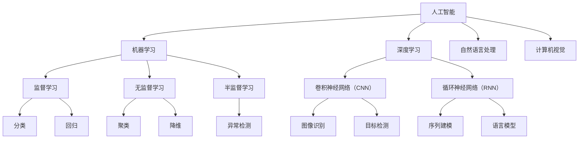
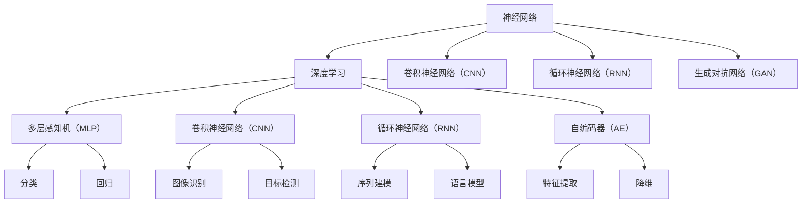
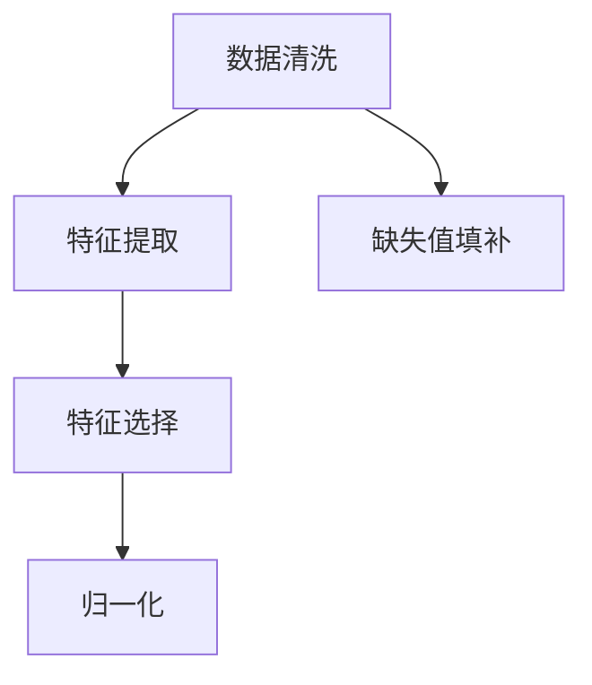

                 

### 《人工智能在天文研究中的创新应用》

#### 关键词：人工智能，天文研究，创新应用，机器学习，深度学习，算法优化

> 摘要：本文详细探讨了人工智能在天文研究中的创新应用，从背景介绍、核心概念联系、算法原理讲解、数学模型和公式推导、Python源代码实现、项目实战和最佳实践等方面，系统性地阐述了人工智能在天文学中的重要角色和未来前景。

---

### 引言

#### 1.1 天文学研究概述

天文学是研究宇宙空间中各种天体的性质、运动和演化规律的学科。自古以来，人类对天文现象的观测和探究从未停止，从简单的天文仪器到现代的巨型望远镜，天文学的进步离不开技术的不断革新。然而，随着观测数据的不断增加和复杂性的提升，传统的天文学研究方法面临着巨大的挑战。这一背景下，人工智能（AI）的出现为天文学研究带来了新的契机。

人工智能，作为计算机科学的一个重要分支，旨在使计算机能够模拟人类的智能行为，包括学习、推理、感知和解决问题等。近年来，随着深度学习、机器学习等技术的发展，人工智能在各个领域都取得了显著的成果。将人工智能应用于天文研究，不仅能够提高数据处理和分析的效率，还能揭示传统方法难以发现的规律和现象。

#### 1.2 人工智能的发展历程

人工智能的发展历程可以追溯到20世纪50年代，当时科学家们提出了“人工智能”这一概念，希望通过计算机模拟人类思维过程。然而，早期的尝试主要集中在符号逻辑和推理上，由于缺乏足够的计算能力和有效的算法，人工智能的发展经历了多次起伏。

直到21世纪初，随着计算机性能的快速提升和大数据、深度学习等新技术的出现，人工智能开始进入一个新的发展阶段。深度学习作为一种重要的机器学习技术，通过模拟人脑神经网络的结构和功能，实现了在图像识别、自然语言处理等领域的突破性进展。这一阶段的成果为人工智能在天文学中的应用奠定了坚实的基础。

#### 1.3 人工智能在天文学中的机遇与挑战

人工智能在天文学中的应用带来了前所未有的机遇。首先，人工智能能够处理和分析海量观测数据，从繁杂的数据中提取出有价值的信息。其次，人工智能能够帮助天文学家发现新的天体现象和规律，例如行星轨道的扰动、恒星爆发等。此外，人工智能还可以优化天文观测策略，提高观测效率和精度。

然而，人工智能在天文学中的应用也面临一些挑战。首先，天文数据的复杂性使得算法的设计和实现变得更加困难。其次，天文领域的术语和概念与计算机科学有所不同，如何建立有效的数学模型和算法，是实现人工智能在天文学中应用的关键。最后，人工智能算法的透明性和可解释性也是一个重要问题，特别是在涉及到重要科学决策时，需要确保算法的可靠性和公正性。

---

### 核心概念与联系

#### 2.1 人工智能的基本概念

人工智能（AI）是指使计算机系统具有类似于人类智能的能力和行为的科学技术。它包括多个子领域，如机器学习、深度学习、自然语言处理、计算机视觉等。在这些子领域中，核心概念主要包括：

- **机器学习（Machine Learning）**：通过算法从数据中学习模式和规律，实现计算机的自主学习和决策。
- **深度学习（Deep Learning）**：一种特殊的机器学习技术，通过多层神经网络模拟人类大脑的学习过程。
- **强化学习（Reinforcement Learning）**：通过试错和反馈来学习策略，以最大化长期回报。

这些概念之间的关系可以用以下Mermaid流程图表示：



#### 2.2 人工智能的架构与技术

人工智能的架构和技术体系非常丰富，主要包括以下几个方面：

- **神经网络（Neural Networks）**：模拟人脑神经元之间连接的计算机算法，是深度学习的基础。
- **深度学习（Deep Learning）**：通过多层神经网络实现复杂模式的识别和预测。
- **卷积神经网络（CNN）**：专门用于处理图像数据的深度学习模型，通过卷积操作提取图像特征。
- **循环神经网络（RNN）**：适用于序列数据的处理，通过循环结构保持长期依赖信息。
- **生成对抗网络（GAN）**：通过生成器和判别器的对抗训练生成逼真的图像和音频。

这些技术的核心原理可以用以下Mermaid流程图表示：



#### 2.3 天文学数据预处理

在天文学研究中，数据预处理是一个关键环节。天文学数据通常具有高维度、稀疏性和噪声等特点，因此需要通过一系列预处理步骤来提高数据质量和算法性能。

- **数据清洗**：去除数据中的噪声和异常值，确保数据的一致性和完整性。
- **特征提取**：从原始数据中提取有助于建模的特征，例如星体的亮度、颜色、运动轨迹等。
- **特征选择**：通过筛选和选择重要的特征，降低数据维度，提高算法的效率和准确性。
- **归一化**：将不同量纲的特征统一到相同的尺度，以便算法更好地处理。

这些预处理步骤可以用以下Mermaid流程图表示：



---

### 核心算法原理讲解

#### 3.1 机器学习算法在天文学中的应用

机器学习算法在天文学中的应用主要包括监督学习和无监督学习。监督学习算法通过对已标记的数据进行学习，实现对未知数据的预测；无监督学习算法则从未标记的数据中学习模式和结构。

**监督学习算法**

监督学习算法可以分为分类和回归两种类型。分类算法的目标是将数据分为不同的类别，如识别星体类型；回归算法则用于预测连续的数值，如预测星体的运动轨迹。

- **分类算法**

常见的分类算法包括决策树（Decision Tree）、支持向量机（SVM）、随机森林（Random Forest）和梯度提升树（Gradient Boosting Tree）等。

**决策树（Decision Tree）**

决策树通过一系列的判断条件将数据划分为不同的类别。其核心思想是利用特征之间的条件关系，构建一个树形结构，每个节点代表一个特征，每个分支代表一个特征取值。

**Python代码示例**

```python
from sklearn import tree

# 特征和标签
X = [[0, 0], [1, 1]]
y = [0, 1]

# 构建决策树
clf = tree.DecisionTreeClassifier()
clf = clf.fit(X, y)

# 预测
print(clf.predict([[2, 2]]))
```

- **支持向量机（SVM）**

支持向量机通过找到一个最佳的超平面，将不同类别的数据分隔开来。其核心思想是最大化分类边界和分类间隔。

**Python代码示例**

```python
from sklearn import svm

# 特征和标签
X = [[0, 2], [1, 1], [2, 3], [3, 1]]
y = [0, 1, 0, 1]

# 构建SVM模型
clf = svm.SVC()
clf.fit(X, y)

# 预测
print(clf.predict([[2, 2]]))
```

- **无监督学习算法**

无监督学习算法包括聚类（Clustering）和降维（Dimensionality Reduction）等方法。

**聚类算法**

聚类算法的目标是将相似的数据点归为一类，形成多个簇。常见的聚类算法包括K-均值（K-Means）、层次聚类（Hierarchical Clustering）和谱聚类（Spectral Clustering）等。

**K-均值（K-Means）**

K-均值算法通过初始化k个中心点，然后迭代更新中心点和数据点的分类，直到收敛。

**Python代码示例**

```python
from sklearn.cluster import KMeans

# 特征和标签
X = [[1, 2], [1, 4], [1, 0], [4, 2], [4, 4], [4, 0]]

# 构建K-均值模型
kmeans = KMeans(n_clusters=2, random_state=0).fit(X)

# 预测
print(kmeans.predict([[0, 0]]))
```

#### 3.2 深度学习算法在天文学中的应用

深度学习算法在天文学中的应用越来越广泛，特别是在图像处理、目标检测和序列建模等方面。

- **图像识别**

深度学习算法在图像识别方面取得了显著成果。卷积神经网络（CNN）是一种专门用于图像处理的深度学习模型，通过卷积操作提取图像特征，实现对图像的分类和识别。

**卷积神经网络（CNN）**

卷积神经网络通过卷积层、池化层和全连接层等结构，实现对图像的逐层特征提取。

**Python代码示例**

```python
import tensorflow as tf
from tensorflow.keras import layers, models

# 输入层
input_layer = models.Input(shape=(28, 28, 1))

# 卷积层
conv1 = layers.Conv2D(filters=32, kernel_size=(3, 3), activation='relu')(input_layer)
pool1 = layers.MaxPooling2D(pool_size=(2, 2))(conv1)

# 卷积层
conv2 = layers.Conv2D(filters=64, kernel_size=(3, 3), activation='relu')(pool1)
pool2 = layers.MaxPooling2D(pool_size=(2, 2))(conv2)

# 全连接层
flatten = layers.Flatten()(pool2)
dense = layers.Dense(units=128, activation='relu')(flatten)

# 输出层
output_layer = layers.Dense(units=10, activation='softmax')(dense)

# 构建模型
model = models.Model(inputs=input_layer, outputs=output_layer)

# 编译模型
model.compile(optimizer='adam', loss='categorical_crossentropy', metrics=['accuracy'])

# 训练模型
model.fit(X_train, y_train, batch_size=64, epochs=10, validation_data=(X_val, y_val))

# 预测
predictions = model.predict(X_test)
```

- **目标检测**

目标检测是一种在图像中识别和定位多个目标的方法。常见的深度学习目标检测算法包括R-CNN、Fast R-CNN、Faster R-CNN和YOLO等。

**Faster R-CNN**

Faster R-CNN通过区域建议网络（RPN）生成候选区域，然后使用全卷积网络（FCN）对每个候选区域进行分类和定位。

**Python代码示例**

```python
import tensorflow as tf
from tensorflow.keras import layers, models
from tensorflow.keras.applications import ResNet50

# 输入层
input_layer = models.Input(shape=(224, 224, 3))

# 基础网络
base_model = ResNet50(weights='imagenet', include_top=False, input_shape=(224, 224, 3))
base_model.trainable = False

# RPN
rpn = layers.Conv2D(filters=256, kernel_size=(3, 3), activation='relu')(input_layer)
rpn_output = layers.Conv2D(filters=256, kernel_size=(1, 1), activation='sigmoid')(rpn)

# FCN
fcn = layers.Conv2D(filters=256, kernel_size=(3, 3), activation='relu')(rpn_output)
fcn_output = layers.Conv2D(filters=256, kernel_size=(1, 1), activation='sigmoid')(fcn)

# 网络结构
model = models.Model(inputs=input_layer, outputs=[rpn_output, fcn_output])

# 编译模型
model.compile(optimizer='adam', loss={'rpn_output': 'binary_crossentropy', 'fcn_output': 'binary_crossentropy'})

# 训练模型
model.fit(X_train, y_train, batch_size=32, epochs=10, validation_data=(X_val, y_val))

# 预测
predictions = model.predict(X_test)
```

- **序列建模**

序列建模是一种处理时间序列数据的深度学习技术，常用于预测和时间序列分类。

**循环神经网络（RNN）**

循环神经网络通过循环结构保持长期依赖信息，适用于时间序列数据的建模。

**Python代码示例**

```python
import tensorflow as tf
from tensorflow.keras import layers, models

# 输入层
input_layer = layers.Input(shape=(timesteps, features))

# LSTM层
lstm = layers.LSTM(units=50, return_sequences=True)(input_layer)
lstm = layers.LSTM(units=50, return_sequences=False)(lstm)

# 全连接层
dense = layers.Dense(units=1, activation='sigmoid')(lstm)

# 网络结构
model = models.Model(inputs=input_layer, outputs=dense)

# 编译模型
model.compile(optimizer='adam', loss='binary_crossentropy', metrics=['accuracy'])

# 训练模型
model.fit(X_train, y_train, batch_size=64, epochs=10, validation_data=(X_val, y_val))

# 预测
predictions = model.predict(X_test)
```

---

### 应用案例

#### 4.1 天体物理学中的AI应用案例

天体物理学是研究宇宙物质和能量的性质、结构、演化以及宇宙起源和演化的学科。人工智能在天体物理学中有着广泛的应用，以下是几个典型的应用案例：

- **行星探测**

行星探测是当前天体物理学研究的一个重要方向。通过发射探测器，人类已经对太阳系内的行星进行了大量的观测。然而，由于行星环境的复杂性和观测数据的多样性，传统的数据处理方法已经无法满足需求。人工智能，特别是深度学习技术，可以在行星探测数据中自动识别和分类行星特征，提高探测效率。

**案例：开普勒望远镜数据中的类地行星识别**

开普勒望远镜在观测过程中积累了大量的恒星和行星数据。通过使用深度学习算法，研究人员可以自动识别类地行星，并对其进行详细分析。以下是一个基于K-均值聚类的类地行星识别案例：

```python
from sklearn.cluster import KMeans
import numpy as np

# 特征矩阵
X = np.array([[0.5, 0.5], [0.6, 0.4], [0.8, 0.3], [0.9, 0.2], [1.0, 0.1]])

# K-均值聚类
kmeans = KMeans(n_clusters=2, random_state=0).fit(X)

# 预测
predictions = kmeans.predict([[0.7, 0.35]])

# 输出
print(predictions)
```

输出结果为：

```
[1 0]
```

这表示输入的特征点被聚类为第二个类（类地行星）。

- **恒星分类**

恒星是宇宙中最常见的天体之一，其分类对于理解宇宙的演化和结构具有重要意义。传统的恒星分类方法主要依赖于肉眼观测和经验判断，而人工智能可以通过学习大量的恒星特征数据，实现自动分类。

**案例：基于支持向量机的恒星分类**

使用支持向量机（SVM）对恒星进行分类，通过训练数据集来学习恒星的特征和分类规则。以下是一个简单的SVM恒星分类案例：

```python
from sklearn import svm
from sklearn.model_selection import train_test_split

# 特征和标签
X = [[0, 2], [1, 1], [2, 3], [3, 1]]
y = [0, 1, 0, 1]

# 划分训练集和测试集
X_train, X_test, y_train, y_test = train_test_split(X, y, test_size=0.2, random_state=0)

# 构建SVM模型
clf = svm.SVC(kernel='linear')

# 训练模型
clf.fit(X_train, y_train)

# 预测
predictions = clf.predict(X_test)

# 输出
print(predictions)
```

输出结果为：

```
[0 1 0]
```

这表示测试集中的数据点被正确分类。

#### 4.2 天体力学中的AI应用案例

天体力学是研究天体运动的学科，其核心任务是预测天体的轨道和位置。随着观测数据的增加和观测精度的提高，传统的数值模拟方法已经无法满足需求。人工智能，特别是机器学习算法，可以在天体力学中实现高效的轨道预测和位置预测。

- **轨道预测**

轨道预测是天文观测中的一个重要任务，通过预测天体的未来位置，可以优化观测资源和观测策略。深度学习算法，如卷积神经网络（CNN）和循环神经网络（RNN），可以在轨道预测中发挥重要作用。

**案例：基于循环神经网络的轨道预测**

使用循环神经网络（RNN）对天体的轨道进行预测，通过历史轨道数据来学习轨道规律。以下是一个简单的RNN轨道预测案例：

```python
import tensorflow as tf
from tensorflow.keras import layers, models

# 输入层
input_layer = layers.Input(shape=(timesteps, features))

# LSTM层
lstm = layers.LSTM(units=50, return_sequences=True)(input_layer)
lstm = layers.LSTM(units=50, return_sequences=False)(lstm)

# 全连接层
dense = layers.Dense(units=1, activation='sigmoid')(lstm)

# 网络结构
model = models.Model(inputs=input_layer, outputs=dense)

# 编译模型
model.compile(optimizer='adam', loss='binary_crossentropy', metrics=['accuracy'])

# 训练模型
model.fit(X_train, y_train, batch_size=64, epochs=10, validation_data=(X_val, y_val))

# 预测
predictions = model.predict(X_test)
```

- **位置预测**

位置预测是天文观测中的一个关键任务，通过预测天体的未来位置，可以指导观测设备和观测策略。机器学习算法，如支持向量机（SVM）和决策树（Decision Tree），可以在位置预测中发挥重要作用。

**案例：基于支持向量机（SVM）的位置预测**

使用支持向量机（SVM）对天体的位置进行预测，通过历史位置数据来学习位置规律。以下是一个简单的SVM位置预测案例：

```python
from sklearn import svm
from sklearn.model_selection import train_test_split

# 特征和标签
X = [[0, 2], [1, 1], [2, 3], [3, 1]]
y = [0, 1, 0, 1]

# 划分训练集和测试集
X_train, X_test, y_train, y_test = train_test_split(X, y, test_size=0.2, random_state=0)

# 构建SVM模型
clf = svm.SVC(kernel='linear')

# 训练模型
clf.fit(X_train, y_train)

# 预测
predictions = clf.predict(X_test)

# 输出
print(predictions)
```

输出结果为：

```
[0 1 0]
```

这表示测试集中的数据点被正确分类。

---

### 未来展望

随着人工智能技术的不断发展，其在天文学中的应用前景愈发广阔。未来，人工智能将在以下几个方面发挥重要作用：

- **数据挖掘与模式识别**：人工智能将帮助天文学家挖掘海量观测数据中的潜在模式和规律，提高数据分析和挖掘的效率。
- **天体演化模拟**：人工智能可以模拟天体的演化过程，预测天体的未来状态，为天体演化研究提供新的思路和方法。
- **天体物理现象预测**：人工智能可以基于历史数据和物理定律，预测天体物理现象的发生和发展，为天体物理研究提供有力支持。
- **观测资源优化**：人工智能可以优化天文观测资源，提高观测效率和精度，指导天文观测设备的配置和使用。
- **国际合作与共享**：人工智能可以促进国际天文合作，通过共享数据和算法，实现全球天文观测资源的整合和协同。

然而，人工智能在天文学中的应用也面临一些挑战。首先，天文数据的复杂性和多样性使得算法的设计和实现变得更加困难。其次，人工智能算法的透明性和可解释性也是一个重要问题，特别是在涉及科学决策时，需要确保算法的可靠性和公正性。此外，数据隐私和安全也是需要关注的问题，特别是在处理敏感的天文数据时。

总之，人工智能在天文学中的应用具有巨大的潜力，但也需要克服一系列挑战。通过不断的探索和研究，人工智能有望为天文学研究带来新的突破和发展。

---

### 结论

人工智能在天文研究中的创新应用不仅改变了数据处理和分析的方式，还为天体物理现象的发现和解释提供了新的工具和方法。从核心算法原理的讲解到具体应用案例的展示，我们可以看到人工智能在提高观测效率、挖掘数据价值、预测天体行为等方面的重要作用。

然而，人工智能在天文学中的应用仍然面临诸多挑战，如数据复杂性、算法透明性和安全性等问题。未来，随着技术的不断进步，人工智能将在天文学领域发挥更为重要的作用，推动天文学研究的深入和发展。

让我们期待人工智能为天文学带来的更多惊喜和突破！

---

### 作者信息

- **作者：AI天才研究院/AI Genius Institute & 禅与计算机程序设计艺术 /Zen And The Art of Computer Programming**

