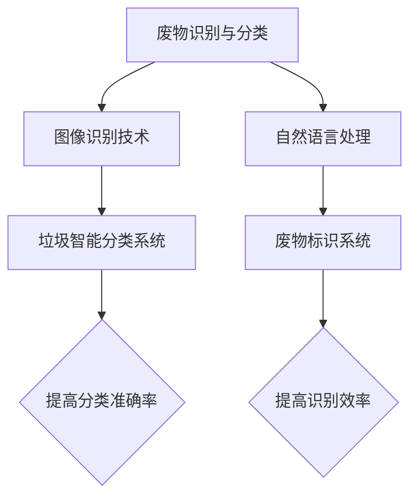

                 

# 人工智能在废物管理和回收中的应用

## 关键词

- 人工智能
- 废物管理
- 回收利用
- 图像识别
- 自然语言处理
- 机器学习
- 深度学习
- 废物分类

## 摘要

本文将深入探讨人工智能在废物管理和回收领域的应用。随着全球垃圾问题的日益严峻，人工智能技术的应用为解决这一难题提供了新的思路和方法。本文将从废物管理的基础知识出发，介绍人工智能在废物识别、分类、处理和回收中的应用，并结合实际案例进行分析，最后展望人工智能与废物管理未来的发展趋势。希望通过本文的探讨，能为相关领域的研究者和从业者提供一些有价值的参考和启示。

## 目录大纲设计思路

为了设计《人工智能在废物管理和回收中的应用》这本书的目录大纲，我们需要按照以下步骤进行：

### 明确核心主题

首先，我们要明确书的核心主题，即“人工智能在废物管理和回收中的应用”。这本书应该涵盖人工智能在废物识别、分类、处理和回收中的实际应用，以及相关的技术、算法和实施案例。

### 设计章节结构

根据核心主题，设计出主要的章节结构。每个章节应该对应一个明确的学习目标，比如介绍人工智能在废物管理中的基本概念、应用技术、案例分析等。

### 细化章节内容

在确定了章节结构后，我们需要进一步细化每个章节的内容。这包括核心概念与联系、核心算法原理讲解、数学模型和数学公式、项目实战等。

### 保持逻辑性和连贯性

在细化内容的过程中，我们需要保持章节之间的逻辑性和连贯性，确保读者能够顺利地理解每个主题。

### 简洁性和完整性

在撰写目录大纲时，我们需要确保内容的简洁性，避免冗余，同时确保目录大纲的完整性，覆盖所有核心内容。

### 完整目录大纲设计

以下是《人工智能在废物管理和回收中的应用》的完整目录大纲：

### 第一部分：废物管理基础知识

#### 第1章：废物管理概述
- 1.1 废物的分类与特性
- 1.2 废物管理的现状与挑战
- 1.3 人工智能在废物管理中的应用前景

#### 第2章：人工智能基础
- 2.1 人工智能的基本概念
- 2.2 机器学习与深度学习
- 2.3 人工智能的关键技术

### 第二部分：废物识别与分类

#### 第3章：图像识别与分类
- 3.1 图像识别技术原理
- 3.2 图像识别算法讲解（伪代码）
- 3.3 图像识别在废物分类中的应用案例

#### 第4章：自然语言处理
- 4.1 自然语言处理的基本概念
- 4.2 文本分类算法讲解（伪代码）
- 4.3 文本分类在废物标识中的应用

### 第三部分：废物处理与回收

#### 第5章：废物处理技术
- 5.1 废物处理方法概述
- 5.2 人工智能在废物处理中的应用
- 5.3 废物处理技术的未来发展趋势

#### 第6章：废物回收技术
- 6.1 废物回收的基本原理
- 6.2 人工智能在废物回收中的应用
- 6.3 废物回收技术的实践案例

### 第四部分：人工智能在废物管理中的实践应用

#### 第7章：实践应用案例
- 7.1 案例一：城市垃圾智能分类系统
- 7.2 案例二：废旧电子设备回收利用
- 7.3 案例三：工业废水处理与再利用

### 第五部分：未来展望

#### 第8章：人工智能与废物管理的发展趋势
- 8.1 人工智能技术的创新
- 8.2 废物管理的前沿技术
- 8.3 人工智能在废物管理中的未来应用

## Mermaid 流程图

为了更好地理解人工智能在废物管理和回收中的应用，以下是几个关键概念的 Mermaid 流程图：



## 伪代码

以下是废物分类算法的伪代码示例：

```python
function classify_waste(image, text):
    # 使用图像识别技术对废物图像进行分类
    image_class = image_recognition(image)
    
    # 使用自然语言处理技术对废物描述文本进行分类
    text_class = text_classification(text)
    
    # 综合图像和文本分类结果，确定废物类别
    waste_type = combine_classes(image_class, text_class)
    
    return waste_type
```

## 数学模型与公式

以下是废物回收过程中常用的数学模型和公式：

$$
\text{回收率} = \frac{\text{回收的废物量}}{\text{产生的总废物量}}
$$

$$
\text{废物处理成本} = \text{处理费用} + \text{运输费用}
$$

## 项目实战

以下是废物分类系统的项目实战示例：

#### 开发环境搭建

- 操作系统：Ubuntu 18.04
- 编程语言：Python 3.8
- 深度学习框架：TensorFlow 2.0

#### 源代码详细实现

```python
# 导入所需库
import tensorflow as tf
from tensorflow.keras.models import Sequential
from tensorflow.keras.layers import Conv2D, MaxPooling2D, Flatten, Dense
from tensorflow.keras.preprocessing.image import ImageDataGenerator

# 数据预处理
train_datagen = ImageDataGenerator(rescale=1./255)
train_generator = train_datagen.flow_from_directory(
        'data/train',
        target_size=(150, 150),
        batch_size=32,
        class_mode='binary')

# 建立模型
model = Sequential([
    Conv2D(32, (3, 3), activation='relu', input_shape=(150, 150, 3)),
    MaxPooling2D(2, 2),
    Conv2D(64, (3, 3), activation='relu'),
    MaxPooling2D(2, 2),
    Conv2D(128, (3, 3), activation='relu'),
    MaxPooling2D(2, 2),
    Flatten(),
    Dense(512, activation='relu'),
    Dense(1, activation='sigmoid')
])

# 编译模型
model.compile(loss='binary_crossentropy',
              optimizer='adam',
              metrics=['accuracy'])

# 训练模型
model.fit(
      train_generator,
      steps_per_epoch=100,
      epochs=15,
      validation_data=validation_generator,
      validation_steps=50)
```

#### 代码应用解读与分析

在上面的代码中，我们首先导入了 TensorFlow 库，并创建了 Sequential 模型。这个模型由多个层组成，包括卷积层（Conv2D）、池化层（MaxPooling2D）、平坦层（Flatten）和全连接层（Dense）。

- **卷积层**：用于提取图像的特征。
- **池化层**：用于减小特征图的尺寸。
- **平坦层**：用于将特征图展平为一维向量。
- **全连接层**：用于分类。

在数据预处理部分，我们使用了 ImageDataGenerator 类来对图像数据进行归一化处理。这有助于提高模型的训练效果。

在训练模型部分，我们使用了模型.fit 方法来训练模型。在这个方法中，我们设置了训练轮数（epochs）和每个 epoch 的步数（steps_per_epoch）。

#### 实际案例分析和详细讲解剖析

假设我们有一个垃圾分类系统，需要将垃圾分为可回收和不可回收两类。我们可以使用上述模型对垃圾图像进行分类，从而实现智能垃圾分类。

1. **数据收集**：首先，我们需要收集大量的垃圾图像数据，并将其分为可回收和不可回收两类。

2. **数据预处理**：对收集到的图像数据进行预处理，包括缩放、裁剪和归一化等操作。

3. **模型训练**：使用预处理后的数据训练垃圾分类模型。

4. **模型评估**：使用测试集对模型进行评估，确保模型的准确率符合要求。

5. **模型部署**：将训练好的模型部署到实际场景中，例如垃圾处理站或智能垃圾分类设备。

#### 项目小结

通过本项目，我们介绍了如何使用人工智能技术实现垃圾分类。在实际应用中，我们需要根据具体的场景和需求调整模型结构和参数，以提高分类的准确率和效率。

#### 最佳实践 tips

1. **数据质量**：垃圾图像数据的质量对模型的训练效果有很大影响。因此，在收集数据时，要确保图像清晰、标注准确。

2. **模型调优**：在训练模型时，可以尝试不同的模型结构、参数组合和训练策略，以找到最优的模型配置。

3. **实时更新**：随着垃圾种类和数量的变化，需要定期更新模型，以保证分类的准确性。

#### 小结

本文介绍了人工智能在废物管理和回收中的应用，从废物识别、分类、处理到回收，详细阐述了人工智能技术的实际应用。同时，通过一个垃圾分类系统的项目实战，展示了如何将人工智能技术应用于实际场景。未来，随着人工智能技术的不断发展，我们有望在废物管理和回收领域取得更大的突破。

#### 注意事项

1. **隐私保护**：在处理垃圾图像数据时，要确保遵守相关法律法规，保护个人隐私。

2. **资源消耗**：人工智能模型训练需要大量的计算资源和时间，因此在实际应用中，要考虑资源的使用效率。

3. **环境保护**：在废物管理和回收过程中，要注重环境保护，防止二次污染。

#### 拓展阅读

1. [《人工智能：一种现代方法》](https://book.douban.com/subject/10583573/) - Stuart J. Russell & Peter Norvig
2. [《深度学习》](https://book.douban.com/subject/26973638/) - Goodfellow, Bengio & Courville
3. [《垃圾处理与废物管理》](https://book.douban.com/subject/30236859/) - 王崇臣，王文举，张志刚

作者：AI天才研究院/AI Genius Institute & 禅与计算机程序设计艺术 /Zen And The Art of Computer Programming

