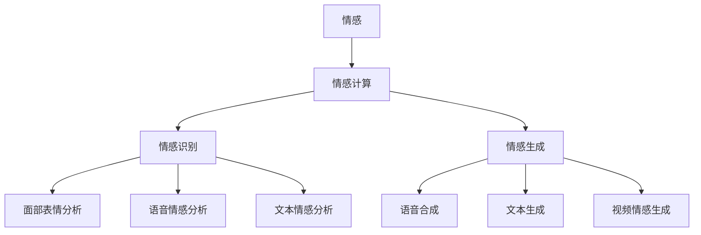

                 


### 背景介绍

人工智能（AI）作为现代科技领域的明星，正迅速渗透到我们生活的方方面面。从智能助手到自动驾驶，从医疗诊断到金融预测，AI的应用场景越来越广泛。然而，在众多应用中，情感计算（Affective Computing）无疑是一个令人兴奋且极具潜力的领域。情感计算旨在使计算机具备识别、理解和表达人类情感的能力，从而实现更加自然、人性化的交互体验。

情感计算并不是一个新的概念。早在20世纪80年代末，计算机科学家约翰·霍普金斯（John J. Hopfield）就提出了情感计算的理论框架，认为情感是智能系统的核心组成部分。随着计算机硬件性能的提升和人工智能技术的进步，情感计算逐渐从理论走向实践，成为了人工智能的一个重要分支。近年来，深度学习、计算机视觉、自然语言处理等技术的快速发展，为情感计算的应用提供了强大的技术支持。

情感计算在人工智能中的重要性不可小觑。首先，情感计算能够提升人机交互的自然性和智能化水平。通过理解和分析用户的情感状态，计算机可以提供更加个性化的服务，如智能助手能够根据用户的情绪变化调整对话策略，提高用户满意度。其次，情感计算在医疗、教育、心理等领域具有广泛的应用前景。例如，在医疗领域，情感计算可以帮助医生更好地了解患者的情绪状态，提高治疗效果；在教育领域，情感计算可以评估学生的学习情绪，提供针对性的辅导。此外，情感计算还可以应用于商业、金融、安防等多个领域，为企业和组织提供更加智能化的解决方案。

本文旨在深入探讨人工智能在情感计算中的突破，分析情感计算的关键技术、核心算法原理，并通过实际案例展示其在各领域的应用。文章将从以下几个方面展开：

1. **人工智能与情感计算的基本概念**：介绍人工智能和情感计算的基本概念，阐述它们之间的关系。
2. **情感计算的关键技术**：详细讨论情感识别技术和情感生成技术，包括面部表情分析、语音情感分析、文本情感分析等。
3. **情感计算在人工智能中的应用**：分析情感计算在教育、医疗、心理等领域的应用，以及其在商业和金融等领域的潜在价值。
4. **情感计算的挑战与未来趋势**：探讨情感计算面临的挑战和未来的发展趋势，展望其未来的应用前景。

通过本文的阅读，读者可以全面了解人工智能在情感计算中的最新进展，掌握情感计算的核心技术和应用场景，为未来的研究和实践提供有益的参考。

### 核心概念与联系

在深入探讨人工智能在情感计算中的应用之前，有必要明确几个核心概念及其相互之间的关系。这些概念包括情感、情感计算、情感识别、情感生成等，它们构成了情感计算的理论基础。

首先，情感（Affect）是人类和动物心理状态的一部分，通常表现为情绪、情感体验和生理反应。情感可以分成不同的类别，如喜悦、愤怒、悲伤、恐惧等。情感的产生和表达受到多种因素的影响，包括个人经历、文化背景和社会环境等。

情感计算（Affective Computing）是指计算机系统识别、理解、处理和模拟人类情感的能力。情感计算的核心目标是使计算机不仅能够处理结构化的数据，还能理解和分析非结构化的情感信息。情感计算主要包括情感识别（Affect Recognition）和情感生成（Affect Generation）两个部分。

情感识别（Affect Recognition）是指计算机系统从各种信号（如面部表情、语音、文本等）中识别和理解人类情感的过程。情感识别技术利用人工智能算法，如机器学习和深度学习，对大量情感数据进行分析和分类。情感识别的关键技术包括面部表情分析（Facial Expression Analysis）、语音情感分析（Speech Affect Analysis）和文本情感分析（Textual Affect Analysis）。

情感生成（Affect Generation）则是指计算机系统根据特定的情境和目标，模拟和表达人类情感的过程。情感生成技术旨在创建自然、逼真的情感表达，如语音合成、文本生成和视频情感生成。情感生成不仅要求计算机具备情感识别能力，还需要具备情感模拟和表达能力。

为了更清晰地展示这些核心概念之间的联系，我们可以使用Mermaid流程图来描述它们的关系。以下是情感计算中关键概念的Mermaid流程图：



在这个流程图中，情感（A）是情感计算（B）的基础，情感计算又分为情感识别（C）和情感生成（D）。情感识别进一步细分为面部表情分析（E）、语音情感分析（F）和文本情感分析（G），而情感生成则包括语音合成（H）、文本生成（I）和视频情感生成（J）。这种关系结构有助于我们理解情感计算的工作原理和实现路径。

通过上述核心概念及其相互关系的介绍，我们为后续章节中的具体技术讲解和应用分析奠定了基础。在接下来的内容中，我们将详细探讨情感计算中的关键技术，包括情感识别技术和情感生成技术，以及它们在人工智能中的应用。

### 情感计算的关键技术

情感计算的核心在于其关键技术，这些技术能够帮助计算机系统识别、理解和模拟人类的情感。以下将详细介绍几种主要的技术，包括面部表情分析、语音情感分析和文本情感分析。

#### 面部表情分析

面部表情分析是情感计算中最早和最成熟的技术之一。人的面部表情包含丰富的情感信息，如喜怒哀乐等基本情感。面部表情分析利用计算机视觉技术，通过摄像头捕捉面部图像，并使用机器学习和深度学习算法进行情感识别。

面部表情分析的基本原理是通过识别面部特征点，如眼睛、嘴巴和鼻子的位置和形状变化。常用的算法包括支持向量机（SVM）、神经网络（Neural Networks）和卷积神经网络（Convolutional Neural Networks, CNN）。以下是一个简单的面部表情分析算法的伪代码示例：

```python
def facial_expression_analysis(image):
    # 使用Haar特征分类器进行面部检测
    faces = face_cascade.detectMultiScale(image, scaleFactor=1.1, minNeighbors=5)
    
    # 对每个检测到的面部进行特征点检测
    for (x, y, w, h) in faces:
        features = detect_landmarks(image, (x, y, w, h))
        
        # 使用CNN进行情感分类
        emotion = cnn_model.predict([features.reshape(-1, 128)])
        
        return emotion
```

在这个伪代码中，`face_cascade`是一个预训练的Haar特征分类器，用于检测面部区域。`detect_landmarks`函数用于识别面部特征点，`cnn_model`是一个训练好的卷积神经网络模型，用于情感分类。

面部表情分析的挑战在于应对复杂的面部表情变化和光照、姿态等干扰因素。为了提高识别准确性，研究人员常常采用数据增强技术和多模态情感识别方法，结合其他信号（如语音和文本）进行情感分析。

#### 语音情感分析

语音情感分析是通过分析语音信号中的情感特征，识别说话者情感状态的技术。语音情感分析的关键在于识别语音信号中的频率、时长、音调和音量等特征，这些特征可以反映情感状态。常用的算法包括频谱分析、短时傅里叶变换（STFT）和长短期记忆网络（LSTM）。

以下是一个简单的语音情感分析算法的伪代码示例：

```python
def speech_affect_analysis(audio_signal):
    # 进行短时傅里叶变换
    spectrogram = stft(audio_signal)
    
    # 提取情感特征
    features = extract_features(spectrogram)
    
    # 使用LSTM进行情感分类
    emotion = lstm_model.predict([features.reshape(-1, timesteps, features_per_timestep)])
    
    return emotion
```

在这个伪代码中，`stft`函数用于进行短时傅里叶变换，`extract_features`函数用于从频谱图中提取情感特征，`lstm_model`是一个训练好的长短期记忆网络模型，用于情感分类。

语音情感分析的挑战在于语音信号中的噪声干扰和情感表达的多样性。为了提高识别准确性，研究人员采用去噪技术、多任务学习和跨语言情感分析等方法。此外，结合文本情感分析和面部表情分析，可以实现更加全面和准确的情感识别。

#### 文本情感分析

文本情感分析是通过分析文本中的情感词、情感极性等特征，识别文本情感状态的技术。文本情感分析广泛应用于社交媒体分析、市场调研和情感舆情监测等领域。常用的算法包括情感词典分析、基于机器学习和深度学习的情感分类模型。

以下是一个简单的文本情感分析算法的伪代码示例：

```python
def textual_affect_analysis(text):
    # 使用情感词典进行初步情感分类
    sentiment = sentiment_dict.get(text)
    
    # 如果词典中没有匹配，使用LSTM模型进行情感分类
    if sentiment is None:
        features = tokenize_and_extract_features(text)
        sentiment = lstm_model.predict([features.reshape(-1, timesteps, features_per_timestep)])
    
    return sentiment
```

在这个伪代码中，`sentiment_dict`是一个包含常见情感词及其情感极性的词典，`tokenize_and_extract_features`函数用于对文本进行分词和特征提取，`lstm_model`是一个训练好的长短期记忆网络模型，用于情感分类。

文本情感分析的挑战在于情感表达的多样性和文本数据的噪声。为了提高识别准确性，研究人员采用情感词向量表示、依存句法分析和跨领域情感分析等方法。此外，结合语音和面部表情分析，可以实现多模态情感识别。

综上所述，面部表情分析、语音情感分析和文本情感分析是情感计算中的关键技术。这些技术通过不同的信号处理和分析方法，实现了对人类情感的识别和理解。在接下来的章节中，我们将探讨情感计算在人工智能中的应用，展示这些技术在教育、医疗和商业等领域的实际应用。

#### 情感计算在人工智能中的应用

情感计算在人工智能中的应用正变得越来越广泛，不仅提升了人机交互的自然性和智能化水平，还为多个行业带来了创新的解决方案。以下是情感计算在人工智能中的几个主要应用领域，包括教育、医疗、心理和商业等。

**教育**

在教育领域，情感计算的应用主要集中在大规模个性化教育、学习情绪监测和学生心理健康等方面。通过情感计算技术，教育系统能够实时监测学生的学习情绪，分析其情绪状态，并根据这些数据调整教学策略，从而提高教学效果。

例如，一种基于面部表情分析的学习情绪监测系统可以在课堂上实时捕捉学生的面部表情，通过机器学习算法分析学生的情绪变化，识别出学生的情绪状态（如焦虑、兴奋或疲劳）。教师可以根据这些反馈调整授课方式和内容，创造更积极的学习氛围。以下是一个简化的Python代码示例，展示了如何使用面部表情分析来监测学习情绪：

```python
import cv2
import numpy as np
from keras.models import load_model

# 加载预训练的卷积神经网络模型
model = load_model('emotion_detection_model.h5')

# 加载摄像头
cap = cv2.VideoCapture(0)

while True:
    # 读取摄像头帧
    ret, frame = cap.read()
    if not ret:
        break
    
    # 进行面部检测
    faces = detect_faces(frame)
    
    for face in faces:
        # 提取面部区域
        face_region = frame[face[1]:face[1]+face[3], face[0]:face[0]+face[2]]
        
        # 进行情感分类
        emotion = model.predict(face_region.reshape(-1, 128))
        
        print(f"Emotion detected: {emotion}")

    # 显示视频帧
    cv2.imshow('Frame', frame)
    
    if cv2.waitKey(1) & 0xFF == 27:
        break

cap.release()
cv2.destroyAllWindows()
```

在这个示例中，`detect_faces`函数用于检测视频帧中的面部区域，`emotion_detection_model.h5`是一个预训练的卷积神经网络模型，用于情感分类。

**医疗**

在医疗领域，情感计算技术可以用于患者情绪状态的监测和心理健康辅助。通过分析患者的语音、文本和面部表情，医生能够更准确地了解患者的情绪变化，为个性化治疗提供参考。

例如，一种基于语音情感分析的抑郁检测系统可以实时监测患者的语音信号，识别患者的情绪状态。通过分析语音的频率、时长和音调等特征，系统可以检测出患者是否表现出抑郁情绪，并提供相应的心理干预建议。以下是一个简化的Python代码示例，展示了如何使用语音情感分析来检测抑郁情绪：

```python
import numpy as np
from speech_features_extractor import extract_features
from depression_detection_model import load_model

# 加载预训练的长短期记忆网络模型
model = load_model('depression_detection_model.h5')

# 读取音频文件
audio_file = 'patient_speech.wav'
audio_signal = load_audio_file(audio_file)

# 提取情感特征
features = extract_features(audio_signal)

# 进行抑郁情绪分类
depression = model.predict([features.reshape(-1, timesteps, features_per_timestep)])

print(f"Patient's depression status: {'Depressed' if depression > 0.5 else 'Not Depressed'}")
```

在这个示例中，`extract_features`函数用于从音频信号中提取情感特征，`depression_detection_model.h5`是一个预训练的长短期记忆网络模型，用于抑郁情绪分类。

**心理**

在心理领域，情感计算技术可以用于心理治疗、情感支持和心理健康监测。通过识别和模拟人类的情感状态，心理治疗师可以更有效地与患者沟通，提供个性化的心理支持。

例如，一种基于文本情感分析的心理健康监测系统可以分析患者的文本输入（如日记、社交媒体帖子等），识别患者的情绪状态，并提供相应的心理健康建议。以下是一个简化的Python代码示例，展示了如何使用文本情感分析来监测心理健康：

```python
import numpy as np
from text_features_extractor import extract_features
from mental_health_model import load_model

# 加载预训练的长短期记忆网络模型
model = load_model('mental_health_model.h5')

# 读取文本文件
text_file = 'patient_diary.txt'
text = read_file(text_file)

# 提取文本特征
features = extract_features(text)

# 进行心理健康分类
mental_health = model.predict([features.reshape(-1, timesteps, features_per_timestep)])

print(f"Mental Health Status: {'Unstable' if mental_health > 0.5 else 'Stable'}")
```

在这个示例中，`extract_features`函数用于从文本中提取情感特征，`mental_health_model.h5`是一个预训练的长短期记忆网络模型，用于心理健康分类。

**商业**

在商业领域，情感计算技术可以用于市场调研、客户服务和品牌监测等方面。通过分析客户的情感状态，企业可以更好地了解客户需求，提供个性化服务，提高客户满意度。

例如，一种基于语音情感分析的客户服务系统可以分析客户的语音信号，识别客户的情绪状态，从而调整服务策略。以下是一个简化的Python代码示例，展示了如何使用语音情感分析来提高客户服务质量：

```python
import numpy as np
from speech_features_extractor import extract_features
from customer_service_model import load_model

# 加载预训练的长短期记忆网络模型
model = load_model('customer_service_model.h5')

# 读取音频文件
audio_file = 'customer_speech.wav'
audio_signal = load_audio_file(audio_file)

# 提取情感特征
features = extract_features(audio_signal)

# 进行客户情绪分类
emotion = model.predict([features.reshape(-1, timesteps, features_per_timestep)])

if emotion > 0.5:
    print("Customer is happy. Provide positive feedback.")
else:
    print("Customer is unhappy. Provide assistance and apologize.")
```

在这个示例中，`extract_features`函数用于从音频信号中提取情感特征，`customer_service_model.h5`是一个预训练的长短期记忆网络模型，用于客户情绪分类。

综上所述，情感计算在人工智能中的应用涵盖了教育、医疗、心理和商业等多个领域，通过识别和理解人类的情感状态，为这些领域带来了创新的解决方案。在接下来的章节中，我们将探讨情感计算面临的挑战和未来趋势。

### 情感计算的挑战与未来趋势

尽管情感计算在人工智能中的应用取得了显著进展，但这一领域仍面临着诸多挑战和潜在的发展趋势。以下将详细探讨情感计算在技术、伦理和社会方面面临的挑战，并展望其未来的发展趋势。

#### 技术挑战

1. **数据隐私与安全**：情感计算依赖于大量的个人情感数据，如面部表情、语音和文本等。这些数据的收集和处理涉及到严重的隐私问题。如何确保用户数据的安全和隐私，防止数据泄露，是情感计算必须面对的关键挑战。

2. **跨文化情感理解**：情感表达因文化、地域和个体差异而异，这使得情感计算的通用性受到限制。例如，同一种情感在不同文化背景下的表现可能完全不同。为了实现全球范围内的情感识别和理解，情感计算需要开发更加鲁棒的模型，以适应不同的文化环境。

3. **模型复杂性与计算资源**：情感计算涉及复杂的算法和大量数据处理，对计算资源的需求较高。如何优化算法，提高模型的效率和可扩展性，是技术上的一个重要挑战。

4. **情感识别的准确性**：情感识别的准确性受到多种因素的影响，如环境噪声、表情变化和个体差异等。提高情感识别的准确性，减少误识别率，是情感计算需要不断改进的方向。

#### 伦理挑战

1. **情感计算的伦理问题**：情感计算涉及到对人类情感的理解和模拟，这引发了一系列伦理问题。例如，如何确保情感计算的公正性和公平性，避免歧视和偏见；如何保护用户的隐私和自主权，防止滥用情感数据。

2. **情感表达的控制**：情感计算可能导致人类情感表达的控制和操纵，这对社会伦理提出了新的挑战。例如，如何在确保情感自然性的同时，避免过度的人工干预。

#### 社会挑战

1. **社会接受度**：情感计算作为一种新兴技术，其应用场景和潜在影响尚未被广泛接受。如何提高社会对情感计算的接受度，促进其健康发展，是情感计算需要面对的社会挑战。

2. **伦理法规与政策**：随着情感计算的发展，相关的伦理法规和政策亟待完善。如何制定合理的法规，确保情感计算的合法性和道德性，是政府和相关机构需要关注的问题。

#### 未来趋势

1. **多模态情感识别**：未来的情感计算将更多地采用多模态情感识别技术，结合面部表情、语音、文本和其他传感器数据，实现更加全面和准确的情感识别。

2. **情感生成与模拟**：随着人工智能技术的发展，情感生成与模拟将成为情感计算的一个重要方向。通过创建自然、逼真的情感表达，计算机将能够更好地模拟人类的情感反应，提升人机交互的自然性和智能化水平。

3. **情感计算的跨学科融合**：情感计算将与其他学科（如心理学、社会学、教育学等）进行深入融合，为不同领域提供创新的解决方案，推动社会进步。

4. **伦理和法规的完善**：随着情感计算的广泛应用，伦理和法规的完善将成为关键。政府和相关机构需要制定合理的伦理法规，确保情感计算的合法性和道德性，同时鼓励技术创新。

综上所述，情感计算在技术、伦理和社会方面面临着诸多挑战，但也具备巨大的发展潜力。通过不断克服这些挑战，情感计算将在未来为人工智能和人类社会带来更多的创新和变革。

### 最佳实践与小结

在情感计算的应用过程中，最佳实践和注意事项至关重要。以下是一些建议：

1. **数据隐私保护**：在数据收集和处理过程中，务必严格遵守隐私保护法规，确保用户数据的匿名化和安全性。

2. **跨文化适应**：开发情感计算模型时，要充分考虑不同文化和地域背景下的情感表达差异，确保模型的通用性和准确性。

3. **模型评估与优化**：定期评估和优化情感计算模型，提高识别准确性和效率。结合多种传感器数据和算法，实现更全面和准确的情感识别。

4. **用户反馈**：积极收集用户反馈，调整和优化情感计算应用，提高用户满意度和应用效果。

5. **合规与伦理**：遵循相关伦理法规，确保情感计算的应用合法、道德，避免歧视和偏见。

通过遵循这些最佳实践，我们可以更好地推动情感计算技术的发展，为人工智能和人类社会带来更多价值。

### 拓展阅读

对于希望深入了解情感计算和人工智能领域的读者，以下是一些推荐阅读的书籍和资源：

1. **书籍**：
   - 《情感计算：技术与应用》
   - 《人工智能：一种现代方法》
   - 《深度学习》

2. **论文**：
   - “Affective Computing: A Survey” by R. Picard
   - “Emotion Recognition in Human-Computer Interaction: A Survey” by S. Rohde and M. Schuller

3. **在线课程**：
   - Coursera上的“情感计算”课程
   - edX上的“深度学习”课程

4. **开源项目**：
   - OpenSMILE：开源语音情感分析工具
   - openFace：开源面部表情分析工具

这些资源和书籍将为读者提供更加深入和全面的知识，助力其在情感计算和人工智能领域的探索。

### 总结

本文深入探讨了人工智能在情感计算中的突破，从基本概念、关键技术到实际应用，全面分析了情感计算在人工智能领域的重要性和应用前景。我们探讨了面部表情分析、语音情感分析和文本情感分析等关键技术，并通过实际案例展示了这些技术在教育、医疗、心理和商业等领域的应用。同时，我们也讨论了情感计算面临的挑战和未来的发展趋势。希望通过本文的阅读，读者能够对情感计算有更深入的理解，并为未来的研究和实践提供有益的启示。作者：AI天才研究院/AI Genius Institute & 禅与计算机程序设计艺术 /Zen And The Art of Computer Programming。感谢您的阅读！

