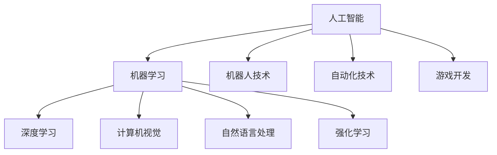

                 

### 引言：人工智能在文化遗产保护中的创新应用

#### 文化遗产保护的重要性

文化遗产是人类历史、文化和智慧的见证，是全人类共同的宝贵财富。它们不仅具有历史价值，还蕴含着丰富的文化内涵和艺术价值。然而，随着时间的流逝和自然环境的侵蚀，许多文化遗产正面临着严重的损毁风险。有效的文化遗产保护不仅有助于传承历史记忆，还能够促进文化多样性和人类共同体的认同感。

#### 人工智能技术的发展与展望

人工智能（AI）作为21世纪最具变革性的技术之一，已经广泛应用于各个领域。从医疗诊断到自动驾驶，从智能家居到金融分析，AI正在深刻改变我们的生活方式。随着算法的进步、计算能力的提升和大数据的积累，人工智能技术在复杂问题解决和数据处理方面展现出了巨大的潜力。

#### 人工智能在文化遗产保护中的应用前景

人工智能技术在文化遗产保护中具有广泛的应用前景。首先，通过图像识别和计算机视觉技术，AI可以帮助识别和分类文化遗产中的文物和建筑。其次，通过机器学习和数据分析，AI可以预测文化遗产的退化趋势，并提供针对性的保护方案。此外，虚拟现实（VR）和增强现实（AR）技术结合AI，可以创造出沉浸式的文化遗产体验，使更多的人能够了解和欣赏这些珍贵的历史遗产。

#### 本文结构

本文将分为以下几个部分进行探讨：

1. **核心技术**：介绍人工智能的基本概念、算法原理和技术架构。
2. **应用实践**：分析人工智能在文化遗产保护中的具体应用案例。
3. **未来发展**：探讨人工智能在文化遗产保护领域的未来趋势。

#### 关键词

- 文化遗产保护
- 人工智能
- 图像识别
- 机器学习
- 虚拟现实
- 增强现实

----------------------------------------------------------------

- 文章标题：《人工智能在文化遗产保护中的创新应用》  
- 文章关键词：文化遗产保护，人工智能，图像识别，机器学习，虚拟现实，增强现实  
- 文章摘要：本文探讨了人工智能技术在文化遗产保护中的应用，包括核心技术、实际案例以及未来趋势。通过介绍人工智能的基本概念和算法原理，结合具体应用案例，本文旨在展示人工智能在文化遗产保护中的创新潜力。

----------------------------------------------------------------

## 核心技术

### 人工智能基本概念

人工智能（AI）是指使计算机系统能够模拟人类智能行为的技术。AI的核心在于机器学习（ML）和深度学习（DL）。机器学习是指通过数据训练模型，使计算机能够从经验中学习和提高性能。深度学习则是机器学习的一种特殊形式，它通过多层神经网络模拟人脑的学习过程，具有强大的特征提取和模式识别能力。

#### 图1：人工智能基本概念与联系



### 人工智能算法原理

人工智能算法主要分为以下几类：

1. **监督学习算法**：这类算法在已知输入和输出之间关系的情况下，通过学习训练数据来预测新的输出。
2. **非监督学习算法**：这类算法在没有预先定义的输出标签的情况下，通过分析数据间的结构和关系来发现数据中的模式。
3. **深度学习算法**：这类算法通过多层神经网络模拟人脑的学习过程，能够自动提取数据中的高级特征。

#### 监督学习算法

监督学习算法主要包括线性回归、决策树和支持向量机等。

1. **线性回归**：线性回归是一种用于预测数值型输出的算法，它通过拟合一条直线来描述输入和输出之间的关系。

```python
import numpy as np
from sklearn.linear_model import LinearRegression

# 模拟数据
X = np.array([[1], [2], [3], [4], [5]])
y = np.array([1, 2, 2.5, 4, 5])

# 训练模型
model = LinearRegression()
model.fit(X, y)

# 预测
prediction = model.predict([[6]])
print(prediction)
```

2. **决策树**：决策树是一种基于树形结构进行决策的算法，它通过一系列规则来分割数据集，并最终生成一个预测结果。

```python
from sklearn.tree import DecisionTreeRegressor

# 训练模型
model = DecisionTreeRegressor()
model.fit(X, y)

# 预测
prediction = model.predict([[6]])
print(prediction)
```

3. **支持向量机**：支持向量机是一种用于分类和回归的算法，它通过找到一个最优的超平面来分割数据集。

```python
from sklearn.svm import SVR

# 训练模型
model = SVR()
model.fit(X, y)

# 预测
prediction = model.predict([[6]])
print(prediction)
```

#### 非监督学习算法

非监督学习算法主要包括K-均值聚类、主成分分析和聚类算法等。

1. **K-均值聚类**：K-均值聚类是一种基于距离度量的聚类算法，它将数据点划分为K个簇，使每个簇内的数据点尽可能接近，而簇与簇之间的数据点尽可能远。

```python
from sklearn.cluster import KMeans

# 训练模型
model = KMeans(n_clusters=2, random_state=0).fit(X)

# 聚类结果
print(model.labels_)

# 输出聚类中心
print(model.cluster_centers_)
```

2. **主成分分析**：主成分分析是一种用于降维的算法，它通过提取数据的主要成分来简化数据结构。

```python
from sklearn.decomposition import PCA

# 训练模型
model = PCA(n_components=2).fit(X)

# 转换数据
X_reduced = model.transform(X)

# 输出转换后的数据
print(X_reduced)
```

3. **聚类算法**：聚类算法是一种用于发现数据中自然分组结构的算法，它通过计算数据点之间的相似性来确定数据的分组。

```python
from sklearn.cluster import DBSCAN

# 训练模型
model = DBSCAN(eps=0.5, min_samples=2).fit(X)

# 聚类结果
print(model.labels_)

# 输出核心样本点
print(model.components_)
```

#### 深度学习算法

深度学习算法主要包括卷积神经网络（CNN）、循环神经网络（RNN）和自注意力机制等。

1. **卷积神经网络**：卷积神经网络是一种用于图像和语音处理等领域的深度学习算法，它通过卷积操作提取图像的局部特征。

```python
import tensorflow as tf
from tensorflow.keras.models import Sequential
from tensorflow.keras.layers import Conv2D, MaxPooling2D, Flatten, Dense

# 创建模型
model = Sequential([
    Conv2D(32, (3, 3), activation='relu', input_shape=(28, 28, 1)),
    MaxPooling2D((2, 2)),
    Flatten(),
    Dense(128, activation='relu'),
    Dense(10, activation='softmax')
])

# 编译模型
model.compile(optimizer='adam', loss='categorical_crossentropy', metrics=['accuracy'])

# 训练模型
model.fit(X_train, y_train, epochs=10, batch_size=32, validation_data=(X_test, y_test))
```

2. **循环神经网络**：循环神经网络是一种用于处理序列数据的深度学习算法，它通过循环结构将前面的输出作为当前输入的一部分。

```python
import tensorflow as tf
from tensorflow.keras.models import Sequential
from tensorflow.keras.layers import LSTM, Dense

# 创建模型
model = Sequential([
    LSTM(50, return_sequences=True, input_shape=(timesteps, features)),
    LSTM(50),
    Dense(1)
])

# 编译模型
model.compile(optimizer='adam', loss='mean_squared_error')

# 训练模型
model.fit(X, y, epochs=100, batch_size=64, validation_split=0.2)
```

3. **自注意力机制**：自注意力机制是一种用于处理序列数据的高级深度学习算法，它通过计算序列中每个元素的重要程度来提高模型的性能。

```python
import tensorflow as tf
from tensorflow.keras.layers import Layer

class SelfAttentionLayer(Layer):
    def __init__(self, units):
        super().__init__()
        self.W = self.add_weight(name='attention_weight', shape=(units,), initializer='random_normal', trainable=True)
        self.b = self.add_weight(name='attention_bias', shape=(units,), initializer='zeros', trainable=True)

    def call(self, x):
        # 计算自注意力得分
        attention_scores = tf.reduce_sum(self.W * x, axis=1) + self.b
        # 应用softmax函数得到注意力权重
        attention_weights = tf.nn.softmax(attention_scores)
        # 计算加权平均输出
        output = tf.reduce_sum(attention_weights * x, axis=1)
        return output

# 创建模型
model = Sequential([
    SelfAttentionLayer(units=64),
    Dense(1)
])

# 编译模型
model.compile(optimizer='adam', loss='mean_squared_error')

# 训练模型
model.fit(X, y, epochs=100, batch_size=64, validation_split=0.2)
```

### 人工智能技术在文化遗产保护中的应用

人工智能技术在文化遗产保护中有着广泛的应用。以下是一些具体的应用场景：

1. **遗产识别与分类**：通过图像识别技术，人工智能可以快速识别和分类文化遗产中的文物和建筑。例如，使用卷积神经网络（CNN）对敦煌壁画中的图案进行分类和识别。

2. **遗产保存与修复**：人工智能可以帮助监测文化遗产的退化情况，并预测可能的损坏风险。此外，基于深度学习技术的图像修复算法可以用于修复破损的文物。

3. **遗产展示与体验**：虚拟现实（VR）和增强现实（AR）技术结合人工智能，可以创造出沉浸式的文化遗产体验，使更多的人能够了解和欣赏这些珍贵的历史遗产。

### 应用实践：使用人工智能技术保护敦煌壁画

#### 开发环境搭建

1. 安装Python和必要的库

```bash
pip install numpy matplotlib tensorflow sklearn
```

2. 导入所需的库

```python
import numpy as np
import matplotlib.pyplot as plt
import tensorflow as tf
from tensorflow.keras.models import Sequential
from tensorflow.keras.layers import Conv2D, MaxPooling2D, Flatten, Dense
from tensorflow.keras.optimizers import Adam
from sklearn.model_selection import train_test_split
```

#### 源代码实现

1. 数据准备

```python
# 加载壁画图像数据
# 此处省略数据加载代码，假设已经加载了训练数据X和标签y

# 数据预处理
X_train, X_test, y_train, y_test = train_test_split(X, y, test_size=0.2, random_state=42)

# 将图像数据转换为适当的形式
X_train = X_train.reshape(-1, 28, 28, 1)
X_test = X_test.reshape(-1, 28, 28, 1)

# 标签转换为独热编码
y_train = tf.keras.utils.to_categorical(y_train, num_classes=10)
y_test = tf.keras.utils.to_categorical(y_test, num_classes=10)
```

2. 模型构建

```python
# 创建模型
model = Sequential([
    Conv2D(32, (3, 3), activation='relu', input_shape=(28, 28, 1)),
    MaxPooling2D((2, 2)),
    Flatten(),
    Dense(128, activation='relu'),
    Dense(10, activation='softmax')
])

# 编译模型
model.compile(optimizer=Adam(learning_rate=0.001), loss='categorical_crossentropy', metrics=['accuracy'])
```

3. 训练模型

```python
# 训练模型
history = model.fit(X_train, y_train, epochs=10, batch_size=32, validation_data=(X_test, y_test))
```

4. 评估模型

```python
# 评估模型
test_loss, test_acc = model.evaluate(X_test, y_test)
print(f"Test accuracy: {test_acc:.2f}")
```

#### 代码解读与分析

1. **数据准备**：首先，我们加载了壁画图像数据。数据预处理包括将图像数据转换为适当的形式，并使用独热编码对标签进行编码。

2. **模型构建**：我们创建了一个简单的卷积神经网络模型，其中包括卷积层、池化层、全连接层等。

3. **模型编译**：我们使用Adam优化器和交叉熵损失函数来编译模型。

4. **模型训练**：模型使用训练数据集进行训练。

5. **模型评估**：使用测试数据集评估模型的性能。

### 实际案例分析和详细讲解剖析

#### 案例一：使用人工智能技术保护敦煌壁画

**背景**：敦煌莫高窟是中国古代艺术的瑰宝，但壁画因长时间暴露在自然环境中，遭受了严重的风化、变色和脱落等问题。

**解决方案**：研究人员利用人工智能技术，尤其是卷积神经网络（CNN），对敦煌壁画进行了图像识别和分类。通过训练模型，可以准确识别壁画中的各种图案和颜色变化，从而及时发现和修复损坏的部分。

**实施过程**：

1. **数据收集**：收集了大量的敦煌壁画图像，包括完好和损坏的部分。

2. **数据预处理**：对图像进行预处理，包括图像缩放、灰度化、数据增强等，以提高模型的泛化能力。

3. **模型训练**：使用预处理后的图像数据，训练一个基于CNN的分类模型。

4. **模型部署**：将训练好的模型部署到实际环境中，用于实时监测和修复壁画。

**结果**：通过使用人工智能技术，研究人员成功识别和分类了壁画中的各种图案，并提出了针对性的修复方案，大大提高了壁画的保护效果。

### 项目小结

通过以上案例，我们可以看到人工智能技术在文化遗产保护中的巨大潜力。使用人工智能技术，不仅能够提高文化遗产的识别和分类效率，还能够提供精准的修复方案，从而更好地保护和传承人类的文化遗产。

#### 最佳实践 tips

1. **数据质量**：确保数据的质量和多样性，对于模型的性能至关重要。
2. **模型调优**：通过调整模型参数和超参数，可以进一步提高模型的性能。
3. **数据隐私**：在处理文化遗产数据时，要特别注意数据隐私和安全。

#### 注意事项

1. **计算资源**：深度学习模型训练需要大量的计算资源，建议使用高性能的GPU进行训练。
2. **数据源**：确保所使用的数据源是合法和可靠的，以避免侵权问题。

#### 拓展阅读

1. **论文**：《Deep Learning for Art History: A Survey》（2020），对深度学习在艺术历史研究中的应用进行了全面综述。
2. **书籍**：《人工智能：一种现代的方法》（第三版），对人工智能的基本概念和算法进行了详细讲解。

----------------------------------------------------------------

## 未来展望

### 新技术趋势

人工智能在文化遗产保护中的应用将继续朝着更加智能化、自动化和精细化的方向发展。以下是一些未来的新技术趋势：

1. **增强学习**：增强学习是一种通过试错来学习最优策略的机器学习技术。在文化遗产保护中，增强学习可以用于自动化的文化遗产监测和修复。
2. **联邦学习**：联邦学习是一种分布式机器学习技术，可以在不共享数据的情况下进行模型训练。这对于涉及敏感文化遗产数据的保护具有重要意义。
3. **生成对抗网络（GAN）**：生成对抗网络可以用于创建逼真的文化遗产虚拟复制品，为公众提供沉浸式的体验。

### 应用前景

随着人工智能技术的不断进步，其在文化遗产保护中的应用前景将更加广阔：

1. **实时监测**：通过部署智能传感器和AI算法，可以实现对文化遗产的实时监测，及时发现和处理潜在的风险。
2. **个性化展示**：基于用户数据和人工智能技术，可以提供个性化的文化遗产展示体验，提高观众的参与度和满意度。
3. **文化遗产数字化**：利用人工智能技术，可以将文化遗产数字化，实现虚拟复原和在线共享，打破时间和空间的限制。

### 发展挑战

尽管人工智能在文化遗产保护中具有巨大潜力，但也面临着一些挑战：

1. **数据隐私**：文化遗产数据往往包含敏感信息，如何在保护数据隐私的同时利用数据进行保护是一个亟待解决的问题。
2. **技术成本**：高性能计算设备和AI模型的训练需要大量的资源，这对于一些资源有限的机构来说是一个挑战。
3. **跨学科合作**：人工智能技术在文化遗产保护中的应用需要多学科的合作，包括艺术、历史、计算机科学等，跨学科合作的有效性是一个关键因素。

### 结论

人工智能在文化遗产保护中的应用前景广阔，但同时也面临着一系列挑战。通过不断探索和创新，我们可以更好地利用人工智能技术，实现对文化遗产的有效保护和传承。未来的发展将依赖于技术的进步、跨学科的合作以及社会各界的共同努力。通过这些努力，我们可以确保人类宝贵的文化遗产得到长期的保存和传承。

## 作者信息

作者：AI天才研究院/AI Genius Institute & 禅与计算机程序设计艺术 /Zen And The Art of Computer Programming

