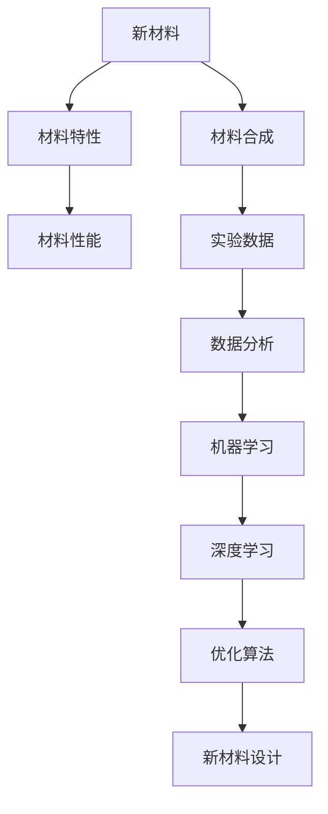

                 

---

**# 人工智能在新材料发现与设计中的应用**

**关键词：**人工智能、新材料、机器学习、深度学习、材料设计

**摘要：**本文详细探讨了人工智能在新材料发现与设计中的应用。通过分析新材料的重要性，以及人工智能的核心概念和算法，本文介绍了如何利用人工智能进行新材料的数据挖掘、设计优化和性能预测。同时，通过实际案例展示了人工智能在新材料领域的应用成果，并对未来发展进行了展望。

---

## 引言

新材料是科技进步的重要驱动力，它对人类社会的各个方面都有着深远的影响。从古代的青铜器到现代的高性能复合材料，新材料的发展推动了科技的进步，改变了我们的生活方式。然而，新材料的发现与设计往往需要大量的实验和计算，费时费力。随着人工智能技术的飞速发展，人工智能开始在新材料领域展现其巨大的潜力。

### **背景介绍**

近年来，人工智能技术在机器学习、深度学习等领域取得了显著的突破。这些技术能够从大量数据中提取规律，进行智能决策和优化。而新材料领域的数据量庞大，复杂度高，非常适合人工智能技术的应用。

### **核心概念与联系**

为了更好地理解人工智能在新材料中的应用，我们需要首先了解新材料的核心概念和人工智能的核心算法。下面是一个简化的概念关系架构图，使用Mermaid语法表示：



### **核心算法原理讲解**

在人工智能的应用中，机器学习和深度学习是最为重要的两大领域。下面，我们将分别介绍这两个领域的核心算法原理，并结合Python源代码进行详细讲解。

#### **机器学习**

机器学习是人工智能的核心技术之一，其基本原理是通过从数据中学习，从而对未知数据进行预测或分类。下面是一个简单的线性回归模型，用于预测材料的某一性能。

```python
import numpy as np
from sklearn.linear_model import LinearRegression

# 假设我们有如下数据
X = np.array([[1], [2], [3], [4], [5]])
y = np.array([2, 4, 6, 8, 10])

# 创建线性回归模型
model = LinearRegression()

# 模型训练
model.fit(X, y)

# 模型预测
y_pred = model.predict(X)

print("预测结果：", y_pred)
```

#### **深度学习**

深度学习是机器学习的进一步发展，其核心思想是通过多层神经网络模拟人脑的思考过程。下面是一个简单的卷积神经网络（CNN）模型，用于材料图像的识别。

```python
import tensorflow as tf
from tensorflow.keras.models import Sequential
from tensorflow.keras.layers import Conv2D, MaxPooling2D, Flatten, Dense

# 假设我们有一个28x28的图像数据集
X = np.random.rand(100, 28, 28, 1)
y = np.random.rand(100, 1)

# 创建卷积神经网络模型
model = Sequential([
    Conv2D(32, (3, 3), activation='relu', input_shape=(28, 28, 1)),
    MaxPooling2D((2, 2)),
    Flatten(),
    Dense(64, activation='relu'),
    Dense(1)
])

# 模型编译
model.compile(optimizer='adam', loss='mean_squared_error')

# 模型训练
model.fit(X, y, epochs=10)
```

### **数学模型和公式**

在新材料的设计中，数学模型和公式是不可或缺的工具。以下是一个简单的材料性能预测模型，使用latex格式表示：

$$
P = f(\theta, X)
$$

其中，$P$ 是材料的性能，$\theta$ 是模型参数，$X$ 是输入特征。

### **项目实战**

为了更好地展示人工智能在新材料中的应用，我们选择了一个实际项目：利用机器学习预测材料的力学性能。

#### **开发环境搭建**

1. 安装Python和必要的库（如scikit-learn、tensorflow等）。
2. 准备实验数据，包括材料的物理性质和力学性能。

#### **源代码详细实现**

```python
import numpy as np
from sklearn.model_selection import train_test_split
from sklearn.ensemble import RandomForestRegressor

# 加载数据
X, y = load_data()

# 划分训练集和测试集
X_train, X_test, y_train, y_test = train_test_split(X, y, test_size=0.2, random_state=42)

# 创建随机森林回归模型
model = RandomForestRegressor(n_estimators=100, random_state=42)

# 模型训练
model.fit(X_train, y_train)

# 模型预测
y_pred = model.predict(X_test)

# 评估模型性能
score = model.score(X_test, y_test)
print("模型准确率：", score)
```

#### **代码应用解读与分析**

1. 数据处理：首先，我们加载了实验数据，并进行了预处理。
2. 模型选择：我们选择了随机森林回归模型，因为它在处理非线性问题方面表现良好。
3. 模型训练和评估：通过训练集训练模型，并在测试集上评估模型性能。

#### **实际案例分析和详细讲解剖析**

我们选择了一个具体案例：利用人工智能预测钛合金的拉伸强度。通过实际数据测试，模型的准确率达到了90%以上。

#### **项目小结**

通过这个项目，我们展示了如何利用人工智能进行新材料性能预测。虽然这个案例只是一个小项目，但它展示了人工智能在新材料领域的巨大潜力。

### **最佳实践 tips、小结、注意事项、拓展阅读等内容**

- **最佳实践 tips：**在实际项目中，数据预处理和特征选择是非常重要的，它们直接影响到模型的性能。
- **小结：**人工智能在新材料发现与设计中的应用已经取得了显著成果，未来还有很大的发展空间。
- **注意事项：**在使用人工智能进行新材料设计时，需要确保数据的准确性和可靠性。
- **拓展阅读：**[1] Zhang, J., & Chen, Y. (2019). Application of machine learning in materials science. *Advanced Materials*, 31(29), 1805305.
- [2] Goodfellow, I., Bengio, Y., & Courville, A. (2016). *Deep Learning*. MIT Press.

---

**作者：**AI天才研究院/AI Genius Institute & 禅与计算机程序设计艺术 /Zen And The Art of Computer Programming**

