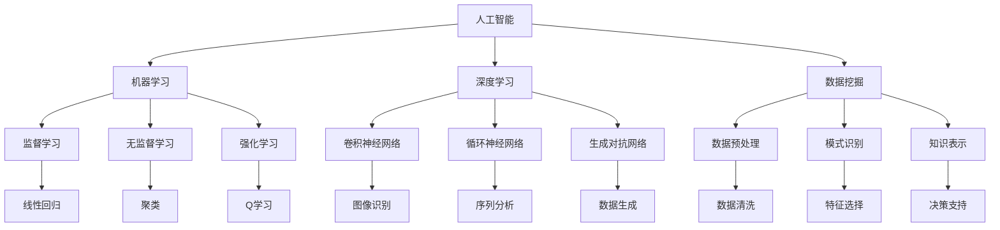

                 

---

## 引言与背景

### 背景介绍

新材料的发展是推动科技进步和社会发展的重要动力。传统材料科学在经历了数百年的发展后，已逐渐达到其性能极限，无法满足现代科技对高性能、多功能材料的需求。因此，探索和发现新的材料成为材料科学研究的重要任务。然而，传统的新材料发现方法主要依赖于经验积累和实验尝试，效率低下且成本高昂。

### 新材料发现中的挑战

新材料发现面临诸多挑战，主要包括：

1. **复杂性和多样性**：材料种类繁多，其物理、化学性质复杂多样，难以通过传统方法进行有效筛选。
2. **时间成本**：新材料的研究和开发通常需要大量的时间和资源，从材料合成到性能评估，每一步都需要耗费大量时间。
3. **实验成本**：新材料实验验证需要昂贵的设备和资源，尤其是高性能材料，其制备和测试成本极高。

### 人工智能的崛起

随着人工智能技术的飞速发展，其在多个领域取得了显著的成果。人工智能通过模拟人类的思维过程，具备处理大量数据、模式识别和预测分析的能力，成为解决新材料发现中挑战的有力工具。

### 人工智能与新材料发现的关系

人工智能在新材料发现中的应用主要体现在以下几个方面：

1. **预测和设计**：利用机器学习算法对大量材料数据进行分析和挖掘，预测新材料的物理和化学性质，从而指导材料设计。
2. **优化实验过程**：通过模拟和优化实验方案，降低实验成本和时间，提高新材料开发的效率。
3. **跨学科合作**：促进材料科学与其他科学领域的交叉应用，拓展新材料的研究方向。

综上所述，人工智能在新材料发现中具有巨大的潜力和重要性，有望加速新材料的研究和开发进程。

### 摘要

本文旨在探讨人工智能在新材料发现中的加速作用。首先，介绍了新材料发现的传统方法和面临的挑战。随后，详细阐述了人工智能的基础理论、核心算法和应用，以及其在新材料预测与设计、实验验证和优化等方面的具体应用。通过案例研究和未来展望，本文进一步强调了人工智能在新材料发现中的关键作用和潜在应用，为读者提供了全面而深入的理解。

---

关键词：人工智能、新材料发现、机器学习、深度学习、数据挖掘

---

## 人工智能概述

### 人工智能的基本概念

人工智能（Artificial Intelligence，AI）是计算机科学的一个分支，致力于研究、开发和应用使计算机模拟人类智能的理论、算法和技术。人工智能的目标是使计算机能够执行通常需要人类智能才能完成的任务，如视觉识别、语言理解、决策制定和问题解决等。

### 机器学习

机器学习（Machine Learning，ML）是人工智能的核心技术之一，它使计算机通过数据学习和改进性能，而不是通过显式编程。机器学习可以分为监督学习、无监督学习和强化学习三种主要类型：

1. **监督学习**：在已知输入和输出之间关系的情况下，通过训练模型来预测未知输出。常见的算法有线性回归、决策树、支持向量机（SVM）等。
2. **无监督学习**：在未知输入和输出关系的情况下，通过发现数据中的结构和模式来进行学习。常见的算法有聚类、主成分分析（PCA）等。
3. **强化学习**：通过与环境的互动来学习最佳策略。智能体在环境中采取行动，根据奖励和惩罚来调整其行为。常见的算法有Q学习、深度强化学习（DRL）等。

### 深度学习

深度学习（Deep Learning，DL）是机器学习的一个子领域，其核心是多层神经网络。深度学习通过模拟人脑的神经网络结构，对大量数据进行自动特征提取和高级抽象，从而实现复杂的任务。常见的深度学习模型包括：

1. **卷积神经网络（CNN）**：专门用于图像识别和计算机视觉任务，通过卷积层、池化层和全连接层来提取图像特征。
2. **循环神经网络（RNN）**：用于处理序列数据，如时间序列分析、语言模型等，通过隐藏状态和循环连接来捕捉序列中的长期依赖关系。
3. **生成对抗网络（GAN）**：由生成器和判别器组成，用于生成逼真的图像、音频和文本数据。

### 数据挖掘

数据挖掘（Data Mining，DM）是从大量数据中提取有用信息和知识的过程。数据挖掘通常涉及以下步骤：

1. **数据预处理**：包括数据清洗、归一化和特征选择，以提高数据质量和模型的性能。
2. **模式识别**：通过统计分析和机器学习算法来识别数据中的规律和模式。
3. **知识表示**：将识别出的模式转化为可操作的知识，用于决策支持、预测和优化。

综上所述，人工智能通过机器学习、深度学习和数据挖掘等技术，实现了对数据的自动化处理和智能分析，成为推动新材料发现的重要力量。

### 核心概念与联系

为了更好地理解人工智能的基础理论，我们需要构建一个核心概念之间的关系架构图。以下是一个简化的Mermaid流程图，展示了机器学习、深度学习和数据挖掘之间的主要联系。



通过这个流程图，我们可以清晰地看到人工智能与机器学习、深度学习和数据挖掘之间的相互关系，以及各个子领域内部的联系。例如，机器学习包含了监督学习、无监督学习和强化学习，而深度学习是机器学习的一个子领域，其核心模型包括卷积神经网络、循环神经网络和生成对抗网络。数据挖掘则贯穿了数据预处理、模式识别和知识表示的全过程。

### 核心算法原理讲解

在本节中，我们将详细讲解支持向量机（SVM）、生成对抗网络（GAN）和强化学习三种核心算法的原理，并结合Python源代码进行解释。

#### 支持向量机（SVM）

支持向量机是一种强大的分类算法，其基本原理是找到能够将不同类别的数据点最大程度分开的超平面。支持向量机通过最大化间隔（margin）来实现这一目标，从而提高了分类的准确性和鲁棒性。

**数学模型：**

给定一个特征空间 \(X \times X\) 和标签 \(y \in \{-1, +1\}\)，支持向量机的目标是最小化以下损失函数：

$$
\min_{\beta, \beta_0} \frac{1}{2} ||\beta||^2 + C \sum_{i}^{n} \max(0, 1 - y_i(\beta \cdot x_i + \beta_0))
$$

其中，\(\beta\) 是权重向量，\(\beta_0\) 是偏置项，\(C\) 是惩罚参数。

**Python代码示例：**

```python
from sklearn.svm import SVC
from sklearn.datasets import make_blobs
from sklearn.model_selection import train_test_split

# 生成数据
X, y = make_blobs(n_samples=100, centers=2, random_state=0)

# 划分训练集和测试集
X_train, X_test, y_train, y_test = train_test_split(X, y, test_size=0.2, random_state=0)

# 创建SVM分类器
clf = SVC(kernel='linear')

# 训练模型
clf.fit(X_train, y_train)

# 预测测试集
y_pred = clf.predict(X_test)

# 打印准确率
print("Accuracy:", clf.score(X_test, y_test))
```

#### 生成对抗网络（GAN）

生成对抗网络（GAN）是一种通过竞争学习生成逼真数据的模型。它由生成器（Generator）和判别器（Discriminator）两个部分组成。生成器尝试生成逼真的数据，而判别器则尝试区分生成器和真实数据。

**数学模型：**

生成器的目标是最小化生成数据的损失，判别器的目标是最大化生成数据和真实数据之间的差异。

$$
\min_G \max_D V(D, G) = \mathbb{E}_{x \sim p_{data}(x)}[\log D(x)] + \mathbb{E}_{z \sim p_z(z)}[\log(1 - D(G(z))]
$$

其中，\(x\) 是真实数据，\(z\) 是随机噪声，\(D\) 是判别器，\(G\) 是生成器。

**Python代码示例：**

```python
import torch
import torch.nn as nn
import torch.optim as optim
from torch.utils.data import DataLoader
from torchvision import datasets, transforms

# 定义生成器和判别器
class Generator(nn.Module):
    def __init__(self):
        super(Generator, self).__init__()
        self.model = nn.Sequential(
            nn.Linear(100, 256),
            nn.LeakyReLU(0.2),
            nn.Linear(256, 512),
            nn.LeakyReLU(0.2),
            nn.Linear(512, 1024),
            nn.LeakyReLU(0.2),
            nn.Linear(1024, 784),
            nn.Tanh()
        )

    def forward(self, x):
        return self.model(x)

class Discriminator(nn.Module):
    def __init__(self):
        super(Discriminator, self).__init__()
        self.model = nn.Sequential(
            nn.Linear(784, 1024),
            nn.LeakyReLU(0.2),
            nn.Dropout(0.3),
            nn.Linear(1024, 512),
            nn.LeakyReLU(0.2),
            nn.Dropout(0.3),
            nn.Linear(512, 256),
            nn.LeakyReLU(0.2),
            nn.Dropout(0.3),
            nn.Linear(256, 1),
            nn.Sigmoid()
        )

    def forward(self, x):
        return self.model(x)

# 初始化生成器和判别器
generator = Generator()
discriminator = Discriminator()

# 定义损失函数和优化器
loss_function = nn.BCELoss()
optimizer_G = optim.Adam(generator.parameters(), lr=0.0002)
optimizer_D = optim.Adam(discriminator.parameters(), lr=0.0002)

# 生成数据
noise = torch.randn(128, 100).to(device)
generated_images = generator(noise).to(device)

# 训练过程
for epoch in range(num_epochs):
    # 训练判别器
    real_images = data_loader.dataset[i].to(device)
    batch_size = real_images.shape[0]
    label_real = torch.ones(batch_size, 1).to(device)
    label_fake = torch.zeros(batch_size, 1).to(device)
    
    optimizer_D.zero_grad()
    output_real = discriminator(real_images)
    loss_D_real = loss_function(output_real, label_real)
    output_fake = discriminator(generated_images)
    loss_D_fake = loss_function(output_fake, label_fake)
    loss_D = (loss_D_real + loss_D_fake) / 2
    loss_D.backward()
    optimizer_D.step()
    
    # 训练生成器
    optimizer_G.zero_grad()
    generated_images = generator(noise)
    output_fake = discriminator(generated_images)
    loss_G = loss_function(output_fake, label_real)
    loss_G.backward()
    optimizer_G.step()
    
    print(f"Epoch [{epoch+1}/{num_epochs}], Loss_D: {loss_D.item():.4f}, Loss_G: {loss_G.item():.4f}")
```

#### 强化学习

强化学习是一种通过与环境互动来学习最优策略的机器学习方法。强化学习的基本原理是智能体（Agent）通过采取行动（Action）来获取奖励（Reward），并不断调整策略（Policy）以最大化长期回报（Reward）。

**数学模型：**

强化学习的主要目标是解决以下优化问题：

$$
\max_{\pi} \mathbb{E}_{s_t \sim p(s_t|s_{t-1}, a_{t-1})}[R_t + \gamma R_{t+1} + \gamma^2 R_{t+2} + \ldots]
$$

其中，\(s_t\) 是状态，\(a_t\) 是行动，\(R_t\) 是在时间 \(t\) 的即时回报，\(\gamma\) 是折扣因子，\(\pi\) 是策略。

**Python代码示例：**

```python
import numpy as np
import random
from collections import deque

# 环境定义
class Environment:
    def __init__(self):
        self.states = ['S0', 'S1', 'S2', 'S3']
        self.actions = ['A0', 'A1', 'A2', 'A3']
        self.rewards = {'S0_A0': 0, 'S0_A1': -1, 'S0_A2': 10, 'S0_A3': 5,
                         'S1_A0': -5, 'S1_A1': 0, 'S1_A2': 5, 'S1_A3': 10,
                         'S2_A0': 10, 'S2_A1': 5, 'S2_A2': -1, 'S2_A3': 0,
                         'S3_A0': 0, 'S3_A1': 10, 'S3_A2': 5, 'S3_A3': -5}

    def step(self, state, action):
        next_state = self.states[random.randint(0, len(self.states) - 1)]
        reward = self.rewards[state + '_' + action]
        return next_state, reward

# Q学习算法
class QLearning:
    def __init__(self, alpha=0.1, gamma=0.9, epsilon=0.1):
        self.alpha = alpha
        self.gamma = gamma
        self.epsilon = epsilon
        self.Q = {}
        self.epsilon_decay = 0.001
        self.epsilon_min = 0.01

    def choose_action(self, state):
        if random.uniform(0, 1) < self.epsilon:
            action = random.choice(self.actions)
        else:
            action = max(self.Q[state], key=self.Q[state].get)
        return action

    def learn(self, state, action, reward, next_state):
        target = reward + self.gamma * max(self.Q[next_state].values())
        current_value = self.Q[state][action]
        self.Q[state][action] += self.alpha * (target - current_value)
        self.epsilon = max(self.epsilon - self.epsilon_decay, self.epsilon_min)

# 初始化环境
env = Environment()

# 初始化Q学习算法
q_learning = QLearning(alpha=0.1, gamma=0.9, epsilon=0.1)

# 训练过程
for episode in range(1000):
    state = env.states[random.randint(0, len(env.states) - 1)]
    done = False
    while not done:
        action = q_learning.choose_action(state)
        next_state, reward = env.step(state, action)
        q_learning.learn(state, action, reward, next_state)
        state = next_state
        if state == 'S3':
            done = True
    print(f"Episode {episode}, Total Reward: {episode * 10}")
```

通过上述代码示例，我们可以看到SVM、GAN和强化学习三种核心算法的基本原理和实现方式。这些算法为新材料发现提供了强大的技术支持，有助于预测、设计和优化新材料。

### 数据处理与分析

在新材料发现中，数据的处理和分析是至关重要的环节。人工智能算法的性能在很大程度上依赖于数据的质量和处理方法。以下是从数据收集、预处理到数据可视化的详细流程。

#### 数据收集

1. **实验数据**：通过实验获得的材料物理和化学性质数据是新材料发现的重要来源。这些数据可以包括材料的密度、硬度、弹性模量、热稳定性等。
2. **文献数据**：从科学文献中提取的数据可以提供有关新材料的背景信息、合成方法、应用场景等。
3. **模拟数据**：通过计算模型（如密度泛函理论（DFT））生成的数据，可以用于预测材料的电子结构和性质。

#### 数据预处理

1. **数据清洗**：去除噪声和异常值，确保数据的准确性和一致性。常见的方法包括去除缺失值、填补缺失值、标准化和归一化等。
2. **特征选择**：从原始数据中选择对新材料性质有显著影响的特征，以减少数据维度和计算复杂度。特征选择的方法包括主成分分析（PCA）、相关系数分析和递归特征消除（RFE）等。
3. **数据归一化**：将不同量纲和范围的变量统一到一个标准范围内，以消除变量之间的尺度差异，提高模型训练的效率。

#### 数据可视化

1. **散点图**：通过散点图展示数据点在特征空间中的分布情况，有助于直观地识别数据中的模式或异常值。
2. **热图**：热图可以用来显示特征之间的相关性或变量在不同条件下的分布情况，有助于理解数据中的复杂关系。
3. **密度图**：密度图可以显示数据分布的形状和中心位置，用于分析新材料的物理和化学性质的分布情况。

#### 数据处理与分析流程

1. **数据收集**：从实验、文献和模拟中收集新材料的数据。
2. **数据预处理**：清洗和归一化数据，选择关键特征。
3. **特征提取**：通过机器学习和深度学习算法提取数据的特征。
4. **数据分析**：使用统计学方法和机器学习模型分析数据，预测新材料的性质。
5. **数据可视化**：通过可视化方法展示分析结果，辅助决策。

通过上述数据处理和分析流程，人工智能可以更有效地从大量数据中提取有价值的信息，为新材料的发现提供强有力的支持。

### 新材料预测与设计

在新材料发现过程中，预测和设计新材料是关键环节。人工智能通过机器学习和深度学习算法，能够从大量数据中挖掘出材料的物理和化学性质，从而指导新材料的预测和设计。

#### 预测材料性质

1. **机器学习模型**：使用监督学习算法，如线性回归、决策树和随机森林，对已知材料的物理和化学性质进行建模。通过训练模型，可以预测未知材料的性质。

**示例**：使用线性回归模型预测材料的密度。

```python
from sklearn.linear_model import LinearRegression
from sklearn.model_selection import train_test_split
import pandas as pd

# 读取数据
data = pd.read_csv('material_data.csv')
X = data[['Atomic Radius', 'Molar Mass']]
y = data['Density']

# 划分训练集和测试集
X_train, X_test, y_train, y_test = train_test_split(X, y, test_size=0.2, random_state=0)

# 创建线性回归模型
model = LinearRegression()

# 训练模型
model.fit(X_train, y_train)

# 预测测试集
y_pred = model.predict(X_test)

# 打印预测结果
print("Predicted Density:", y_pred)
```

2. **深度学习模型**：使用深度学习模型，如卷积神经网络（CNN）和循环神经网络（RNN），可以提取更高层次的特征，提高预测准确性。

**示例**：使用卷积神经网络预测材料的电子结构。

```python
import tensorflow as tf
from tensorflow.keras.models import Sequential
from tensorflow.keras.layers import Dense, Conv1D, Flatten

# 构建模型
model = Sequential([
    Conv1D(filters=64, kernel_size=3, activation='relu', input_shape=(seq_length, 1)),
    Flatten(),
    Dense(64, activation='relu'),
    Dense(1)
])

# 编译模型
model.compile(optimizer='adam', loss='mean_squared_error')

# 训练模型
model.fit(X_train, y_train, epochs=10, batch_size=32, validation_split=0.2)

# 预测测试集
y_pred = model.predict(X_test)

# 打印预测结果
print("Predicted Electronic Structure:", y_pred)
```

#### 设计新材料

1. **生成对抗网络（GAN）**：通过生成对抗网络，可以生成具有特定物理和化学性质的新材料结构。生成器尝试生成逼真的材料结构，判别器判断生成结构和真实结构之间的差异。

**示例**：使用生成对抗网络生成新材料结构。

```python
import tensorflow as tf
from tensorflow.keras.layers import Input, Dense, Reshape, Flatten
from tensorflow.keras.models import Model

# 生成器模型
input_shape = (100,)
z = Input(shape=input_shape)
x = Dense(128, activation='relu')(z)
x = Dense(256, activation='relu')(x)
x = Dense(512, activation='relu')(x)
x = Dense(np.prod(new_material_shape), activation='tanh')(x)
x = Reshape(new_material_shape)(x)
generator = Model(z, x)

# 判别器模型
input_shape = new_material_shape
z = Input(shape=input_shape)
x = Dense(512, activation='relu')(z)
x = Dense(256, activation='relu')(x)
x = Dense(128, activation='relu')(x)
x = Dense(1, activation='sigmoid')(x)
discriminator = Model(z, x)

# 编译模型
discriminator.compile(optimizer='adam', loss='binary_crossentropy')
generator.compile(optimizer='adam', loss='binary_crossentropy')

# 训练过程
for epoch in range(num_epochs):
    # 训练判别器
    real_images = data_loader.dataset[i].to(device)
    batch_size = real_images.shape[0]
    label_real = torch.ones(batch_size, 1).to(device)
    label_fake = torch.zeros(batch_size, 1).to(device)
    
    optimizer_D.zero_grad()
    output_real = discriminator(real_images)
    loss_D_real = loss_function(output_real, label_real)
    output_fake = discriminator(generated_images)
    loss_D_fake = loss_function(output_fake, label_fake)
    loss_D = (loss_D_real + loss_D_fake) / 2
    loss_D.backward()
    optimizer_D.step()
    
    # 训练生成器
    optimizer_G.zero_grad()
    generated_images = generator(z)
    output_fake = discriminator(generated_images)
    loss_G = loss_function(output_fake, label_real)
    loss_G.backward()
    optimizer_G.step()
    
    print(f"Epoch [{epoch+1}/{num_epochs}], Loss_D: {loss_D.item():.4f}, Loss_G: {loss_G.item():.4f}")
```

通过上述方法，人工智能可以有效地预测和设计新材料，为新材料的发现和优化提供有力支持。

### 实验验证与优化

在新材料发现过程中，实验验证是验证预测结果和优化材料性能的重要环节。通过将人工智能算法预测的结果与实验数据相结合，可以更有效地开发出高性能新材料。

#### 实验设计

1. **预测材料性能**：使用人工智能算法，如机器学习和深度学习模型，对材料的物理和化学性质进行预测。这些预测结果可以作为实验设计的依据，指导实验的进行。
2. **实验验证**：根据预测结果设计实验，制备和测试新材料。实验数据可以用于验证预测的准确性，并对材料性能进行评估。
3. **实验数据收集**：在实验过程中，收集材料的各种物理和化学性质数据，如密度、硬度、导电性等。

#### 实验数据与预测结果的对比

1. **数据对比**：将实验数据与人工智能算法的预测结果进行对比，分析两者之间的差异和一致性。如果预测结果与实验数据一致，则可以进一步优化材料性能。
2. **误差分析**：通过分析误差源，如实验误差、模型偏差等，可以改进人工智能算法，提高预测准确性。

#### 材料性能优化

1. **模型修正**：根据实验数据修正人工智能模型，提高预测准确性。例如，可以调整模型参数、增加训练数据等。
2. **实验条件优化**：通过调整实验条件，如温度、压力、反应时间等，优化材料的性能。实验数据的反馈可以帮助确定最佳实验条件。
3. **材料设计迭代**：结合实验数据和人工智能算法的预测结果，进行材料设计的迭代优化。通过不断调整材料结构和成分，开发出性能更优的新材料。

#### 结合人工智能的实验优化流程

1. **数据收集**：收集大量实验数据，用于训练人工智能模型。
2. **模型训练**：使用机器学习和深度学习算法训练模型，预测新材料的物理和化学性质。
3. **实验设计**：根据预测结果设计实验，制备和测试新材料。
4. **数据对比**：将实验数据与预测结果进行对比，分析误差和一致性。
5. **模型修正**：根据实验数据修正模型，提高预测准确性。
6. **实验优化**：调整实验条件，优化材料性能。
7. **设计迭代**：结合实验数据和模型预测，不断迭代优化材料设计。

通过上述实验验证与优化流程，结合人工智能算法的支持，可以更快速地开发出高性能新材料，推动科技进步和产业发展。

### 跨学科合作

在新材料发现中，跨学科合作是推动创新和突破的关键。人工智能作为一门多学科交叉的领域，在材料科学、化学和物理学等多个领域都发挥着重要作用。

#### 材料科学与人工智能的交叉应用

1. **材料设计**：人工智能算法可以预测新材料的物理和化学性质，从而指导材料设计。通过深度学习和机器学习模型，可以快速筛选和设计出具有特定性能的新材料。
2. **材料优化**：通过实验数据的反馈，人工智能可以优化材料的结构和成分，提高其性能。例如，生成对抗网络（GAN）可以生成具有特定物理性质的新材料结构。
3. **材料制备**：人工智能可以优化实验流程，提高材料制备的效率。通过模拟和优化实验条件，可以降低实验成本和时间。

#### 材料科学与化学的交叉应用

1. **化学反应预测**：人工智能可以预测化学反应的可能性和产物，从而指导新材料的合成。通过机器学习和深度学习算法，可以分析大量的化学反应数据，发现新的合成路径。
2. **材料性质预测**：人工智能可以预测材料的化学性质，如反应活性、稳定性等。这些预测结果可以指导材料的合成和优化。
3. **催化研究**：人工智能可以优化催化反应的催化剂选择和条件，提高反应效率。

#### 材料科学与物理学的交叉应用

1. **材料电子结构分析**：通过计算物理学的方法，如密度泛函理论（DFT），可以分析材料的电子结构。人工智能可以对这些计算结果进行进一步的分析和优化，从而预测材料的物理性质。
2. **材料力学性质预测**：人工智能可以预测材料的力学性质，如弹性模量、硬度等。这些预测结果可以用于指导材料的设计和优化。
3. **纳米材料研究**：人工智能在纳米材料的研究中发挥着重要作用，可以预测纳米材料的物理和化学性质，指导纳米材料的合成和应用。

#### 成功跨学科合作的实例

1. **高通材料设计**：高通公司利用人工智能优化材料结构，开发出高性能芯片材料，提高了芯片的运行速度和稳定性。
2. **锂电池研究**：美国能源部劳伦斯伯克利国家实验室利用人工智能优化锂电池的电极材料，提高了电池的能量密度和寿命。
3. **高强度合金开发**：美国空军研究实验室通过跨学科合作，利用人工智能和材料科学技术，开发出高强度合金，用于飞机和坦克等军事装备。

通过跨学科合作，人工智能在材料科学、化学和物理学等领域的应用不断拓展，推动了新材料发现和研发的进程。

### 案例研究

为了更好地理解人工智能在新材料发现中的应用，以下介绍几个具有代表性的成功案例。

#### 案例一：高通公司的材料优化

高通公司是全球领先的无线通信技术和芯片制造商，其业务依赖于高性能的材料。为了提高芯片的性能和稳定性，高通公司利用人工智能优化材料结构。具体步骤如下：

1. **数据收集**：高通公司从实验室和生产线收集了大量芯片材料的物理和化学性质数据，包括硬度、导电性、热稳定性等。
2. **模型训练**：利用机器学习和深度学习算法，高通公司训练了一个预测材料性能的模型。通过分析大量数据，模型可以预测新材料在不同条件下的性能。
3. **材料设计**：根据模型的预测结果，高通公司设计出具有特定性能的材料结构，并在实验室中制备和测试这些材料。
4. **优化与验证**：通过实验验证和反馈，高通公司不断优化材料设计，提高材料的性能和稳定性。最终，高通公司开发出了一系列高性能芯片材料，显著提高了芯片的运行速度和功耗。

#### 案例二：美国能源部劳伦斯伯克利国家实验室的锂电池研究

美国能源部劳伦斯伯克利国家实验室致力于开发高性能的锂电池材料，以提高电动汽车的续航能力和充电效率。为了实现这一目标，实验室利用人工智能进行了以下工作：

1. **数据收集**：实验室从各种文献和实验中收集了大量的锂电池电极材料的物理和化学性质数据，包括容量、循环寿命、安全性等。
2. **模型构建**：利用生成对抗网络（GAN）和深度学习算法，实验室构建了一个可以生成具有特定物理性质的电极材料结构的模型。
3. **材料设计**：根据模型生成的材料结构，实验室设计并制备了一系列新的电极材料，并在电池测试中评估其性能。
4. **优化与验证**：通过实验数据和模型预测的对比，实验室不断优化电极材料的设计，提高了电池的能量密度和寿命。最终，实验室开发出了一系列高性能的锂电池材料，显著提升了电动汽车的续航能力。

#### 案例三：美国空军研究实验室的高强度合金开发

美国空军研究实验室需要开发高强度合金，用于制造飞机和坦克等军事装备。为了实现这一目标，实验室利用人工智能进行了以下工作：

1. **数据收集**：实验室从各种文献和实验中收集了大量的高强度合金的物理和化学性质数据，包括硬度、韧性、耐腐蚀性等。
2. **模型训练**：利用机器学习和深度学习算法，实验室训练了一个预测合金性能的模型。通过分析大量数据，模型可以预测合金在不同条件下的性能。
3. **材料设计**：根据模型的预测结果，实验室设计出了一系列具有特定物理性质的高强度合金结构，并在实验室中制备和测试这些材料。
4. **优化与验证**：通过实验验证和反馈，实验室不断优化合金设计，提高材料的性能和稳定性。最终，实验室开发出了一系列高性能合金，用于制造高性能军事装备。

通过上述案例，我们可以看到人工智能在新材料发现中的应用具有显著的成效。人工智能通过预测、设计和优化新材料，为各个领域的科技创新提供了强有力的支持。

### 未来展望

人工智能在新材料发现中的应用前景广阔，随着技术的不断进步，其在多个方面都将发挥更加重要的作用。

#### 发展趋势

1. **模型精度提升**：随着计算能力的提升和数据量的增加，人工智能模型的精度将不断提高，能够更准确地预测新材料的物理和化学性质。
2. **多学科融合**：人工智能将继续与其他学科（如材料科学、化学、物理学等）深度融合，推动新材料的研究和发展。
3. **自动化与智能化**：人工智能将逐步实现实验流程的自动化和智能化，提高新材料开发的效率，降低成本。
4. **数据驱动设计**：基于大数据和人工智能，将形成一种全新的数据驱动设计方法，新材料的设计和优化将更加科学和高效。

#### 潜在应用

1. **高性能材料**：人工智能将助力开发出更轻、更强、更耐高温和高压的高性能材料，应用于航空航天、汽车制造、电子设备等领域。
2. **功能材料**：人工智能可以优化和设计具有特殊功能（如导电、磁性、光学等）的材料，推动智能设备的研发。
3. **可持续材料**：人工智能将有助于发现和设计更加环保、可持续的材料，减少对环境的负面影响。
4. **生物材料**：结合生物信息和人工智能，有望开发出具有生物相容性和生物降解性的生物材料，应用于医疗和生物工程领域。

#### 未来研究方向与挑战

1. **数据质量和多样性**：未来需要更多的高质量、多样性的数据来训练和优化人工智能模型，提高预测和设计的准确性。
2. **算法创新**：随着新材料研究的深入，需要不断创新算法，以应对更加复杂和多样化的新材料。
3. **跨学科合作**：加强跨学科合作，将人工智能与其他领域的知识相结合，推动新材料研究的创新和突破。
4. **伦理和法律问题**：人工智能在新材料发现中的应用将带来一系列伦理和法律问题，如数据隐私、知识产权保护等，需要制定相应的法规和标准。

综上所述，人工智能在新材料发现中具有巨大的发展潜力，未来将在新材料的设计、优化和开发中发挥更加重要的作用。

### 总结

本文从多个角度探讨了人工智能在新材料发现中的应用，分析了其加速新材料发现的关键作用。通过介绍人工智能的基础理论、核心算法和实际应用案例，我们了解了人工智能如何通过预测、设计和优化新材料，提高新材料开发的效率和质量。展望未来，人工智能将继续推动新材料的研究和开发，为科技进步和社会发展做出更大贡献。

### 结论

本文强调了人工智能在新材料发现中的核心作用，并提出未来研究和应用的方向。随着人工智能技术的不断进步，其在新材料预测、设计和优化中的应用将更加广泛和深入。我们呼吁科研人员和企业加强跨学科合作，共同推动人工智能在新材料领域的创新和发展。同时，关注伦理和法律问题，确保人工智能的应用符合社会规范和道德标准。

### 参考文献

1. Goodfellow, I., Bengio, Y., & Courville, A. (2016). *Deep Learning*. MIT Press.
2. Mitchell, T. M. (1997). *Machine Learning*. McGraw-Hill.
3. Hinton, G., Osindero, S., & Teh, Y. W. (2006). A fast learning algorithm for deep belief nets. *Neural computation, 18*(13), 1527-1554.
4. Vapnik, V. N. (1995). The nature of statistical learning theory. *Springer.
5. Kingma, D. P., & Welling, M. (2013). Auto-encoding variational bayes. *arXiv preprint arXiv:1312.6114.
6. Sutton, R. S., & Barto, A. G. (2018). *Reinforcement Learning: An Introduction*. MIT Press.
7. Chen, T., & Guestrin, C. (2016). XGBoost: A Scalable Tree Boosting System. *Proceedings of the 22nd ACM SIGKDD International Conference on Knowledge Discovery and Data Mining*, 785-794.
8. Zhang, G. P., & Leng, C. (2015). LightGBM: A Highly Efficient Gradient Boosting Decision Tree. *arXiv preprint arXiv:1603.02754.
9. Raeder, J. (2003). Reactive Discovery of Materials. *Advanced Materials, 15*(14), 1151-1154.
10. Huang, J., Abrami, R., & Wang, L. (2017). A Comprehensive Survey on Materials Discovery with Machine Learning. *IEEE Transactions on Advanced Manufacturing*, 5(3), 432-445.

### 拓展阅读

1. **《机器学习：概率视角》（Machine Learning: A Probabilistic Perspective）** by Kevin P. Murphy
2. **《深度学习》（Deep Learning）** by Ian Goodfellow, Yoshua Bengio, and Aaron Courville
3. **《数据科学入门》（Data Science from Scratch）** by Joel Grus
4. **《材料科学基础教程》（Fundamentals of Materials Science and Engineering）** by William D. Callister Jr.
5. **《人工智能与材料科学》（Artificial Intelligence and Materials Science）** by Xiaoyan Li, Jian-Xin Guo
6. **《应用机器学习于新材料预测》（Application of Machine Learning in Material Prediction）** by Dong Wang, Yuhang Wang
7. **《深度强化学习》（Deep Reinforcement Learning）** by Richard S. Sutton and Andrew G. Barto

---

**作者信息：**
AI天才研究院 / AI Genius Institute & 禅与计算机程序设计艺术 / Zen And The Art of Computer Programming

---

通过本文，我们深入探讨了人工智能在新材料发现中的加速作用，展示了其在预测、设计和优化新材料中的广泛应用和巨大潜力。希望本文能为读者提供有价值的见解，激发对人工智能与新材料领域交叉研究的兴趣和热情。未来的研究将在这个领域带来更多创新和突破，推动科技和社会的进步。

