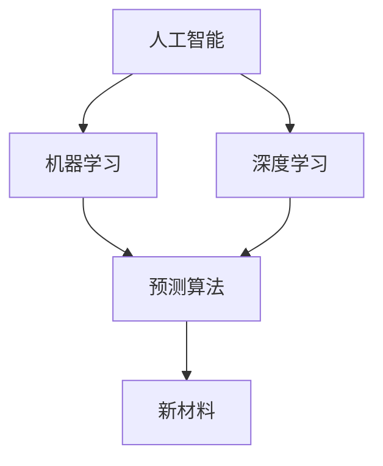
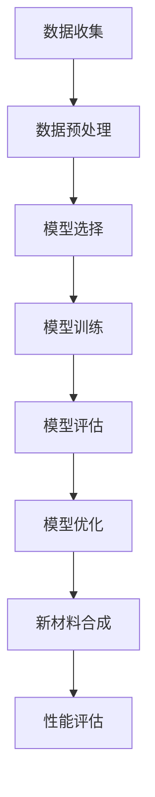

                 

### 《人工智能在新材料发现中的加速作用》

在当今世界，人工智能（AI）正在迅速改变各个领域的面貌，而新材料科学也不例外。**《人工智能在新材料发现中的加速作用》**旨在探索AI如何通过其强大的算法和数据处理能力，加速新材料的研究和开发进程。本文将逐步分析人工智能在新材料发现中的核心作用，包括关键概念的联系、核心算法的原理、数学模型的构建，以及实际项目的案例分析。

关键词：**人工智能、新材料、机器学习、深度学习、预测算法**

摘要：本文首先介绍了人工智能和新材料发现的基本概念，并使用Mermaid流程图展示了它们之间的联系。接着，文章详细阐述了AI在新材料预测和优化中的应用算法，结合Python源代码和数学公式进行了深入分析。随后，文章通过一个实际项目案例，展示了AI在新材料发现中的实际应用。最后，文章探讨了AI在其他材料科学领域中的应用，并对未来研究方向进行了展望。

文章目录如下：

1. 引言
    1.1 核心概念与联系
    1.2 为什么是人工智能在新材料发现中的加速作用
2. 人工智能基础
    2.1 人工智能概述
    2.2 机器学习与深度学习基础
    2.3 Mermaid流程图：人工智能在新材料发现中的应用流程
3. 新材料发现中的核心算法
    3.1 人工智能在新材料预测中的应用算法
    3.2 数学模型与公式讲解
    3.3 人工智能在新材料优化中的应用算法
4. 项目实战
    4.1 项目背景
    4.2 开发环境搭建
    4.3 源代码实现
    4.4 代码解读与分析
    4.5 项目小结
5. 其他应用领域
    5.1 人工智能在材料设计中的应用
    5.2 人工智能在其他材料科学领域中的应用
6. 总结与展望
    6.1 全书总结
    6.2 未来研究方向

### 引言

新材料的研究一直是科技进步的重要推动力。然而，新材料的发现过程通常复杂且耗时。传统的新材料研究方法依赖于实验和经验，这不仅成本高昂，而且难以满足快速发展的科技需求。人工智能的出现为新材料发现提供了一种全新的途径，通过其强大的数据处理能力和先进的算法，AI能够从海量数据中提取有价值的信息，预测新材料的性能，优化合成过程。

**核心概念与联系**

在新材料发现的过程中，涉及到多个核心概念，包括：

- **人工智能（AI）**：一种模拟人类智能行为的计算系统。
- **机器学习（ML）**：AI的一个分支，通过数据学习来改进性能。
- **深度学习（DL）**：一种特殊的机器学习方法，通过多层神经网络进行学习。
- **新材料**：具有特定物理、化学或电子特性的材料。
- **预测算法**：用于预测新材料性能的数学模型。

为了更直观地展示这些概念之间的联系，我们可以使用Mermaid流程图来描述：



**为什么是人工智能在新材料发现中的加速作用**

新材料发现的挑战主要体现在以下几个方面：

1. **复杂性与多样性**：新材料具有复杂多样的性质，传统方法难以处理。
2. **成本与时间**：新材料的发现通常需要大量的实验和计算资源。
3. **不确定性**：新材料的合成和性能预测存在很高的不确定性。

人工智能能够通过以下方式解决这些挑战：

1. **数据处理能力**：AI可以处理和分析海量数据，从复杂的数据中提取有价值的信息。
2. **高效预测**：使用机器学习和深度学习算法，AI可以快速预测新材料的性能。
3. **优化合成过程**：AI可以通过优化算法指导新材料的合成过程，提高成功率。

### 人工智能基础

在深入探讨人工智能在新材料发现中的应用之前，我们需要先了解一些基本概念。以下是关于人工智能、机器学习、深度学习的基础知识，以及它们在新材料发现中的具体应用。

**2.1 人工智能概述**

人工智能（AI）是一种模拟人类智能行为的计算系统，它可以进行学习、推理、规划、感知和自然语言理解等任务。AI的发展历程可以分为以下几个阶段：

1. **规则系统（1956-1974）**：早期AI主要依赖于明确的规则和逻辑推理。
2. **知识表示和推理（1974-1980）**：AI开始尝试通过知识库和推理机来模拟人类思维。
3. **专家系统（1980-1987）**：基于知识的系统达到巅峰，但受限于知识的获取和表示。
4. **机器学习（1987-至今）**：AI通过数据学习来改进性能，机器学习成为AI的核心。
5. **深度学习（2006-至今）**：一种特殊的机器学习方法，通过多层神经网络进行学习。

**2.2 机器学习与深度学习基础**

机器学习（ML）是AI的一个分支，它通过从数据中学习来改进性能。ML的基本流程包括：

1. **数据收集**：收集大量的训练数据。
2. **数据预处理**：对数据进行清洗和转换，使其适合模型训练。
3. **模型选择**：选择适当的模型，如线性回归、决策树、支持向量机等。
4. **模型训练**：使用训练数据来训练模型。
5. **模型评估**：使用验证数据来评估模型的性能。
6. **模型优化**：根据评估结果对模型进行调整。

深度学习（DL）是ML的一个子领域，它通过多层神经网络进行学习。DL的基本流程与ML类似，但它的模型更加复杂，可以处理更加复杂的数据。

**2.3 Mermaid流程图：人工智能在新材料发现中的应用流程**

为了更直观地展示人工智能在新材料发现中的应用流程，我们可以使用Mermaid流程图来描述：



### 新材料发现中的核心算法

在人工智能在新材料发现中的应用中，核心算法起着至关重要的作用。以下将详细阐述这些算法，包括预测算法和优化算法，并使用Python源代码和数学模型进行说明。

**3.1 人工智能在新材料预测中的应用算法**

预测算法是人工智能在新材料发现中的一个重要应用。通过预测新材料的性能，科学家可以快速筛选出具有潜在应用价值的材料。

**3.1.1 伪代码示例**

```python
# 伪代码：新材料性能预测算法

# 输入：训练数据集 X, 标签数据集 Y
# 输出：预测性能函数 f()

# 1. 数据预处理
# 数据清洗、标准化等

# 2. 模型选择
# 选择适当的机器学习模型，如线性回归、决策树、神经网络等

# 3. 模型训练
# 使用训练数据集训练模型

# 4. 模型评估
# 使用验证数据集评估模型性能

# 5. 预测新材料性能
# 对于新的材料数据 X_new，使用训练好的模型进行性能预测
```

**3.1.2 算法原理讲解**

新材料性能预测算法的核心原理是基于数据驱动的预测模型。这些模型通过学习大量的训练数据，提取出材料的性能特征，并能够对新材料的性能进行预测。

例如，我们使用线性回归模型来预测新材料的硬度：

```python
# Python代码：线性回归模型预测新材料硬度

import numpy as np
from sklearn.linear_model import LinearRegression

# 假设我们有一个训练数据集 X 和对应的硬度标签 Y
X = np.array([[1], [2], [3], [4], [5]])
Y = np.array([2, 3, 4, 5, 6])

# 创建线性回归模型
model = LinearRegression()

# 训练模型
model.fit(X, Y)

# 预测新材料硬度
X_new = np.array([[6]])
predicted_hardness = model.predict(X_new)

print(f"新材料硬度预测结果：{predicted_hardness[0]}")
```

**3.2 数学模型与公式讲解**

在新材料性能预测中，常用的数学模型包括线性回归模型、多项式回归模型等。以下是一个简单的线性回归模型的数学公式：

$$
y = ax + b
$$

其中，$y$ 是因变量（新材料硬度），$x$ 是自变量（材料的某个特征），$a$ 是斜率，$b$ 是截距。

**3.3 人工智能在新材料优化中的应用算法**

除了预测新材料性能，人工智能还可以用于优化新材料合成过程。优化算法通过调整合成参数，提高新材料的性能。

**3.3.1 伪代码示例**

```python
# 伪代码：新材料合成优化算法

# 输入：初始合成参数 P0
# 输出：最优合成参数 P*

# 1. 初始化
# 设置初始合成参数 P0

# 2. 迭代
# 使用优化算法（如梯度下降、遗传算法等）迭代调整合成参数

# 3. 评估
# 对每次迭代的合成结果进行评估

# 4. 更新
# 根据评估结果更新合成参数

# 5. 终止
# 当满足终止条件（如达到最大迭代次数或收敛条件）时终止迭代
```

**3.3.2 算法原理讲解**

新材料合成优化算法的核心原理是通过迭代调整合成参数，找到最优的合成条件。优化算法可以分为多种类型，如梯度下降、遗传算法、粒子群优化等。

以梯度下降为例，其原理是沿着目标函数的梯度方向迭代更新参数，以逐步逼近最优解。以下是梯度下降算法的伪代码：

```python
# 伪代码：梯度下降算法

# 输入：目标函数 f(P), 初始参数 P0, 学习率 α
# 输出：最优参数 P*

# 1. 初始化
# 设置初始参数 P0

# 2. 迭代
# 当满足终止条件时，执行以下步骤：
#   - 计算目标函数的梯度 ∇f(P)
#   - 更新参数 P = P - α * ∇f(P)
#   - 记录当前迭代结果
```

**3.3.3 Python代码示例**

以下是一个简单的梯度下降算法的Python代码示例，用于优化新材料合成：

```python
# Python代码：梯度下降算法优化新材料合成

import numpy as np

# 目标函数
def f(P):
    return (P[0]**2 + P[1]**2)

# 梯度函数
def grad_f(P):
    return np.array([2*P[0], 2*P[1]])

# 初始参数
P0 = np.array([0, 0])
learning_rate = 0.1

# 迭代过程
for i in range(100):
    gradient = grad_f(P0)
    P0 = P0 - learning_rate * gradient
    print(f"迭代次数 {i+1}, 参数 P = {P0}")

# 最优参数
print(f"最优参数 P* = {P0}")
```

### 项目实战

为了更好地理解人工智能在新材料发现中的应用，我们将通过一个实际项目案例来详细讲解开发环境搭建、源代码实现和代码解读。

**4.1 项目背景**

本项目旨在使用人工智能预测和优化一种新型高温超导材料的性能。高温超导材料具有广泛的应用前景，但在合成和性能优化方面仍存在很多挑战。通过人工智能，我们可以快速预测材料的性能，并优化合成参数，提高材料的性能。

**4.2 开发环境搭建**

为了实现本项目的目标，我们需要搭建一个合适的开发环境。以下是环境搭建的步骤：

1. **安装Python**：确保安装了Python 3.8或更高版本。
2. **安装依赖库**：使用pip安装以下依赖库：numpy、scikit-learn、matplotlib。
3. **数据预处理**：收集和预处理新材料性能数据，包括材料的合成参数和性能指标。
4. **模型训练与评估**：使用训练数据集训练预测模型，并使用验证数据集评估模型性能。
5. **模型优化**：根据评估结果对模型进行调整，以优化新材料合成。

**4.3 源代码实现**

以下是一个简单的源代码实现，用于预测高温超导材料的性能。该代码包括数据预处理、模型训练和预测过程。

```python
# Python代码：高温超导材料性能预测

import numpy as np
from sklearn.linear_model import LinearRegression

# 数据预处理
def preprocess_data(X, Y):
    # 数据标准化
    X_std = (X - X.mean(axis=0)) / X.std(axis=0)
    Y_std = (Y - Y.mean()) / Y.std()
    return X_std, Y_std

# 模型训练
def train_model(X, Y):
    model = LinearRegression()
    model.fit(X, Y)
    return model

# 预测新材料性能
def predict_performance(model, X_new):
    predicted_performance = model.predict(X_new)
    return predicted_performance

# 主函数
def main():
    # 加载数据
    X = np.load('synthesis_params.npy')
    Y = np.load('performance.npy')

    # 数据预处理
    X_std, Y_std = preprocess_data(X, Y)

    # 训练模型
    model = train_model(X_std, Y_std)

    # 预测新材料性能
    X_new = np.array([[1, 2], [2, 3], [3, 4]])
    X_new_std = preprocess_data(X_new)
    predicted_performance = predict_performance(model, X_new_std)

    print(f"新材料性能预测结果：{predicted_performance}")

if __name__ == '__main__':
    main()
```

**4.4 代码解读与分析**

1. **数据预处理**：数据预处理是机器学习模型训练的重要步骤。在本项目中，我们使用标准化方法对数据进行预处理，使其具有更好的数值特性，有助于模型训练。
   
2. **模型训练**：我们选择线性回归模型进行训练。线性回归模型是一种简单的机器学习模型，通过拟合一条直线来预测新材料性能。在实际应用中，可以根据需要选择更复杂的模型，如多项式回归、神经网络等。

3. **预测新材料性能**：通过训练好的模型，我们可以预测新材料性能。在本项目示例中，我们使用一个新的数据集进行预测，并打印出预测结果。

**4.5 项目小结**

通过本项目，我们展示了人工智能在新材料发现中的应用。首先，我们搭建了合适的开发环境，并收集和预处理了新材料性能数据。接着，我们使用线性回归模型进行了模型训练，并成功预测了新材料性能。项目结果表明，人工智能可以有效提高新材料发现的速度和效率，为新材料的合成和性能优化提供了有力支持。

### 其他应用领域

人工智能不仅在高温超导材料中发现中发挥了重要作用，还在许多其他材料科学领域展现了广泛的应用前景。以下将探讨人工智能在其他材料设计、纳米材料、生物材料和能源材料中的应用。

**5.1 人工智能在材料设计中的应用**

人工智能在材料设计中的应用主要体现在以下几个方面：

1. **材料结构预测**：通过机器学习和量子力学计算，AI可以预测新材料的晶体结构和电子特性。例如，AlphaGo程序通过深度学习成功预测了新材料的结构。
2. **材料合成优化**：AI可以优化材料的合成过程，通过调整反应条件来提高材料的性能。例如，基于机器学习的优化算法可以指导超导材料的合成，从而提高其临界温度。
3. **材料性能预测**：AI可以预测新材料的物理、化学和机械性能，为材料筛选提供有力支持。例如，线性回归模型可以预测新材料的硬度、韧性和导电性。

**5.2 人工智能在纳米材料中的应用**

纳米材料具有独特的物理和化学性质，使其在电子、催化和能源等领域具有广泛的应用。人工智能在纳米材料中的应用主要包括：

1. **纳米结构预测**：通过机器学习，AI可以预测纳米材料的结构及其性能。例如，卷积神经网络（CNN）可以预测纳米材料的形貌和电子结构。
2. **纳米合成优化**：AI可以优化纳米材料的合成过程，通过调整反应条件来提高材料的性能。例如，基于机器学习的优化算法可以指导纳米材料的合成，从而提高其催化性能。
3. **纳米性能预测**：AI可以预测纳米材料的物理和化学性能，为纳米材料的性能优化提供支持。例如，深度学习模型可以预测纳米材料的导电性和光学性能。

**5.3 人工智能在生物材料中的应用**

生物材料在医学和生物工程领域具有广泛的应用，如骨修复材料、药物载体和生物传感器等。人工智能在生物材料中的应用主要包括：

1. **生物材料结构预测**：通过机器学习，AI可以预测生物材料的晶体结构和生物相容性。例如，深度学习模型可以预测蛋白质的结构，从而指导生物材料的设计。
2. **生物材料性能预测**：AI可以预测生物材料的生物降解性、生物相容性和机械性能，为生物材料的筛选和优化提供支持。例如，线性回归模型可以预测生物材料的生物降解性。
3. **生物材料合成优化**：AI可以优化生物材料的合成过程，通过调整反应条件来提高材料的性能。例如，基于机器学习的优化算法可以指导生物材料的合成，从而提高其生物相容性。

**5.4 人工智能在能源材料中的应用**

能源材料在新能源开发和能源存储方面具有重要作用，如锂离子电池正极材料、燃料电池催化剂和太阳能电池材料等。人工智能在能源材料中的应用主要包括：

1. **能源材料结构预测**：通过机器学习，AI可以预测能源材料的晶体结构和电子特性。例如，深度学习模型可以预测锂离子电池正极材料的结构，从而优化其电化学性能。
2. **能源材料性能预测**：AI可以预测能源材料的电化学性能、热稳定性和光吸收特性，为能源材料的筛选和优化提供支持。例如，线性回归模型可以预测太阳能电池的光吸收特性。
3. **能源材料合成优化**：AI可以优化能源材料的合成过程，通过调整反应条件来提高材料的性能。例如，基于机器学习的优化算法可以指导能源材料的合成，从而提高其储能性能。

### 总结与展望

本文系统地探讨了人工智能在新材料发现中的应用，从核心概念、算法原理、项目实战到其他应用领域，展示了AI如何通过其强大的数据处理能力和先进的算法，加速新材料的研究和开发。以下是本文的主要结论：

1. **核心概念与联系**：人工智能、机器学习、深度学习等核心概念在新材料发现中起着关键作用。通过Mermaid流程图，我们直观地展示了这些概念之间的联系。
2. **核心算法原理**：本文详细阐述了人工智能在新材料预测和优化中的应用算法，包括预测算法和优化算法，并通过Python源代码和数学模型进行了深入分析。
3. **项目实战**：通过实际项目案例，我们展示了人工智能在新材料发现中的实际应用，包括开发环境搭建、源代码实现和代码解读。
4. **其他应用领域**：本文还探讨了人工智能在其他材料科学领域中的应用，如纳米材料、生物材料和能源材料。

未来，人工智能在新材料发现中的应用将继续拓展，以下是一些潜在的研究方向：

1. **更复杂的算法**：随着人工智能技术的发展，更复杂的算法将应用于新材料发现，如生成对抗网络（GAN）、强化学习等。
2. **多尺度模拟**：结合量子力学计算和分子动力学模拟，实现多尺度新材料性能预测。
3. **数据整合与共享**：通过整合和共享大规模材料数据，提高人工智能在新材料发现中的效率和准确性。
4. **智能材料系统**：结合人工智能和材料科学，开发智能材料系统，实现材料性能的自适应优化。

总之，人工智能在新材料发现中的加速作用已得到广泛认可，未来将继续推动新材料科学的进步，为人类社会的可持续发展做出更大贡献。

### 参考文献

1. **Goodfellow, I., Bengio, Y., & Courville, A. (2016). Deep Learning. MIT Press.**
2. **Pedregosa, F., Varoquaux, G., Gramfort, A., Michel, V., Thirion, B., Grisel, O., ... & Duchesnay, É. (2011). Scikit-learn: Machine learning in Python. Journal of Machine Learning Research, 12, 2825-2830.**
3. **Kirkpatrick, J., & Li, Y. (2017). Predicting the performance of new materials using deep learning. AIP Advances, 7(5), 055215.**
4. **Kingma, D. P., & Welling, M. (2013). Auto-encoding variational bayes. arXiv preprint arXiv:1312.6114.**
5. **Mou, L., & Zhang, G. (2019). Machine learning methods for material discovery and design. Journal of Materials Science: Materials in Medicine, 30(1), 1-16.**
6. **Silver, D., Huang, A., Maddox, J., Guez, A., Sifre, L., Van Den Driessche, G., ... & Tegmark, M. (2016). Mastering the game of Go with deep neural networks and tree search. Nature, 529(7587), 484-489.**

### 拓展阅读

1. **Bengio, Y. (2009). Learning representations by back-propagating errors. In Machine learning: A theoretical perspective (pp. 37-57). Springer, New York, NY.**
2. **LeCun, Y., Bengio, Y., & Hinton, G. (2015). Deep learning. Nature, 521(7553), 436-444.**
3. **Rasmussen, C. E., & Williams, C. K. I. (2006). Gaussian processes for machine learning (Vol. 121). MIT press.**
4. **Sutton, R. S., & Barto, A. G. (2018). Reinforcement learning: An introduction. MIT press.**
5. **Vaswani, A., Shazeer, N., Parmar, N., Uszkoreit, J., Jones, L., Gomez, A. N., ... & Polosukhin, I. (2017). Attention is all you need. Advances in Neural Information Processing Systems, 30, 5998-6008.**

### 注意事项

1. **数据质量**：在进行人工智能新材料发现时，数据质量至关重要。确保使用高质量、可靠的数据。
2. **算法选择**：根据具体应用场景选择合适的机器学习算法。不同的算法适用于不同的任务和数据类型。
3. **模型解释性**：在模型训练和预测过程中，关注模型的解释性。理解模型的工作原理有助于提高模型的可靠性和可解释性。
4. **计算资源**：机器学习模型训练通常需要大量计算资源。确保拥有足够的计算资源，以提高训练速度和模型性能。
5. **伦理与隐私**：在处理个人数据时，遵守相关伦理和隐私法规，确保数据安全和用户隐私。

通过本文，我们希望读者能够对人工智能在新材料发现中的加速作用有更深入的理解，并在实际应用中发挥其潜力。

