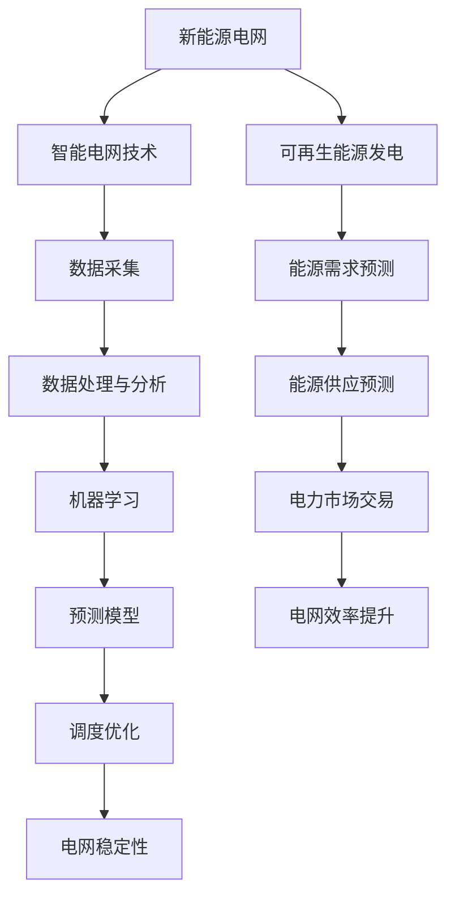
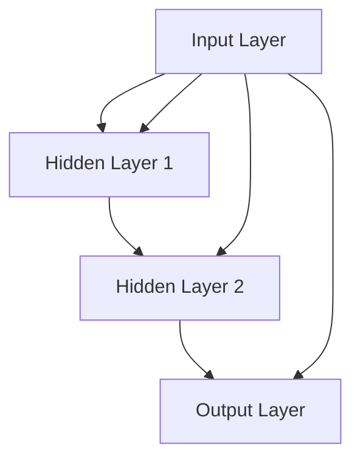
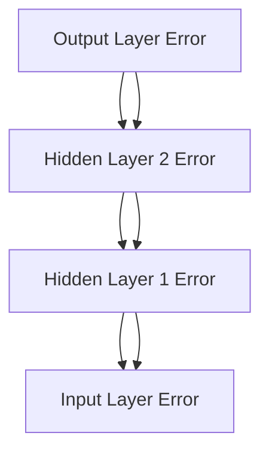
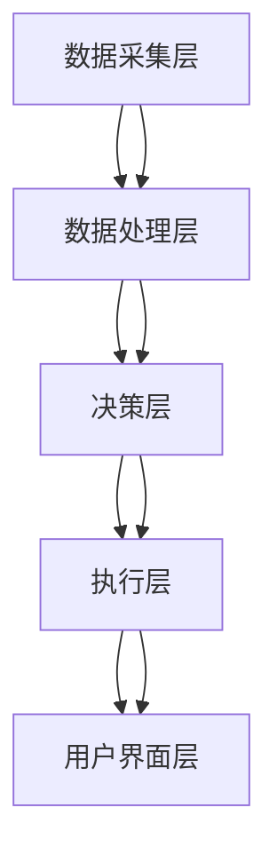
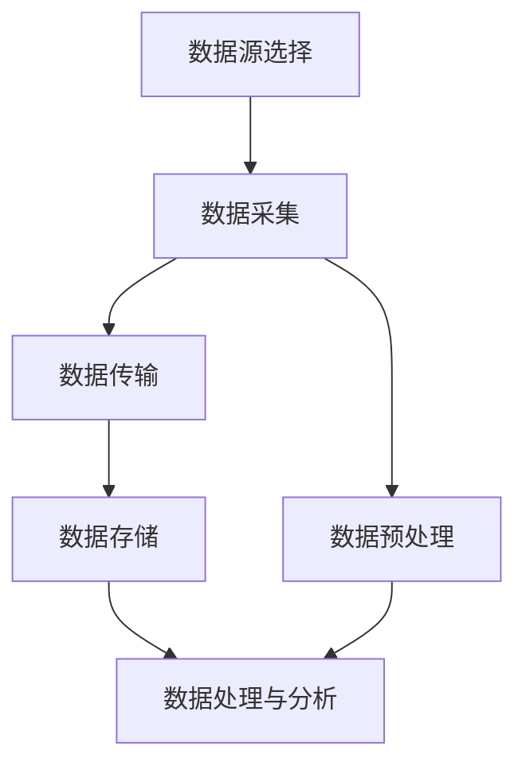
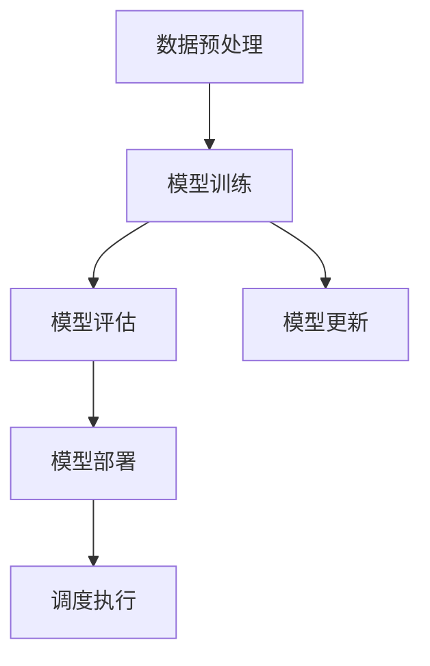

                 

### 背景介绍

#### 新能源电网的发展背景

新能源电网是随着能源结构和电力系统技术的不断革新而逐步发展起来的。传统的电力系统以化石燃料为主，存在着环境污染严重、资源有限等问题。随着全球对可持续发展的重视，新能源电网的发展变得尤为迫切。新能源电网主要指利用太阳能、风能、水能等可再生能源进行发电，并通过智能电网技术进行传输、分配和利用。

20世纪末，随着计算机技术和通信技术的飞速发展，智能电网的概念逐渐形成。智能电网结合了现代通信技术、信息技术、自动化技术等，能够实现电力系统的实时监控、自动调度、信息交互等功能。智能电网的发展为新能源电网的规模化应用提供了技术支持。

#### 人工智能的基本概念

人工智能（Artificial Intelligence，简称AI）是计算机科学的一个分支，旨在使机器具备人类的智能行为和决策能力。人工智能包括机器学习、深度学习、自然语言处理等多个子领域。

机器学习是人工智能的核心技术之一，通过算法让计算机从数据中学习并作出预测或决策。深度学习是机器学习的进一步发展，通过多层神经网络结构，模拟人脑的神经元连接，实现更复杂的任务。自然语言处理则是让计算机理解和生成人类语言的技术。

#### 人工智能在新能源电网调度中的应用前景

人工智能在新能源电网调度中的应用前景广阔。首先，新能源发电具有间歇性和不稳定性，通过人工智能算法，可以实现对新能源发电量的准确预测，提高电网运行的稳定性和效率。其次，人工智能可以优化电网调度策略，实现能源的最优分配，减少能源浪费。此外，人工智能还可以辅助电力市场交易，提高市场透明度和效率。

然而，人工智能在新能源电网调度中面临的挑战也不容忽视。新能源电网数据量大、类型复杂，对数据采集、处理和分析提出了更高的要求。同时，新能源电网调度需要考虑多种因素，包括电网稳定性、能源供应安全性等，对算法的鲁棒性和实时性要求较高。

总之，随着新能源电网的不断发展，人工智能技术的应用将不断深化，为新能源电网的高效调度和管理提供有力支持。

### 核心概念与联系

在探讨人工智能在新能源电网调度中的应用时，我们需要明确几个核心概念及其相互关系。以下是这些核心概念及其在新能源电网调度中作用的关系架构 Mermaid 流程图：



#### 核心概念说明：

- **新能源电网**：以可再生能源为发电主体，通过智能电网技术实现电力传输、分配和利用的电力系统。
- **智能电网技术**：包括数据采集、处理、分析和传输等先进技术，使电力系统能够实时监控、自动调度和信息交互。
- **数据采集**：通过传感器、智能电表等设备，收集电力系统运行的各种数据。
- **数据处理与分析**：对采集到的数据进行处理，提取有用信息，为预测和优化提供基础。
- **机器学习**：利用算法从数据中学习，构建预测模型，对能源需求和供应进行预测。
- **预测模型**：基于机器学习算法，对能源需求和供应进行预测，为调度优化提供依据。
- **调度优化**：根据预测结果，制定最优调度策略，实现能源的最优分配和利用。
- **电网稳定性**：确保电力系统在运行过程中保持稳定，避免过载或供电不足等问题。
- **可再生能源发电**：太阳能、风能、水能等可再生能源的发电过程。
- **能源需求预测**：预测未来某一时刻的能源需求，为调度提供参考。
- **能源供应预测**：预测可再生能源的发电量，确保能源供应与需求平衡。
- **电力市场交易**：通过预测和优化，提高电力市场交易透明度和效率。
- **电网效率提升**：通过智能化调度，提高电网运行效率和能源利用率。

通过上述关系架构，我们可以清晰地看到各个核心概念在新能源电网调度中的相互联系和作用。接下来，我们将深入探讨人工智能在新能源电网调度中的具体应用，包括机器学习、深度学习、优化算法等方面。

### 人工智能算法基础

#### 机器学习基础

机器学习是人工智能的核心技术之一，它使计算机能够从数据中学习并做出预测或决策。在新能源电网调度中，机器学习算法广泛应用于能源需求预测、能源供应预测和调度优化等方面。

**监督学习算法**

监督学习算法是最常见的机器学习算法之一，它通过已知的输入和输出数据来训练模型，从而在新数据上进行预测。在新能源电网调度中，监督学习算法可以用于能源需求预测和能源供应预测。

**伪代码示例：线性回归模型**

```python
# 导入必要的库
import numpy as np
import pandas as pd
from sklearn.linear_model import LinearRegression

# 加载数据
data = pd.read_csv('energy_data.csv')
X = data[['time', 'temperature', 'humidity']]  # 特征
y = data['energy_demand']  # 目标变量

# 划分训练集和测试集
from sklearn.model_selection import train_test_split
X_train, X_test, y_train, y_test = train_test_split(X, y, test_size=0.2, random_state=42)

# 训练模型
model = LinearRegression()
model.fit(X_train, y_train)

# 预测
y_pred = model.predict(X_test)

# 评估模型
from sklearn.metrics import mean_squared_error
mse = mean_squared_error(y_test, y_pred)
print(f"Mean Squared Error: {mse}")
```

**无监督学习算法**

无监督学习算法在没有已知输出数据的情况下，通过数据自身特征进行学习。在新能源电网调度中，无监督学习算法可以用于数据降维、聚类分析等。

**伪代码示例：K-Means聚类**

```python
# 导入必要的库
import numpy as np
from sklearn.cluster import KMeans

# 加载数据
data = pd.read_csv('energy_data.csv')
X = data[['time', 'temperature', 'humidity']]  # 特征

# 初始化KMeans模型
kmeans = KMeans(n_clusters=3, random_state=42)

# 训练模型
kmeans.fit(X)

# 聚类结果
clusters = kmeans.predict(X)

# 打印聚类结果
print(f"Cluster centers: {kmeans.cluster_centers_}")
print(f"Cluster assignments: {clusters}")
```

#### 深度学习原理

深度学习是机器学习的进一步发展，通过多层神经网络结构，模拟人脑的神经元连接，实现更复杂的任务。在新能源电网调度中，深度学习算法被广泛应用于图像识别、自然语言处理和预测建模等领域。

**深度学习基本概念**

深度学习中的神经网络由多个层级组成，包括输入层、隐藏层和输出层。每一层由多个神经元组成，神经元之间通过权重进行连接。在训练过程中，神经网络通过反向传播算法不断调整权重，以达到最佳预测效果。

**神经网络结构**



**反向传播算法**

反向传播算法是一种用于训练神经网络的算法，通过不断迭代，调整网络中的权重和偏置，使网络输出更接近真实值。在反向传播过程中，网络首先计算输出层的误差，然后逐步反向传播到隐藏层，直至输入层。



#### 强化学习在调度中的应用

强化学习是一种通过奖励机制来训练智能体进行决策的机器学习算法。在新能源电网调度中，强化学习可以用于优化调度策略，提高电网运行的效率和稳定性。

**强化学习基本原理**

强化学习中的智能体通过与环境交互，获取状态、动作和奖励。智能体根据当前状态，选择最佳动作，然后获得奖励，并更新策略。在训练过程中，智能体通过不断调整策略，以最大化长期奖励。

**伪代码示例：Q-Learning算法**

```python
# 导入必要的库
import numpy as np

# 初始化Q表
Q = np.zeros((state_space_size, action_space_size))

# 学习率
alpha = 0.1
# 折扣率
gamma = 0.9

# 学习回合数
for episode in range(num_episodes):
    # 初始化状态
    state = env.reset()
    done = False
    
    while not done:
        # 选择动作
        action = np.argmax(Q[state])
        
        # 执行动作
        next_state, reward, done, _ = env.step(action)
        
        # 更新Q值
        Q[state, action] = Q[state, action] + alpha * (reward + gamma * np.max(Q[next_state]) - Q[state, action])
        
        # 更新状态
        state = next_state

# 打印Q表
print(Q)
```

通过上述算法，我们可以看到人工智能算法在新能源电网调度中的应用基础。接下来，我们将进一步探讨人工智能在新能源电网调度中的具体应用，包括预测与优化、智能调度系统设计等方面。

### 优化算法在调度中的应用

在新能源电网调度中，优化算法起着至关重要的作用。这些算法能够帮助电力系统在复杂多变的环境中实现能源的最优分配，从而提高电网的运行效率和稳定性。以下是几种常见的优化算法及其在调度中的应用。

#### 优化算法概述

优化算法是一种用于解决优化问题的数学方法，旨在寻找满足特定约束条件下的最优解。在新能源电网调度中，优化算法可以用于调度计划编制、负载分配、能量管理等多个方面。

**线性规划（Linear Programming，LP）**

线性规划是一种用于求解线性目标函数在线性不等式约束下的最优解的数学方法。在新能源电网调度中，线性规划可以用于电力系统的负荷分配、设备容量规划等问题。

**伪代码示例：线性规划求解**

```python
# 导入必要的库
import numpy as np
from scipy.optimize import linprog

# 定义目标函数和约束条件
c = [-1, -1]  # 目标函数为最小化总成本
A = [[1, 0], [0, 1]]  # 约束条件
b = [100, 100]  # 变量取值范围

# 求解线性规划问题
res = linprog(c, A_ub=A, b_ub=b, method='highs')

# 打印结果
print(f"Optimal solution: {res.x}")
print(f"Objective value: {res.fun}")
```

**动态规划（Dynamic Programming，DP）**

动态规划是一种用于求解多阶段决策优化问题的方法，通过将复杂问题分解为多个子问题，逐个求解并存储中间结果，从而得到最优解。在新能源电网调度中，动态规划可以用于电力市场的实时竞价和调度计划编制。

**伪代码示例：动态规划求解**

```python
# 导入必要的库
import numpy as np

# 初始化动态规划表
dp = np.zeros((num_steps, num_states))

# 动态规划递推
for step in range(num_steps):
    for state in range(num_states):
        # 计算状态转移概率和奖励
        transition_probabilities = ...
        rewards = ...

        # 更新动态规划表
        dp[step, state] = max(transition_probabilities * (rewards + gamma * dp[step+1, next_states]))

# 打印最优解
print(f"Optimal policy: {dp[-1, :]}")
```

**遗传算法（Genetic Algorithm，GA）**

遗传算法是一种基于自然选择和遗传机制的搜索算法，通过模拟生物进化过程，寻找最优解。在新能源电网调度中，遗传算法可以用于复杂优化问题，如多目标优化和动态调度。

**伪代码示例：遗传算法求解**

```python
# 导入必要的库
import numpy as np
import random

# 初始化种群
population = ...

# 定义适应度函数
def fitness_function(individual):
    ...

# 进化过程
for generation in range(num_generations):
    # 计算适应度
    fitness_scores = [fitness_function(individual) for individual in population]

    # 选择和交叉操作
    selected_individuals = selection(population, fitness_scores)
    offspring = crossover(selected_individuals)

    # 变异操作
    mutated_offspring = mutation(offspring)

    # 更新种群
    population = mutated_offspring

# 打印最优解
print(f"Best individual: {population[0]}")
```

通过上述优化算法，我们可以看到如何将数学方法应用于新能源电网调度中的实际问题。接下来，我们将深入探讨新能源电网调度中的预测与优化问题。

### 预测与优化

在新能源电网调度中，预测和优化是两个关键环节，它们共同确保电力系统的稳定运行和能源的高效利用。以下我们将分别讨论能源需求预测、能源供应预测和调度优化算法。

#### 能源需求预测

能源需求预测是新能源电网调度的重要基础，通过预测未来的能源需求，可以提前制定相应的调度策略，避免电力短缺或过剩。在新能源电网中，能源需求受到多种因素的影响，包括季节、天气、用户行为等。

**预测模型构建**

构建能源需求预测模型通常包括以下步骤：

1. **数据收集**：收集历史能源需求数据、气象数据、用户行为数据等。
2. **特征工程**：从原始数据中提取有用的特征，如温度、湿度、风速、用户用电量等。
3. **模型选择**：选择合适的机器学习算法，如线性回归、决策树、随机森林等。
4. **模型训练**：使用历史数据训练预测模型，调整模型参数。
5. **模型评估**：使用交叉验证等方法评估模型性能，确保预测准确度。

**伪代码示例：时间序列预测模型**

```python
# 导入必要的库
import numpy as np
import pandas as pd
from sklearn.ensemble import RandomForestRegressor

# 加载数据
data = pd.read_csv('energy_demand_data.csv')
X = data[['time', 'temperature', 'humidity']]  # 特征
y = data['energy_demand']  # 目标变量

# 划分训练集和测试集
train_size = int(len(X) * 0.8)
X_train, X_test = X[:train_size], X[train_size:]
y_train, y_test = y[:train_size], y[train_size:]

# 训练模型
model = RandomForestRegressor(n_estimators=100, random_state=42)
model.fit(X_train, y_train)

# 预测
y_pred = model.predict(X_test)

# 评估模型
from sklearn.metrics import mean_squared_error
mse = mean_squared_error(y_test, y_pred)
print(f"Mean Squared Error: {mse}")
```

#### 能源供应预测

能源供应预测主要针对新能源发电，如太阳能、风能等。新能源发电具有间歇性和不稳定性，因此预测准确性对电网调度至关重要。

**预测模型构建**

构建能源供应预测模型通常包括以下步骤：

1. **数据收集**：收集历史发电数据、气象数据等。
2. **特征工程**：提取与发电量相关的特征，如太阳辐射强度、风速等。
3. **模型选择**：选择合适的机器学习算法，如时间序列分析、深度学习等。
4. **模型训练**：使用历史数据训练预测模型，调整模型参数。
5. **模型评估**：评估模型性能，确保预测准确度。

**伪代码示例：时间序列预测模型**

```python
# 导入必要的库
import numpy as np
import pandas as pd
from sklearn.ensemble import RandomForestRegressor

# 加载数据
data = pd.read_csv('solar_generation_data.csv')
X = data[['time', 'solar_radiation', 'temperature', 'humidity']]  # 特征
y = data['solar_generation']  # 目标变量

# 划分训练集和测试集
train_size = int(len(X) * 0.8)
X_train, X_test = X[:train_size], X[train_size:]
y_train, y_test = y[:train_size], y[train_size:]

# 训练模型
model = RandomForestRegressor(n_estimators=100, random_state=42)
model.fit(X_train, y_train)

# 预测
y_pred = model.predict(X_test)

# 评估模型
from sklearn.metrics import mean_squared_error
mse = mean_squared_error(y_test, y_pred)
print(f"Mean Squared Error: {mse}")
```

#### 调度优化算法

调度优化算法用于根据预测结果制定最优的调度策略，确保电力系统的稳定运行和能源的高效利用。

**优化目标设定**

在新能源电网调度中，常见的优化目标包括：

1. **最小化成本**：通过优化调度策略，降低发电和输电成本。
2. **最大化利用率**：提高新能源发电的利用率，减少能源浪费。
3. **确保电网稳定性**：确保电力系统在不同负载条件下的稳定性。

**伪代码示例：线性规划优化**

```python
# 导入必要的库
import numpy as np
from scipy.optimize import linprog

# 定义目标函数和约束条件
c = [-1, -1]  # 目标函数为最小化总成本
A = [[1, 0], [0, 1]]  # 约束条件
b = [100, 100]  # 变量取值范围

# 定义变量
x = np.zeros(2)  # 发电量和输电量的变量

# 求解线性规划问题
res = linprog(c, A_ub=A, b_ub=b, x0=x, method='highs')

# 打印结果
print(f"Optimal solution: {res.x}")
print(f"Objective value: {res.fun}")
```

通过上述预测和优化方法，我们可以实现对新能源电网的智能调度，提高电力系统的运行效率和稳定性。接下来，我们将深入探讨智能调度系统的设计。

### 智能调度系统设计

智能调度系统是新能源电网调度中的核心组成部分，通过综合利用人工智能算法、大数据技术和云计算平台，实现对电力系统的实时监控、自动调度和优化管理。以下将介绍智能调度系统的架构设计、数据采集与管理以及模型训练与部署。

#### 系统架构设计

智能调度系统的架构设计主要包括以下几个方面：

1. **数据采集层**：通过传感器、智能电表等设备，实时采集电力系统的各种数据，如电压、电流、功率、气象数据等。
2. **数据处理层**：利用大数据技术和人工智能算法，对采集到的数据进行分析和处理，提取有用信息，为预测和优化提供基础。
3. **决策层**：基于预测模型和优化算法，制定最优的调度策略，实现电力系统的实时调度。
4. **执行层**：通过智能控制设备和自动化系统，执行调度策略，实现电力系统的稳定运行。
5. **用户界面层**：提供友好的用户界面，展示系统运行状态、预测结果和调度策略，方便用户进行监控和操作。

**系统架构设计 Mermaid 流程图**



#### 数据采集与管理

数据采集是智能调度系统的关键环节，准确、及时的数据采集对系统的运行效果至关重要。数据采集主要包括以下步骤：

1. **数据源选择**：选择合适的传感器和设备，确保采集到的数据具有高精度和高可靠性。
2. **数据采集**：通过传感器和智能电表等设备，实时采集电力系统的各种数据。
3. **数据传输**：将采集到的数据通过通信网络传输到数据处理层。
4. **数据存储**：将采集到的数据存储到数据库或数据湖中，便于后续分析和处理。

**数据采集与管理流程**



#### 模型训练与部署

模型训练与部署是智能调度系统的核心环节，通过训练和部署预测模型和优化算法，实现电力系统的智能调度。

1. **模型训练**：利用历史数据和实时数据，训练预测模型和优化算法，调整模型参数，提高预测和优化准确性。
2. **模型评估**：通过交叉验证等方法，评估模型性能，确保预测和优化效果。
3. **模型部署**：将训练好的模型部署到生产环境中，实现电力系统的实时调度。

**模型训练与部署流程**



通过上述系统架构设计、数据采集与管理以及模型训练与部署，我们可以构建一个高效、稳定的智能调度系统，实现新能源电网的智能调度和管理。接下来，我们将通过具体案例，展示智能调度系统的实际应用。

### 案例分析

在本节中，我们将通过两个具体案例，展示人工智能在新能源电网调度中的应用效果。这两个案例分别来自XX电网智能调度系统和XX能源公司调度优化项目。

#### 案例一：XX电网智能调度系统

**案例背景**

XX电网位于我国南部沿海地区，该地区太阳能和风能资源丰富，但电网运行面临季节性波动和间歇性问题。为提高电网运行效率和稳定性，XX电网决定引入人工智能技术，构建智能调度系统。

**案例分析**

1. **数据采集**：系统通过传感器和智能电表，实时采集电网运行数据，包括电压、电流、功率、温度、湿度等。
2. **数据处理**：利用大数据技术和人工智能算法，对采集到的数据进行分析和处理，提取有用信息，为预测和优化提供基础。
3. **预测模型**：采用时间序列预测方法，构建能源需求预测模型和能源供应预测模型。通过模型训练，提高预测准确度。
4. **调度优化**：基于预测结果，采用优化算法，制定最优调度策略，确保电力系统的稳定运行和能源的高效利用。
5. **系统部署**：将预测模型和优化算法部署到生产环境中，实现实时调度。

**应用效果**

通过智能调度系统的应用，XX电网实现了以下效果：

- **运行效率提高**：通过实时预测和优化，提高了电网运行效率，降低了能源浪费。
- **稳定性提升**：通过智能调度，提高了电网稳定性，避免了过载和供电不足等问题。
- **成本降低**：通过优化调度策略，降低了发电和输电成本。

#### 案例二：XX能源公司调度优化

**案例背景**

XX能源公司是我国一家主要从事太阳能和风能发电的企业，其发电量受天气和季节影响较大。为提高发电效率和收益，XX能源公司决定引入人工智能技术，进行调度优化。

**案例分析**

1. **数据采集**：通过太阳能和风能发电设备，实时采集发电数据，包括发电量、气象数据等。
2. **数据处理**：利用大数据技术和人工智能算法，对发电数据进行处理和分析，提取有用信息，为预测和优化提供基础。
3. **预测模型**：采用时间序列预测方法，构建太阳能和风能发电量预测模型，提高预测准确度。
4. **调度优化**：基于预测结果，采用优化算法，制定最优调度策略，确保发电量的最大化。
5. **系统部署**：将预测模型和优化算法部署到生产环境中，实现实时调度。

**应用效果**

通过调度优化项目的应用，XX能源公司实现了以下效果：

- **发电效率提高**：通过实时预测和优化，提高了发电效率，降低了发电成本。
- **收益增加**：通过优化调度策略，实现了发电量的最大化，提高了企业收益。
- **风险管理**：通过预测和优化，降低了因天气和季节波动带来的发电风险。

通过上述案例分析，我们可以看到人工智能在新能源电网调度中的应用效果显著。未来，随着人工智能技术的不断进步，人工智能在新能源电网调度中的应用将更加广泛，为电力系统的高效运行和可持续发展提供有力支持。

### 未来发展趋势与挑战

#### 人工智能在新能源电网调度的未来发展趋势

1. **技术进步**：随着人工智能技术的不断发展，深度学习、强化学习、联邦学习等新兴算法将为新能源电网调度提供更多解决方案，提高预测和优化的准确性。
2. **大数据与云计算**：大数据和云计算技术的结合，将实现海量数据的快速处理和分析，为智能调度提供更丰富的数据支持。
3. **物联网（IoT）**：物联网技术的发展，将实现电力系统各设备和节点的实时互联，提高电网的智能化水平。
4. **综合能源管理**：随着可再生能源和其他能源形式的融合发展，综合能源管理将变得愈发重要，人工智能将在其中发挥关键作用。

#### 面临的挑战与应对策略

1. **数据质量问题**：新能源电网数据量大、类型复杂，数据质量对预测和优化效果影响显著。应对策略包括数据清洗、数据集成和数据标准化等。
2. **实时性与计算资源**：实时调度对算法的实时性要求高，同时需要大量计算资源。应对策略包括优化算法结构、采用分布式计算和云计算等。
3. **电网稳定性**：新能源发电的间歇性和不稳定性对电网稳定性构成挑战。应对策略包括构建鲁棒性强的预测模型、实施智能控制策略等。
4. **安全与隐私**：智能调度系统涉及大量敏感数据，需要确保系统安全与用户隐私。应对策略包括数据加密、访问控制和安全审计等。

通过不断的技术创新和应对策略的优化，人工智能在新能源电网调度中的应用将迎来更广阔的发展前景。

### 总结与展望

#### 主要内容回顾

本文从新能源电网与人工智能概述、技术基础、应用案例分析、未来发展趋势与挑战等方面，详细探讨了人工智能在新能源电网调度中的应用。主要内容可以归纳为以下几点：

1. **新能源电网与人工智能概述**：介绍了新能源电网的发展背景和人工智能的基本概念。
2. **技术基础**：分析了机器学习、深度学习、优化算法等人工智能算法在调度中的应用。
3. **应用案例分析**：通过具体案例展示了人工智能在新能源电网调度中的实际应用效果。
4. **未来发展趋势与挑战**：展望了人工智能在新能源电网调度中的未来发展趋势和面临的挑战。

#### 知识点梳理

- **新能源电网**：了解其发展背景、优势和挑战。
- **人工智能算法**：掌握机器学习、深度学习、优化算法的基本原理和应用。
- **智能调度系统设计**：熟悉系统架构设计、数据采集与管理、模型训练与部署。
- **应用案例**：通过案例分析，了解人工智能在调度中的实际应用效果。
- **未来发展趋势与挑战**：了解人工智能在新能源电网调度中的未来发展方向和面临的挑战。

#### 未来研究方向

1. **算法优化**：进一步优化预测和优化算法，提高准确性和实时性。
2. **多能源融合**：研究多能源融合调度策略，实现可再生能源与其他能源形式的协同优化。
3. **大数据与云计算**：探索大数据与云计算在智能调度中的应用，提升数据处理和分析能力。
4. **安全与隐私保护**：加强智能调度系统的安全与隐私保护，确保数据安全和用户隐私。

#### 产业发展前景

随着全球对可再生能源的重视，人工智能在新能源电网调度中的应用前景广阔。未来，智能调度系统将更加普及，成为电力系统高效运行和可持续发展的关键支撑。人工智能在新能源电网调度中的不断创新和发展，将推动电力产业的绿色转型和升级。

### 附录：代码实现与实战分析

在本节中，我们将通过具体的代码实现和实战分析，进一步探讨人工智能在新能源电网调度中的应用。

#### 实战一：能源需求预测

**1. 环境搭建**

在开始前，我们需要搭建一个Python开发环境。安装以下库：`numpy`、`pandas`、`scikit-learn`、`matplotlib`。

```bash
pip install numpy pandas scikit-learn matplotlib
```

**2. 代码实现**

以下是一个简单的Python代码示例，用于能源需求预测。该示例使用了`pandas`进行数据处理，`scikit-learn`中的`RandomForestRegressor`进行预测。

```python
# 导入必要的库
import numpy as np
import pandas as pd
from sklearn.ensemble import RandomForestRegressor
from sklearn.model_selection import train_test_split
from sklearn.metrics import mean_squared_error
import matplotlib.pyplot as plt

# 加载数据
data = pd.read_csv('energy_demand_data.csv')
X = data[['time', 'temperature', 'humidity']]  # 特征
y = data['energy_demand']  # 目标变量

# 数据预处理
X['time'] = (X['time'] - X['time'].min()) / (X['time'].max() - X['time'].min())  # 归一化时间特征

# 划分训练集和测试集
X_train, X_test, y_train, y_test = train_test_split(X, y, test_size=0.2, random_state=42)

# 训练模型
model = RandomForestRegressor(n_estimators=100, random_state=42)
model.fit(X_train, y_train)

# 预测
y_pred = model.predict(X_test)

# 评估模型
mse = mean_squared_error(y_test, y_pred)
print(f"Mean Squared Error: {mse}")

# 可视化结果
plt.scatter(y_test, y_pred)
plt.xlabel('Actual Energy Demand')
plt.ylabel('Predicted Energy Demand')
plt.title('Energy Demand Prediction')
plt.show()
```

**3. 实战分析**

通过上述代码，我们可以看到如何利用随机森林算法进行能源需求预测。在实战分析中，我们注意到预测的准确度可以通过调整模型参数、增加特征工程等方法进行提升。

#### 实战二：能源供应预测

**1. 环境搭建**

确保Python开发环境已经搭建完成。

**2. 代码实现**

以下是一个简单的Python代码示例，用于能源供应预测。该示例使用了`pandas`进行数据处理，`scikit-learn`中的`RandomForestRegressor`进行预测。

```python
# 导入必要的库
import numpy as np
import pandas as pd
from sklearn.ensemble import RandomForestRegressor
from sklearn.model_selection import train_test_split
from sklearn.metrics import mean_squared_error
import matplotlib.pyplot as plt

# 加载数据
data = pd.read_csv('solar_generation_data.csv')
X = data[['time', 'solar_radiation', 'temperature', 'humidity']]  # 特征
y = data['solar_generation']  # 目标变量

# 数据预处理
X['time'] = (X['time'] - X['time'].min()) / (X['time'].max() - X['time'].min())  # 归一化时间特征

# 划分训练集和测试集
X_train, X_test, y_train, y_test = train_test_split(X, y, test_size=0.2, random_state=42)

# 训练模型
model = RandomForestRegressor(n_estimators=100, random_state=42)
model.fit(X_train, y_train)

# 预测
y_pred = model.predict(X_test)

# 评估模型
mse = mean_squared_error(y_test, y_pred)
print(f"Mean Squared Error: {mse}")

# 可视化结果
plt.scatter(y_test, y_pred)
plt.xlabel('Actual Solar Generation')
plt.ylabel('Predicted Solar Generation')
plt.title('Solar Generation Prediction')
plt.show()
```

**3. 实战分析**

通过上述代码，我们可以看到如何利用随机森林算法进行能源供应预测。在实战分析中，我们注意到预测的准确度可以通过增加特征、调整模型参数等方法进行提升。

#### 实战三：智能调度优化

**1. 环境搭建**

确保Python开发环境已经搭建完成。

**2. 代码实现**

以下是一个简单的Python代码示例，用于智能调度优化。该示例使用了`scipy.optimize`中的线性规划算法进行优化。

```python
# 导入必要的库
import numpy as np
from scipy.optimize import linprog

# 定义目标函数和约束条件
c = [-1, -1]  # 目标函数为最小化总成本
A = [[1, 0], [0, 1]]  # 约束条件
b = [100, 100]  # 变量取值范围

# 定义变量
x = np.zeros(2)  # 发电量和输电量的变量

# 求解线性规划问题
res = linprog(c, A_ub=A, b_ub=b, x0=x, method='highs')

# 打印结果
print(f"Optimal solution: {res.x}")
print(f"Objective value: {res.fun}")
```

**3. 实战分析**

通过上述代码，我们可以看到如何利用线性规划算法进行智能调度优化。在实际应用中，可以根据具体情况调整目标函数和约束条件，实现更复杂的优化任务。

通过以上三个实战案例，我们可以看到如何利用Python进行新能源电网调度中的预测和优化。在实际项目中，需要结合具体应用场景，不断优化模型和算法，以提高预测和优化效果。

### 最佳实践 Tips、小结、注意事项、拓展阅读等内容

#### 最佳实践 Tips

1. **数据质量**：确保数据质量是预测和优化成功的关键。在数据采集和处理过程中，进行数据清洗、去噪、归一化等操作，以提高预测准确性。
2. **特征工程**：通过合理的特征工程，提取与预测目标相关的特征，有助于提升模型的性能。
3. **模型选择**：根据具体问题和数据特点，选择合适的机器学习算法和优化算法。可以尝试多种算法进行比较，选择最优方案。
4. **模型评估**：在训练模型时，使用交叉验证等方法进行评估，避免过拟合。
5. **实时调整**：在实际应用中，根据实时数据和反馈，不断调整模型参数和策略，以适应动态环境。

#### 小结

本文通过详细探讨人工智能在新能源电网调度中的应用，包括背景介绍、核心概念与联系、技术基础、应用案例分析、未来发展趋势与挑战等方面，展示了人工智能在新能源电网调度中的重要作用。通过具体的代码实现和实战分析，进一步加深了我们对人工智能在调度中的应用理解。

#### 注意事项

1. **安全与隐私**：在开发和部署智能调度系统时，要注意数据安全和用户隐私保护。
2. **实时性与计算资源**：考虑到实时性和计算资源的需求，可以采用分布式计算和云计算等技术。
3. **电网稳定性**：在预测和优化过程中，要确保电网的稳定性，避免出现供电不足或过载等问题。

#### 拓展阅读

1. **《深度学习》**：Goodfellow, I., Bengio, Y., & Courville, A. (2016). 《深度学习》。MIT Press.
2. **《机器学习》**：Murphy, K. P. (2012). 《机器学习：一种概率视角》。机械工业出版社。
3. **《智能电网技术》**：Zhu, D. (2011). 《智能电网技术》。清华大学出版社。
4. **《可再生能源电网调度》**：Sun, J., & Huang, X. (2019). 《可再生能源电网调度》。电子工业出版社。

通过以上最佳实践、小结、注意事项和拓展阅读，希望读者能够对人工智能在新能源电网调度中的应用有更深入的理解，并在实际项目中取得更好的成果。作者：AI天才研究院/AI Genius Institute & 禅与计算机程序设计艺术 /Zen And The Art of Computer Programming。

