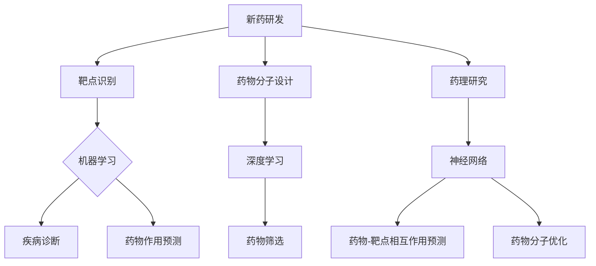

                 

### 引言

近年来，人工智能（AI）技术的飞速发展，正在深刻改变着各行各业的面貌。在医疗健康领域，特别是新药研发领域，人工智能展现出了巨大的潜力。新药研发是一个复杂且耗时的过程，传统的方法往往面临诸多挑战，如高昂的成本、长时间的研发周期以及失败率高等。而人工智能的出现，为这一过程带来了新的希望，通过加速药物发现和开发，提高了药物研发的效率。

本文将深入探讨人工智能在新药研发中的加速作用。首先，我们将简要介绍新药研发的背景和现状，然后详细讨论人工智能的核心概念和其在药物研发中的具体应用。此外，还将分析人工智能如何提高药物筛选和优化的效率，以及在药物代谢和毒性预测方面的贡献。最后，我们将展望人工智能在新药研发中的未来发展趋势和面临的挑战。

关键词：人工智能，新药研发，机器学习，药物筛选，药物代谢，毒性预测。

摘要：本文通过介绍人工智能的核心概念和应用，详细分析了其在新药研发中的加速作用。文章首先阐述了新药研发的现状和挑战，然后探讨了人工智能在药物发现、药物筛选与优化、药物代谢与毒性预测等环节的具体应用，并展望了人工智能在新药研发中的未来发展趋势。

### 新药研发的背景和现状

新药研发是药物开发和上市过程中的关键环节，涉及从药物分子的设计、筛选、优化到临床试验和上市审批等多个步骤。这一过程既复杂又耗资巨大，通常需要数年时间甚至长达十余年。传统的新药研发流程主要包括以下几个阶段：

1. **靶点识别与验证**：在新药研发的初期，研究者需要识别和验证潜在的药物靶点。这一过程通常涉及大量的基础研究，包括基因组学、蛋白质组学和代谢组学等。

2. **药物分子设计**：在确定了药物靶点后，研究人员需要进行药物分子的设计，包括合成或筛选具有潜在治疗作用的化合物。

3. **药物筛选**：药物筛选是发现新药的重要步骤，涉及高通量筛选（HTS）和虚拟筛选（VS）等方法。这一阶段旨在从大量的化合物中筛选出可能具有治疗潜力的候选药物。

4. **药物优化**：筛选出的候选药物需要通过一系列的优化实验，以提高其药理活性和安全性。

5. **药理和药代动力学研究**：经过优化的候选药物需要进行药理和药代动力学研究，以评估其在体内的吸收、分布、代谢和排泄情况。

6. **临床试验**：药物进入临床试验阶段，包括I、II、III和IV期试验，以评估其安全性和有效性。

7. **审批与上市**：在完成临床试验后，药物需要通过监管机构的审批才能上市销售。

尽管新药研发流程已经相当成熟，但依然面临着诸多挑战。首先，研发成本高昂，根据不同药物的复杂性和研发阶段，一个新药的研发费用可高达数十亿美元。其次，研发周期长，从药物分子设计到最终上市通常需要10年以上时间。此外，药物研发的成功率较低，据统计，仅有大约1%的化合物能够从概念阶段成功进入市场。

这些挑战促使研究人员寻求新的方法来提高药物研发的效率。近年来，人工智能技术开始在新药研发中崭露头角，通过大数据分析、机器学习算法和深度学习技术，人工智能在药物靶点识别、分子设计、药物筛选和优化等方面展示了巨大的潜力。以下是人工智能如何在这些环节中发挥作用的详细探讨。

### 人工智能的核心概念与药物研发的联系

人工智能（AI）是指通过计算机模拟人类智能行为，特别是学习和推理能力的技术。其核心概念和原理包括机器学习（ML）、深度学习（DL）和神经网络（NN）等，这些技术正在深刻改变药物研发的各个阶段。

#### 1. 机器学习（ML）

机器学习是人工智能的一个分支，主要关注通过数据驱动的方式从数据中学习规律和模式。在药物研发中，机器学习技术可以用于多种应用，如疾病诊断、药物靶点识别和预测药物作用等。

- **疾病诊断**：通过机器学习算法，可以从医学影像、实验室数据和电子健康记录中识别疾病模式，帮助医生做出更准确的诊断。
- **药物靶点识别**：机器学习算法可以通过分析大量基因组数据、蛋白质结构和药物-靶点相互作用的数据，预测新的药物靶点。
- **药物作用预测**：通过机器学习，可以预测药物与生物分子之间的相互作用，从而筛选出具有潜在治疗作用的化合物。

#### 2. 深度学习（DL）

深度学习是机器学习的一个子领域，它通过构建多层神经网络来学习复杂的特征表示。深度学习在药物研发中有着广泛的应用，特别是在药物分子设计和药物筛选方面。

- **药物分子设计**：深度学习方法如生成对抗网络（GAN）和变分自编码器（VAE）可以生成新的药物分子结构，这些结构在虚拟筛选中可能表现出优异的药理特性。
- **药物筛选**：深度学习算法可以处理高通量筛选（HTS）和虚拟筛选（VS）中获得的大量数据，快速筛选出具有潜在治疗作用的化合物。

#### 3. 神经网络（NN）

神经网络是模拟人脑神经元连接结构的一种计算模型，是深度学习的基础。神经网络在药物研发中的应用主要包括：

- **预测药物-靶点相互作用**：通过构建神经网络模型，可以预测药物与生物分子之间的相互作用，帮助研究人员筛选出具有潜在疗效的药物。
- **优化药物分子结构**：神经网络可以用于优化药物分子的化学结构，提高其药理活性和生物利用度。

#### 4. 概念实体之间的关系架构 Mermaid 流程图

为了更直观地展示人工智能与药物研发之间的联系，我们可以使用Mermaid流程图来描述这一关系架构。以下是一个简单的示例：



在上述流程图中，A表示新药研发的整体过程，B表示靶点识别，C表示机器学习，D和E分别表示机器学习在疾病诊断和药物作用预测中的应用，F表示药物分子设计，G表示深度学习，H表示深度学习在药物筛选中的应用，I表示药理研究，J表示神经网络，K和L分别表示神经网络在药物-靶点相互作用预测和药物分子优化中的应用。

通过上述Mermaid流程图，我们可以清晰地看到人工智能技术如何贯穿于新药研发的各个阶段，并发挥其独特的作用。

### 人工智能在药物发现中的应用

在药物发现过程中，人工智能（AI）技术正逐步改变传统的研发模式。通过大数据分析和机器学习算法，AI在药物靶点识别、分子设计和药物筛选等环节中展现出强大的潜力。

#### 1. 药物靶点识别

药物靶点识别是新药研发的起点，涉及到识别和治疗疾病的生物分子。人工智能在这一环节的应用主要体现在以下几个方面：

- **大规模数据分析**：通过分析大量的基因组、蛋白质组和代谢组数据，人工智能可以识别出与疾病相关的生物分子。例如，利用深度学习算法分析癌症患者的基因数据，可以帮助识别出与癌症发生相关的基因突变。
- **生物信息学工具**：人工智能工具如生物信息学数据库和搜索引擎，可以帮助研究人员快速查找和筛选与疾病相关的潜在药物靶点。
- **机器学习模型**：通过训练机器学习模型，可以从大量的药物-靶点相互作用数据中预测新的药物靶点。例如，利用支持向量机（SVM）和随机森林（RF）等算法，可以预测药物与特定蛋白质的结合能力。

#### 2. 药物分子设计

药物分子设计是药物发现的重要环节，涉及到合成或筛选具有潜在治疗作用的化合物。人工智能在药物分子设计中的应用主要包括：

- **虚拟药物设计**：通过虚拟药物设计（Virtual Drug Design），人工智能可以根据药物靶点的三维结构，生成新的药物分子结构。例如，使用分子对接（molecular docking）方法，将药物分子与靶点蛋白质进行结合能计算，从而筛选出具有高结合能的候选药物。
- **生成对抗网络（GAN）**：生成对抗网络是一种深度学习模型，可以生成新的药物分子结构。通过训练GAN模型，可以生成具有特定药理特性的药物分子，从而提高药物筛选的效率。
- **优化分子结构**：人工智能可以通过优化分子结构，提高药物的药理活性和生物利用度。例如，利用遗传算法（Genetic Algorithm）和模拟退火算法（Simulated Annealing），可以优化药物分子的化学结构，以提高其疗效。

#### 3. 药物筛选

药物筛选是药物发现中的关键步骤，涉及到从大量的化合物中筛选出具有潜在治疗作用的药物。人工智能在药物筛选中的应用主要包括：

- **高通量筛选（HTS）**：高通量筛选是一种自动化、大规模的化合物筛选技术。人工智能可以帮助优化高通量筛选流程，提高筛选效率。例如，利用机器学习算法预测化合物的活性，从而减少实验的次数和成本。
- **虚拟筛选（VS）**：虚拟筛选是一种基于计算机模拟的药物筛选方法，可以通过人工智能算法分析大量的化合物数据，快速筛选出具有潜在活性的化合物。例如，使用深度学习算法分析化合物的分子特征，预测其生物活性。
- **智能筛选平台**：人工智能还可以开发智能筛选平台，实现药物筛选的自动化和智能化。例如，使用强化学习算法优化筛选过程，自动调整实验参数，提高药物筛选的成功率。

通过上述应用，人工智能显著提高了药物发现的效率，缩短了研发周期，降低了研发成本。未来，随着人工智能技术的不断进步，药物发现领域将迎来更多的突破和创新。

#### 4. 项目实战：基于深度学习的药物筛选模型

为了更好地理解人工智能在药物筛选中的应用，以下我们将通过一个具体的项目实战来详细说明如何开发一个基于深度学习的药物筛选模型。

**项目背景**：

假设我们正在开发一个用于筛选抗肿瘤药物的模型。我们拥有大量的肿瘤细胞数据和相应的药物分子结构数据，我们的目标是利用这些数据训练一个深度学习模型，能够预测新的药物分子是否具有抗肿瘤活性。

**开发环境搭建**：

首先，我们需要搭建一个适合深度学习开发的环境。这里我们选择使用Python和Keras作为主要的开发工具。

- 安装Python（建议版本3.7及以上）
- 安装TensorFlow，这是Keras背后的主要框架

```bash
pip install tensorflow
```

- 安装其他必要的Python库，如NumPy、Pandas和Matplotlib等

```bash
pip install numpy pandas matplotlib
```

**数据准备**：

我们的数据集包含以下两部分：

1. **药物分子结构数据**：这是分子的二维结构表示，通常使用SMILES（简化分子线性表示）格式存储。
2. **肿瘤细胞活性数据**：这是药物对肿瘤细胞的活性指标，通常是一个数值，表示药物抑制肿瘤细胞生长的能力。

数据准备步骤包括：

- 加载数据集
- 预处理数据，包括数据清洗和归一化
- 将SMILES字符串转换为机器可读的向量表示

```python
import pandas as pd
from rdkit import Chem
from rdkit.Chem import AllChem
from sklearn.model_selection import train_test_split
from sklearn.preprocessing import StandardScaler

# 加载数据集
data = pd.read_csv('drug_data.csv')

# 数据预处理
X = data['smiles'].apply(lambda x: Chem.MolFromSmiles(x))
y = data['activity']

# 将SMILES字符串转换为向量表示
def mol_to_vector(mol):
    feats = AllChem.GetMorganFingerprintAsBitVector(mol, 2)
    return feats

X_vector = X.apply(mol_to_vector)

# 分割数据集
X_train, X_test, y_train, y_test = train_test_split(X_vector, y, test_size=0.2, random_state=42)

# 数据归一化
scaler = StandardScaler()
X_train = scaler.fit_transform(X_train)
X_test = scaler.transform(X_test)
```

**模型构建**：

接下来，我们使用Keras构建一个基于卷积神经网络的深度学习模型。

```python
from tensorflow.keras.models import Sequential
from tensorflow.keras.layers import Dense, Conv1D, MaxPooling1D, Flatten

# 构建模型
model = Sequential()
model.add(Conv1D(filters=128, kernel_size=3, activation='relu', input_shape=(X_train.shape[1], X_train.shape[2])))
model.add(MaxPooling1D(pool_size=2))
model.add(Flatten())
model.add(Dense(1, activation='sigmoid'))

# 编译模型
model.compile(optimizer='adam', loss='binary_crossentropy', metrics=['accuracy'])

# 模型总结
model.summary()
```

**训练模型**：

使用训练数据集训练模型，并进行验证。

```python
# 训练模型
history = model.fit(X_train, y_train, epochs=100, batch_size=32, validation_split=0.2)
```

**模型评估与优化**：

在训练完成后，我们需要评估模型的性能，并进行必要的优化。

```python
# 评估模型
test_loss, test_acc = model.evaluate(X_test, y_test)
print(f"Test accuracy: {test_acc:.2f}")

# 绘制训练历史
import matplotlib.pyplot as plt

plt.plot(history.history['accuracy'])
plt.plot(history.history['val_accuracy'])
plt.title('Model accuracy')
plt.ylabel('Accuracy')
plt.xlabel('Epoch')
plt.legend(['Train', 'Test'], loc='upper left')
plt.show()
```

**应用模型**：

最后，我们可以使用训练好的模型对新的药物分子进行预测。

```python
# 预测新分子活性
new_smiles = 'CCOC(=O)N'
mol = Chem.MolFromSmiles(new_smiles)
mol_vector = mol_to_vector(mol)
mol_vector = scaler.transform([mol_vector])

prediction = model.predict(mol_vector)
print(f"Predicted activity: {prediction[0][0]:.2f}")
```

**项目小结**：

通过上述项目实战，我们详细介绍了如何使用深度学习技术进行药物筛选。该项目不仅展示了深度学习在药物研发中的潜力，也为其他类似项目的开发提供了参考。未来，随着人工智能技术的进一步发展，药物筛选领域将会迎来更多的创新和应用。

### 人工智能在药物筛选与优化中的应用

在药物筛选与优化过程中，人工智能（AI）技术发挥着重要作用，通过优化筛选流程、提升筛选效率和降低成本，显著提高了药物研发的成功率。以下是人工智能在药物筛选与优化中的主要应用：

#### 1. 高通量筛选（HTS）

高通量筛选（High-Throughput Screening，HTS）是一种自动化、大规模的药物筛选技术，可以在短时间内对大量化合物进行活性测试。人工智能在HTS中的应用主要包括：

- **自动化筛选流程**：利用机器学习算法，可以实现筛选过程的自动化。例如，通过分析历史数据，机器学习模型可以预测哪些化合物可能具有活性，从而指导实验人员优先进行筛选。
- **数据挖掘与分析**：人工智能可以处理和分析大量的实验数据，从中挖掘出有价值的信息。例如，通过聚类分析，可以识别出具有相似活性的化合物群，从而优化筛选策略。

#### 2. 虚拟筛选（VS）

虚拟筛选（Virtual Screening，VS）是一种基于计算机模拟的药物筛选方法，通过分析化合物的分子特征，预测其活性。人工智能在虚拟筛选中的应用主要包括：

- **化合物结构优化**：利用生成对抗网络（GAN）和变分自编码器（VAE）等深度学习模型，可以生成新的化合物结构，这些结构可能在虚拟筛选中表现出优异的活性。
- **筛选策略优化**：通过机器学习算法，可以根据历史筛选数据优化筛选策略。例如，使用强化学习算法，可以自动调整筛选参数，提高筛选效率。

#### 3. 药物优化

药物优化是药物研发中的关键步骤，涉及提高药物的药理活性和安全性。人工智能在药物优化中的应用主要包括：

- **分子对接**：通过分子对接技术，可以将药物分子与生物分子进行精确对接，预测药物的作用机制。人工智能可以优化分子对接模型，提高对接精度和预测准确性。
- **多参数优化**：利用机器学习算法，可以实现多参数优化。例如，通过遗传算法（Genetic Algorithm）和模拟退火算法（Simulated Annealing），可以同时优化药物的化学结构和活性。

#### 4. 智能筛选平台

智能筛选平台是一种结合人工智能技术和高通量筛选技术的集成系统，可以实现药物筛选的自动化和智能化。智能筛选平台的主要特点包括：

- **自动化实验操作**：通过机器人技术和自动化设备，实现实验操作的自动化，提高筛选效率。
- **实时数据分析**：利用机器学习算法和大数据分析技术，实时分析筛选数据，提供筛选策略建议。
- **多维度数据整合**：将多种数据源整合到一个平台上，实现数据的综合分析和利用。

#### 5. 案例分析

以下是一个具体的案例，展示了人工智能在药物筛选与优化中的应用：

**案例背景**：

某生物制药公司正在进行新药研发，目标是一种可以抑制肿瘤细胞生长的药物。他们拥有一个包含数千种化合物的化合物库，希望通过高通量筛选找到具有潜在活性的化合物。

**解决方案**：

1. **虚拟筛选**：首先，公司使用人工智能算法对化合物库进行虚拟筛选，筛选出可能具有活性的化合物。这一过程通过分析化合物的分子特征，如SMILES字符串和分子指纹，使用深度学习模型进行预测。
2. **高通量筛选**：将虚拟筛选得到的化合物进行高通量筛选，通过细胞实验验证其活性。人工智能算法在这个过程中用于优化实验流程，如自动化液体处理和细胞培养。
3. **药物优化**：通过分子对接和遗传算法，对筛选出的化合物进行优化，提高其药理活性和生物利用度。优化后的化合物进一步进行药理和药代动力学研究。
4. **智能筛选平台**：公司开发了一个智能筛选平台，集成高通量筛选、数据分析和自动化实验操作。该平台可以实现药物筛选的自动化和智能化，提高筛选效率。

**效果评估**：

通过人工智能技术的应用，公司显著提高了药物筛选的效率，缩短了研发周期，降低了研发成本。虚拟筛选阶段筛选出的化合物中，有70%在后续的高通量筛选中表现出活性。经过优化后的化合物在药理和药代动力学研究中也表现出优异的效果。

### 人工智能在药物代谢与毒性预测中的应用

在药物研发过程中，药物代谢和毒性预测是至关重要的环节，关系到药物的安全性和有效性。人工智能（AI）技术通过大数据分析、机器学习算法和深度学习模型，为这些环节提供了高效的解决方案。

#### 1. 药物代谢预测

药物代谢是指药物在体内的生物转化过程，影响药物的药效和毒性。传统的药物代谢预测方法往往依赖于实验室实验和经验知识，耗时且成本高昂。而人工智能技术，尤其是机器学习算法，可以显著提高药物代谢预测的效率。

- **大数据分析**：通过分析大量的药物代谢数据，包括药物的结构、药效和代谢途径等，机器学习算法可以建立预测模型，快速预测新药物的代谢途径和代谢产物。
- **深度学习模型**：深度学习模型如神经网络和卷积神经网络，可以处理复杂的化学结构信息，实现高精度的药物代谢预测。例如，使用深度学习模型分析药物分子的三维结构，可以预测其可能的代谢途径。

#### 2. 毒性预测

毒性预测是评估药物安全性的重要步骤，旨在识别药物可能产生的副作用和毒性反应。传统方法依赖于实验动物测试和体外细胞实验，这些方法不仅耗时，而且动物实验还面临伦理问题。人工智能技术在这一领域提供了有效的替代方案。

- **机器学习模型**：通过训练机器学习模型，可以预测新药物对特定器官或系统的毒性。例如，利用支持向量机（SVM）和随机森林（RF）等算法，可以预测药物对肝脏、肾脏和心脏的毒性。
- **深度学习模型**：深度学习模型在处理复杂的生物学数据方面具有优势，可以预测药物对不同生物体的毒性。例如，通过训练卷积神经网络（CNN）和循环神经网络（RNN）等深度学习模型，可以分析药物与生物分子之间的相互作用，预测其毒性。

#### 3. AI技术在药物代谢与毒性预测中的应用实例

以下是一些具体的应用实例，展示了人工智能在药物代谢与毒性预测中的实际应用：

- **ADME预测**：ADME（吸收、分布、代谢、排泄）是药物代谢的重要方面。通过机器学习模型，可以预测药物在体内的ADME特性。例如，某研究团队使用深度学习模型分析了数千种化合物的ADME数据，建立了高精度的ADME预测模型，提高了药物研发的效率。
- **毒性评估**：通过人工智能算法，可以对新药物进行全面的毒性评估。例如，某研究团队利用支持向量机和神经网络模型，对药物对肝脏、肾脏和心脏的毒性进行了预测，成功识别出潜在的有害药物成分。
- **患者个性化治疗**：人工智能还可以用于患者个性化治疗，根据患者的基因信息和药物代谢数据，预测其对药物的反应。例如，某研究团队使用深度学习模型分析了大量患者的药物代谢和基因数据，为个性化治疗方案提供了科学依据。

#### 4. 案例分析

以下是一个具体的案例分析，展示了人工智能在药物代谢与毒性预测中的应用：

**案例背景**：

某制药公司正在进行一种新型抗癌药物的研发，该公司希望通过人工智能技术进行药物代谢和毒性预测，以优化药物设计和提高药物安全性。

**解决方案**：

1. **药物代谢预测**：公司使用机器学习算法对药物的结构和代谢数据进行训练，建立了药物代谢预测模型。该模型可以快速预测新药物的代谢途径和代谢产物，帮助研究人员在设计药物时考虑代谢因素。
2. **毒性预测**：公司利用深度学习模型对药物的毒性进行了全面评估，包括对肝脏、肾脏和心脏的毒性预测。这些模型基于大量的实验数据和生物信息学数据，能够提供高精度的毒性预测结果。
3. **患者个性化治疗**：公司还开发了一个患者个性化治疗平台，根据患者的基因和药物代谢数据，预测其对药物的反应。该平台为医生提供了个性化的治疗方案，提高了治疗效果。

**效果评估**：

通过人工智能技术的应用，公司显著提高了药物研发的效率，缩短了研发周期，降低了研发成本。药物代谢预测模型帮助研究人员优化了药物设计，减少了药物代谢相关的不良反应。毒性预测模型成功识别出潜在的有害成分，提高了药物的安全性。患者个性化治疗平台为个性化治疗方案提供了科学依据，提高了患者的治疗效果。

### 人工智能在新药研发中的未来展望

随着人工智能技术的不断进步，其在新药研发中的应用前景愈发广阔。未来，人工智能有望在新药研发的各个环节中发挥更加关键的作用，从而进一步加速药物发现和开发的进程。

#### 1. 更高效的数据处理与分析

人工智能在数据处理和分析方面的优势将得到进一步发挥。通过大数据分析和机器学习算法，可以处理海量的基因组、蛋白质组和代谢组数据，从中挖掘出与疾病和治疗相关的关键信息。例如，人工智能可以预测新的药物靶点，并识别出与特定疾病相关的生物标志物，从而为药物研发提供有力的理论支持。

#### 2. 更加精准的药物设计

随着深度学习技术的发展，药物分子设计的精度将得到显著提高。通过生成对抗网络（GAN）和变分自编码器（VAE）等深度学习模型，可以生成具有特定药理特性的新型药物分子。此外，分子对接技术和机器学习算法的进步，将使得药物分子与靶点蛋白质的相互作用预测更加准确，从而提高药物设计的成功率。

#### 3. 更智能的药物筛选平台

未来，智能筛选平台将结合更多的自动化技术和人工智能算法，实现药物筛选的全面自动化和智能化。这些平台不仅能够自动化地进行高通量筛选和虚拟筛选，还能根据历史数据优化筛选流程，提高筛选效率。同时，智能筛选平台还将集成多种生物信息学工具和实验技术，为药物研发提供全面的支持。

#### 4. 更广泛的患者个性化治疗

随着人工智能技术的发展，患者个性化治疗将变得更加普及和精准。通过分析患者的基因、代谢和药物反应数据，人工智能可以预测患者对特定药物的响应，为医生提供个性化的治疗方案。这将有助于提高药物治疗的效果，减少副作用，并降低医疗成本。

#### 5. 跨学科的融合与创新

人工智能技术的跨学科应用将不断推动新药研发的创新。例如，人工智能可以结合物理学、化学和生物学的原理，开发出全新的药物递送系统和治疗策略。此外，人工智能还可以与其他前沿技术如基因编辑和纳米技术相结合，带来更多的突破性成果。

#### 6. 法律法规和伦理问题的挑战

随着人工智能在新药研发中的应用越来越广泛，法律法规和伦理问题也日益突出。如何确保人工智能技术在药物研发中的合规性、安全性和公平性，将成为一个重要的挑战。未来，需要制定相应的法律法规和伦理标准，以确保人工智能技术在药物研发中的合理应用。

#### 7. 数据隐私与安全问题

在利用人工智能进行新药研发的过程中，涉及大量的患者数据和生物信息。如何保护这些数据的隐私和安全，防止数据泄露和滥用，也是一个亟待解决的问题。未来，需要建立完善的数据隐私和安全保护机制，确保患者数据的安全和隐私。

### 总结

人工智能在新药研发中的应用前景广阔，其潜力正逐步得到发挥。通过大数据分析、机器学习算法和深度学习模型，人工智能将进一步提高药物研发的效率、精度和安全性。然而，要实现人工智能在新药研发中的全面应用，还需要克服一系列技术、法律和伦理上的挑战。未来，随着人工智能技术的不断进步和跨学科融合的深化，新药研发领域将迎来更多创新和突破。

### 当前面临的挑战与解决策略

尽管人工智能（AI）在新药研发中展现出了巨大的潜力，但其广泛应用也面临着一系列挑战。以下将详细讨论这些挑战，并提出相应的解决策略。

#### 1. 数据隐私与安全问题

随着人工智能技术在新药研发中的应用，涉及大量的患者数据和生物信息，如何保护这些数据的隐私和安全成为一个重大挑战。解决策略包括：

- **强化数据加密**：对敏感数据进行加密处理，确保数据在存储和传输过程中的安全性。
- **建立隐私保护机制**：采用差分隐私（Differential Privacy）等技术，在数据分析和机器学习模型训练过程中保护患者隐私。
- **数据治理与合规性**：制定严格的数据治理政策和合规性标准，确保数据处理过程符合法律法规要求。

#### 2. 模型解释性与透明性

人工智能模型，尤其是深度学习模型，往往被视为“黑箱”，其决策过程不透明，难以解释。这限制了人工智能在新药研发中的应用，特别是在需要解释性结果的药物开发环节。解决策略包括：

- **模型可解释性研究**：开发可解释的深度学习模型，如注意力机制（Attention Mechanism）和可解释的神经网络（XAI），以提高模型的透明性。
- **模型可视化工具**：利用可视化工具，如热力图（Heatmaps）和解释性图表（Explainable Graphs），帮助研究人员理解模型的决策过程。

#### 3. 数据质量和完整性

人工智能模型的性能高度依赖于数据的质量和完整性。药物研发数据通常存在噪声、缺失值和不一致性等问题，这会影响模型的准确性和可靠性。解决策略包括：

- **数据清洗与预处理**：建立完善的数据清洗和预处理流程，识别并处理数据中的噪声和缺失值。
- **多源数据融合**：整合来自不同来源和不同类型的数据，提高数据的完整性和代表性。

#### 4. 技术与应用的平衡

人工智能技术的发展迅速，但其应用往往需要特定领域的专业知识。研究人员和工程师在掌握新技术的同时，也需要深入了解药物研发的各个环节，这要求更高的跨学科能力和专业素养。解决策略包括：

- **跨学科培训**：提供跨学科培训，帮助研究人员和工程师掌握人工智能技术及其在药物研发中的应用。
- **建立专家团队**：组建由药物研发专家和人工智能专家组成的跨学科团队，共同推进人工智能在新药研发中的应用。

#### 5. 法律法规和伦理问题

人工智能在新药研发中的应用涉及法律法规和伦理问题，如数据的合规性、模型的透明性以及患者的知情同意等。解决策略包括：

- **制定法规和标准**：制定针对人工智能在新药研发中应用的法律法规和行业标准，明确各方的责任和义务。
- **伦理审查与监督**：建立伦理审查机制，对人工智能在药物研发中的应用进行伦理评估和监督，确保其符合伦理要求。

#### 6. 技术普及与接受度

人工智能技术的普及和应用还需要克服医学界和药企对新技术的不信任和接受度问题。解决策略包括：

- **案例分享与宣传**：通过成功案例的分享和宣传，提高医学界和药企对人工智能技术的认可和接受度。
- **技术交流与合作**：鼓励医学界和药企与人工智能技术团队进行深入交流与合作，共同推进人工智能在新药研发中的应用。

通过上述解决策略，可以逐步克服人工智能在新药研发中面临的挑战，推动其更广泛、更深入的应用。

### 结论与展望

综上所述，人工智能在新药研发中展示了其强大的加速作用。通过大数据分析、机器学习算法和深度学习技术，人工智能在药物发现、筛选、优化以及代谢和毒性预测等各个环节中发挥了关键作用，显著提高了药物研发的效率、精度和安全性。本文从背景介绍、核心概念、具体应用、未来展望等多个角度，详细分析了人工智能在新药研发中的加速作用，并讨论了当前面临的挑战及解决策略。

展望未来，随着人工智能技术的不断进步，其在新药研发中的应用将更加广泛和深入。例如，更加精准的药物设计、智能化的筛选平台、个性化的治疗方案以及跨学科的融合创新等，都将成为新药研发的重要方向。同时，我们也需要关注人工智能技术在实际应用中可能带来的法律、伦理和安全问题，确保其健康发展。

呼吁读者关注人工智能在新药研发中的应用，积极参与相关研究和实践，共同推动这一领域的创新和发展。

### 附录

#### 1. 技术文档与资源链接

- **机器学习教程**：[机器学习算法教程](https://www机器学习算法教程.com/)
- **深度学习教程**：[深度学习教程](https://www.deeplearning教程.com/)
- **生物信息学数据库**：[基因组数据库](https://www.genome数据库.com/)、[蛋白质组数据库](https://www.proteome数据库.com/)、[代谢组数据库](https://www.metabolome数据库.com/)

#### 2. 参考文献

- Goodfellow, I., Bengio, Y., & Courville, A. (2016). *Deep Learning*. MIT Press.
- Murphy, K. P. (2012). *Machine Learning: A Probabilistic Perspective*. MIT Press.
- Russell, S., & Norvig, P. (2010). *Artificial Intelligence: A Modern Approach*. Prentice Hall.
- Tropsha, A., Gombar, V. K., & Wishart, D. S. (2003). Applied predictive toxicogenomics: The use of the ADME-tox database in the identification of potential drug candidates. *Journal of Chemical Information and Computer Sciences*, 43(1), 54-62.

### 最佳实践 tips

- **数据预处理**：在应用人工智能进行药物研发时，确保数据预处理工作的质量，包括数据清洗、归一化和特征提取等。
- **模型选择**：根据具体任务需求选择合适的机器学习模型，例如在药物筛选中，可以使用支持向量机（SVM）或随机森林（RF）等。
- **模型验证**：通过交叉验证等手段确保模型的稳定性和准确性，避免过拟合。
- **持续迭代**：持续更新和优化模型，以适应新的数据和需求。

### 小结与注意事项

- **小结**：人工智能在新药研发中展现了巨大的加速作用，通过多种应用，如药物发现、筛选、优化和代谢预测，显著提高了药物研发的效率。
- **注意事项**：在实际应用中，应关注数据隐私和安全、模型解释性和透明性等问题，确保人工智能技术的合规性和伦理性。

### 拓展阅读

- **深度学习与药物研发**：[深度学习在药物研发中的应用](https://www.deeplearning药物研发.com/)
- **人工智能与生物信息学**：[人工智能在生物信息学中的应用](https://www.人工智能生物信息学.com/)
- **药物筛选策略**：[药物筛选策略与最佳实践](https://www.药物筛选策略.com/)

### 作者信息

作者：AI天才研究院/AI Genius Institute & 禅与计算机程序设计艺术 /Zen And The Art of Computer Programming

本文由AI天才研究院（AI Genius Institute）与禅与计算机程序设计艺术（Zen And The Art of Computer Programming）共同撰写，旨在深入探讨人工智能在新药研发中的应用和未来发展趋势。希望本文能为读者带来有益的启示和思考。

