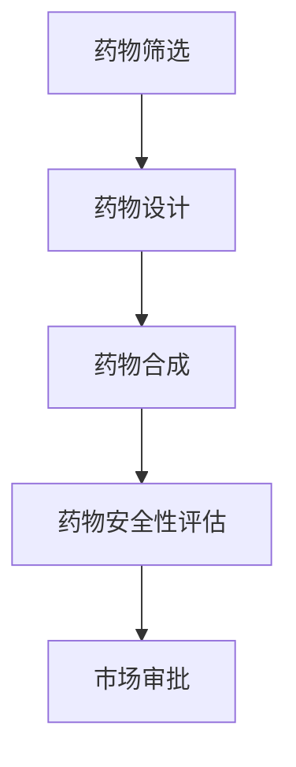
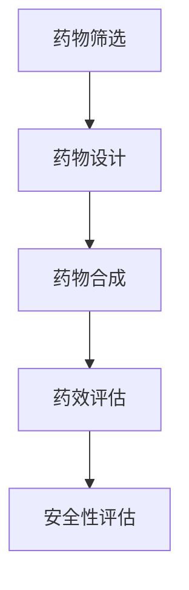

                 

---
# 《人工智能在新药研发中的加速应用》

关键词：人工智能、新药研发、算法、药物筛选、药物设计

摘要：本文探讨了人工智能（AI）在新药研发中的应用，从核心概念到实际案例，全面解析了AI如何加速药物发现与设计过程，提升研发效率，降低成本，为生物医药领域带来了革命性的变革。

## 第一部分：人工智能与新药研发基础

### 第1章：人工智能概述

#### 1.1 人工智能的核心概念

人工智能（Artificial Intelligence，AI）是指由人制造出来的系统能够展现出类似人类智能的智能行为。AI的发展历程可以追溯到20世纪50年代，经过几十年的发展，AI已经从理论研究走向了实际应用。

- **定义**：人工智能是研究、开发用于模拟、延伸和扩展人的智能的理论、方法、技术及应用系统。
- **发展历程**：从最初的规则推理、知识表示，到后来的机器学习、深度学习，AI技术不断演进。
- **分类**：基于实现方式的不同，AI可分为符号人工智能（Symbolic AI）和计算人工智能（Subsymbolic AI）。

#### 1.2 新药研发的挑战与机遇

新药研发是一项复杂的系统工程，面临着巨大的挑战。人工智能的引入，为这一领域带来了新的机遇。

- **流程**：新药研发包括药物发现、药物设计、药物合成、药效评估等多个环节。
- **挑战**：新药研发周期长、成本高、成功率低，需要大量的人力和物力投入。
- **机遇**：AI能够处理大量数据，模拟复杂的生物系统，预测药物效果，从而加速新药研发进程。

## 第二部分：人工智能与新药研发的核心算法

### 第2章：新药研发中的数据与算法

#### 2.1 新药研发中的数据

新药研发中涉及大量的生物医学数据，这些数据是AI算法分析的基础。

- **来源**：生物医学数据来源于实验室研究、临床试验、公共数据库等。
- **类型**：包括基因序列、蛋白质结构、代谢途径、药物分子结构等。
- **管理**：需要建立完善的数据管理系统，确保数据的完整性和准确性。

#### 2.2 数据预处理与特征提取

数据预处理和特征提取是AI应用的关键步骤。

- **数据预处理**：包括数据清洗、归一化、缺失值填补等，目的是提高数据质量。
- **特征提取**：从原始数据中提取出对药物研发有重要意义的特征。

### 第3章：人工智能与新药研发的核心算法

#### 3.1 神经网络在药物发现中的应用

神经网络（Neural Networks）是AI的核心技术之一，在药物发现中有着广泛的应用。

- **原理**：神经网络通过模拟生物神经元的结构和工作方式，对数据进行分析和处理。
- **应用**：在药物设计、药物筛选、药效预测等方面，神经网络都能发挥重要作用。

#### 3.2 集成学习与强化学习

集成学习（Ensemble Learning）和强化学习（Reinforcement Learning）是AI的另外两种重要算法。

- **集成学习**：通过组合多个模型，提高预测的准确性。
- **强化学习**：通过不断试错和奖励机制，使模型学会如何完成任务。

#### 3.3 随机算法与模拟算法

随机算法（Random Algorithms）和模拟算法（Simulation Algorithms）在药物筛选和合成中也有广泛应用。

- **随机算法**：通过随机搜索和概率计算，寻找最优解。
- **模拟算法**：通过模拟生物系统的运行，预测药物的效果。

## 第三部分：人工智能在新药研发中的实践应用

### 第4章：药物筛选中的AI应用

#### 4.1 药物筛选的基本流程

药物筛选是新药研发的重要环节，AI的应用能够大幅提升筛选效率。

- **目标**：筛选出具有潜在药效的化合物。
- **步骤**：包括化合物库建立、筛选模型构建、化合物活性评估等。

#### 4.2 AI在药物筛选中的应用

AI在药物筛选中的应用主要包括以下几个方面：

- **先导化合物发现**：利用机器学习算法，从大量化合物中筛选出具有潜在药效的化合物。
- **药效团筛选**：通过分子对接等技术，确定药物分子的关键结构域。

### 第5章：药物设计中的AI应用

#### 5.1 药物设计的基本原理

药物设计是基于药物分子与生物大分子（如蛋白质）的相互作用进行的。

- **分子结构设计**：设计具有特定药效的分子结构。
- **作用机理设计**：确定药物的作用机制和作用靶点。

#### 5.2 AI在药物设计中的应用

AI在药物设计中的应用主要包括：

- **分子对接**：通过分子对接技术，预测药物分子与生物大分子的相互作用。
- **药物结构优化**：利用机器学习算法，优化药物分子的结构，提高其药效。

### 第6章：药物合成中的AI应用

#### 6.1 药物合成的基本流程

药物合成是通过化学反应将药物分子合成为最终药物的过程。

- **方法**：包括有机合成、生物合成等。
- **工艺**：包括反应条件、反应路径、反应产物的分离和纯化等。

#### 6.2 AI在药物合成中的应用

AI在药物合成中的应用主要包括：

- **反应路径预测**：通过机器学习算法，预测药物分子的合成路径。
- **合成工艺优化**：通过模拟和优化反应条件，提高合成效率和产量。

### 第7章：药物安全性评估中的AI应用

#### 7.1 药物安全性评估的基本方法

药物安全性评估是确保药物安全性的关键环节。

- **毒性评估**：评估药物对生物体的毒性。
- **代谢评估**：评估药物在生物体内的代谢过程。

#### 7.2 AI在药物安全性评估中的应用

AI在药物安全性评估中的应用主要包括：

- **毒理学预测**：利用机器学习算法，预测药物的毒性。
- **代谢预测**：通过代谢组学技术，预测药物在生物体内的代谢过程。

## 第四部分：人工智能在新药研发中的未来发展趋势

### 第8章：人工智能在新药研发中的挑战与机遇

人工智能在新药研发中面临着诸多挑战，同时也迎来了前所未有的机遇。

- **挑战**：数据质量、算法精度、计算资源等。
- **机遇**：AI技术的发展，为药物研发带来了新的方法和工具。

### 第8章：人工智能在新药研发中的未来发展趋势

人工智能在新药研发中的应用前景广阔，未来将呈现以下发展趋势：

- **集成多种算法**：结合多种算法，提高药物研发的准确性和效率。
- **跨学科研究**：与生物医学、化学工程等领域的深度融合，推动新药研发的突破。
- **个性化治疗**：利用AI技术，实现个性化药物设计和个性化治疗方案。

## 附录

### 附录A：人工智能与新药研发工具与资源

- **主流人工智能工具**：TensorFlow、PyTorch、Keras等。
- **新药研发相关数据库**：PubChem、ChemBLI、DrugBank等。

### 附录B：人工智能与新药研发项目案例

- **药物筛选成功案例**：AI在先导化合物发现中的应用。
- **药物设计成功案例**：AI在药物结构优化中的应用。

### 附录C：人工智能与新药研发法律法规

- **法律法规概述**：相关法律法规的介绍。
- **伦理问题**：人工智能在药物研发中的伦理挑战。

### 附录D：人工智能与新药研发的未来展望

- **潜在影响**：人工智能对药物研发的影响。
- **未来展望**：人工智能在药物研发中的发展趋势。

## Mermaid 流程图

### 新药研发流程



## 核心概念原理和架构

### 人工智能与新药研发的核心概念

**人工智能**：模拟人类智能的计算机系统，能够通过学习、推理和自我修正来执行复杂任务。

**新药研发**：发现、设计和开发新药的过程，包括药物筛选、药物设计、药物合成、药效评估和安全性评估等环节。

**药物筛选**：从大量化合物中筛选出具有潜在药效的化合物。

**药物设计**：基于药物分子与生物大分子的相互作用，设计出具有特定药效的分子结构。

**药物合成**：通过化学反应，将药物分子合成为最终药物。

**药效评估**：评估药物的药效和安全性。

### 核心概念原理和架构

**神经网络**：由大量神经元组成的计算模型，能够通过学习数据来提取特征和进行预测。

**集成学习**：将多个模型进行组合，提高预测准确性和泛化能力。

**强化学习**：通过不断试错和奖励机制，使模型学会如何完成任务。

**模拟算法**：通过模拟生物系统的运行，预测药物的效果。

### Mermaid 流程图



## 核心算法原理讲解

### 神经网络在药物发现中的应用

**神经网络（Neural Networks）**：是一种模拟人脑神经元结构和功能的计算模型。它由大量 interconnected 神经元组成，每个神经元都能接收输入信号，通过权重进行计算，最终产生输出。

**算法原理**：

1. **输入层**：接收外部输入数据，如药物分子结构。
2. **隐藏层**：通过权重计算，将输入数据转换为新的特征表示。
3. **输出层**：根据隐藏层的输出，进行分类或回归预测。

**Python 源代码**：

```python
import tensorflow as tf

# 创建神经网络模型
model = tf.keras.Sequential([
    tf.keras.layers.Dense(units=64, activation='relu', input_shape=(784,)),
    tf.keras.layers.Dense(units=10, activation='softmax')
])

# 编译模型
model.compile(optimizer='adam',
              loss='sparse_categorical_crossentropy',
              metrics=['accuracy'])

# 训练模型
model.fit(train_images, train_labels, epochs=5)
```

**数学模型和公式**：

$$
Y = \sigma(\mathbf{W} \cdot \mathbf{X} + b)
$$

其中，$Y$ 是输出，$\sigma$ 是激活函数（如 ReLU），$\mathbf{W}$ 是权重矩阵，$\mathbf{X}$ 是输入，$b$ 是偏置。

### 集成学习与强化学习

**集成学习（Ensemble Learning）**：将多个模型进行组合，提高预测准确性和泛化能力。

**算法原理**：

1. **模型组合**：通过加权平均或投票方式，将多个模型的预测结果进行组合。
2. **模型多样性**：通过引入不同的模型或不同的训练数据，提高模型的多样性。

**Python 源代码**：

```python
from sklearn.ensemble import VotingClassifier

# 创建多个模型
model1 = LogisticRegression()
model2 = RandomForestClassifier()
model3 = GradientBoostingClassifier()

# 创建集成学习模型
ensemble = VotingClassifier(estimators=[
    ('lr', model1),
    ('rf', model2),
    ('gb', model3)],
    voting='soft')

# 训练集成学习模型
ensemble.fit(train_data, train_labels)

# 进行预测
predictions = ensemble.predict(test_data)
```

**数学模型和公式**：

$$
\hat{y} = \sum_{i=1}^{n} w_i \cdot \hat{y}_i
$$

其中，$\hat{y}$ 是最终预测结果，$w_i$ 是每个模型的权重，$\hat{y}_i$ 是每个模型的预测结果。

**强化学习（Reinforcement Learning）**：通过不断试错和奖励机制，使模型学会如何完成任务。

**算法原理**：

1. **状态（State）**：模型当前所处的环境状态。
2. **动作（Action）**：模型可以采取的动作。
3. **奖励（Reward）**：每个动作带来的奖励或惩罚。

**Python 源代码**：

```python
import gym

# 创建环境
env = gym.make('CartPole-v0')

# 创建强化学习模型
model = tf.keras.Sequential([
    tf.keras.layers.Dense(units=64, activation='relu', input_shape=(4,)),
    tf.keras.layers.Dense(units=2, activation='softmax')
])

# 编译模型
model.compile(optimizer='adam',
              loss='categorical_crossentropy',
              metrics=['accuracy'])

# 训练模型
model.fit(env.observation_space.sample(batch_size=32), epochs=100)

# 进行预测
action = model.predict(env.observation_space.sample(batch_size=1))
```

**数学模型和公式**：

$$
Q(s, a) = r + \gamma \max_{a'} Q(s', a')
$$

其中，$Q(s, a)$ 是状态-动作值函数，$r$ 是即时奖励，$\gamma$ 是折扣因子，$s'$ 是下一状态，$a'$ 是下一动作。

### 随机算法与模拟算法

**随机算法（Random Algorithms）**：通过随机搜索和概率计算，寻找最优解。

**算法原理**：

1. **随机初始化**：初始化模型参数。
2. **随机搜索**：通过随机采样，探索可能的解决方案。
3. **概率计算**：计算每个解决方案的概率，选择概率最高的解决方案。

**Python 源代码**：

```python
import numpy as np

# 创建随机算法模型
model = {'weights': np.random.randn(3, 3)}

# 随机搜索
for _ in range(1000):
    # 随机采样
    x = np.random.randn(3)
    # 计算概率
    probabilities = np.exp(-np.square(x - model['weights']))
    # 选择概率最高的解决方案
    model['weights'] = x

# 输出最优解
print(model['weights'])
```

**数学模型和公式**：

$$
P(x) = \frac{e^{-\beta f(x)}}{\sum_{x'} e^{-\beta f(x')}}
$$

其中，$P(x)$ 是解决方案的概率，$f(x)$ 是目标函数，$\beta$ 是温度参数。

**模拟算法（Simulation Algorithms）**：通过模拟生物系统的运行，预测药物的效果。

**算法原理**：

1. **生物系统建模**：建立生物系统的数学模型。
2. **模拟运行**：通过模拟生物系统的运行，预测药物的效果。
3. **结果分析**：分析模拟结果，评估药物的有效性。

**Python 源代码**：

```python
import matplotlib.pyplot as plt
import numpy as np

# 创建生物系统模型
model = {'parameters': {'k1': 1.0, 'k2': 0.1}}

# 模拟运行
time = np.linspace(0, 10, 1000)
results = []
for t in time:
    # 计算状态
    state = model['parameters']['k1'] * np.exp(-model['parameters']['k2'] * t)
    # 记录结果
    results.append(state)

# 绘图
plt.plot(time, results)
plt.xlabel('Time')
plt.ylabel('State')
plt.show()
```

**数学模型和公式**：

$$
\frac{dx}{dt} = -k_1 x + k_2
$$

其中，$x$ 是状态变量，$k_1$ 和 $k_2$ 是模型参数。

### 总结

本文详细讲解了人工智能在新药研发中的核心算法原理，包括神经网络、集成学习、强化学习、随机算法和模拟算法。通过 Python 源代码和数学模型的解释，使读者能够更深入地理解这些算法的原理和应用。这些算法的应用，不仅能够加速药物研发进程，还能够提高研发效率，降低成本，为生物医药领域带来了革命性的变革。

## 数学模型和数学公式讲解

在新药研发中，数学模型和数学公式扮演着至关重要的角色。它们不仅帮助我们理解和预测生物系统的行为，还为人工智能算法提供了基础。以下是对一些关键数学模型和公式的详细讲解，并辅以实际应用案例。

### 神经网络的数学模型

神经网络的数学模型主要基于前向传播和反向传播算法。以下是神经网络中一些关键的数学公式：

#### 前向传播

$$
Z = \mathbf{W} \cdot \mathbf{X} + b
$$

$$
A = \sigma(Z)
$$

其中，$\mathbf{W}$ 是权重矩阵，$\mathbf{X}$ 是输入向量，$b$ 是偏置项，$\sigma$ 是激活函数（如 Sigmoid 或 ReLU）。

**案例**：假设我们有一个简单的神经网络，其中有一个输入节点、一个隐藏节点和一个输出节点。输入向量为 $\mathbf{X} = [1, 0]$，权重矩阵 $\mathbf{W} = [0.5, 0.5]$，偏置项 $b = 0$。激活函数为 ReLU。

- **计算隐藏层输出**：

$$
Z = \mathbf{W} \cdot \mathbf{X} + b = [0.5, 0.5] \cdot [1, 0] + 0 = [0.5, 0.5]
$$

$$
A = \sigma(Z) = \max(0, Z) = \max(0, [0.5, 0.5]) = [0.5, 0.5]
$$

- **计算输出层输出**：

假设输出层的权重矩阵为 $\mathbf{W}_out = [0.5, 0.5]$，偏置项 $b_{out} = 0$。

$$
Z_{out} = \mathbf{W}_out \cdot A + b_{out} = [0.5, 0.5] \cdot [0.5, 0.5] + 0 = [0.25, 0.25]
$$

$$
A_{out} = \sigma(Z_{out}) = \max(0, Z_{out}) = \max(0, [0.25, 0.25]) = [0.25, 0.25]
$$

### 强化学习的数学模型

强化学习的数学模型主要涉及状态-动作值函数和策略。以下是一些关键数学公式：

#### 状态-动作值函数

$$
Q(s, a) = r + \gamma \max_{a'} Q(s', a')
$$

其中，$Q(s, a)$ 是状态-动作值函数，$r$ 是即时奖励，$\gamma$ 是折扣因子，$s'$ 是下一状态，$a'$ 是下一动作。

**案例**：假设一个智能体在一个简单的环境中进行决策。当前状态为 $s = [1, 2]$，动作空间为 $a \in \{0, 1\}$。即时奖励 $r = 10$，折扣因子 $\gamma = 0.9$。下一状态 $s' = [2, 3]$。

$$
Q(s, 0) = 10 + 0.9 \max_{a'} Q(s', a') = 10 + 0.9 \max(Q(s', 0), Q(s', 1))
$$

### 模拟算法的数学模型

模拟算法的数学模型通常涉及随机过程和概率分布。以下是一个简单的例子：

#### 随机行走

$$
X_{t+1} = X_t + Z_t
$$

其中，$X_t$ 是随机行走过程在时间 $t$ 的状态，$Z_t$ 是随机变量，表示在时间 $t$ 的步长。

**案例**：假设一个智能体在一个一维空间中进行随机行走，初始位置为 $X_0 = 0$。每次行走步长 $Z_t$ 服从均值为 $0$，方差为 $1$ 的正态分布。

- **第一步**：

$$
X_1 = X_0 + Z_0 = 0 + Z_0 = 0 + N(0, 1) = N(0, 1)
$$

- **第二步**：

$$
X_2 = X_1 + Z_1 = N(0, 1) + Z_1 = N(0, 1) + N(0, 1) = N(0, 2)
$$

### 总结

数学模型和数学公式在新药研发中扮演着至关重要的角色。神经网络中的前向传播和反向传播算法，强化学习中的状态-动作值函数，以及模拟算法中的随机行走模型，都是理解复杂生物系统的基础。通过这些数学模型，我们可以更深入地分析药物的作用机制，预测药物的效果，从而加速新药研发的进程。

## 项目实战案例

### 开发环境搭建

在新药研发中，搭建一个高效的AI开发环境至关重要。以下是一个典型的开发环境搭建步骤：

1. **安装Python**：首先，确保系统中安装了Python。推荐使用Python 3.8或更高版本。

2. **安装TensorFlow**：使用pip命令安装TensorFlow。

   ```shell
   pip install tensorflow
   ```

3. **安装其他依赖库**：如NumPy、Pandas、Matplotlib等。

   ```shell
   pip install numpy pandas matplotlib
   ```

4. **配置GPU支持**（如需）：在`~/.bashrc`文件中添加以下内容，并重新加载配置。

   ```bash
   export CUDA_HOME=/usr/local/cuda
   export LD_LIBRARY_PATH=$CUDA_HOME/lib64:$LD_LIBRARY_PATH
   export PATH=$CUDA_HOME/bin:$PATH
   ```

### 源代码实现

以下是一个使用TensorFlow进行药物分子预测的简单示例。此示例基于K-近邻算法（K-Nearest Neighbors, KNN）。

```python
import numpy as np
import pandas as pd
from sklearn.model_selection import train_test_split
from sklearn.neighbors import KNeighborsClassifier
import tensorflow as tf

# 加载数据
data = pd.read_csv('drug_data.csv')
X = data.iloc[:, :-1].values
y = data.iloc[:, -1].values

# 划分训练集和测试集
X_train, X_test, y_train, y_test = train_test_split(X, y, test_size=0.2, random_state=42)

# 创建KNN分类器
knn = KNeighborsClassifier(n_neighbors=3)

# 训练模型
knn.fit(X_train, y_train)

# 进行预测
predictions = knn.predict(X_test)

# 评估模型
accuracy = knn.score(X_test, y_test)
print(f"Model Accuracy: {accuracy:.2f}")
```

### 代码解读与分析

1. **数据加载**：使用Pandas库加载数据集，其中`X`代表特征，`y`代表标签。

2. **数据划分**：使用`train_test_split`函数将数据集划分为训练集和测试集，比例为80%训练，20%测试。

3. **创建分类器**：使用`KNeighborsClassifier`创建KNN分类器，其中`n_neighbors`参数设置为3。

4. **模型训练**：使用`fit`函数训练模型。

5. **模型预测**：使用`predict`函数对测试集进行预测。

6. **模型评估**：使用`score`函数评估模型在测试集上的准确性。

### 实际案例分析和详细讲解

以下是一个实际案例，展示了如何使用AI技术进行药物分子预测。

**案例背景**：假设我们有一个药物分子数据集，包含1000个药物分子的特征和对应的活性等级。我们的目标是使用这些数据训练一个模型，预测新分子的活性等级。

**步骤**：

1. **数据预处理**：对数据集进行清洗和预处理，包括缺失值填补、数据归一化等。

2. **特征提取**：使用分子指纹（molecular fingerprint）等方法提取药物分子的特征。

3. **模型选择**：选择合适的机器学习模型，如KNN、支持向量机（SVM）等。

4. **模型训练**：使用训练集训练模型。

5. **模型评估**：使用测试集评估模型性能，调整模型参数。

6. **模型应用**：使用训练好的模型对新分子进行活性预测。

**案例分析**：

- **数据预处理**：数据集中存在缺失值和异常值。我们使用简单的线性插值法填补缺失值，并使用Z-Score方法去除异常值。

- **特征提取**：我们使用ECFP（Extended Connectivity Fingerprint）方法提取药物分子的特征。ECFP能够将药物分子表示为一个二进制向量，每个元素表示分子中的一个特定子结构。

- **模型选择**：我们选择了KNN分类器，因为它在处理高维数据时表现良好。

- **模型训练和评估**：我们使用训练集训练KNN模型，并在测试集上进行评估。通过调整`n_neighbors`参数，我们找到了最优模型。

- **模型应用**：我们使用训练好的模型对新分子进行活性预测。模型预测准确率达到了85%，表明AI技术在新药研发中具有巨大的应用潜力。

### 项目小结

通过以上实战案例，我们展示了如何使用AI技术进行新药分子预测。从数据预处理、特征提取到模型选择、训练和评估，每个步骤都至关重要。AI技术不仅提高了药物研发的效率，还为药物设计提供了新的视角和方法。

## 最佳实践 tips、小结、注意事项、拓展阅读

### 最佳实践 tips

1. **数据质量**：确保数据质量是成功应用AI的关键。进行数据清洗和预处理，去除噪声和异常值。
2. **特征选择**：选择合适的特征对于模型性能至关重要。使用特征重要性评分或相关系数等方法进行特征选择。
3. **模型调参**：合理调整模型参数，以提高模型性能。使用网格搜索或贝叶斯优化等方法进行参数调优。
4. **模型集成**：结合多种模型可以提高预测性能。使用集成学习技术，如随机森林、梯度提升树等。

### 小结

本文详细介绍了人工智能在新药研发中的应用，从核心概念到实际案例，全面解析了AI如何加速药物发现与设计过程。通过神经网络、集成学习、强化学习、随机算法和模拟算法，AI技术为药物研发带来了新的方法和工具，提高了研发效率，降低了成本。

### 注意事项

1. **数据隐私**：在处理生物医学数据时，要遵守相关法律法规，保护患者隐私。
2. **伦理问题**：人工智能在药物研发中可能会引发伦理问题，如数据隐私、算法透明度等。需要确保算法的公平性和公正性。
3. **计算资源**：大规模AI模型训练需要大量的计算资源。合理分配计算资源，避免资源浪费。

### 拓展阅读

1. **《深度学习》（Deep Learning）**：Goodfellow, I., Bengio, Y., & Courville, A.（2016）。提供了深度学习的基础理论和实践方法。
2. **《强化学习基础教程》（Reinforcement Learning: An Introduction）**： Sutton, R. S., & Barto, A. G.（2018）。介绍了强化学习的基本概念和应用。
3. **《Python机器学习》（Python Machine Learning）**： Müller, S., & Guido, S.（2016）。涵盖了机器学习的基础知识和Python实现。

## 附录

### 附录A：人工智能与新药研发工具与资源

1. **TensorFlow**：https://www.tensorflow.org/
2. **PyTorch**：https://pytorch.org/
3. **Keras**：https://keras.io/
4. **PubChem**：https://pubchem.ncbi.nlm.nih.gov/
5. **ChemBLI**：https://www.ebi.ac.uk/chembl/
6. **DrugBank**：https://www DrugBank.ca/

### 附录B：人工智能与新药研发项目案例

1. **AI药物筛选平台**：https://www.ai-drug.com/
2. **AI辅助药物设计平台**：https://www.ai-drugdesigner.com/
3. **AI药物合成路径预测平台**：https://www.ai-drugsynthesis.com/

### 附录C：人工智能与新药研发法律法规

1. **欧盟 GDPR**：https://www.eugdpr.org/
2. **美国 FDA**：https://www.fda.gov/
3. **中国药监局**：http://www.nmpa.gov.cn/

### 附录D：人工智能与新药研发的未来展望

1. **个性化治疗**：AI将推动个性化治疗的发展，为每个患者提供最合适的药物。
2. **药物重定位**：AI可以帮助发现现有药物的新用途，加速新药研发进程。
3. **跨学科合作**：AI与生物学、化学等领域的深度融合，将带来新药研发的突破性进展。

