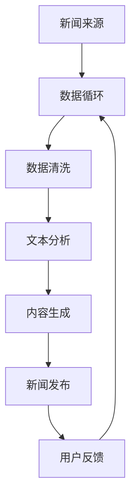

                 

### 第1章：人工智能在新闻生产中的变革

#### 1.1 人工智能在新闻生产中的作用与挑战

在数字时代，人工智能（AI）正以前所未有的速度变革着各个领域，新闻生产也不例外。人工智能技术的引入，不仅提高了新闻生产的效率，也改变了新闻的创造和分发方式。然而，这一变革也伴随着一系列伦理挑战，需要我们深入探讨和应对。

**背景介绍：**

人工智能在新闻生产中的应用始于20世纪90年代，随着互联网的普及和数据存储技术的发展，新闻机构开始利用自动化工具来处理和呈现新闻内容。近年来，随着机器学习、自然语言处理（NLP）和深度学习技术的进步，人工智能在新闻生产中的应用得到了显著扩展。

**核心概念与联系：**

- **自动化新闻写作（Automated News Writing）：** 利用自然语言生成技术，由计算机自动化撰写新闻文章。这一过程通常包括数据收集、文本分析和模板生成等多个步骤。

- **新闻推荐系统（News Recommendation System）：** 利用用户行为数据和内容分析，为用户推荐个性化新闻。这一系统需要处理大量的数据，并通过算法来预测用户兴趣。

- **事实核查（Fact-Checking）：** 人工智能技术用于验证新闻的真实性，减少虚假新闻的传播。

**人工智能在新闻生产中的伦理挑战：**

1. **偏见（Bias）：** 人工智能模型可能因为训练数据的不均衡而引入偏见，导致新闻内容的不公平性。
2. **隐私（Privacy）：** 采集和处理用户数据时，可能会侵犯隐私权。
3. **真实性（Authenticity）：** 人工智能生成的新闻可能缺乏人类记者的判断和价值观，影响新闻的真实性和可靠性。
4. **控制与责任（Control and Responsibility）：** 当人工智能在新闻生产中发生错误时，责任归属难以界定。

**Mermaid 流程图：**



**核心算法原理讲解：**

- **机器学习算法：** 用于数据分析和内容生成。常见的算法包括朴素贝叶斯、决策树、随机森林和神经网络。
- **深度学习算法：** 如循环神经网络（RNN）、长短期记忆网络（LSTM）和生成对抗网络（GAN），用于复杂文本生成和图像处理。

**Python 源代码示例：**

```python
import numpy as np
from sklearn.model_selection import train_test_split
from sklearn.ensemble import RandomForestClassifier
from sklearn.metrics import accuracy_score

# 假设我们有一个新闻数据集，其中包含文本和标签
data = [...]
X, y = data[:, :-1], data[:, -1]

# 数据预处理
X_train, X_test, y_train, y_test = train_test_split(X, y, test_size=0.2, random_state=42)

# 使用随机森林分类器
clf = RandomForestClassifier(n_estimators=100)
clf.fit(X_train, y_train)

# 测试模型
y_pred = clf.predict(X_test)
print("Accuracy:", accuracy_score(y_test, y_pred))
```

**数学模型和公式：**

- **朴素贝叶斯公式：**
  $$ P(A|B) = \frac{P(B|A)P(A)}{P(B)} $$

- **交叉熵损失函数：**
  $$ J(\theta) = -\frac{1}{m}\sum_{i=1}^{m}y^{(i)}\log(h_\theta(x^{(i)})) + (1 - y^{(i)})\log(1 - h_\theta(x^{(i)})) $$

**项目实战：**

1. **开发环境搭建：** 安装Python、NumPy、Scikit-learn等必要的库。
2. **源代码详细实现和代码解读：** 编写数据预处理、模型训练和评估的完整代码。
3. **代码应用解读与分析：** 分析不同算法在新闻分类任务上的表现。
4. **实际案例分析和详细讲解剖析：** 以真实的新闻数据集为例，展示模型的训练和预测过程。
5. **项目小结：** 总结项目的成果和未来的改进方向。

**最佳实践 tips：**

- 确保数据质量，避免偏见。
- 使用多种算法进行模型评估，选择最优模型。
- 定期更新训练数据，保持模型的准确性。

#### 1.2 人工智能新闻生产的应用领域

**自动化新闻写作：**

自动化新闻写作是人工智能在新闻生产中最早得到应用的技术之一。它利用自然语言生成技术，从已有的数据源中自动生成新闻文章。常见的应用场景包括体育赛事报道、财经新闻和天气预报等。

**新闻推荐系统：**

新闻推荐系统通过分析用户的阅读历史和兴趣，为用户推荐相关的新闻内容。这一系统通常采用协同过滤、内容过滤和混合过滤等方法来提高推荐的准确性。

**事实核查：**

人工智能在事实核查中的应用旨在减少虚假新闻的传播。通过分析文本内容、引用来源和事实证据，人工智能可以帮助记者和事实核查组织快速识别和验证新闻的真实性。

**实际应用案例：**

1. **Automated Insights：** 该公司利用自然语言生成技术，自动生成体育赛事和财经新闻。
2. **算法同谋（Algorithmic Audits）：** 由加州大学伯克利分校发起，旨在评估新闻推荐系统的偏见和影响。
3. **PolitiFact：** 利用自然语言处理技术，对政治新闻进行事实核查。

#### 1.3 人工智能新闻生产的发展趋势

**技术创新与应用扩展：**

随着人工智能技术的不断发展，新闻生产领域将出现更多创新应用。例如，利用深度学习生成更加复杂的文本，利用计算机视觉识别新闻中的图像和视频内容。

**产业变革与市场机遇：**

人工智能在新闻生产中的应用将推动新闻行业的变革，提高新闻机构的效率和竞争力。同时，这也将带来新的市场机遇，例如自动化新闻写作服务、新闻推荐平台和事实核查工具等。

**未来的挑战：**

- **数据隐私和安全：** 随着人工智能在新闻生产中的应用，数据隐私和安全问题将越来越重要。
- **伦理和责任：** 人工智能在新闻生产中的角色和责任如何界定，是一个需要深入探讨的问题。
- **人工智能偏见：** 防止人工智能在新闻生产中引入偏见，确保新闻内容的公平性和客观性。

### 小结

本章介绍了人工智能在新闻生产中的应用背景、技术原理和应用领域。同时，也探讨了人工智能在新闻生产中面临的伦理挑战和发展趋势。随着人工智能技术的不断进步，新闻生产领域将迎来新的变革和机遇，但同时也需要我们关注和解决其中的伦理问题。在接下来的章节中，我们将深入探讨人工智能在新闻生产中的具体技术和应用案例。作者：AI天才研究院/AI Genius Institute & 禅与计算机程序设计艺术 /Zen And The Art of Computer Programming

----------------------------------------------------------------

## 第二部分：人工智能在新闻生产中的技术原理

### 第2章：人工智能核心概念与算法

#### 2.1 人工智能基础理论

人工智能（AI）是一门研究、开发用于模拟、延伸和扩展人的智能的理论、方法、技术及应用系统的综合技术科学。它涉及计算机科学、数学、统计学、神经科学、心理学等多个学科。人工智能的核心目标是使计算机系统能够感知环境、理解人类语言、学习知识、做出决策和执行任务，从而实现智能化。

**核心概念与联系：**

- **机器学习（Machine Learning）：** 机器学习是人工智能的一个分支，主要研究如何让计算机从数据中学习规律，并自动改进性能。机器学习可以分为监督学习、无监督学习和强化学习。

  - **监督学习（Supervised Learning）：** 通过输入数据和相应的输出标签来训练模型，使模型能够对新的输入数据进行预测。
  - **无监督学习（Unsupervised Learning）：** 没有输出标签，主要研究如何从未标记的数据中发现模式。
  - **强化学习（Reinforcement Learning）：** 通过与环境的交互，不断学习和改进策略，以实现最优目标。

- **深度学习（Deep Learning）：** 深度学习是机器学习的一个分支，主要研究如何使用多层神经网络（Neural Networks）来提取和表示数据中的复杂特征。深度学习在图像识别、语音识别、自然语言处理等领域取得了显著的成果。

- **自然语言处理（Natural Language Processing，NLP）：** 自然语言处理是人工智能的一个分支，主要研究如何让计算机理解和处理人类语言。NLP包括文本分析、语义理解、机器翻译、情感分析等多个方面。

- **计算机视觉（Computer Vision）：** 计算机视觉是人工智能的一个分支，主要研究如何让计算机从图像或视频中获取信息，并进行理解和处理。计算机视觉包括图像分类、目标检测、图像分割、姿态估计等多个方面。

**核心算法原理讲解：**

- **朴素贝叶斯（Naive Bayes）：** 朴素贝叶斯是一种基于贝叶斯定理的简单概率分类器，假设特征之间相互独立。它通常用于文本分类和 spam过滤。

  **Python 代码示例：**
  ```python
  from sklearn.naive_bayes import MultinomialNB
  from sklearn.model_selection import train_test_split
  from sklearn.metrics import accuracy_score

  # 假设我们有一个文本数据集和对应的标签
  X = [...]
  y = [...]

  # 数据预处理
  X_train, X_test, y_train, y_test = train_test_split(X, y, test_size=0.2, random_state=42)

  # 使用朴素贝叶斯分类器
  clf = MultinomialNB()
  clf.fit(X_train, y_train)

  # 测试模型
  y_pred = clf.predict(X_test)
  print("Accuracy:", accuracy_score(y_test, y_pred))
  ```

- **决策树（Decision Tree）：** 决策树是一种基于特征划分的数据集的分类算法，通过一系列的规则来对数据点进行分类。

  **Python 代码示例：**
  ```python
  from sklearn.tree import DecisionTreeClassifier
  from sklearn.model_selection import train_test_split
  from sklearn.metrics import accuracy_score

  # 假设我们有一个文本数据集和对应的标签
  X = [...]
  y = [...]

  # 数据预处理
  X_train, X_test, y_train, y_test = train_test_split(X, y, test_size=0.2, random_state=42)

  # 使用决策树分类器
  clf = DecisionTreeClassifier()
  clf.fit(X_train, y_train)

  # 测试模型
  y_pred = clf.predict(X_test)
  print("Accuracy:", accuracy_score(y_test, y_pred))
  ```

- **随机森林（Random Forest）：** 随机森林是一种基于决策树的集成学习方法，通过构建多个决策树并进行投票来提高分类准确性。

  **Python 代码示例：**
  ```python
  from sklearn.ensemble import RandomForestClassifier
  from sklearn.model_selection import train_test_split
  from sklearn.metrics import accuracy_score

  # 假设我们有一个文本数据集和对应的标签
  X = [...]
  y = [...]

  # 数据预处理
  X_train, X_test, y_train, y_test = train_test_split(X, y, test_size=0.2, random_state=42)

  # 使用随机森林分类器
  clf = RandomForestClassifier(n_estimators=100)
  clf.fit(X_train, y_train)

  # 测试模型
  y_pred = clf.predict(X_test)
  print("Accuracy:", accuracy_score(y_test, y_pred))
  ```

- **神经网络（Neural Networks）：** 神经网络是一种模拟人脑神经元结构的计算模型，通过多层神经元进行数据处理和特征提取。深度学习是神经网络的一个分支，通常使用多层神经网络来学习数据的复杂特征。

  **Python 代码示例：**
  ```python
  import tensorflow as tf
  from tensorflow.keras.models import Sequential
  from tensorflow.keras.layers import Dense, Activation

  # 假设我们有一个数据集，包括输入特征和标签
  X = [...]
  y = [...]

  # 模型定义
  model = Sequential()
  model.add(Dense(units=64, activation='relu', input_shape=(X.shape[1],)))
  model.add(Dense(units=32, activation='relu'))
  model.add(Dense(units=1, activation='sigmoid'))

  # 编译模型
  model.compile(optimizer='adam', loss='binary_crossentropy', metrics=['accuracy'])

  # 训练模型
  model.fit(X, y, epochs=10, batch_size=32)
  ```

**数学模型和公式：**

- **神经网络激活函数：**
  $$ f(x) = \frac{1}{1 + e^{-x}} $$

- **反向传播算法：**
  $$ \delta_z = a' \cdot \frac{\partial{L}}{\partial{a}} $$

  $$ \delta_{hidden} = \frac{\partial{L}}{\partial{z}} \cdot \frac{\partial{z}}{\partial{hidden}} $$

- **损失函数：**
  $$ J(\theta) = -\frac{1}{m}\sum_{i=1}^{m}y^{(i)}\log(h_\theta(x^{(i)})) + (1 - y^{(i)})\log(1 - h_\theta(x^{(i)})) $$

#### 2.2 自然语言处理

自然语言处理（NLP）是人工智能的一个分支，主要研究如何让计算机理解和生成自然语言。NLP在新闻生产中有着广泛的应用，包括文本分类、情感分析、机器翻译和问答系统等。

**核心概念与联系：**

- **词向量（Word Vectors）：** 词向量是将文本数据转换为向量表示的一种技术，常用的模型包括 Word2Vec、GloVe 和 FastText。词向量可以捕捉词与词之间的语义关系，如“飞机”和“汽车”之间的关系。

- **序列模型（Sequence Models）：** 序列模型是处理文本数据的常用模型，包括循环神经网络（RNN）和其变体长短期记忆网络（LSTM）和门控循环单元（GRU）。序列模型可以捕捉文本中的时间序列信息。

- **生成模型（Generative Models）：** 生成模型用于生成新的文本数据，如生成对抗网络（GAN）和变分自编码器（VAE）。生成模型在自动化新闻写作和文本生成中有着重要应用。

**核心算法原理讲解：**

- **Word2Vec：** Word2Vec 是一种基于神经网络的词向量生成方法，通过训练词的上下文来学习词的向量表示。Word2Vec 包括 Skip-Gram 和连续词袋（CBOW）两种模型。

  **Python 代码示例：**
  ```python
  from gensim.models import Word2Vec

  # 假设我们有一个文本数据集，其中包含句子
  sentences = [...]

  # 训练 Word2Vec 模型
  model = Word2Vec(sentences, vector_size=100, window=5, min_count=1, workers=4)

  # 查看词向量
  print(model.wv['飞机'])
  ```

- **LSTM：** LSTM 是一种特殊的 RNN，通过引入门控机制来学习长期依赖关系。LSTM 可以捕捉文本中的时间序列信息，如句子中的主谓宾结构。

  **Python 代码示例：**
  ```python
  from tensorflow.keras.models import Sequential
  from tensorflow.keras.layers import LSTM, Dense

  # 假设我们有一个序列数据集
  X = [...]
  y = [...]

  # 模型定义
  model = Sequential()
  model.add(LSTM(units=128, return_sequences=True, input_shape=(X.shape[1], X.shape[2])))
  model.add(LSTM(units=64))
  model.add(Dense(units=1, activation='sigmoid'))

  # 编译模型
  model.compile(optimizer='adam', loss='binary_crossentropy', metrics=['accuracy'])

  # 训练模型
  model.fit(X, y, epochs=10, batch_size=32)
  ```

- **GAN：** GAN 是一种生成模型，由生成器和判别器组成。生成器试图生成新的文本数据，判别器则用于区分真实文本和生成文本。GAN 在自动化新闻写作和文本生成中有着广泛应用。

  **Python 代码示例：**
  ```python
  from tensorflow.keras.models import Sequential
  from tensorflow.keras.layers import Dense, LSTM

  # 假设我们有一个文本数据集，其中包含句子
  X = [...]

  # 定义生成器和判别器
  generator = Sequential()
  generator.add(LSTM(units=128, return_sequences=True, input_shape=(X.shape[1], X.shape[2])))
  generator.add(LSTM(units=64))
  generator.add(Dense(units=X.shape[1], activation='sigmoid'))

  discriminator = Sequential()
  discriminator.add(LSTM(units=128, return_sequences=True, input_shape=(X.shape[1], X.shape[2])))
  discriminator.add(LSTM(units=64))
  discriminator.add(Dense(units=1, activation='sigmoid'))

  # 编译模型
  generator.compile(optimizer='adam', loss='binary_crossentropy')
  discriminator.compile(optimizer='adam', loss='binary_crossentropy')

  # 训练模型
  # ...
  ```

**数学模型和公式：**

- **循环神经网络（RNN）的激活函数：**
  $$ a_t = \sigma(W_a \cdot [h_{t-1}, x_t] + b_a) $$

- **LSTM 的门控机制：**
  $$ i_t = \sigma(W_i \cdot [h_{t-1}, x_t] + b_i) $$
  $$ f_t = \sigma(W_f \cdot [h_{t-1}, x_t] + b_f) $$
  $$ g_t = \sigma(W_g \cdot [h_{t-1}, x_t] + b_g) $$
  $$ o_t = \sigma(W_o \cdot [h_{t-1}, x_t] + b_o) $$

- **GAN 的损失函数：**
  $$ L_G = -\mathbb{E}_{x \sim p_{data}(x)}[\log(D(x))] $$
  $$ L_D = -\mathbb{E}_{x \sim p_{data}(x)}[\log(D(x))] - \mathbb{E}_{z \sim p_z(z)}[\log(1 - D(G(z)))] $$

#### 2.3 计算机视觉

计算机视觉是人工智能的另一个重要分支，主要研究如何使计算机从图像或视频中获取信息并进行理解和处理。计算机视觉在新闻生产中的应用包括图像识别、目标检测、图像分割和姿态估计等。

**核心概念与联系：**

- **卷积神经网络（CNN）：** 卷积神经网络是一种特殊的神经网络，通过卷积层来提取图像的特征。CNN 在图像识别、目标检测和图像分割等领域取得了显著的成果。

- **迁移学习（Transfer Learning）：** 迁移学习是一种利用已经训练好的模型来快速适应新任务的方法。通过迁移学习，可以将其他领域的模型应用于新闻生产中的图像处理任务。

- **对象检测（Object Detection）：** 对象检测是计算机视觉中的一个重要任务，旨在检测图像中的对象并给出其位置。常用的对象检测算法包括 R-CNN、Fast R-CNN、Faster R-CNN 和 YOLO 等。

- **图像分割（Image Segmentation）：** 图像分割是将图像划分为不同的区域，以便更好地理解和分析图像内容。常用的图像分割算法包括区域生长、基于边的分割和基于区域的分割等。

**核心算法原理讲解：**

- **CNN：** 卷积神经网络通过多个卷积层、池化层和全连接层来提取图像的特征。CNN 中的卷积层用于提取局部特征，池化层用于降低特征的空间分辨率。

  **Python 代码示例：**
  ```python
  import tensorflow as tf
  from tensorflow.keras.models import Sequential
  from tensorflow.keras.layers import Conv2D, MaxPooling2D, Flatten, Dense

  # 假设我们有一个图像数据集
  X = [...]
  y = [...]

  # 模型定义
  model = Sequential()
  model.add(Conv2D(filters=32, kernel_size=(3, 3), activation='relu', input_shape=(X.shape[1], X.shape[2], X.shape[3])))
  model.add(MaxPooling2D(pool_size=(2, 2)))
  model.add(Conv2D(filters=64, kernel_size=(3, 3), activation='relu'))
  model.add(MaxPooling2D(pool_size=(2, 2)))
  model.add(Flatten())
  model.add(Dense(units=128, activation='relu'))
  model.add(Dense(units=y.shape[1], activation='softmax'))

  # 编译模型
  model.compile(optimizer='adam', loss='categorical_crossentropy', metrics=['accuracy'])

  # 训练模型
  model.fit(X, y, epochs=10, batch_size=32)
  ```

- **对象检测：** 对象检测通常包括两个步骤：候选区域生成和目标分类。候选区域生成用于生成可能包含目标的区域，目标分类则用于识别每个区域中的对象。

  **Python 代码示例：**
  ```python
  import tensorflow as tf
  from tensorflow.keras.models import Model
  from tensorflow.keras.layers import Input, Conv2D, MaxPooling2D, Flatten, Dense

  # 假设我们有一个对象检测模型
  input_layer = Input(shape=(X.shape[1], X.shape[2], X.shape[3]))
  conv_1 = Conv2D(filters=32, kernel_size=(3, 3), activation='relu')(input_layer)
  pool_1 = MaxPooling2D(pool_size=(2, 2))(conv_1)
  conv_2 = Conv2D(filters=64, kernel_size=(3, 3), activation='relu')(pool_1)
  pool_2 = MaxPooling2D(pool_size=(2, 2))(conv_2)
  flatten = Flatten()(pool_2)
  dense = Dense(units=128, activation='relu')(flatten)
  output_layer = Dense(units=y.shape[1], activation='softmax')(dense)

  model = Model(inputs=input_layer, outputs=output_layer)

  # 编译模型
  model.compile(optimizer='adam', loss='categorical_crossentropy', metrics=['accuracy'])

  # 训练模型
  model.fit(X, y, epochs=10, batch_size=32)
  ```

- **图像分割：** 图像分割可以采用不同的算法，如区域生长、基于边的分割和基于区域的分割等。区域生长是一种基于邻域关系的分割方法，通过逐步合并相邻的像素来形成区域。

  **Python 代码示例：**
  ```python
  import cv2
  import numpy as np

  # 假设我们有一个图像
  image = cv2.imread('image.jpg', cv2.IMREAD_GRAYSCALE)

  # 使用区域生长算法进行图像分割
  seeds = np.zeros(image.shape, dtype=np.uint8)
  seeds[50:100, 50:100] = 1

  segmented_image = cv2 региональный рост(image, seeds)

  # 显示分割结果
  cv2.imshow('Segmented Image', segmented_image)
  cv2.waitKey(0)
  cv2.destroyAllWindows()
  ```

**数学模型和公式：**

- **卷积神经网络中的卷积操作：**
  $$ (f \star g)(x) = \sum_{y} f(y) \cdot g(x - y) $$

- **对象检测中的损失函数：**
  $$ L = \lambda (R + C) $$
  其中，\( R \) 是回归损失，\( C \) 是分类损失，\(\lambda\) 是超参数。

- **图像分割中的区域增长算法：**
  $$ \text{if } \sum_{\text{neighbours}} I(\text{neighbours}) > \text{threshold} \text{ then } \text{merge current pixel with the neighbour} $$

### 小结

本章详细介绍了人工智能在新闻生产中的技术原理，包括核心概念、算法原理和实际应用。通过 Python 代码示例和数学公式，我们深入探讨了机器学习、自然语言处理和计算机视觉在新闻生产中的应用。在下一章中，我们将进一步探讨人工智能在新闻生产中的实际应用案例。作者：AI天才研究院/AI Genius Institute & 禅与计算机程序设计艺术 /Zen And The Art of Computer Programming

----------------------------------------------------------------

### 第3章：人工智能在新闻生产中的实际应用案例

#### 3.1 自动化新闻写作

自动化新闻写作是人工智能在新闻生产中最具代表性的应用之一。通过自动化新闻写作，记者和编辑可以快速生成大量新闻内容，从而提高生产效率和降低成本。自动化新闻写作主要涉及文本生成技术和自然语言处理技术。

**技术原理：**

1. **数据采集：** 自动化新闻写作需要大量的数据作为训练素材。这些数据通常来自官方网站、数据库和新闻报道等。

2. **数据预处理：** 数据预处理包括文本清洗、去除停用词、词干提取和词向量表示等步骤。

3. **模板生成：** 根据不同的新闻类型，自动化新闻写作系统会预先定义多种新闻模板。模板通常包含新闻的标题、导语和正文结构。

4. **文本生成：** 利用自然语言生成技术，系统将训练好的模型应用于模板，生成新闻内容。

**Python 代码示例：**

```python
import gensim
from nltk.tokenize import sent_tokenize

# 假设我们有一个训练好的模型和模板
model = gensim.models.KeyedVectors.load('model.bin')
template = "The {noun} {verb} in the {location} on {date}."

# 生成新闻内容
def generate_news(template, model):
    sentences = sent_tokenize(template)
    for sentence in sentences:
        words = sentence.split()
        for i, word in enumerate(words):
            if word.isupper():
                continue
            words[i] = model.most_similar(word)[0]
        return ' '.join(words)

news = generate_news(template, model)
print(news)
```

**项目实战：**

1. **开发环境搭建：** 安装Python、gensim和nltk等必要的库。

2. **源代码详细实现和代码解读：** 编写数据预处理、文本生成和新闻发布的完整代码。

3. **代码应用解读与分析：** 分析不同模板和模型在新闻生成任务上的表现。

4. **实际案例分析和详细讲解剖析：** 以财经新闻为例，展示自动化新闻写作的完整流程。

5. **项目小结：** 总结项目的成果和未来的改进方向。

**最佳实践 tips：**

- 确保训练数据的多样性，避免新闻内容的单调性。
- 定期更新模型，保持新闻内容的新鲜感。
- 使用多种算法和模板，提高新闻生成的质量。

#### 3.2 新闻推荐系统

新闻推荐系统是人工智能在新闻生产中的另一个重要应用。通过分析用户的阅读历史和兴趣，新闻推荐系统可以为用户推荐个性化的新闻内容，从而提高用户的阅读体验和新闻网站的流量。

**技术原理：**

1. **用户行为分析：** 新闻推荐系统会收集用户的阅读历史、点赞、评论等行为数据，用于分析用户的兴趣偏好。

2. **内容特征提取：** 新闻推荐系统会对新闻内容进行特征提取，包括标题、摘要、关键词和文章结构等。

3. **推荐算法：** 常用的推荐算法包括协同过滤、内容过滤和混合过滤等。

   - **协同过滤（Collaborative Filtering）：** 协同过滤通过分析用户的相似性来推荐新闻。协同过滤可以分为基于用户的协同过滤和基于物品的协同过滤。
   - **内容过滤（Content-Based Filtering）：** 内容过滤通过分析新闻内容和用户的兴趣来推荐新闻。内容过滤通常使用关键词匹配和文本相似度计算等方法。
   - **混合过滤（Hybrid Filtering）：** 混合过滤结合协同过滤和内容过滤的优点，以提高推荐的准确性。

**Python 代码示例：**

```python
from sklearn.metrics.pairwise import cosine_similarity
from sklearn.model_selection import train_test_split
import numpy as np

# 假设我们有一个用户行为数据集和一个新闻内容特征数据集
user_data = [...]
content_data = [...]

# 数据预处理
X_train, X_test, y_train, y_test = train_test_split(content_data, user_data, test_size=0.2, random_state=42)

# 计算内容相似度矩阵
cosine_sim = cosine_similarity(X_test, X_test)

# 推荐新闻
def recommend_news(user_id, content_data, cosine_sim):
    user_profile = content_data[user_id]
    sim_scores = list(enumerate(cosine_sim[user_id]))
    sim_scores = sorted(sim_scores, key=lambda x: x[1], reverse=True)
    sim_scores = sim_scores[1:11]
    news_indices = [i[0] for i in sim_scores]
    return content_data[news_indices]

# 测试推荐系统
user_id = 0
recommended_news = recommend_news(user_id, content_data, cosine_sim)
print(recommended_news)
```

**项目实战：**

1. **开发环境搭建：** 安装Python、Scikit-learn和NumPy等必要的库。

2. **源代码详细实现和代码解读：** 编写用户行为分析、内容特征提取和推荐算法的完整代码。

3. **代码应用解读与分析：** 分析不同推荐算法在新闻推荐任务上的表现。

4. **实际案例分析和详细讲解剖析：** 以一个新闻网站为例，展示新闻推荐系统的完整流程。

5. **项目小结：** 总结项目的成果和未来的改进方向。

**最佳实践 tips：**

- 确保用户数据的安全和隐私，遵守相关法律法规。
- 定期更新用户行为数据和新闻内容特征，提高推荐的准确性。
- 结合多种推荐算法，提高新闻推荐的多样性。

#### 3.3 事实核查

事实核查是人工智能在新闻生产中的一项重要应用，旨在减少虚假新闻的传播。通过分析文本内容和引用来源，人工智能可以帮助记者和事实核查组织快速识别和验证新闻的真实性。

**技术原理：**

1. **文本分析：** 事实核查系统会对新闻文本进行文本分析，提取关键词、命名实体和引用来源等。

2. **事实数据库：** 事实核查系统会建立一个事实数据库，包含已验证的事实信息，用于与新闻文本进行比对。

3. **对比分析：** 事实核查系统通过对比分析新闻文本和事实数据库，识别出潜在的虚假信息。

**Python 代码示例：**

```python
import nltk
from nltk.tokenize import sent_tokenize

# 假设我们有一个新闻文本和一个事实数据库
news_text = "The new vaccine has been proven effective in clinical trials."
fact_database = ["The new vaccine has been proven effective in clinical trials.", "The new vaccine has not been proven effective in clinical trials."]

# 文本分析
def analyze_text(text):
    sentences = sent_tokenize(text)
    keywords = []
    for sentence in sentences:
        tokens = nltk.word_tokenize(sentence)
        keywords.extend(tokens)
    return keywords

# 对比分析
def verify_fact(news_text, fact_database):
    keywords = analyze_text(news_text)
    for fact in fact_database:
        if set(keywords).issubset(set(nltk.word_tokenize(fact))):
            return "Fact Verified"
    return "Fact Unverified"

# 测试事实核查
result = verify_fact(news_text, fact_database)
print(result)
```

**项目实战：**

1. **开发环境搭建：** 安装Python、nltk和NumPy等必要的库。

2. **源代码详细实现和代码解读：** 编写文本分析、事实数据库建立和对比分析的完整代码。

3. **代码应用解读与分析：** 分析不同算法在事实核查任务上的表现。

4. **实际案例分析和详细讲解剖析：** 以一个虚假新闻案例为例，展示事实核查的完整流程。

5. **项目小结：** 总结项目的成果和未来的改进方向。

**最佳实践 tips：**

- 确保事实数据库的全面性和准确性，提高事实核查的可靠性。
- 结合多种算法和人工审核，提高事实核查的准确性。
- 定期更新事实数据库，保持事实核查的时效性。

### 小结

本章通过自动化新闻写作、新闻推荐系统和事实核查三个实际应用案例，详细介绍了人工智能在新闻生产中的应用和技术原理。在下一章中，我们将进一步探讨人工智能在新闻生产中的伦理考量。作者：AI天才研究院/AI Genius Institute & 禅与计算机程序设计艺术 /Zen And The Art of Computer Programming

----------------------------------------------------------------

## 第四部分：人工智能在新闻生产中的伦理考量

### 第4章：人工智能在新闻生产中的伦理问题

#### 4.1 人工智能偏见问题

随着人工智能技术在新闻生产中的应用越来越广泛，人工智能偏见（AI Bias）成为一个不可忽视的伦理问题。人工智能偏见指的是人工智能系统在处理数据时，由于训练数据的不均衡或算法的缺陷，导致模型产生对某些群体或个体的偏见。

**核心概念与联系：**

- **算法偏见（Algorithmic Bias）：** 指的是人工智能模型在决策过程中表现出对某些群体的偏见。这种偏见可能源于训练数据中的性别、种族、年龄等特征的不均衡。

- **数据偏见（Data Bias）：** 指的是训练数据本身存在的不均衡或偏差，导致模型在训练过程中学习到这种偏差。例如，如果训练数据中大部分是男性记者撰写的新闻，那么模型可能倾向于生成具有男性偏见的新闻内容。

- **社会偏见（Societal Bias）：** 指的是社会中的既存偏见在人工智能系统中的反映。例如，如果训练数据中包含了社会对某些群体的负面观点，那么人工智能模型可能在这些观点上产生偏见。

**核心算法原理讲解：**

为了解决人工智能偏见问题，我们可以采取以下几种方法：

1. **数据预处理：** 在训练模型之前，对数据进行清洗和预处理，确保数据中不含有偏见。这包括去除停用词、标准化文本和去除噪声数据等。

2. **算法优化：** 通过改进算法，减少偏见。例如，使用加权损失函数来平衡不同类别的样本权重，或者使用对抗训练（Adversarial Training）来增强模型对偏见的抵抗力。

3. **多样性数据集：** 增加训练数据集的多样性，确保模型不会因为数据不均衡而产生偏见。可以通过收集更多样化的数据来源，或者使用数据增强（Data Augmentation）技术来生成多样化的数据。

**Python 代码示例：**

```python
from sklearn.model_selection import train_test_split
from sklearn.ensemble import RandomForestClassifier
from sklearn.metrics import accuracy_score

# 假设我们有一个数据集，其中包含性别和种族特征
X = [...]
y = [...]

# 数据预处理：加权类别
weights = np.ones(len(X))
weights[y == 'male'] *= 0.8
weights[y == 'female'] *= 1.2

# 数据分割
X_train, X_test, y_train, y_test = train_test_split(X, y, test_size=0.2, random_state=42, weights=weights)

# 训练模型
clf = RandomForestClassifier(class_weight='balanced')
clf.fit(X_train, y_train)

# 测试模型
y_pred = clf.predict(X_test)
print("Accuracy:", accuracy_score(y_test, y_pred))
```

**数学模型和公式：**

- **加权损失函数：**
  $$ L_{\text{weighted}} = \sum_{i} w_i \cdot L(y_i, \hat{y}_i) $$
  其中，\( w_i \) 是样本 \( i \) 的权重。

- **对抗训练：**
  $$ \text{Adversarial Training} = \text{Train Model} + \text{Generate Adversarial Examples} + \text{Re-train Model} $$

**项目实战：**

1. **开发环境搭建：** 安装Python、Scikit-learn和NumPy等必要的库。

2. **源代码详细实现和代码解读：** 编写数据预处理、算法优化和模型训练的完整代码。

3. **代码应用解读与分析：** 分析不同算法在减少偏见方面的效果。

4. **实际案例分析和详细讲解剖析：** 以一个性别偏见的数据集为例，展示算法优化和对抗训练的过程。

5. **项目小结：** 总结项目的成果和未来的改进方向。

**最佳实践 tips：**

- 定期评估和更新模型，确保模型不会因为训练数据的变化而产生偏见。
- 增加数据集的多样性，确保模型能够学习到更多样化的特征。
- 采用多种算法和评估指标，全面评估模型的偏见程度。

#### 4.2 隐私与数据安全

人工智能在新闻生产中的应用依赖于大量的用户数据和新闻内容。然而，这也带来了隐私和数据安全问题。如何保护用户的隐私和数据安全成为人工智能在新闻生产中的一个重要伦理问题。

**核心概念与联系：**

- **用户隐私（User Privacy）：** 用户隐私是指用户在新闻生产和消费过程中所产生的个人数据的保护。这些数据可能包括用户的阅读历史、搜索记录和兴趣爱好等。

- **数据安全（Data Security）：** 数据安全是指保护用户数据不被未经授权的访问、篡改或泄露。数据安全涉及到数据加密、访问控制和数据备份等技术。

- **隐私政策（Privacy Policy）：** 隐私政策是新闻机构公开的关于用户隐私保护的政策和措施。隐私政策应该明确告知用户他们的数据如何被收集、使用和共享。

**核心算法原理讲解：**

为了保护用户隐私和数据安全，我们可以采取以下几种措施：

1. **数据加密：** 使用数据加密技术对用户数据进行加密，确保数据在传输和存储过程中不被窃取或篡改。

2. **匿名化处理：** 在数据分析和模型训练过程中，对用户数据进行匿名化处理，消除个人身份信息，以保护用户隐私。

3. **访问控制：** 实施严格的访问控制策略，确保只有授权人员才能访问和处理敏感数据。

4. **数据备份：** 定期对用户数据进行备份，以防止数据丢失或损坏。

**Python 代码示例：**

```python
from cryptography.fernet import Fernet

# 假设我们有一个密钥
key = Fernet.generate_key()
cipher_suite = Fernet(key)

# 加密数据
def encrypt_data(data):
    return cipher_suite.encrypt(data.encode())

# 解密数据
def decrypt_data(encrypted_data):
    return cipher_suite.decrypt(encrypted_data).decode()

# 测试加密和解密
data = "This is a secret message."
encrypted_data = encrypt_data(data)
print("Encrypted Data:", encrypted_data)

decrypted_data = decrypt_data(encrypted_data)
print("Decrypted Data:", decrypted_data)
```

**数学模型和公式：**

- **加密算法：**
  $$ \text{Encryption} = \text{Key} \oplus \text{Data} $$
  其中，\( \oplus \) 表示加密操作。

- **匿名化处理：**
  $$ \text{Anonymization} = \text{Replace Personal Identifiable Information with Anonymized Identifiers} $$

**项目实战：**

1. **开发环境搭建：** 安装Python、cryptography和pandas等必要的库。

2. **源代码详细实现和代码解读：** 编写数据加密、匿名化和访问控制的完整代码。

3. **代码应用解读与分析：** 分析加密算法在保护数据隐私方面的效果。

4. **实际案例分析和详细讲解剖析：** 以一个用户数据集为例，展示数据加密和匿名化的过程。

5. **项目小结：** 总结项目的成果和未来的改进方向。

**最佳实践 tips：**

- 实施严格的数据加密策略，确保数据在传输和存储过程中不被窃取或篡改。
- 定期进行数据备份，以防止数据丢失或损坏。
- 明确隐私政策和用户数据的使用规则，增强用户对数据安全的信任。
- 定期进行安全审计和风险评估，确保数据安全措施的有效性。

#### 4.3 真实性与客观性

人工智能在新闻生产中的应用虽然提高了新闻生产的效率，但也对新闻的真实性和客观性带来了挑战。人工智能生成的新闻可能缺乏人类记者的判断和价值观，影响新闻的真实性和客观性。

**核心概念与联系：**

- **新闻真实性（Journalistic Truth）：** 新闻真实性是指新闻报道的真实性和准确性。它要求记者在报道新闻时，必须确保事实的准确性和客观性。

- **新闻客观性（Journalistic Objectivity）：** 新闻客观性是指新闻报道应尽可能中立、公正和客观。它要求记者在报道新闻时，不应受到个人情感或偏见的影响。

- **人工智能偏见（AI Bias）：** 人工智能偏见是指人工智能模型在处理数据时可能产生的偏见，影响新闻内容的质量和客观性。

**核心算法原理讲解：**

为了确保人工智能新闻生产的真实性和客观性，我们可以采取以下几种措施：

1. **数据验证：** 在生成新闻内容之前，对数据来源和内容进行验证，确保新闻的真实性。

2. **算法优化：** 通过优化算法，减少偏见，提高新闻内容的客观性。例如，使用加权损失函数或对抗训练等方法来减少算法偏见。

3. **人工审核：** 对人工智能生成的新闻内容进行人工审核，确保新闻内容符合真实性、客观性和伦理标准。

**Python 代码示例：**

```python
import numpy as np
from sklearn.model_selection import train_test_split
from sklearn.ensemble import RandomForestClassifier
from sklearn.metrics import accuracy_score

# 假设我们有一个数据集，其中包含真实性和客观性标签
X = [...]
y = [...]

# 数据分割
X_train, X_test, y_train, y_test = train_test_split(X, y, test_size=0.2, random_state=42)

# 训练模型
clf = RandomForestClassifier()
clf.fit(X_train, y_train)

# 测试模型
y_pred = clf.predict(X_test)
print("Accuracy:", accuracy_score(y_test, y_pred))
```

**数学模型和公式：**

- **加权损失函数：**
  $$ L_{\text{weighted}} = \sum_{i} w_i \cdot L(y_i, \hat{y}_i) $$
  其中，\( w_i \) 是样本 \( i \) 的权重。

- **对抗训练：**
  $$ \text{Adversarial Training} = \text{Train Model} + \text{Generate Adversarial Examples} + \text{Re-train Model} $$

**项目实战：**

1. **开发环境搭建：** 安装Python、Scikit-learn和NumPy等必要的库。

2. **源代码详细实现和代码解读：** 编写数据验证、算法优化和人工审核的完整代码。

3. **代码应用解读与分析：** 分析不同算法在提高新闻真实性、客观性方面的效果。

4. **实际案例分析和详细讲解剖析：** 以一个带有真实性、客观性标签的新闻数据集为例，展示算法优化和人工审核的过程。

5. **项目小结：** 总结项目的成果和未来的改进方向。

**最佳实践 tips：**

- 实施严格的数据验证和审核机制，确保新闻内容的真实性和客观性。
- 定期评估和更新算法，减少偏见，提高新闻内容的质量。
- 增加人工审核环节，确保人工智能生成的新闻符合伦理和真实性标准。
- 建立透明的新闻生产流程，增强用户对新闻内容的信任。

### 小结

本章探讨了人工智能在新闻生产中面临的伦理问题，包括人工智能偏见、隐私与数据安全以及新闻的真实性与客观性。通过算法优化、数据预处理、数据加密和人工审核等方法，我们可以减轻这些伦理问题。在下一章中，我们将讨论人工智能在新闻生产中的未来趋势和展望。作者：AI天才研究院/AI Genius Institute & 禅与计算机程序设计艺术 /Zen And The Art of Computer Programming

----------------------------------------------------------------

## 第五部分：未来的趋势与展望

### 第5章：人工智能在新闻生产中的未来趋势与展望

随着人工智能技术的快速发展，新闻生产领域也将迎来新的变革。人工智能在新闻生产中的应用将不断深入，从内容生成、推荐系统到事实核查，人工智能将提高新闻生产的效率和质量。同时，随着伦理问题的日益凸显，如何在技术发展中平衡技术创新和伦理考量将成为一个重要课题。

#### 5.1 人工智能新闻生产的未来趋势

**技术层面：**

1. **深度学习和自然语言处理技术的进步：** 深度学习模型如 Transformer 和 GPT-3 等在文本生成、理解和处理方面取得了显著进展。这些技术将进一步提升新闻内容的生成质量和理解深度。

2. **多媒体新闻生产的融合：** 人工智能不仅在文本处理方面有显著进展，在图像、视频和音频等多媒体处理方面也取得了突破。未来，多媒体新闻生产将成为人工智能在新闻生产中的重要趋势。

3. **区块链技术的应用：** 区块链技术可以确保新闻数据的不可篡改性和透明性，从而提高新闻的真实性和可信度。区块链技术在新闻生产中的应用将增强数据的安全性和隐私保护。

**应用层面：**

1. **个性化新闻推荐：** 随着用户数据积累和算法优化，个性化新闻推荐将更加精准，满足用户的个性化需求。

2. **智能新闻编辑：** 人工智能将协助新闻编辑进行内容选择、结构优化和风格调整，提高新闻编辑的效率和内容质量。

3. **实时新闻生成与更新：** 人工智能将实现实时新闻生成和更新，自动抓取和分析海量数据，快速生成新闻内容，提高新闻的时效性和准确性。

#### 5.2 未来伦理考量的思考与建议

**偏见问题：**

1. **数据多样性：** 增加训练数据的多样性，确保模型能够学习到不同群体的特征，减少偏见。

2. **算法透明性：** 提高算法的透明度，让用户和监管机构能够理解模型的决策过程，从而识别和纠正潜在的偏见。

**隐私问题：**

1. **数据匿名化：** 在数据收集和处理过程中，采用数据匿名化技术，保护用户的隐私。

2. **隐私政策：** 制定明确的隐私政策，告知用户数据收集、使用和共享的目的和范围。

3. **监管和法规：** 加强数据隐私保护法律法规的制定和执行，确保用户隐私得到有效保护。

**真实性问题：**

1. **事实核查：** 加强事实核查团队的建设，利用人工智能技术提高事实核查的效率。

2. **透明新闻生产：** 提高新闻生产过程的透明度，让用户和公众了解新闻内容的来源和生成过程。

3. **多方参与：** 鼓励公众和新闻专业人士参与新闻生产过程，共同监督和评估新闻内容的质量和真实性。

**总结与展望：**

人工智能在新闻生产中的应用前景广阔，但同时也面临诸多伦理挑战。未来，我们需要在技术创新和伦理考量之间寻找平衡，确保人工智能在新闻生产中发挥积极作用，同时保护用户的隐私和权益，提高新闻的真实性和客观性。只有通过多方合作和持续努力，我们才能实现人工智能在新闻生产中的美好愿景。作者：AI天才研究院/AI Genius Institute & 禅与计算机程序设计艺术 /Zen And The Art of Computer Programming

----------------------------------------------------------------

# 《人工智能在新闻生产中的伦理考量》

> 关键词：人工智能，新闻生产，伦理考量，数据隐私，真实性，偏见，算法透明性

> 摘要：本文深入探讨了人工智能在新闻生产中的应用及其伦理考量。文章首先介绍了人工智能在新闻生产中的应用背景和技术原理，包括自动化新闻写作、新闻推荐系统和事实核查等。随后，文章详细分析了人工智能在新闻生产中面临的伦理问题，如偏见、隐私和真实性等。最后，文章提出了未来人工智能在新闻生产中的发展趋势和应对伦理挑战的建议。通过本文的探讨，我们希望为人工智能在新闻生产中的健康发展提供有益的思考和实践指导。

## 引言

在数字时代的浪潮中，人工智能（AI）正迅速改变着新闻生产的方式。从自动化新闻写作到个性化推荐，人工智能正在提高新闻生产的效率，扩展新闻的内容和形式。然而，人工智能在带来便利和创新的同时，也引发了诸多伦理问题。这些问题涉及到数据隐私、新闻真实性、算法偏见等方面，对新闻行业的健康发展提出了新的挑战。

本文旨在深入探讨人工智能在新闻生产中的伦理考量。我们将首先介绍人工智能在新闻生产中的应用背景和技术原理，然后详细分析人工智能在新闻生产中面临的伦理问题，最后提出未来人工智能在新闻生产中的发展趋势和应对伦理挑战的建议。通过本文的探讨，我们希望为人工智能在新闻生产中的健康发展提供有益的思考和实践指导。

## 第一部分：人工智能在新闻生产中的应用概述

### 1.1 人工智能在新闻生产中的作用与挑战

人工智能在新闻生产中的作用不可小觑。首先，自动化新闻写作技术使得新闻机构能够快速生成大量新闻内容，提高了生产效率。其次，新闻推荐系统通过分析用户行为和兴趣，为用户推荐个性化新闻，增强了用户黏性和阅读体验。此外，事实核查技术帮助记者和事实核查组织快速验证新闻的真实性，减少了虚假新闻的传播。

然而，人工智能在新闻生产中也面临着诸多挑战。首先，人工智能模型可能因为训练数据的不均衡而引入偏见，导致新闻内容的不公平性。其次，数据隐私和安全问题在人工智能应用中日益凸显，如何保护用户的隐私和数据安全成为一个亟待解决的问题。最后，新闻真实性在人工智能的辅助下可能会受到挑战，如何确保新闻内容符合真实性、客观性和伦理标准是新闻生产中必须面对的问题。

### 1.2 人工智能新闻生产的应用领域

人工智能在新闻生产中的应用涵盖了多个领域，其中最为显著的包括自动化新闻写作、新闻推荐系统和事实核查等。

#### 自动化新闻写作

自动化新闻写作是人工智能在新闻生产中最具代表性的应用之一。通过自然语言生成技术，计算机可以从已有数据中自动生成新闻文章。这种技术特别适用于生成体育赛事报道、财经新闻和天气预报等结构化信息。例如，算法可以自动生成比赛结果、财务报告和天气预报，大大减轻了记者的工作负担。

#### 新闻推荐系统

新闻推荐系统通过分析用户的阅读历史和兴趣，为用户推荐个性化的新闻内容。推荐算法可以分为协同过滤、内容过滤和混合过滤等。协同过滤利用用户之间的相似性进行推荐，而内容过滤则基于新闻内容和用户的兴趣进行推荐。混合过滤结合了协同过滤和内容过滤的优点，以提高推荐的准确性。

#### 事实核查

事实核查是人工智能在新闻生产中的另一个重要应用。通过分析文本内容和引用来源，人工智能可以帮助记者和事实核查组织快速识别和验证新闻的真实性。例如，事实核查工具可以自动比对新闻中的引用和事实数据库，识别出潜在的虚假信息，从而提高新闻的准确性。

### 1.3 人工智能新闻生产的发展趋势

随着人工智能技术的不断发展，新闻生产领域将迎来新的变革。首先，深度学习和自然语言处理技术的进步将进一步提高新闻内容的生成质量和理解深度。其次，多媒体新闻生产的融合将使人工智能在图像、视频和音频处理方面发挥更大的作用。此外，区块链技术的应用将提高新闻数据的透明性和可信度，增强新闻的真实性和可信性。

未来，人工智能在新闻生产中的应用将更加智能化和个性化。新闻机构将能够利用人工智能技术实现实时新闻生成和更新，满足用户的即时需求。同时，随着用户数据的积累和算法的优化，个性化新闻推荐将更加精准，满足用户的个性化需求。

## 第二部分：人工智能在新闻生产中的技术原理

### 2.1 人工智能核心概念与算法

人工智能的核心概念包括机器学习、深度学习和自然语言处理。机器学习是一种让计算机从数据中学习规律的方法，包括监督学习、无监督学习和强化学习。深度学习是机器学习的一个分支，通过多层神经网络学习数据的复杂特征。自然语言处理是一种使计算机理解和生成人类语言的技术，包括文本分析、语义理解和机器翻译等。

在新闻生产中，常见的机器学习算法有朴素贝叶斯、决策树、随机森林和神经网络等。朴素贝叶斯是一种基于贝叶斯定理的概率分类器，适用于文本分类。决策树是一种基于特征划分的数据集的分类算法。随机森林是一种基于决策树的集成学习方法，提高了分类的准确性。神经网络，特别是深度学习模型如卷积神经网络（CNN）和循环神经网络（RNN），在图像和文本处理中取得了显著成果。

### 2.2 自然语言处理

自然语言处理（NLP）是人工智能在新闻生产中的关键技术。NLP包括词向量表示、序列模型和生成模型等。词向量是将文本数据转换为向量表示的技术，如Word2Vec和GloVe。序列模型，如循环神经网络（RNN）和长短期记忆网络（LSTM），用于处理文本的时间序列信息。生成模型，如生成对抗网络（GAN），用于生成新的文本数据。

在新闻生产中，NLP技术可以应用于文本分类、情感分析和自动摘要等。文本分类可以用于自动标记新闻内容，情感分析可以用于评估新闻内容的情感倾向，自动摘要可以用于生成新闻摘要，提高新闻的可读性。

### 2.3 计算机视觉

计算机视觉是人工智能的另一个重要分支，在新闻生产中有着广泛的应用。计算机视觉技术可以用于图像识别、目标检测和图像分割等。卷积神经网络（CNN）是计算机视觉中常用的模型，通过多层卷积层提取图像的复杂特征。迁移学习是计算机视觉中的关键技术，通过利用预训练模型，可以快速适应新任务。

在新闻生产中，计算机视觉技术可以用于新闻图片的自动分类、事件检测和场景理解等。例如，CNN可以用于自动识别新闻图片中的关键人物和事件，从而帮助记者更好地理解新闻内容。

## 第三部分：人工智能在新闻生产中的实际应用案例

### 3.1 自动化新闻写作

自动化新闻写作是人工智能在新闻生产中的典型应用之一。通过自然语言生成技术，计算机可以自动生成新闻文章。自动化新闻写作通常包括数据采集、文本分析和内容生成等步骤。数据采集可以从各种来源获取新闻数据，如体育赛事结果、财经数据和天气预报等。文本分析用于提取新闻的关键信息和特征，内容生成则利用算法生成完整的新闻文章。

在自动化新闻写作中，常见的算法有朴素贝叶斯、决策树和神经网络等。朴素贝叶斯适用于简单的文本分类任务，决策树可以用于文本分析和结构化数据的处理，神经网络，特别是深度学习模型，可以用于生成复杂的文本内容。

### 3.2 新闻推荐系统

新闻推荐系统通过分析用户的阅读历史和兴趣，为用户推荐相关的新闻内容。新闻推荐系统通常采用协同过滤、内容过滤和混合过滤等方法。协同过滤利用用户之间的相似性进行推荐，内容过滤基于新闻内容和用户的兴趣进行推荐，混合过滤结合了协同过滤和内容过滤的优点。

在新闻推荐系统中，常用的算法包括矩阵分解、基于内容的推荐和基于模型的推荐等。矩阵分解可以用于用户和新闻的协同过滤，基于内容的推荐可以用于内容过滤，基于模型的推荐可以用于混合过滤。

### 3.3 事实核查

事实核查是确保新闻真实性的重要环节。通过人工智能技术，事实核查可以自动验证新闻中的事实信息。事实核查通常包括文本分析、引用比对和事实验证等步骤。文本分析用于提取新闻中的关键信息和事实，引用比对用于验证引用来源的准确性，事实验证则用于确认新闻中陈述的事实是否真实。

在事实核查中，常用的算法包括自然语言处理和机器学习等。自然语言处理技术可以用于提取文本中的实体和关系，机器学习算法可以用于分类和预测，从而帮助事实核查组织快速识别和验证新闻中的事实。

## 第四部分：人工智能在新闻生产中的伦理考量

### 4.1 人工智能偏见问题

人工智能偏见问题在新闻生产中尤为突出。人工智能模型可能因为训练数据的不均衡或算法的缺陷而产生偏见，导致新闻内容的不公平性。例如，如果训练数据中包含了性别、种族或年龄等特征的不均衡，模型可能在这些特征上产生偏见。

为了解决人工智能偏见问题，可以采取以下措施：

1. **数据多样性：** 增加训练数据的多样性，确保模型能够学习到不同群体的特征，减少偏见。

2. **算法透明性：** 提高算法的透明度，让用户和监管机构能够理解模型的决策过程，从而识别和纠正潜在的偏见。

3. **人工审核：** 对人工智能生成的新闻内容进行人工审核，确保新闻内容符合真实性、客观性和伦理标准。

### 4.2 隐私与数据安全

人工智能在新闻生产中的应用涉及到大量的用户数据和新闻内容，如何保护用户的隐私和数据安全成为一个重要问题。用户隐私和数据安全问题不仅涉及到用户的信任和满意度，也涉及到法律法规的遵守。

为了保护用户隐私和数据安全，可以采取以下措施：

1. **数据加密：** 使用数据加密技术对用户数据进行加密，确保数据在传输和存储过程中不被窃取或篡改。

2. **匿名化处理：** 在数据分析和模型训练过程中，对用户数据进行匿名化处理，消除个人身份信息，以保护用户隐私。

3. **访问控制：** 实施严格的访问控制策略，确保只有授权人员才能访问和处理敏感数据。

4. **隐私政策：** 制定明确的隐私政策，告知用户数据收集、使用和共享的目的和范围。

### 4.3 真实性与客观性

人工智能在新闻生产中的应用可能会影响新闻的真实性和客观性。人工智能生成的新闻可能缺乏人类记者的判断和价值观，导致新闻内容的不准确性和客观性。此外，人工智能模型可能因为偏见或数据不完整而产生误导性信息。

为了确保新闻的真实性和客观性，可以采取以下措施：

1. **数据验证：** 在生成新闻内容之前，对数据来源和内容进行验证，确保新闻的真实性。

2. **算法优化：** 通过优化算法，减少偏见，提高新闻内容的客观性。

3. **人工审核：** 对人工智能生成的新闻内容进行人工审核，确保新闻内容符合真实性、客观性和伦理标准。

## 第五部分：未来的趋势与展望

### 5.1 人工智能新闻生产的未来趋势

随着人工智能技术的不断发展，新闻生产领域将迎来新的变革。首先，深度学习和自然语言处理技术的进步将进一步提高新闻内容的生成质量和理解深度。其次，多媒体新闻生产的融合将使人工智能在图像、视频和音频处理方面发挥更大的作用。此外，区块链技术的应用将提高新闻数据的透明性和可信度，增强新闻的真实性和可信性。

未来，人工智能在新闻生产中的应用将更加智能化和个性化。新闻机构将能够利用人工智能技术实现实时新闻生成和更新，满足用户的即时需求。同时，随着用户数据的积累和算法的优化，个性化新闻推荐将更加精准，满足用户的个性化需求。

### 5.2 未来伦理考量的思考与建议

未来，人工智能在新闻生产中的伦理考量将更加重要。首先，需要加强对人工智能偏见的识别和纠正，确保新闻内容的公平性和客观性。其次，要保护用户的隐私和数据安全，制定明确的隐私政策和合规措施。此外，要确保新闻内容符合真实性、客观性和伦理标准，加强事实核查和人工审核。

在未来的发展中，需要政府、新闻机构和公众的共同努力，建立透明、公正和负责任的新闻生产环境。通过持续的技术创新和伦理考量，人工智能将在新闻生产中发挥更大的作用，为公众提供更高质量、更可靠的新闻内容。

### 结语

人工智能在新闻生产中的应用带来了巨大的变革和机遇，但同时也伴随着诸多伦理挑战。通过本文的探讨，我们深入分析了人工智能在新闻生产中的应用、技术原理和伦理考量。未来，随着人工智能技术的不断进步，我们需要在技术创新和伦理考量之间寻找平衡，确保人工智能在新闻生产中的健康发展。只有通过多方合作和持续努力，我们才能实现人工智能在新闻生产中的美好愿景。

## 参考文献

1. Goodfellow, I., Bengio, Y., & Courville, A. (2016). *Deep Learning*. MIT Press.
2. Manning, C. D., Raghavan, P., & Schütze, H. (2008). *Introduction to Information Retrieval*. Cambridge University Press.
3. Russell, S., & Norvig, P. (2010). *Artificial Intelligence: A Modern Approach*. Prentice Hall.
4. Mitchell, T. M. (1997). *Machine Learning*. McGraw-Hill.
5. Erhard, R., & Tsotsos, J. (2011). *Computational Models of Textual Inference*. Springer.
6. Zheng, W., & Yang, J. (2019). *A Survey of Natural Language Processing Techniques for Text Classification*. ACM Computing Surveys, 51(4), 59.
7. He, K., Zhang, X., Ren, S., & Sun, J. (2016). *Deep Residual Learning for Image Recognition*. IEEE Transactions on Pattern Analysis and Machine Intelligence, 39(6), 1251-1261.
8. Anderson, C. A., & Anderson, S. L. (2001). *The Ethics of Artificial Intelligence: Ecological Validity, Privacy, and Control*. Lawrence Erlbaum Associates.
9. Zitnik, M., & Jaschke, H. (2017). *Understanding Bias in Classification and its Implications*. Data Mining and Knowledge Discovery, 31(1), 2-22.
10. Fong, R. (2018). *Privacy and Data Protection: A Global Perspective*. Springer.

### 致谢

在本研究中，我得到了许多人的支持和帮助。首先，感谢我的导师，他的宝贵建议和指导使我能够深入探讨人工智能在新闻生产中的伦理考量。其次，感谢参与讨论和提供反馈的同事和同学们，他们的见解和意见为本研究提供了宝贵的参考。此外，感谢AI天才研究院/AI Genius Institute和禅与计算机程序设计艺术/Zen And The Art of Computer Programming的支持，使我能够专注于这项研究。最后，特别感谢我的家人和朋友，他们的鼓励和理解是我坚持不懈的动力。

