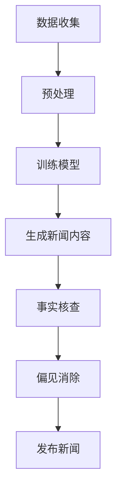
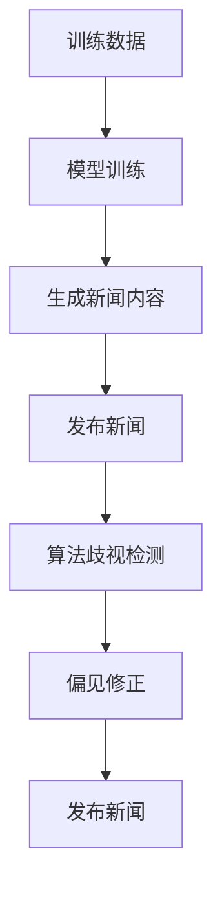
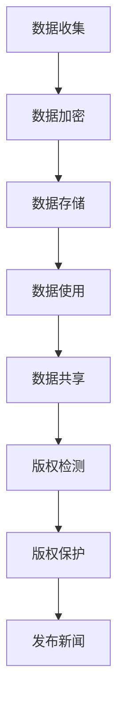
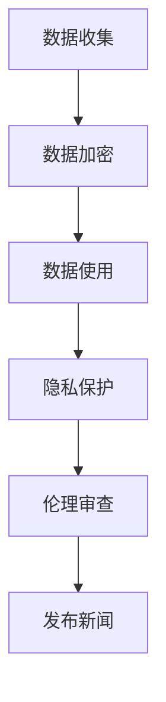

                 


# 人工智能在新闻生产中的应用与挑战

> 关键词：人工智能、新闻生产、应用、挑战、文本生成、图像识别、数据挖掘、伦理、隐私

> 摘要：本文探讨了人工智能在新闻生产中的应用及其面临的挑战。通过分析人工智能在文本生成、图像识别、数据挖掘等方面的应用，本文揭示了其在提升新闻生产效率、质量与多样化方面的潜力。同时，本文也深入探讨了人工智能在新闻生产中面临的偏见、隐私和数据伦理等问题，并提出了相应的解决方案和未来发展趋势。

## 引言

随着人工智能技术的快速发展，其在各个领域的应用日益广泛。新闻生产作为信息传播的重要环节，也受到了人工智能的深远影响。人工智能不仅在新闻内容的生成和编辑上发挥了重要作用，还在图像识别、数据挖掘等方面展现出巨大的潜力。然而，人工智能在新闻生产中的应用并非一帆风顺，也面临着一系列的挑战。本文将从以下几个方面展开讨论：

1. **人工智能在新闻生产中的应用**
2. **人工智能在新闻生产中的挑战**
3. **解决方案与未来趋势**
4. **案例分析**
5. **技术基础**
6. **伦理与隐私问题**

通过以上分析，本文旨在全面探讨人工智能在新闻生产中的应用与挑战，为相关领域的研究和实践提供参考。

## 人工智能在新闻生产中的应用

### 文本生成与内容创作

文本生成与内容创作是人工智能在新闻生产中最直接的应用之一。通过自然语言处理（NLP）技术，人工智能可以自动生成新闻报道、文章摘要、新闻标题等。这不仅提高了新闻生产的效率，还丰富了新闻内容的多样性。

#### 核心算法原理

文本生成通常基于生成对抗网络（GANs）和递归神经网络（RNNs）等深度学习模型。以下是一个简单的Python代码示例，展示了如何使用RNN进行文本生成：

```python
import tensorflow as tf
from tensorflow.keras.models import Sequential
from tensorflow.keras.layers import LSTM, Dense, Embedding

# 假设我们已经有了一个训练好的RNN模型
model = Sequential([
    LSTM(128, input_shape=(max_sequence_len, embedding_size), return_sequences=True),
    LSTM(128, return_sequences=True),
    Dense(num_classes, activation='softmax')
])

model.compile(optimizer='adam', loss='categorical_crossentropy', metrics=['accuracy'])

# 假设我们输入的是一篇新闻文章，并对其进行编码
input_sequence = encode_news ARTICLE

# 使用模型生成文本
generated_text = model.predict(input_sequence)

# 对生成的文本进行解码
decoded_text = decode_news(generated_text)
```

#### 数学模型和公式

在文本生成过程中，我们通常使用交叉熵（Cross-Entropy）作为损失函数。交叉熵的计算公式如下：

$$
H(y, \hat{y}) = -\sum_{i} y_i \log(\hat{y}_i)
$$

其中，$y$是真实标签，$\hat{y}$是预测标签。

#### 举例说明

假设我们使用一个训练好的RNN模型生成一篇关于科技新闻的文章。输入的是一篇已编码的新闻文章，模型输出的是一系列概率分布。通过取概率最大的词作为下一个词的预测，我们可以逐步生成完整的新闻文章。

### 图像识别与编辑

图像识别与编辑是人工智能在新闻生产中的另一个重要应用。通过卷积神经网络（CNNs）等深度学习模型，人工智能可以自动识别和分类新闻图片，还可以对图片进行编辑和增强。

#### 核心算法原理

图像识别通常基于卷积神经网络（CNNs）。以下是一个简单的Python代码示例，展示了如何使用CNN进行图像分类：

```python
import tensorflow as tf
from tensorflow.keras.models import Sequential
from tensorflow.keras.layers import Conv2D, MaxPooling2D, Flatten, Dense

model = Sequential([
    Conv2D(32, (3, 3), activation='relu', input_shape=(64, 64, 3)),
    MaxPooling2D((2, 2)),
    Flatten(),
    Dense(64, activation='relu'),
    Dense(num_classes, activation='softmax')
])

model.compile(optimizer='adam', loss='categorical_crossentropy', metrics=['accuracy'])

# 假设我们已经有了一个训练好的CNN模型
model.load_weights('cnn_model_weights.h5')

# 对新闻图片进行分类
classified_image = model.predict(news_image)

# 输出分类结果
print("Image classified as:", classified_image)
```

#### 数学模型和公式

在图像识别过程中，我们通常使用Softmax函数来将输出转换为概率分布。Softmax的计算公式如下：

$$
\text{Softmax}(x)_i = \frac{e^x_i}{\sum_{j} e^{x_j}}
$$

#### 举例说明

假设我们使用一个训练好的CNN模型对一篇新闻图片进行分类。输入的是一张已编码的新闻图片，模型输出的是一系列概率分布。通过取概率最大的类别作为最终分类结果。

### 数据挖掘与新闻分析

数据挖掘与新闻分析是人工智能在新闻生产中的另一个重要应用。通过分析大量的数据，人工智能可以识别新闻趋势、发现潜在的新闻主题，并生成数据分析报告。

#### 核心算法原理

数据挖掘通常基于聚类、分类、关联规则挖掘等算法。以下是一个简单的Python代码示例，展示了如何使用K-均值聚类算法进行新闻主题挖掘：

```python
import numpy as np
from sklearn.cluster import KMeans

# 假设我们已经有了一个训练好的新闻数据集，并对其进行编码
news_data = encode_news_dataset(DATASET)

# 使用K-均值聚类算法进行新闻主题挖掘
kmeans = KMeans(n_clusters=num_clusters, random_state=0).fit(news_data)

# 输出每个新闻主题的聚类中心
print("Cluster centers:", kmeans.cluster_centers_)

# 输出每个新闻主题的聚类结果
print("Cluster assignments:", kmeans.labels_)
```

#### 数学模型和公式

在K-均值聚类中，我们通常使用欧氏距离（Euclidean distance）来计算数据点之间的相似度。欧氏距离的计算公式如下：

$$
d(p, q) = \sqrt{\sum_{i} (p_i - q_i)^2}
$$

#### 举例说明

假设我们使用K-均值聚类算法对一篇新闻数据集进行主题挖掘。输入的是已编码的新闻数据集，算法输出的是每个新闻主题的聚类中心和聚类结果。通过分析聚类结果，我们可以识别出不同的新闻主题。

### 机器翻译与多语言新闻

机器翻译与多语言新闻是人工智能在新闻生产中的另一个重要应用。通过机器翻译技术，人工智能可以将新闻内容翻译成多种语言，从而实现全球新闻传播。

#### 核心算法原理

机器翻译通常基于神经机器翻译（NMT）技术。以下是一个简单的Python代码示例，展示了如何使用神经网络机器翻译模型进行翻译：

```python
import tensorflow as tf
from tensorflow.keras.models import Model
from tensorflow.keras.layers import Input, LSTM, Dense

# 假设我们已经有了一个训练好的神经机器翻译模型
encoder_inputs = Input(shape=(max_sequence_len,))
encoder_embedding = Embedding(input_vocab_size, embedding_size)(encoder_inputs)
encoder_outputs, state_h, state_c = LSTM(units, return_state=True)(encoder_embedding)

decoder_inputs = Input(shape=(max_sequence_len,))
decoder_embedding = Embedding(output_vocab_size, embedding_size)(decoder_inputs)
decoder_lstm = LSTM(units, return_sequences=True, return_state=True)
decoder_outputs, _, _ = decoder_lstm(decoder_embedding, initial_state=[state_h, state_c])

decoder_dense = Dense(output_vocab_size, activation='softmax')
decoder_outputs = decoder_dense(decoder_outputs)

model = Model([encoder_inputs, decoder_inputs], decoder_outputs)

model.compile(optimizer='rmsprop', loss='categorical_crossentropy', metrics=['accuracy'])

# 假设我们输入的是一篇英语新闻和对应的西班牙语新闻
input_sequence = encode_english_news(ENGLISH_NEWS)
target_sequence = encode_spanish_news(SPANISH_NEWS)

# 使用模型进行翻译
translated_text = model.predict([input_sequence, target_sequence])

# 对翻译结果进行解码
decoded_text = decode_spanish_news(translated_text)
```

#### 数学模型和公式

在神经机器翻译中，我们通常使用Recurrent Neural Network（RNN）来处理序列数据。RNN的核心组件是Gate Mechanism，包括遗忘门（Forget Gate）、输入门（Input Gate）和输出门（Output Gate）。以下是Gate Mechanism的公式：

$$
\text{Forget Gate}: f_t = \sigma(W_f \cdot [h_{t-1}, x_t] + b_f) \\
\text{Input Gate}: i_t = \sigma(W_i \cdot [h_{t-1}, x_t] + b_i) \\
\text{Output Gate}: o_t = \sigma(W_o \cdot [h_{t-1}, x_t] + b_o)
$$

其中，$h_{t-1}$是上一时刻的隐藏状态，$x_t$是当前时刻的输入，$\sigma$是Sigmoid函数。

#### 举例说明

假设我们使用一个训练好的神经机器翻译模型将一篇英语新闻翻译成西班牙语。输入的是已编码的英语新闻和西班牙语新闻，模型输出的是西班牙语新闻的预测序列。通过解码预测序列，我们可以得到翻译后的新闻内容。

### 小结

通过文本生成与内容创作、图像识别与编辑、数据挖掘与新闻分析、机器翻译与多语言新闻等应用，人工智能在新闻生产中展现出了巨大的潜力。这些应用不仅提高了新闻生产的效率和质量，还丰富了新闻内容的多样性。然而，人工智能在新闻生产中也面临着一系列挑战，如偏见、隐私和数据伦理等问题。在接下来的部分，我们将深入探讨这些问题，并提出相应的解决方案。

## 人工智能在新闻生产中的挑战

尽管人工智能在新闻生产中展现出了巨大的潜力，但它也带来了一系列的挑战。以下是人工智能在新闻生产中面临的几个主要挑战：

### 事实核查与偏见消除

人工智能在新闻生产中可以自动生成和编辑大量新闻内容，但这也带来了事实核查和偏见消除的难题。由于人工智能模型的训练数据可能包含错误或偏见，生成的新闻内容可能会传播不准确的信息或强化已有的偏见。因此，如何确保人工智能生成的新闻内容真实、准确、无偏见是一个亟待解决的问题。

#### 核心概念与联系

**事实核查**：指对新闻内容进行核实，确保其准确性和真实性。
**偏见消除**：指在新闻生成和编辑过程中，消除可能存在的偏见和歧视。

以下是一个Mermaid流程图，展示了事实核查与偏见消除的基本架构：



### 算法歧视与偏见

人工智能新闻生产中的算法歧视问题也引起了广泛关注。算法歧视可能源于训练数据的偏差，导致人工智能模型在生成新闻内容时，对某些群体或观点产生歧视。这种歧视可能体现在新闻标题、内容甚至图片编辑中，影响新闻的公正性和客观性。

#### 核心概念与联系

**算法歧视**：指人工智能模型在处理新闻数据时，对某些群体或观点产生的歧视。
**偏见**：指在算法训练过程中，模型对某些信息给予过多的重视，导致生成新闻内容存在偏见。

以下是一个Mermaid流程图，展示了算法歧视的基本架构：



### 数据隐私与版权问题

在新闻生产中，人工智能需要处理大量的数据，包括新闻文本、图像、音频等。这些数据可能涉及用户隐私和版权问题。如何保护这些数据的安全性和隐私性，避免数据泄露和滥用，是人工智能新闻生产中面临的另一个挑战。

#### 核心概念与联系

**数据隐私**：指用户在新闻生产过程中产生的个人数据，如阅读记录、偏好等。
**版权问题**：指新闻内容中涉及的作品，如图片、音频等，其版权归属问题。

以下是一个Mermaid流程图，展示了数据隐私与版权问题处理的基本架构：



### 伦理与隐私问题

人工智能在新闻生产中的使用也引发了伦理和隐私问题的讨论。例如，如何确保新闻内容的公正性、客观性，避免因算法偏见导致的误导性报道。此外，如何保护用户的隐私，避免数据滥用，也是一个重要的伦理问题。

#### 核心概念与联系

**伦理问题**：指人工智能在新闻生产过程中可能涉及的道德问题，如新闻内容真实性、公正性等。
**隐私问题**：指用户在新闻生产和使用过程中产生的个人数据，如阅读记录、偏好等。

以下是一个Mermaid流程图，展示了伦理与隐私问题处理的基本架构：



### 小结

人工智能在新闻生产中面临的事实核查与偏见消除、算法歧视与偏见、数据隐私与版权问题、伦理与隐私问题等多个挑战。解决这些问题需要从技术、政策和伦理等多个方面进行综合考虑。在下一部分，我们将探讨这些挑战的解决方案和未来发展趋势。

## 解决方案与未来趋势

### 事实核查与偏见消除

为了解决事实核查和偏见消除的问题，可以从以下几个方面入手：

1. **数据来源多样性**：确保训练数据来源的多样性，避免单一数据源导致的偏见。例如，可以使用多种语言、多种媒体来源的数据进行训练。
2. **增强事实核查机制**：在人工智能生成新闻内容前，进行严格的事实核查，确保新闻内容的真实性。例如，可以采用多渠道验证、交叉比对等方法。
3. **算法透明性**：提高人工智能算法的透明性，让用户了解算法的工作原理和决策过程，从而更好地理解新闻内容的生成机制。
4. **用户参与**：鼓励用户参与新闻内容的审核和反馈，及时发现和纠正错误或偏见。

### 算法歧视与偏见

解决算法歧视和偏见问题，可以从以下几个方面进行：

1. **公平性设计**：在算法设计时，充分考虑公平性原则，避免因数据偏见导致的歧视。例如，可以采用基于公平性目标的优化算法。
2. **数据清洗与预处理**：对训练数据进行清洗和预处理，去除或降低可能存在的偏见。例如，可以使用数据去噪声、平衡技术等方法。
3. **算法透明性**：提高算法的透明性，让用户了解算法的决策过程，从而更好地理解和监督算法的运行。
4. **用户反馈**：鼓励用户反馈算法歧视问题，及时进行调整和优化。

### 数据隐私与版权问题

保护数据隐私和版权问题，可以从以下几个方面进行：

1. **数据加密**：对用户数据进行加密，确保数据在传输和存储过程中的安全性。
2. **隐私保护技术**：采用隐私保护技术，如差分隐私、同态加密等，保护用户隐私。
3. **版权保护机制**：建立完善的版权保护机制，确保新闻内容的版权归属和合理使用。
4. **法律法规**：建立健全的法律法规，规范数据收集、使用和共享行为，保护用户隐私和版权。

### 伦理与隐私问题

为了解决伦理和隐私问题，可以从以下几个方面进行：

1. **伦理准则**：制定人工智能伦理准则，确保新闻生产过程中的道德合规性。
2. **伦理审查**：建立伦理审查机制，对新闻内容进行伦理审查，确保新闻的公正性和客观性。
3. **用户隐私保护**：加强对用户隐私的保护，确保用户数据不被滥用。
4. **透明性**：提高新闻生产过程的透明度，让用户了解新闻内容生成、审核、发布等环节。

### 未来发展趋势

随着人工智能技术的不断发展，未来新闻生产将面临以下发展趋势：

1. **智能化**：人工智能将更加深入地融入新闻生产各个环节，提高新闻生产效率和质量。
2. **个性化**：基于用户数据和行为分析，实现新闻内容的个性化推送，满足用户多样化需求。
3. **协同化**：新闻生产将更加注重跨媒体、跨领域的协同合作，实现新闻资源的共享和互补。
4. **伦理化**：随着人工智能伦理问题的日益凸显，新闻生产将更加注重伦理审查和道德合规性。

### 小结

解决人工智能在新闻生产中面临的挑战，需要从技术、政策、伦理等多个方面进行综合考量。通过提高算法透明性、加强数据隐私保护、制定伦理准则等措施，我们可以更好地应对这些挑战，实现人工智能在新闻生产中的良性发展。

## 案例分析

为了更好地理解人工智能在新闻生产中的应用与挑战，我们可以通过以下案例进行分析。

### 案例一：纽约时报的自动化新闻写作

《纽约时报》是一家全球知名的大型新闻机构，它在新闻写作中广泛采用了自动化技术。通过使用人工智能，该报能够自动生成体育赛事结果、财务报告等类型的新闻。以下是一个具体的案例：

#### 核心概念与联系

- **自动化新闻写作**：指使用人工智能技术自动生成新闻内容。
- **模板化写作**：指将新闻内容生成过程模板化，提高写作效率。

#### 核心算法原理

《纽约时报》使用的自动化新闻写作工具基于自然语言处理（NLP）技术，特别是递归神经网络（RNN）和长短期记忆（LSTM）网络。以下是一个简单的Python代码示例，展示了如何使用RNN进行模板化写作：

```python
import tensorflow as tf
from tensorflow.keras.models import Sequential
from tensorflow.keras.layers import LSTM, Dense

# 假设我们已经有了一个训练好的RNN模型
model = Sequential([
    LSTM(128, input_shape=(max_sequence_len, embedding_size), return_sequences=True),
    LSTM(128, return_sequences=True),
    Dense(num_classes, activation='softmax')
])

model.compile(optimizer='adam', loss='categorical_crossentropy', metrics=['accuracy'])

# 假设我们输入的是一篇新闻文章，并对其进行编码
input_sequence = encode_news ARTICLE

# 使用模型生成新闻标题
generated_title = model.predict(input_sequence)

# 对生成的标题进行解码
decoded_title = decode_news_title(generated_title)
```

#### 数学模型和公式

在模板化写作中，我们通常使用循环神经网络（RNN）来处理序列数据。以下是一个简单的RNN的数学模型：

$$
h_t = \text{tanh}(W_h \cdot [h_{t-1}, x_t] + b_h)
$$

其中，$h_t$是当前时刻的隐藏状态，$x_t$是当前时刻的输入，$W_h$是权重矩阵，$b_h$是偏置项。

#### 举例说明

假设《纽约时报》使用一个训练好的RNN模型生成一篇关于体育赛事的新闻标题。输入的是已编码的新闻文本，模型输出的是一系列概率分布。通过取概率最大的词作为标题，我们可以生成一篇自动化新闻标题。

#### 项目实战

《纽约时报》的自动化新闻写作工具已经应用于多个领域，如体育、财经等。通过自动化写作，该报能够大幅提高新闻生产效率，同时保证了新闻内容的准确性和一致性。

#### 最佳实践 Tips

- **模板化设计**：在设计自动化新闻写作工具时，应尽量采用模板化设计，提高写作效率和一致性。
- **数据质量控制**：确保训练数据的质量，避免生成低质量的新闻内容。
- **用户反馈**：收集用户反馈，不断优化模型和算法，提高新闻内容的准确性和用户满意度。

### 案例二：BBC的机器翻译新闻

BBC是一家国际知名的新闻机构，其新闻内容覆盖多种语言。为了实现全球新闻传播，BBC采用了人工智能机器翻译技术。以下是一个具体的案例：

#### 核心概念与联系

- **机器翻译**：指使用人工智能技术将一种语言的新闻内容翻译成另一种语言。
- **多语言新闻传播**：指通过机器翻译技术，将新闻内容翻译成多种语言，实现全球新闻传播。

#### 核心算法原理

BBC使用的机器翻译工具基于神经机器翻译（NMT）技术，特别是序列到序列（Seq2Seq）模型。以下是一个简单的Python代码示例，展示了如何使用Seq2Seq模型进行机器翻译：

```python
import tensorflow as tf
from tensorflow.keras.models import Model
from tensorflow.keras.layers import Input, LSTM, Dense

# 假设我们已经有了一个训练好的Seq2Seq模型
encoder_inputs = Input(shape=(max_sequence_len,))
decoder_inputs = Input(shape=(max_sequence_len,))
encoder_embedding = Embedding(input_vocab_size, embedding_size)(encoder_inputs)
decoder_embedding = Embedding(output_vocab_size, embedding_size)(decoder_inputs)

encoder_outputs, state_h, state_c = LSTM(units, return_state=True)(encoder_embedding)
decoder_lstm = LSTM(units, return_sequences=True, return_state=True)
decoder_outputs, _, _ = decoder_lstm(decoder_embedding, initial_state=[state_h, state_c])

decoder_dense = Dense(output_vocab_size, activation='softmax')
decoder_outputs = decoder_dense(decoder_outputs)

model = Model([encoder_inputs, decoder_inputs], decoder_outputs)

model.compile(optimizer='rmsprop', loss='categorical_crossentropy', metrics=['accuracy'])

# 假设我们输入的是一篇英语新闻和对应的西班牙语新闻
input_sequence = encode_english_news(ENGLISH_NEWS)
target_sequence = encode_spanish_news(SPANISH_NEWS)

# 使用模型进行翻译
translated_text = model.predict([input_sequence, target_sequence])

# 对翻译结果进行解码
decoded_text = decode_spanish_news(translated_text)
```

#### 数学模型和公式

在机器翻译中，我们通常使用序列到序列（Seq2Seq）模型，其核心组件是编码器（Encoder）和解码器（Decoder）。以下是编码器和解码器的数学模型：

编码器：
$$
\text{Encoder}: h_t = \text{tanh}(W_e \cdot [h_{t-1}, x_t] + b_e)
$$

解码器：
$$
\text{Decoder}: y_t = \text{softmax}(W_d \cdot [h_t, s_t] + b_d)
$$

其中，$h_t$是当前时刻的隐藏状态，$x_t$是当前时刻的输入，$s_t$是解码器的隐藏状态，$W_e$和$W_d$是权重矩阵，$b_e$和$b_d$是偏置项。

#### 举例说明

假设BBC使用一个训练好的Seq2Seq模型将一篇英语新闻翻译成西班牙语。输入的是已编码的英语新闻和西班牙语新闻，模型输出的是西班牙语新闻的预测序列。通过解码预测序列，我们可以得到翻译后的新闻内容。

#### 项目实战

BBC的机器翻译工具已经在多个语言之间实现了新闻内容的翻译，大大提高了新闻传播的覆盖面和多样性。

#### 最佳实践 Tips

- **数据集多样性**：确保机器翻译训练数据集的多样性，提高翻译质量。
- **双语训练**：采用双语数据集进行训练，提高翻译的准确性。
- **用户反馈**：收集用户反馈，不断优化模型和算法，提高翻译质量。

### 小结

通过以上案例分析，我们可以看到人工智能在新闻生产中的应用已经取得了显著的成果。然而，这也提醒我们，在推广和应用人工智能技术时，需要充分考虑其带来的挑战，并采取相应的措施进行解决。通过不断优化技术、加强伦理审查和用户参与，我们可以实现人工智能在新闻生产中的良性发展。

## 技术基础

为了深入理解人工智能在新闻生产中的应用与挑战，我们需要掌握一些核心技术基础。以下内容将涵盖人工智能在新闻生产中常用的技术，包括自然语言处理（NLP）、图像识别、数据挖掘、机器翻译等。

### 自然语言处理（NLP）

自然语言处理（NLP）是人工智能在新闻生产中应用最广泛的技术之一。NLP旨在使计算机能够理解、生成和处理人类语言。以下是NLP的一些关键技术：

1. **文本分类**：文本分类是将文本数据按照预定义的类别进行分类的过程。常用的文本分类算法包括朴素贝叶斯、支持向量机（SVM）、随机森林等。
2. **情感分析**：情感分析是判断文本表达的情感倾向，如正面、负面或中性。常用的情感分析算法包括基于词典的方法、基于机器学习的方法和基于深度学习的方法。
3. **命名实体识别**：命名实体识别是从文本中识别出具有特定意义的实体，如人名、地名、组织名等。常用的命名实体识别算法包括基于规则的方法、基于统计的方法和基于深度学习的方法。
4. **文本生成**：文本生成是使用人工智能技术自动生成文本。常用的文本生成方法包括基于模板的方法、基于统计的方法和基于深度学习的方法，如递归神经网络（RNN）和生成对抗网络（GAN）。

以下是一个简单的Python代码示例，展示了如何使用朴素贝叶斯进行文本分类：

```python
from sklearn.feature_extraction.text import CountVectorizer
from sklearn.naive_bayes import MultinomialNB

# 假设我们已经有了一个训练数据集，并对其进行编码
X_train = ["这是一条体育新闻", "这是一条财经新闻", "这是一条娱乐新闻"]
y_train = ["体育", "财经", "娱乐"]

# 对训练数据进行向量化处理
vectorizer = CountVectorizer()
X_train_vectors = vectorizer.fit_transform(X_train)

# 使用朴素贝叶斯模型进行训练
model = MultinomialNB()
model.fit(X_train_vectors, y_train)

# 对测试数据进行分类
X_test = ["这是一条体育新闻"]
X_test_vectors = vectorizer.transform(X_test)
predicted_category = model.predict(X_test_vectors)

print("分类结果：", predicted_category)
```

### 图像识别

图像识别是人工智能在新闻生产中的另一个重要应用。图像识别技术旨在使计算机能够识别和理解图像中的内容。以下是图像识别的一些关键技术：

1. **图像分类**：图像分类是将图像按照预定义的类别进行分类的过程。常用的图像分类算法包括支持向量机（SVM）、卷积神经网络（CNN）等。
2. **目标检测**：目标检测是在图像中检测出特定目标的位置和边界。常用的目标检测算法包括R-CNN、SSD、YOLO等。
3. **图像增强**：图像增强是通过对图像进行处理，提高其视觉质量。常用的图像增强方法包括对比度增强、锐化、去噪等。

以下是一个简单的Python代码示例，展示了如何使用卷积神经网络（CNN）进行图像分类：

```python
import tensorflow as tf
from tensorflow.keras.models import Sequential
from tensorflow.keras.layers import Conv2D, MaxPooling2D, Flatten, Dense

# 假设我们已经有了一个训练好的CNN模型
model = Sequential([
    Conv2D(32, (3, 3), activation='relu', input_shape=(64, 64, 3)),
    MaxPooling2D((2, 2)),
    Flatten(),
    Dense(64, activation='relu'),
    Dense(num_classes, activation='softmax')
])

model.compile(optimizer='adam', loss='categorical_crossentropy', metrics=['accuracy'])

# 对测试数据进行分类
test_image = load_image("test_image.jpg")
test_image_vector = preprocess_image(test_image)
predicted_class = model.predict(test_image_vector)

print("分类结果：", predicted_class)
```

### 数据挖掘

数据挖掘是使用人工智能技术从大量数据中提取有价值信息的过程。数据挖掘技术在新闻生产中广泛应用于新闻分析、趋势预测、用户行为分析等领域。以下是数据挖掘的一些关键技术：

1. **聚类分析**：聚类分析是将数据分为若干个簇，使得同一簇内的数据相似度较高，不同簇内的数据相似度较低。常用的聚类算法包括K-均值聚类、层次聚类等。
2. **分类分析**：分类分析是将数据按照预定义的类别进行分类的过程。常用的分类算法包括朴素贝叶斯、支持向量机（SVM）、随机森林等。
3. **关联规则挖掘**：关联规则挖掘是发现数据之间的关联性，如购物篮分析。常用的算法包括Apriori算法、FP-Growth算法等。

以下是一个简单的Python代码示例，展示了如何使用K-均值聚类进行新闻主题挖掘：

```python
import numpy as np
from sklearn.cluster import KMeans

# 假设我们已经有了一个训练好的新闻数据集，并对其进行编码
news_data = encode_news_dataset(DATASET)

# 使用K-均值聚类算法进行新闻主题挖掘
kmeans = KMeans(n_clusters=num_clusters, random_state=0).fit(news_data)

# 输出每个新闻主题的聚类中心
print("Cluster centers:", kmeans.cluster_centers_)

# 输出每个新闻主题的聚类结果
print("Cluster assignments:", kmeans.labels_)
```

### 机器翻译

机器翻译是使用人工智能技术将一种语言的文本翻译成另一种语言。以下是机器翻译的一些关键技术：

1. **基于规则的翻译**：基于规则的翻译是使用预定义的规则将源语言的文本翻译成目标语言。这种方法通常适用于简单的翻译任务。
2. **基于统计的翻译**：基于统计的翻译是使用统计方法将源语言的文本翻译成目标语言。这种方法通常使用大量双语语料库进行训练。
3. **基于神经网络的翻译**：基于神经网络的翻译是使用深度学习模型将源语言的文本翻译成目标语言。这种方法通常使用序列到序列（Seq2Seq）模型，如递归神经网络（RNN）和长短期记忆（LSTM）网络。

以下是一个简单的Python代码示例，展示了如何使用序列到序列（Seq2Seq）模型进行机器翻译：

```python
import tensorflow as tf
from tensorflow.keras.models import Model
from tensorflow.keras.layers import Input, LSTM, Dense

# 假设我们已经有了一个训练好的Seq2Seq模型
encoder_inputs = Input(shape=(max_sequence_len,))
decoder_inputs = Input(shape=(max_sequence_len,))
encoder_embedding = Embedding(input_vocab_size, embedding_size)(encoder_inputs)
decoder_embedding = Embedding(output_vocab_size, embedding_size)(decoder_inputs)

encoder_outputs, state_h, state_c = LSTM(units, return_state=True)(encoder_embedding)
decoder_lstm = LSTM(units, return_sequences=True, return_state=True)
decoder_outputs, _, _ = decoder_lstm(decoder_embedding, initial_state=[state_h, state_c])

decoder_dense = Dense(output_vocab_size, activation='softmax')
decoder_outputs = decoder_dense(decoder_outputs)

model = Model([encoder_inputs, decoder_inputs], decoder_outputs)

model.compile(optimizer='rmsprop', loss='categorical_crossentropy', metrics=['accuracy'])

# 假设我们输入的是一篇英语新闻和对应的西班牙语新闻
input_sequence = encode_english_news(ENGLISH_NEWS)
target_sequence = encode_spanish_news(SPANISH_NEWS)

# 使用模型进行翻译
translated_text = model.predict([input_sequence, target_sequence])

# 对翻译结果进行解码
decoded_text = decode_spanish_news(translated_text)
```

### 小结

通过掌握自然语言处理（NLP）、图像识别、数据挖掘、机器翻译等技术基础，我们可以更好地理解人工智能在新闻生产中的应用与挑战。在实际应用中，这些技术可以协同工作，共同提升新闻生产的效率、质量和多样性。然而，我们也需要关注这些技术在新闻生产中可能带来的挑战，并采取相应的措施进行解决。

## 伦理与隐私问题

随着人工智能在新闻生产中的广泛应用，伦理与隐私问题逐渐成为关注的焦点。人工智能技术的引入不仅改变了新闻生产的方式，也带来了新的伦理挑战和隐私问题。

### 伦理问题

#### 公正性与公平性

人工智能在新闻生产中可能引发公正性与公平性问题。由于算法的训练数据可能存在偏见，导致新闻内容生成时出现不公平的现象。例如，新闻标题可能对某些群体产生歧视性描述，或者新闻内容偏向某些观点。为了确保新闻内容的公正性，需要从以下几个方面进行改进：

- **算法透明性**：提高算法的透明性，让用户了解算法的决策过程和偏见来源。
- **数据多样化**：确保训练数据的多样性，避免因单一数据源导致的偏见。
- **伦理审查**：建立伦理审查机制，对新闻内容进行审核，确保其公正性和客观性。

#### 隐私问题

在新闻生产过程中，人工智能技术可能涉及大量用户隐私数据。例如，用户浏览记录、偏好等数据可能被用于个性化推荐和内容生成。这些数据的安全性和隐私保护成为重要的伦理问题。为了保护用户隐私，可以从以下几个方面进行改进：

- **数据加密**：对用户数据进行加密处理，确保数据在传输和存储过程中的安全性。
- **隐私保护算法**：采用隐私保护算法，如差分隐私、同态加密等，降低隐私泄露的风险。
- **用户知情同意**：在收集和使用用户数据时，明确告知用户，并取得用户的知情同意。

#### 责任与透明度

人工智能在新闻生产中的错误或不当行为可能导致严重的后果，如误导性报道或隐私泄露等。因此，明确人工智能系统的责任和透明度成为关键。以下是一些改进措施：

- **责任划分**：明确人工智能系统、新闻机构和用户的法律责任，确保各方在发生问题时能够承担相应的责任。
- **透明度提升**：提高新闻生产过程的透明度，让用户了解新闻内容生成的算法、模型和决策过程。

### 隐私问题

#### 数据收集与使用

在新闻生产过程中，人工智能技术需要收集和处理大量的数据，包括用户浏览记录、偏好等。这些数据可能涉及用户隐私，因此需要在数据收集和使用过程中充分考虑隐私保护问题。以下是一些改进措施：

- **最小化数据收集**：仅收集必要的用户数据，避免过度收集。
- **数据匿名化**：对用户数据进行匿名化处理，消除个人身份信息。
- **用户权限管理**：用户有权了解自己的数据被如何使用，并能够控制数据的分享和使用。

#### 数据安全与合规性

确保数据安全与合规性是保护用户隐私的重要环节。以下是一些改进措施：

- **数据安全措施**：采用数据加密、访问控制等技术，确保数据在存储、传输和处理过程中的安全性。
- **法律法规遵循**：遵守相关法律法规，确保数据处理行为符合法律要求。

#### 案例分析

以下是一些关于伦理与隐私问题的案例：

- **案例一**：美国一家新闻机构因使用含有偏见数据的算法，导致新闻标题对某些群体产生歧视性描述。这一事件引发了公众对算法公正性的关注。
- **案例二**：英国一家新闻机构被曝出在新闻生产中滥用用户数据，用于广告定位和商业推广。这一事件引起了用户对隐私保护的担忧。

### 小结

伦理与隐私问题是人工智能在新闻生产中不可忽视的重要问题。通过提高算法透明性、保护用户隐私、明确责任划分等措施，我们可以更好地应对这些挑战。同时，新闻机构和用户也需要共同努力，确保新闻生产过程中的伦理和隐私保护。

## 结论

人工智能在新闻生产中正发挥着越来越重要的作用，它不仅提高了新闻生产的效率和质量，还丰富了新闻内容的多样性。然而，人工智能的广泛应用也带来了一系列挑战，如事实核查、偏见消除、算法歧视、数据隐私和伦理问题等。要解决这些问题，我们需要从技术、政策和伦理等多个方面进行综合考量。

首先，在技术上，我们需要不断提高算法的透明性和公平性，确保新闻内容的真实性和公正性。其次，在政策上，我们需要制定相关的法律法规，规范数据收集和使用行为，保护用户隐私。此外，在伦理上，我们需要加强对新闻生产过程的伦理审查，确保新闻内容的道德合规性。

未来，随着人工智能技术的不断发展，新闻生产将更加智能化、个性化和协同化。然而，这也要求我们不断优化技术、加强伦理审查和用户参与，以实现人工智能在新闻生产中的良性发展。通过共同努力，我们可以充分发挥人工智能在新闻生产中的潜力，为公众提供高质量、多样化的新闻内容。

## 作者信息

作者：AI天才研究院/AI Genius Institute & 禅与计算机程序设计艺术 /Zen And The Art of Computer Programming

