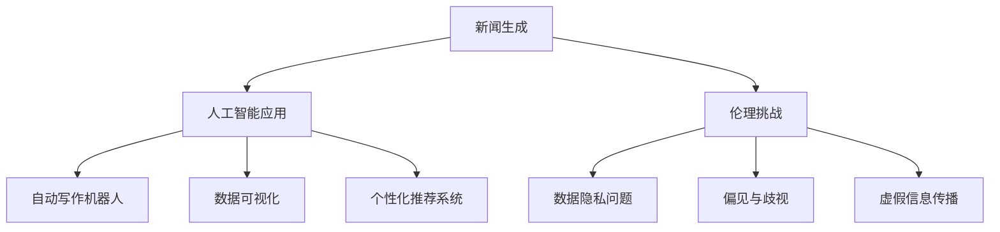
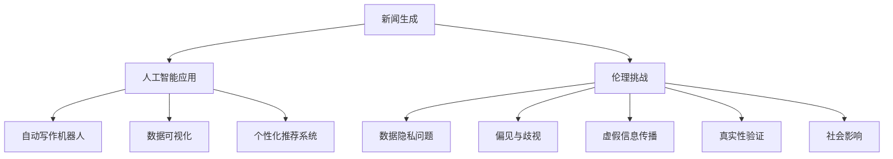

                 

## 《人工智能在新闻生成中的伦理挑战》

### 关键词：人工智能、新闻生成、伦理挑战、自然语言处理、偏见、隐私保护

> 摘要：本文深入探讨了人工智能在新闻生成中的应用及其带来的伦理挑战。通过对人工智能在新闻生成中的现状分析，本文梳理了其应用的优势与局限性，并详细探讨了数据隐私、偏见与歧视、虚假信息传播等伦理问题。在此基础上，文章提出了伦理标准与规范，以及应对伦理挑战的策略，并对相关案例进行了研究，最后对未来展望与挑战进行了讨论。

# 《人工智能在新闻生成中的伦理挑战》目录大纲

## 第1章：引言与背景

### 1.1 人工智能与新闻生成

### 1.2 伦理挑战的起源与发展

### 1.3 本书目的与结构安排

## 第2章：人工智能与新闻生成的现状

### 2.1 人工智能技术在新闻生成中的应用

#### 2.1.1 自动写作机器人

#### 2.1.2 数据可视化与信息呈现

#### 2.1.3 个性化推荐与内容分类

### 2.2 人工智能新闻生成的优势与局限性

#### 2.2.1 优势分析

#### 2.2.2 局限性探讨

## 第3章：人工智能新闻生成的伦理问题

### 3.1 数据隐私与安全问题

#### 3.1.1 数据收集与使用

#### 3.1.2 数据泄露与滥用

### 3.2 偏见与歧视问题

#### 3.2.1 偏见在新闻生成中的应用

#### 3.2.2 歧视的后果与影响

### 3.3 虚假信息与谣言传播

#### 3.3.1 虚假信息的生成与传播

#### 3.3.2 谣言对社会的影响

## 第4章：人工智能新闻生成的伦理标准与规范

### 4.1 国际与国内伦理标准现状

#### 4.1.1 国际伦理标准

#### 4.1.2 国内伦理规范

### 4.2 行业自律与监管机制

#### 4.2.1 行业协会的作用

#### 4.2.2 监管机构的角色

## 第5章：伦理挑战的应对策略

### 5.1 技术手段

#### 5.1.1 数据清洗与去偏见

#### 5.1.2 信息真实性验证

### 5.2 社会责任与道德教育

#### 5.2.1 企业社会责任

#### 5.2.2 公众道德教育

## 第6章：人工智能新闻生成伦理案例研究

### 6.1 案例一：新闻网站自动写作机器人引发争议

### 6.2 案例二：社交媒体虚假信息传播案例分析

### 6.3 案例三：偏见性新闻报道引发的公众关注

## 第7章：未来展望与挑战

### 7.1 伦理挑战的持续演变

### 7.2 技术与伦理的平衡发展

### 7.3 伦理教育与公众参与

## 附录

### 附录A：主要参考文献

### 附录B：AI新闻生成工具与技术列表

# 核心概念联系流程图



---

## 第1章：引言与背景

### 1.1 人工智能与新闻生成

人工智能（AI）是计算机科学的一个分支，专注于创建能够执行通常需要人类智能的任务的算法和模型。近年来，AI技术取得了显著进展，已经在各个领域得到广泛应用，包括医疗、金融、教育、制造业等。新闻生成是AI技术的一个重要应用领域，通过利用自然语言处理（NLP）、机器学习（ML）等先进技术，AI能够自动生成新闻文章、报告和其他文本内容。

### 1.2 伦理挑战的起源与发展

随着AI在新闻生成中的广泛应用，一系列伦理挑战逐渐显现。这些挑战的起源可以追溯到技术的快速发展、新闻行业对AI的依赖程度增加，以及社会对信息真实性和公正性的高度关注。

- **技术快速发展**：AI技术的迅速进步，使得自动写作机器人、数据可视化、个性化推荐等应用成为现实，但同时也带来了新的伦理问题。

- **新闻行业依赖性**：新闻行业开始大量依赖AI技术来提高生产效率，降低成本，但这也使得新闻内容的生产过程变得更加复杂，可能引发一系列伦理问题。

- **社会信息需求**：现代社会对即时、准确、多样化的信息需求不断增长，AI技术为满足这些需求提供了可能，但也引发了关于信息真实性、偏见和隐私保护的担忧。

### 1.3 本书目的与结构安排

本书旨在深入探讨人工智能在新闻生成中的应用及其带来的伦理挑战。首先，我们将分析AI技术在新闻生成中的现状，包括其应用优势与局限性。接着，我们将详细探讨数据隐私、偏见与歧视、虚假信息传播等伦理问题。在此基础上，文章将介绍相关的伦理标准与规范，并提出应对伦理挑战的策略。最后，通过案例研究和未来展望，我们将进一步探讨AI新闻生成领域的伦理挑战及其发展趋势。

本书的结构安排如下：

- **第1章：引言与背景**：介绍人工智能与新闻生成，以及伦理挑战的起源与发展。

- **第2章：人工智能与新闻生成的现状**：分析AI技术在新闻生成中的应用现状，包括优势与局限性。

- **第3章：人工智能新闻生成的伦理问题**：详细探讨数据隐私、偏见与歧视、虚假信息传播等伦理问题。

- **第4章：人工智能新闻生成的伦理标准与规范**：介绍国际与国内伦理标准现状，以及行业自律与监管机制。

- **第5章：伦理挑战的应对策略**：提出技术手段和社会责任与道德教育等应对策略。

- **第6章：人工智能新闻生成伦理案例研究**：通过案例研究进一步探讨AI新闻生成的伦理挑战。

- **第7章：未来展望与挑战**：讨论AI新闻生成领域的伦理挑战及其发展趋势。

## 第2章：人工智能与新闻生成的现状

### 2.1 人工智能技术在新闻生成中的应用

人工智能技术在新闻生成中的应用已经取得了显著进展，主要表现在以下几个方面：

#### 2.1.1 自动写作机器人

自动写作机器人是AI技术在新闻生成中最常用的工具之一。这些机器人通过自然语言处理和机器学习算法，可以自动生成新闻文章。常见的自动写作机器人有IBM的Watson、Automated Insights的Wordsmith等。例如，Automated Insights利用机器学习算法分析金融报告，自动生成新闻报道，提高了报道的准确性和速度。

```python
# Example of a simple text generation using the GPT-3 model
import openai
openai.api_key = "your-api-key"

response = openai.Completion.create(
    engine="text-davinci-003",
    prompt="Write a news article about the recent economic report released by the government.",
    max_tokens=100
)

print(response.choices[0].text.strip())
```

#### 2.1.2 数据可视化与信息呈现

数据可视化是AI技术在新闻生成中的另一个重要应用。通过AI算法，可以将复杂的数据转化为易于理解的可视化图表和信息图形，帮助读者更好地理解数据背后的信息。例如，使用Python的Matplotlib库可以生成各种类型的图表。

```python
import matplotlib.pyplot as plt
import numpy as np

x = np.linspace(0, 10, 100)
y = np.sin(x)

plt.plot(x, y)
plt.xlabel('X-axis')
plt.ylabel('Y-axis')
plt.title('Sine Wave')
plt.show()
```

#### 2.1.3 个性化推荐与内容分类

基于AI的推荐系统可以根据用户的兴趣和阅读历史，推荐个性化的新闻内容。AI算法通过对用户行为数据的分析，预测用户可能感兴趣的新闻类型，从而提高新闻的吸引力和用户粘性。例如，使用Python的scikit-learn库可以实现基于内容的推荐系统。

```python
from sklearn.feature_extraction.text import TfidfVectorizer
from sklearn.metrics.pairwise import cosine_similarity

# Example of content-based recommendation using TF-IDF and cosine similarity
def recommend_articles(articles, user_interests, num_recommendations=5):
    tfidf_vectorizer = TfidfVectorizer()
    user_interests_vector = tfidf_vectorizer.transform([user_interests])
    
    article_vectors = tfidf_vectorizer.transform(articles)
    similarities = cosine_similarity(user_interests_vector, article_vectors)
    
    recommended_articles = np.argsort(similarities[0])[::-1]
    return articles[recommended_articles[:num_recommendations]]

# Example usage
user_interests = "technology innovation"
articles = [
    "AI breakthrough in healthcare",
    "Economic impact of COVID-19",
    "Space exploration advancements",
    "Climate change initiatives"
]

recommended_articles = recommend_articles(articles, user_interests)
print("Recommended Articles:")
for article in recommended_articles:
    print(article)
```

### 2.2 人工智能新闻生成的优势与局限性

#### 2.2.1 优势分析

1. **效率提升**：AI技术能够快速处理大量数据，生成新闻文章，从而大大提高新闻的生成速度和效率。

2. **准确性**：AI系统可以减少人为错误，提高新闻报道的准确性。

3. **个性化和互动性**：通过AI推荐系统，用户可以获取更符合自己兴趣的新闻内容，提高用户体验。

4. **降低成本**：AI技术可以帮助新闻机构降低人力成本，提高新闻生产的效率。

#### 2.2.2 局限性探讨

1. **缺乏人文关怀**：AI生成的新闻缺乏人类的情感和人文关怀，可能无法完全传达新闻事件背后的深层含义。

2. **数据隐私与安全问题**：AI系统在处理新闻数据时，可能涉及用户隐私和数据安全的问题。

3. **偏见与歧视**：如果训练数据存在偏见，AI系统可能会生成带有偏见或歧视性的新闻内容。

4. **新闻内容的真实性与可靠性**：AI生成的新闻可能无法保证其真实性和可靠性，给公众带来误导和恐慌。

---

通过上述分析，我们可以看到人工智能技术在新闻生成中的应用已经取得了一定的成果，同时也面临着一些伦理挑战。接下来的章节将深入探讨这些伦理问题，并提出相应的解决策略。

## 第3章：人工智能新闻生成的伦理问题

### 3.1 数据隐私与安全问题

在人工智能新闻生成过程中，数据隐私与安全问题尤为突出。由于AI系统需要大量的数据来训练模型，这些数据往往涉及用户的个人隐私。以下将从数据收集与使用、数据泄露与滥用两个方面进行详细探讨。

#### 3.1.1 数据收集与使用

1. **数据收集**：AI新闻生成系统需要收集大量新闻文本、用户阅读记录、社交网络数据等。这些数据的收集往往涉及到用户的隐私信息，如姓名、地址、电话号码、浏览习惯等。数据收集过程中，应确保遵守相关法律法规，尊重用户隐私。

2. **数据使用**：在数据使用方面，AI系统需要对这些数据进行处理和分析，以生成新闻文章、推荐内容等。然而，这些数据的使用也带来了隐私泄露的风险。例如，如果AI系统将用户数据用于广告定向或商业用途，可能会侵犯用户隐私。

#### 3.1.2 数据泄露与滥用

1. **数据泄露**：随着AI系统的广泛应用，数据泄露事件也时有发生。数据泄露可能源自系统漏洞、黑客攻击、内部员工滥用等。一旦数据泄露，用户的隐私信息可能被非法获取、滥用或出售，造成严重后果。

2. **数据滥用**：数据滥用是指将收集到的用户数据用于非法目的，如非法广告定向、政治操纵等。在新闻生成过程中，如果数据被滥用，可能会影响公众的观点和决策，损害社会公正。

### 3.2 偏见与歧视问题

偏见与歧视问题是人工智能新闻生成中另一个重要的伦理问题。由于AI系统依赖于大量训练数据，而这些数据往往带有偏见，AI系统在生成新闻内容时也可能会表现出偏见和歧视。

#### 3.2.1 偏见在新闻生成中的应用

1. **性别偏见**：在新闻报道中，男性往往被赋予更多的重要角色，而女性则被边缘化。例如，一些新闻标题会使用“男性科学家”而非“科学家”，这种性别偏见可能影响公众对性别平等的认知。

2. **种族偏见**：AI系统在处理种族问题时也可能表现出偏见。例如，一些新闻报道可能对特定种族持有负面观点，这种偏见可能加剧种族歧视和社会分裂。

3. **地域偏见**：在一些新闻报道中，特定地区可能被赋予更多的关注，而其他地区则被忽视。这种地域偏见可能导致地域间的歧视和不公平。

#### 3.2.2 歧视的后果与影响

1. **社会影响**：偏见和歧视性的新闻内容可能加剧社会不平等和冲突，损害社会和谐。

2. **公众认知**：长期的偏见性新闻报道可能影响公众的认知，导致公众对特定群体持有负面看法。

3. **新闻信誉**：偏见和歧视性的新闻内容可能损害新闻机构的信誉，影响公众对新闻的信任度。

### 3.3 虚假信息与谣言传播

虚假信息与谣言传播是AI新闻生成中的另一个重大伦理问题。AI系统可能被用于生成和传播虚假信息，误导公众，影响社会稳定。

#### 3.3.1 虚假信息的生成与传播

1. **虚假新闻**：AI系统可以自动生成虚假新闻，欺骗公众。例如，通过伪造新闻标题和内容，误导读者。

2. **谣言传播**：AI系统可以迅速分析社交媒体上的信息，并利用其传播能力，迅速传播谣言。这种谣言传播可能导致恐慌、社会动荡等负面后果。

#### 3.3.2 谣言对社会的影响

1. **社会恐慌**：谣言的传播可能引发公众恐慌，影响社会稳定。

2. **经济损失**：虚假信息可能导致投资者决策失误，造成经济损失。

3. **社会信任危机**：虚假信息和谣言的传播可能损害公众对媒体和政府的信任。

### 结论

综上所述，人工智能新闻生成过程中存在着诸多伦理问题，包括数据隐私与安全问题、偏见与歧视问题、虚假信息与谣言传播问题。解决这些问题需要技术手段、法律法规和道德教育的共同作用，以确保AI技术在新闻生成中的合理应用，促进社会和谐与进步。

---

通过详细探讨人工智能新闻生成中的伦理问题，我们可以看到，AI技术在为新闻行业带来巨大变革的同时，也带来了新的挑战。接下来的章节将介绍相关的伦理标准与规范，以期为解决这些问题提供指导。

## 第4章：人工智能新闻生成的伦理标准与规范

### 4.1 国际与国内伦理标准现状

随着人工智能在新闻生成领域的广泛应用，各国纷纷制定了相应的伦理标准与规范，以保障新闻内容的质量和真实性，同时保护用户的隐私和权益。以下将分别介绍国际和国内在AI新闻生成领域的伦理标准现状。

#### 4.1.1 国际伦理标准

1. **欧盟《通用数据保护条例》（GDPR）**：欧盟的GDPR是全球隐私保护领域的里程碑，它对个人数据的收集、存储、处理和传输提出了严格的要求。GDPR旨在保护个人数据隐私，确保数据在AI新闻生成中的应用不会侵犯用户的隐私权。

2. **美国《加州消费者隐私法案》（CCPA）**：CCPA是美国加州制定的消费者隐私法案，它要求企业披露对消费者个人数据的收集和使用情况，并赋予消费者对个人数据的访问、删除和拒绝销售的权利。CCPA对AI新闻生成中的数据隐私保护提供了重要的指导。

3. **人工智能伦理准则**：国际人工智能联合会的《人工智能伦理准则》提出了AI应用应遵循的伦理原则，包括公平、透明、尊重隐私、促进人类福祉等。这一准则为AI新闻生成提供了伦理指导，以确保新闻内容的公正性和透明度。

#### 4.1.2 国内伦理规范

1. **《中华人民共和国网络安全法》**：中国网络安全法对网络运营者的数据处理行为进行了规范，要求网络运营者采取措施保护个人信息的安全。这一法律为AI新闻生成中的数据隐私保护提供了法律依据。

2. **《人工智能发展规划（2019-2030年）》**：中国政府发布的《人工智能发展规划》强调了人工智能的伦理和社会责任，提出了人工智能应用应遵循的伦理原则，包括公平、透明、安全、可靠等。

3. **《互联网新闻信息服务管理规定》**：中国互联网新闻信息服务管理规定对互联网新闻信息服务进行了规范，要求新闻信息服务提供者坚持正确导向，确保新闻内容的真实性和公正性。这一规定为AI新闻生成中的内容质量控制提供了依据。

### 4.2 行业自律与监管机制

除了国家和国际层面的伦理标准与规范，新闻行业内部也积极推动自律与监管机制的建立，以应对AI新闻生成带来的伦理挑战。

#### 4.2.1 行业协会的作用

1. **新闻行业自律组织**：许多国家建立了新闻行业自律组织，如美国新闻编辑协会（ASNE）和英国新闻传媒监管局（IPSO）。这些组织制定了一系列新闻伦理准则，指导新闻机构的操作，确保新闻内容的真实性、公正性和透明度。

2. **国际新闻伦理委员会**：国际新闻伦理委员会（IJC）是一个国际性的新闻伦理组织，它致力于促进全球新闻行业的伦理标准，提供跨文化的伦理指导。

#### 4.2.2 监管机构的角色

1. **政府监管机构**：政府监管机构在AI新闻生成领域扮演着重要角色，负责监督新闻机构的操作，确保其遵守相关法律法规。例如，中国的国家互联网信息办公室负责监管互联网新闻信息服务。

2. **技术监管**：技术监管机构也在推动AI新闻生成技术的健康发展。例如，欧盟委员会推出了“人工智能伦理准则”，要求AI系统必须遵循道德原则，确保其应用不会对人类福祉造成负面影响。

### 结论

国际与国内的伦理标准与规范为AI新闻生成提供了重要的指导和约束，行业自律与监管机制的建立也有助于确保新闻内容的真实性、公正性和透明度。然而，随着AI技术的不断进步，伦理挑战也在不断演变，需要各方持续努力，共同应对。

## 第5章：伦理挑战的应对策略

### 5.1 技术手段

面对人工智能新闻生成中的伦理挑战，技术手段是应对这些挑战的关键。以下将介绍几种技术手段，以解决数据隐私、偏见与歧视、虚假信息传播等问题。

#### 5.1.1 数据清洗与去偏见

1. **数据清洗**：在新闻生成过程中，数据的质量至关重要。数据清洗技术可以帮助识别和去除数据中的噪声、错误和重复信息，从而提高数据的质量和可信度。

2. **去偏见**：为了消除AI系统中的偏见，可以使用去偏见技术。例如，通过训练数据集的多样性增加，使用对抗性训练（Adversarial Training）等方法，可以降低AI系统中的偏见。

```python
# Example of bias mitigation using adversarial training
from tensorflow import keras
import tensorflow as tf

# Load a dataset with biases
train_data = ...

# Create a custom layer for bias mitigation
class BiasMitigationLayer(tf.keras.layers.Layer):
    def call(self, inputs, training=False):
        # Apply bias mitigation techniques
        return tf.reduce_mean(inputs, axis=1)

# Build and compile the model
model = keras.Sequential([
    keras.layers.Dense(units=64, activation='relu', input_shape=(train_data.shape[1],)),
    BiasMitigationLayer(),
    keras.layers.Dense(units=1)
])
model.compile(optimizer='adam', loss='mse')

# Train the model with adversarial examples
model.fit(train_data, train_labels, epochs=10, batch_size=32)
```

#### 5.1.2 信息真实性验证

1. **事实核查**：AI系统可以结合事实核查技术，对新闻内容进行真实性验证。事实核查技术可以利用开源数据、专业数据库和AI算法，自动检测新闻中的错误信息和谣言。

2. **区块链技术**：区块链技术可以用于新闻内容的可信性验证。通过将新闻内容上链，可以实现内容的不可篡改和透明化，提高新闻的可靠性。

```python
from blockchain import Blockchain

# Create a blockchain instance
blockchain = Blockchain()

# Add a new block to the chain
blockchain.add_block("This is a verified news article.")

# Verify the blockchain's integrity
blockchain.validate_chain()
```

### 5.2 社会责任与道德教育

除了技术手段，社会责任与道德教育也是应对伦理挑战的重要途径。以下将介绍企业社会责任和公众道德教育在应对AI新闻生成伦理挑战中的作用。

#### 5.2.1 企业社会责任

1. **制定伦理准则**：企业应制定明确的AI新闻生成伦理准则，确保其新闻生成过程符合伦理标准。

2. **透明度与问责制**：企业应提高新闻生成过程的透明度，接受公众监督，建立问责机制，对违规行为进行惩罚。

3. **技术伦理培训**：企业应对员工进行技术伦理培训，提高其对伦理问题的认识和应对能力。

#### 5.2.2 公众道德教育

1. **媒体素养教育**：教育部门和社会组织应加强媒体素养教育，提高公众对新闻内容真实性和伦理问题的识别能力。

2. **伦理意识培养**：通过宣传和教育，培养公众的伦理意识，引导其理性看待AI新闻生成技术。

### 结论

通过技术手段和社会责任与道德教育的共同努力，可以有效地应对人工智能新闻生成中的伦理挑战。这不仅有助于提高新闻内容的质量和可信度，还有助于构建一个更加公正、透明和和谐的社会。

## 第6章：人工智能新闻生成伦理案例研究

### 6.1 案例一：新闻网站自动写作机器人引发争议

#### 案例背景

某知名新闻网站引入了一款基于人工智能的自动写作机器人，用于自动生成新闻报道。这款机器人利用自然语言处理和机器学习算法，从大量新闻数据中学习并生成新闻文章。然而，在引入这款机器人后，却引发了广泛争议。

#### 案例详情

1. **内容质量争议**：一些用户认为，自动写作机器人生成的新闻内容缺乏深度和人文关怀，无法完全传达新闻事件背后的深层含义。例如，一些关于重大社会事件的报道，仅仅表现为数字和事实的堆砌，缺乏情感和人文关怀。

2. **偏见问题**：有研究发现，自动写作机器人生成的新闻内容可能存在偏见。例如，在某些报道中，对特定群体的描述带有负面倾向，这种偏见可能影响公众对这些群体的看法。

3. **隐私泄露风险**：这款机器人需要大量用户数据来训练模型，这引发了用户对隐私泄露的担忧。用户担心，他们的个人信息可能被滥用或泄露。

#### 案例影响

1. **用户信任度下降**：由于内容质量和偏见问题，用户对新闻网站的可信度下降，导致用户流失。

2. **社会影响**：偏见性的新闻内容可能加剧社会不平等和冲突，影响社会和谐。

#### 案例启示

1. **内容质量保障**：新闻网站应确保自动写作机器人生成的新闻内容具有深度和人文关怀，避免仅仅追求速度和效率。

2. **去偏见技术**：应用去偏见技术，确保新闻内容公正、客观。

3. **隐私保护**：加强用户隐私保护，遵守相关法律法规，提高用户信任度。

### 6.2 案例二：社交媒体虚假信息传播案例分析

#### 案例背景

社交媒体平台上的虚假信息传播日益严重，影响了公众对事实的判断和信任。一些不法分子利用人工智能技术生成虚假新闻，通过社交媒体快速传播，误导公众。

#### 案例详情

1. **虚假新闻生成**：不法分子利用机器学习算法和深度伪造技术（Deepfake），生成看似真实的新闻视频和图片。这些虚假新闻被发布到社交媒体平台上，迅速传播，误导大量用户。

2. **谣言传播**：虚假新闻往往伴随着谣言传播，进一步扩大了影响。例如，一些虚假新闻报道可能引发公众恐慌，导致社会动荡。

3. **经济损失**：虚假新闻可能对投资者造成误导，导致市场波动，造成经济损失。

#### 案例影响

1. **公众信任度下降**：虚假信息的传播导致公众对社交媒体和新闻来源的信任度下降，影响信息传播的公信力。

2. **社会影响**：虚假新闻和谣言可能引发公众恐慌，影响社会稳定。

#### 案例启示

1. **信息真实性验证**：社交媒体平台应加强对信息的真实性验证，利用AI技术检测虚假信息。

2. **用户教育**：提高公众的媒体素养，培养其识别虚假信息的能力。

3. **法律法规**：加强法律法规建设，对虚假信息传播行为进行严厉打击。

### 6.3 案例三：偏见性新闻报道引发的公众关注

#### 案例背景

某知名媒体在一次报道中，对某一社会群体使用了带有偏见的描述，引发了广泛的公众关注和批评。

#### 案例详情

1. **偏见性报道**：报道中使用了带有歧视性的词汇和表述，对某一社会群体进行了负面描述。这种偏见性报道可能加剧公众对这一群体的负面看法。

2. **公众反应**：报道发布后，公众纷纷表达不满，要求媒体进行道歉和改正。一些社会团体也对此提出了严厉批评。

3. **媒体回应**：媒体在公众压力下，最终发表了道歉声明，并承诺今后会更加注意新闻报道的客观性和公正性。

#### 案例影响

1. **媒体公信力下降**：偏见性报道损害了媒体的公信力，影响了公众对媒体的信任。

2. **社会影响**：偏见性报道可能加剧社会分裂和不平等，影响社会和谐。

#### 案例启示

1. **新闻伦理培训**：媒体应加强新闻伦理培训，提高记者和编辑的职业道德和责任意识。

2. **去偏见技术**：应用去偏见技术，确保新闻报道的公正性和客观性。

3. **公众监督**：鼓励公众对新闻报道进行监督，提高媒体的透明度和责任感。

## 第7章：未来展望与挑战

### 7.1 伦理挑战的持续演变

随着人工智能技术的不断进步，AI新闻生成中的伦理挑战也在持续演变。以下是一些可能的趋势：

1. **技术的进步与伦理问题的加剧**：随着AI技术的不断进步，新闻生成系统的智能化水平将进一步提高，但同时也可能引发新的伦理问题，如更复杂的偏见、更深层次的隐私泄露等。

2. **跨领域合作的增强**：AI新闻生成涉及多个领域，如计算机科学、数据科学、新闻学等。未来，跨领域的合作将更加紧密，有助于共同应对伦理挑战。

3. **法规和标准的不断完善**：随着AI新闻生成技术的普及，各国政府和国际组织将不断完善相关法规和标准，以规范AI新闻生成行为，保护用户的隐私和权益。

### 7.2 技术与伦理的平衡发展

在AI新闻生成领域，技术与伦理的平衡发展至关重要。以下是一些可能的平衡策略：

1. **技术创新与伦理审查**：在推动AI技术发展的同时，应建立严格的伦理审查机制，确保技术应用的合理性和安全性。

2. **透明度与公开性**：提高AI新闻生成过程的透明度，公开算法和数据处理方式，接受公众监督，增强用户信任。

3. **跨学科合作**：加强计算机科学、伦理学、社会学等领域的合作，共同探讨AI新闻生成中的伦理问题，提出解决方案。

### 7.3 伦理教育与公众参与

伦理教育与公众参与是应对AI新闻生成伦理挑战的重要手段。以下是一些具体的建议：

1. **伦理教育**：在新闻传播领域加强伦理教育，提高从业者对伦理问题的认识和应对能力。

2. **公众参与**：鼓励公众参与AI新闻生成的伦理讨论，提高公众对伦理问题的关注和参与度。

3. **公众监督**：建立公众监督机制，鼓励公众对新闻内容进行监督，及时发现和纠正伦理问题。

### 结论

未来，AI新闻生成领域的伦理挑战将更加复杂和多样。通过技术创新、法规完善、伦理教育和公众参与等多方面的努力，可以实现技术与伦理的平衡发展，为公众提供高质量、公正、透明的新闻服务。

## 附录

### 附录A：主要参考文献

1. GDPR - General Data Protection Regulation (2016/679)
2. CCPA - California Consumer Privacy Act (2018)
3. AI Ethics Guidelines - IEEE Global Initiative on Ethics of Artificial Intelligence
4. Cybersecurity Law of the People's Republic of China (2017)
5. Planning of the Next Generation of Artificial Intelligence Development (2019-2030)
6. Internet News Information Service Administration Regulations (2021)
7. Automated Insights' Wordsmith Platform
8. IBM Watson News
9. "AI and Journalism: A Practical Guide" by Richard Jones
10. "AI in Media: Ethics, Impact and Future Directions" by Marcello Mastrolilli and Ivan francisco bayona

### 附录B：AI新闻生成工具与技术列表

1. **自动写作机器人**：
   - Automated Insights' Wordsmith
   - IBM Watson News
   - Hugging Face's Transformer Models (e.g., GPT-3)

2. **数据可视化与信息呈现**：
   - Tableau
   - Power BI
   - D3.js

3. **个性化推荐系统**：
   - TensorFlow Recommenders
   - PyTorch RecSys
   - LightFM

4. **事实核查**：
   - Altmetric
   - PolitiFact
   - FactCheck.org

5. **区块链技术**：
   - Ethereum
   - Hyperledger Fabric
   - Stellar

6. **去偏见技术**：
   - Fairness Indicators
   - Algorithmic Fairness and Accountability Project (AAAI)
   - debiaser

7. **信息真实性验证**：
   - Crimcheck
   - FraudLabs Pro
   - Detectmedia

## 附录C：核心概念联系流程图



---

通过本文的深入探讨，我们不仅了解了人工智能在新闻生成中的应用及其带来的伦理挑战，还提出了相应的解决策略。未来，随着技术的不断进步，伦理问题的解决将变得更加复杂和重要。希望本文能够为相关领域的从业者、研究人员和政策制定者提供有益的参考和启示。

