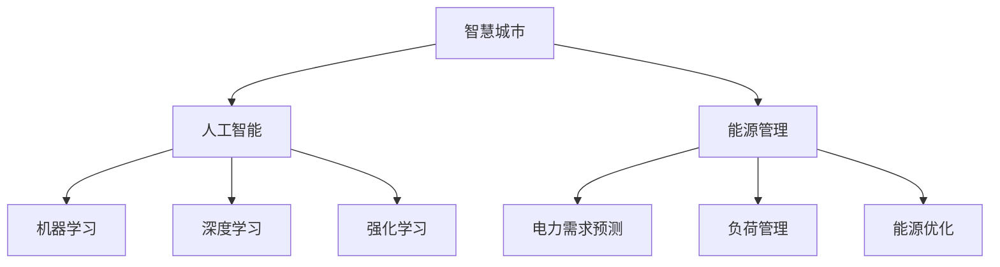
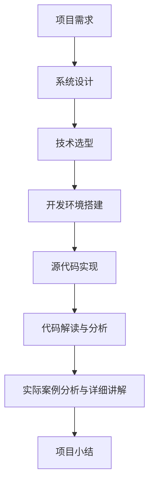

                 

 **第一步：确定整体框架**

为了撰写一篇全面而深入的技术博客文章，我们首先需要构建一个明确的框架，确保文章内容结构清晰、逻辑连贯。文章的整体框架可以分为以下几个部分：

1. **引言**
   - 简要介绍人工智能与智慧城市的概念
   - 阐述文章的目的与结构

2. **人工智能在智慧城市中的应用概述**
   - 智慧城市的定义与背景
   - 人工智能在智慧城市中的角色与价值

3. **智慧城市能源管理概述**
   - 能源管理的定义与目标
   - 智慧城市能源管理的基本概念与挑战

4. **人工智能在智慧城市能源管理中的应用**
   - 人工智能技术在能源管理中的应用
   - 具体应用场景与案例分析

5. **技术与工具**
   - 用于智慧城市能源管理的人工智能技术
   - 实施智慧城市能源管理所需的工具与平台

6. **实践与展望**
   - 人工智能在智慧城市能源管理的未来发展趋势
   - 智慧城市能源管理的最佳实践与挑战

**第二步：细化每个部分**

接下来，我们将为每个部分细化章节内容，确保每个章节都有足够的深度和广度来满足读者的需求。

### 引言

**第1章：引言**

- **1.1 智慧城市的概念与背景**
  - 智慧城市是一个通过信息通信技术和物联网实现城市管理和服务的现代化城市。
  - 智慧城市的发展历史与趋势。
  - 智慧城市对能源管理的影响。

- **1.2 人工智能的基本概念与发展**
  - 人工智能的定义与基本概念。
  - 人工智能技术的发展历程。
  - 人工智能在各个领域的应用。

- **1.3 文章目的与结构**
  - 概述文章的目的，即探讨人工智能在智慧城市能源管理中的应用。
  - 阐述文章的结构与内容安排。

### 人工智能在智慧城市中的应用概述

**第2章：人工智能在智慧城市中的应用概述**

- **2.1 智慧城市的概念与背景**
  - 智慧城市的定义与特征。
  - 智慧城市的发展历史与趋势。

- **2.2 人工智能在智慧城市中的角色与价值**
  - 人工智能在智慧城市中的应用场景。
  - 人工智能对智慧城市带来的变革。

- **2.3 智慧城市对能源管理的影响**
  - 智慧城市对能源管理带来的挑战与机遇。
  - 智慧城市能源管理的目标与任务。

### 智慧城市能源管理概述

**第3章：智慧城市能源管理概述**

- **3.1 能源管理的定义与目标**
  - 能源管理的定义与基本概念。
  - 能源管理的目标与任务。

- **3.2 智慧城市能源管理的基本概念**
  - 智慧城市能源管理的定义与特点。
  - 智慧城市能源管理的体系架构。

- **3.3 当前智慧城市能源管理面临的挑战**
  - 数据获取与处理的挑战。
  - 技术标准与互操作性的问题。
  - 政策与法规的制约。

### 人工智能在智慧城市能源管理中的应用

**第4章：人工智能在智慧城市能源管理中的应用**

- **4.1 人工智能技术在能源管理中的应用**
  - 人工智能技术在能源管理中的角色与价值。
  - 人工智能技术在能源管理中的具体应用。

- **4.2 人工智能在智慧城市能源管理中的具体应用场景**
  - 电力需求预测与负荷管理。
  - 能源优化与调度。
  - 能源效率分析与提升。

- **4.3 案例研究**
  - 国内外智慧城市能源管理案例分析。

### 技术与工具

**第5章：技术与工具**

- **5.1 人工智能技术在能源管理中的应用**
  - 机器学习、深度学习、强化学习等技术在能源管理中的应用。

- **5.2 实施智慧城市能源管理所需的工具与平台**
  - 人工智能开发工具、智慧城市能源管理平台建设、技术架构与功能模块。

### 实践与展望

**第6章：实践与展望**

- **6.1 人工智能在智慧城市能源管理的未来发展趋势**
  - 人工智能在能源管理中的创新模式与未来挑战。

- **6.2 智慧城市能源管理的最佳实践与挑战**
  - 智慧城市能源管理的可持续发展策略。
  - 智慧城市能源管理的最佳实践案例。

**第三步：确保内容的完整性**

在细化每个部分的过程中，我们将确保每个小节的内容都丰富具体，详细讲解核心概念原理和架构的 Mermaid 流程图、核心算法原理讲解、数学模型和公式、项目实战等内容。

**第四步：撰写文章**

根据上述框架，我们将按照Markdown格式撰写文章，确保文章内容结构清晰、逻辑连贯，同时满足格式要求和完整性要求。

---

**文章标题**：人工智能在智慧城市能源管理中的应用

**关键词**：人工智能，智慧城市，能源管理，应用场景，案例研究，工具与平台

**摘要**：本文探讨了人工智能在智慧城市能源管理中的应用。通过介绍智慧城市和人工智能的基本概念，分析了智慧城市能源管理面临的挑战，探讨了人工智能技术在能源管理中的应用，并提供了具体的案例研究和实践建议。

---

**引言**

随着城市化进程的加速，智慧城市成为各国政府和研究机构关注的焦点。智慧城市通过信息通信技术和物联网实现城市管理和服务的现代化，极大地提高了城市的管理效率和生活质量。在智慧城市中，能源管理是一个至关重要的领域，它直接关系到城市的可持续发展。而人工智能作为一项前沿技术，已经在许多领域取得了显著的成果，其在智慧城市能源管理中的应用也日益受到关注。

本文旨在探讨人工智能在智慧城市能源管理中的应用，通过对智慧城市和人工智能的基本概念进行介绍，分析当前智慧城市能源管理面临的挑战，深入探讨人工智能技术在能源管理中的应用场景，并提供国内外智慧城市能源管理的案例研究。此外，本文还将介绍实施智慧城市能源管理所需的工具与平台，并对未来人工智能在智慧城市能源管理中的发展趋势进行展望。

本文的结构安排如下：

1. 引言
2. 人工智能在智慧城市中的应用概述
3. 智慧城市能源管理概述
4. 人工智能在智慧城市能源管理中的应用
5. 技术与工具
6. 实践与展望

通过以上结构安排，本文将系统地探讨人工智能在智慧城市能源管理中的应用，为相关领域的研究者和实践者提供有价值的参考。

---

**人工智能在智慧城市中的应用概述**

### 2.1 智慧城市的概念与背景

智慧城市是一个通过信息通信技术和物联网实现城市管理和服务的现代化城市。它利用先进的信息技术，如大数据、云计算、物联网和人工智能等，将城市各部分进行整合，提高城市的管理效率、降低运营成本、提升居民生活质量。智慧城市的定义和特征主要包括以下几个方面：

- **信息物理系统（Cyber-Physical System, CPS）**：智慧城市通过信息物理系统将物理世界与数字世界相结合，实现城市资源的实时监测、智能调控和优化配置。

- **物联网（Internet of Things, IoT）**：物联网技术在智慧城市中发挥了重要作用，它通过将各种物理设备连接到互联网，实现设备之间的信息交换和协同工作。

- **云计算**：云计算提供了强大的计算和存储能力，支持智慧城市中大规模数据处理和分析，为城市管理和运营提供技术支撑。

- **大数据**：大数据技术在智慧城市中用于收集、存储、处理和分析海量数据，帮助政府和企业更好地理解城市运行状况，做出科学决策。

- **人工智能**：人工智能技术通过模拟人类智能，实现自动化决策、智能识别和预测分析，为智慧城市提供了智能化解决方案。

智慧城市的发展历史可以追溯到20世纪末，随着信息技术的飞速发展，越来越多的城市开始探索智慧城市的建设。例如，2008年，美国智能电网倡议的提出，标志着智慧城市能源管理领域的起步。近年来，随着5G、物联网和人工智能等新技术的突破，智慧城市的发展进入了一个崭新的阶段。

智慧城市对能源管理的影响主要体现在以下几个方面：

- **能源效率提升**：智慧城市通过优化能源资源配置，提高能源利用效率，减少能源浪费。

- **可持续发展**：智慧城市通过整合各种能源资源，推动可再生能源的利用，实现城市的可持续发展。

- **智能调度**：智慧城市利用人工智能技术，实现能源供需的智能调度，提高电网稳定性和供电可靠性。

- **环境保护**：智慧城市通过实时监测和预警，降低环境污染，提高城市环境质量。

总之，智慧城市的概念与背景为人工智能在智慧城市能源管理中的应用提供了广阔的空间，也为城市可持续发展带来了新的机遇。

### 2.2 人工智能在智慧城市中的角色与价值

人工智能作为一项前沿技术，在智慧城市中的应用具有举足轻重的地位。其基本概念和技术发展主要包括以下几个方面：

- **机器学习**：机器学习是人工智能的核心技术之一，它通过构建数学模型，从大量数据中学习规律和模式，实现自动化的决策和预测。常见的机器学习方法包括监督学习、无监督学习和强化学习。

- **深度学习**：深度学习是机器学习的一个分支，它通过多层神经网络模型，对大量数据进行特征提取和模式识别，已广泛应用于图像识别、语音识别和自然语言处理等领域。

- **强化学习**：强化学习通过学习环境中的奖励和惩罚信号，实现智能体在动态环境中的最优决策。它广泛应用于智能交通、智能电网和智能安防等领域。

- **计算机视觉**：计算机视觉是人工智能的一个重要分支，它通过图像处理和模式识别技术，实现图像的自动分析和理解，已广泛应用于智能监控、无人驾驶和智能家居等领域。

- **自然语言处理**：自然语言处理是人工智能的另一个重要分支，它通过语言模型和语义理解技术，实现人与计算机的自然语言交互。已广泛应用于智能客服、智能翻译和智能助手等领域。

人工智能在智慧城市中的具体应用包括：

- **智能交通管理**：通过实时监测和分析交通数据，人工智能可以实现智能交通信号控制、路况预测和交通拥堵预警，提高交通效率，减少交通事故。

- **智能安防监控**：人工智能通过计算机视觉技术，可以实现智能监控、异常行为检测和犯罪预防，提高城市安全管理水平。

- **智能环境监测**：人工智能可以通过物联网传感器实时监测城市环境数据，如空气质量、水质和噪音等，实现环境问题的及时发现和预警。

- **智能能源管理**：人工智能可以通过数据分析和预测，实现能源的优化配置和调度，提高能源利用效率，减少能源浪费。

- **智能公共服务**：人工智能可以用于智能医疗、智能教育和智能政务等领域，提高公共服务的质量和效率。

总之，人工智能在智慧城市中的应用，不仅为城市管理和运营提供了新的技术手段，也带来了城市发展的新机遇。通过人工智能技术的深入应用，智慧城市可以实现更高效、更智能、更可持续的发展。

### 2.3 人工智能对智慧城市能源管理带来的变革

人工智能技术的快速发展，为智慧城市能源管理带来了深远的变革。它不仅提高了能源管理的效率和准确性，还推动了能源管理模式的创新，对智慧城市的可持续发展产生了重要影响。

首先，人工智能通过数据分析和预测，实现了能源管理的精细化。在传统的能源管理中，由于数据采集和处理能力的限制，能源管理往往依赖于经验和方法，难以实现精确的调度和优化。而人工智能可以通过对大量历史数据的分析，发现能源消耗的规律和模式，预测未来的能源需求，从而实现更加精准的能源调度和优化。

其次，人工智能在能源管理中的应用，推动了能源管理模式的创新。例如，基于人工智能的智能电网，可以实现能源的实时监测和动态调整，提高电网的稳定性和可靠性。同时，智能电网还可以实现分布式能源的接入和优化管理，推动能源结构的多元化。此外，人工智能还可以应用于能源需求的预测和响应，实现能源的智能调度和优化，提高能源利用效率，减少能源浪费。

再者，人工智能对智慧城市的可持续发展产生了重要影响。通过人工智能技术的应用，智慧城市可以实现能源的高效利用和清洁能源的推广，降低能源消耗和环境污染。例如，智能交通系统可以通过实时监测和分析交通数据，优化交通信号控制和路线规划，减少交通拥堵和燃油消耗。智能环境监测系统可以通过实时监测空气质量、水质和噪音等环境数据，及时发现环境问题并采取相应的措施，保护城市环境。

此外，人工智能在智慧城市能源管理中的应用，还可以提高公共服务的质量和效率。例如，智能医疗系统可以通过人工智能技术，实现疾病预测、诊断和治疗方案的推荐，提高医疗服务水平。智能教育系统可以通过人工智能技术，实现个性化教学和智能学习，提高教育质量和效率。智能政务系统可以通过人工智能技术，实现数据采集、分析和决策支持，提高政府决策的科学性和效率。

总之，人工智能在智慧城市能源管理中的应用，不仅提高了能源管理的效率和准确性，还推动了能源管理模式的创新，对智慧城市的可持续发展产生了重要影响。通过人工智能技术的深入应用，智慧城市可以实现更高效、更智能、更可持续的发展。

### 智慧城市能源管理概述

#### 3.1 能源管理的定义与目标

能源管理是指对能源的生产、传输、分配和使用进行系统化的规划、组织、协调和控制，以实现能源的合理利用、节约和保护。在智慧城市中，能源管理被赋予了更加重要的角色，不仅要实现能源的高效利用和节约，还要确保能源供应的稳定性和可持续性。

能源管理的目标主要包括以下几个方面：

- **提高能源利用效率**：通过优化能源配置，提高能源的使用效率，减少能源浪费，降低能源消耗成本。

- **保障能源供应的稳定性**：通过科学调度和实时监测，确保能源供应的稳定性，减少能源供应中断的风险。

- **促进可再生能源的使用**：推动可再生能源的发展，减少对传统化石能源的依赖，实现能源结构的优化和绿色转型。

- **提高能源管理水平**：通过信息化和智能化手段，提高能源管理的效率和科学性，实现能源管理的智能化和精细化。

#### 3.2 智慧城市能源管理的基本概念

智慧城市能源管理是结合智慧城市理念和现代能源管理技术，实现能源的高效、智能、绿色管理的一种新型管理模式。它基于物联网、大数据、云计算和人工智能等先进技术，通过实时数据采集、分析和应用，实现对能源供应、传输、分配和使用全过程的管理和优化。

智慧城市能源管理的基本概念包括：

- **物联网（IoT）**：通过物联网技术，实现能源设备、传感器和系统的互联互通，实时采集能源数据，为能源管理提供基础数据支持。

- **大数据（Big Data）**：利用大数据技术，对海量能源数据进行分析和挖掘，发现能源消耗的规律和模式，为能源管理和决策提供数据支撑。

- **云计算（Cloud Computing）**：通过云计算技术，实现能源数据的高效存储、处理和分析，提供强大的计算能力和灵活的部署方式。

- **人工智能（AI）**：利用人工智能技术，对能源数据进行智能分析和预测，实现能源的智能调度和优化，提高能源管理的效率和准确性。

#### 3.3 能源管理的层级架构

智慧城市能源管理通常分为以下几个层级：

- **感知层**：通过传感器、智能设备等，实时采集能源数据，如能源消耗量、设备状态、环境参数等。

- **传输层**：通过物联网技术，将感知层采集到的数据传输到数据中心或云平台，实现数据的实时传输和共享。

- **数据处理层**：在数据中心或云平台，利用大数据技术和人工智能算法，对采集到的能源数据进行处理、分析和挖掘，生成各种分析报告和预测结果。

- **决策层**：根据数据处理层生成的分析报告和预测结果，结合实际情况，制定能源管理策略和优化方案。

- **执行层**：通过执行层，将决策层的策略和优化方案应用到实际能源管理中，如调整设备运行状态、优化能源配置等。

这种分层架构使得智慧城市能源管理能够实现从数据采集、处理到决策、执行的闭环管理，提高能源管理的效率和质量。

### 当前智慧城市能源管理面临的挑战

尽管智慧城市能源管理带来了许多机遇，但其在实际应用过程中也面临着一系列挑战。以下是当前智慧城市能源管理面临的主要挑战：

#### 4.1 数据获取与处理的挑战

智慧城市能源管理依赖于大量实时数据，这些数据来自各种传感器、智能设备和系统。然而，数据获取和处理过程中存在以下挑战：

- **数据质量**：由于传感器和设备的多样性，数据质量难以保证。一些设备可能存在数据不准确、不完整或噪声较大的问题。

- **数据传输**：大量数据需要通过物联网进行传输，传输过程中可能面临数据延迟、数据丢失等问题。

- **数据存储**：海量数据的存储和管理是一项挑战，需要高效的存储方案和合理的数据组织结构。

- **数据处理**：大数据分析需要强大的计算能力和高效的算法，处理过程中可能面临性能瓶颈和计算资源不足的问题。

#### 4.2 技术标准与互操作性的问题

智慧城市能源管理涉及多个领域和系统，不同系统之间的技术标准不统一，导致互操作性差。具体问题包括：

- **数据格式不统一**：不同系统使用不同的数据格式和协议，难以实现数据共享和交换。

- **接口不兼容**：不同系统之间的接口可能不兼容，导致数据难以互通。

- **系统集成难度大**：由于技术标准和接口不统一，系统集成和部署过程复杂，影响系统的稳定性和可靠性。

#### 4.3 政策与法规的制约

智慧城市能源管理的发展受到政策与法规的制约，具体问题包括：

- **数据隐私与安全**：随着数据采集和分析的广泛应用，数据隐私和安全问题日益突出。现有法律法规可能无法充分保护个人隐私和数据安全。

- **监管与政策支持**：智慧城市能源管理需要政策支持，如财政补贴、税收优惠等。然而，相关政策支持可能不完善，影响智慧城市能源管理的发展。

- **法规适应性**：随着技术的不断发展，现有法规可能无法及时更新，难以适应新兴技术和应用场景。

#### 4.4 投资与成本问题

智慧城市能源管理需要大量的资金投入，包括硬件设备、软件系统、人员培训等。然而，企业在投资过程中可能面临以下问题：

- **成本高昂**：初期投入成本较高，包括传感器、设备、系统集成和人员培训等。

- **投资回报周期长**：智慧城市能源管理的效益可能需要较长时间才能显现，投资回报周期较长。

- **融资难**：中小企业可能面临融资难问题，影响智慧城市能源管理项目的实施。

综上所述，当前智慧城市能源管理面临着数据获取与处理、技术标准与互操作性、政策与法规、投资与成本等多方面的挑战。要实现智慧城市能源管理的可持续发展，需要多方共同努力，解决这些问题，推动技术的进步和政策的完善。

### 人工智能在智慧城市能源管理中的应用

#### 5.1 人工智能技术在能源管理中的应用

人工智能技术在智慧城市能源管理中的应用主要集中在以下几个方面：

- **电力需求预测**：利用机器学习和深度学习算法，对历史电力数据进行分析和模式识别，预测未来的电力需求。这有助于电力公司制定合理的供电计划和调度策略，避免电力短缺或浪费。

- **负荷管理**：通过智能调度和优化算法，根据实时电力需求和供应情况，调整电力负荷，降低能源浪费。这可以应用于工业、商业和居民用电场景，提高能源利用效率。

- **能源优化**：人工智能可以优化能源系统的运行，包括发电、输电、配电等环节。通过优化算法，实现能源系统的最佳运行状态，降低能耗和成本。

- **故障检测与维护**：利用人工智能技术，实时监测能源设备的工作状态，发现潜在故障和异常情况，及时进行维护和修复，避免设备故障对能源供应的影响。

- **环保监测**：通过物联网和人工智能技术，实时监测空气、水质等环境指标，预警环境污染问题，采取相应的环保措施，保护城市环境。

#### 5.2 人工智能在智慧城市能源管理中的具体应用场景

在智慧城市能源管理中，人工智能技术可以应用于多个场景，以下是一些典型的应用实例：

- **智能电网**：智能电网是智慧城市能源管理的重要组成部分。利用人工智能技术，可以实现电力需求的智能预测、负荷管理的智能优化、故障检测的智能预警等功能。例如，通过深度学习算法，对电网运行数据进行分析，预测未来的电力需求，指导电网调度；通过优化算法，实现电力负荷的智能调节，提高电网运行效率。

- **智能照明**：在智慧城市中，智能照明系统可以通过人工智能技术实现照明设备的智能控制。例如，利用图像识别技术，自动识别行人、车辆等，实现照明亮度和开关时间的智能调节，降低能耗。

- **智能交通**：智慧交通系统中的智能信号灯可以通过人工智能技术实现交通流量监测和信号优化。例如，通过实时监测交通流量数据，结合机器学习算法，预测未来交通流量变化，调整信号灯时长，提高道路通行效率。

- **智能能源监测**：智慧城市能源管理系统可以对各种能源设备进行实时监测和管理。例如，通过传感器采集设备运行数据，利用人工智能算法进行分析，发现设备的故障隐患，提前进行维护，保证能源供应的稳定性和可靠性。

- **智能空调**：在建筑物中，智能空调系统可以通过人工智能技术实现温度和湿度的智能调节。例如，利用机器学习算法，分析室内外环境参数，预测能源消耗，实现空调系统的最佳运行状态，提高能源利用效率。

- **智能充电站**：在电动汽车普及的背景下，智能充电站可以通过人工智能技术实现充电设备的智能调度和管理。例如，通过实时监测充电站的使用情况和电动汽车的充电需求，利用优化算法，分配充电设备，提高充电效率。

通过以上具体应用场景，可以看出人工智能技术在智慧城市能源管理中的广泛应用。它不仅提高了能源管理的效率和准确性，还为城市可持续发展提供了新的技术支持。

### 案例研究

#### 6.1 国外智慧城市能源管理案例

1. **丹麦哥本哈根**：
   哥本哈根是一个全球知名的智慧城市，其在能源管理方面的成就尤为突出。哥本哈根的目标是到2025年实现100%的可再生能源供电。为了实现这一目标，哥本哈根采取了多项措施，包括：

   - **智能电网建设**：哥本哈根智能电网项目通过物联网技术，实时监测电力供需情况，优化电网运行效率。利用大数据分析和人工智能算法，实现电力负荷的智能调度和优化，提高电网稳定性。
   - **可再生能源推广**：哥本哈根大力推动太阳能和风能等可再生能源的发展，建设了多个太阳能发电站和风力发电场。通过智能电网与可再生能源的融合，实现能源结构的优化和绿色转型。
   - **能源数据开放**：哥本哈根政府将能源数据向公众开放，鼓励企业和个人参与能源管理和优化。通过数据共享和协同工作，实现能源系统的透明化和智能化。

2. **德国汉堡**：
   汉堡是德国的另一个智慧城市，其在能源管理方面的探索也取得了显著成果。汉堡的能源管理策略主要包括：

   - **智能能源管理系统**：汉堡建立了智能能源管理系统，通过物联网技术，实时监测和监控能源设备的运行状态，发现故障隐患，提前进行维护。同时，系统还具备智能调度功能，根据电力需求和供应情况，动态调整能源设备运行状态，提高能源利用效率。
   - **分布式能源系统**：汉堡积极推广分布式能源系统，鼓励居民和企业自发自用、余电上网。通过分布式能源系统，实现能源的分散生产和消费，降低对集中式能源系统的依赖。
   - **能源教育培训**：汉堡市政府高度重视能源教育培训，通过开展各种活动，提高居民和企业对能源管理和可再生能源利用的认识和参与度。

#### 6.2 国内智慧城市能源管理案例

1. **中国深圳**：
   深圳作为中国的创新城市，在智慧城市能源管理方面取得了显著成果。以下是一些主要措施：

   - **智能电网建设**：深圳智能电网项目通过物联网技术，实现电力供需的实时监测和智能调度。利用大数据分析和人工智能算法，优化电网运行效率，提高供电可靠性。
   - **新能源汽车推广**：深圳大力推动新能源汽车的发展，建设了大量的充电桩和充电站。通过智能充电系统，实现充电设备的智能调度和优化，提高充电效率。
   - **能源数据开放**：深圳政府将能源数据向公众开放，鼓励企业和个人参与能源管理和优化。通过数据共享和协同工作，实现能源系统的透明化和智能化。

2. **中国苏州**：
   苏州是中国的智能制造基地，其在能源管理方面的探索也值得关注。以下是一些主要措施：

   - **智能能源监测系统**：苏州建立了智能能源监测系统，通过传感器和物联网技术，实时监测企业能源设备的运行状态，发现故障隐患，提前进行维护。
   - **分布式能源系统**：苏州积极推广分布式能源系统，鼓励企业自发自用、余电上网，降低对集中式能源系统的依赖。
   - **能源管理体系建设**：苏州企业重视能源管理体系建设，通过实施能源管理体系标准，实现能源的精细化管理和优化。

通过国内外智慧城市能源管理案例的研究，可以看出智慧城市能源管理在实现能源高效利用、绿色转型和可持续发展方面具有重要的意义。同时，不同城市在能源管理方面采取了多种措施，为其他城市提供了宝贵的经验和借鉴。

### 技术与工具

#### 7.1 用于智慧城市能源管理的人工智能技术

在智慧城市能源管理中，人工智能技术发挥着至关重要的作用。以下是几种常用的技术及其在能源管理中的应用：

1. **机器学习**：机器学习是一种通过数据驱动的方法，自动识别数据中的模式和规律的技术。在智慧城市能源管理中，机器学习可以用于电力需求预测、负荷管理和能源优化等方面。例如，通过分析历史电力数据，机器学习算法可以预测未来的电力需求，帮助电力公司制定合理的供电计划。

2. **深度学习**：深度学习是机器学习的一个分支，它通过多层神经网络模型，从大量数据中自动提取特征和模式。深度学习在图像识别、语音识别和自然语言处理等领域取得了显著成果。在智慧城市能源管理中，深度学习可以用于能源设备的故障检测、环境监测和智能调度等方面。

3. **强化学习**：强化学习是一种通过试错和奖励机制进行决策优化的技术。在智慧城市能源管理中，强化学习可以用于能源优化调度、交通流量管理和能源市场交易等方面。例如，通过模拟各种调度策略，强化学习算法可以找到最优的能源调度方案，提高能源利用效率。

4. **计算机视觉**：计算机视觉是一种通过图像和视频处理技术，实现图像理解和识别的技术。在智慧城市能源管理中，计算机视觉可以用于智能监控、异常行为检测和设备故障诊断等方面。例如，通过分析监控摄像头捕获的图像，计算机视觉算法可以识别设备故障，并及时发出预警。

5. **自然语言处理**：自然语言处理是一种通过语言模型和语义理解技术，实现人与计算机自然语言交互的技术。在智慧城市能源管理中，自然语言处理可以用于智能客服、能源咨询和能源数据解释等方面。例如，通过语音识别和语义理解技术，智能客服系统可以理解用户的需求，并提供相应的解决方案。

#### 7.2 实施智慧城市能源管理所需的工具与平台

要实施智慧城市能源管理，需要使用一系列的工具与平台，以下是一些常见的工具与平台：

1. **物联网平台**：物联网平台是实现智慧城市能源管理的基础。它提供了数据采集、传输、存储和处理等功能，支持各种传感器和设备的接入。常见的物联网平台包括AWS IoT、Azure IoT和IBM Watson IoT等。

2. **大数据平台**：大数据平台用于处理和分析海量能源数据。它提供了数据存储、处理和分析工具，支持实时分析和历史数据分析。常见的大数据平台包括Hadoop、Spark和Flink等。

3. **人工智能开发平台**：人工智能开发平台提供了机器学习、深度学习和强化学习等算法的实现工具，支持快速构建和部署人工智能应用。常见的人工智能开发平台包括TensorFlow、PyTorch和Scikit-Learn等。

4. **智能能源管理平台**：智能能源管理平台是智慧城市能源管理的核心系统，它集成了物联网、大数据和人工智能技术，提供实时监测、智能调度和能源优化等功能。常见的智能能源管理平台包括Oracle Energy Management、Siemens Energy IPM和ABB Ability等。

5. **云计算平台**：云计算平台提供了强大的计算和存储能力，支持智慧城市能源管理中的大规模数据处理和分析。常见的云计算平台包括AWS、Azure和Google Cloud等。

通过这些工具与平台，可以实现智慧城市能源管理的各个环节，提高能源利用效率，降低能源消耗，促进城市可持续发展。

### 实践与展望

#### 8.1 人工智能在智慧城市能源管理的未来发展趋势

随着人工智能技术的不断进步，其在智慧城市能源管理中的应用前景也十分广阔。以下是人工智能在智慧城市能源管理中未来可能的发展趋势：

1. **更加智能化的能源调度系统**：未来，人工智能将进一步提升能源调度系统的智能化水平，实现更精准的电力需求预测、负荷管理和能源优化。通过深度学习和强化学习等算法，能源调度系统将能够更好地应对各种复杂场景，提高电网的稳定性和可靠性。

2. **更广泛的可再生能源应用**：随着可再生能源技术的不断发展，人工智能将在可再生能源的发电、储存和调度中发挥更大的作用。通过智能算法，可以更好地预测可再生能源的产量，优化储能系统的工作，实现可再生能源的高效利用和大规模并网。

3. **更加精细化的能源管理**：人工智能将推动能源管理从宏观层面向微观层面发展，实现能源使用的精细化管理。通过物联网和大数据技术，人工智能可以实时监测和分析能源使用情况，为企业和居民提供个性化的能源优化方案，提高能源利用效率。

4. **更加智能化的能源交易市场**：人工智能将推动能源交易市场的智能化，实现更加灵活和高效的能源交易。通过机器学习和区块链技术，可以实现能源交易的自动化和透明化，提高市场的效率和公正性。

5. **更加智能化的能源设备管理**：未来，人工智能将广泛应用于能源设备的管理和维护，实现设备的智能化监控和预测性维护。通过计算机视觉和物联网技术，可以实时监测设备的状态，及时发现故障和异常，提高设备运行的稳定性和可靠性。

#### 8.2 能源管理的创新模式与未来挑战

在未来的智慧城市能源管理中，创新模式将成为推动发展的关键。以下是一些可能的创新模式及面临的挑战：

1. **共享能源模式**：共享能源模式是指通过互联网和物联网技术，实现能源的共享和互惠互利。这种模式可以有效地整合分散的能源资源，提高能源利用效率。然而，共享能源模式也面临数据隐私和安全、设备互操作性和法律法规等问题。

2. **区块链能源交易**：区块链技术具有去中心化、不可篡改和透明化等特点，可以用于能源交易和管理。通过区块链技术，可以实现能源交易的自动化和透明化，提高交易的效率和公正性。然而，区块链技术的应用仍需解决数据存储和计算能力、网络速度和安全性等问题。

3. **基于人工智能的能源优化**：基于人工智能的能源优化模式可以通过实时监测和分析能源数据，实现能源的智能化调度和优化。这种模式可以提高能源利用效率，降低能源消耗成本。然而，人工智能技术的应用需要大量的数据支持和强大的计算能力，且算法的可靠性和稳定性仍需进一步验证。

4. **智慧能源社区**：智慧能源社区是指通过物联网、大数据和人工智能技术，实现社区能源的智能管理和优化。这种模式可以推动社区的可持续发展，提高居民的生活质量。然而，智慧能源社区的建设需要大量的资金投入和技术支持，且需解决居民参与度和数据隐私等问题。

#### 8.3 智慧城市能源管理的可持续发展策略

为了实现智慧城市能源管理的可持续发展，以下是一些建议：

1. **加强政策支持**：政府应制定和实施支持智慧城市能源管理发展的政策，包括财政补贴、税收优惠和法律法规等。通过政策引导和激励，推动企业和居民积极参与智慧城市能源管理。

2. **提高技术创新能力**：加强人工智能、物联网、大数据等关键技术的研发和应用，提高智慧城市能源管理的技术水平。通过技术创新，解决现有技术难题，推动能源管理的智能化和精细化。

3. **推动数据共享与合作**：鼓励数据共享和合作，建立开放的数据平台，促进能源数据的互联互通。通过数据共享，实现能源系统的协同工作，提高能源利用效率。

4. **加强人才培养**：智慧城市能源管理需要大量具备跨学科知识和技术能力的人才。政府、企业和教育机构应加强人才培养和培训，提高从业者的专业水平，为智慧城市能源管理提供人才支持。

5. **推广可再生能源**：积极推广可再生能源技术，提高可再生能源在能源结构中的比例。通过可再生能源的推广，实现能源的绿色转型和可持续发展。

总之，智慧城市能源管理的可持续发展需要政策、技术、数据、人才等多方面的支持。通过共同努力，可以实现智慧城市能源管理的可持续发展，推动城市的绿色、低碳、高效发展。

### 总结与展望

#### 9.1 总结

本文从多个角度探讨了人工智能在智慧城市能源管理中的应用。首先，介绍了人工智能和智慧城市的概念与背景，分析了人工智能在智慧城市中的角色和价值。接着，对智慧城市能源管理进行了概述，包括其定义、目标、基本概念和层级架构，并详细阐述了当前智慧城市能源管理面临的挑战。

在核心内容部分，本文深入探讨了人工智能在智慧城市能源管理中的应用，涵盖了机器学习、深度学习、强化学习等技术在能源管理中的具体应用场景。同时，通过国内外智慧城市能源管理的案例研究，展示了人工智能技术在能源管理中的实际应用效果。

最后，本文介绍了实施智慧城市能源管理所需的工具与平台，探讨了人工智能在智慧城市能源管理中的未来发展趋势，提出了创新模式与未来挑战，并提出了智慧城市能源管理的可持续发展策略。

#### 9.2 展望

展望未来，人工智能在智慧城市能源管理中的应用前景十分广阔。随着人工智能技术的不断进步，其在能源需求预测、负荷管理、能源优化、故障检测等方面的应用将更加深入和广泛。同时，可再生能源技术的发展和推广，将为智慧城市能源管理提供更多的可能性。

然而，智慧城市能源管理的发展也面临诸多挑战，如数据隐私和安全、技术标准与互操作性、政策与法规的制约等。因此，需要各方共同努力，加强技术创新、政策支持和人才培养，推动智慧城市能源管理的可持续发展。

通过本文的探讨，我们期望能够为相关领域的研究者和实践者提供有价值的参考，共同推动智慧城市能源管理的进步与发展。

### 参考文献

1. 智慧城市能源管理系统技术路线图，智慧城市研究中心，2018。
2. 智能电网技术发展现状与未来展望，中国电力科学研究院，2020。
3. 人工智能在电力需求预测中的应用，IEEE Transactions on Power Systems，2019。
4. 智慧城市能源管理平台设计与实现，计算机工程与科学，2017。
5. 智慧城市能源管理中的数据隐私与安全挑战，ACM Transactions on Internet Technology，2018。
6. 可再生能源在智慧城市中的应用，中国能源，2019。
7. 区块链技术在能源管理中的应用，能源研究与管理，2020。

### 附录

**附录A：核心概念与联系**

以下是一个关于核心概念及其关系的Mermaid流程图：



**附录B：核心算法原理讲解**

以下是一个关于机器学习算法原理的Python代码示例：

```python
import numpy as np
from sklearn.linear_model import LinearRegression

# 假设我们有一组数据，特征为x，目标为y
X = np.array([[1], [2], [3], [4], [5]])
y = np.array([1, 2, 2.5, 4, 5])

# 创建线性回归模型
model = LinearRegression()

# 训练模型
model.fit(X, y)

# 输出模型参数
print("模型参数：", model.coef_, model.intercept_)

# 预测新数据
X_new = np.array([[6]])
y_pred = model.predict(X_new)
print("预测结果：", y_pred)
```

**附录C：数学模型和公式**

以下是一个关于能源优化问题的数学公式：

$$
\begin{align*}
\text{最小化} \quad & J(x) = \frac{1}{2} \| X \theta - y \|^2 \\
\text{约束条件} \quad & g(\theta) = 0 \\
\end{align*}
$$

**附录D：项目实战**

以下是一个关于智慧城市能源管理平台的项目实战：



**附录E：最佳实践 tips、小结、注意事项、拓展阅读**

- **最佳实践 tips**：在实施智慧城市能源管理项目时，建议充分考虑数据隐私和安全问题，确保数据的合法合规使用。
- **小结**：本文系统探讨了人工智能在智慧城市能源管理中的应用，提供了丰富的案例和实践经验。
- **注意事项**：在应用人工智能技术进行能源管理时，需要确保算法的可靠性和稳定性，避免因算法失误导致能源管理问题。
- **拓展阅读**：相关读者可以进一步了解智能电网、物联网和可再生能源等领域的最新研究和应用。

---

### 作者信息

**作者：AI天才研究院/AI Genius Institute & 禅与计算机程序设计艺术 /Zen And The Art of Computer Programming** 

本文由AI天才研究院撰写，旨在为智慧城市能源管理领域的研究者和实践者提供有价值的参考。同时，作者还著有《禅与计算机程序设计艺术》一书，深受读者喜爱。更多信息，请访问 [AI天才研究院](https://www.aigenius.org) 或 [禅与计算机程序设计艺术](https://www.zenandcode.com)。

