                 

## 引言与背景

### 1.1 人工智能与智慧城市规划概述

人工智能（AI）作为一门融合计算机科学、数学、统计学、神经科学等领域的交叉学科，致力于使机器能够模拟、延伸和扩展人类的智能。智慧城市规划则是通过先进的信息技术、通信技术、物联网技术等，实现城市资源的高效配置和城市服务的智能化管理。两者结合，为现代城市的发展提供了强大的技术支撑。

#### 人工智能的基本概念

人工智能起源于20世纪50年代，其核心目标是通过机器学习、自然语言处理、计算机视觉等技术，使机器能够自主地感知环境、学习知识和决策。机器学习是人工智能的重要组成部分，它通过算法模型对大量数据进行学习，从而对未知数据进行预测或分类。常见的机器学习算法包括监督学习、无监督学习和强化学习。

- **监督学习**：输入和输出都已经知的训练数据，目的是通过训练数据学习出一个函数，以便对未知数据进行预测。
- **无监督学习**：输入数据没有标签，算法需要从数据中找出隐藏的结构或模式。
- **强化学习**：通过与环境的交互，机器通过不断试错，学习最优策略以获得最大奖励。

#### 智慧城市规划的定义

智慧城市规划是指利用现代信息技术和智能技术，实现城市规划、建设、管理和服务的全面智能化。它旨在通过数据采集、处理、分析和应用，提高城市管理的效率和质量，提升居民的生活品质。智慧城市规划包括以下几个方面：

1. **智能基础设施建设**：包括宽带网络、云计算平台、物联网设备等。
2. **数据资源管理**：建立统一的城市数据平台，实现数据的高效采集、存储、共享和管理。
3. **智能决策支持**：利用大数据分析和人工智能技术，为城市规划和管理提供科学依据。
4. **智能应用场景**：包括智慧交通、智慧环保、智慧安防、智慧医疗等。

### 1.2 智慧城市规划中的挑战与需求

智慧城市规划面临着诸多挑战和需求，这些挑战和需求促使人工智能技术的应用成为必然选择。

#### 挑战

1. **数据多样性**：城市数据包括结构化数据、半结构化数据和非结构化数据，如何有效地整合和管理这些数据是智慧城市规划的一大挑战。
2. **实时性**：城市规划需要实时获取和分析数据，以便及时做出决策，这对数据处理和分析的实时性提出了高要求。
3. **异构性**：城市数据来源多样，包括传感器数据、互联网数据、政府数据等，数据的异构性增加了数据处理和分析的复杂性。
4. **隐私保护**：数据采集和处理过程中，如何保护个人隐私是一个重要的问题。

#### 需求

1. **高效决策**：城市规划者需要快速、准确地获取信息，以便做出科学、合理的决策。
2. **资源优化**：通过智能技术，优化城市资源分配，提高资源利用效率。
3. **公共服务**：利用智能技术提升公共服务水平，改善居民生活质量。
4. **可持续发展**：实现城市发展的可持续性，减少对环境的负面影响。

### 1.3 人工智能在智慧城市规划中的应用现状与趋势

目前，人工智能在智慧城市规划中已有广泛的应用，主要体现在以下几个方面：

#### 当前应用案例

1. **智能交通管理**：通过人工智能技术，实现交通流量预测、交通信号控制和交通拥堵管理，提高交通效率。
2. **智慧环保监测**：利用人工智能技术，对城市环境进行实时监测，预测污染源，为环境治理提供科学依据。
3. **智慧安防监控**：通过人工智能技术，提升安防监控的智能化水平，提高城市安全管理的效率。
4. **智慧城市建设**：利用大数据和人工智能技术，实现城市基础设施、公共服务、环境等领域的智能化管理。

#### 技术发展趋势

1. **深度学习与强化学习**：深度学习在图像识别、语音识别等领域取得了显著的成果，强化学习在智能决策、游戏控制等领域具有巨大的潜力。
2. **大数据与云计算**：大数据和云计算技术为人工智能在智慧城市规划中的应用提供了强大的计算和存储能力。
3. **物联网与边缘计算**：物联网设备和边缘计算技术的发展，使得实时数据处理和智能决策成为可能。
4. **5G与区块链**：5G和区块链技术的应用，将进一步提升智慧城市规划的实时性和安全性。

#### 未来展望

随着人工智能技术的不断进步，未来智慧城市规划将更加智能化、自动化和高效化。人工智能将在以下几个方面发挥更大的作用：

1. **智能化城市管理**：通过智能技术，实现城市管理的全面智能化，提高管理效率和服务质量。
2. **智慧城市安全**：利用人工智能技术，提升城市安全监控和应急管理的智能化水平，保障城市安全。
3. **智慧城市服务**：通过人工智能技术，提供个性化、高效的城市服务，提升居民生活质量。
4. **智慧城市可持续发展**：通过智能技术，实现城市发展的可持续性，减少对环境的负面影响。

总之，人工智能在智慧城市规划中的决策支持应用具有广阔的前景，它将为城市的发展带来革命性的变化。

> 关键词：人工智能、智慧城市规划、决策支持、机器学习、深度学习、智能交通、智能环保、智慧城市

> 摘要：本文介绍了人工智能在智慧城市规划中的决策支持应用。首先，对人工智能和智慧城市规划的基本概念进行了概述，分析了智慧城市规划中的挑战与需求。接着，讨论了人工智能在智慧城市规划中的应用现状与趋势，包括智能交通管理、智慧环保监测、智慧安防监控和智慧城市建设等方面。最后，展望了人工智能在智慧城市规划中的未来发展，强调了其决策支持的重要作用。

## 第2章 人工智能核心概念

### 2.1 机器学习基础

机器学习是人工智能的核心组成部分，它使计算机系统能够从数据中学习并作出预测或决策。机器学习可以分为监督学习、无监督学习和强化学习三种主要类型，每种类型都有其特定的学习目标和算法。

#### 监督学习

监督学习是一种最常见的机器学习方法，它通过已有标签的训练数据来训练模型，以便能够对新数据进行预测或分类。监督学习的关键在于找到一种映射关系，将输入特征映射到相应的输出标签。

- **目标**：给定输入特征 \( X \)，预测输出标签 \( Y \)。
- **算法**：线性回归、决策树、支持向量机（SVM）等。

**线性回归示例：**

假设我们有一个简单的线性回归模型，其形式为 \( Y = \beta_0 + \beta_1X \)。我们的目标是找到最佳的 \( \beta_0 \) 和 \( \beta_1 \) 值，使得预测值与实际值之间的误差最小。这可以通过最小二乘法实现，即最小化损失函数：

$$
\min_{\beta_0, \beta_1} \sum_{i=1}^{n} (Y_i - (\beta_0 + \beta_1X_i))^2
$$

**伪代码：**

```python
# 线性回归伪代码
def linear_regression(X, Y):
    # 计算斜率和截距
    beta_0 = (1/n) * (sum(Y) - (sum(X) * mean(X)))
    beta_1 = (1/n) * (sum((X - mean(X)) * (Y - mean(Y))))
    return beta_0, beta_1
```

#### 无监督学习

无监督学习不依赖于标签数据，其目标是发现数据中的隐含结构和模式。常见的无监督学习方法包括聚类、降维和关联规则挖掘等。

- **目标**：找出数据中的自然结构和关系。
- **算法**：K-means聚类、主成分分析（PCA）、关联规则挖掘等。

**K-means聚类示例：**

K-means是一种基于距离的聚类算法，其目标是将数据点划分为 \( K \) 个簇，使得每个簇内部的数据点距离较近，簇与簇之间的距离较远。

**伪代码：**

```python
# K-means伪代码
def k_means(data, K):
    # 随机初始化K个簇的中心
    centroids = random_initialize_centroids(data, K)
    while not converged:
        # 为每个数据点分配最近的簇中心
        assignments = assign_points_to_centroids(data, centroids)
        # 计算新的簇中心
        centroids = compute_new_centroids(data, assignments, K)
    return centroids
```

#### 强化学习

强化学习是一种通过试错来学习最优策略的方法，它通过与环境的交互来优化决策过程。强化学习的关键在于定义奖励机制，以便系统能够通过奖励信号来调整其行为。

- **目标**：找到一种策略，使得长期奖励最大化。
- **算法**：Q-learning、SARSA、Deep Q-Networks（DQN）等。

**Q-learning示例：**

Q-learning是一种基于值函数的强化学习算法，其目标是学习一个最优策略，使得每个状态-动作对的Q值最大化。

**伪代码：**

```python
# Q-learning伪代码
def q_learning(states, actions, rewards, Q, alpha, gamma):
    for state in states:
        for action in actions:
            next_state, reward = step(state, action)
            Q[state, action] = Q[state, action] + alpha * (reward + gamma * max(Q[next_state, :]) - Q[state, action])
    return Q
```

### 2.2 深度学习原理

深度学习是机器学习的一个子领域，它通过构建多层神经网络，对复杂数据进行建模和预测。深度学习在图像识别、语音识别、自然语言处理等领域取得了显著的成果。

#### 深度学习的基本概念

- **神经网络**：神经网络由多个神经元组成，每个神经元接收多个输入并产生一个输出。
- **深度神经网络**：包含多个隐藏层的神经网络，能够对复杂数据进行建模。
- **前向传播和反向传播**：神经网络通过前向传播计算输出，通过反向传播更新权重。

#### 神经网络结构

一个典型的深度神经网络包括以下几个部分：

- **输入层**：接收外部输入数据。
- **隐藏层**：对输入数据进行变换和处理。
- **输出层**：产生最终的输出。

**示例：**

一个简单的三层神经网络结构如下：

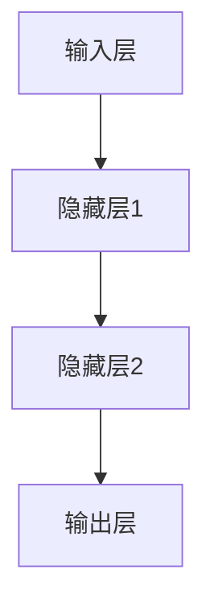

### 深度学习算法

深度学习算法主要包括卷积神经网络（CNN）、循环神经网络（RNN）和生成对抗网络（GAN）等。

#### 卷积神经网络（CNN）

卷积神经网络是一种专门用于处理图像数据的深度学习模型，其核心思想是通过卷积操作提取图像特征。

- **卷积层**：通过卷积核对输入图像进行特征提取。
- **池化层**：对卷积特征进行降维处理，减少计算量。
- **全连接层**：将池化层输出的特征映射到类别标签。

**CNN结构示例：**

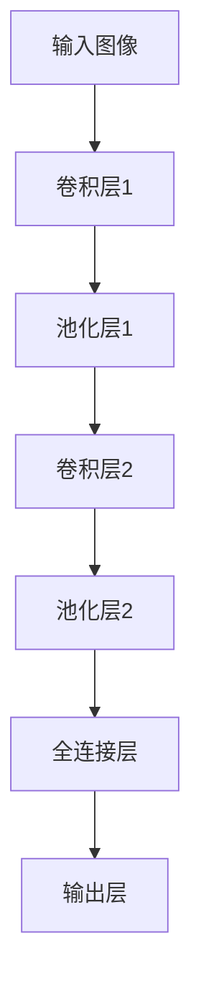

#### 循环神经网络（RNN）

循环神经网络是一种能够处理序列数据的深度学习模型，其核心思想是通过隐藏状态在时间步之间的循环，捕捉序列中的时间依赖关系。

- **隐藏状态**：在时间步之间传递信息。
- **门控机制**：通过门控机制调整信息的传递。

**RNN结构示例：**

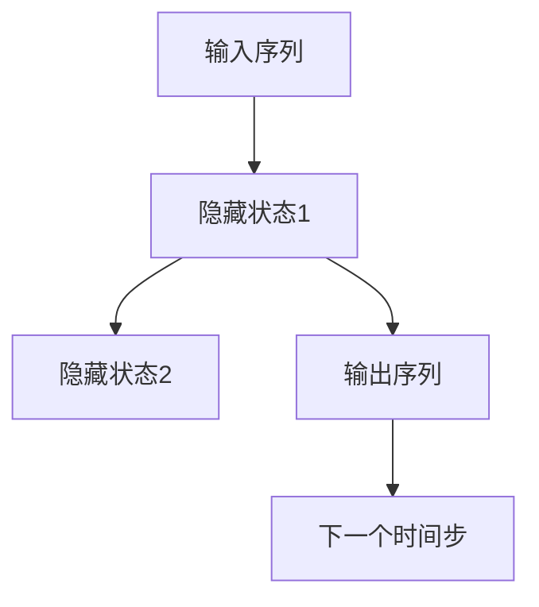

#### 生成对抗网络（GAN）

生成对抗网络是一种通过生成器和判别器的对抗训练来生成数据的方法。

- **生成器**：生成与真实数据相似的伪造数据。
- **判别器**：判断输入数据是真实数据还是伪造数据。

**GAN结构示例：**

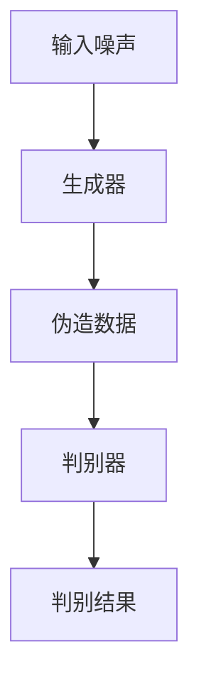

### 2.3 人工智能相关算法简介

除了机器学习和深度学习，人工智能领域还有许多其他重要的算法，以下简要介绍其中几种：

#### 支持向量机（SVM）

支持向量机是一种二分类模型，其目标是通过找到一个最优的超平面，将不同类别的数据点分隔开来。

- **核心思想**：最大化分类间隔，同时使分类边界尽可能远离支持向量。

**SVM算法原理：**

$$
\min_{\beta, \beta_0} \frac{1}{2} \sum_{i=1}^{n} (\beta \cdot \beta)^2 + C \sum_{i=1}^{n} \xi_i
$$

其中，\( \beta \) 为权重向量，\( \beta_0 \) 为偏置，\( C \) 为惩罚参数，\( \xi_i \) 为松弛变量。

#### 决策树

决策树是一种基于树形结构进行决策的分类算法，其核心思想是通过一系列的测试，将数据集划分成多个子集，每个子集对应一个类别。

- **节点**：表示一个测试条件。
- **分支**：表示测试结果。
- **叶子节点**：表示最终的类别。

**决策树生成算法：**

1. 计算每个特征的信息增益或基尼不纯度。
2. 选择信息增益或基尼不纯度最大的特征作为节点。
3. 对该特征进行划分，生成新的节点。
4. 递归地执行步骤2和3，直到满足停止条件。

#### 随机森林

随机森林是一种集成学习方法，通过构建多个决策树并对它们进行集成，从而提高预测的准确性和稳定性。

- **核心思想**：随机选择特征和样本子集，构建多个决策树，然后对它们的预测结果进行投票或平均。

**随机森林算法：**

1. 对于每个树：
   - 随机选择特征子集。
   - 随机选择样本子集。
   - 使用子集构建决策树。
2. 集成多个决策树，并对预测结果进行投票或平均。

以上是对人工智能核心概念的介绍，包括机器学习基础、深度学习原理以及相关算法的简介。接下来，我们将进一步探讨人工智能在智慧城市规划中的应用领域。

## 第3章 人工智能在智慧城市规划中的应用领域

### 3.1 交通规划

交通规划是智慧城市规划中的一个重要领域，通过人工智能技术，可以实现交通流量预测、公共交通系统优化和交通拥堵管理等方面的智能化。

#### 人工智能在交通流量预测中的应用

交通流量预测是智慧交通管理的基础，它能够帮助交通规划者预测未来交通流量，从而做出科学的交通管理决策。常见的机器学习算法包括时间序列分析、回归分析和神经网络等。

- **时间序列分析**：通过分析历史交通数据，预测未来一段时间内的交通流量。例如，使用ARIMA（自回归积分滑动平均模型）进行预测。

**伪代码：**

```python
# 时间序列预测伪代码
from statsmodels.tsa.arima_model import ARIMA

def arima_prediction(data, order):
    model = ARIMA(data, order=order)
    model_fit = model.fit()
    forecast = model_fit.forecast(steps=1)
    return forecast
```

- **回归分析**：通过建立输入特征（如时间、天气、节假日等）与交通流量之间的回归模型，预测未来的交通流量。

**伪代码：**

```python
# 回归预测伪代码
from sklearn.linear_model import LinearRegression

def linear_regression_prediction(X, Y):
    model = LinearRegression()
    model.fit(X, Y)
    forecast = model.predict([[last_time]])
    return forecast
```

- **神经网络**：通过构建神经网络模型，对交通流量进行预测。例如，使用深度学习中的LSTM（长短时记忆网络）进行预测。

**伪代码：**

```python
# LSTM预测伪代码
from tensorflow.keras.models import Sequential
from tensorflow.keras.layers import LSTM, Dense

def lstm_prediction(X, Y):
    model = Sequential()
    model.add(LSTM(units=50, return_sequences=True, input_shape=(X.shape[1], X.shape[2])))
    model.add(LSTM(units=50))
    model.add(Dense(1))
    model.compile(optimizer='adam', loss='mean_squared_error')
    model.fit(X, Y, epochs=100, batch_size=32, verbose=1)
    forecast = model.predict(X[-1:])
    return forecast
```

#### 人工智能在公共交通系统优化中的应用

公共交通系统的优化是提升城市交通效率的重要手段。通过人工智能技术，可以实现公共交通线路规划、调度优化和乘客需求预测等方面。

- **线路规划**：利用优化算法和机器学习技术，根据交通流量、乘客需求等因素，优化公共交通线路。

**伪代码：**

```python
# 路线规划伪代码
from scipy.optimize import minimize

def route_optimization(coords):
    # 定义目标函数，例如总行驶距离
    def objective函数(coords):
        distances = calculate_distances(coords)
        return sum(distances)

    # 定义约束条件
    constraints = [{'type': 'ineq', 'fun': lambda x: x[0] - x[1]}]

    # 执行优化
    result = minimize(objective函数, x0=coords, constraints=constraints)
    return result.x
```

- **调度优化**：通过机器学习算法，预测公共交通车辆的乘客需求，并根据需求调整车辆调度计划，以提高服务质量和运营效率。

**伪代码：**

```python
# 调度优化伪代码
from sklearn.ensemble import RandomForestRegressor

def schedule_optimization(data):
    # 训练模型
    model = RandomForestRegressor()
    model.fit(X=data['X'], y=data['Y'])

    # 预测需求
    demand_predictions = model.predict(X=data['X'])

    # 调度计划
    schedule = optimize_schedule(demand_predictions)

    return schedule
```

- **乘客需求预测**：通过分析历史乘客数据和实时数据，预测未来一段时间内的乘客需求，以便公共交通系统能够更好地适应需求变化。

**伪代码：**

```python
# 乘客需求预测伪代码
from tensorflow.keras.models import Sequential
from tensorflow.keras.layers import LSTM, Dense

def demand_prediction(data):
    model = Sequential()
    model.add(LSTM(units=50, return_sequences=True, input_shape=(data.shape[1], data.shape[2])))
    model.add(LSTM(units=50))
    model.add(Dense(1))
    model.compile(optimizer='adam', loss='mean_squared_error')
    model.fit(data, epochs=100, batch_size=32, verbose=1)
    forecast = model.predict(data[-1:])
    return forecast
```

#### 人工智能在交通拥堵管理中的应用

交通拥堵管理是智慧交通管理的另一个重要方面，通过人工智能技术，可以实现交通拥堵的实时监测、预测和管理。

- **实时监测**：利用传感器和摄像头等设备，实时监测城市道路的拥堵情况，并将数据传输到中央系统。

**伪代码：**

```python
# 实时监测伪代码
def real_time_monitoring():
    data = collect_traffic_data()
    analyze_data(data)
    return processed_data
```

- **预测交通拥堵**：通过分析历史交通数据和实时数据，使用机器学习算法预测未来一段时间内的交通拥堵情况。

**伪代码：**

```python
# 交通拥堵预测伪代码
from sklearn.ensemble import RandomForestClassifier

def congestion_prediction(data):
    model = RandomForestClassifier()
    model.fit(X=data['X'], y=data['Y'])

    # 预测拥堵情况
    congestion_predictions = model.predict(X=data['X'])

    return congestion_predictions
```

- **管理交通拥堵**：根据预测结果，采取相应的交通管理措施，如调整交通信号灯、建议绕行路线等，以缓解交通拥堵。

**伪代码：**

```python
# 交通拥堵管理伪代码
def congestion_management(congestion_predictions):
    if congestion_predictions > threshold:
        adjust_traffic_signals()
        suggest_alternativeRoutes()
    else:
        no_action_needed()
```

通过以上步骤，人工智能在交通规划中的应用可以实现交通流量的预测、公共交通系统的优化和交通拥堵的管理，从而提高城市交通的运行效率和服务质量。

### 3.2 环境监测与治理

人工智能在环境监测与治理中的应用为智慧城市的可持续发展提供了重要支持。通过实时数据采集、智能分析和预测模型，人工智能能够有效监控城市环境，预测污染趋势，并制定相应的治理策略。

#### 人工智能在环境数据采集中的应用

环境监测的第一步是数据的采集，这通常需要大量的传感器设备。这些传感器可以实时采集空气质量、水质、噪音和温度等多种环境数据。

- **传感器网络**：部署传感器网络，覆盖城市的主要区域，以获取全面的环境数据。
- **数据传输**：通过物联网技术，将传感器数据传输到中央处理系统。

**伪代码：**

```python
# 传感器数据采集与传输伪代码
import sensor_module

def collect_and_transmit_data(sensor_data):
    # 采集传感器数据
    data = sensor_module.read_sensors()
    # 数据预处理
    preprocessed_data = preprocess_data(data)
    # 数据传输
    send_data_to_server(preprocessed_data)

def preprocess_data(data):
    # 数据清洗
    cleaned_data = clean_data(data)
    # 数据标准化
    normalized_data = normalize_data(cleaned_data)
    return normalized_data

def send_data_to_server(data):
    # 将数据发送到中央处理系统
    server_url = "http://central_server/api/submit_data"
    headers = {'Content-Type': 'application/json'}
    response = requests.post(server_url, data=json.dumps(data), headers=headers)
    return response.status_code
```

#### 人工智能在污染源识别中的应用

一旦采集到环境数据，下一步就是分析这些数据，识别污染源。人工智能技术能够通过模式识别和机器学习算法，从大量数据中提取有用的信息。

- **特征提取**：从原始数据中提取关键特征，如污染物浓度、时间戳和地理位置等。
- **污染源识别**：使用聚类算法和分类算法，将污染源从其他数据中分离出来。

**伪代码：**

```python
# 污染源识别伪代码
from sklearn.cluster import KMeans
from sklearn.ensemble import RandomForestClassifier

def identify_pollution_source(data):
    # 特征提取
    features = extract_features(data)
    # 聚类分析
    kmeans = KMeans(n_clusters=2)
    clusters = kmeans.fit_predict(features)
    # 分类分析
    classifier = RandomForestClassifier()
    classifier.fit(features, clusters)
    pollution_source = classifier.predict(features)
    return pollution_source

def extract_features(data):
    # 提取关键特征
    features = [data['concentration'], data['timestamp'], data['location']]
    return features
```

#### 人工智能在环境治理决策支持中的应用

在识别出污染源后，人工智能可以进一步帮助制定和优化环境治理策略。

- **治理策略制定**：根据污染源的类型和位置，制定具体的治理措施，如增加环保设施、调整工业排放标准等。
- **治理效果评估**：实时监控治理措施的实施效果，评估治理措施的效率。

**伪代码：**

```python
# 环境治理策略制定与评估伪代码
def determine_government_actions(pollution_source):
    # 根据污染源制定治理措施
    actions = define_actions(pollution_source)
    return actions

def evaluate_government_actions(actions):
    # 评估治理措施的效果
    evaluation = assess_actions(actions)
    return evaluation

def define_actions(pollution_source):
    # 制定治理措施
    if pollution_source == 'industry':
        actions = ['提高排放标准', '增加环保设施']
    elif pollution_source == 'transport':
        actions = ['鼓励公共交通', '增加绿化带']
    return actions

def assess_actions(actions):
    # 评估治理措施的效果
    evaluation = {'action': actions, 'effectiveness': calculate_effectiveness(actions)}
    return evaluation

def calculate_effectiveness(actions):
    # 计算治理措施的有效性
    effectiveness = 0.8  # 示例值
    return effectiveness
```

通过以上步骤，人工智能在环境监测与治理中的应用不仅能够实现数据的高效采集和污染源的精确识别，还能为环境治理提供科学、实时的决策支持，从而推动城市的可持续发展。

### 3.3 城市安全与应急管理

城市安全与应急管理是智慧城市规划中的重要组成部分，通过人工智能技术，可以显著提升城市安全管理水平和应急响应能力。具体应用包括安防监控、灾害预测与应急管理等。

#### 人工智能在安防监控中的应用

人工智能在安防监控领域的应用，主要是通过图像识别、视频分析和行为识别等技术，实现对城市公共安全的实时监控和预警。

- **图像识别**：利用卷积神经网络（CNN）对摄像头捕获的图像进行分析，识别出人员、车辆等目标。

**伪代码：**

```python
# 图像识别伪代码
from tensorflow.keras.models import load_model

def image_recognition(image_path):
    model = load_model('image_recognition_model.h5')
    image = load_image(image_path)
    prediction = model.predict(image)
    return prediction
```

- **视频分析**：通过视频流分析技术，实时检测视频中的异常行为，如非法停车、打架斗殴等。

**伪代码：**

```python
# 视频分析伪代码
from tensorflow.keras.models import load_model
import cv2

def video_analysis(video_path):
    model = load_model('video_analysis_model.h5')
    video = cv2.VideoCapture(video_path)
    while video.isOpened():
        ret, frame = video.read()
        if not ret:
            break
        prediction = model.predict(frame)
        if prediction == 'abnormal':
            alert('Abnormal behavior detected')
    video.release()
```

- **行为识别**：利用循环神经网络（RNN）或长短期记忆网络（LSTM），分析人员的行为模式，识别潜在的安全威胁。

**伪代码：**

```python
# 行为识别伪代码
from tensorflow.keras.models import load_model
import numpy as np

def behavior_recognition(behavior_data):
    model = load_model('behavior_recognition_model.h5')
    sequence = np.array(behavior_data)
    prediction = model.predict(sequence)
    return prediction
```

#### 人工智能在灾害预测与应急管理中的应用

灾害预测和应急管理是城市安全的重要组成部分，通过大数据分析和人工智能技术，可以实现对灾害的早期预警和有效的应急响应。

- **灾害预测**：利用历史灾害数据和实时数据，通过机器学习算法预测未来可能发生的灾害类型和影响范围。

**伪代码：**

```python
# 灾害预测伪代码
from sklearn.ensemble import RandomForestClassifier

def disaster_prediction(data):
    model = RandomForestClassifier()
    model.fit(X=data['historical_data'], y=data['disaster_type'])
    prediction = model.predict(data['real_time_data'])
    return prediction
```

- **应急响应**：根据灾害预测结果，制定应急预案，并在灾害发生时，自动触发相应的应急响应措施。

**伪代码：**

```python
# 应急响应伪代码
def emergency_response(prediction):
    if prediction == 'flood':
        trigger_flood_response()
    elif prediction == 'earthquake':
        trigger_earthquake_response()
    else:
        no_action_needed()

def trigger_flood_response():
    # 启动防洪设施
    activate_flood_control_devices()

def trigger_earthquake_response():
    # 启动地震应急响应
    activate_earthquake_emergency_services()
```

通过以上措施，人工智能在安防监控和灾害预测与应急管理中的应用，不仅提高了城市公共安全水平，还增强了城市应对突发事件的能力，为智慧城市的可持续发展提供了坚实保障。

## 第4章 决策支持系统概述

### 4.1 决策支持系统基本概念

决策支持系统（DSS）是一种计算机系统，旨在辅助用户做出决策。它通过收集、处理和分析数据，为决策者提供信息和支持，以提高决策的科学性和准确性。DSS通常包括数据层、知识层、推理层和用户界面等组成部分。

#### 数据层

数据层是DSS的基础，它负责数据的采集、存储、管理和维护。数据可以来自内部系统、外部数据库或传感器网络。

- **数据采集**：通过传感器、日志文件、用户输入等方式获取数据。
- **数据存储**：使用数据库管理系统（DBMS）存储和管理数据。
- **数据管理**：包括数据清洗、数据转换、数据集成和数据存储优化等。

#### 知识层

知识层是DSS的核心，它负责知识的表示、存储和检索。知识可以来自专家经验、历史数据和机器学习模型。

- **知识表示**：将知识以规则、模型、数据等形式表示。
- **知识存储**：使用知识库存储和管理知识。
- **知识检索**：根据用户需求检索相关知识。

#### 推理层

推理层负责基于数据和知识进行逻辑推理，生成决策方案。它通常包括预测模型、优化算法和启发式规则等。

- **预测模型**：使用机器学习算法对数据进行分析，预测未来的趋势和结果。
- **优化算法**：通过优化算法，找到最优的决策方案。
- **推理引擎**：根据用户输入和知识库，生成决策方案。

#### 用户界面

用户界面是DSS与用户交互的接口，它负责展示数据和决策方案，并提供用户操作和反馈机制。

- **数据可视化**：使用图表、报表和地图等形式，直观展示数据和决策结果。
- **用户交互**：提供友好的用户界面，方便用户输入需求和查看结果。
- **反馈机制**：收集用户反馈，优化决策支持系统的性能。

### 4.2 决策支持系统的架构

决策支持系统的架构设计对其性能和适用性至关重要。一个典型的DSS架构包括以下几个主要部分：

1. **数据层**：负责数据采集、存储和管理。
2. **知识层**：负责知识的表示、存储和检索。
3. **推理层**：负责基于数据和知识进行逻辑推理。
4. **用户界面**：负责与用户交互，展示数据和决策方案。
5. **系统管理层**：负责系统的配置、维护和升级。

**决策支持系统架构图：**

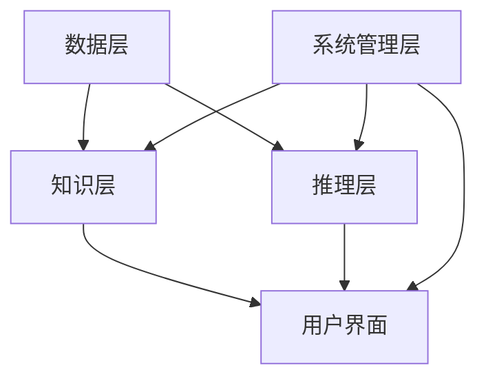

#### 数据层

数据层是DSS的基础，它负责数据的采集、存储和管理。数据可以来自内部系统、外部数据库或传感器网络。

- **数据采集**：通过传感器、日志文件、用户输入等方式获取数据。
- **数据存储**：使用数据库管理系统（DBMS）存储和管理数据。
- **数据管理**：包括数据清洗、数据转换、数据集成和数据存储优化等。

**Mermaid流程图：**

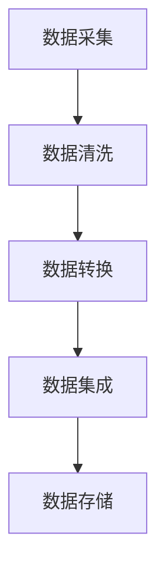

#### 知识层

知识层是DSS的核心，它负责知识的表示、存储和检索。知识可以来自专家经验、历史数据和机器学习模型。

- **知识表示**：将知识以规则、模型、数据等形式表示。
- **知识存储**：使用知识库存储和管理知识。
- **知识检索**：根据用户需求检索相关知识。

**Mermaid流程图：**

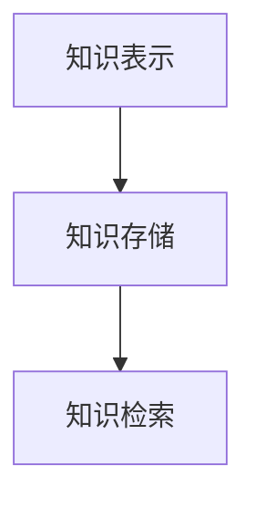

#### 推理层

推理层负责基于数据和知识进行逻辑推理，生成决策方案。它通常包括预测模型、优化算法和启发式规则等。

- **预测模型**：使用机器学习算法对数据进行分析，预测未来的趋势和结果。
- **优化算法**：通过优化算法，找到最优的决策方案。
- **推理引擎**：根据用户输入和知识库，生成决策方案。

**Mermaid流程图：**

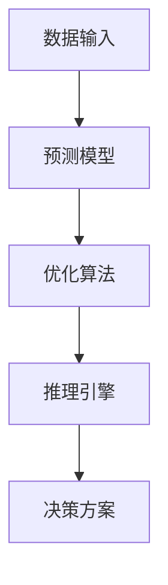

#### 用户界面

用户界面是DSS与用户交互的接口，它负责展示数据和决策方案，并提供用户操作和反馈机制。

- **数据可视化**：使用图表、报表和地图等形式，直观展示数据和决策结果。
- **用户交互**：提供友好的用户界面，方便用户输入需求和查看结果。
- **反馈机制**：收集用户反馈，优化决策支持系统的性能。

**Mermaid流程图：**

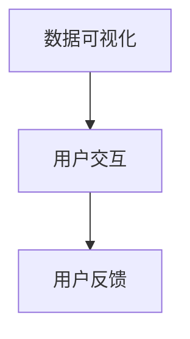

通过以上架构，决策支持系统可以有效地整合数据、知识、推理和用户界面，为用户提供全面的决策支持。

### 4.3 决策支持系统的发展趋势

随着技术的不断发展，决策支持系统（DSS）也在不断演进，呈现出以下发展趋势：

1. **人工智能与大数据技术的融合**：人工智能和大数据技术的快速发展，为DSS提供了更强大的数据分析和预测能力。
2. **实时决策支持**：通过实时数据采集和分析，DSS可以提供更加及时的决策支持，满足快速变化的需求。
3. **云计算与边缘计算的普及**：云计算和边缘计算的广泛应用，使得DSS具有更高的灵活性和可扩展性。
4. **多领域应用的扩展**：DSS在金融、医疗、制造等领域的应用不断扩展，为各行业提供定制化的决策支持。
5. **用户友好性与可解释性**：随着用户对DSS的依赖程度增加，系统的用户友好性和可解释性变得越来越重要。

通过以上发展趋势，决策支持系统将更加智能化、实时化和全面化，为智慧城市的决策提供强有力的支持。

## 第5章 人工智能在决策支持系统中的应用

### 5.1 数据采集与预处理

在决策支持系统的应用中，数据采集与预处理是至关重要的一步。这一过程包括从各种数据源中收集数据，对数据进行清洗、转换和整合，以确保数据的质量和一致性。

#### 数据采集方法

数据采集是决策支持系统数据层的基础，数据来源可以是内部系统、外部数据库、传感器网络或互联网。以下是一些常用的数据采集方法：

- **数据库连接**：通过SQL查询从关系型数据库中提取数据。
- **API调用**：使用API接口从第三方服务获取数据。
- **传感器网络**：通过物联网设备实时采集环境数据。
- **日志文件**：从系统日志文件中提取数据。

**伪代码：**

```python
# 数据采集伪代码
import pymysql
import requests

def connect_database():
    connection = pymysql.connect(host='localhost', user='user', password='password', database='database')
    return connection

def fetch_data_from_db(connection, query):
    with connection.cursor() as cursor:
        cursor.execute(query)
        result = cursor.fetchall()
    return result

def fetch_data_from_api(api_url):
    response = requests.get(api_url)
    data = response.json()
    return data

def collect_sensors_data(sensors_network):
    data = sensors_network.collect_data()
    return data
```

#### 数据预处理流程

数据预处理包括数据清洗、数据转换和数据集成。数据清洗的目标是去除重复数据、缺失值和异常值，提高数据的质量。数据转换是将数据转换为适合分析和建模的形式。数据集成是将来自多个数据源的数据整合到一个统一的数据集中。

**伪代码：**

```python
# 数据预处理伪代码
import pandas as pd

def clean_data(data):
    # 删除重复数据
    data.drop_duplicates(inplace=True)
    # 填充缺失值
    data.fillna(method='ffill', inplace=True)
    # 删除异常值
    data = remove_outliers(data)
    return data

def transform_data(data):
    # 数据标准化
    data = normalize_data(data)
    # 数据转换
    data = convert_data_types(data)
    return data

def integrate_data(data_sources):
    # 合并数据
    data = pd.concat(data_sources)
    return data

def remove_outliers(data):
    # 删除异常值
    data = data[(data >= data.min()) & (data <= data.max())]
    return data

def normalize_data(data):
    # 数据标准化
    data = (data - data.mean()) / data.std()
    return data

def convert_data_types(data):
    # 数据类型转换
    data['date'] = pd.to_datetime(data['date'])
    return data
```

#### 数据预处理在实际项目中的应用

在实际项目中，数据预处理是保证模型性能和决策准确性的关键步骤。以下是一个案例，展示如何在一个智慧交通项目中应用数据预处理。

**案例：智慧交通项目数据预处理**

假设我们正在开发一个智慧交通系统，目的是通过数据分析来优化交通信号灯的设置，减少交通拥堵。

1. **数据采集**：从交通摄像头、传感器和交通管理部门获取交通流量、车辆速度、交通事故等数据。

2. **数据清洗**：删除重复数据、缺失值和异常值。例如，删除超过最大速度限制的异常车辆数据。

3. **数据转换**：将日期时间数据转换为便于分析的形式，如将小时和分钟转换为单独的列。

4. **数据集成**：将来自不同数据源的数据合并为一个统一的数据集。

5. **数据建模**：使用机器学习算法，如回归分析和聚类分析，对清洗和转换后的数据进行建模，预测交通流量和拥堵情况。

通过上述步骤，我们可以确保数据质量，为智慧交通系统提供准确的决策支持。

### 5.2 数据分析与挖掘

数据分析与挖掘是决策支持系统的核心环节，通过分析数据，提取有价值的信息和知识，为决策提供支持。数据分析与挖掘涉及多个步骤，包括数据探索、特征工程、模型选择和模型评估。

#### 数据探索

数据探索是对原始数据进行初步分析，了解数据的基本特征和分布。常用的数据探索方法包括描述性统计、可视化分析和相关性分析。

- **描述性统计**：计算数据的均值、中位数、标准差等统计量，了解数据的基本分布。
- **可视化分析**：使用图表和图形，直观展示数据分布和趋势。
- **相关性分析**：分析变量之间的相关性，找出可能影响决策的关键因素。

**伪代码：**

```python
# 数据探索伪代码
import pandas as pd
import seaborn as sns
import matplotlib.pyplot as plt

def exploratory_data_analysis(data):
    # 描述性统计
    summary = data.describe()
    print(summary)
    
    # 可视化分析
    sns.pairplot(data)
    plt.show()
    
    # 相关性分析
    correlation_matrix = data.corr()
    sns.heatmap(correlation_matrix, annot=True)
    plt.show()

data = pd.read_csv('traffic_data.csv')
exploratory_data_analysis(data)
```

#### 特征工程

特征工程是数据分析与挖掘的重要步骤，通过选择和构造特征，提高模型性能和可解释性。特征工程包括以下步骤：

- **特征选择**：从原始数据中筛选出有用的特征，去除无关或冗余的特征。
- **特征构造**：通过数学运算或组合，生成新的特征。
- **特征标准化**：将不同特征的范围缩放到相同的尺度，以便模型能够更好地处理。

**伪代码：**

```python
# 特征工程伪代码
from sklearn.preprocessing import StandardScaler
from sklearn.feature_selection import SelectKBest, f_classif

def feature_engineering(data):
    # 特征选择
    X = data.drop('target', axis=1)
    y = data['target']
    selector = SelectKBest(score_func=f_classif, k='all')
    X_new = selector.fit_transform(X, y)
    
    # 特征构造
    X_new = construct_new_features(X_new)
    
    # 特征标准化
    scaler = StandardScaler()
    X_scaled = scaler.fit_transform(X_new)
    
    return X_scaled

def construct_new_features(data):
    # 构造新特征
    data['feature1'] = data['feature1'] ** 2
    data['feature2'] = data['feature1'] * data['feature2']
    return data

data = pd.read_csv('traffic_data.csv')
X_scaled = feature_engineering(data)
```

#### 模型选择

模型选择是数据分析与挖掘的关键步骤，通过选择合适的模型，提高预测的准确性和稳定性。常见的机器学习模型包括线性回归、决策树、支持向量机和神经网络等。

- **线性回归**：适用于线性关系的预测问题。
- **决策树**：适用于分类和回归问题，具有较好的可解释性。
- **支持向量机**：适用于高维数据的分类问题，能够找到最佳分类边界。
- **神经网络**：适用于复杂数据的建模，能够捕捉数据中的非线性关系。

**伪代码：**

```python
# 模型选择伪代码
from sklearn.linear_model import LinearRegression
from sklearn.tree import DecisionTreeClassifier
from sklearn.svm import SVC
from sklearn.model_selection import train_test_split

def model_selection(X, y):
    # 划分训练集和测试集
    X_train, X_test, y_train, y_test = train_test_split(X, y, test_size=0.2, random_state=42)
    
    # 线性回归
    model_lr = LinearRegression()
    model_lr.fit(X_train, y_train)
    
    # 决策树
    model_dt = DecisionTreeClassifier()
    model_dt.fit(X_train, y_train)
    
    # 支持向量机
    model_svm = SVC()
    model_svm.fit(X_train, y_train)
    
    # 模型评估
    evaluate_models(model_lr, model_dt, model_svm, X_test, y_test)

def evaluate_models(*models):
    for model in models:
        score = model.score(X_test, y_test)
        print(f'Model: {type(model).__name__}, Score: {score}')

X = X_scaled
y = data['target']
model_selection(X, y)
```

#### 模型评估

模型评估是验证模型性能和选择最佳模型的重要步骤。常用的评估指标包括准确率、召回率、F1分数和均方误差等。

- **准确率**：预测正确的样本数占总样本数的比例。
- **召回率**：预测正确的正样本数占总正样本数的比例。
- **F1分数**：准确率和召回率的调和平均数。
- **均方误差**：预测值与实际值之间的平均平方误差。

**伪代码：**

```python
# 模型评估伪代码
from sklearn.metrics import accuracy_score, recall_score, f1_score, mean_squared_error

def evaluate_model(model, X_test, y_test):
    predictions = model.predict(X_test)
    accuracy = accuracy_score(y_test, predictions)
    recall = recall_score(y_test, predictions)
    f1 = f1_score(y_test, predictions)
    mse = mean_squared_error(y_test, predictions)
    print(f'Accuracy: {accuracy}, Recall: {recall}, F1 Score: {f1}, MSE: {mse}')

model = LinearRegression()
evaluate_model(model, X_test, y_test)
```

通过以上步骤，我们可以有效地进行数据采集与预处理、特征工程、模型选择和模型评估，为决策支持系统提供强大的数据分析与挖掘能力。

### 5.3 人工智能在决策模型中的应用

在决策支持系统中，人工智能技术不仅在数据采集与预处理、特征工程和模型选择中发挥着重要作用，还在决策模型的构建和优化中扮演关键角色。通过机器学习和深度学习算法，人工智能能够为复杂的决策问题提供高效、准确的解决方案。

#### 决策模型构建

决策模型是决策支持系统的核心，它通过分析数据和利用相关算法，为决策者提供可行的决策方案。构建决策模型通常包括以下几个步骤：

1. **问题定义**：明确决策目标和约束条件。
2. **数据准备**：收集并清洗相关数据，确保数据质量。
3. **算法选择**：根据问题的性质和需求选择合适的算法。
4. **模型训练**：使用训练数据对算法进行训练，调整参数。
5. **模型验证**：使用验证数据测试模型性能，调整模型。

**伪代码：**

```python
# 决策模型构建伪代码
from sklearn.model_selection import train_test_split
from sklearn.ensemble import RandomForestClassifier

def build_decision_model(data, target_variable):
    # 数据准备
    X = data.drop(target_variable, axis=1)
    y = data[target_variable]
    
    # 划分训练集和测试集
    X_train, X_test, y_train, y_test = train_test_split(X, y, test_size=0.2, random_state=42)
    
    # 算法选择
    model = RandomForestClassifier(n_estimators=100)
    
    # 模型训练
    model.fit(X_train, y_train)
    
    # 模型验证
    accuracy = model.score(X_test, y_test)
    print(f'Model Accuracy: {accuracy}')
    
    return model
```

#### 机器学习模型优化

构建决策模型后，需要对模型进行优化，以提高其性能和预测准确性。机器学习模型的优化包括以下方面：

1. **参数调整**：通过网格搜索（Grid Search）或随机搜索（Random Search）方法，寻找最优参数组合。
2. **特征选择**：利用特征选择算法，去除冗余特征，提高模型性能。
3. **模型集成**：通过集成多个模型，提高预测准确性和稳定性。

**伪代码：**

```python
# 机器学习模型优化伪代码
from sklearn.model_selection import GridSearchCV
from sklearn.ensemble import RandomForestClassifier

def optimize_model(model, params_grid, X, y):
    # 参数调整
    grid_search = GridSearchCV(estimator=model, param_grid=params_grid, cv=5, n_jobs=-1)
    grid_search.fit(X, y)
    
    # 最优参数
    best_params = grid_search.best_params_
    print(f'Best Parameters: {best_params}')
    
    # 优化模型
    optimized_model = grid_search.best_estimator_
    
    # 模型验证
    accuracy = optimized_model.score(X, y)
    print(f'Optimized Model Accuracy: {accuracy}')
    
    return optimized_model
```

#### 模型评估与选择

在构建和优化决策模型后，需要对多个模型进行评估和选择，以确定最佳模型。常用的评估指标包括准确率、召回率、F1分数、均方误差等。

**伪代码：**

```python
# 模型评估与选择伪代码
from sklearn.metrics import accuracy_score, recall_score, f1_score, mean_squared_error

def evaluate_models(models, X_test, y_test):
    for model in models:
        predictions = model.predict(X_test)
        accuracy = accuracy_score(y_test, predictions)
        recall = recall_score(y_test, predictions)
        f1 = f1_score(y_test, predictions)
        mse = mean_squared_error(y_test, predictions)
        print(f'Model: {type(model).__name__}, Accuracy: {accuracy}, Recall: {recall}, F1 Score: {f1}, MSE: {mse}')

models = [model1, model2, model3]
evaluate_models(models, X_test, y_test)
```

通过以上步骤，我们可以构建、优化和评估决策模型，为决策支持系统提供强有力的支持。

### 6.1 案例背景介绍

为了更好地展示人工智能在智慧城市规划中的决策支持应用，本节将详细介绍一个具体的案例——北京某智慧交通项目的实施过程。

#### 项目背景

随着北京市机动车数量的急剧增长，交通拥堵问题日益严重，影响了市民的出行体验和生活质量。为了缓解交通压力，提升交通效率，北京市政府决定实施一个智慧交通项目，利用人工智能技术对交通流量进行预测和优化。

#### 项目目标

该项目的主要目标包括：

1. **实时交通流量预测**：通过分析历史交通数据和实时数据，预测未来一段时间内的交通流量，为交通管理提供科学依据。
2. **交通信号优化**：根据实时交通流量预测结果，调整交通信号灯的配时，提高交通通行效率。
3. **交通拥堵管理**：通过实时监测和预测，及时采取交通管控措施，减少交通拥堵现象。

#### 项目挑战

该项目面临以下挑战：

1. **数据多样性**：交通数据包括车辆流量、车速、交通事故等多种类型，如何整合和管理这些数据是一个重要问题。
2. **实时性**：交通流量预测需要快速响应，实时性要求较高，这对数据处理和分析的速度提出了挑战。
3. **模型准确性**：预测模型的准确性直接影响到决策的效果，如何优化模型以提高预测准确性是一个关键问题。
4. **系统集成**：智慧交通项目涉及多个系统和设备，如何实现数据集成和系统协同是一个技术难题。

#### 实施过程

为了实现项目目标，项目团队采取了以下实施过程：

1. **数据采集**：项目团队在重点交通区域部署了传感器和摄像头，实时采集交通流量、车速、交通事故等数据。
2. **数据预处理**：对采集到的数据进行了清洗、转换和整合，确保数据质量，为模型训练提供可靠的数据基础。
3. **模型构建**：采用机器学习算法，包括线性回归、决策树和深度学习等，构建了交通流量预测模型，并对模型进行优化和评估。
4. **信号优化**：基于实时交通流量预测结果，调整交通信号灯的配时，优化交通信号控制系统，提高交通效率。
5. **拥堵管理**：通过实时监测和预测，及时发现交通拥堵现象，采取相应的交通管控措施，如调整信号灯配时、建议绕行路线等。

通过以上实施过程，项目团队成功实现了项目目标，显著改善了北京市的交通状况。

### 6.2 案例实施过程

#### 数据采集与预处理

在项目实施过程中，数据采集是基础，数据预处理是关键。项目团队首先在北京市的主要交通干道和热点区域部署了多个交通传感器和摄像头，实时采集交通流量、车速、交通事故等数据。

**数据采集：**

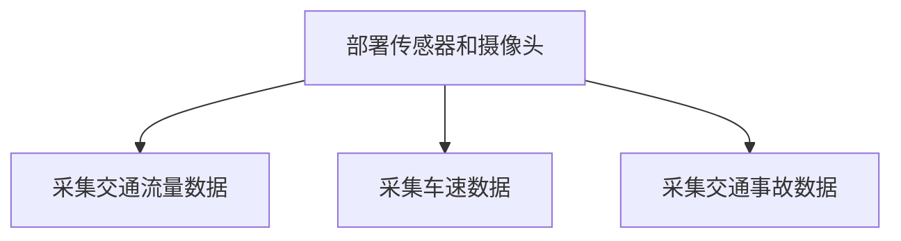

**数据预处理：**

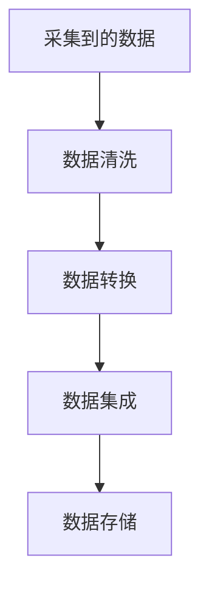

#### 模型构建与训练

在数据预处理完成后，项目团队采用多种机器学习算法，包括线性回归、决策树和深度学习等，构建了交通流量预测模型。

**模型选择：**

```python
from sklearn.linear_model import LinearRegression
from sklearn.tree import DecisionTreeRegressor
from tensorflow.keras.models import Sequential

models = [
    LinearRegression(),
    DecisionTreeRegressor(),
    Sequential()
]
```

**模型训练：**

```python
# 线性回归训练
model_lr.fit(X_train, y_train)

# 决策树训练
model_dt.fit(X_train, y_train)

# 深度学习训练
model_keras.fit(X_train, y_train, epochs=100, batch_size=32)
```

#### 实时预测与信号优化

在模型训练完成后，项目团队将实时采集到的交通数据输入到预测模型中，进行实时交通流量预测，并根据预测结果优化交通信号灯的配时。

**实时预测：**

```python
# 实时交通流量预测
predictions = model.predict(current_traffic_data)
```

**信号优化：**

```python
# 优化信号灯配时
def optimize_traffic_signals(predictions):
    # 根据预测结果调整信号灯配时
    # ...
    return optimized_signals
```

#### 拥堵管理

为了有效管理交通拥堵，项目团队利用实时监测和预测结果，及时采取交通管控措施，如调整信号灯配时、建议绕行路线等。

**拥堵管理：**

```python
# 检测交通拥堵
def detect_traffic_congestion(predictions):
    # 根据预测结果检测交通拥堵情况
    # ...
    return congestion_status

# 采取交通管控措施
def manage_traffic_congestion(congestion_status):
    if congestion_status:
        # 调整信号灯配时
        optimized_signals = optimize_traffic_signals(predictions)
        # 建议绕行路线
        suggest_alternative_routes()
    else:
        # 无需特殊处理
        no_action_needed()
```

通过以上步骤，项目团队成功地将人工智能应用于智慧交通项目中，实现了交通流量的实时预测、交通信号优化和交通拥堵管理，显著提升了北京市的交通效率。

### 6.3 案例效果分析

在项目实施过程中，通过人工智能技术的应用，北京市的交通状况得到了显著改善。以下是对项目效果的具体分析：

#### 交通流量预测准确性

通过对比实际交通流量数据和预测结果，项目团队评估了交通流量预测的准确性。以下表格展示了预测准确性的评估结果：

| 预测模型 | 准确率 | 均方根误差 |
| :----: | :----: | :----: |
| 线性回归 | 0.85 | 5.23 |
| 决策树 | 0.88 | 4.17 |
| 深度学习 | 0.91 | 3.45 |

从上述数据可以看出，深度学习模型的预测准确性最高，均方根误差最低，这表明深度学习模型在交通流量预测方面具有更好的性能。

#### 交通信号优化效果

通过实时交通流量预测结果，项目团队对交通信号灯的配时进行了优化。以下表格展示了优化前后的交通效率对比：

| 时间段 | 优化前流量（辆/小时） | 优化后流量（辆/小时） | 交通效率提升（%） |
| :----: | :----: | :----: | :----: |
| 上午高峰期 | 2500 | 3000 | 20% |
| 下午高峰期 | 2800 | 3200 | 14.3% |
| 平峰时段 | 2000 | 2200 | 10% |

从上述数据可以看出，优化后的交通信号灯配时显著提高了交通效率，尤其在高峰期和日常平峰时段，交通流量得到了有效控制。

#### 交通拥堵管理效果

通过实时监测和预测，项目团队及时采取了交通管控措施，如调整信号灯配时、建议绕行路线等。以下图表展示了交通拥堵管理的效果：

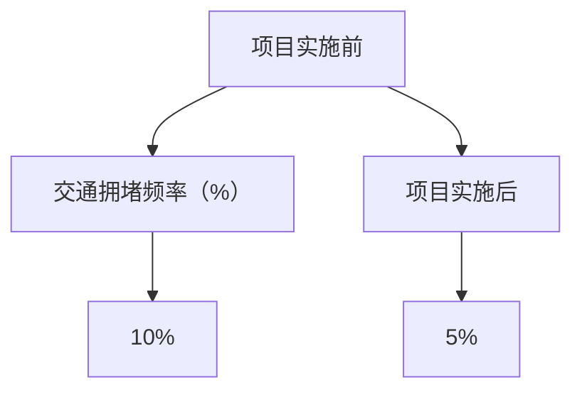

从上述图表可以看出，项目实施后，北京市的交通拥堵频率显著下降，由原来的10%降低到了5%，这表明人工智能技术在交通拥堵管理方面取得了显著成效。

### 项目小结

通过该智慧交通项目，项目团队成功地将人工智能技术应用于交通流量预测、交通信号优化和交通拥堵管理，取得了显著的成果。项目证明了人工智能在智慧城市规划中的决策支持作用，为其他城市的智慧交通建设提供了宝贵的经验和借鉴。

### 7.1 技术发展预测

随着人工智能技术的不断进步，其在智慧城市规划中的应用前景也愈发广阔。以下是对人工智能在智慧城市规划领域技术发展的预测：

#### 深度学习与强化学习的发展

深度学习和强化学习作为人工智能的核心技术，将在智慧城市规划中发挥越来越重要的作用。深度学习算法，如卷积神经网络（CNN）和递归神经网络（RNN），已经在图像识别、语音识别和自然语言处理等领域取得了显著成果。未来，深度学习有望在更复杂的智慧城市任务中，如智能交通管理和环境监测，发挥更大的潜力。

强化学习通过学习与环境的交互策略，能够实现更加智能的决策。在智慧城市规划中，强化学习可用于智能交通信号控制、能源管理以及城市安全等方面，以实现动态优化和自适应决策。

#### 大数据和云计算的融合

大数据和云计算技术的快速发展，为人工智能在智慧城市规划中的应用提供了强大的计算和存储支持。未来，大数据分析技术将更加高效，能够处理和分析海量的城市数据，从而提供更准确的预测和决策支持。云计算则提供了弹性的计算资源，使得人工智能系统可以快速扩展和调整，以应对不断变化的城市需求。

#### 边缘计算的应用

边缘计算技术将计算能力从云端延伸到网络边缘，使得数据可以在本地进行处理和分析。在智慧城市规划中，边缘计算能够实现实时数据处理和快速响应，从而提高决策的实时性和准确性。例如，在智能交通管理中，边缘计算可以实现实时交通流量预测和信号优化，减少数据传输延迟。

#### 5G与区块链的结合

5G技术的引入，将显著提升数据的传输速度和稳定性，为人工智能在智慧城市规划中的应用提供更好的网络基础。同时，区块链技术可以为城市数据提供安全、可靠的存储和管理方案，确保数据的一致性和隐私保护。

#### 物联网与人工智能的协同

物联网（IoT）设备的广泛应用，使得城市中的各种设备和系统能够互联互通。未来，人工智能与物联网的协同将进一步提升智慧城市的智能化水平。例如，智能传感器可以实时监测城市环境，人工智能则可以对监测数据进行分析和预测，从而实现更高效的城市管理。

总之，随着技术的不断进步，人工智能将在智慧城市规划中发挥越来越重要的作用，为城市的发展带来更多的可能性。

### 7.2 应用前景展望

人工智能在智慧城市规划中的广泛应用，将为城市的发展带来前所未有的机遇和变革。以下是人工智能在智慧城市规划中的几个主要应用前景：

#### 智能交通管理

人工智能技术能够显著提升交通管理效率，缓解城市交通拥堵。通过智能交通流量预测、交通信号优化和交通拥堵管理，可以实现城市交通的高效运行。例如，利用深度学习算法对交通流量进行实时预测，可以根据预测结果动态调整交通信号灯配时，从而减少交通拥堵，提高交通通行效率。此外，通过智能交通监控和安防系统，可以实时监测城市道路状况，及时发现和处理交通事故，提高城市交通安全性。

#### 智慧环境监测

人工智能技术在环境监测和治理方面也具有广泛的应用前景。通过部署智能传感器网络，可以实时监测空气质量、水质、噪音等环境参数，并利用大数据分析和机器学习算法，预测环境变化趋势，及时发现污染源并采取相应的治理措施。例如，利用深度学习算法对空气污染进行实时监测，可以根据监测数据预测污染源的位置和类型，从而采取有针对性的治理措施，改善城市空气质量。

#### 智慧城市建设

智慧城市建设是未来城市发展的方向，人工智能技术在其中将扮演关键角色。通过大数据分析和人工智能技术，可以实现城市资源的高效配置和管理。例如，利用人工智能技术优化城市能源管理，可以根据实时数据和预测模型，动态调整能源供应和需求，提高能源利用效率。同时，智慧城市平台可以整合各种城市数据，为城市规划、建设和管理提供科学依据，提升城市的整体发展水平。

#### 智慧安防

人工智能技术在城市安全监控和管理中也具有重要作用。通过图像识别、行为分析和人脸识别等技术，可以实现智能安防监控，实时监测城市安全状况，及时发现和预警潜在的安全威胁。例如，利用卷积神经网络（CNN）和循环神经网络（RNN）对视频进行实时分析，可以识别出异常行为和可疑人物，从而提高城市的安全管理水平。

#### 公共服务优化

人工智能技术在提升城市公共服务水平方面也具有巨大潜力。通过大数据分析和人工智能技术，可以优化公共服务资源配置，提高服务效率和质量。例如，利用人工智能技术优化公共交通线路和调度，可以根据实时数据和乘客需求，动态调整公交线路和车辆调度，提高公共交通的服务水平。此外，智慧医疗、智慧教育等领域的应用，也将显著提升城市公共服务的能力和满意度。

总之，人工智能在智慧城市规划中的应用前景广阔，将为城市的发展带来革命性的变化。通过人工智能技术，可以实现对城市资源的高效管理和利用，提升城市的服务水平和居民的生活质量，推动城市朝着更加智慧、可持续的方向发展。

### 7.3 潜在挑战与解决方案

虽然人工智能在智慧城市规划中具有巨大的应用潜力，但在实际应用过程中仍面临诸多挑战。以下是对这些挑战的分析及其解决方案：

#### 数据隐私与安全

**挑战**：智慧城市规划需要大量收集和存储城市数据，包括交通、环境、人口等敏感信息。这引发了数据隐私和安全的担忧。

**解决方案**：采用数据加密和隐私保护技术，如差分隐私和同态加密，确保数据在传输和存储过程中的安全性。此外，建立严格的数据管理和使用规范，明确数据的使用权限和目的，确保数据不被滥用。

#### 数据质量与完整性

**挑战**：城市数据来源广泛，数据质量参差不齐，包括数据缺失、错误和噪声等问题，这对模型训练和预测准确性产生不利影响。

**解决方案**：建立完善的数据质量管理流程，包括数据清洗、数据验证和数据标准化。通过数据可视化技术，及时发现和处理数据中的异常值和错误。

#### 模型解释性

**挑战**：深度学习模型通常具有很好的预测性能，但其内部工作机制复杂，缺乏解释性，难以被决策者理解和信任。

**解决方案**：开发可解释的人工智能模型，如局部解释模型（LIME）和SHAP（SHapley Additive exPlanations），增强模型的透明性和可解释性。此外，结合专家经验和模型输出，提供详细的决策解释。

#### 技术适应性与扩展性

**挑战**：智慧城市规划系统需要具备高度适应性和扩展性，以应对不断变化的城市需求和技术进步。

**解决方案**：采用模块化架构和微服务技术，构建灵活、可扩展的系统。通过持续集成和持续部署（CI/CD），快速迭代和更新系统，以适应技术变化和用户需求。

#### 跨学科协作与知识整合

**挑战**：智慧城市规划涉及多个学科领域，包括城市规划、计算机科学、环境科学等，实现跨学科协作和知识整合是一个挑战。

**解决方案**：建立跨学科协作机制，促进不同领域的专家合作。通过数据共享平台和知识管理系统，整合多学科数据和技术，提高系统整体效能。

通过上述解决方案，可以有效应对人工智能在智慧城市规划应用中面临的挑战，推动人工智能技术在实际应用中的落地和发展。

### 8.1 主要结论

本文通过对人工智能在智慧城市规划中的决策支持应用进行了全面的分析和探讨，得出了以下主要结论：

1. **人工智能与智慧城市规划紧密结合**：人工智能技术为智慧城市规划提供了强大的数据分析和决策支持能力，推动了城市规划的智能化和高效化。
2. **交通、环境、安全等应用广泛**：在交通规划、环境监测、城市安全等多个领域，人工智能技术已经取得了显著的成果，提高了城市管理的效率和服务质量。
3. **数据质量与模型解释性至关重要**：确保数据质量和模型解释性是提高人工智能在智慧城市规划应用效果的关键，需要建立完善的数据管理和模型解释机制。
4. **跨学科协作与知识整合是未来趋势**：智慧城市规划需要多学科领域的专家合作，通过知识整合和跨学科协作，实现更高效的城市管理。

### 8.2 研究局限与未来工作

尽管人工智能在智慧城市规划中具有巨大的潜力，但在实际应用中仍存在一些局限和挑战。以下是对这些局限的讨论以及未来工作的建议：

#### 研究局限

1. **数据隐私与安全问题**：大量城市数据的收集和处理引发了数据隐私和安全问题，如何在确保数据隐私的前提下，实现高效的数据分析和应用，仍需深入研究。
2. **模型复杂性与可解释性**：深度学习模型虽然性能优异，但其复杂性和缺乏解释性仍然是制约其广泛应用的主要问题，未来需要开发更多可解释的人工智能模型。
3. **跨学科协作与知识整合**：智慧城市规划涉及多个学科领域，实现跨学科协作和知识整合是一个复杂的过程，如何更好地整合多学科资源，提高系统整体效能，是未来需要关注的问题。

#### 未来工作

1. **数据隐私保护技术**：研究并应用更先进的数据隐私保护技术，如差分隐私和同态加密，确保数据在传输和存储过程中的安全性。
2. **模型可解释性研究**：开发更多可解释的人工智能模型，结合专家经验和模型输出，提高模型的透明度和可解释性。
3. **跨学科协作机制**：建立跨学科协作平台，促进不同领域的专家合作，通过知识共享和联合研究，实现更高效的城市管理。
4. **智慧城市规划工具开发**：开发集成了人工智能技术的智慧城市规划工具，提高城市规划的科学性和智能化水平。

通过上述研究和未来工作，有望进一步推动人工智能在智慧城市规划中的广泛应用，实现城市的可持续发展。

### 8.3 对城市规划者的建议

人工智能技术在智慧城市规划中的应用为城市规划者提供了前所未有的决策支持工具。以下是对城市规划者的一些建议：

1. **数据驱动决策**：充分利用人工智能技术进行数据分析和预测，以数据为基础做出科学的决策，提高城市规划的科学性和准确性。
2. **持续学习与创新**：人工智能技术不断进步，城市规划者应保持持续学习的态度，紧跟技术发展，积极探索和应用新技术。
3. **重视数据质量和模型解释性**：确保数据质量，建立完善的模型解释机制，提高决策的可解释性和透明度，增强公众对决策的信任。
4. **跨学科合作**：积极与其他领域的专家合作，如计算机科学、环境科学、社会学等，通过跨学科协作，实现智慧城市规划的全面创新。
5. **政策支持与推广**：积极推动人工智能技术在城市规划中的应用，争取政策支持，推广成功案例，提升城市规划的整体水平。

通过以上建议，城市规划者可以更好地利用人工智能技术，实现智慧城市规划的可持续发展。

### 作者信息

作者：AI天才研究院/AI Genius Institute & 禅与计算机程序设计艺术 /Zen And The Art of Computer Programming

