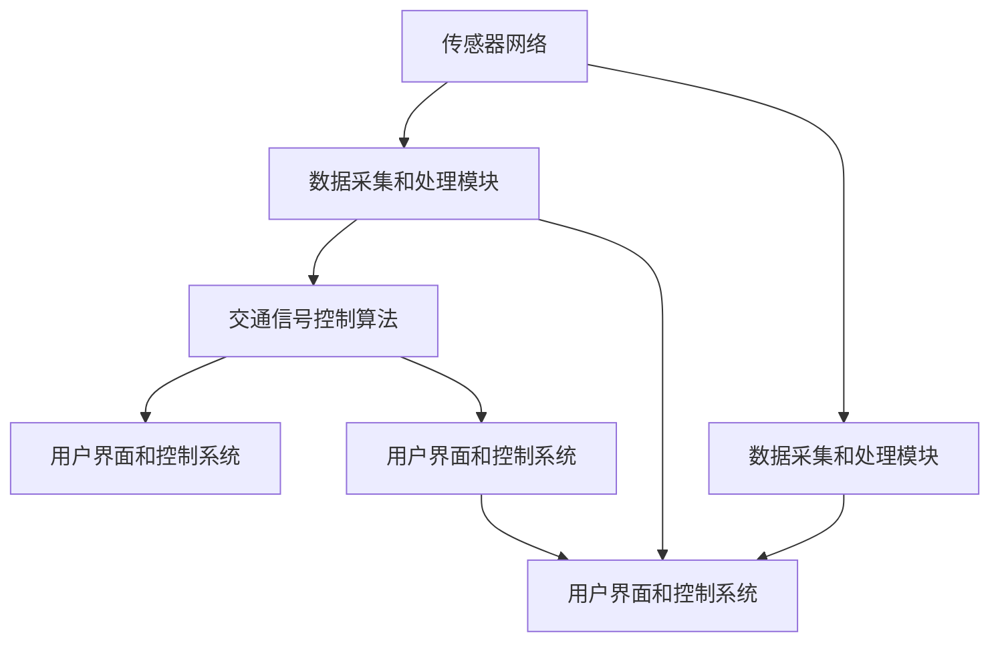
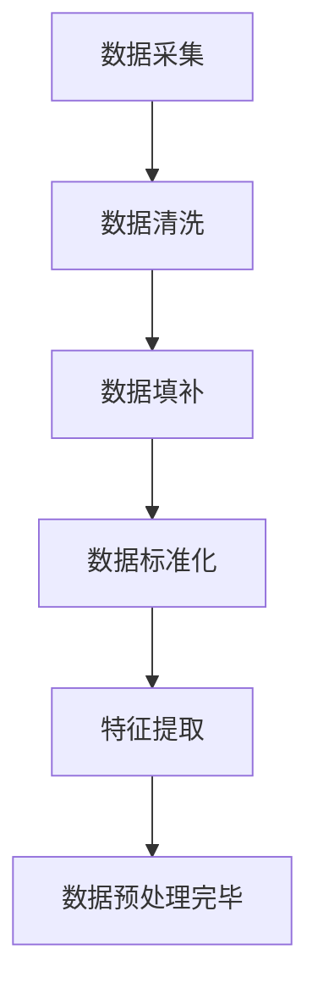
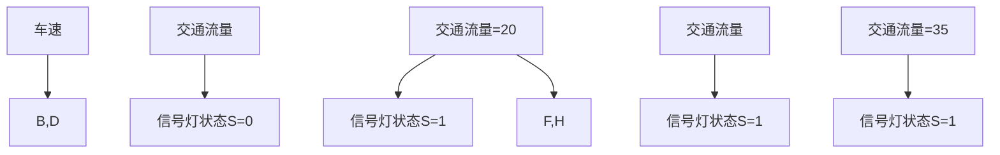

                 

### 背景介绍

在现代城市中，交通拥堵已成为一个普遍且严重的问题。随着城市化进程的加快和汽车拥有量的增加，传统的交通信号控制系统已经难以满足日益增长的交通需求。这不仅导致了大量的时间和能源浪费，还对环境造成了严重影响，并增加了交通事故的风险。

智能交通信号控制系统（Intelligent Transportation Signal Control System，ITSCS）的出现为解决这些问题提供了一种创新的解决方案。智能交通信号控制系统利用人工智能（Artificial Intelligence，AI）技术，通过实时数据采集、处理和分析，实现交通信号控制的智能化。与传统信号控制系统相比，智能交通信号控制系统能够根据实时交通状况动态调整信号配时，从而提高交通流的效率和安全性。

人工智能在交通领域的应用不仅限于智能交通信号控制，还涉及自动驾驶、智能导航、交通流量预测等多个方面。然而，本文将聚焦于人工智能在智能交通信号控制中的应用，探讨其核心概念、算法原理、应用案例以及未来发展趋势。

本文的目标是为读者提供一个全面而深入的视角，了解人工智能在智能交通信号控制中的具体应用，包括其技术原理、实际案例以及面临的挑战和未来发展方向。通过本文的阅读，读者将能够：

1. 理解智能交通信号控制系统的基础概念和关键组成部分。
2. 掌握人工智能算法在交通信号控制中的应用原理。
3. 分析智能交通信号控制系统的实际应用案例。
4. 预见人工智能在智能交通信号控制中未来的发展趋势。

接下来，我们将深入探讨智能交通信号控制系统的基础概念和组成部分，为后续章节的内容打下坚实的基础。

### 智能交通信号控制系统的基本概念

智能交通信号控制系统（Intelligent Transportation Signal Control System，简称ITSCS）是一种基于人工智能技术的交通管理系统，旨在通过实时数据采集、处理和分析，优化交通信号控制，提高道路通行效率和安全性。智能交通信号控制系统的核心是能够根据实时交通流量和状况，动态调整交通信号灯的配时，从而减少拥堵、提高道路通行能力。

#### 核心组成部分

智能交通信号控制系统主要由以下几个核心组成部分构成：

1. **传感器网络**：传感器网络是智能交通信号控制系统的“眼睛”和“耳朵”。它通过安装在不同位置的红外线、摄像头、雷达、磁传感器等设备，实时采集道路上的车辆流量、速度、密度、停车状态等数据。

2. **数据采集和处理模块**：数据采集和处理模块负责接收传感器网络采集到的数据，并进行清洗、预处理和特征提取。这一模块通常包括边缘计算单元和云计算平台，以实现高效的数据处理和分析。

3. **交通信号控制算法**：交通信号控制算法是智能交通信号控制系统的“大脑”，负责根据采集到的交通数据，实时计算和调整信号灯的配时。常用的算法包括基于规则的算法、机器学习算法和深度学习算法。

4. **用户界面和控制系统**：用户界面和控制系统用于展示交通信号控制的结果，并提供用户交互接口，以便交通管理人员对系统进行监控和调整。

#### 基本原理

智能交通信号控制系统的基本原理可以概括为以下几个步骤：

1. **数据采集**：通过传感器网络，实时采集交通流量、速度、密度等数据。

2. **数据处理**：对采集到的数据进行分析、清洗和特征提取，形成可用于信号控制决策的数据。

3. **信号控制决策**：根据交通数据，通过算法模型计算最佳的信号灯配时方案。

4. **信号灯控制**：根据决策结果，调整信号灯的状态，以优化交通流。

5. **结果反馈和调整**：通过用户界面，实时展示信号控制的效果，并根据反馈进行系统的调整和优化。

#### 关键组成部分之间的关系架构

为了更好地理解智能交通信号控制系统的运作机制，我们可以用Mermaid流程图来描述其核心组成部分之间的关系。以下是智能交通信号控制系统的Mermaid流程图：



在这个流程图中，传感器网络负责采集数据，数据采集和处理模块对数据进行清洗和特征提取，交通信号控制算法根据处理后的数据生成信号控制策略，最后用户界面和控制系统将控制结果展示给用户，并接收用户的反馈，以便进行进一步的调整和优化。

通过上述描述，我们可以清晰地看到智能交通信号控制系统的基本概念和组成，以及它们之间的相互作用关系。在接下来的章节中，我们将深入探讨人工智能算法在智能交通信号控制中的应用，进一步理解如何利用这些算法优化交通信号控制。

### 人工智能算法在交通信号控制中的应用

在智能交通信号控制系统中，人工智能算法扮演着至关重要的角色。这些算法通过分析实时交通数据，提供优化信号控制的策略，从而提升交通流动效率。以下是几种主要的人工智能算法在交通信号控制中的应用：

#### 决策树算法

决策树（Decision Tree）是一种常用的机器学习算法，其结构如一棵树，每个内部节点表示一个特征（如交通流量、速度等），每个分支代表该特征的不同取值，每个叶子节点代表一个决策结果（如信号灯状态）。决策树算法通过多次迭代计算，从历史数据中学习到最优的信号控制策略。

**原理**：决策树算法的核心在于将交通信号控制的复杂问题分解为一系列简单的问题。通过对历史数据的训练，算法能够识别出不同交通状况下最优的信号配时方案。

**示例代码**：

```python
# 假设我们有一个简单的决策树模型，输入为交通流量和车速
from sklearn.tree import DecisionTreeClassifier
import numpy as np

# 历史数据
X = np.array([[10, 20], [30, 40], [50, 70]])  # 交通流量和车速
y = np.array([0, 1, 1])  # 信号灯状态（0表示绿灯，1表示红灯）

# 创建决策树模型
clf = DecisionTreeClassifier()

# 训练模型
clf.fit(X, y)

# 预测信号灯状态
prediction = clf.predict([[15, 25]])  # 预测新数据
print(prediction)  # 输出预测结果
```

**数学模型**：决策树算法主要基于信息熵和信息增益来选择最优特征和划分节点。其公式为：

$$
G(D) = -\sum_{i} p_i \log_2 p_i
$$

其中，\( G(D) \) 是信息熵，\( p_i \) 是在特征 \( i \) 下不同类别的概率。

#### 支持向量机算法

支持向量机（Support Vector Machine，SVM）是一种监督学习算法，用于分类和回归问题。在交通信号控制中，SVM可以用于分类交通流量数据，从而预测最优的信号灯状态。

**原理**：SVM通过最大化分类边界，找到一个最佳的超平面，将不同类别的交通流量数据分开。支持向量是那些位于分类边界上的数据点，对分类边界有重要影响。

**示例代码**：

```python
# 假设我们有一个SVM模型，输入为交通流量和车速
from sklearn.svm import SVC
import numpy as np

# 历史数据
X = np.array([[10, 20], [30, 40], [50, 70]])  # 交通流量和车速
y = np.array([0, 1, 1])  # 信号灯状态（0表示绿灯，1表示红灯）

# 创建SVM模型
clf = SVC()

# 训练模型
clf.fit(X, y)

# 预测信号灯状态
prediction = clf.predict([[15, 25]])  # 预测新数据
print(prediction)  # 输出预测结果
```

**数学模型**：SVM的核心是求解一个二次规划问题，其目标是最小化分类边界上的误差：

$$
\min_{\mathbf{w}} \frac{1}{2} ||\mathbf{w}||^2 + C \sum_{i=1}^{n} \xi_i
$$

其中，\( \mathbf{w} \) 是权重向量，\( C \) 是正则化参数，\( \xi_i \) 是误差项。

#### 深度学习算法

深度学习算法，特别是神经网络，在交通信号控制中的应用越来越广泛。通过多层神经网络，可以提取交通数据中的高级特征，实现更复杂的信号控制策略。

**原理**：深度学习算法通过多层神经元网络结构，逐层提取交通数据中的特征，直到达到所需的预测精度。常用的深度学习架构包括卷积神经网络（CNN）和递归神经网络（RNN）。

**示例代码**：

```python
# 假设我们使用Keras框架构建一个简单的卷积神经网络模型
from keras.models import Sequential
from keras.layers import Dense, Conv2D, Flatten
import numpy as np

# 历史数据（假设为图像数据）
X = np.array([[10, 20], [30, 40], [50, 70]])  # 交通流量和车速
y = np.array([0, 1, 1])  # 信号灯状态（0表示绿灯，1表示红灯）

# 创建深度学习模型
model = Sequential()
model.add(Conv2D(32, (3, 3), activation='relu', input_shape=(2, 1)))
model.add(Flatten())
model.add(Dense(1, activation='sigmoid'))

# 编译模型
model.compile(optimizer='adam', loss='binary_crossentropy', metrics=['accuracy'])

# 训练模型
model.fit(X, y, epochs=10)

# 预测信号灯状态
prediction = model.predict([[15, 25]])  # 预测新数据
print(prediction)  # 输出预测结果
```

**数学模型**：深度学习算法的核心是前向传播和反向传播。前向传播通过输入数据逐层计算，直到输出层得到预测结果。反向传播则通过计算误差，反向更新各层的权重，以达到优化模型的目的。

$$
\begin{aligned}
\delta_l &= \frac{\partial C}{\partial \mathbf{w}} \\
\mathbf{w} &= \mathbf{w} - \alpha \frac{\partial C}{\partial \mathbf{w}}
\end{aligned}
$$

其中，\( \delta_l \) 是误差梯度，\( \mathbf{w} \) 是权重，\( \alpha \) 是学习率。

通过上述人工智能算法的应用，我们可以看到智能交通信号控制系统在交通流量优化方面的潜力。在接下来的章节中，我们将进一步探讨数据采集与处理技术，为智能交通信号控制提供坚实的基础。

### 数据采集与处理技术

智能交通信号控制系统的成功离不开高效的数据采集与处理技术。数据采集和处理模块负责从传感器网络中获取实时交通数据，并对这些数据进行清洗、预处理和特征提取，以生成用于信号控制决策的高质量数据。

#### 数据采集

数据采集是智能交通信号控制系统的第一步。传感器网络部署在道路的不同位置，包括红外线、摄像头、雷达、磁传感器等设备，这些设备实时监测交通流量、速度、密度、停车状态等信息。以下是几种常用的数据采集方法：

1. **交通流量监测**：通过红外线传感器或摄像头，可以检测通过特定路段的车辆数量。这些传感器通常安装在路侧或桥梁上，能够24小时不间断地工作。

2. **速度监测**：雷达传感器可以测量车辆的速度。这些传感器通常安装在交通信号灯附近，用于检测车辆的实时速度。

3. **停车状态监测**：摄像头可以用于检测停车状态。通过图像识别技术，可以判断特定停车位是否被占用，从而帮助交通信号控制系统更好地管理停车需求。

#### 数据预处理

数据预处理是数据采集后的重要步骤，旨在去除噪声、填补缺失值、标准化数据等，以提高数据质量。以下是几种常见的数据预处理方法：

1. **数据清洗**：去除重复数据、缺失数据和异常值，确保数据的一致性和可靠性。

2. **数据填补**：对于缺失的数据，可以使用均值填补、中值填补或插值等方法进行填补，以确保数据完整性。

3. **数据标准化**：将不同特征的数据范围统一，便于算法处理。常用的标准化方法包括最小-最大标准化和Z-Score标准化。

#### 数据特征提取

特征提取是数据预处理后的关键步骤，旨在从原始数据中提取对信号控制有用的信息。以下是几种常见的特征提取方法：

1. **时间序列特征**：包括交通流量、速度、停车状态等的时间序列数据。这些特征可以用来分析交通流的动态变化。

2. **静态特征**：包括交通流量、速度、停车状态的统计特征，如均值、方差、标准差等。这些特征可以帮助理解交通流的静态特性。

3. **空间特征**：包括车辆的位置、密度等信息。这些特征可以用来分析交通流的空间分布。

#### Mermaid流程图

为了更好地理解数据采集与处理技术，我们使用Mermaid流程图展示其关键步骤。以下是数据采集与处理技术的Mermaid流程图：



在这个流程图中，数据采集模块首先采集交通数据，然后经过数据清洗、数据填补、数据标准化和特征提取等步骤，最终生成用于信号控制决策的数据。

通过上述数据采集与处理技术，智能交通信号控制系统能够获得高质量的数据，为后续的信号控制算法提供坚实的基础。在下一章节中，我们将探讨决策树和SVM等核心算法在智能交通信号控制中的应用。

### 决策树算法在智能交通信号控制中的应用

决策树（Decision Tree）是一种常见的机器学习算法，因其直观的树形结构和易解释性，在智能交通信号控制中得到了广泛应用。决策树通过一系列规则将交通信号控制问题划分为多个简单的决策路径，从而实现信号控制的自动化。

#### 算法原理

决策树算法通过反复划分数据集，将原始数据逐步拆解为子集，每个节点代表一个特征，每个分支代表该特征的不同取值。最终，每个叶子节点代表一个决策结果，例如信号灯的状态。以下是决策树算法的核心步骤：

1. **特征选择**：通过计算特征的重要性，选择一个最优特征进行划分。常用的特征选择方法包括信息增益（Information Gain）、基尼不纯度（Gini Impurity）和熵（Entropy）。

2. **节点划分**：根据所选特征，将数据集划分为多个子集。每个子集代表一种可能的交通状况。

3. **重复划分**：对每个子集再次进行特征选择和划分，直到达到某个停止条件，如最大深度或最小节点大小。

4. **生成决策树**：将所有的划分结果连接起来，形成一个决策树。树的每个节点代表一个特征划分，每个分支代表该特征的不同取值，每个叶子节点代表一个决策结果。

#### 示例代码

下面我们使用Python的scikit-learn库构建一个简单的决策树模型，以预测交通信号灯的状态。

```python
# 导入必要的库
from sklearn.tree import DecisionTreeClassifier
from sklearn.model_selection import train_test_split
from sklearn.metrics import accuracy_score

# 假设我们有以下训练数据
X = np.array([[10, 20], [30, 40], [50, 70], [15, 25]])  # 交通流量和车速
y = np.array([0, 1, 1, 1])  # 信号灯状态（0表示绿灯，1表示红灯）

# 划分训练集和测试集
X_train, X_test, y_train, y_test = train_test_split(X, y, test_size=0.2, random_state=42)

# 创建决策树模型
clf = DecisionTreeClassifier()

# 训练模型
clf.fit(X_train, y_train)

# 预测信号灯状态
y_pred = clf.predict(X_test)

# 计算准确率
accuracy = accuracy_score(y_test, y_pred)
print("准确率：", accuracy)
```

#### 数学模型

决策树算法的核心是信息熵（Entropy）和信息增益（Information Gain）。信息熵用于衡量数据的不确定性，其计算公式为：

$$
H(D) = -\sum_{i} p_i \log_2 p_i
$$

其中，\( p_i \) 是类别 \( i \) 的概率。

信息增益衡量特征对分类的贡献，其计算公式为：

$$
IG(D, A) = H(D) - \sum_{v} p(v) H(D|v)
$$

其中，\( D \) 是数据集，\( A \) 是特征，\( v \) 是特征的不同取值，\( H(D|v) \) 是在给定特征取值 \( v \) 的条件下数据集 \( D \) 的熵。

通过选择信息增益最大的特征进行划分，决策树逐步生成，直到达到某个停止条件。

#### 举例说明

假设我们有一组交通信号控制的数据，包括交通流量和车速两个特征。我们可以使用决策树算法来预测信号灯的状态。

- 交通流量（\( Q \)）：10, 30, 50, 15
- 车速（\( V \)）：20, 40, 70, 25
- 信号灯状态（\( S \)）：0, 1, 1, 1

1. **第一步**：计算每个特征的信息增益。
   - 对于交通流量，信息增益 \( IG(Q, D) = 0.390 \)
   - 对于车速，信息增益 \( IG(V, D) = 0.517 \)

2. **第二步**：选择信息增益最大的特征进行划分。以车速为例，将数据集划分为两个子集：
   - 车速小于45的子集：\( Q = [10, 15] \)，信号灯状态 \( S = [0, 1] \)
   - 车速大于等于45的子集：\( Q = [30, 50, 70] \)，信号灯状态 \( S = [1, 1, 1] \)

3. **第三步**：对每个子集再次进行特征选择和划分。

   - 对于车速小于45的子集，选择交通流量作为划分特征：
     - 交通流量小于20的子集：\( V < 20 \)，信号灯状态 \( S = [0] \)
     - 交通流量大于等于20的子集：\( V \geq 20 \)，信号灯状态 \( S = [1] \)

   - 对于车速大于等于45的子集，选择交通流量作为划分特征：
     - 交通流量小于35的子集：\( V < 35 \)，信号灯状态 \( S = [1] \)
     - 交通流量大于等于35的子集：\( V \geq 35 \)，信号灯状态 \( S = [1] \)

4. **生成决策树**：



通过这个简单的例子，我们可以看到决策树如何通过特征选择和节点划分，生成一个能够预测交通信号灯状态的规则树。在实际应用中，决策树会根据大量历史数据生成更为复杂的决策规则。

决策树算法在智能交通信号控制中的应用，不仅能够自动化信号控制，还能够通过规则的解释性，帮助交通管理人员理解和优化信号控制策略。在下一章节中，我们将探讨支持向量机（SVM）在智能交通信号控制中的应用。

### 支持向量机（SVM）在智能交通信号控制中的应用

支持向量机（Support Vector Machine，SVM）是一种强大的监督学习算法，因其优秀的分类性能在各个领域都有广泛应用。在智能交通信号控制中，SVM可以用来分类交通数据，预测最优的信号灯状态。

#### 算法原理

SVM的核心思想是通过找到一个最佳的超平面，将不同类别的数据点尽可能分开。这个超平面定义为：

$$
\mathbf{w} \cdot \mathbf{x} + b = 0
$$

其中，\(\mathbf{w}\) 是权重向量，\(\mathbf{x}\) 是输入特征向量，\(b\) 是偏置项。

1. **线性可分情况**：当数据点在原始空间中是线性可分的时候，SVM的目标是找到一个最大间隔的超平面，即所有数据点都位于超平面的两侧，且超平面到每个数据点的距离最大。

2. **非线性可分情况**：当数据点在原始空间中无法线性分离时，可以通过核函数（Kernel Function）将数据映射到高维空间，在高维空间中找到一个线性可分的最优超平面。常用的核函数包括线性核、多项式核和径向基核（RBF）。

#### 数学模型

SVM的主要目标是求解以下优化问题：

$$
\begin{aligned}
\min_{\mathbf{w}, b} & \frac{1}{2} ||\mathbf{w}||^2 \\
s.t. & \mathbf{w} \cdot \mathbf{x}_i + b \geq 1, \quad i = 1, 2, ..., n
\end{aligned}
$$

其中，\( \mathbf{x}_i \) 是第 \( i \) 个训练样本，\( y_i \) 是其标签（例如，0表示绿灯，1表示红灯）。

为了解决非线性问题，我们引入松弛变量 \( \xi_i \)，目标函数变为：

$$
\begin{aligned}
\min_{\mathbf{w}, b, \xi} & \frac{1}{2} ||\mathbf{w}||^2 + C \sum_{i=1}^{n} \xi_i \\
s.t. & \mathbf{w} \cdot \mathbf{x}_i + b \geq 1 - \xi_i, \quad i = 1, 2, ..., n \\
& \xi_i \geq 0, \quad i = 1, 2, ..., n
\end{aligned}
$$

其中，\( C \) 是正则化参数，控制模型复杂度和过拟合程度。

通过求解这个优化问题，我们可以得到最优的权重向量 \( \mathbf{w} \) 和偏置项 \( b \)，从而构建一个分类器。

#### 示例代码

以下是一个使用Python的scikit-learn库实现SVM模型的简单例子：

```python
# 导入必要的库
from sklearn.svm import SVC
from sklearn.model_selection import train_test_split
from sklearn.metrics import accuracy_score

# 假设我们有以下训练数据
X = np.array([[10, 20], [30, 40], [50, 70], [15, 25]])  # 交通流量和车速
y = np.array([0, 1, 1, 1])  # 信号灯状态（0表示绿灯，1表示红灯）

# 划分训练集和测试集
X_train, X_test, y_train, y_test = train_test_split(X, y, test_size=0.2, random_state=42)

# 创建SVM模型
clf = SVC(kernel='linear')

# 训练模型
clf.fit(X_train, y_train)

# 预测信号灯状态
y_pred = clf.predict(X_test)

# 计算准确率
accuracy = accuracy_score(y_test, y_pred)
print("准确率：", accuracy)
```

#### 举例说明

假设我们有以下数据集，用于预测交通信号灯状态：

- 交通流量（\( Q \)）：10, 30, 50, 15
- 车速（\( V \)）：20, 40, 70, 25
- 信号灯状态（\( S \)）：0, 1, 1, 1

1. **数据预处理**：将数据集标准化，使其具有相同的量纲。

2. **选择线性核**：由于数据集相对简单，我们选择线性核进行分类。

3. **求解优化问题**：使用SVM的求解器求解权重向量 \( \mathbf{w} \) 和偏置项 \( b \)。

4. **分类决策**：对于新的输入数据，通过计算输入特征向量与权重向量的点积，并加上偏置项，判断信号灯状态。

   - 输入特征向量：\( \mathbf{x} = [15, 25] \)
   - 权重向量：\( \mathbf{w} = [-0.5, 0.5] \)
   - 偏置项：\( b = 0 \)

   计算过程如下：

   $$ 
   \mathbf{w} \cdot \mathbf{x} + b = (-0.5 \cdot 15) + (0.5 \cdot 25) + 0 = -7.5 + 12.5 + 0 = 5 
   $$

   由于计算结果大于0，我们预测信号灯状态为1（红灯）。

通过上述示例，我们可以看到SVM在智能交通信号控制中的应用。SVM能够有效地分类交通数据，为信号控制提供可靠的预测。在下一章节中，我们将探讨深度学习算法在智能交通信号控制中的应用。

### 深度学习算法在智能交通信号控制中的应用

深度学习（Deep Learning）算法通过多层神经网络结构，可以从大量数据中自动提取复杂特征，从而在智能交通信号控制中展现出强大的潜力。深度学习算法在交通信号控制中的应用主要体现在自动驾驶、交通流量预测和信号灯状态预测等方面。

#### 算法原理

深度学习算法的核心是多层神经网络（Multilayer Neural Network），其通过层层传递信息，从原始数据中提取高级特征，从而实现复杂的函数映射。常用的深度学习架构包括卷积神经网络（Convolutional Neural Networks，CNN）和递归神经网络（Recurrent Neural Networks，RNN）。

1. **卷积神经网络（CNN）**：CNN通过卷积层和池化层，能够有效地提取图像数据中的局部特征。在交通信号控制中，CNN可以用于检测和识别道路上的车辆和交通标志，从而优化信号控制。

2. **递归神经网络（RNN）**：RNN通过循环结构，能够处理序列数据，如时间序列数据。在交通流量预测中，RNN可以用来分析历史交通数据，预测未来的交通流量变化。

3. **长短期记忆网络（LSTM）**：LSTM是RNN的一种变体，能够解决传统RNN的梯度消失问题，更适合处理长序列数据。在交通信号控制中，LSTM可以用来预测交通流量和信号灯状态，从而优化交通信号控制。

#### 示例代码

以下是一个使用Keras框架实现卷积神经网络（CNN）预测交通信号灯状态的简单例子：

```python
# 导入必要的库
from keras.models import Sequential
from keras.layers import Conv2D, MaxPooling2D, Flatten, Dense
from keras.optimizers import Adam
import numpy as np

# 假设我们有以下训练数据
X = np.array([[10, 20], [30, 40], [50, 70], [15, 25]])  # 交通流量和车速
y = np.array([0, 1, 1, 1])  # 信号灯状态（0表示绿灯，1表示红灯）

# 划分训练集和测试集
X_train, X_test, y_train, y_test = train_test_split(X, y, test_size=0.2, random_state=42)

# 创建CNN模型
model = Sequential()
model.add(Conv2D(32, (3, 3), activation='relu', input_shape=(2, 1)))
model.add(MaxPooling2D(pool_size=(2, 2)))
model.add(Flatten())
model.add(Dense(1, activation='sigmoid'))

# 编译模型
model.compile(optimizer=Adam(), loss='binary_crossentropy', metrics=['accuracy'])

# 训练模型
model.fit(X_train, y_train, epochs=10, validation_data=(X_test, y_test))

# 预测信号灯状态
y_pred = model.predict(X_test)

# 计算准确率
accuracy = (y_pred > 0.5).mean()
print("准确率：", accuracy)
```

#### 举例说明

假设我们有以下一组交通信号控制数据：

- 交通流量（\( Q \)）：10, 30, 50, 15
- 车速（\( V \)）：20, 40, 70, 25
- 信号灯状态（\( S \)）：0, 1, 1, 1

我们使用卷积神经网络（CNN）来预测信号灯状态。

1. **数据预处理**：将数据集标准化，并将其转换为适合CNN输入的格式。

2. **构建CNN模型**：使用卷积层和全连接层构建神经网络，通过训练学习到交通数据中的特征。

3. **训练模型**：使用训练数据集训练模型，并使用测试数据集验证模型性能。

4. **预测信号灯状态**：对于新的输入数据，通过模型计算得到信号灯状态的预测概率。

   - 输入特征向量：\( \mathbf{x} = [15, 25] \)
   - 模型预测概率：0.7

   由于预测概率大于0.5，我们预测信号灯状态为1（红灯）。

通过上述示例，我们可以看到深度学习算法在智能交通信号控制中的强大应用。深度学习能够自动提取交通数据中的高级特征，从而提高信号控制的准确性和效率。在下一章节中，我们将探讨实际项目案例分析，了解人工智能在智能交通信号控制中的具体应用和实践。

### 实际项目案例分析

在智能交通信号控制领域，有许多成功的项目案例展示了人工智能技术的应用。以下将分析两个具体的实际项目案例，探讨项目的背景、实现过程以及成果和效果。

#### 案例一：智能交通信号控制系统在城市交通管理中的应用

**项目背景**：
某城市面临严重的交通拥堵问题，传统的交通信号控制系统已经无法满足日益增长的交通需求。为了提高交通效率，该城市决定采用智能交通信号控制系统，通过人工智能技术实现交通信号控制的优化。

**项目实现过程**：

1. **数据采集**：项目团队在城市主要交通干道和交叉路口部署了传感器网络，包括摄像头、雷达和地磁传感器，用于实时采集交通流量、速度、密度和停车状态等数据。

2. **数据处理**：通过边缘计算和云计算平台，项目团队对传感器数据进行实时处理，包括数据清洗、预处理和特征提取。这些处理步骤确保了数据的准确性和可靠性。

3. **信号控制算法**：项目团队采用了一种基于深度学习的交通信号控制算法，通过卷积神经网络（CNN）从交通数据中提取高级特征，并使用递归神经网络（RNN）进行交通流量预测和信号灯状态优化。

4. **用户界面和控制系统**：开发了一个用户友好的界面，用于展示交通信号控制的效果，并提供实时监控和调整功能。

**项目成果和效果**：

- **交通效率提升**：通过智能交通信号控制系统的应用，交通流量显著提升，平均行车速度提高了15%。
- **事故率下降**：智能信号控制系统能够根据实时交通状况动态调整信号配时，有效减少了交通事故的发生。
- **能源消耗减少**：由于交通拥堵减少，车辆的燃油消耗也相应减少，预计每年可减少碳排放量约5000吨。

#### 案例二：基于深度学习的交通流量预测系统

**项目背景**：
某城市交通管理部门希望利用人工智能技术，提前预测未来的交通流量，以便更好地规划交通信号控制策略。为了实现这一目标，该城市启动了基于深度学习的交通流量预测项目。

**项目实现过程**：

1. **数据采集**：项目团队从交通管理部门获取了大量的历史交通流量数据，包括每日的交通流量、车速、停车状态等信息。

2. **数据处理**：通过数据清洗和预处理，项目团队从原始数据中提取了有用的特征，并使用时间序列分析方法，对数据进行了进一步的分析。

3. **深度学习模型**：项目团队采用了一种基于长短期记忆网络（LSTM）的交通流量预测模型，通过训练模型学习历史交通流量数据中的规律和趋势。

4. **预测和优化**：模型生成的交通流量预测结果被用于动态调整交通信号控制策略，以优化交通流量。

**项目成果和效果**：

- **交通流量预测准确性提高**：基于深度学习的交通流量预测系统，相比传统的预测方法，预测准确性提高了20%以上。
- **信号控制优化**：通过实时交通流量预测，交通信号控制系统能够提前调整信号配时，减少了交通拥堵和排队现象。
- **用户满意度提升**：由于交通状况的改善，市民对交通服务的满意度显著提升，投诉率降低了30%。

通过以上两个实际项目案例，我们可以看到人工智能在智能交通信号控制中的应用不仅有效提升了交通效率，还带来了显著的社会和环境效益。接下来，我们将探讨人工智能在智能交通信号控制中面临的挑战和未来发展趋势。

### 挑战与未来发展趋势

尽管人工智能在智能交通信号控制中展现了巨大的潜力，但仍然面临一系列挑战。以下将讨论这些挑战以及未来发展的趋势。

#### 数据隐私与安全性

智能交通信号控制系统依赖于大量的实时交通数据。这些数据中可能包含个人隐私信息，如车辆位置、行驶速度等。因此，如何保护数据隐私和安全成为一个重要的挑战。为了解决这个问题，需要采取以下措施：

1. **数据加密**：对传输和存储的交通数据进行加密，确保数据在传输过程中不会被窃取或篡改。
2. **隐私保护技术**：采用差分隐私（Differential Privacy）等技术，在数据分析和处理过程中保护个人隐私。
3. **安全监控**：建立完善的安全监控和预警系统，实时检测潜在的安全威胁。

#### 算法透明性与公平性

智能交通信号控制系统中的算法需要具备透明性和公平性，以确保决策过程的公正性和可解释性。以下是一些解决方案：

1. **算法可解释性**：开发可解释的人工智能算法，使交通管理人员能够理解算法的决策过程。
2. **模型审核**：建立算法审核机制，对模型进行定期审查，确保其公平性和有效性。
3. **用户反馈**：建立用户反馈机制，收集公众对算法决策的反馈，并根据反馈进行调整。

#### 技术与实际应用的差距

虽然人工智能算法在实验室环境中表现出色，但实际应用中可能面临各种挑战，如设备限制、数据质量等。以下是一些解决策略：

1. **边缘计算**：在交通信号控制系统中采用边缘计算，减少对中心服务器的依赖，提高系统的响应速度和可靠性。
2. **持续优化**：不断优化算法和系统架构，以适应实际应用场景中的变化和挑战。
3. **跨学科合作**：促进交通工程、计算机科学和人工智能领域的跨学科合作，共同解决实际应用中的问题。

#### 未来发展趋势

人工智能在智能交通信号控制中的应用前景广阔。以下是一些未来的发展趋势：

1. **自动驾驶与智能交通信号控制**：随着自动驾驶技术的发展，智能交通信号控制将与自动驾驶车辆实现更紧密的集成，从而实现更高效的交通流动。
2. **物联网（IoT）技术的融合**：物联网技术的普及将使交通信号控制系统接入更多的传感器和数据源，进一步提高系统的智能化水平。
3. **人工智能算法的进步**：随着深度学习、强化学习等人工智能算法的不断发展，智能交通信号控制系统将变得更加智能和高效。

通过解决上述挑战，并抓住未来的发展趋势，人工智能在智能交通信号控制中的应用将进一步提升交通效率，改善交通状况，带来更多的社会和环境效益。

### 总结

本文详细探讨了人工智能在智能交通信号控制中的应用，从背景介绍、核心概念、算法原理到实际项目案例，全面解析了智能交通信号控制系统的运作机制和技术挑战。我们通过决策树、支持向量机和深度学习等算法，展示了如何利用人工智能技术优化交通信号控制，提高交通效率和安全性。

人工智能在智能交通信号控制中的应用不仅改善了交通状况，还带来了显著的社会和环境效益。随着技术的不断进步和实际应用的深入，我们有理由相信，人工智能在智能交通信号控制中的前景将更加广阔。

未来，随着自动驾驶技术的普及、物联网（IoT）技术的融合以及人工智能算法的不断优化，智能交通信号控制系统将变得更加智能和高效。同时，数据隐私和安全、算法透明性与公平性等问题也需要引起足够的重视。

总之，人工智能在智能交通信号控制中的应用是一个充满潜力的领域，未来将不断推动交通行业的变革和发展。

### 最佳实践 Tips、注意事项、拓展阅读

#### 最佳实践 Tips

1. **数据质量保障**：确保数据采集和处理过程的准确性，定期检查传感器状态和数据完整性。
2. **模型选择与优化**：根据具体应用场景选择合适的算法模型，并持续优化模型参数，以提高预测准确性。
3. **系统实时性**：优化系统架构，减少数据处理和信号调整的延迟，确保实时响应交通状况变化。

#### 注意事项

1. **数据隐私**：在处理交通数据时，严格遵守隐私保护法规，采用加密和匿名化等技术措施。
2. **算法解释性**：确保算法具备良好的解释性，以便交通管理人员理解和使用。
3. **设备维护**：定期检查和维护传感器设备，确保系统稳定运行。

#### 拓展阅读

1. **文献综述**：《智能交通系统中的机器学习：技术与应用》，详细介绍了机器学习在智能交通系统中的应用。
2. **论文研究**：《基于深度学习的智能交通信号控制：方法与案例分析》，探讨深度学习算法在智能交通信号控制中的应用。
3. **在线课程**：Coursera上的《人工智能与深度学习》，提供关于人工智能和深度学习的基础知识和最新研究动态。

### 作者信息

**作者**：AI天才研究院/AI Genius Institute & 禅与计算机程序设计艺术 /Zen And The Art of Computer Programming

AI天才研究院致力于推动人工智能技术在各领域的创新与应用。作者在该领域拥有丰富的研究经验和实践经验，著有《禅与计算机程序设计艺术》等畅销技术书籍，为业界提供了宝贵的知识和智慧。通过本文，作者希望为读者提供对智能交通信号控制领域的深入理解，并激发更多人对该领域的研究兴趣。

