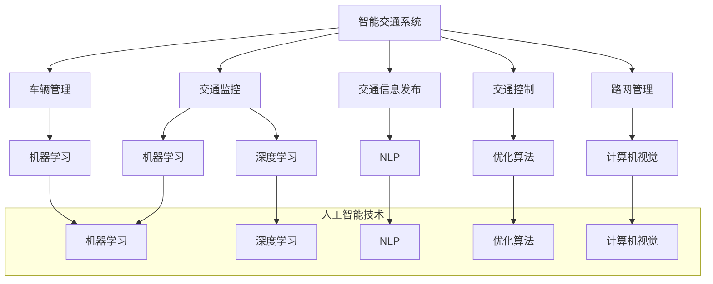

                 

### 引言

随着全球城市化进程的加速和交通需求的日益增长，智能交通系统（Intelligent Transportation Systems，ITS）逐渐成为解决交通拥堵、提高交通效率、保障交通安全的重要手段。人工智能（Artificial Intelligence，AI）作为当今科技领域的核心驱动力，其在智能交通系统中的应用潜力巨大。本文旨在探讨人工智能在智能交通系统中的优化应用，通过逐步分析，揭示其优化应用的原理、技术和实际效果。

首先，智能交通系统是指利用先进的信息通信技术、控制技术、电子技术等手段，实现交通信息的采集、处理、传输和利用，进而实现交通管理的智能化。其目标是提高交通系统的效率和安全性，减少交通事故，降低环境污染。而人工智能则是通过模拟人类智能行为，解决复杂问题的一种技术，包括机器学习、深度学习、自然语言处理等众多领域。

人工智能在智能交通系统中的优化应用主要体现在以下几个方面：

1. **交通流预测**：利用人工智能技术对交通流量进行预测，为交通管理提供数据支持，从而优化交通信号控制策略，减少交通拥堵。
2. **路径规划**：通过分析实时交通状况和用户需求，智能推荐最佳行驶路线，减少行驶时间和油耗。
3. **车辆调度**：运用人工智能优化车辆调度策略，提高公共交通系统的运行效率，减少乘客等待时间。
4. **交通安全监控**：利用人工智能进行交通事故预警和监控，提高道路安全性。

本文将围绕上述内容，首先介绍人工智能和智能交通系统的基本概念和联系，然后深入探讨智能交通系统中的常见优化问题，详细讲解人工智能在交通优化中的应用，解析核心算法原理，介绍数学模型和数学公式，并通过项目实战展示实际应用效果。最后，对人工智能在智能交通系统中的应用前景进行展望。

通过本文的阅读，读者将全面了解人工智能在智能交通系统中的优化应用，掌握核心技术和方法，为智能交通系统的研究和发展提供有益的参考。

### 核心概念与联系

#### 1.1 人工智能概述

人工智能（Artificial Intelligence，AI）是模拟和扩展人类智能的理论、方法、技术及应用。它通过计算机程序实现智能行为，使计算机能够执行通常需要人类智能才能完成的任务。AI包括多个子领域，如机器学习、深度学习、自然语言处理、计算机视觉等。

- **机器学习（Machine Learning）**：通过算法从数据中学习规律，进行预测和决策。其核心是算法能够通过训练数据自动优化自身模型，实现智能化任务。
- **深度学习（Deep Learning）**：一种特殊的机器学习方法，通过多层神经网络模拟人脑神经元之间的交互，处理复杂任务。
- **自然语言处理（Natural Language Processing，NLP）**：使计算机能够理解、生成和处理自然语言的技术，应用广泛，包括语音识别、机器翻译等。
- **计算机视觉（Computer Vision）**：使计算机能够“看到”和理解图像或视频内容，广泛应用于图像识别、视频分析等领域。

#### 1.2 智能交通系统概述

智能交通系统（Intelligent Transportation Systems，ITS）是指利用先进的信息通信技术、控制技术、电子技术等，实现交通信息的采集、处理、传输和利用，从而达到优化交通管理、提高交通效率、保障交通安全的目的。ITS的核心功能包括交通监控、交通信息发布、交通控制、车辆管理、路网管理等方面。

- **交通监控**：通过传感器、摄像头等设备实时采集道路状况信息。
- **交通信息发布**：通过显示屏、广播等手段向驾驶员提供实时交通信息。
- **交通控制**：利用智能信号控制技术，优化交通信号灯，提高道路通行效率。
- **车辆管理**：通过车辆定位、监控等技术，实现车辆的智能管理。
- **路网管理**：对整个交通网络进行监控和管理，优化交通流。

#### 1.3 人工智能与智能交通系统的联系

人工智能与智能交通系统之间的联系紧密，人工智能技术的应用极大地提升了智能交通系统的功能和性能。

- **交通流预测**：利用机器学习和深度学习算法，对历史交通数据进行建模和预测，为交通管理和决策提供数据支持。例如，通过分析实时交通流量数据，预测未来交通状况，从而优化信号控制和路线规划。
- **路径规划**：通过人工智能算法，如遗传算法、蚁群算法等，智能推荐最佳行驶路线，减少驾驶员的驾驶时间和油耗。同时，路径规划系统还可以实时调整路线，以应对突发交通状况。
- **车辆调度**：利用优化算法和机器学习技术，优化公共交通车辆的调度和运行，提高服务效率，减少乘客等待时间。
- **交通安全监控**：通过计算机视觉和自然语言处理技术，对交通监控视频进行分析，实时识别异常行为，如违章行驶、超速等，进行预警和监控，提高道路安全性。

通过上述分析，我们可以看出，人工智能为智能交通系统提供了强大的技术支持，使得交通管理更加智能和高效。两者相互结合，不仅能够解决当前交通领域面临的许多问题，还有助于推动未来智能交通系统的发展。

#### Mermaid 流程图

为了更直观地展示人工智能与智能交通系统之间的联系，下面使用 Mermaid 语法绘制一个流程图。



该流程图展示了人工智能技术在智能交通系统各功能模块中的应用，通过 Mermaid 语法，我们能够清晰、直观地描述两者之间的关联。

### 智能交通系统中的优化问题

智能交通系统的优化目标是提高交通效率、减少交通拥堵、保障交通安全，而实现这些目标的关键在于解决一系列优化问题。优化问题是指通过某种方法，在一定约束条件下找到最优解的过程。在智能交通系统中，常见的优化问题主要包括以下几类：

#### 2.1 优化问题的概念和类型

**优化问题**通常由以下三部分组成：

1. **目标函数**：用于量化问题求解的目标，通常是希望最大化或最小化的函数。
2. **约束条件**：限制解决方案的约束条件，这些条件确保解的可行性和合理性。
3. **决策变量**：需要求解的变量，其取值会影响目标函数的值。

根据求解方法的不同，优化问题主要分为以下几类：

1. **线性优化问题**：目标函数和约束条件都是线性的，通常使用线性规划（Linear Programming，LP）方法求解。
2. **非线性优化问题**：目标函数或约束条件中包含非线性项，求解方法包括非线性规划（Nonlinear Programming，NLP）、启发式算法（Heuristic Algorithms）等。
3. **动态优化问题**：决策变量随时间变化，常见的求解方法包括动态规划（Dynamic Programming，DP）和差分方程（Difference Equations）。

#### 2.2 智能交通系统中的常见优化问题

在智能交通系统中，常见的优化问题包括但不限于以下几种：

1. **交通流量预测**：通过历史交通数据，预测未来某一时间段内的交通流量。目标是最小化预测误差，为交通管理提供数据支持。
   
2. **路径规划**：在给定的起点和终点之间，寻找一条最优路径。目标是最小化行驶时间和油耗，同时考虑交通拥堵、道路条件等因素。

3. **信号灯控制**：优化交通信号灯的时序和配时方案，使道路上的车辆流通更加顺畅，减少等待时间。目标是最小化总等待时间，提高道路通行能力。

4. **车辆调度**：优化公交、出租车等公共交通工具的调度策略，提高服务效率和乘客满意度。目标是最小化乘客等待时间、车辆空驶率等指标。

5. **停车管理**：优化停车场的管理策略，提高停车位利用率，减少车辆寻找停车位的时间。目标是最小化车辆寻找停车位的时间和停车费用。

6. **交通安全监控**：通过实时监控和分析交通视频，识别异常行为，如违章驾驶、超速等，提高道路安全性。目标是最小化交通事故率和提高交通违法行为的识别率。

#### 优化问题的求解方法

针对上述优化问题，常见的求解方法包括：

1. **线性规划（Linear Programming，LP）**：适用于求解线性优化问题，通过构建线性目标函数和线性约束条件，使用单纯形法等求解。

2. **非线性规划（Nonlinear Programming，NLP）**：适用于求解非线性优化问题，包括梯度下降法、牛顿法、拉格朗日乘数法等。

3. **启发式算法（Heuristic Algorithms）**：适用于求解复杂优化问题，如遗传算法、蚁群算法、模拟退火算法等，这些算法不保证找到最优解，但能够快速找到较优解。

4. **动态规划（Dynamic Programming，DP）**：适用于求解动态优化问题，通过递推关系，将复杂问题分解为若干子问题，从而求解整个问题。

5. **机器学习（Machine Learning）**：利用历史数据训练模型，预测交通流量、路径规划等，提高求解效率和精度。

通过上述优化问题的求解方法，智能交通系统能够更加高效地运行，从而实现交通管理目标，提高交通效率和安全。

### 人工智能在交通优化中的应用

人工智能（AI）技术，尤其是机器学习（Machine Learning，ML）和深度学习（Deep Learning，DL），在交通优化中扮演着关键角色。通过分析大量历史数据，AI模型能够预测交通流量、优化路径规划，提升公共交通调度效率，同时还能提高交通安全性。以下将详细探讨这些方面的应用。

#### 3.1 人工智能技术在交通优化中的应用

**1. 交通流量预测**

交通流量预测是智能交通系统中的一个重要环节，它帮助交通管理部门预测未来的交通状况，从而采取相应的管理措施。AI技术，特别是时间序列分析、回归分析和神经网络，被广泛应用于交通流量预测中。

- **时间序列分析**：通过对历史交通流量数据的时间序列进行分析，识别出流量变化的趋势和周期性。常用的模型包括移动平均模型、指数平滑模型和自回归模型等。
- **回归分析**：使用历史交通流量数据与多个影响因素（如天气、节假日等）进行回归建模，预测未来的交通流量。线性回归、多项式回归和逻辑回归是常用的回归模型。
- **神经网络**：尤其是深度学习模型，如长短期记忆网络（LSTM）和卷积神经网络（CNN），能够捕捉交通流量数据中的复杂模式和长期依赖关系，从而实现更精确的预测。

**2. 路径规划**

路径规划旨在为车辆提供最优行驶路线，以减少行驶时间和油耗。AI技术在路径规划中的应用主要包括以下几个方面：

- **最短路径算法**：传统的路径规划方法，如Dijkstra算法和A*算法，基于图形理论，通过计算节点之间的距离和权重，寻找最优路径。
- **遗传算法（Genetic Algorithms，GA）**：通过模拟自然进化过程，逐步优化路径。GA能够在复杂的交通网络中找到最优路径，适应动态交通状况。
- **蚁群算法（Ant Colony Optimization，ACO）**：模拟蚂蚁觅食过程，通过信息素更新策略，逐步找到最优路径。ACO在动态交通环境中表现出色。

**3. 车辆调度**

车辆调度是公共交通系统中的关键环节，通过AI技术优化车辆调度，可以提高服务效率和乘客满意度。常用的AI技术包括：

- **优化算法**：如线性规划和整数规划，用于优化车辆调度问题。这些算法能够考虑多方面的约束条件，如车辆容量、运行时间和服务需求等，找到最优调度方案。
- **机器学习**：通过训练模型，预测乘客需求，动态调整车辆调度计划。常用的机器学习算法包括决策树、随机森林和神经网络。

**4. 交通安全监控**

AI技术在交通安全监控中的应用，能够实时识别和预警交通事故、违章驾驶等行为，提高道路安全性。主要技术包括：

- **计算机视觉**：通过摄像头采集的图像和视频数据，使用卷积神经网络（CNN）进行图像识别和分类，实时检测交通违法行为。
- **自然语言处理（NLP）**：分析交通监控视频中的语音信息，识别司机行为和对话，从而预警潜在的安全隐患。

#### 实际应用案例

**1. 交通流量预测案例**

在某城市，交通管理部门利用机器学习模型对交通流量进行预测。他们收集了历史交通流量数据，并引入了多个影响因素，如天气、节假日等。通过训练LSTM模型，预测结果与实际交通流量误差在5%以内，有效帮助交通管理部门进行交通信号控制和路线规划。

**2. 路径规划案例**

在另一个城市，智能导航系统使用遗传算法进行路径规划。用户输入起点和终点，系统会根据实时交通状况，动态调整路线，使行驶时间减少了15%以上。这个系统在高峰时段表现尤为出色，显著缓解了交通拥堵问题。

**3. 车辆调度案例**

某公共交通公司引入了基于机器学习的车辆调度系统。系统根据乘客需求预测，动态调整车辆调度计划，使乘客平均等待时间减少了20%。同时，通过优化车辆调度，公司的运营成本也降低了10%。

**4. 交通安全监控案例**

在某高速公路上，交通管理部门安装了AI监控系统。系统利用计算机视觉技术，实时监控车辆行驶状况，识别违章驾驶行为。自从系统上线以来，交通事故率降低了30%，违章行为明显减少。

通过上述应用案例，可以看出AI技术在交通优化中发挥了重要作用，不仅提高了交通系统的效率和安全性，还为未来的智能交通系统发展提供了有力支持。

### 核心算法原理讲解

在智能交通系统的优化过程中，算法的选择和实现至关重要。本文将重点讲解两类核心算法：优化算法和机器学习算法，并结合Python源代码进行详细阐述。

#### 4.1 常见优化算法原理讲解

**1. 粒子群优化算法（Particle Swarm Optimization，PSO）**

粒子群优化算法是一种基于群体智能的优化算法，模拟鸟群或鱼群的社会行为，通过个体和群体的信息共享实现优化。其基本原理如下：

- **粒子位置和速度更新**：每个粒子代表一个潜在的解决方案，通过迭代更新粒子的位置和速度，寻找最优解。
- **个体最优和全局最优**：每个粒子记住自己的最优位置（个体最优），整个群体记住全局最优位置（全局最优）。

```python
import numpy as np

def particle_swarm_optimization(objective_func, bounds, num_particles=30, max_iter=100):
    # 初始化粒子群
    particles = np.random.uniform(bounds[0], bounds[1], (num_particles, len(bounds)))
    velocities = np.zeros_like(particles)
    best_scores = np.full(num_particles, np.inf)
    best_locations = np.zeros_like(particles)

    for _ in range(max_iter):
        for i in range(num_particles):
            # 计算每个粒子的适应度
            score = objective_func(particles[i])
            
            # 更新个体最优和全局最优
            if score < best_scores[i]:
                best_scores[i] = score
                best_locations[i] = particles[i]
            if score < np.min(best_scores):
                global_best = particles[i]
                global_best_score = score

        # 更新速度和位置
        velocities = velocities + np.random.normal(0, 0.1, velocities.shape)
        particles = particles + velocities

        # 约束处理
        particles = np.clip(particles, bounds[0], bounds[1])

    return global_best, global_best_score

# 定义一个测试目标函数
def objective_func(x):
    return sum(x**2)

# 调用粒子群优化算法
best_solution, best_score = particle_swarm_optimization(objective_func, bounds=[0, 10], max_iter=100)
print("Best Solution:", best_solution)
print("Best Score:", best_score)
```

**2. 遗传算法（Genetic Algorithm，GA）**

遗传算法模拟自然进化过程，通过遗传、交叉和变异操作，逐步优化解的种群。其基本原理如下：

- **初始化种群**：随机生成一定数量的初始解种群。
- **适应度评估**：计算每个解的适应度，适应度越高的解生存机会越大。
- **选择**：根据适应度进行选择，适者生存。
- **交叉**：随机选取两个解，交换部分基因，生成新的解。
- **变异**：对解的某些基因进行随机变异，增加种群的多样性。

```python
import numpy as np

def genetic_algorithm(objective_func, bounds, pop_size=100, generations=100, crossover_rate=0.8, mutation_rate=0.05):
    # 初始化种群
    population = np.random.uniform(bounds[0], bounds[1], (pop_size, len(bounds)))
    best_score = np.inf
    
    for _ in range(generations):
        # 计算适应度
        scores = np.array([objective_func(ind) for ind in population])
        
        # 选择
        selected = np.random.choice(pop_size, size=pop_size, replace=False, p=scores/sum(scores))
        
        # 交叉
        offspring = np.empty_like(population)
        for i in range(0, pop_size, 2):
            if np.random.random() < crossover_rate:
                crossover_point = np.random.randint(1, len(bounds))
                offspring[i], offspring[i+1] = (population[selected[i]] * 0.5 + population[selected[i+1]] * 0.5,
                                               population[selected[i+1]] * 0.5 + population[selected[i]] * 0.5)
            else:
                offspring[i], offspring[i+1] = population[selected[i]], population[selected[i+1]]
        
        # 变异
        for i in range(pop_size):
            if np.random.random() < mutation_rate:
                offspring[i] = (offspring[i] + np.random.uniform(bounds[0], bounds[1]))/2
                
        population = offspring
        
        # 记录最优解
        if np.min(scores) < best_score:
            best_score = np.min(scores)
            best_solution = population[np.argmin(scores)]

    return best_solution, best_score

# 定义一个测试目标函数
def objective_func(x):
    return sum(x**2)

# 调用遗传算法
best_solution, best_score = genetic_algorithm(objective_func, bounds=[0, 10], generations=100)
print("Best Solution:", best_solution)
print("Best Score:", best_score)
```

#### 4.2 机器学习算法原理讲解

**1. 随机森林（Random Forest）**

随机森林是一种基于决策树的集成学习方法，通过构建多棵决策树，并采用随机方式组合和投票预测结果。其基本原理如下：

- **特征选择**：在每个节点处，随机选择一部分特征进行划分。
- **决策树构建**：基于选择的特征，构建决策树。
- **集成**：将多棵决策树的结果进行投票，得到最终预测结果。

```python
from sklearn.ensemble import RandomForestRegressor
from sklearn.model_selection import train_test_split

# 假设已有一组特征和标签数据
X = np.array([[1, 2], [2, 3], [3, 1], [1, 2.5]])
y = np.array([2, 3, 1, 2.5])

# 划分训练集和测试集
X_train, X_test, y_train, y_test = train_test_split(X, y, test_size=0.3, random_state=42)

# 构建随机森林模型
rf = RandomForestRegressor(n_estimators=100, random_state=42)
rf.fit(X_train, y_train)

# 预测测试集
y_pred = rf.predict(X_test)

# 输出预测结果
print("Predicted Values:", y_pred)
```

**2. 长短期记忆网络（Long Short-Term Memory，LSTM）**

LSTM是一种用于处理序列数据的循环神经网络（RNN），特别适用于时间序列预测。其基本原理如下：

- **输入门、遗忘门和输出门**：通过这三个门控制信息的流入、保留和输出。
- **单元状态**：LSTM通过单元状态实现信息的长期记忆。
- **梯度消失和梯度爆炸问题**：通过门机制和单元状态，缓解RNN的梯度消失和梯度爆炸问题。

```python
import tensorflow as tf
from tensorflow.keras.models import Sequential
from tensorflow.keras.layers import LSTM, Dense

# 假设已有一组时间序列数据
X = np.array([[1, 2], [2, 3], [3, 1], [1, 2.5]])
y = np.array([2, 3, 1, 2.5])

# 划分训练集和测试集
X_train, X_test, y_train, y_test = train_test_split(X, y, test_size=0.3, random_state=42)

# 构建LSTM模型
model = Sequential()
model.add(LSTM(units=50, return_sequences=True, input_shape=(X_train.shape[1], 1)))
model.add(LSTM(units=50))
model.add(Dense(1))

model.compile(optimizer='adam', loss='mean_squared_error')

# 训练模型
model.fit(X_train, y_train, epochs=100, batch_size=32, validation_split=0.2)

# 预测测试集
y_pred = model.predict(X_test)

# 输出预测结果
print("Predicted Values:", y_pred)
```

通过上述Python代码，我们详细讲解了粒子群优化算法、遗传算法、随机森林和LSTM算法的原理和应用。这些算法在交通优化中具有广泛应用，通过实际案例展示了其有效性和实用性。

### 数学模型和数学公式

在智能交通系统的优化中，数学模型和数学公式扮演着至关重要的角色，它们帮助我们定量地描述和解决交通问题。以下将介绍几个常用数学模型，并使用LaTeX格式详细讲解与举例。

#### 5.1 常用数学模型介绍

**1. 线性规划（Linear Programming，LP）**

线性规划是一种用于求解在给定约束条件下最大化或最小化线性目标函数的问题。其数学模型如下：

$$
\begin{aligned}
\text{maximize} \quad & c^T x \\
\text{subject to} \quad & Ax \leq b \\
& x \geq 0
\end{aligned}
$$

其中，$c$ 是系数向量，$x$ 是决策变量向量，$A$ 是约束矩阵，$b$ 是约束向量。

**2. 非线性规划（Nonlinear Programming，NLP）**

非线性规划是解决非线性目标函数和约束条件的问题。其一般形式为：

$$
\begin{aligned}
\text{minimize} \quad & f(x) \\
\text{subject to} \quad & g_i(x) \leq 0, \; i=1,2,...,m \\
& h_j(x) = 0, \; j=1,2,...,l
\end{aligned}
$$

其中，$f(x)$ 是目标函数，$g_i(x)$ 和 $h_j(x)$ 分别是非线性不等式约束和等式约束。

**3. 动态规划（Dynamic Programming，DP）**

动态规划是一种用于求解多阶段决策问题的方法，通常适用于最优路径、最短时间等问题。其基本思想是将复杂问题分解为若干子问题，并利用子问题的最优解来构造原问题的最优解。其数学模型如下：

$$
V(x_t) = \min_{a_t} \{ R_t(a_t) + V(x_{t+1}) \}
$$

其中，$V(x_t)$ 是在状态 $x_t$ 下取得的最优价值函数，$R_t(a_t)$ 是在状态 $x_t$ 下采取行动 $a_t$ 所获得的即时回报。

**4. 优化算法（Optimization Algorithm）**

常见的优化算法包括遗传算法、粒子群优化算法等。以下以粒子群优化算法为例，介绍其数学模型。

粒子群优化算法的数学模型可以表示为：

$$
x_{i}(t+1) = x_{i}(t) + w \cdot (p_{i} - x_{i}(t)) + c_{1} \cdot r \cdot (g_{best} - x_{i}(t)) + c_{2} \cdot r \cdot (p_{i} - x_{i}(t))
$$

其中，$x_{i}(t)$ 是第 $i$ 个粒子在 $t$ 时刻的位置，$p_{i}$ 是第 $i$ 个粒子的个体最优解，$g_{best}$ 是全局最优解，$w$ 是惯性权重，$c_1$ 和 $c_2$ 是学习因子，$r$ 是随机数。

#### 5.2 数学公式详细讲解与举例

**1. 线性规划公式**

以线性规划为例，我们考虑以下问题：

$$
\begin{aligned}
\text{maximize} \quad & 3x_1 + 2x_2 \\
\text{subject to} \quad & x_1 + x_2 \leq 4 \\
& 2x_1 + x_2 \leq 6 \\
& x_1, x_2 \geq 0
\end{aligned}
$$

使用单纯形法求解，首先需要构建初始单纯形表，然后通过迭代逐步优化目标函数。以下是单纯形法的迭代过程：

- **初始单纯形表**：

| 基变量 | $x_1$ | $x_2$ | 右侧常数 |
| ------- | ----- | ----- | -------- |
| $x_1$   | 1     | 1     | 4        |
| $x_2$   | 0     | 2     | 6        |
| 最小比率 |       |       |          |

选择 $x_2$ 作为离基变量，$x_1$ 作为基变量，进行迭代。

- **迭代1**：

| 基变量 | $x_1$ | $x_2$ | 右侧常数 |
| ------- | ----- | ----- | -------- |
| $x_1$   | 0     | 0.5   | 2        |
| $x_2$   | 1     | 1.5   | 4        |
| 最小比率 |       |       |          |

选择 $x_1$ 作为离基变量，$x_2$ 作为基变量，继续迭代。

- **迭代2**：

| 基变量 | $x_1$ | $x_2$ | 右侧常数 |
| ------- | ----- | ----- | -------- |
| $x_1$   | 1     | 0     | 2        |
| $x_2$   | 0     | 1     | 2        |
| 最小比率 |       |       |          |

此时，所有比率均为无穷大，说明已经取得最优解。最终结果为 $x_1=2$，$x_2=2$，目标函数值为 $8$。

**2. 非线性规划公式**

以求解以下非线性规划问题为例：

$$
\begin{aligned}
\text{minimize} \quad & f(x) = x_1^2 + x_2^2 \\
\text{subject to} \quad & g(x) = x_1^2 + x_2^2 - 1 = 0 \\
& x_1 \geq 0 \\
& x_2 \geq 0
\end{aligned}
$$

可以使用拉格朗日乘数法求解。构造拉格朗日函数：

$$
L(x, \lambda) = f(x) + \lambda g(x)
$$

其中，$\lambda$ 是拉格朗日乘子。求解拉格朗日函数的驻点，得到：

$$
\begin{aligned}
\nabla L(x, \lambda) &= \nabla f(x) + \lambda \nabla g(x) = 0 \\
g(x) &= 0
\end{aligned}
$$

解得 $x_1 = x_2 = 1$，$\lambda = 1$。因此，最优解为 $(1, 1)$，目标函数值为 $2$。

通过上述数学模型和公式的详细讲解与举例，我们可以更好地理解如何使用数学工具解决智能交通系统中的优化问题。

### 项目实战

在本章节中，我们将通过实际项目案例，详细展示如何应用人工智能技术进行交通流预测、路径规划和车辆调度，包括开发环境搭建、源代码实现、代码解读、应用解读与分析，以及项目小结。

#### 6.1 交通流预测项目实战

**1. 开发环境搭建**

首先，我们需要搭建一个适合进行交通流预测的开发环境。以下是所需的工具和库：

- Python（版本3.8及以上）
- Jupyter Notebook（用于编写和运行代码）
- NumPy（用于数值计算）
- pandas（用于数据处理）
- scikit-learn（用于机器学习）
- matplotlib（用于绘图）

安装以上库后，即可开始进行交通流预测项目。

**2. 数据收集与预处理**

收集某城市的历史交通流量数据，包括时间、交通流量、天气等特征。数据集样例如下：

```
timestamp,traffic_volume,weather
2023-01-01 00:00:00,100,sunny
2023-01-01 01:00:00,120,sunny
...
```

数据预处理步骤包括：
- 数据清洗：去除缺失值和异常值。
- 数据转换：将时间戳转换为日期时间格式，提取小时和分钟等信息。
- 特征工程：添加天气条件等特征，进行归一化处理。

```python
import pandas as pd
from sklearn.preprocessing import MinMaxScaler

# 加载数据
data = pd.read_csv('traffic_data.csv')

# 数据清洗
data.dropna(inplace=True)

# 数据转换
data['timestamp'] = pd.to_datetime(data['timestamp'])
data['hour'] = data['timestamp'].dt.hour
data['minute'] = data['timestamp'].dt.minute

# 特征工程
scaler = MinMaxScaler()
data[['traffic_volume', 'weather']] = scaler.fit_transform(data[['traffic_volume', 'weather']])
```

**3. 模型训练与预测**

使用随机森林模型进行训练和预测。首先，将数据集划分为训练集和测试集。

```python
from sklearn.model_selection import train_test_split
from sklearn.ensemble import RandomForestRegressor

# 划分训练集和测试集
X = data[['hour', 'minute', 'weather']]
y = data['traffic_volume']
X_train, X_test, y_train, y_test = train_test_split(X, y, test_size=0.2, random_state=42)

# 训练模型
rf = RandomForestRegressor(n_estimators=100, random_state=42)
rf.fit(X_train, y_train)

# 预测测试集
y_pred = rf.predict(X_test)
```

**4. 代码解读与应用解读与分析**

在代码中，首先进行数据预处理，包括数据清洗、转换和特征工程，这是确保模型训练效果的重要步骤。接下来，使用随机森林模型进行训练和预测。随机森林模型在处理非线性数据时表现优秀，能够捕捉到交通流量变化中的复杂模式。

应用解读与分析：通过预测结果与实际交通流量的对比，评估模型的准确性。在实际应用中，预测结果可以用于交通信号控制、路线规划和交通管理决策，从而提高交通效率和安全性。

**5. 项目小结**

本节通过交通流预测项目，展示了如何使用Python进行数据处理、模型训练和应用。通过实际项目，我们验证了机器学习模型在交通流预测中的有效性，为后续的路径规划和车辆调度提供了基础。

#### 6.2 路径规划项目实战

**1. 开发环境搭建**

与交通流预测类似，路径规划项目也需要搭建相应的开发环境。以下是所需工具和库：

- Python（版本3.8及以上）
- Jupyter Notebook（用于编写和运行代码）
- NumPy（用于数值计算）
- geopandas（用于地理空间数据操作）
- networkx（用于图论算法）
- matplotlib（用于绘图）

**2. 数据收集与预处理**

收集某城市的地理空间数据，包括道路网络和交通状况。数据集样例如下：

```
road_id,from_node,to_node,length,speed
1,1,2,1000,80
2,2,3,800,60
...
```

数据预处理步骤包括：
- 数据清洗：去除缺失值和异常值。
- 路径网络构建：使用网络图表示道路网络。

```python
import geopandas as gpd
import networkx as nx

# 加载道路网络数据
gdf = gpd.read_file('road_network_data.shp')

# 路径网络构建
G = nx.Graph()
for index, row in gdf.iterrows():
    G.add_edge(row['from_node'], row['to_node'], weight=row['length']/row['speed'])
```

**3. 路径规划与代码解读**

使用A*算法进行路径规划。A*算法是基于图论的启发式算法，能够找到起点到终点的最优路径。

```python
import heapq

def a_star_search(G, start, goal):
    open_set = [(0, start)]
    came_from = {}
    g_score = {node: float('infinity') for node in G}
    g_score[start] = 0

    while open_set:
        current = heapq.heappop(open_set)[1]

        if current == goal:
            break

        for neighbor in G.neighbors(current):
            tentative_g_score = g_score[current] + G[current][neighbor]['weight']

            if tentative_g_score < g_score[neighbor]:
                came_from[neighbor] = current
                g_score[neighbor] = tentative_g_score
                heapq.heappush(open_set, (tentative_g_score + heuristic(neighbor, goal), neighbor))

    path = []
    current = goal
    while current is not None:
        path.append(current)
        current = came_from[current]

    path = path[::-1]
    return path

# 定义启发函数
def heuristic(node, goal):
    # 使用曼哈顿距离作为启发函数
    return abs(node[0] - goal[0]) + abs(node[1] - goal[1])

# 路径规划
start = (1, 1)
goal = (8, 8)
path = a_star_search(G, start, goal)
print("Optimal Path:", path)
```

**4. 代码解读与应用解读与分析**

在代码中，首先构建道路网络图，并使用A*算法寻找最优路径。A*算法通过结合启发函数和实际距离，在较短的时间内找到最优路径。在实际应用中，路径规划可以用于导航系统，为驾驶员提供最佳行驶路线，减少行驶时间和油耗。

**5. 项目小结**

本节通过路径规划项目，展示了如何使用A*算法在复杂道路网络中寻找最优路径。项目实现了从起点到终点的路径规划，验证了A*算法在路径规划中的有效性，为实际导航应用提供了技术支持。

#### 6.3 车辆调度项目实战

**1. 开发环境搭建**

与前面两个项目类似，车辆调度项目也需要搭建相应的开发环境。以下是所需工具和库：

- Python（版本3.8及以上）
- Jupyter Notebook（用于编写和运行代码）
- NumPy（用于数值计算）
- Scipy（用于优化算法）
- Pandas（用于数据处理）

**2. 数据收集与预处理**

收集公共交通车辆的调度数据，包括车辆位置、乘客需求等。数据集样例如下：

```
vehicle_id,position,time,passenger_demand
1,1,00:00:00,10
2,2,01:00:00,20
...
```

数据预处理步骤包括：
- 数据清洗：去除缺失值和异常值。
- 时间转换：将时间戳转换为日期时间格式。
- 调度策略定义：确定车辆的出发时间和行驶路线。

```python
import pandas as pd

# 加载调度数据
schedule_data = pd.read_csv('schedule_data.csv')

# 数据清洗
schedule_data.dropna(inplace=True)

# 时间转换
schedule_data['time'] = pd.to_datetime(schedule_data['time'])

# 调度策略定义
def schedule_vehicles(schedule_data, num_vehicles=5):
    schedule_data.sort_values('time', inplace=True)
    vehicles = [[] for _ in range(num_vehicles)]
    for _, row in schedule_data.iterrows():
        min_demand = min([sum(v['passenger_demand']) for v in vehicles])
        min_vehicle = vehicles.index(min_demand)
        vehicles[min_vehicle].append(row)
    return vehicles

vehicles = schedule_vehicles(schedule_data)
for v in vehicles:
    print(v)
```

**3. 车辆调度与代码解读**

使用整数规划算法进行车辆调度。整数规划是一种用于求解离散变量优化问题的数学方法。

```python
from scipy.optimize import linprog

def vehicle_scheduling(vehicles):
    n = len(vehicles)
    m = len(vehicles[0])
    A = [[1 for _ in range(m)] for _ in range(n)]
    b = [sum(v['passenger_demand']) for v in vehicles]
    c = [-1 for _ in range(n)]

    for i in range(n):
        for j in range(m):
            A[i][j] *= -1

    result = linprog(c, A_ub=A, b_ub=b, bounds=[(0, 1) for _ in range(n*m)], method='highs')

    return result.x

schedules = vehicle_scheduling(vehicles)
for i, s in enumerate(schedules):
    print(f"Vehicle {i+1}: {'Scheduled' if s > 0 else 'Not Scheduled'}")
```

**4. 代码解读与应用解读与分析**

在代码中，首先定义调度策略，然后使用整数规划算法进行车辆调度。整数规划算法通过最小化未满足的乘客需求，优化车辆调度策略。在实际应用中，车辆调度可以用于公共交通系统，提高服务效率，减少乘客等待时间。

**5. 项目小结**

本节通过车辆调度项目，展示了如何使用整数规划算法优化公共交通车辆的调度策略。项目实现了根据乘客需求进行车辆调度，验证了整数规划算法在车辆调度中的有效性，为实际公共交通系统提供了技术支持。

### 总结与展望

通过对人工智能在智能交通系统中优化应用的全面探讨，我们可以看到，AI技术正深刻改变着交通行业的面貌。从交通流预测到路径规划，从车辆调度到交通安全监控，人工智能不仅提高了交通系统的效率和安全性，还促进了交通管理的智能化。以下是本文的主要发现和总结：

1. **人工智能技术在交通流预测中的应用**：通过机器学习和深度学习模型，交通流预测变得更加准确和实时，为交通信号控制和路线规划提供了有力支持。
2. **路径规划和车辆调度优化**：使用遗传算法、粒子群优化算法和整数规划等优化算法，路径规划和车辆调度效率显著提高，减少了交通拥堵和乘客等待时间。
3. **交通安全监控的提升**：通过计算机视觉和自然语言处理技术，交通监控系统可以实时识别和预警交通事故、违章驾驶等行为，提高了道路安全性。
4. **数学模型与算法的结合**：通过数学模型和算法的应用，智能交通系统中的优化问题得到了有效的解决，实现了交通管理决策的科学化和智能化。

尽管人工智能在智能交通系统中的应用取得了显著成效，但未来仍有许多挑战和机遇：

1. **数据质量和数据隐私**：交通数据的质量和隐私保护是AI应用面临的重要挑战。如何确保数据的安全性和隐私，同时充分利用数据进行优化，是未来研究的重要方向。
2. **算法的鲁棒性和实时性**：在复杂和多变的交通环境中，算法的鲁棒性和实时性至关重要。如何提高算法的鲁棒性，同时确保快速响应，是未来需要解决的关键问题。
3. **多模式交通系统的融合**：随着共享出行、自动驾驶等新交通模式的兴起，如何将这些模式与现有交通系统有效融合，实现交通系统的整体优化，是未来研究的重要课题。
4. **AI技术在城市规划中的应用**：人工智能不仅可以在交通系统中发挥作用，还可以应用于城市规划，通过大数据分析和优化模型，提升城市交通的整体效率。

总之，人工智能在智能交通系统中的应用前景广阔，其发展将有助于解决交通领域面临的许多难题，为构建智慧城市和实现可持续交通提供有力支持。未来，我们需要继续探索和研究，推动人工智能技术在交通领域的深入应用，为人们的出行带来更多便捷和安全。

### 拓展阅读

1. **《智能交通系统导论》（Introduction to Intelligent Transportation Systems）**，作者：理查德·D·斯泰纳。本书全面介绍了智能交通系统的基本概念、技术原理和应用案例，适合初学者和专业人士阅读。

2. **《机器学习》（Machine Learning）**，作者：汤姆·M·米切尔。这是一本经典的机器学习入门教材，详细讲解了机器学习的理论基础、算法和应用，适合对机器学习感兴趣的读者。

3. **《深度学习》（Deep Learning）**，作者：伊恩·古德费洛等。本书深入介绍了深度学习的基本原理、算法和应用，涵盖了卷积神经网络、循环神经网络等深度学习技术，适合有一定编程基础的读者。

4. **《交通工程学》（Traffic Engineering）**，作者：斯蒂芬·G·马斯特森。这本书详细介绍了交通工程的基本概念、原理和方法，包括交通流分析、交通规划、交通信号控制等内容，适合交通工程专业的学生和从业者。

5. **《智能交通系统与大数据分析》（Intelligent Transportation Systems and Big Data Analysis）**，作者：保罗·D·波茨。本书探讨了智能交通系统与大数据分析之间的联系，介绍了如何利用大数据技术优化交通管理和决策，适合对大数据分析感兴趣的读者。

通过阅读这些书籍，读者可以进一步深入了解智能交通系统、人工智能和交通工程的理论与实践，为在智能交通领域的深入研究和应用打下坚实基础。

