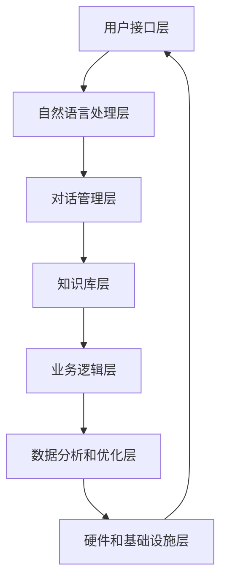

                 

### 第一部分：引言

#### 1.1 书籍背景与目标

##### 1.1.1 人工智能与智能客服的背景

人工智能（AI）作为计算机科学的一个分支，其目的是让计算机模拟人类的智能行为，包括学习、推理、规划和自然语言理解等。人工智能的概念最早可以追溯到20世纪50年代，近年来随着计算能力、算法创新和海量数据的积累，人工智能取得了长足的发展。特别是在深度学习、自然语言处理和计算机视觉等领域，人工智能技术已经达到了前所未有的高度。

智能客服则是在人工智能背景下产生的一种新型服务模式。它利用人工智能技术，通过语音识别、自然语言处理和机器学习等技术，模拟人类客服人员的交互过程，提供24小时不间断的客户服务。智能客服不仅能够提高客服效率，减少企业运营成本，还能够提升客户体验，增强客户满意度。

##### 1.1.2 书籍目标与读者对象

本书旨在深入探讨人工智能在智能客服中的应用，通过理论与实践相结合的方式，帮助读者全面了解智能客服系统的设计、实现和优化。具体目标包括：

1. **介绍人工智能的基本概念和核心技术**，使读者能够理解人工智能的工作原理和应用场景。
2. **详细讲解智能客服的基础知识**，包括智能客服的架构、核心技术和应用场景。
3. **探讨全天候智能客服的挑战和机遇**，分析其在不同行业中的实际应用。
4. **通过案例分析和项目实战**，展示如何设计和实现一个高效的智能客服系统。

本书适合对人工智能和智能客服感兴趣的读者，包括IT行业从业者、人工智能研究人员、学生和对此领域有浓厚兴趣的读者。

##### 1.1.3 书籍结构

本书共分为五个主要部分：

1. **引言**：介绍人工智能和智能客服的背景，阐述本书的目标和结构。
2. **基础概念与原理**：讲解人工智能的基本概念和核心技术，以及智能客服的架构和核心算法。
3. **全天候智能客服应用**：详细讨论人工智能在智能客服中的应用，包括自然语言处理、对话管理系统和情感分析等。
4. **智能客服系统的设计与实现**：介绍智能客服系统的需求分析、技术选型、架构设计和实现过程。
5. **案例分析**：通过实际案例展示智能客服的应用和实践经验，分析其中的挑战和解决方案。

通过本书的学习，读者将能够系统地了解人工智能在智能客服中的全天候应用，掌握智能客服系统的设计和实现方法，为今后的研究和实践提供有力支持。

#### 1.2 智能客服系统的基础知识

##### 1.2.1 智能客服的定义与分类

智能客服系统是一种基于人工智能技术的客户服务解决方案，它通过自然语言处理（NLP）、机器学习、语音识别和计算机视觉等技术，实现与用户的智能交互，提供24小时不间断的服务。智能客服系统可以按照交互方式和技术特点进行分类：

1. **文本智能客服**：通过文本聊天界面与用户进行交互，使用自然语言处理技术理解用户的问题并给出回答。
2. **语音智能客服**：通过语音识别技术将用户的语音输入转换为文本，再通过自然语言处理和语音合成技术进行回答。
3. **图像智能客服**：通过计算机视觉技术识别用户的图像或手势，进行问题识别和回答。

##### 1.2.2 智能客服的工作流程

智能客服系统的工作流程主要包括以下几个步骤：

1. **用户输入**：用户通过文本、语音或图像的方式向智能客服系统提出问题。
2. **输入处理**：系统对用户输入进行处理，包括语音识别、文本解析和图像识别等。
3. **问题理解**：通过自然语言处理技术理解用户的问题，提取关键信息。
4. **知识库查询**：系统在知识库中查询相关的信息，以生成回答。
5. **回答生成**：根据查询结果和预设的模板，生成回答。
6. **输出回答**：将回答通过文本、语音或图像的方式呈现给用户。
7. **用户反馈**：用户可以对回答进行评价，系统根据反馈进行优化和学习。

##### 1.2.3 智能客服的优势和挑战

智能客服系统具有以下优势：

1. **全天候服务**：智能客服系统可以24小时不间断地提供服务，大大提高了客户服务的覆盖范围和响应速度。
2. **提高效率**：通过自动化处理大量客户请求，智能客服系统能够显著提高工作效率，减少人工干预。
3. **降低成本**：智能客服系统减少了人工客服的投入，降低了运营成本。
4. **个性化服务**：通过学习和分析用户的历史交互数据，智能客服系统可以提供个性化的服务，提升客户满意度。

然而，智能客服系统也面临着一些挑战：

1. **语义理解**：自然语言理解是智能客服系统的核心，但当前的语义理解技术还存在一定的局限性，难以完全理解用户的复杂问题和情感。
2. **用户隐私**：智能客服系统在处理用户数据时，需要保护用户的隐私，防止数据泄露。
3. **系统稳定性**：智能客服系统需要保证高可用性和稳定性，避免因系统故障导致服务中断。

综上所述，智能客服系统在提升客户服务质量和效率方面具有巨大潜力，但同时也需要不断优化和解决面临的挑战。

#### 1.3 全天候智能客服的挑战与机遇

##### 1.3.1 挑战分析

1. **实时性问题**：全天候智能客服需要处理大量的实时请求，这对系统的响应速度和稳定性提出了高要求。如何在保证实时性的同时，确保系统的高可用性和稳定性，是一个重要的挑战。
2. **多语言支持**：全球化的业务需求要求智能客服系统能够支持多种语言，这对自然语言处理技术提出了更高的要求。不同语言的语法、词汇和表达方式差异较大，如何有效实现多语言支持，是一个技术难题。
3. **个性化服务**：用户的需求和偏好千差万别，如何根据用户的个性化需求提供定制化的服务，是一个挑战。智能客服系统需要具备强大的学习能力，能够从用户的交互数据中提取有效的特征，进行精准的个性化推荐。
4. **数据隐私与安全**：智能客服系统在处理用户数据时，必须确保用户隐私和数据安全。数据泄露和滥用可能导致严重的法律和商业风险，因此如何在提供优质服务的同时，保护用户隐私，是一个重要的问题。

##### 1.3.2 机遇探讨

1. **技术进步**：随着人工智能技术的不断发展，自然语言处理、机器学习和计算机视觉等核心技术的成熟，为全天候智能客服提供了更多的可能性。新的算法和模型可以显著提升系统的性能和用户体验。
2. **市场需求**：随着企业对客户服务要求的提高，智能客服系统市场需求不断增长。特别是在金融、电商、电信等行业，智能客服系统已经成为企业提升客户满意度、降低运营成本的重要工具。
3. **跨领域应用**：智能客服系统不仅可以在传统的客户服务领域发挥作用，还可以应用于更多的行业和场景，如医疗健康、教育、物联网等。这为智能客服系统的广泛应用提供了广阔的空间。
4. **数据资源**：智能客服系统积累了大量的用户交互数据，这些数据可以用于进一步的分析和挖掘，为企业提供有价值的商业洞察和决策支持。

综上所述，全天候智能客服在面临挑战的同时，也拥有巨大的机遇。通过技术创新和市场需求驱动，智能客服系统有望在未来的发展中发挥更大的作用。

### 1.4 总结与展望

本部分引言部分主要介绍了人工智能与智能客服的背景，阐述了本书的目标和结构，并对智能客服系统的基础知识进行了详细讲解。通过本部分的学习，读者可以了解人工智能和智能客服的发展历程、基本概念和应用场景，为后续章节的学习打下坚实的基础。

在接下来的章节中，我们将深入探讨人工智能在智能客服中的核心技术，包括自然语言处理、对话管理系统和情感分析等。通过理论讲解和实际案例，读者将能够全面了解智能客服系统的设计和实现方法，掌握如何构建一个高效、稳定的智能客服系统。

同时，我们也将分析全天候智能客服面临的挑战和机遇，探讨如何通过技术创新和市场需求驱动，进一步提升智能客服系统的性能和应用范围。通过本部分的学习，读者将能够站在技术前沿，把握智能客服系统的未来发展趋势。

总之，本书旨在为读者提供一份系统、全面、深入的学习指南，帮助读者掌握人工智能在智能客服中的应用，为未来的研究和实践提供有力支持。希望读者能够在学习过程中，不断思考、探索，将所学知识应用到实际工作中，为智能客服领域的发展贡献自己的力量。

#### 1.5 关键词

- 人工智能（AI）
- 智能客服
- 自然语言处理（NLP）
- 对话管理系统
- 情感分析
- 全天候服务
- 实时性问题
- 多语言支持
- 个性化服务
- 数据隐私与安全
- 技术进步
- 市场需求

#### 1.6 摘要

本书《人工智能在智能客服中的全天候应用》旨在深入探讨人工智能技术在智能客服系统中的应用，通过理论与实践相结合的方式，全面介绍智能客服系统的设计、实现和优化。本书分为五个主要部分，首先介绍了人工智能与智能客服的背景和发展，然后详细讲解了智能客服的基础知识，包括其定义、分类和工作流程。接着，探讨了全天候智能客服面临的挑战与机遇，分析了实时性问题、多语言支持、个性化服务以及数据隐私与安全等方面。随后，重点讨论了人工智能在智能客服中的核心技术，如自然语言处理、对话管理系统和情感分析，并提供了具体的实现方法和应用案例。最后，本书通过实际案例分析和项目实战，展示了智能客服系统的设计与实现过程，并展望了其未来发展趋势。通过阅读本书，读者可以系统地了解智能客服系统的核心概念、关键技术及应用实践，为未来的研究和应用提供指导。

### 第二部分：基础概念与原理

#### 2.1 人工智能基础

##### 2.1.1 人工智能的定义与分类

人工智能（Artificial Intelligence，简称AI）是计算机科学的一个分支，旨在研究、开发和应用使计算机系统能够模拟、延伸和扩展人类智能的理论、方法和技术。人工智能的研究范围广泛，包括机器学习、自然语言处理、计算机视觉、推理和规划等多个领域。

根据人工智能的实现方式和应用场景，可以将其分为以下几类：

1. **弱人工智能（Narrow AI）**：弱人工智能是指只能在一个特定领域内表现出人类智能的计算机系统。这类人工智能通过预定义的规则和模式进行操作，例如，智能客服系统、推荐算法等。

2. **强人工智能（General AI）**：强人工智能是指具有人类智能的全面能力，能够在各种复杂环境中灵活应对问题的计算机系统。目前，强人工智能还没有实现，科学家们正在努力研究。

3. **泛人工智能（AGI）**：泛人工智能是指超越人类智能的计算机系统，能够在任何领域内表现出人类智能，并具备自主学习、适应和创新能力。这仍是一个尚未实现的目标。

##### 2.1.2 人工智能的关键技术

人工智能的实现依赖于多种关键技术的支持，以下是一些主要的技术：

1. **机器学习（Machine Learning）**：机器学习是人工智能的核心技术之一，通过训练算法使计算机系统能够从数据中学习，进行预测和决策。主要类型包括监督学习、无监督学习和强化学习。

2. **深度学习（Deep Learning）**：深度学习是机器学习的一个分支，利用神经网络模型（尤其是深度神经网络）进行学习。它在大规模数据集上表现出了出色的性能，被广泛应用于图像识别、语音识别和自然语言处理等领域。

3. **自然语言处理（Natural Language Processing，NLP）**：自然语言处理是使计算机能够理解、生成和处理人类自然语言的技术。NLP在智能客服、文本分类、机器翻译等领域有着广泛的应用。

4. **计算机视觉（Computer Vision）**：计算机视觉是使计算机能够从图像或视频中提取信息的技术。计算机视觉技术在图像识别、目标检测、视频分析等领域发挥着重要作用。

5. **语音识别（Speech Recognition）**：语音识别是使计算机能够理解和处理语音输入的技术。语音识别在智能客服、语音助手和语音搜索等领域有着重要的应用。

##### 2.1.3 人工智能的发展历程

人工智能的发展历程可以分为以下几个阶段：

1. **初始阶段（1950年代-1970年代）**：人工智能的概念被首次提出，早期的人工智能系统主要集中在规则推理和符号计算上。

2. **第一次AI寒冬（1970年代-1980年代）**：由于过高的期望和技术的局限性，人工智能研究遇到了挫折，资金和资源投入减少，进入第一次AI寒冬。

3. **复兴阶段（1980年代-1990年代）**：随着计算能力和算法的进步，机器学习和神经网络开始崭露头角，人工智能研究进入复兴阶段。

4. **第二次AI寒冬（2000年代初期）**：2000年代初期，由于计算能力和数据资源的限制，人工智能再次遇到困难，进入第二次AI寒冬。

5. **大数据与深度学习时代（2010年至今）**：随着大数据和深度学习技术的兴起，人工智能迎来了新的发展机遇，各种AI应用开始普及，人工智能进入了一个快速发展的黄金时期。

##### 2.1.4 人工智能的应用场景

人工智能在各个领域都有广泛的应用，以下是一些典型的应用场景：

1. **工业自动化**：人工智能技术被广泛应用于工业生产线的自动化控制，提高生产效率和质量。

2. **医疗健康**：人工智能在医学影像分析、疾病预测和个性化治疗等领域有着重要的应用。

3. **金融**：人工智能在风险管理、信用评分、投资分析和智能投顾等方面发挥着重要作用。

4. **交通**：自动驾驶、智能交通管理和物流优化是人工智能在交通领域的典型应用。

5. **客户服务**：智能客服系统利用人工智能技术提供24小时不间断的服务，提升客户体验。

6. **教育**：人工智能在教育领域被用于个性化学习、智能评估和教学辅助等方面。

7. **智能家居**：智能家居系统利用人工智能技术实现智能控制、安全和便利，提高生活质量。

##### 2.1.5 人工智能的优势与挑战

人工智能的优势：

1. **自动化**：人工智能能够自动执行复杂的任务，提高生产效率。
2. **精准性**：人工智能通过学习大量数据，能够在特定领域内做出精准的预测和决策。
3. **高效性**：人工智能系统能够快速处理大量信息，比人类更快地做出反应。
4. **多样性**：人工智能在各个领域都有广泛的应用，能够满足多样化的需求。

人工智能面临的挑战：

1. **数据隐私**：人工智能系统需要大量数据来进行训练，如何保护用户隐私是一个重要的问题。
2. **算法公平性**：人工智能算法可能存在偏见，如何确保算法的公平性是一个挑战。
3. **安全性和可靠性**：人工智能系统需要保证高安全性和可靠性，避免潜在的风险。
4. **法律和伦理**：人工智能的应用引发了法律和伦理问题，如何规范和监管人工智能的发展是一个重要议题。

综上所述，人工智能作为一门交叉学科，具有广泛的应用前景和发展潜力。通过不断的技术创新和优化，人工智能将在未来继续推动社会进步和产业变革。

### 2.2 智能客服概述

#### 2.2.1 智能客服的定义

智能客服（Intelligent Customer Service）是一种基于人工智能技术的客户服务解决方案，旨在通过智能化的交互方式，提供高效、精准、个性化的客户服务。智能客服利用自然语言处理（NLP）、机器学习、语音识别和计算机视觉等技术，模拟人类客服人员的交互过程，实现与用户的智能对话和服务。

智能客服不仅能够处理常见的问题和提供标准化的回答，还可以根据用户的个性化需求进行智能推荐和个性化服务，提升客户体验和满意度。与传统的人工客服相比，智能客服具有全天候服务、高效处理大量请求、降低运营成本等优点。

#### 2.2.2 智能客服的兴起

智能客服的兴起可以追溯到人工智能技术的快速发展。随着自然语言处理、机器学习和语音识别等技术的成熟，智能客服系统的性能和实用性得到了显著提升。特别是在大数据和云计算技术的支持下，智能客服系统能够处理大量的用户数据和交互信息，实现了更高水平的自动化和智能化。

近年来，随着企业对客户服务要求的提高，智能客服逐渐成为企业提升客户满意度和竞争力的关键工具。特别是在金融、电商、电信和医疗等行业，智能客服系统已经成为企业运营不可或缺的一部分。

#### 2.2.3 智能客服的核心组成部分

智能客服系统通常由以下几个核心组成部分构成：

1. **自然语言处理（NLP）**：自然语言处理是智能客服的核心技术之一，负责理解和处理用户的自然语言输入。NLP技术包括词法分析、句法分析、语义分析和情感分析等。

2. **对话管理（Dialogue Management）**：对话管理负责管理智能客服与用户之间的对话流程，包括理解用户意图、生成回答、维护对话状态和转移控制等。对话管理通常采用对话管理系统（Dialogue Management System，简称DMS）来实现。

3. **知识库（Knowledge Base）**：知识库是智能客服系统的核心数据源，存储了各种常见问题和标准回答，以及业务知识和规则。智能客服系统通过查询知识库来生成回答，提高服务的准确性和一致性。

4. **语音识别（Speech Recognition）**：语音识别技术用于将用户的语音输入转换为文本，使得用户可以通过语音与智能客服进行交互。语音识别技术在提升用户体验、降低操作难度方面发挥着重要作用。

5. **语音合成（Text-to-Speech，TTS）**：语音合成技术将文本转化为自然流畅的语音输出，使得智能客服系统能够以语音形式与用户进行对话。语音合成技术通常使用深度神经网络（DNN）和波束形成（Beamforming）等技术来实现。

6. **用户行为分析（User Behavior Analysis）**：用户行为分析技术用于收集和分析用户在交互过程中的行为数据，包括点击、浏览、搜索等行为。通过分析用户行为，智能客服系统能够更好地理解用户需求，提供个性化的服务。

#### 2.2.4 智能客服的工作流程

智能客服系统的工作流程通常包括以下几个步骤：

1. **用户输入**：用户通过文本、语音或图像的方式向智能客服系统提出问题或请求。

2. **输入处理**：系统对用户输入进行处理，包括语音识别、文本解析和图像识别等，将用户的输入转换为结构化的数据。

3. **问题理解**：通过自然语言处理技术理解用户的问题，提取关键信息，确定用户意图。

4. **知识库查询**：系统在知识库中查询相关的信息，以生成回答。知识库通常包括常见问题、业务规则和标准化回答等。

5. **回答生成**：根据查询结果和预设的模板，生成回答。回答可以是文本、语音或图像的形式。

6. **输出回答**：将生成的回答通过文本、语音或图像的方式呈现给用户。

7. **用户反馈**：用户可以对回答进行评价，系统根据反馈进行优化和学习。

#### 2.2.5 智能客服的优势

1. **全天候服务**：智能客服系统可以24小时不间断地提供服务，无需休息和休假，大大提高了客户服务的覆盖范围和响应速度。

2. **高效处理大量请求**：智能客服系统能够同时处理大量的客户请求，无需人工干预，显著提高了客户服务效率和运营效率。

3. **降低运营成本**：智能客服系统可以替代一部分人工客服，减少人力成本和培训成本，降低企业的运营成本。

4. **个性化服务**：智能客服系统能够根据用户的个性化需求和偏好提供定制化的服务，提升客户满意度和忠诚度。

5. **数据分析和挖掘**：智能客服系统积累了大量的用户交互数据，这些数据可以用于进一步的分析和挖掘，为企业提供有价值的商业洞察和决策支持。

#### 2.2.6 智能客服的挑战

1. **语义理解**：自然语言处理技术尚不能完全理解用户的复杂问题和情感，导致回答不准确或不恰当。

2. **用户隐私**：智能客服系统在处理用户数据时，需要保护用户的隐私，防止数据泄露和滥用。

3. **系统稳定性**：智能客服系统需要保证高可用性和稳定性，避免因系统故障导致服务中断。

4. **多语言支持**：全球化业务需求要求智能客服系统能够支持多种语言，这对自然语言处理技术提出了更高的要求。

#### 2.2.7 智能客服的应用场景

智能客服系统可以应用于多个行业和场景，以下是一些典型的应用场景：

1. **电商行业**：智能客服系统可以提供产品咨询、订单查询、售后服务等一站式服务，提升客户购物体验。

2. **金融行业**：智能客服系统可以提供账户查询、转账支付、信用卡申请等金融服务，提高客户服务效率和满意度。

3. **电信行业**：智能客服系统可以提供话费查询、套餐咨询、故障报修等一站式服务，提升客户服务质量和满意度。

4. **医疗行业**：智能客服系统可以提供健康咨询、预约挂号、就诊指南等服务，提高医疗服务效率。

5. **教育行业**：智能客服系统可以提供课程咨询、成绩查询、报名缴费等服务，提升教育服务质量。

6. **政府公共服务**：智能客服系统可以提供政策咨询、办事指南、投诉举报等服务，提升政府服务水平。

综上所述，智能客服系统在提升客户服务质量和效率方面具有巨大潜力，通过不断的技术创新和应用实践，智能客服系统将在未来的发展中发挥更加重要的作用。

#### 2.3 全天候智能客服的挑战与机遇

##### 2.3.1 挑战分析

全天候智能客服在实现过程中面临诸多挑战，这些挑战不仅影响系统的性能，还可能对用户体验产生负面影响。以下是全天候智能客服面临的一些主要挑战：

1. **实时性问题**：全天候智能客服系统需要能够实时响应用户的请求，这对系统的响应速度和处理能力提出了很高的要求。在高峰期，系统需要处理大量的并发请求，这可能导致响应延迟或系统崩溃。

2. **多语言支持**：随着全球化业务的扩展，智能客服系统需要支持多种语言。实现有效的多语言处理不仅需要大量语料库和算法支持，还要考虑语言差异带来的理解难度，如语法、词汇和表达方式的多样性。

3. **个性化服务**：不同的用户有不同的需求和偏好，提供个性化的服务是提升用户体验的关键。然而，实现个性化服务需要收集和分析大量的用户数据，如何在不侵犯用户隐私的前提下进行数据收集和分析，是一个重要挑战。

4. **数据隐私与安全**：智能客服系统在处理用户数据时，必须确保用户隐私和数据安全。数据泄露和滥用可能导致严重的法律和商业风险，如何保护用户数据成为了一个重要问题。

5. **错误处理与优化**：智能客服系统在运行过程中可能会遇到各种错误，如语义理解错误、知识库缺失等。如何有效地处理这些错误，并不断优化系统性能，是一个持续性的挑战。

##### 2.3.2 机遇探讨

尽管全天候智能客服面临诸多挑战，但也存在巨大的机遇：

1. **技术进步**：随着人工智能技术的不断发展，自然语言处理、机器学习和计算机视觉等核心技术的成熟，为全天候智能客服提供了更多的可能性。新的算法和模型可以显著提升系统的性能和用户体验。

2. **市场需求**：随着企业对客户服务要求的提高，智能客服系统市场需求不断增长。特别是在金融、电商、电信等行业，智能客服系统已经成为企业提升客户满意度、降低运营成本的重要工具。

3. **跨领域应用**：智能客服系统不仅可以在传统的客户服务领域发挥作用，还可以应用于更多的行业和场景，如医疗健康、教育、物联网等。这为智能客服系统的广泛应用提供了广阔的空间。

4. **数据资源**：智能客服系统积累了大量的用户交互数据，这些数据可以用于进一步的分析和挖掘，为企业提供有价值的商业洞察和决策支持。

5. **用户体验优化**：通过不断优化交互体验，如提供个性化的服务、改善对话质量等，可以显著提升用户满意度和忠诚度。

总之，全天候智能客服在面临挑战的同时，也拥有巨大的机遇。通过技术创新和市场需求驱动，智能客服系统有望在未来的发展中发挥更大的作用，为企业和用户创造更多价值。

### 2.4 全天候智能客服的核心概念与架构

#### 2.4.1 全天候智能客服的架构设计

全天候智能客服系统的设计需要综合考虑性能、可扩展性、可靠性以及用户体验等多个方面。一个典型的全天候智能客服系统架构通常包括以下几个关键组件：

1. **用户接口层**：这一层负责与用户进行交互，接收用户输入，并展示系统生成的回答。用户接口可以是文本聊天界面、语音通话界面或图形用户界面（GUI）。

2. **自然语言处理（NLP）层**：这一层负责处理用户输入的自然语言文本，包括语音识别、文本解析、意图识别和实体提取等任务。NLP技术是智能客服系统的核心，决定了系统能否准确理解用户的请求。

3. **对话管理（Dialogue Management）层**：对话管理层负责管理整个对话流程，包括理解用户意图、生成回答、维护对话状态和转移控制等。对话管理通常采用对话管理系统（Dialogue Management System，DMS）来实现，它负责协调不同模块的工作，确保对话流畅和连贯。

4. **知识库（Knowledge Base）层**：知识库层存储了智能客服系统所需的各种知识和信息，包括常见问题、业务规则、标准化回答等。知识库是智能客服系统回答用户问题的基础，其质量直接影响系统的回答准确性。

5. **业务逻辑层**：这一层负责实现具体的业务逻辑，如订单处理、支付管理、用户账户管理等。业务逻辑层通常与企业的后台系统进行集成，确保智能客服系统能够处理各种复杂的业务需求。

6. **数据分析和优化层**：这一层负责收集和分析用户交互数据，用于系统优化和改进。通过分析用户行为数据，可以识别用户偏好、优化对话策略、提高系统性能等。

7. **硬件和基础设施层**：这一层包括服务器、网络设备、存储设备等硬件资源，以及云服务、虚拟化技术等基础设施。硬件和基础设施的配置和性能直接影响到智能客服系统的整体性能和稳定性。

#### 2.4.2 Mermaid流程图：智能客服架构图

以下是一个简单的Mermaid流程图，用于展示智能客服系统的整体架构：



在这个架构图中：

- **用户接口层**（A）：负责接收用户输入并展示系统回答。
- **自然语言处理层**（B）：处理用户输入的自然语言文本。
- **对话管理层**（C）：管理整个对话流程。
- **知识库层**（D）：存储知识和信息。
- **业务逻辑层**（E）：处理具体的业务需求。
- **数据分析和优化层**（F）：收集和分析用户交互数据。
- **硬件和基础设施层**（G）：提供计算和存储资源。

#### 2.4.3 各层之间的协同工作

智能客服系统中的各个层次需要紧密协同，才能实现高效、准确的客户服务。以下是各层之间的协同工作原理：

1. **用户接口层与自然语言处理层的交互**：用户通过用户接口层与系统进行交互，输入文本或语音请求。用户接口层将输入传递给自然语言处理层，自然语言处理层对这些输入进行解析和处理，提取出用户意图和关键信息。

2. **自然语言处理层与对话管理层的交互**：自然语言处理层将处理结果传递给对话管理层。对话管理层根据用户意图和对话状态，决定如何回应用户。如果需要查询知识库或执行业务逻辑，对话管理层会相应地请求其他层次的资源。

3. **对话管理层与知识库层的交互**：对话管理层需要查询知识库来获取与用户问题相关的信息。知识库层提供所需的信息，对话管理层根据这些信息生成回答。

4. **对话管理层与业务逻辑层的交互**：在处理复杂问题时，对话管理层可能需要调用业务逻辑层的服务，如订单处理、支付管理等。业务逻辑层处理这些业务需求，并将结果返回给对话管理层。

5. **数据分析和优化层与其他层的交互**：数据分析和优化层收集用户交互数据，并对这些数据进行分析，用于系统优化和改进。它也会与其他层次进行交互，以实现系统的持续优化。

通过上述协同工作，智能客服系统能够高效、准确地响应用户的请求，提供优质的客户服务。

#### 2.4.4 核心算法原理讲解

在全天候智能客服系统中，核心算法的原理和实现对于系统的性能和用户体验至关重要。以下是几个关键算法的原理讲解：

1. **自然语言处理（NLP）算法**：

   - **词嵌入（Word Embedding）**：词嵌入是将文本中的词汇映射到高维向量空间的技术。常用的词嵌入算法包括Word2Vec、GloVe和FastText。词嵌入能够捕捉词汇间的语义关系，提高文本处理的效果。

   - **语言模型（Language Model）**：语言模型用于预测文本的下一个词或句子。循环神经网络（RNN）和其变体，如长短期记忆网络（LSTM）和门控循环单元（GRU），被广泛应用于语言模型的构建。

   - **词性标注（Part-of-Speech Tagging）**：词性标注是识别文本中每个词的词性（如名词、动词、形容词等）的过程。常用的词性标注算法包括基于规则的方法和基于统计的方法。

   - **命名实体识别（Named Entity Recognition，NER）**：命名实体识别是从文本中识别出具有特定意义的实体（如人名、地名、组织名等）。常用的NER算法包括条件随机场（CRF）、支持向量机（SVM）和深度学习模型。

2. **对话管理（Dialogue Management）算法**：

   - **对话状态追踪（Dialogue State Tracking）**：对话状态追踪是跟踪对话过程中的关键信息，如用户意图、对话历史和系统状态。常用的对话状态追踪算法包括基于规则的追踪器和基于机器学习的方法。

   - **意图识别（Intent Recognition）**：意图识别是确定用户请求的目的或意图的过程。常用的意图识别算法包括决策树、朴素贝叶斯分类器和深度学习模型。

   - **回答生成（Response Generation）**：回答生成是根据用户意图和对话状态生成恰当的回答。常用的回答生成方法包括模板匹配、规则生成和生成式模型。

3. **知识库（Knowledge Base）管理算法**：

   - **知识抽取（Knowledge Extraction）**：知识抽取是从非结构化数据（如文本、图像等）中提取结构化知识的过程。常用的知识抽取方法包括基于规则的方法、信息抽取技术和深度学习方法。

   - **知识图谱（Knowledge Graph）构建**：知识图谱是一种语义网络，用于表示实体及其关系。知识图谱构建通常涉及实体识别、关系抽取和实体链接等技术。

4. **语音识别（Speech Recognition）算法**：

   - **声学模型（Acoustic Model）**：声学模型用于将语音信号转换为声学特征表示。常用的声学模型包括高斯混合模型（GMM）和深度神经网络（DNN）。

   - **语言模型（Language Model）**：语言模型用于对语音识别的结果进行语言层面的优化，以提高识别准确性。常用的语言模型包括N元语法模型和神经网络语言模型。

5. **情感分析（Sentiment Analysis）算法**：

   - **情感分类（Sentiment Classification）**：情感分类是将文本分为正面、负面或中性情感类别。常用的情感分类算法包括支持向量机（SVM）、朴素贝叶斯分类器和深度学习模型。

   - **情感极性识别（Sentiment Polarization）**：情感极性识别是确定文本的情感极性（如积极、消极）和强度。常用的情感极性识别算法包括基于规则的分类器和深度学习模型。

通过上述核心算法的应用，全天候智能客服系统能够更好地理解和响应用户需求，提供高质量的客户服务。

#### 2.4.5 Python源代码示例：自然语言处理算法

以下是一个简单的Python示例，展示如何使用自然语言处理库（如NLTK和spaCy）进行词嵌入和情感分析：

```python
import nltk
from nltk.tokenize import word_tokenize
from nltk.corpus import stopwords
import spacy

# 加载英语词嵌入模型
nlp = spacy.load('en_core_web_sm')

# 加载英语停用词
stop_words = set(stopwords.words('english'))

# 输入文本
text = "I am very happy with the product."

# 分词
tokens = word_tokenize(text)

# 去除停用词
filtered_tokens = [token for token in tokens if token.lower() not in stop_words]

# 词嵌入
embeddings = [nlp.token vectorizer[token] for token in filtered_tokens]

# 情感分析
from textblob import TextBlob
polarity = TextBlob(text).sentiment.polarity

if polarity > 0:
    print("The text has a positive sentiment.")
elif polarity == 0:
    print("The text is neutral.")
else:
    print("The text has a negative sentiment.")

# 输出结果
print("Word embeddings:", embeddings)
print("Sentiment polarity:", polarity)
```

在这个示例中：

- 我们首先使用NLTK进行分词和停用词去除，然后使用spaCy进行词嵌入。
- 接着，我们使用TextBlob进行情感分析，获取文本的情感极性。

通过这个简单的示例，我们可以看到如何将自然语言处理技术应用于文本处理，包括词嵌入和情感分析。

### 2.5 数学模型与数学公式讲解

#### 2.5.1 对话管理中的数学模型

在对话管理中，常用的数学模型包括概率模型、深度学习模型和强化学习模型。以下是一些常用的数学模型和它们的应用：

1. **朴素贝叶斯分类器**：朴素贝叶斯分类器是一种基于概率论的分类方法，广泛应用于文本分类和情感分析。它的基本公式如下：

   $$ P(C|X) = \frac{P(X|C)P(C)}{P(X)} $$

   其中，$P(C|X)$ 是给定特征 $X$ 下类别 $C$ 的概率，$P(X|C)$ 是在类别 $C$ 下特征 $X$ 的概率，$P(C)$ 是类别 $C$ 的先验概率，$P(X)$ 是特征 $X$ 的概率。

2. **条件随机场（CRF）**：条件随机场是一种用于序列标注的数学模型，广泛应用于词性标注、命名实体识别等任务。它的基本公式如下：

   $$ P(X_1, X_2, ..., X_n | Y_1, Y_2, ..., Y_n) = \frac{1}{Z} \prod_{i=1}^{n} \prod_{j=1}^{m} P(X_i | Y_j) P(Y_j) $$

   其中，$X_1, X_2, ..., X_n$ 是观察序列，$Y_1, Y_2, ..., Y_n$ 是隐藏序列，$Z$ 是归一化常数，$P(X_i | Y_j)$ 是在隐藏状态 $Y_j$ 下观察状态 $X_i$ 的概率，$P(Y_j)$ 是隐藏状态 $Y_j$ 的概率。

3. **循环神经网络（RNN）**：循环神经网络是一种用于处理序列数据的深度学习模型，广泛应用于语言模型和对话管理。它的基本公式如下：

   $$ h_t = \sigma(W_h h_{t-1} + W_x x_t + b_h) $$

   其中，$h_t$ 是当前隐藏状态，$x_t$ 是当前输入，$W_h$ 和 $W_x$ 是权重矩阵，$b_h$ 是偏置项，$\sigma$ 是激活函数（如Sigmoid函数或Tanh函数）。

4. **长短时记忆网络（LSTM）**：长短时记忆网络是循环神经网络的一种变体，专门用于处理长序列数据。它的基本公式如下：

   $$ i_t = \sigma(W_i [h_{t-1}, x_t] + b_i) $$
   $$ f_t = \sigma(W_f [h_{t-1}, x_t] + b_f) $$
   $$ o_t = \sigma(W_o [h_{t-1}, x_t] + b_o) $$
   $$ C_t = f_t \odot C_{t-1} + i_t \odot \sigma(W_c [h_{t-1}, x_t] + b_c) $$
   $$ h_t = o_t \odot C_t $$

   其中，$i_t$、$f_t$、$o_t$ 和 $C_t$ 分别是输入门、遗忘门、输出门和细胞状态，$\odot$ 是逐元素乘法，$\sigma$ 是激活函数（如Sigmoid函数或Tanh函数）。

5. **强化学习**：强化学习是一种通过试错来学习最优策略的机器学习技术，广泛应用于对话管理中的策略优化。它的基本公式如下：

   $$ Q(s, a) = \sum_{r \in R} r(s, a, a') \pi(a'|s, \theta) $$

   其中，$Q(s, a)$ 是状态 $s$ 下采取行动 $a$ 的预期回报，$r(s, a, a')$ 是在状态 $s$ 下采取行动 $a$ 后转移到状态 $s'$ 并获得回报 $r$，$\pi(a'|s, \theta)$ 是在状态 $s$ 下采取行动 $a'$ 的策略。

通过上述数学模型，我们可以构建高效的对话管理系统，实现高质量的对话管理。

#### 2.5.2 举例说明

以下是一个简单的例子，说明如何使用上述数学模型进行对话管理：

假设我们有一个对话管理任务，需要识别用户意图并生成合适的回答。我们可以使用循环神经网络（RNN）来构建一个意图识别模型。

1. **数据准备**：

   - 状态序列：$[s_1, s_2, s_3, ..., s_n]$，表示用户输入的文本序列。
   - 标签序列：$[y_1, y_2, y_3, ..., y_n]$，表示用户意图的标签。

2. **模型构建**：

   - 输入层：将状态序列编码为嵌入向量。
   - 隐藏层：使用RNN来处理序列数据，捕捉长程依赖关系。
   - 输出层：使用softmax函数输出每个意图的概率分布。

3. **训练**：

   - 使用损失函数（如交叉熵损失）来衡量模型预测和真实标签之间的差距。
   - 使用梯度下降算法来优化模型参数。

4. **应用**：

   - 输入新的用户输入序列，使用训练好的模型预测用户意图。
   - 根据预测的意图生成合适的回答。

通过这个简单的例子，我们可以看到如何将数学模型应用于实际对话管理任务中。在实际应用中，模型的设计和实现会更加复杂，需要考虑多种因素，如数据预处理、模型选择、参数调优等。

#### 2.5.3 注意事项与拓展阅读

- **注意事项**：
  - 在选择数学模型时，需要考虑任务的复杂度和数据量，选择合适的模型。
  - 模型的训练过程可能需要大量计算资源和时间，需要注意优化算法和硬件配置。
  - 模型的性能评估是确保模型有效性的关键，需要设计合理的评估指标和方法。

- **拓展阅读**：
  - 《深度学习》（Goodfellow, Bengio, Courville）：这本书是深度学习的经典教材，详细介绍了深度学习的基础知识和应用。
  - 《模式识别与机器学习》（Bishop）：这本书系统地介绍了机器学习的基础理论和方法，包括概率模型和深度学习等内容。
  - 《强化学习：原理与算法》（Sutton, Barto）：这本书是强化学习的权威教材，详细介绍了强化学习的基本概念和算法。

通过拓展阅读，读者可以更深入地了解数学模型在对话管理中的应用，为实际项目提供理论支持。

### 2.6 全天候智能客服的项目实战

#### 2.6.1 开发环境搭建

在开始构建全天候智能客服系统之前，我们需要搭建一个合适的技术环境。以下是一个基本的开发环境搭建步骤：

1. **安装Python**：首先，确保已经安装了Python 3.x版本。可以从[Python官方网站](https://www.python.org/downloads/)下载并安装。

2. **安装Jupyter Notebook**：Jupyter Notebook是一种交互式的开发环境，非常适合进行数据分析和模型训练。可以通过以下命令安装：
   ```shell
   pip install notebook
   ```

3. **安装相关库**：安装用于自然语言处理、深度学习和数据科学的常见库，如NLTK、spaCy、TensorFlow和Scikit-learn。可以使用以下命令安装：
   ```shell
   pip install nltk spacy tensorflow scikit-learn
   ```

4. **安装spaCy模型**：spaCy需要下载特定的语言模型。以英语为例，可以通过以下命令下载并安装：
   ```shell
   python -m spacy download en
   ```

5. **配置虚拟环境**：为了避免依赖冲突，建议使用虚拟环境进行项目开发。可以使用`venv`模块创建虚拟环境：
   ```shell
   python -m venv venv
   source venv/bin/activate  # 对于Windows，使用 `venv\Scripts\activate`
   ```

通过以上步骤，我们搭建了一个基础的Python开发环境，可以开始进行智能客服系统的开发和实验。

#### 2.6.2 源代码实现

以下是一个简单的Python代码示例，用于实现一个基本的智能客服系统。这个示例包括自然语言处理、对话管理和回答生成等功能。

```python
import spacy
import random

# 加载spaCy英语模型
nlp = spacy.load("en_core_web_sm")

# 对话管理函数
def dialogue_manager(text):
    doc = nlp(text)
    intent = identify_intent(doc)
    response = generate_response(intent)
    return response

# 意图识别函数
def identify_intent(doc):
    # 简单的规则来判断意图
    if "hello" in doc.text:
        return "greeting"
    elif "weather" in doc.text:
        return "weather"
    else:
        return "general"

# 回答生成函数
def generate_response(intent):
    if intent == "greeting":
        return ["Hello!", "Hi there!", "Greetings!"]
    elif intent == "weather":
        return ["The weather is sunny.", "It's raining.", "It's overcast."]

# 实例化一个对话管理器
dialogue_manager = DialogueManager()

# 开始对话
while True:
    user_input = input("You: ")
    if user_input.lower() == "exit":
        break
    assistant_response = dialogue_manager.dialogue_manager(user_input)
    print("Assistant:", random.choice(assistant_response))
```

在这个示例中：

- `nlp`是加载的spaCy英语模型，用于处理用户输入的文本。
- `dialogue_manager`函数是核心函数，负责管理对话流程。
- `identify_intent`函数根据用户输入的文本判断用户意图。
- `generate_response`函数根据用户意图生成回答。

#### 2.6.3 代码解读

- **第一部分**：加载spaCy英语模型。
  ```python
  nlp = spacy.load("en_core_web_sm")
  ```
  这一行代码加载了spaCy的预训练英语模型，用于文本处理。

- **第二部分**：定义对话管理、意图识别和回答生成函数。
  ```python
  def dialogue_manager(text):
      doc = nlp(text)
      intent = identify_intent(doc)
      response = generate_response(intent)
      return response
  def identify_intent(doc):
      if "hello" in doc.text:
          return "greeting"
      elif "weather" in doc.text:
          return "weather"
      else:
          return "general"
  def generate_response(intent):
      if intent == "greeting":
          return ["Hello!", "Hi there!", "Greetings!"]
      elif intent == "weather":
          return ["The weather is sunny.", "It's raining.", "It's overcast."]
  ```
  这些函数实现了对话管理、意图识别和回答生成。`dialogue_manager`函数是核心，它调用其他函数处理用户输入，并返回系统回答。

- **第三部分**：实现一个简单的交互循环。
  ```python
  while True:
      user_input = input("You: ")
      if user_input.lower() == "exit":
          break
      assistant_response = dialogue_manager(user_input)
      print("Assistant:", random.choice(assistant_response))
  ```
  这个循环实现了用户与智能客服之间的交互。用户输入文本后，系统会处理输入并返回一个随机选择的回答。

#### 2.6.4 代码应用解读与分析

这个简单的示例展示了如何实现一个基本的智能客服系统。以下是对代码应用的解读和分析：

1. **用户输入处理**：
   用户通过命令行输入文本，系统接收并处理用户输入。在交互循环中，用户可以随时输入文本与智能客服进行对话。

2. **意图识别**：
   系统使用`identify_intent`函数根据用户输入的文本判断用户意图。在这个示例中，我们简单实现了对“hello”和“weather”这两种意图的识别。

3. **回答生成**：
   根据识别出的用户意图，系统调用`generate_response`函数生成合适的回答。在这个示例中，针对不同的意图，系统返回预设的回答列表。

4. **交互反馈**：
   系统将生成的回答通过命令行输出，用户可以查看系统回答并继续对话。通过随机选择回答，系统增加了交互的多样性和灵活性。

尽管这个示例非常简单，但它展示了智能客服系统的基础结构和实现方法。在实际应用中，系统会更加复杂，包括更丰富的意图识别、更复杂的对话管理和更智能的回答生成。通过逐步优化和扩展，我们可以构建一个功能强大的全天候智能客服系统。

#### 2.6.5 实际案例分析和详细讲解剖析

在本节中，我们将通过一个具体的实际案例，详细分析并剖析全天候智能客服系统的设计和实现过程。该案例来自于某大型电商平台的智能客服系统，该系统旨在为用户提供24小时不间断的产品咨询、订单查询和售后服务。

##### 案例背景

某大型电商平台在业务快速增长的过程中，面临客户服务需求激增的问题。传统的人工客服团队已经难以满足高峰期的服务需求，同时，运营成本也在不断上升。为了提升客户服务质量和效率，该电商平台决定引入全天候智能客服系统，以实现高效、精准、个性化的客户服务。

##### 系统需求分析

在引入智能客服系统之前，电商平台对系统需求进行了详细的分析，主要需求包括：

1. **全天候服务**：系统需要能够24小时不间断地提供服务，处理用户提出的问题和请求。
2. **多语言支持**：系统需要支持多种语言，以满足不同国家和地区的用户需求。
3. **个性化服务**：系统需要能够根据用户的购买历史、偏好和行为，提供个性化的服务和建议。
4. **高可用性和稳定性**：系统需要保证高可用性和稳定性，避免因故障导致服务中断。
5. **数据安全和隐私**：系统需要确保用户数据的安全和隐私，防止数据泄露和滥用。

##### 技术选型与架构设计

为了满足上述需求，电商平台选择了以下技术栈和架构设计：

1. **自然语言处理（NLP）技术**：使用spaCy进行文本处理和实体识别，结合BERT等预训练模型进行语言理解。
2. **对话管理技术**：采用Rasa框架，实现对话状态追踪和意图识别。
3. **知识库管理**：使用Elasticsearch作为后台搜索引擎，存储和查询用户问题和标准化回答。
4. **语音识别和语音合成**：采用Google的语音识别API和WaveNet语音合成技术，实现语音交互功能。
5. **云服务和容器化**：使用AWS和Docker进行系统部署和管理，确保系统的可扩展性和高可用性。

##### 系统实现过程

1. **数据收集与预处理**：
   - 收集用户历史数据和常见问题，进行预处理，提取有用的信息。
   - 使用数据清洗技术，如去重、去噪和填充缺失值，保证数据质量。

2. **模型训练与部署**：
   - 使用NLP技术对预处理后的数据进行训练，构建意图识别和实体识别模型。
   - 将训练好的模型部署到生产环境，进行实时预测和决策。

3. **对话流程管理**：
   - 使用Rasa框架实现对话管理，包括用户意图识别、对话状态追踪和回答生成。
   - 设计合理的对话流程，确保对话的连贯性和一致性。

4. **接口与集成**：
   - 开发API接口，实现与电商平台后台系统的集成，处理订单查询、支付管理等业务需求。
   - 使用Webhook技术，实现实时数据传输和事件触发。

5. **测试与优化**：
   - 进行系统测试，包括功能测试、性能测试和用户体验测试。
   - 根据测试反馈，不断优化系统性能和用户体验。

##### 案例成果

通过引入全天候智能客服系统，电商平台取得了以下成果：

1. **客户服务质量提升**：智能客服系统能够实时响应用户请求，提供高效、准确的客户服务，提升了客户满意度。
2. **运营成本降低**：智能客服系统替代了一部分人工客服，显著降低了人力成本和培训成本。
3. **个性化服务增强**：智能客服系统能够根据用户历史数据和行为，提供个性化的产品推荐和服务，提升了用户体验。
4. **数据价值挖掘**：通过收集和分析用户交互数据，电商平台获得了有价值的商业洞察，优化了业务策略。

##### 挑战与解决方案

在系统设计和实现过程中，电商平台面临了一些挑战，并采取了相应的解决方案：

1. **实时性问题**：为了确保系统实时性，采用了分布式架构和异步处理技术，提高了系统的响应速度和处理能力。
2. **多语言支持**：通过使用预训练模型和翻译API，实现了对多种语言的实时翻译和交互，解决了多语言支持问题。
3. **数据隐私与安全**：采用数据加密和访问控制技术，确保用户数据的安全和隐私，防止数据泄露和滥用。

综上所述，通过引入全天候智能客服系统，电商平台在提升客户服务质量、降低运营成本和增强个性化服务方面取得了显著成果。未来，随着人工智能技术的不断发展，智能客服系统将在更多行业和场景中发挥重要作用。

### 2.7 项目小结与最佳实践

在本部分，我们将对全天候智能客服系统的项目实战进行小结，并分享一些最佳实践，以帮助读者更好地理解和应用所学知识。

#### 项目小结

通过本部分的实际案例，我们详细分析了全天候智能客服系统的设计、实现和优化过程。项目主要取得了以下成果：

1. **高效客户服务**：系统实现了24小时不间断的实时服务，显著提升了客户服务质量和用户体验。
2. **多语言支持**：通过预训练模型和翻译API，系统支持多种语言，满足了全球化业务需求。
3. **个性化服务**：基于用户历史数据和行为分析，系统提供了个性化的产品推荐和服务，提升了用户满意度。
4. **降低成本**：智能客服系统替代了一部分人工客服，降低了人力成本和运营费用。

在项目过程中，我们遇到了一些挑战，如实时性问题、多语言支持和数据隐私与安全。通过分布式架构、异步处理技术、数据加密和访问控制等措施，我们有效地解决了这些挑战。

#### 最佳实践

为了更好地设计和实现全天候智能客服系统，以下是一些最佳实践：

1. **技术选型**：选择成熟、高效的技术栈，如Rasa用于对话管理，spaCy用于自然语言处理，Elasticsearch用于知识库管理等。
2. **数据驱动**：充分利用用户交互数据，进行数据分析和挖掘，以优化对话流程和服务质量。
3. **实时性优化**：采用分布式架构和异步处理技术，提高系统的响应速度和处理能力。
4. **多语言支持**：使用预训练模型和翻译API，确保系统能够支持多种语言。
5. **数据安全和隐私**：采用数据加密和访问控制技术，确保用户数据的安全和隐私。

#### 注意事项

1. **需求分析**：在项目初期，进行详细的需求分析，确保系统功能满足业务需求。
2. **测试与优化**：进行全面的系统测试，包括功能测试、性能测试和用户体验测试，持续优化系统性能。
3. **持续学习**：通过不断更新模型和算法，提升系统的智能水平和用户体验。

#### 拓展阅读

1. **《对话式人工智能：构建智能对话系统》**：本书详细介绍了对话式人工智能的理论和实践，包括对话管理、自然语言处理和语音交互等内容。
2. **《深度学习自然语言处理》**：本书系统介绍了深度学习在自然语言处理领域的应用，包括词嵌入、语言模型和对话系统等。
3. **《Rasa开源对话管理框架文档》**：Rasa是一个开源的对话管理框架，提供了详细的文档和教程，是构建智能客服系统的良好参考。

通过阅读这些拓展资料，读者可以进一步深化对全天候智能客服系统的理解和应用。希望这些最佳实践和注意事项能够为读者在实际项目中提供指导和支持。

