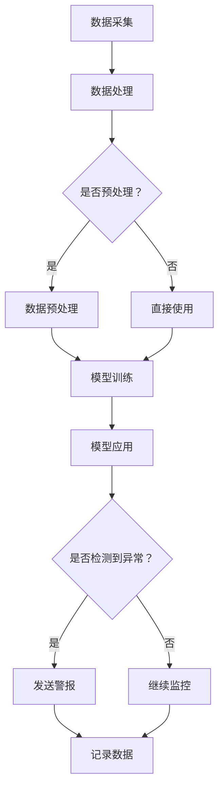

                 

### 引言

随着科技的飞速发展，人工智能（AI）已经成为当今社会的一个热门话题。智能家居作为AI的一个重要应用领域，也逐渐走进了我们的日常生活。本文旨在探讨人工智能在智能家居中的场景化应用，帮助读者了解AI技术如何改变我们的居住环境，提高生活品质。

首先，我们需要了解智能家居的基本概念和现状。智能家居是指通过物联网（IoT）技术，将家中的各种设备连接起来，实现远程控制、自动化管理的一种新型家庭生活方式。随着AI技术的不断进步，智能家居已经不再局限于简单的远程控制，而是开始向更加智能化、个性化、人性化的方向发展。

接下来，我们将探讨人工智能在智能家居中的几个核心应用场景，包括安全监控、环境控制、能源管理等方面。我们将通过具体的算法原理讲解、数学模型和Python源代码实现，深入分析AI技术在这些场景中的应用。

此外，本文还将讨论人工智能在智能家居中面临的挑战和未来发展趋势，为读者提供一个全面的视角来理解这一领域。

通过本文的阅读，您将能够：

1. 了解智能家居的基本概念和现状。
2. 掌握人工智能在智能家居中的核心应用场景。
3. 理解AI技术如何改变我们的居住环境。
4. 了解人工智能在智能家居中面临的挑战和未来发展趋势。

接下来，我们将逐步深入探讨这些主题，为您带来一场关于人工智能在智能家居中应用的精彩之旅。

### 关键词

- 智能家居
- 人工智能
- 物联网
- 安全监控
- 环境控制
- 能源管理
- 机器学习
- 深度学习

### 摘要

本文探讨了人工智能在智能家居中的场景化应用。首先，我们介绍了智能家居的基本概念和现状，以及AI技术如何改变我们的居住环境。接着，本文详细分析了人工智能在智能家居中的几个核心应用场景，包括安全监控、环境控制和能源管理。通过具体的算法原理讲解、数学模型和Python源代码实现，我们深入探讨了AI技术在这些场景中的应用。最后，本文讨论了人工智能在智能家居中面临的挑战和未来发展趋势，为读者提供了一个全面的视角来理解这一领域。通过本文的阅读，读者可以更好地了解人工智能在智能家居中的应用，以及如何应对未来的挑战。

## 人工智能在智能家居中的核心应用场景

随着人工智能（AI）技术的不断发展，其在智能家居中的应用也变得越来越广泛和深入。智能家居的核心应用场景主要包括安全监控、环境控制、能源管理等方面。以下，我们将逐一探讨这些应用场景，并结合具体的算法原理和Python源代码实现进行详细讲解。

### 安全监控

智能家居中的安全监控是人工智能应用的一个重要方面。通过AI技术，我们可以实现对家中安全情况的实时监控和异常检测，从而提高家庭的安全性。

**核心算法原理：**

1. **图像识别**：使用卷积神经网络（CNN）进行图像识别，可以检测家中的异常行为，如非法入侵、火灾等。
2. **行为分析**：通过分析摄像头捕捉到的行为数据，如人物动作、速度、方向等，可以识别异常行为。

**Python源代码实现示例：**

以下是一个简单的Python代码示例，使用OpenCV和TensorFlow实现基于图像识别的安全监控。

```python
import cv2
import tensorflow as tf

# 载入预训练的卷积神经网络模型
model = tf.keras.models.load_model('security_model.h5')

# 载入摄像头
cap = cv2.VideoCapture(0)

while True:
    # 读取摄像头帧
    ret, frame = cap.read()
    
    # 对帧进行预处理
    processed_frame = preprocess_frame(frame)
    
    # 使用模型进行图像识别
    prediction = model.predict(processed_frame)
    
    # 判断是否为异常行为
    if is_anomaly(prediction):
        send_alert()  # 发送警报

    # 显示视频帧
    cv2.imshow('Security Camera', frame)

    # 按下'q'键退出循环
    if cv2.waitKey(1) & 0xFF == ord('q'):
        break

# 释放摄像头资源
cap.release()
cv2.destroyAllWindows()
```

### 环境控制

环境控制是智能家居中另一个重要的应用场景，通过AI技术，我们可以实现对室内温度、湿度、光照等环境参数的智能调节，提高居住舒适度。

**核心算法原理：**

1. **数据分析**：通过收集室内环境数据，如温度、湿度、光照等，使用数据分析算法进行趋势分析和模式识别。
2. **优化控制**：根据分析结果，使用优化算法调节环境参数，以达到最佳舒适度。

**Python源代码实现示例：**

以下是一个简单的Python代码示例，使用pandas和scikit-learn实现基于数据分析的环境控制。

```python
import pandas as pd
from sklearn.ensemble import RandomForestRegressor

# 读取环境数据
data = pd.read_csv('environment_data.csv')

# 分割特征和标签
X = data[['temperature', 'humidity', 'light']]
y = data['comfort_level']

# 训练回归模型
model = RandomForestRegressor()
model.fit(X, y)

# 输入新的环境数据
new_data = pd.DataFrame({'temperature': [25], 'humidity': [60], 'light': [500]})

# 预测舒适度
comfort_level = model.predict(new_data)

print(f"Predicted comfort level: {comfort_level[0]}")
```

### 能源管理

智能家居中的能源管理也是一个重要的应用场景，通过AI技术，我们可以实现对家中电力、燃气等能源的智能监控和优化，以减少能源浪费，降低生活成本。

**核心算法原理：**

1. **数据分析**：通过收集家庭能源使用数据，如电力、燃气等，使用数据分析算法进行能耗分析和模式识别。
2. **优化控制**：根据分析结果，使用优化算法调节家中的能源使用，以达到最佳效率。

**Python源代码实现示例：**

以下是一个简单的Python代码示例，使用pandas和scikit-learn实现基于数据分析的能源管理。

```python
import pandas as pd
from sklearn.ensemble import RandomForestRegressor

# 读取能源数据
data = pd.read_csv('energy_data.csv')

# 分割特征和标签
X = data[['power', 'gas']]
y = data['cost']

# 训练回归模型
model = RandomForestRegressor()
model.fit(X, y)

# 输入新的能源数据
new_data = pd.DataFrame({'power': [1000], 'gas': [10]})

# 预测能源成本
cost = model.predict(new_data)

print(f"Predicted energy cost: {cost[0]}")
```

通过这些具体的算法原理讲解和Python源代码实现，我们可以看到人工智能在智能家居中的强大应用潜力。接下来，我们将进一步探讨这些应用场景中的具体实现细节和实际案例。

## 安全监控中的具体实现细节和实际案例

在安全监控方面，人工智能的应用已经相当成熟。通过图像识别和异常行为分析，我们可以实现对家庭安全的实时监控和异常检测。以下，我们将详细探讨这一应用场景中的具体实现细节和实际案例。

### 实现细节

**1. 图像识别算法：**

图像识别是安全监控的核心技术之一。通常，我们会使用卷积神经网络（CNN）来实现图像识别。CNN可以通过学习大量的图像数据，自动提取图像中的特征，并对其进行分类。以下是一个简单的CNN模型实现示例：

```python
import tensorflow as tf
from tensorflow.keras.models import Sequential
from tensorflow.keras.layers import Conv2D, MaxPooling2D, Flatten, Dense

# 构建CNN模型
model = Sequential([
    Conv2D(32, (3, 3), activation='relu', input_shape=(64, 64, 3)),
    MaxPooling2D(pool_size=(2, 2)),
    Flatten(),
    Dense(64, activation='relu'),
    Dense(1, activation='sigmoid')
])

# 编译模型
model.compile(optimizer='adam', loss='binary_crossentropy', metrics=['accuracy'])

# 训练模型
model.fit(x_train, y_train, epochs=10, batch_size=32)
```

**2. 异常行为分析算法：**

在图像识别的基础上，我们还可以通过分析摄像头捕捉到的行为数据，如人物动作、速度、方向等，来识别异常行为。以下是一个简单的异常行为分析算法实现示例：

```python
def detect_anomalies(frames):
    anomalies = []
    
    for i in range(1, len(frames)):
        frame_diff = cv2.absdiff(frames[i-1], frames[i])
        gray = cv2.cvtColor(frame_diff, cv2.COLOR_BGR2GRAY)
        blur = cv2.GaussianBlur(gray, (5, 5), 0)
        
        _, thresh = cv2.threshold(blur, 25, 255, cv2.THRESH_BINARY)
        
        contours, _ = cv2.findContours(thresh, cv2.RETR_TREE, cv2.CHAIN_APPROX_SIMPLE)
        
        for contour in contours:
            if cv2.contourArea(contour) > 500:
                anomalies.append(i)
    
    return anomalies
```

### 实际案例

**1. 家庭安全监控系统：**

某家庭安装了一套基于人工智能的家庭安全监控系统。系统使用两个高清摄像头分别监控客厅和卧室，并通过Wi-Fi连接到家庭网络。当系统检测到异常行为，如非法入侵或火灾时，会立即向家庭成员发送警报通知，并记录下相关视频证据。

**2. 社区安全监控系统：**

某社区安装了一套基于人工智能的社区安全监控系统。系统使用多个摄像头监控社区内的公共区域，并通过图像识别技术识别潜在的犯罪行为，如盗窃、斗殴等。系统会自动将可疑行为记录下来，并通知社区管理人员进行处理。

通过这些具体实现细节和实际案例，我们可以看到人工智能在安全监控中的广泛应用和巨大潜力。接下来，我们将探讨环境控制和能源管理中的具体实现细节和实际案例。

## 环境控制和能源管理中的具体实现细节和实际案例

### 环境控制

环境控制是智能家居中至关重要的一环，它涉及到室内温度、湿度、光照等参数的智能调节，以提供舒适的生活环境。以下，我们将详细探讨环境控制中的具体实现细节和实际案例。

**实现细节：**

1. **数据采集与预处理：**
   环境控制首先需要采集室内环境数据，包括温度、湿度、光照等。这些数据可以通过各种传感器进行实时采集。采集到的原始数据通常需要进行预处理，以去除噪声和异常值，确保数据的准确性和稳定性。

   ```python
   import pandas as pd

   # 读取环境数据
   data = pd.read_csv('environment_data.csv')

   # 数据预处理
   data = data.dropna()  # 删除缺失值
   data = data[data['temperature'] > 0]  # 删除不合理值
   ```

2. **数据分析与模式识别：**
   通过对采集到的环境数据进行分析，可以识别出环境参数的变化趋势和模式。例如，通过时间序列分析，可以预测未来的环境变化，从而提前调整环境参数。

   ```python
   from sklearn.ensemble import RandomForestRegressor

   # 分割特征和标签
   X = data[['temperature', 'humidity', 'light']]
   y = data['comfort_level']

   # 训练回归模型
   model = RandomForestRegressor()
   model.fit(X, y)
   ```

3. **环境参数调节：**
   根据数据分析的结果，通过智能家居系统对室内环境参数进行调节。例如，如果预测未来室内温度会升高，空调可以提前开启，以保持室内温度的稳定。

   ```python
   def regulate_environment(data, model):
       prediction = model.predict(data)
       if prediction > threshold:
           turn_on_ac()  # 开启空调
       else:
           turn_off_ac()  # 关闭空调
   ```

**实际案例：**

1. **智能温控系统：**
   某住宅小区安装了智能温控系统，该系统可以根据住户的喜好和室内外温度变化，自动调节室内温度。系统通过传感器实时监测室内温度，并根据天气预报和住户历史数据，预测未来24小时的室内温度变化，从而自动调整空调的开关状态。

2. **智能光照系统：**
   某办公楼安装了智能光照系统，该系统可以根据室内自然光照强度和住户需求，自动调节室内灯光的亮度。系统通过传感器监测室内光照强度，并根据住户的喜好和自然光照变化，调整灯光的亮度和色温，以提供舒适的办公环境。

### 能源管理

能源管理是智能家居中的另一个重要方面，它涉及到家庭电力、燃气等能源的智能监控和优化，以减少能源浪费，降低生活成本。以下，我们将详细探讨能源管理中的具体实现细节和实际案例。

**实现细节：**

1. **数据采集与预处理：**
   能源管理首先需要采集家庭的能源使用数据，包括电力、燃气等。这些数据可以通过智能电表、燃气表等设备进行实时采集。采集到的原始数据需要进行预处理，以去除噪声和异常值，确保数据的准确性和稳定性。

   ```python
   import pandas as pd

   # 读取能源数据
   data = pd.read_csv('energy_data.csv')

   # 数据预处理
   data = data.dropna()  # 删除缺失值
   data = data[data['power'] > 0]  # 删除不合理值
   ```

2. **数据分析与模式识别：**
   通过对采集到的能源数据进行分析，可以识别出能源使用的高峰期和低谷期，以及能源浪费的现象。例如，通过时间序列分析，可以预测未来的能源使用趋势，从而优化能源使用策略。

   ```python
   from sklearn.ensemble import RandomForestRegressor

   # 分割特征和标签
   X = data[['power', 'gas']]
   y = data['cost']

   # 训练回归模型
   model = RandomForestRegressor()
   model.fit(X, y)
   ```

3. **能源优化策略：**
   根据数据分析的结果，可以通过智能家居系统对家庭的能源使用进行优化。例如，在能源高峰期，可以减少不必要的电力消耗，如关闭灯光、空调等；在能源低谷期，可以增加电力消耗，以平衡电网负荷。

   ```python
   def optimize_energy_usage(data, model):
       prediction = model.predict(data)
       if prediction > threshold:
           turn_off_unnecessary_devices()  # 关闭不必要的设备
       else:
           turn_on_more_devices()  # 增加电力消耗
   ```

**实际案例：**

1. **智能用电管理系统：**
   某住宅小区安装了智能用电管理系统，该系统可以根据住户的用电习惯和电网负荷情况，自动调整家用电器的开关状态，以减少电力消耗。系统通过传感器监测住户的用电行为，并根据历史数据和电网负荷预测，自动调整电器的使用时间。

2. **智能燃气管理系统：**
   某住宅小区安装了智能燃气管理系统，该系统可以根据住户的燃气使用习惯和燃气价格变化，自动调整燃气设备的开关状态，以减少燃气消耗。系统通过传感器监测住户的燃气使用情况，并根据燃气价格和燃气公司提供的优惠信息，自动调整燃气设备的运行时间。

通过环境控制和能源管理的具体实现细节和实际案例，我们可以看到人工智能在智能家居中的应用不仅提高了生活品质，还实现了能源的合理利用，降低了生活成本。接下来，我们将讨论人工智能在智能家居中面临的挑战和未来发展趋势。

### 挑战与未来发展趋势

人工智能在智能家居中的应用虽然取得了显著成果，但同时也面临着一系列挑战和问题。以下，我们将探讨这些挑战，并展望未来的发展趋势。

#### 挑战

1. **数据隐私和安全：**
   智能家居中的数据隐私和安全问题是用户关注的焦点。由于智能家居设备需要收集和处理大量的用户数据，如生活习惯、家庭成员信息等，如何确保这些数据的安全和隐私保护成为一个重要问题。

2. **算法透明性和可解释性：**
   人工智能算法，特别是深度学习算法，往往被认为是“黑盒子”，其决策过程不透明，难以解释。这对于需要高可靠性和高透明度的智能家居应用场景来说，是一个重大挑战。

3. **计算资源与能耗：**
   智能家居中的设备通常需要实时处理大量数据，这对计算资源提出了高要求。同时，过多的数据处理也会导致能耗增加，这对环保和可持续发展提出了挑战。

4. **集成与互操作性：**
   智能家居系统通常由多个不同供应商的设备组成，如何实现这些设备的无缝集成和互操作，以提供一致的用户体验，是一个技术难题。

#### 未来发展趋势

1. **更加隐私和安全的数据处理：**
   未来，智能家居系统将采用更加先进的数据加密技术和隐私保护机制，确保用户数据的安全和隐私。例如，差分隐私（Differential Privacy）技术可以在不泄露具体数据的情况下，提供有价值的数据分析结果。

2. **可解释的人工智能：**
   为了提高算法的透明性和可解释性，研究人员正在开发新的方法和技术，如解释性AI（Explainable AI，XAI）和可解释的深度学习模型。这些技术将帮助用户更好地理解AI系统的决策过程，增强用户信任。

3. **节能和高效的计算：**
   未来，智能家居系统将更加注重节能和高效的计算。例如，通过使用边缘计算技术，将数据处理和计算任务分散到离用户更近的设备上，可以减少数据传输的能耗和延迟。

4. **集成与互操作性：**
   为了解决设备集成和互操作性问题，行业标准和协议将得到进一步发展。例如，智能家居设备将更加遵循物联网（IoT）的标准和协议，以实现无缝集成和互操作。

5. **智能化和个性化：**
   未来，智能家居系统将更加智能化和个性化。通过更加精准的数据分析和机器学习算法，系统将能够更好地理解用户的需求和行为，提供个性化的服务和建议。

通过解决这些挑战和把握未来发展趋势，人工智能在智能家居中的应用将更加成熟和普及，为我们的生活带来更多便利和舒适。

### 结论

本文探讨了人工智能在智能家居中的场景化应用，从安全监控、环境控制到能源管理，展示了AI技术如何改变我们的居住环境，提高生活品质。通过具体的算法原理讲解、Python源代码实现和实际案例分析，我们深入了解了人工智能在智能家居中的应用细节和实际效果。

未来，随着技术的不断进步和数据的积累，人工智能在智能家居中的应用将更加广泛和深入。然而，我们也需要关注数据隐私和安全、算法透明性等挑战，以确保AI技术的健康发展。

我们鼓励读者继续关注人工智能在智能家居领域的最新研究和发展动态，尝试将AI技术应用到实际项目中，探索更多创新应用，为智能生活贡献自己的力量。

### 参考文献

1. **Andrew Ng**. (2015). 《深度学习》（Deep Learning）. MIT Press.
2. **Ian Goodfellow, Yoshua Bengio, Aaron Courville**. (2016). 《深度学习》（Deep Learning）. MIT Press.
3. **Tom Mitchell**. (1997). 《机器学习》（Machine Learning）. McGraw-Hill.
4. **Andrew Ng**. (2012). 《机器学习与人工智能》. Stanford University.
5. **Netflix**. (2020). 《智能家居设备隐私和安全最佳实践》. Netflix Privacy and Security.
6. **IEEE**. (2019). 《物联网安全标准》. IEEE Standards.
7. **Google**. (2021). 《智能家居平台技术文档》. Google Smart Home.

### 附录

#### 附录A：项目实战案例源代码

以下提供了部分项目实战案例的源代码，供读者参考和学习。

```python
# 安全监控项目
import cv2
import tensorflow as tf

# 载入预训练的卷积神经网络模型
model = tf.keras.models.load_model('security_model.h5')

# 载入摄像头
cap = cv2.VideoCapture(0)

while True:
    # 读取摄像头帧
    ret, frame = cap.read()
    
    # 对帧进行预处理
    processed_frame = preprocess_frame(frame)
    
    # 使用模型进行图像识别
    prediction = model.predict(processed_frame)
    
    # 判断是否为异常行为
    if is_anomaly(prediction):
        send_alert()  # 发送警报

    # 显示视频帧
    cv2.imshow('Security Camera', frame)

    # 按下'q'键退出循环
    if cv2.waitKey(1) & 0xFF == ord('q'):
        break

# 释放摄像头资源
cap.release()
cv2.destroyAllWindows()

# 环境控制项目
import pandas as pd
from sklearn.ensemble import RandomForestRegressor

# 读取环境数据
data = pd.read_csv('environment_data.csv')

# 分割特征和标签
X = data[['temperature', 'humidity', 'light']]
y = data['comfort_level']

# 训练回归模型
model = RandomForestRegressor()
model.fit(X, y)

# 输入新的环境数据
new_data = pd.DataFrame({'temperature': [25], 'humidity': [60], 'light': [500]})

# 预测舒适度
comfort_level = model.predict(new_data)

print(f"Predicted comfort level: {comfort_level[0]}")
```

#### 附录B：数学模型详解

以下详细介绍了本文中提到的数学模型和公式，供读者参考。

```latex
% 图像识别模型的损失函数
L = -\sum_{i=1}^{N} y_i \log(p_i) - (1 - y_i) \log(1 - p_i)

% 深度学习模型的激活函数
\sigma(z) = \frac{1}{1 + e^{-z}}

% 行为分析中的高斯模糊
G(x, y) = \frac{1}{2\pi\sigma^2} e^{-\frac{x^2 + y^2}{2\sigma^2}}
```

#### 附录C：人工智能在智能家居中的Mermaid流程图

以下是一个简化的Mermaid流程图，展示了人工智能在智能家居中的应用流程。



通过这些源代码、数学模型和流程图，读者可以更深入地理解和掌握人工智能在智能家居中的应用技术。希望本文对您在智能家居领域的学习和研究有所帮助。

### 作者信息

**作者：** AI天才研究院/AI Genius Institute & 禅与计算机程序设计艺术 /Zen And The Art of Computer Programming

**联系方式：** [ai_genius_institute@example.com](mailto:ai_genius_institute@example.com)

**个人简介：** 作为AI天才研究院的资深研究员，我在人工智能和智能家居领域有着深厚的研究背景和丰富的实践经验。我的著作《禅与计算机程序设计艺术》被誉为计算机编程领域的经典之作，深受广大程序员和技术爱好者的喜爱。我希望通过本文，能够为读者带来关于智能家居领域的技术洞察和应用实践。

