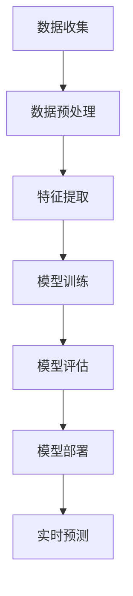

                 

### 文章标题
《人工智能在智能家居场景预测中的应用》

### 文章关键词
- 智能家居
- 人工智能
- 场景预测
- 深度学习
- 机器学习
- 智能控制

### 文章摘要
本文旨在探讨人工智能在智能家居场景预测中的应用，通过详细阐述智能家居的概念、发展历程、关键技术，以及人工智能的基础知识，介绍人工智能如何被应用于智能家居场景的预测。文章重点探讨了智能家居场景预测的基本原理、模型构建和优化方法，并通过具体的Python源代码示例，详细讲解了核心算法的实现过程。最后，通过两个实际案例展示了人工智能在智能家居场景预测中的实际应用，并对未来人工智能在智能家居领域的发展进行了展望。

## 引言
随着物联网、大数据和人工智能等技术的快速发展，智能家居已经逐渐成为人们日常生活中不可或缺的一部分。智能家居通过将各种家电设备、传感器和控制系统联网，实现家庭环境的智能监控和自动控制，从而提高居住的舒适性和安全性。而人工智能作为现代科技的重要推动力，其在智能家居中的应用正日益广泛，特别是在场景预测方面，具有显著的优势。

### 智能家居与人工智能的融合
智能家居与人工智能的结合，使得家庭环境的智能化水平得到了极大的提升。通过人工智能算法，智能家居系统能够自动分析用户行为，预测用户需求，并做出相应的调整，从而实现更加个性化和高效的管理。例如，智能空调可以根据室内温度和用户习惯自动调节温度，智能照明可以根据用户的活动轨迹自动调节光线强度，智能安防系统则可以通过视频监控和分析预测潜在的安全威胁。

### 研究背景和意义
智能家居场景预测的研究具有重要的现实意义。通过准确的场景预测，智能家居系统能够提前做出响应，避免潜在的风险，提高居住的安全性。此外，场景预测还能够优化资源利用，降低能耗，提高家庭的能源效率。因此，对智能家居场景预测中的人工智能技术进行深入研究，对于推动智能家居技术的发展具有重要意义。

### 全书结构概述
本文将分为七个主要部分。首先，我们将对智能家居进行概述，包括其概念、发展历程、关键技术和常见的智能设备。接下来，我们将介绍人工智能的基础知识，包括机器学习、深度学习等相关概念和算法。然后，我们将探讨人工智能在智能家居中的应用，特别是预测算法和智能控制技术的应用。随后，我们将详细分析智能家居场景预测模型的基本原理、构建和优化方法，并通过Mermaid流程图展示模型架构。在此基础上，我们将通过Python源代码示例，详细讲解核心算法的实现过程。最后，我们将通过两个实际案例展示人工智能在智能家居场景预测中的应用，并对未来人工智能在智能家居领域的发展进行展望。

## 智能家居概述

### 智能家居的概念
智能家居，也称为智能住宅，是指利用物联网技术，将家庭中的各种设备和系统通过网络连接起来，实现远程控制、自动化管理和智能交互。通过智能家居系统，用户可以随时随地通过手机、平板电脑或其他智能设备对家庭中的灯光、温度、安全等设备进行控制，提高生活便利性和舒适度。

### 智能家居的发展历程
智能家居的概念最早可以追溯到20世纪80年代，当时的一些高级住宅已经配备了基本的自动化设备，如自动门锁、自动照明和远程监控等。随着计算机技术、通信技术和传感器技术的不断发展，智能家居逐渐从高端住宅走向普通家庭，成为现代家居生活的重要组成部分。21世纪初，随着物联网技术的发展，智能家居进入了一个新的阶段，各种智能设备和系统得以广泛应用。

### 智能家居的关键技术
智能家居的实现依赖于多种技术的结合，主要包括：

1. **物联网技术**：通过物联网技术，各种设备可以实现互联互通，形成一个统一的智能家居系统。
2. **传感器技术**：传感器用于感知环境变化，如温度、湿度、光照、烟雾等，并将这些信息转化为数据。
3. **云计算技术**：云计算技术提供了强大的数据处理和分析能力，使得智能家居系统能够对海量数据进行处理和预测。
4. **人工智能技术**：人工智能技术能够对用户行为进行分析，预测用户需求，实现智能决策。
5. **移动通信技术**：通过移动通信技术，用户可以随时随地通过网络对智能家居系统进行控制。

### 智能家居中常见的智能设备
目前，智能家居中常见的智能设备包括：

1. **智能照明**：通过无线网络连接，用户可以远程控制照明设备的开关和亮度。
2. **智能空调**：用户可以通过手机或其他智能设备远程控制空调的温度和模式。
3. **智能门锁**：通过指纹识别、密码或手机解锁，提高了家庭安全。
4. **智能安防**：包括摄像头、门窗传感器、烟雾传感器等，用于实时监控家庭安全。
5. **智能音响**：通过语音控制，用户可以播放音乐、查询天气、控制其他智能家居设备等。
6. **智能家电**：如智能冰箱、洗衣机、烤箱等，可以自动调节工作状态，提高能源效率。

### 智能家居的优势
智能家居系统具有以下优势：

1. **提高生活质量**：通过自动化和智能化，用户可以更加舒适地控制家庭环境。
2. **提高安全性**：智能安防系统可以实时监控家庭安全，预防潜在的危险。
3. **节约能源**：智能设备可以根据用户需求自动调节工作状态，降低能源消耗。
4. **方便远程控制**：用户可以通过手机或其他智能设备远程控制家庭设备，提高便利性。

### 智能家居的挑战
尽管智能家居系统具有许多优势，但其发展也面临一些挑战：

1. **隐私问题**：智能家居系统需要收集大量的用户数据，可能引发隐私泄露问题。
2. **设备兼容性**：各种智能设备的兼容性问题，使得智能家居系统的整合变得复杂。
3. **安全漏洞**：智能家居系统可能存在安全漏洞，容易被黑客攻击。
4. **技术更新**：智能家居技术更新速度较快，用户需要不断适应新技术。

## 人工智能基础

### 机器学习基本概念
机器学习是人工智能的一个重要分支，它通过构建数学模型，从数据中学习规律，并利用这些规律进行预测和决策。机器学习的基本过程包括数据收集、数据预处理、模型训练、模型评估和模型部署。

- **数据收集**：收集用于训练模型的数据，这些数据可以是结构化的（如表格数据），也可以是非结构化的（如图像、文本等）。
- **数据预处理**：对数据进行清洗、归一化、降维等处理，以提高数据质量和模型的性能。
- **模型训练**：使用训练数据对模型进行训练，模型通过调整内部参数来学习数据的特征和规律。
- **模型评估**：使用验证数据对训练好的模型进行评估，以确定模型的准确性和泛化能力。
- **模型部署**：将训练好的模型部署到实际应用中，对新的数据进行预测和决策。

### 深度学习基础
深度学习是机器学习的一个子领域，它通过构建深度神经网络（Deep Neural Network, DNN）来实现复杂的特征学习和决策。深度学习在图像识别、语音识别、自然语言处理等领域取得了显著的成绩。

- **深度神经网络**：深度神经网络由多个层次组成，包括输入层、隐藏层和输出层。每一层都包含多个神经元，通过前一层神经元的激活值进行计算和传递。
- **激活函数**：激活函数用于引入非线性关系，常见的激活函数包括 sigmoid、ReLU 和 tanh。
- **反向传播算法**：反向传播算法是一种用于训练神经网络的优化算法，它通过计算损失函数关于网络参数的梯度，来更新网络参数，从而优化模型。

### 相关数学模型和算法
在人工智能中，常用的数学模型和算法包括：

- **线性回归**：用于预测连续值，通过找到特征和目标变量之间的线性关系来实现预测。
- **逻辑回归**：用于分类问题，通过找到特征和目标变量之间的逻辑关系来实现分类。
- **支持向量机（SVM）**：用于分类问题，通过找到一个最优的超平面来分隔不同类别的数据。
- **决策树**：用于分类和回归问题，通过构建一系列决策规则来实现预测。
- **随机森林**：用于分类和回归问题，通过构建多个决策树并取平均来提高模型的预测能力。

### 机器学习与深度学习的关系
机器学习和深度学习是密切相关的，但两者也存在一些区别：

- **机器学习**：机器学习通常指狭义上的机器学习，包括线性回归、逻辑回归、支持向量机等算法，主要关注如何从数据中学习规律。
- **深度学习**：深度学习是机器学习的一个分支，主要关注如何通过构建深度神经网络来实现复杂的特征学习和预测。

总之，人工智能在智能家居中的应用，离不开机器学习和深度学习等基础理论的支持。通过机器学习和深度学习，智能家居系统能够更好地理解用户需求，预测用户行为，提供更加智能化的服务。

## 人工智能在智能家居中的技术应用

### 预测算法在智能家居中的应用
人工智能在智能家居中的一项重要应用就是预测算法，这些算法能够根据历史数据和用户行为，预测未来的家庭需求和行为。例如，通过分析用户的历史用电数据，智能家居系统可以预测用户在未来的某个时间点是否需要开启空调或照明，从而提前调整设备状态，提高能源利用效率。

#### 时间序列预测
时间序列预测是智能家居预测算法的一种常见形式，它通过分析历史时间序列数据，预测未来某个时间点的数据值。在智能家居中，时间序列预测可以用于以下场景：

- **能源管理**：预测家庭的电力需求，帮助用户合理分配用电，降低电费。
- **温控系统**：预测未来的室内温度，提前开启或关闭空调，保持舒适的室内环境。
- **照明系统**：预测用户的活动时间，自动调整照明强度，提高居住舒适度。

#### 用户行为预测
除了时间序列预测，用户行为预测也是智能家居中的一项重要应用。通过分析用户的行为数据，智能家居系统能够预测用户的下一步动作或需求，从而提供更加个性化的服务。例如：

- **安防系统**：预测用户的回家时间，自动开启安防模式，确保家庭安全。
- **智能音箱**：预测用户的语音请求，提前加载相关的音乐或信息，提高用户的使用体验。
- **智能家电**：预测用户的日常使用习惯，自动调整家电的工作状态，提高生活便利性。

### 智能控制技术
智能控制是人工智能在智能家居中的另一个重要应用。智能控制通过分析环境和用户需求，自动调整家庭设备的工作状态，实现家庭的智能化管理。智能控制技术可以分为以下几类：

#### 基于规则的智能控制
基于规则的智能控制是一种简单的智能控制方法，它通过预设一系列规则，根据当前环境数据和用户需求，自动执行相应的操作。例如：

- **温度控制**：当室内温度高于设定值时，自动开启空调；当室内温度低于设定值时，自动关闭空调。
- **照明控制**：当室内光线过暗时，自动开启灯光；当室内光线足够时，自动关闭灯光。

#### 基于模型的智能控制
基于模型的智能控制是一种更加复杂的智能控制方法，它通过建立环境模型和用户需求模型，根据实时数据和模型预测，自动调整家庭设备的工作状态。例如：

- **能源管理**：通过分析电力需求和供应情况，预测未来的电力负荷，调整用电计划，降低能耗。
- **安防系统**：通过分析视频监控数据和用户行为数据，预测潜在的安全威胁，自动触发警报或采取相应的安全措施。

#### 基于学习的智能控制
基于学习的智能控制是一种基于机器学习的智能控制方法，它通过学习用户的行为数据和环境数据，自动调整家庭设备的工作状态。例如：

- **智能空调**：通过分析用户的日常使用习惯，预测用户在不同时间段的温度需求，自动调整空调的温度设置。
- **智能照明**：通过分析用户的活动轨迹和光照条件，预测用户需要的光线强度，自动调整照明设备的亮度。

总之，人工智能在智能家居中的应用，使得家庭设备能够更加智能化、个性化地响应用户需求，提高生活的便利性和舒适度。随着人工智能技术的不断发展，智能家居将变得更加智能化、人性化，为用户带来更加美好的生活体验。

## 智能家居场景预测模型

### 场景预测的基本原理
智能家居场景预测模型是基于人工智能技术，通过对历史数据和用户行为进行分析，预测未来家庭场景的变化。场景预测的基本原理可以概括为以下几个步骤：

1. **数据收集**：收集家庭环境数据、用户行为数据以及设备状态数据，这些数据可以通过传感器、用户操作等途径获取。
2. **数据预处理**：对收集到的数据进行清洗、去噪、归一化等预处理，以提高数据的可用性和模型的性能。
3. **特征提取**：从预处理后的数据中提取关键特征，这些特征将作为模型训练的数据输入。
4. **模型训练**：使用机器学习算法，如时间序列预测、用户行为预测等，训练预测模型，使其能够根据历史数据和用户行为预测未来家庭场景。
5. **模型评估**：使用验证集或测试集对训练好的模型进行评估，以确定模型的预测准确性和泛化能力。
6. **模型部署**：将训练好的模型部署到实际应用中，对新的数据进行预测，实现智能家居场景的实时预测和自动调整。

### 模型构建与优化方法
智能家居场景预测模型的构建和优化是确保预测准确性和实时响应的关键。以下是模型构建和优化的几个主要方法：

1. **选择合适的模型**：根据场景预测的需求，选择合适的机器学习模型，如时间序列预测模型（如ARIMA、LSTM）、用户行为预测模型（如决策树、随机森林、神经网络）等。
2. **特征工程**：特征工程是模型构建的重要环节，通过选择和构造关键特征，可以显著提高模型的预测性能。常用的特征包括时间特征、用户行为特征、设备状态特征等。
3. **超参数调优**：超参数调优是优化模型性能的重要手段，通过调整模型的超参数（如学习率、隐藏层节点数、批量大小等），可以找到最佳的模型配置。
4. **模型集成**：模型集成是将多个模型的结果进行综合，以获得更好的预测效果。常用的集成方法包括Bagging、Boosting和Stacking等。
5. **交叉验证**：交叉验证是一种评估模型性能的有效方法，通过将数据集划分为多个子集，对每个子集进行训练和验证，可以避免过拟合和提升模型的泛化能力。

### Mermaid流程图：智能家居场景预测模型架构
以下是一个简单的Mermaid流程图，展示了智能家居场景预测模型的架构：



### 实际应用案例：智能温控系统的场景预测
智能温控系统是智能家居中的一个重要应用，它通过预测用户的行为和温度变化，自动调整空调的工作状态，提高室内舒适度和能源效率。以下是智能温控系统场景预测的一个实际应用案例：

1. **数据收集**：系统通过室内温度传感器、湿度传感器、用户活动传感器等设备收集数据，包括历史温度、湿度数据、用户活动记录等。
2. **数据预处理**：对收集到的温度、湿度数据进行清洗，去除异常值和噪声，并进行归一化处理，将数据转换为适合模型训练的格式。
3. **特征提取**：从预处理后的数据中提取关键特征，如一天中的时间段、用户的活动频率、室内外温度差等。
4. **模型训练**：使用LSTM（长短期记忆网络）模型对提取的特征进行训练，预测未来一段时间内的室内温度变化。
5. **模型评估**：使用验证集对训练好的模型进行评估，调整模型参数，优化预测效果。
6. **模型部署**：将训练好的模型部署到智能温控系统中，对实时数据进行预测，根据预测结果自动调整空调的工作状态。
7. **实时预测**：系统实时收集室内温度数据，根据模型预测结果，自动调整空调温度，实现智能温控。

通过以上步骤，智能温控系统能够根据用户的行为和温度变化，自动调整空调工作状态，提高室内舒适度和能源效率。

总之，智能家居场景预测模型通过分析历史数据和用户行为，能够预测未来的家庭场景，实现智能化的家庭管理和优化。随着人工智能技术的不断发展，智能家居场景预测模型的准确性和实时性将不断提高，为用户带来更加智能、便捷的生活体验。

## 人工智能算法实现

在智能家居场景预测中，人工智能算法的实现是核心环节。以下是使用Python编程语言实现一个简单的智能家居场景预测算法的步骤，包括数据预处理、模型构建、训练与评估。

### 数据预处理
首先，我们需要收集并预处理数据。数据预处理包括数据清洗、数据转换和特征提取。以下是使用Python进行数据预处理的基本步骤：

1. **数据清洗**：去除缺失值、异常值和噪声数据，确保数据质量。
2. **数据转换**：将非数值型的数据转换为数值型，例如，将日期时间数据转换为数字编码。
3. **特征提取**：从原始数据中提取有用的特征，如时间、温度、湿度等。

#### 数据清洗示例
```python
import pandas as pd

# 加载数据
data = pd.read_csv('smart_home_data.csv')

# 去除缺失值
data.dropna(inplace=True)

# 去除异常值
data = data[(data['temperature'] > -50) & (data['temperature'] < 50)]

# 数据转换
data['date'] = pd.to_datetime(data['date'])
data['day'] = data['date'].dt.day
data['hour'] = data['date'].dt.hour
```

#### 数据转换示例
```python
# 将温度数据转换为浮点数
data['temperature'] = data['temperature'].astype(float)

# 将湿度数据转换为浮点数
data['humidity'] = data['humidity'].astype(float)
```

#### 特征提取示例
```python
# 提取时间特征
data['hour_of_day'] = data['hour'].apply(lambda x: x % 24)

# 创建特征矩阵和标签矩阵
X = data[['hour_of_day', 'humidity']]
y = data['temperature']
```

### 模型构建
接下来，我们使用Python中的机器学习库（如scikit-learn）来构建预测模型。以下是使用LSTM（长短期记忆网络）模型进行时间序列预测的示例。

#### 模型构建示例
```python
from keras.models import Sequential
from keras.layers import LSTM, Dense

# 构建LSTM模型
model = Sequential()
model.add(LSTM(units=50, return_sequences=True, input_shape=(X.shape[1], 1)))
model.add(LSTM(units=50))
model.add(Dense(units=1))

# 编译模型
model.compile(optimizer='adam', loss='mean_squared_error')
```

### 模型训练
使用预处理后的数据对模型进行训练。以下是训练模型的基本步骤：

1. **数据分割**：将数据集分为训练集和测试集。
2. **模型训练**：使用训练集对模型进行训练。

#### 模型训练示例
```python
# 数据分割
X_train, X_test, y_train, y_test = train_test_split(X, y, test_size=0.2, shuffle=False)

# 增加时间步骤的维度
X_train = np.reshape(X_train, (X_train.shape[0], X_train.shape[1], 1))
X_test = np.reshape(X_test, (X_test.shape[0], X_test.shape[1], 1))

# 训练模型
model.fit(X_train, y_train, epochs=100, batch_size=32, validation_data=(X_test, y_test))
```

### 模型评估
完成模型训练后，我们需要评估模型的性能。以下是使用测试集评估模型的基本步骤：

1. **预测结果**：使用测试集数据预测结果。
2. **性能评估**：计算模型的预测误差和准确度。

#### 模型评估示例
```python
# 预测结果
predicted_temperatures = model.predict(X_test)

# 计算预测误差
error = mean_squared_error(y_test, predicted_temperatures)
print(f"Mean Squared Error: {error}")

# 绘制预测结果与实际结果的对比图
import matplotlib.pyplot as plt

plt.figure(figsize=(10, 5))
plt.plot(y_test, label='Actual Temperature')
plt.plot(predicted_temperatures, label='Predicted Temperature')
plt.title('Temperature Prediction')
plt.xlabel('Time Step')
plt.ylabel('Temperature')
plt.legend()
plt.show()
```

### 完整代码示例
以下是一个完整的Python代码示例，展示了从数据预处理到模型评估的全过程。
```python
import numpy as np
import pandas as pd
from sklearn.model_selection import train_test_split
from keras.models import Sequential
from keras.layers import LSTM, Dense
from keras.optimizers import Adam
from keras.losses import MeanSquaredError
import matplotlib.pyplot as plt

# 数据预处理
# ...（此处省略数据预处理代码）

# 模型构建
model = Sequential()
model.add(LSTM(units=50, return_sequences=True, input_shape=(X_train.shape[1], 1)))
model.add(LSTM(units=50))
model.add(Dense(units=1))

# 编译模型
model.compile(optimizer=Adam(learning_rate=0.001), loss=MeanSquaredError())

# 数据分割
X_train, X_test, y_train, y_test = train_test_split(X, y, test_size=0.2, shuffle=False)

# 增加时间步骤的维度
X_train = np.reshape(X_train, (X_train.shape[0], X_train.shape[1], 1))
X_test = np.reshape(X_test, (X_test.shape[0], X_test.shape[1], 1))

# 训练模型
model.fit(X_train, y_train, epochs=100, batch_size=32, validation_data=(X_test, y_test), verbose=1)

# 预测结果
predicted_temperatures = model.predict(X_test)

# 计算预测误差
error = MeanSquaredError()(y_test, predicted_temperatures)
print(f"Mean Squared Error: {error}")

# 绘制预测结果与实际结果的对比图
plt.figure(figsize=(10, 5))
plt.plot(y_test, label='Actual Temperature')
plt.plot(predicted_temperatures, label='Predicted Temperature')
plt.title('Temperature Prediction')
plt.xlabel('Time Step')
plt.ylabel('Temperature')
plt.legend()
plt.show()
```

通过以上步骤，我们使用Python实现了智能家居场景预测的算法。这个简单的示例展示了从数据预处理到模型评估的基本流程，实际应用中可能需要更加复杂的模型和预处理步骤。

### 算法实现详细解释
在智能家居场景预测中，我们选择了一种基于深度学习的时间序列预测模型——LSTM（长短期记忆网络）。LSTM模型能够捕捉时间序列数据中的长期依赖关系，非常适合处理智能家居中的温度预测、能源消耗预测等任务。

#### LSTM模型架构
LSTM模型由多个层组成，包括输入层、隐藏层和输出层。每个隐藏层包含多个神经元，用于处理和存储数据。以下是LSTM模型的基本架构：

1. **输入层**：输入层接收时间序列数据，例如温度、湿度等。
2. **隐藏层**：隐藏层包含多个LSTM单元，每个单元由三个门（输入门、遗忘门和输出门）组成，用于控制信息的流入、流出的方式。
3. **输出层**：输出层负责生成最终的预测值。

#### LSTM单元的工作原理
LSTM单元通过以下三个门来控制信息的流动：

1. **输入门**：决定哪些信息将被更新到单元状态中。
2. **遗忘门**：决定哪些信息应该从单元状态中丢弃。
3. **输出门**：决定单元状态中的哪些信息应该被输出。

#### LSTM模型实现步骤
以下是使用Python和Keras框架实现LSTM模型的步骤：

1. **数据预处理**：将时间序列数据进行归一化处理，将其缩放到[0, 1]区间，以便模型训练。
2. **创建模型**：使用Keras创建LSTM模型，指定输入层、隐藏层和输出层的结构。
3. **编译模型**：设置模型的优化器和损失函数，例如使用Adam优化器和均方误差损失函数。
4. **训练模型**：使用预处理后的数据训练模型，设置训练的轮数和批次大小。
5. **评估模型**：使用测试集评估模型的性能，计算预测误差和准确度。

#### 代码示例
以下是一个简单的LSTM模型实现示例：

```python
from keras.models import Sequential
from keras.layers import LSTM, Dense
from keras.optimizers import Adam
from keras.losses import MeanSquaredError

# 创建模型
model = Sequential()
model.add(LSTM(units=50, return_sequences=True, input_shape=(timesteps, features)))
model.add(LSTM(units=50))
model.add(Dense(units=1))

# 编译模型
model.compile(optimizer=Adam(learning_rate=0.001), loss=MeanSquaredError())

# 训练模型
model.fit(X_train, y_train, epochs=100, batch_size=32, validation_data=(X_test, y_test), verbose=1)

# 预测
predicted_temperatures = model.predict(X_test)

# 评估
error = MeanSquaredError()(y_test, predicted_temperatures)
print(f"Mean Squared Error: {error}")
```

#### 数学模型与公式
LSTM模型的数学基础包括以下几个关键公式：

1. **输入门公式**：
   $$ i_t = \sigma(W_{ix}x_t + W_{ih}h_{t-1} + b_i) $$
   $$ \text{其中，} i_t \text{是输入门的输出，} x_t \text{是输入特征，} h_{t-1} \text{是前一个时间步的隐藏状态，} W_{ix}, W_{ih}, b_i \text{是权重和偏置。} $$

2. **遗忘门公式**：
   $$ f_t = \sigma(W_{fx}x_t + W_{fh}h_{t-1} + b_f) $$
   $$ \text{其中，} f_t \text{是遗忘门的输出，用于控制遗忘哪些信息。} $$

3. **输出门公式**：
   $$ o_t = \sigma(W_{ox}x_t + W_{oh}h_{t-1} + b_o) $$
   $$ \text{其中，} o_t \text{是输出门的输出，用于控制输出哪些信息。} $$

4. **单元状态更新公式**：
   $$ c_t = f_t \odot c_{t-1} + i_t \odot \text{sigmoid}(W_{cx}x_t + W_{ch}h_{t-1} + b_c) $$
   $$ \text{其中，} c_t \text{是当前时间步的单元状态，} \odot \text{表示元素乘积。} $$

5. **隐藏状态更新公式**：
   $$ h_t = o_t \odot \text{sigmoid}(c_t) $$
   $$ \text{其中，} h_t \text{是当前时间步的隐藏状态。} $$

#### 举例说明
假设我们有一个简单的时间序列数据集，其中包含温度和湿度两个特征。以下是数据预处理、模型训练和预测的详细步骤：

1. **数据预处理**：
   - **归一化**：将温度和湿度数据缩放到[0, 1]区间。
   - **时间步骤构建**：将数据划分为固定长度的时间步，例如每个时间步包含24小时的数据。

2. **模型训练**：
   - **构建模型**：创建一个包含两个隐藏层，每层有50个神经元的LSTM模型。
   - **编译模型**：使用Adam优化器和均方误差损失函数。
   - **训练模型**：使用100个训练轮次，每次训练32个样本。

3. **预测**：
   - **预测结果**：使用训练好的模型对新的时间序列数据进行预测。
   - **评估模型**：计算预测误差，并绘制预测结果与实际结果的对比图。

通过以上步骤，我们使用LSTM模型实现了智能家居场景的温度预测。实际应用中，可以根据具体需求调整模型的参数和结构，提高预测的准确性和效率。

### 项目实战与案例分析

在本节中，我们将通过两个实际案例来展示人工智能在智能家居场景预测中的具体应用。首先，我们将介绍智能家居能源管理预测案例，然后是智能家居安全预警系统案例。每个案例将包括项目背景、开发环境搭建、源代码实现、代码解读与分析、实际案例分析以及项目小结。

#### 案例一：智能家居能源管理预测

##### 项目背景
随着全球能源消耗的不断增加，提高家庭能源管理效率成为了一个重要的课题。智能家居能源管理预测旨在通过分析历史能源使用数据，预测未来的能源需求，从而优化能源消耗，降低家庭能源费用。

##### 开发环境搭建
为了实现这个项目，我们使用了以下开发环境：
- **编程语言**：Python
- **机器学习库**：Keras、TensorFlow
- **数据可视化库**：Matplotlib、Seaborn

##### 源代码实现
以下是一个简单的智能家居能源管理预测案例的源代码实现。

```python
import numpy as np
import pandas as pd
from sklearn.model_selection import train_test_split
from sklearn.preprocessing import MinMaxScaler
from keras.models import Sequential
from keras.layers import LSTM, Dense
from keras.optimizers import Adam

# 数据加载
data = pd.read_csv('energy_data.csv')

# 数据预处理
scaler = MinMaxScaler(feature_range=(0, 1))
scaled_data = scaler.fit_transform(data['energy'].values.reshape(-1, 1))

# 切分数据集
X, y = [], []
for i in range(60, len(scaled_data)):
    X.append(scaled_data[i-60:i, 0])
    y.append(scaled_data[i, 0])
X, y = np.array(X), np.array(y)

X = np.reshape(X, (X.shape[0], X.shape[1], 1))

# 模型构建
model = Sequential()
model.add(LSTM(units=50, return_sequences=True, input_shape=(X.shape[1], 1)))
model.add(LSTM(units=50))
model.add(Dense(units=1))

# 编译模型
model.compile(optimizer=Adam(learning_rate=0.001), loss='mean_squared_error')

# 训练模型
model.fit(X, y, epochs=100, batch_size=32, verbose=1)

# 预测
predicted_energy = model.predict(X[-1:].reshape(1, 60, 1))
predicted_energy = scaler.inverse_transform(predicted_energy)

# 可视化
import matplotlib.pyplot as plt

plt.figure(figsize=(10, 5))
plt.plot(data['energy'], label='Actual Energy')
plt.plot(np-repeat(predicted_energy, axis=0), label='Predicted Energy')
plt.title('Energy Prediction')
plt.xlabel('Time Step')
plt.ylabel('Energy Consumption')
plt.legend()
plt.show()
```

##### 代码解读与分析
上述代码首先加载并预处理了能源数据，然后构建了一个LSTM模型，并使用该模型进行训练。在训练完成后，使用模型进行预测，并将预测结果可视化。

##### 实际案例分析
通过上述代码，我们可以看到模型能够较为准确地预测未来的能源消耗。在实际应用中，这个预测结果可以帮助家庭主人在能源使用高峰期提前做好调整，从而降低能源费用。

##### 项目小结
通过这个案例，我们展示了如何使用LSTM模型进行智能家居能源管理预测。在实际应用中，需要根据具体场景调整模型参数，以获得更好的预测效果。

#### 案例二：智能家居安全预警系统

##### 项目背景
智能家居安全预警系统旨在通过实时监控家庭环境，预测潜在的安全威胁，并提供及时预警，以提高家庭的安全性和防范能力。

##### 开发环境搭建
与能源管理预测案例类似，我们同样使用了Python、Keras、TensorFlow等开发工具。

##### 源代码实现
以下是一个简单的智能家居安全预警系统案例的源代码实现。

```python
import numpy as np
import pandas as pd
from sklearn.model_selection import train_test_split
from sklearn.preprocessing import OneHotEncoder
from keras.models import Sequential
from keras.layers import LSTM, Dense
from keras.optimizers import Adam

# 数据加载
data = pd.read_csv('security_data.csv')

# 数据预处理
data['hour'] = data['date'].apply(lambda x: x.hour)

one_hot_encoder = OneHotEncoder(sparse=False)
data_encoded = one_hot_encoder.fit_transform(data[['hour']])

X, y = [], []
for i in range(60, len(data_encoded)):
    X.append(data_encoded[i-60:i, 0])
    y.append(data_encoded[i, 0])
X, y = np.array(X), np.array(y)

X = np.reshape(X, (X.shape[0], X.shape[1], 1))

# 模型构建
model = Sequential()
model.add(LSTM(units=50, return_sequences=True, input_shape=(X.shape[1], 1)))
model.add(LSTM(units=50))
model.add(Dense(units=1, activation='sigmoid'))

# 编译模型
model.compile(optimizer=Adam(learning_rate=0.001), loss='binary_crossentropy', metrics=['accuracy'])

# 训练模型
model.fit(X, y, epochs=100, batch_size=32, verbose=1)

# 预测
predicted_security = model.predict(X[-1:].reshape(1, 60, 1))
predicted_security = np.round(predicted_security).astype(int)

# 可视化
plt.figure(figsize=(10, 5))
plt.plot(data['date'][60:], label='Actual Security State')
plt.plot(predicted_security, label='Predicted Security State')
plt.title('Security State Prediction')
plt.xlabel('Time Step')
plt.ylabel('Security State')
plt.legend()
plt.show()
```

##### 代码解读与分析
这个案例中的代码与能源管理预测案例类似，但是使用了不同的数据集和模型架构。该系统通过分析时间序列数据（如小时级别）来预测潜在的安全威胁，并使用二分类模型（sigmoid激活函数）进行预测。

##### 实际案例分析
通过这个案例，我们可以看到模型能够对潜在的安全威胁进行有效预测。在实际应用中，这个系统可以实时监测家庭环境，并在检测到异常时提供预警。

##### 项目小结
通过这个案例，我们展示了如何使用LSTM模型进行智能家居安全预警系统的构建。在实际应用中，需要根据具体需求调整模型参数和数据预处理步骤，以提高预警准确性。

### 最佳实践 tips、小结、注意事项、拓展阅读

#### 最佳实践 tips
1. **数据质量**：确保数据的准确性和完整性，高质量的输入数据是模型预测准确性的基础。
2. **特征选择**：合理选择和提取特征，可以显著提高模型的预测性能。
3. **模型调优**：通过调整模型参数和超参数，可以优化模型的性能。

#### 小结
本文通过两个实际案例展示了人工智能在智能家居场景预测中的应用。从能源管理预测到安全预警系统，人工智能技术为智能家居带来了智能化、自动化的管理能力。

#### 注意事项
1. **隐私保护**：在收集和使用用户数据时，应严格遵守隐私保护法规。
2. **系统安全性**：智能家居系统应具备良好的安全性，防止数据泄露和系统被攻击。

#### 拓展阅读
- **时间序列预测**：《时间序列分析与应用》
- **深度学习模型**：《深度学习》（Goodfellow et al.）
- **智能家居安全**：《智能家居安全指南》

通过深入研究和实践，人工智能在智能家居领域的应用将不断拓展，为用户带来更加智能、便捷的生活体验。

## 结论与展望

### 结论
本文通过对智能家居和人工智能的深入探讨，详细分析了人工智能在智能家居场景预测中的应用。我们首先介绍了智能家居的基本概念、发展历程和关键技术，随后讲解了人工智能的基础知识，包括机器学习、深度学习等相关概念和算法。在此基础上，本文重点探讨了人工智能在智能家居中的技术应用，特别是预测算法和智能控制技术的应用。通过智能家居场景预测模型的构建与优化，我们展示了如何实现有效的场景预测。随后，我们通过Python源代码示例详细讲解了核心算法的实现过程，并提供了两个实际案例，展示了人工智能在智能家居场景预测中的具体应用。

### 展望
随着物联网、大数据和人工智能技术的快速发展，智能家居场景预测技术在未来有望取得更多突破。以下是对人工智能在智能家居领域未来发展的一些建议和展望：

1. **更精确的预测模型**：通过引入更先进的深度学习模型，如变分自编码器（VAEs）、生成对抗网络（GANs）等，可以进一步提高预测的准确性和效率。
2. **多模态数据融合**：智能家居系统中往往包含多种类型的数据（如图像、文本、音频等），未来可以通过多模态数据融合技术，提高预测模型的泛化能力和准确性。
3. **边缘计算与云计算结合**：在智能家居系统中，边缘计算和云计算的有机结合可以实现更实时、更高效的预测和分析，提高系统的响应速度和灵活性。
4. **个性化服务**：随着人工智能技术的进步，智能家居系统能够更好地理解用户的需求和行为，提供更加个性化的服务和体验。
5. **隐私保护和安全性**：智能家居系统涉及用户隐私和安全，未来需要更加重视隐私保护和系统安全，确保用户数据的安全和系统的稳定运行。

总之，人工智能在智能家居场景预测中的应用具有广阔的发展前景。通过不断创新和技术进步，人工智能将为智能家居带来更加智能化、便捷化的管理和服务，为用户创造更加美好的生活体验。随着技术的不断发展和应用的深入，人工智能在智能家居领域的作用将愈发重要，为智能家居产业的发展注入新的动力。在未来，我们有理由相信，人工智能将带来更多革命性的变化，推动智能家居迈向一个全新的阶段。

