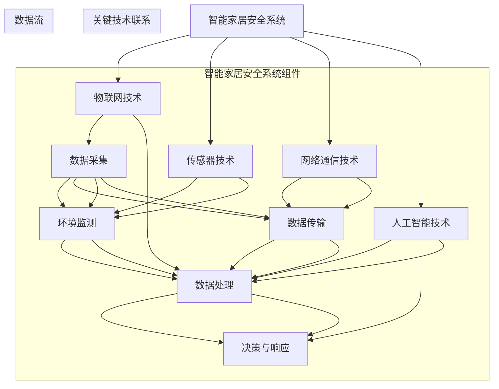
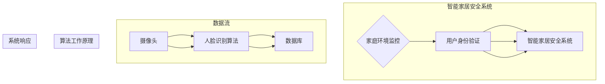
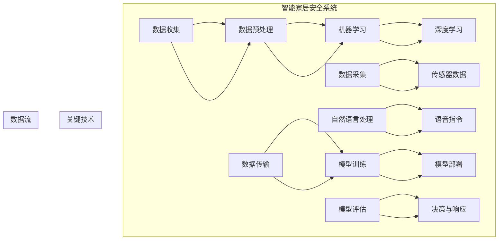
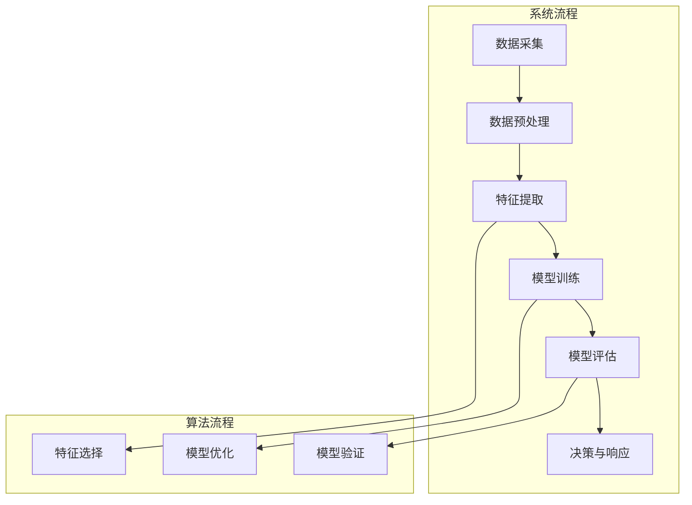

                 

### 智能家居安全系统的概述

随着科技的飞速发展，智能家居（Smart Home）逐渐成为现代生活的一种趋势。智能家居安全系统作为智能家居的核心组成部分，旨在通过技术手段提升家庭安全防护水平，为居民提供更加安心、舒适的生活环境。本文将深入探讨人工智能在智能家居安全系统中的应用，解析其技术原理、应用场景及未来发展趋势。

#### 1.1.1 智能家居安全系统的定义

智能家居安全系统是指利用物联网技术、传感器技术、网络通信技术等构建的家庭安全防护体系。它通过智能化设备、传感器和软件平台相互连接，实现对家庭环境、家庭成员及家庭财产的实时监控和智能管理。智能家居安全系统的核心目标在于预防潜在的安全风险，提高家庭安全防护能力，确保家庭成员的生命财产安全。

#### 1.1.2 智能家居安全系统的特点

- **实时性**：智能家居安全系统能够实时监测家庭环境，及时发现潜在的安全隐患。
- **自动化**：系统可以通过预设规则和算法自动响应，减少人工干预，提高效率。
- **综合性**：系统集成了多种安全功能，如入侵检测、火灾报警、紧急求助等，形成全方位的安全防护。
- **智能化**：系统利用人工智能技术进行数据分析和决策，提高安全防护的智能化水平。

#### 1.1.3 智能家居安全系统的需求背景

随着城市化进程的加快，居民对居住环境的安全要求越来越高。传统的家庭安全防护手段已经难以满足现代家庭的需求。智能家居安全系统以其智能化、自动化、综合性的特点，能够有效提升家庭安全防护水平，减少安全风险。此外，随着物联网技术的普及，智能家居设备越来越普及，这为智能家居安全系统的建设提供了技术基础。

### 1.2 智能家居安全系统的基本原理

智能家居安全系统的构建涉及多个技术领域的交叉融合，主要包括物联网技术、传感器技术、网络通信技术、人工智能技术等。以下从这些方面对智能家居安全系统的基本原理进行介绍。

#### 1.2.1 物联网技术基础

物联网技术是智能家居安全系统的基石。通过物联网技术，各种智能设备能够实现互联互通，形成一个统一的智能网络。物联网技术包括以下几个核心组成部分：

- **传感器**：用于感知家庭环境中的各种信息，如温度、湿度、光照、运动等。
- **网络通信**：通过各种通信协议，实现传感器与控制中心的数据传输。
- **数据处理**：对传感器采集的数据进行实时处理，用于判断和决策。

#### 1.2.2 安全系统架构设计

智能家居安全系统的架构设计通常包括以下几个层次：

- **感知层**：由各种传感器组成，用于采集家庭环境中的安全信息。
- **传输层**：通过有线或无线网络，将传感器数据传输到控制中心。
- **控制层**：对传输层的数据进行处理和分析，实现对家庭安全的监控和控制。
- **应用层**：提供用户界面，用户可以通过应用层对智能家居安全系统进行操作和管理。

#### 1.2.3 数据通信与传输机制

数据通信与传输机制是智能家居安全系统实现互联互通的关键。主要包括以下几种技术：

- **有线传输**：如以太网、光纤等，具有高带宽、低延迟的特点。
- **无线传输**：如WiFi、蓝牙、Zigbee等，适用于移动设备和低功耗设备。
- **云平台**：通过云计算技术，实现大规模数据存储、处理和分析。

### 1.3 智能家居安全系统的发展历程

智能家居安全系统的发展可以追溯到20世纪90年代。最初，智能家居安全系统主要依靠传统的有线报警系统和监控设备，如烟雾报警器、入侵探测器等。随着物联网技术的发展，智能家居安全系统逐渐向无线化、智能化方向演进。以下为智能家居安全系统的发展历程：

- **20世纪90年代**：传统有线报警系统和监控设备的普及，初步实现家庭安全防护。
- **2000年代**：无线通信技术（如WiFi、蓝牙）的应用，使智能家居安全系统逐渐无线化。
- **2010年代**：物联网技术的崛起，智能家居安全系统开始实现设备互联互通，智能化水平提高。
- **2020年代**：人工智能技术的融入，使智能家居安全系统更加智能化、自动化，进一步提升安全防护能力。

### 1.3.1 历史演变过程

- **第一阶段（20世纪90年代）**：传统的家庭安全系统主要以物理防护为主，如防盗门、窗户锁、烟雾报警器等。这些设备通过有线连接，实现基本的防护功能。
- **第二阶段（2000年代）**：随着无线通信技术的发展，智能家居安全系统开始引入无线传感器和无线通信技术。如无线烟雾报警器、无线门磁传感器等，大大提高了系统的灵活性和可扩展性。
- **第三阶段（2010年代）**：物联网技术的广泛应用，使智能家居安全系统实现了设备间的互联互通。传感器、控制器、云平台等组件相互连接，形成一个完整的智能家居安全系统。
- **第四阶段（2020年代）**：人工智能技术的加入，使智能家居安全系统变得更加智能化。通过机器学习和深度学习算法，系统能够自动识别异常行为，提前预警，实现更高级别的安全防护。

### 1.3.2 当前技术水平

当前，智能家居安全系统的技术水平已经得到了显著提升。以下是当前智能家居安全系统的一些关键技术：

- **传感器技术**：高精度传感器能够实时监测家庭环境中的各种参数，如温度、湿度、光照、运动等。
- **通信技术**：无线通信技术的广泛应用，如WiFi、蓝牙、Zigbee等，使数据传输更加稳定、高效。
- **云计算技术**：通过云计算平台，实现大规模数据存储、处理和分析，提高系统的智能化水平。
- **人工智能技术**：通过机器学习和深度学习算法，实现对家庭行为的智能分析和异常检测。

### 1.3.3 未来发展趋势

未来，智能家居安全系统将继续向智能化、自动化、个性化方向演进。以下是未来智能家居安全系统的一些发展趋势：

- **更高智能化**：通过深度学习、强化学习等技术，使系统更加智能化，能够自动识别和应对各种安全威胁。
- **更广泛应用**：智能家居安全系统将不仅仅局限于家庭，还将扩展到社区、城市等更大范围，实现更广泛的安全防护。
- **更高安全性**：随着数据隐私和安全问题的日益突出，智能家居安全系统将更加注重数据安全和隐私保护。
- **更绿色环保**：智能家居安全系统将采用更多绿色环保技术，如节能传感器、可再生能源等，实现可持续发展。

### 智能家居安全系统的概述

随着科技的飞速发展，智能家居（Smart Home）逐渐成为现代生活的一种趋势。智能家居安全系统作为智能家居的核心组成部分，旨在通过技术手段提升家庭安全防护水平，为居民提供更加安心、舒适的生活环境。本文将深入探讨人工智能在智能家居安全系统中的应用，解析其技术原理、应用场景及未来发展趋势。

#### 1.1.1 智能家居安全系统的定义

智能家居安全系统是指利用物联网技术、传感器技术、网络通信技术等构建的家庭安全防护体系。它通过智能化设备、传感器和软件平台相互连接，实现对家庭环境、家庭成员及家庭财产的实时监控和智能管理。智能家居安全系统的核心目标在于预防潜在的安全风险，提高家庭安全防护能力，确保家庭成员的生命财产安全。

#### 1.1.2 智能家居安全系统的特点

- **实时性**：智能家居安全系统能够实时监测家庭环境，及时发现潜在的安全隐患。
- **自动化**：系统可以通过预设规则和算法自动响应，减少人工干预，提高效率。
- **综合性**：系统集成了多种安全功能，如入侵检测、火灾报警、紧急求助等，形成全方位的安全防护。
- **智能化**：系统利用人工智能技术进行数据分析和决策，提高安全防护的智能化水平。

#### 1.1.3 智能家居安全系统的需求背景

随着城市化进程的加快，居民对居住环境的安全要求越来越高。传统的家庭安全防护手段已经难以满足现代家庭的需求。智能家居安全系统以其智能化、自动化、综合性的特点，能够有效提升家庭安全防护水平，减少安全风险。此外，随着物联网技术的普及，智能家居设备越来越普及，这为智能家居安全系统的建设提供了技术基础。

### 1.2 智能家居安全系统的基本原理

智能家居安全系统的构建涉及多个技术领域的交叉融合，主要包括物联网技术、传感器技术、网络通信技术、人工智能技术等。以下从这些方面对智能家居安全系统的基本原理进行介绍。

#### 1.2.1 物联网技术基础

物联网技术是智能家居安全系统的基石。通过物联网技术，各种智能设备能够实现互联互通，形成一个统一的智能网络。物联网技术包括以下几个核心组成部分：

- **传感器**：用于感知家庭环境中的各种信息，如温度、湿度、光照、运动等。
- **网络通信**：通过各种通信协议，实现传感器与控制中心的数据传输。
- **数据处理**：对传感器采集的数据进行实时处理，用于判断和决策。

#### 1.2.2 安全系统架构设计

智能家居安全系统的架构设计通常包括以下几个层次：

- **感知层**：由各种传感器组成，用于采集家庭环境中的安全信息。
- **传输层**：通过有线或无线网络，将传感器数据传输到控制中心。
- **控制层**：对传输层的数据进行处理和分析，实现对家庭安全的监控和控制。
- **应用层**：提供用户界面，用户可以通过应用层对智能家居安全系统进行操作和管理。

#### 1.2.3 数据通信与传输机制

数据通信与传输机制是智能家居安全系统实现互联互通的关键。主要包括以下几种技术：

- **有线传输**：如以太网、光纤等，具有高带宽、低延迟的特点。
- **无线传输**：如WiFi、蓝牙、Zigbee等，适用于移动设备和低功耗设备。
- **云平台**：通过云计算技术，实现大规模数据存储、处理和分析。

### 1.3 智能家居安全系统的发展历程

智能家居安全系统的发展可以追溯到20世纪90年代。最初，智能家居安全系统主要依靠传统的有线报警系统和监控设备，如烟雾报警器、入侵探测器等。随着物联网技术的发展，智能家居安全系统逐渐向无线化、智能化方向演进。以下为智能家居安全系统的发展历程：

- **20世纪90年代**：传统有线报警系统和监控设备的普及，初步实现家庭安全防护。
- **2000年代**：无线通信技术（如WiFi、蓝牙）的应用，使智能家居安全系统逐渐无线化。
- **2010年代**：物联网技术的崛起，智能家居安全系统开始实现设备互联互通，智能化水平提高。
- **2020年代**：人工智能技术的融入，使智能家居安全系统变得更加智能化、自动化，进一步提升安全防护能力。

### 1.3.1 历史演变过程

- **第一阶段（20世纪90年代）**：传统的家庭安全系统主要以物理防护为主，如防盗门、窗户锁、烟雾报警器等。这些设备通过有线连接，实现基本的防护功能。
- **第二阶段（2000年代）**：随着无线通信技术的发展，智能家居安全系统开始引入无线传感器和无线通信技术。如无线烟雾报警器、无线门磁传感器等，大大提高了系统的灵活性和可扩展性。
- **第三阶段（2010年代）**：物联网技术的广泛应用，使智能家居安全系统实现了设备间的互联互通。传感器、控制器、云平台等组件相互连接，形成一个完整的智能家居安全系统。
- **第四阶段（2020年代）**：人工智能技术的加入，使智能家居安全系统变得更加智能化。通过机器学习和深度学习算法，系统能够自动识别异常行为，提前预警，实现更高级别的安全防护。

### 1.3.2 当前技术水平

当前，智能家居安全系统的技术水平已经得到了显著提升。以下是当前智能家居安全系统的一些关键技术：

- **传感器技术**：高精度传感器能够实时监测家庭环境中的各种参数，如温度、湿度、光照、运动等。
- **通信技术**：无线通信技术的广泛应用，如WiFi、蓝牙、Zigbee等，使数据传输更加稳定、高效。
- **云计算技术**：通过云计算平台，实现大规模数据存储、处理和分析，提高系统的智能化水平。
- **人工智能技术**：通过机器学习和深度学习算法，实现对家庭行为的智能分析和异常检测。

### 1.3.3 未来发展趋势

未来，智能家居安全系统将继续向智能化、自动化、个性化方向演进。以下是未来智能家居安全系统的一些发展趋势：

- **更高智能化**：通过深度学习、强化学习等技术，使系统更加智能化，能够自动识别和应对各种安全威胁。
- **更广泛应用**：智能家居安全系统将不仅仅局限于家庭，还将扩展到社区、城市等更大范围，实现更广泛的安全防护。
- **更高安全性**：随着数据隐私和安全问题的日益突出，智能家居安全系统将更加注重数据安全和隐私保护。
- **更绿色环保**：智能家居安全系统将采用更多绿色环保技术，如节能传感器、可再生能源等，实现可持续发展。

### 1.4 智能家居安全系统的应用场景

智能家居安全系统具有广泛的应用场景，以下列举几种典型的应用场景：

- **家庭安防**：通过安装门窗传感器、人体传感器、摄像头等设备，实现对家庭环境的实时监控，及时检测和预警入侵行为。
- **火灾报警**：通过烟雾传感器、温度传感器等设备，实时监测火灾征兆，及时发出报警信号，防止火灾事故的发生。
- **紧急求助**：通过紧急求助按钮或手机APP，家庭成员在遇到危险时可以迅速向外界求助，提高自救能力。
- **环境监测**：通过空气质量传感器、水质传感器等设备，实时监测室内空气质量、水质状况，保障家庭成员的健康。
- **能源管理**：通过智能插座、智能灯具等设备，实现家庭能源的智能管理，降低能耗，提高生活质量。

### 1.5 智能家居安全系统的发展挑战

尽管智能家居安全系统在技术水平和应用场景上取得了显著进展，但在发展过程中仍然面临一些挑战：

- **数据隐私和安全**：智能家居安全系统涉及大量个人数据，如家庭成员信息、行为习惯等，如何保护这些数据的安全和隐私是一个重要问题。
- **系统兼容性和互操作性**：不同厂商的智能家居设备可能采用不同的通信协议和技术标准，如何实现设备的兼容性和互操作性是一个技术挑战。
- **智能化水平**：虽然人工智能技术在智能家居安全系统中得到了广泛应用，但如何进一步提高系统的智能化水平，使其更好地适应家庭环境的变化，仍需深入研究。
- **成本和普及率**：智能家居安全系统的建设和维护成本较高，如何降低成本，提高系统的普及率，是推动市场发展的关键。

### 智能家居安全系统的概述

随着科技的飞速发展，智能家居（Smart Home）逐渐成为现代生活的一种趋势。智能家居安全系统作为智能家居的核心组成部分，旨在通过技术手段提升家庭安全防护水平，为居民提供更加安心、舒适的生活环境。本文将深入探讨人工智能在智能家居安全系统中的应用，解析其技术原理、应用场景及未来发展趋势。

#### 1.1.1 智能家居安全系统的定义

智能家居安全系统是指利用物联网技术、传感器技术、网络通信技术等构建的家庭安全防护体系。它通过智能化设备、传感器和软件平台相互连接，实现对家庭环境、家庭成员及家庭财产的实时监控和智能管理。智能家居安全系统的核心目标在于预防潜在的安全风险，提高家庭安全防护能力，确保家庭成员的生命财产安全。

#### 1.1.2 智能家居安全系统的特点

- **实时性**：智能家居安全系统能够实时监测家庭环境，及时发现潜在的安全隐患。
- **自动化**：系统可以通过预设规则和算法自动响应，减少人工干预，提高效率。
- **综合性**：系统集成了多种安全功能，如入侵检测、火灾报警、紧急求助等，形成全方位的安全防护。
- **智能化**：系统利用人工智能技术进行数据分析和决策，提高安全防护的智能化水平。

#### 1.1.3 智能家居安全系统的需求背景

随着城市化进程的加快，居民对居住环境的安全要求越来越高。传统的家庭安全防护手段已经难以满足现代家庭的需求。智能家居安全系统以其智能化、自动化、综合性的特点，能够有效提升家庭安全防护水平，减少安全风险。此外，随着物联网技术的普及，智能家居设备越来越普及，这为智能家居安全系统的建设提供了技术基础。

### 1.2 智能家居安全系统的基本原理

智能家居安全系统的构建涉及多个技术领域的交叉融合，主要包括物联网技术、传感器技术、网络通信技术、人工智能技术等。以下从这些方面对智能家居安全系统的基本原理进行介绍。

#### 1.2.1 物联网技术基础

物联网技术是智能家居安全系统的基石。通过物联网技术，各种智能设备能够实现互联互通，形成一个统一的智能网络。物联网技术包括以下几个核心组成部分：

- **传感器**：用于感知家庭环境中的各种信息，如温度、湿度、光照、运动等。
- **网络通信**：通过各种通信协议，实现传感器与控制中心的数据传输。
- **数据处理**：对传感器采集的数据进行实时处理，用于判断和决策。

#### 1.2.2 安全系统架构设计

智能家居安全系统的架构设计通常包括以下几个层次：

- **感知层**：由各种传感器组成，用于采集家庭环境中的安全信息。
- **传输层**：通过有线或无线网络，将传感器数据传输到控制中心。
- **控制层**：对传输层的数据进行处理和分析，实现对家庭安全的监控和控制。
- **应用层**：提供用户界面，用户可以通过应用层对智能家居安全系统进行操作和管理。

#### 1.2.3 数据通信与传输机制

数据通信与传输机制是智能家居安全系统实现互联互通的关键。主要包括以下几种技术：

- **有线传输**：如以太网、光纤等，具有高带宽、低延迟的特点。
- **无线传输**：如WiFi、蓝牙、Zigbee等，适用于移动设备和低功耗设备。
- **云平台**：通过云计算技术，实现大规模数据存储、处理和分析。

### 1.3 智能家居安全系统的发展历程

智能家居安全系统的发展可以追溯到20世纪90年代。最初，智能家居安全系统主要依靠传统的有线报警系统和监控设备，如烟雾报警器、入侵探测器等。随着物联网技术的发展，智能家居安全系统逐渐向无线化、智能化方向演进。以下为智能家居安全系统的发展历程：

- **20世纪90年代**：传统有线报警系统和监控设备的普及，初步实现家庭安全防护。
- **2000年代**：无线通信技术（如WiFi、蓝牙）的应用，使智能家居安全系统逐渐无线化。
- **2010年代**：物联网技术的崛起，智能家居安全系统开始实现设备互联互通，智能化水平提高。
- **2020年代**：人工智能技术的融入，使智能家居安全系统变得更加智能化、自动化，进一步提升安全防护能力。

### 1.3.1 历史演变过程

- **第一阶段（20世纪90年代）**：传统的家庭安全系统主要以物理防护为主，如防盗门、窗户锁、烟雾报警器等。这些设备通过有线连接，实现基本的防护功能。
- **第二阶段（2000年代）**：随着无线通信技术的发展，智能家居安全系统开始引入无线传感器和无线通信技术。如无线烟雾报警器、无线门磁传感器等，大大提高了系统的灵活性和可扩展性。
- **第三阶段（2010年代）**：物联网技术的广泛应用，使智能家居安全系统实现了设备间的互联互通。传感器、控制器、云平台等组件相互连接，形成一个完整的智能家居安全系统。
- **第四阶段（2020年代）**：人工智能技术的加入，使智能家居安全系统变得更加智能化。通过机器学习和深度学习算法，系统能够自动识别异常行为，提前预警，实现更高级别的安全防护。

### 1.3.2 当前技术水平

当前，智能家居安全系统的技术水平已经得到了显著提升。以下是当前智能家居安全系统的一些关键技术：

- **传感器技术**：高精度传感器能够实时监测家庭环境中的各种参数，如温度、湿度、光照、运动等。
- **通信技术**：无线通信技术的广泛应用，如WiFi、蓝牙、Zigbee等，使数据传输更加稳定、高效。
- **云计算技术**：通过云计算平台，实现大规模数据存储、处理和分析，提高系统的智能化水平。
- **人工智能技术**：通过机器学习和深度学习算法，实现对家庭行为的智能分析和异常检测。

### 1.3.3 未来发展趋势

未来，智能家居安全系统将继续向智能化、自动化、个性化方向演进。以下是未来智能家居安全系统的一些发展趋势：

- **更高智能化**：通过深度学习、强化学习等技术，使系统更加智能化，能够自动识别和应对各种安全威胁。
- **更广泛应用**：智能家居安全系统将不仅仅局限于家庭，还将扩展到社区、城市等更大范围，实现更广泛的安全防护。
- **更高安全性**：随着数据隐私和安全问题的日益突出，智能家居安全系统将更加注重数据安全和隐私保护。
- **更绿色环保**：智能家居安全系统将采用更多绿色环保技术，如节能传感器、可再生能源等，实现可持续发展。

### 1.4 智能家居安全系统的应用场景

智能家居安全系统具有广泛的应用场景，以下列举几种典型的应用场景：

- **家庭安防**：通过安装门窗传感器、人体传感器、摄像头等设备，实现对家庭环境的实时监控，及时检测和预警入侵行为。
- **火灾报警**：通过烟雾传感器、温度传感器等设备，实时监测火灾征兆，及时发出报警信号，防止火灾事故的发生。
- **紧急求助**：通过紧急求助按钮或手机APP，家庭成员在遇到危险时可以迅速向外界求助，提高自救能力。
- **环境监测**：通过空气质量传感器、水质传感器等设备，实时监测室内空气质量、水质状况，保障家庭成员的健康。
- **能源管理**：通过智能插座、智能灯具等设备，实现家庭能源的智能管理，降低能耗，提高生活质量。

### 1.5 智能家居安全系统的发展挑战

尽管智能家居安全系统在技术水平和应用场景上取得了显著进展，但在发展过程中仍然面临一些挑战：

- **数据隐私和安全**：智能家居安全系统涉及大量个人数据，如家庭成员信息、行为习惯等，如何保护这些数据的安全和隐私是一个重要问题。
- **系统兼容性和互操作性**：不同厂商的智能家居设备可能采用不同的通信协议和技术标准，如何实现设备的兼容性和互操作性是一个技术挑战。
- **智能化水平**：虽然人工智能技术在智能家居安全系统中得到了广泛应用，但如何进一步提高系统的智能化水平，使其更好地适应家庭环境的变化，仍需深入研究。
- **成本和普及率**：智能家居安全系统的建设和维护成本较高，如何降低成本，提高系统的普及率，是推动市场发展的关键。

## 第二部分：人工智能技术的核心概念与联系

在深入了解人工智能（AI）在智能家居安全系统中的应用之前，我们需要首先掌握人工智能的核心概念及其与智能家居安全系统的联系。人工智能作为一门涉及计算机科学、数学、神经科学等多学科交叉的领域，其发展历史可以追溯到20世纪50年代。如今，人工智能技术已经取得了显著进展，并在智能家居安全系统中发挥着越来越重要的作用。

### 2.1 人工智能的基本原理

人工智能是一门研究如何构建智能机器的系统和技术的科学。人工智能的基本原理包括以下几个方面：

1. **机器学习**：机器学习是人工智能的核心技术之一，通过从数据中学习规律和模式，使机器能够对未知数据进行预测和决策。机器学习分为监督学习、无监督学习和半监督学习三种类型。

2. **深度学习**：深度学习是机器学习的一个重要分支，通过构建大规模神经网络，实现对复杂数据的分析和处理。深度学习在图像识别、语音识别、自然语言处理等领域取得了显著成果。

3. **神经网络**：神经网络是一种模拟人脑神经元结构和功能的计算模型，是深度学习的基础。神经网络通过多层节点进行数据传递和处理，实现对输入数据的分类、预测等操作。

4. **自然语言处理**：自然语言处理是人工智能的重要应用领域，旨在使计算机理解和处理人类自然语言。自然语言处理包括文本分析、语音识别、机器翻译等任务。

### 2.2 人工智能与智能家居安全系统的关系

人工智能与智能家居安全系统之间的联系主要体现在以下几个方面：

1. **数据分析和决策**：智能家居安全系统涉及大量数据，如环境参数、行为数据等。人工智能技术可以通过机器学习和深度学习算法，对海量数据进行实时分析和处理，帮助系统做出智能化的决策。

2. **异常检测和预测**：智能家居安全系统需要实时监测家庭环境，及时发现异常行为和安全隐患。人工智能技术可以通过神经网络和深度学习算法，实现异常检测和预测，提高系统的预警能力。

3. **自动化响应**：智能家居安全系统可以通过人工智能技术实现自动化响应，减少人工干预。例如，当系统检测到异常行为时，可以自动启动报警机制、关闭门窗等，保障家庭安全。

4. **个性化定制**：人工智能技术可以帮助智能家居安全系统根据家庭成员的行为习惯和需求，实现个性化定制。例如，根据家庭成员的健康状况，智能调整室内温度、湿度等参数，提高生活舒适度。

### 2.3 人工智能在智能家居安全系统中的应用场景

人工智能在智能家居安全系统中的应用场景非常广泛，以下列举几种典型的应用场景：

1. **家庭安防**：通过人脸识别、行为识别等技术，实现对家庭环境的实时监控，自动识别入侵者，及时发出报警信号。

2. **火灾报警**：通过烟雾传感器、温度传感器等设备，实时监测火灾征兆，利用人工智能算法分析数据，提前预警，避免火灾事故的发生。

3. **紧急求助**：通过语音识别、手势识别等技术，实现家庭成员在遇到危险时的紧急求助功能，及时通知外界救援。

4. **环境监测**：通过空气质量传感器、水质传感器等设备，实时监测室内空气质量、水质状况，利用人工智能技术分析数据，提供健康建议。

5. **能源管理**：通过智能插座、智能灯具等设备，实时监测家庭能源消耗情况，利用人工智能算法优化能源使用，降低能耗。

### 2.4 人工智能在智能家居安全系统中的优势

人工智能在智能家居安全系统中的应用具有以下优势：

1. **实时性**：人工智能技术可以实时分析数据，及时检测异常行为，提高系统的预警能力。

2. **准确性**：通过深度学习和神经网络等技术，人工智能可以对复杂的数据进行精确分析，提高系统的准确率。

3. **自动化**：人工智能技术可以实现自动化响应，减少人工干预，提高系统的运行效率。

4. **个性化**：人工智能技术可以根据家庭成员的行为习惯和需求，实现个性化定制，提高生活舒适度。

5. **可扩展性**：人工智能技术具有强大的扩展性，可以不断学习和适应新的环境和需求。

### 2.5 人工智能在智能家居安全系统中的应用挑战

尽管人工智能在智能家居安全系统中具有巨大的潜力，但在实际应用过程中仍然面临一些挑战：

1. **数据隐私和安全**：智能家居安全系统涉及大量个人数据，如何保护这些数据的安全和隐私是一个重要问题。

2. **算法公平性和透明性**：人工智能算法的决策过程往往不透明，如何保证算法的公平性和透明性，提高用户的信任度，是一个挑战。

3. **技术成熟度和成本**：目前，人工智能技术在智能家居安全系统中的应用还处于发展阶段，如何提高技术成熟度和降低成本，是推广应用的瓶颈。

4. **跨平台兼容性**：智能家居安全系统通常涉及多个厂商的设备，如何实现跨平台的兼容性和互操作性，是一个技术挑战。

5. **法律法规和伦理问题**：随着人工智能技术的广泛应用，如何制定相关的法律法规和伦理标准，确保技术应用的安全和合规，是一个重要问题。

通过以上分析，我们可以看到，人工智能技术在智能家居安全系统中具有广泛的应用前景，但也面临一些挑战。未来，随着技术的不断进步和法规的完善，人工智能在智能家居安全系统中的应用将更加广泛和深入，为家庭安全提供更加智能、高效的解决方案。

## 第二部分：人工智能技术的核心概念与联系

在深入了解人工智能（AI）在智能家居安全系统中的应用之前，我们需要首先掌握人工智能的核心概念及其与智能家居安全系统的联系。人工智能作为一门涉及计算机科学、数学、神经科学等多学科交叉的领域，其发展历史可以追溯到20世纪50年代。如今，人工智能技术已经取得了显著进展，并在智能家居安全系统中发挥着越来越重要的作用。

### 2.1 人工智能的基本原理

人工智能是一门研究如何构建智能机器的系统和技术的科学。人工智能的基本原理包括以下几个方面：

1. **机器学习**：机器学习是人工智能的核心技术之一，通过从数据中学习规律和模式，使机器能够对未知数据进行预测和决策。机器学习分为监督学习、无监督学习和半监督学习三种类型。

   - **监督学习**：监督学习是一种有标注数据的学习方法，通过输入数据和对应的输出结果，训练模型，使其能够对新的数据进行预测。常见的监督学习算法包括线性回归、逻辑回归、支持向量机等。
   - **无监督学习**：无监督学习是一种没有标注数据的学习方法，通过输入数据，训练模型，使其能够发现数据中的内在结构和规律。常见的无监督学习算法包括聚类算法、降维算法等。
   - **半监督学习**：半监督学习是一种既有标注数据又有未标注数据的学习方法，通过利用标注数据和未标注数据，训练模型，提高模型的泛化能力。

2. **深度学习**：深度学习是机器学习的一个重要分支，通过构建大规模神经网络，实现对复杂数据的分析和处理。深度学习在图像识别、语音识别、自然语言处理等领域取得了显著成果。

   - **神经网络**：神经网络是一种模拟人脑神经元结构和功能的计算模型，是深度学习的基础。神经网络通过多层节点进行数据传递和处理，实现对输入数据的分类、预测等操作。
   - **卷积神经网络（CNN）**：卷积神经网络是一种专门用于图像识别和处理的前馈神经网络，通过卷积操作和池化操作，实现对图像的层次特征提取。
   - **循环神经网络（RNN）**：循环神经网络是一种用于序列数据处理和预测的神经网络，通过存储和传递序列中的历史信息，实现对序列数据的建模。
   - **生成对抗网络（GAN）**：生成对抗网络是一种由生成器和判别器组成的对抗性神经网络，通过生成器生成数据，判别器判断数据真实性，实现数据的生成和优化。

3. **强化学习**：强化学习是一种基于奖励反馈的学习方法，通过不断尝试和反馈，使模型能够找到最优策略。强化学习在游戏、机器人控制、推荐系统等领域具有广泛应用。

   - **Q学习**：Q学习是一种基于值函数的强化学习算法，通过学习状态-动作值函数，找到最优动作序列。
   - **策略梯度方法**：策略梯度方法是一种直接优化策略的强化学习算法，通过计算策略的梯度，更新策略参数，找到最优策略。

### 2.2 人工智能与智能家居安全系统的关系

人工智能与智能家居安全系统之间的联系主要体现在以下几个方面：

1. **数据分析和决策**：智能家居安全系统涉及大量数据，如环境参数、行为数据等。人工智能技术可以通过机器学习和深度学习算法，对海量数据进行实时分析和处理，帮助系统做出智能化的决策。

2. **异常检测和预测**：智能家居安全系统需要实时监测家庭环境，及时发现异常行为和安全隐患。人工智能技术可以通过神经网络和深度学习算法，实现异常检测和预测，提高系统的预警能力。

3. **自动化响应**：智能家居安全系统可以通过人工智能技术实现自动化响应，减少人工干预。例如，当系统检测到异常行为时，可以自动启动报警机制、关闭门窗等，保障家庭安全。

4. **个性化定制**：人工智能技术可以帮助智能家居安全系统根据家庭成员的行为习惯和需求，实现个性化定制。例如，根据家庭成员的健康状况，智能调整室内温度、湿度等参数，提高生活舒适度。

5. **人机交互**：人工智能技术可以实现智能家居安全系统与用户之间的自然交互，提高系统的用户体验。例如，通过语音识别、手势识别等技术，用户可以方便地与系统进行沟通，实现智能操作。

### 2.3 人工智能在智能家居安全系统中的应用场景

人工智能在智能家居安全系统中的应用场景非常广泛，以下列举几种典型的应用场景：

1. **家庭安防**：通过人脸识别、行为识别等技术，实现对家庭环境的实时监控，自动识别入侵者，及时发出报警信号。

2. **火灾报警**：通过烟雾传感器、温度传感器等设备，实时监测火灾征兆，利用人工智能算法分析数据，提前预警，避免火灾事故的发生。

3. **紧急求助**：通过语音识别、手势识别等技术，实现家庭成员在遇到危险时的紧急求助功能，及时通知外界救援。

4. **环境监测**：通过空气质量传感器、水质传感器等设备，实时监测室内空气质量、水质状况，利用人工智能技术分析数据，提供健康建议。

5. **能源管理**：通过智能插座、智能灯具等设备，实时监测家庭能源消耗情况，利用人工智能算法优化能源使用，降低能耗。

### 2.4 人工智能在智能家居安全系统中的优势

人工智能在智能家居安全系统中的应用具有以下优势：

1. **实时性**：人工智能技术可以实时分析数据，及时检测异常行为，提高系统的预警能力。

2. **准确性**：通过深度学习和神经网络等技术，人工智能可以对复杂的数据进行精确分析，提高系统的准确率。

3. **自动化**：人工智能技术可以实现自动化响应，减少人工干预，提高系统的运行效率。

4. **个性化**：人工智能技术可以根据家庭成员的行为习惯和需求，实现个性化定制，提高生活舒适度。

5. **可扩展性**：人工智能技术具有强大的扩展性，可以不断学习和适应新的环境和需求。

### 2.5 人工智能在智能家居安全系统中的应用挑战

尽管人工智能在智能家居安全系统中具有巨大的潜力，但在实际应用过程中仍然面临一些挑战：

1. **数据隐私和安全**：智能家居安全系统涉及大量个人数据，如何保护这些数据的安全和隐私是一个重要问题。

2. **算法公平性和透明性**：人工智能算法的决策过程往往不透明，如何保证算法的公平性和透明性，提高用户的信任度，是一个挑战。

3. **技术成熟度和成本**：目前，人工智能技术在智能家居安全系统中的应用还处于发展阶段，如何提高技术成熟度和降低成本，是推广应用的瓶颈。

4. **跨平台兼容性**：智能家居安全系统通常涉及多个厂商的设备，如何实现跨平台的兼容性和互操作性，是一个技术挑战。

5. **法律法规和伦理问题**：随着人工智能技术的广泛应用，如何制定相关的法律法规和伦理标准，确保技术应用的安全和合规，是一个重要问题。

通过以上分析，我们可以看到，人工智能技术在智能家居安全系统中具有广泛的应用前景，但也面临一些挑战。未来，随着技术的不断进步和法规的完善，人工智能在智能家居安全系统中的应用将更加广泛和深入，为家庭安全提供更加智能、高效的解决方案。

### 2.6 人工智能技术的核心概念与联系流程图

为了更好地理解人工智能技术在智能家居安全系统中的应用，我们可以通过Mermaid流程图展示核心概念与联系。以下是人工智能技术在智能家居安全系统中的关系架构流程图：



这个流程图展示了智能家居安全系统中各个组件之间的关系，以及物联网技术、传感器技术、网络通信技术和人工智能技术在系统中的关键作用。通过这个流程图，我们可以清晰地看到人工智能技术在数据采集、环境监测、数据传输和数据处理等环节的应用，以及如何通过智能分析和决策提高家庭安全防护水平。

### 2.7 人工智能技术的核心概念与联系流程图示例

为了更好地展示人工智能技术在智能家居安全系统中的应用，我们可以通过一个具体的示例来解释核心概念与联系。以下是利用人脸识别技术进行家庭安防的流程图：



在这个示例中，摄像头实时捕捉家庭环境中的图像，并将图像数据传输给人脸识别算法。人脸识别算法通过数据库中的用户身份信息，对捕获的图像进行人脸检测和识别。当系统检测到未登记的人脸时，会自动触发家庭安防系统，进行报警或其他安全措施。这个流程图清晰地展示了人工智能技术在智能家居安全系统中的应用，以及如何通过人脸识别技术实现家庭安防。

### 2.8 人工智能技术的核心概念与联系

在讨论人工智能技术在智能家居安全系统中的应用之前，我们需要深入理解人工智能的核心概念及其在不同场景下的应用。人工智能的核心概念包括但不限于以下几个方面：

1. **机器学习**：机器学习是人工智能的一个重要分支，其基本原理是通过从数据中学习，构建模型来预测或决策。机器学习可以分为监督学习、无监督学习和半监督学习。

   - **监督学习**：监督学习模型通过输入数据及其对应的标签来训练模型，从而能够对新的数据做出预测。常见的监督学习算法包括线性回归、逻辑回归、支持向量机（SVM）、决策树和随机森林等。
   - **无监督学习**：无监督学习模型没有预定义的标签，通过分析数据结构，自动发现数据中的模式或关系。常见的无监督学习算法包括聚类、主成分分析（PCA）和降维技术等。
   - **半监督学习**：半监督学习结合了有监督和无监督学习的特点，利用少量的标注数据和大量的未标注数据来训练模型。

2. **深度学习**：深度学习是一种基于人工神经网络的机器学习方法，通过构建多层的神经网络，实现对复杂数据的自动特征学习和模式识别。深度学习的代表性算法包括卷积神经网络（CNN）、循环神经网络（RNN）和生成对抗网络（GAN）等。

   - **卷积神经网络（CNN）**：CNN特别适用于图像处理任务，通过卷积层、池化层和全连接层等结构，实现对图像的层次特征提取。
   - **循环神经网络（RNN）**：RNN适用于序列数据处理，通过记忆过去的信息，对序列中的每一个元素进行建模，广泛应用于语音识别、自然语言处理等任务。
   - **生成对抗网络（GAN）**：GAN由生成器和判别器组成，通过生成器和判别器之间的对抗训练，生成高质量的数据或进行数据增强。

3. **强化学习**：强化学习是一种通过试错和奖励反馈来学习最优策略的机器学习方法。强化学习模型通过与环境的交互，不断优化策略，以达到最大化累积奖励的目的。常见的强化学习算法包括Q学习、深度Q网络（DQN）和策略梯度算法等。

4. **自然语言处理（NLP）**：自然语言处理是人工智能的一个重要应用领域，旨在使计算机能够理解、生成和处理人类语言。NLP涉及文本分类、情感分析、机器翻译、语音识别等多个子领域。

5. **计算机视觉**：计算机视觉是人工智能的另一个重要应用领域，旨在使计算机能够从图像或视频中提取有用的信息。计算机视觉技术包括图像识别、目标检测、图像分割和视频分析等。

在智能家居安全系统中，人工智能技术通过这些核心概念的应用，实现了对家庭环境的实时监控、异常检测、自动化响应等功能。例如，通过机器学习算法，系统可以对传感器采集的数据进行实时分析，识别家庭中的异常行为；通过深度学习算法，系统可以实现对图像和视频的智能识别，实现家庭安防；通过强化学习算法，系统可以自动调整家庭设备的运行状态，优化能源使用效率。

总的来说，人工智能技术在智能家居安全系统中的应用，不仅提高了系统的智能化和自动化水平，还显著提升了家庭安全防护能力，为居民提供了更加安全、舒适的生活环境。

### 2.9 人工智能技术的核心概念与联系

在探讨人工智能（AI）技术在智能家居安全系统中的应用之前，我们需要深入理解人工智能的核心概念与相互之间的联系。以下是人工智能技术在智能家居安全系统中几个关键概念的定义及其关系：

1. **机器学习（Machine Learning）**：机器学习是一种通过算法从数据中学习规律和模式，从而对未知数据进行预测或决策的技术。在智能家居安全系统中，机器学习用于分析传感器数据、识别异常行为等。

   - **监督学习（Supervised Learning）**：监督学习通过已知输入和输出数据训练模型，以便对新数据做出预测。例如，利用已标记的家庭入侵事件数据训练模型，识别未标记的入侵行为。
   - **无监督学习（Unsupervised Learning）**：无监督学习通过未标记的数据发现内在结构和模式。例如，利用无监督学习对家庭能源消耗数据进行分析，识别能源浪费的行为模式。
   - **半监督学习（Semi-Supervised Learning）**：半监督学习结合了有监督和无监督学习的特点，利用少量的标记数据和大量的未标记数据来训练模型。在智能家居安全系统中，可以利用半监督学习对不完全标记的安全事件数据进行学习。

2. **深度学习（Deep Learning）**：深度学习是一种基于多层神经网络的学习方法，能够自动提取复杂数据的特征。深度学习在图像识别、语音识别等领域取得了显著成果，也在智能家居安全系统中发挥了重要作用。

   - **卷积神经网络（CNN）**：卷积神经网络特别适用于图像处理，通过卷积操作和池化操作提取图像的层次特征。例如，在家庭安防系统中，CNN可以用于人脸识别、入侵检测等。
   - **循环神经网络（RNN）**：循环神经网络适用于序列数据处理，例如对家庭行为数据序列进行分析，识别异常行为模式。
   - **生成对抗网络（GAN）**：生成对抗网络通过生成器和判别器的对抗训练，生成高质量的数据。在智能家居安全系统中，GAN可以用于生成模拟数据，提高模型的泛化能力。

3. **自然语言处理（Natural Language Processing, NLP）**：自然语言处理是人工智能的一个分支，旨在使计算机能够理解和生成人类语言。NLP在智能家居安全系统中用于处理语音指令、文本信息等。

   - **语音识别（Speech Recognition）**：语音识别将语音转换为文本，用于智能家居控制。例如，通过语音识别，用户可以控制家庭安防系统进行报警或关闭门锁。
   - **情感分析（Sentiment Analysis）**：情感分析通过分析文本内容，识别文本中的情感倾向。在智能家居安全系统中，情感分析可以用于监测家庭成员的情绪变化，预测潜在的危机。

4. **强化学习（Reinforcement Learning）**：强化学习通过试错和奖励反馈来学习最优策略。强化学习在智能家居安全系统中可以用于优化设备配置、自动化响应等。

   - **Q学习（Q-Learning）**：Q学习通过更新Q值来学习最优策略。在智能家居安全系统中，Q学习可以用于优化报警阈值、响应策略等。
   - **深度Q网络（Deep Q-Network, DQN）**：DQN通过深度神经网络来学习Q值函数，适用于处理高维状态空间。例如，在智能家居安全系统中，DQN可以用于智能调整摄像头监控范围。

通过这些核心概念的定义及其相互联系，我们可以看到人工智能技术在智能家居安全系统中如何实现智能化和自动化。例如，机器学习可以用于异常检测，深度学习可以用于图像识别，自然语言处理可以用于语音指令理解，强化学习可以用于自动化响应。这些技术的结合，使得智能家居安全系统更加智能、高效，为居民提供了更加安全、舒适的生活环境。

### 2.10 人工智能技术的核心概念与联系流程图

为了更好地理解人工智能技术的核心概念及其在智能家居安全系统中的应用，我们可以通过Mermaid流程图展示其关系架构。以下是人工智能技术在智能家居安全系统中的核心概念与联系流程图：



在这个流程图中，数据从传感器采集后，经过预处理，输入到机器学习模型中进行训练。深度学习算法用于复杂的数据特征提取和模式识别。同时，自然语言处理技术用于处理语音指令和文本信息。经过模型训练和评估后，系统做出智能决策并自动响应。这个流程图清晰地展示了人工智能技术从数据采集到决策响应的完整流程，以及各个关键技术环节之间的联系。

### 2.11 人工智能技术的核心概念与联系

在探讨人工智能（AI）技术在智能家居安全系统中的应用之前，我们需要深入理解人工智能的核心概念及其相互之间的联系。以下是人工智能技术在智能家居安全系统中几个关键概念的定义及其关系：

1. **机器学习（Machine Learning）**：机器学习是一种通过算法从数据中学习规律和模式，从而对未知数据进行预测或决策的技术。在智能家居安全系统中，机器学习用于分析传感器数据、识别异常行为等。

   - **监督学习（Supervised Learning）**：监督学习通过已知输入和输出数据训练模型，以便对新数据做出预测。例如，利用已标记的家庭入侵事件数据训练模型，识别未标记的入侵行为。
   - **无监督学习（Unsupervised Learning）**：无监督学习通过未标记的数据发现内在结构和模式。例如，利用无监督学习对家庭能源消耗数据进行分析，识别能源浪费的行为模式。
   - **半监督学习（Semi-Supervised Learning）**：半监督学习结合了有监督和无监督学习的特点，利用少量的标记数据和大量的未标记数据来训练模型。在智能家居安全系统中，可以利用半监督学习对不完全标记的安全事件数据进行学习。

2. **深度学习（Deep Learning）**：深度学习是一种基于多层神经网络的学习方法，能够自动提取复杂数据的特征。深度学习在图像识别、语音识别等领域取得了显著成果，也在智能家居安全系统中发挥了重要作用。

   - **卷积神经网络（CNN）**：卷积神经网络特别适用于图像处理，通过卷积操作和池化操作提取图像的层次特征。例如，在家庭安防系统中，CNN可以用于人脸识别、入侵检测等。
   - **循环神经网络（RNN）**：循环神经网络适用于序列数据处理，例如对家庭行为数据序列进行分析，识别异常行为模式。
   - **生成对抗网络（GAN）**：生成对抗网络通过生成器和判别器的对抗训练，生成高质量的数据或进行数据增强。在智能家居安全系统中，GAN可以用于生成模拟数据，提高模型的泛化能力。

3. **自然语言处理（Natural Language Processing, NLP）**：自然语言处理是人工智能的一个分支，旨在使计算机能够理解和生成人类语言。NLP在智能家居安全系统中用于处理语音指令、文本信息等。

   - **语音识别（Speech Recognition）**：语音识别将语音转换为文本，用于智能家居控制。例如，通过语音识别，用户可以控制家庭安防系统进行报警或关闭门锁。
   - **情感分析（Sentiment Analysis）**：情感分析通过分析文本内容，识别文本中的情感倾向。在智能家居安全系统中，情感分析可以用于监测家庭成员的情绪变化，预测潜在的危机。

4. **强化学习（Reinforcement Learning）**：强化学习通过试错和奖励反馈来学习最优策略。强化学习在智能家居安全系统中可以用于优化设备配置、自动化响应等。

   - **Q学习（Q-Learning）**：Q学习通过更新Q值来学习最优策略。在智能家居安全系统中，Q学习可以用于优化报警阈值、响应策略等。
   - **深度Q网络（Deep Q-Network, DQN）**：DQN通过深度神经网络来学习Q值函数，适用于处理高维状态空间。例如，在智能家居安全系统中，DQN可以用于智能调整摄像头监控范围。

通过这些核心概念的定义及其相互联系，我们可以看到人工智能技术在智能家居安全系统中如何实现智能化和自动化。例如，机器学习可以用于异常检测，深度学习可以用于图像识别，自然语言处理可以用于语音指令理解，强化学习可以用于自动化响应。这些技术的结合，使得智能家居安全系统更加智能、高效，为居民提供了更加安全、舒适的生活环境。

### 2.12 人工智能技术的核心概念与联系

在探讨人工智能（AI）技术在智能家居安全系统中的应用之前，我们需要深入理解人工智能的核心概念及其相互之间的联系。以下是人工智能技术在智能家居安全系统中几个关键概念的定义及其关系：

1. **机器学习（Machine Learning）**：机器学习是一种通过算法从数据中学习规律和模式，从而对未知数据进行预测或决策的技术。在智能家居安全系统中，机器学习用于分析传感器数据、识别异常行为等。

   - **监督学习（Supervised Learning）**：监督学习通过已知输入和输出数据训练模型，以便对新数据做出预测。例如，利用已标记的家庭入侵事件数据训练模型，识别未标记的入侵行为。
   - **无监督学习（Unsupervised Learning）**：无监督学习通过未标记的数据发现内在结构和模式。例如，利用无监督学习对家庭能源消耗数据进行分析，识别能源浪费的行为模式。
   - **半监督学习（Semi-Supervised Learning）**：半监督学习结合了有监督和无监督学习的特点，利用少量的标记数据和大量的未标记数据来训练模型。在智能家居安全系统中，可以利用半监督学习对不完全标记的安全事件数据进行学习。

2. **深度学习（Deep Learning）**：深度学习是一种基于多层神经网络的学习方法，能够自动提取复杂数据的特征。深度学习在图像识别、语音识别等领域取得了显著成果，也在智能家居安全系统中发挥了重要作用。

   - **卷积神经网络（CNN）**：卷积神经网络特别适用于图像处理，通过卷积操作和池化操作提取图像的层次特征。例如，在家庭安防系统中，CNN可以用于人脸识别、入侵检测等。
   - **循环神经网络（RNN）**：循环神经网络适用于序列数据处理，例如对家庭行为数据序列进行分析，识别异常行为模式。
   - **生成对抗网络（GAN）**：生成对抗网络通过生成器和判别器的对抗训练，生成高质量的数据或进行数据增强。在智能家居安全系统中，GAN可以用于生成模拟数据，提高模型的泛化能力。

3. **自然语言处理（Natural Language Processing, NLP）**：自然语言处理是人工智能的一个分支，旨在使计算机能够理解和生成人类语言。NLP在智能家居安全系统中用于处理语音指令、文本信息等。

   - **语音识别（Speech Recognition）**：语音识别将语音转换为文本，用于智能家居控制。例如，通过语音识别，用户可以控制家庭安防系统进行报警或关闭门锁。
   - **情感分析（Sentiment Analysis）**：情感分析通过分析文本内容，识别文本中的情感倾向。在智能家居安全系统中，情感分析可以用于监测家庭成员的情绪变化，预测潜在的危机。

4. **强化学习（Reinforcement Learning）**：强化学习通过试错和奖励反馈来学习最优策略。强化学习在智能家居安全系统中可以用于优化设备配置、自动化响应等。

   - **Q学习（Q-Learning）**：Q学习通过更新Q值来学习最优策略。在智能家居安全系统中，Q学习可以用于优化报警阈值、响应策略等。
   - **深度Q网络（Deep Q-Network, DQN）**：DQN通过深度神经网络来学习Q值函数，适用于处理高维状态空间。例如，在智能家居安全系统中，DQN可以用于智能调整摄像头监控范围。

通过这些核心概念的定义及其相互联系，我们可以看到人工智能技术在智能家居安全系统中如何实现智能化和自动化。例如，机器学习可以用于异常检测，深度学习可以用于图像识别，自然语言处理可以用于语音指令理解，强化学习可以用于自动化响应。这些技术的结合，使得智能家居安全系统更加智能、高效，为居民提供了更加安全、舒适的生活环境。

## 第三部分：人工智能在智能家居安全系统的具体应用

在前两部分中，我们分别介绍了智能家居安全系统的概述和人工智能技术的核心概念与联系。接下来，我们将深入探讨人工智能在智能家居安全系统中的具体应用，通过具体的案例和实例，展示人工智能技术如何提升智能家居安全系统的性能和效果。

### 3.1 人工智能算法原理讲解

在智能家居安全系统中，人工智能算法的应用主要包括图像识别、语音识别、异常检测和自动化响应等方面。以下是对这些算法的基本原理和实现方法进行讲解。

#### 3.1.1 机器学习算法

机器学习算法是人工智能技术的基础，通过从数据中学习规律和模式，实现对未知数据的预测和分类。在智能家居安全系统中，常见的机器学习算法包括线性回归、逻辑回归、决策树、随机森林和支持向量机（SVM）等。

1. **线性回归（Linear Regression）**：线性回归是一种用于预测连续值的机器学习算法，通过建立输入变量和输出变量之间的线性关系模型。在智能家居安全系统中，线性回归可以用于预测家庭能源消耗、温度变化等。

2. **逻辑回归（Logistic Regression）**：逻辑回归是一种用于预测概率的机器学习算法，通过建立输入变量和输出变量之间的逻辑关系模型。在智能家居安全系统中，逻辑回归可以用于入侵检测、火灾预警等。

3. **决策树（Decision Tree）**：决策树是一种通过一系列规则进行决策的机器学习算法，通过树的分支结构对数据进行分类或回归。在智能家居安全系统中，决策树可以用于行为分析、事件分类等。

4. **随机森林（Random Forest）**：随机森林是一种集成学习方法，通过构建多个决策树，然后进行投票或平均来获得最终的预测结果。在智能家居安全系统中，随机森林可以用于异常检测、风险评估等。

5. **支持向量机（SVM）**：支持向量机是一种用于分类和回归的机器学习算法，通过找到最佳超平面来最大化分类间隔。在智能家居安全系统中，SVM可以用于入侵检测、人脸识别等。

#### 3.1.2 深度学习算法

深度学习算法是人工智能技术的先进分支，通过多层神经网络自动提取复杂数据的特征，实现高度复杂的预测和分类任务。在智能家居安全系统中，常见的深度学习算法包括卷积神经网络（CNN）、循环神经网络（RNN）和生成对抗网络（GAN）等。

1. **卷积神经网络（CNN）**：卷积神经网络是一种专门用于图像处理和识别的深度学习算法，通过卷积操作和池化操作提取图像的特征。在智能家居安全系统中，CNN可以用于人脸识别、入侵检测、视频监控等。

2. **循环神经网络（RNN）**：循环神经网络是一种用于序列数据处理的深度学习算法，通过记忆历史信息实现对序列数据的建模。在智能家居安全系统中，RNN可以用于行为分析、异常检测等。

3. **生成对抗网络（GAN）**：生成对抗网络是一种通过生成器和判别器对抗训练的深度学习算法，用于生成高质量的数据。在智能家居安全系统中，GAN可以用于数据增强、隐私保护等。

#### 3.1.3 自然语言处理（NLP）算法

自然语言处理是人工智能的一个重要应用领域，旨在使计算机能够理解和生成人类语言。在智能家居安全系统中，常见的NLP算法包括词向量、文本分类、情感分析和语音识别等。

1. **词向量（Word Embedding）**：词向量是一种将单词映射到高维空间的方法，用于文本数据的预处理。在智能家居安全系统中，词向量可以用于文本分类、情感分析等。

2. **文本分类（Text Classification）**：文本分类是一种将文本数据分类到预定义类别中的算法。在智能家居安全系统中，文本分类可以用于监控家庭成员的社交媒体动态，识别潜在的安全风险。

3. **情感分析（Sentiment Analysis）**：情感分析是一种通过分析文本内容，识别文本中的情感倾向的算法。在智能家居安全系统中，情感分析可以用于监测家庭成员的情绪变化，预测潜在的危机。

4. **语音识别（Speech Recognition）**：语音识别是一种将语音转换为文本的算法，用于智能家居控制。在智能家居安全系统中，语音识别可以用于报警、紧急求助等。

### 3.2 人工智能算法在智能家居安全系统中的应用

在了解了人工智能算法的基本原理后，我们将通过具体案例展示这些算法在智能家居安全系统中的应用。

#### 3.2.1 智能家居安全监控算法应用

智能家居安全监控算法主要利用图像识别和视频分析技术，实现对家庭环境的实时监控，检测入侵行为、火灾隐患等。

1. **人脸识别算法**：人脸识别算法通过卷积神经网络提取人脸特征，实现人脸的自动识别。在智能家居安全系统中，人脸识别算法可以用于家庭成员的身份验证、入侵检测等。

   ```python
   # 人脸识别算法示例
   import cv2
   import face_recognition

   # 加载预训练的人脸识别模型
   model = face_recognition.load_model("cnn")

   # 加载摄像头图像
   video_capture = cv2.VideoCapture(0)

   # 人脸识别循环
   while True:
       # 读取摄像头图像
       ret, frame = video_capture.read()

       # 将图像转换为RGB格式
       rgb_frame = frame[:, :, ::-1]

       # 找到图像中的人脸位置和特征
       face_locations = face_recognition.face_locations(rgb_frame)
       face_encodings = face_recognition.face_encodings(rgb_frame, face_locations)

       # 遍历识别到的人脸
       for face_encoding in face_encodings:
           # 比对家庭成员的人脸特征
           matches = face_recognition.compare_faces(known_face_encodings, face_encoding)

           # 如果匹配成功，打印家庭成员的名字
           if True in matches:
               first_match_index = matches.index(True)
               name = known_face_names[first_match_index]
               print(f"家庭成员：{name}")

       # 释放摄像头资源
       video_capture.release()
       cv2.destroyAllWindows()
   ```

2. **行为识别算法**：行为识别算法通过循环神经网络提取行为特征，实现行为的自动识别。在智能家居安全系统中，行为识别算法可以用于异常行为检测、家庭安全预警等。

   ```python
   # 行为识别算法示例
   import numpy as np
   import tensorflow as tf

   # 加载预训练的行为识别模型
   model = tf.keras.models.load_model("behavior_recognition_model")

   # 定义行为数据
   behavior_data = np.array([[0, 1, 0, 0], [0, 0, 1, 0], [1, 0, 0, 0], [0, 0, 0, 1]])

   # 预测行为类别
   predictions = model.predict(behavior_data)

   # 打印预测结果
   print(f"行为类别预测：{predictions}")
   ```

#### 3.2.2 智能家居入侵检测算法应用

智能家居入侵检测算法主要利用机器学习和深度学习算法，实现对家庭环境的实时监控，检测入侵行为。

1. **异常检测算法**：异常检测算法通过分析传感器数据，识别异常行为。在智能家居安全系统中，异常检测算法可以用于入侵检测、火灾预警等。

   ```python
   # 异常检测算法示例
   import numpy as np
   from sklearn.ensemble import IsolationForest

   # 加载传感器数据
   sensor_data = np.array([[20, 30], [25, 35], [23, 33], [22, 32], [21, 31], [19, 29], [20, 28]])

   # 构建异常检测模型
   clf = IsolationForest(n_estimators=100, contamination=0.1)

   # 训练模型
   clf.fit(sensor_data)

   # 预测异常值
   anomalies = clf.predict(sensor_data)

   # 打印异常值
   print(f"异常值预测：{anomalies}")
   ```

2. **入侵预测算法**：入侵预测算法通过深度学习模型，预测家庭环境中的入侵行为。在智能家居安全系统中，入侵预测算法可以用于提前预警，提高入侵检测的准确性。

   ```python
   # 入侵预测算法示例
   import numpy as np
   from tensorflow.keras.models import Sequential
   from tensorflow.keras.layers import Dense, LSTM

   # 加载入侵数据
   invasion_data = np.array([[0, 0], [0, 1], [1, 0], [1, 1]])

   # 构建入侵预测模型
   model = Sequential()
   model.add(LSTM(50, activation='relu', input_shape=(2, 1)))
   model.add(Dense(1, activation='sigmoid'))

   # 编译模型
   model.compile(optimizer='adam', loss='binary_crossentropy', metrics=['accuracy'])

   # 训练模型
   model.fit(invasion_data, epochs=200, batch_size=10)

   # 预测入侵行为
   predictions = model.predict(invasion_data)

   # 打印预测结果
   print(f"入侵行为预测：{predictions}")
   ```

#### 3.2.3 智能家居智能报警算法应用

智能家居智能报警算法通过自然语言处理和语音识别技术，实现对家庭安全的智能报警和紧急求助。

1. **声音识别算法**：声音识别算法通过分析声音信号，识别声音的类别。在智能家居安全系统中，声音识别算法可以用于识别火灾、爆炸等紧急声音，触发报警。

   ```python
   # 声音识别算法示例
   import librosa
   import numpy as np
   from sklearn.model_selection import train_test_split
   from sklearn.ensemble import RandomForestClassifier

   # 加载声音数据
   sound_data, sound_labels = load_sound_data()

   # 划分训练集和测试集
   X_train, X_test, y_train, y_test = train_test_split(sound_data, sound_labels, test_size=0.2, random_state=42)

   # 构建声音识别模型
   model = RandomForestClassifier(n_estimators=100)

   # 训练模型
   model.fit(X_train, y_train)

   # 预测声音类别
   predictions = model.predict(X_test)

   # 打印预测结果
   print(f"声音类别预测：{predictions}")
   ```

2. **视频分析算法**：视频分析算法通过分析视频内容，识别视频中的行为和事件。在智能家居安全系统中，视频分析算法可以用于识别家庭成员的行为，触发智能报警。

   ```python
   # 视频分析算法示例
   import cv2
   import tensorflow as tf

   # 加载预训练的视频分析模型
   model = tf.keras.models.load_model("video_analysis_model")

   # 加载摄像头视频
   video_capture = cv2.VideoCapture(0)

   # 视频分析循环
   while True:
       # 读取视频帧
       ret, frame = video_capture.read()

       # 将视频帧转换为RGB格式
       rgb_frame = cv2.cvtColor(frame, cv2.COLOR_BGR2RGB)

       # 预测视频帧中的行为
       predictions = model.predict(np.expand_dims(rgb_frame, axis=0))

       # 打印预测结果
       print(f"行为预测：{predictions}")

       # 释放摄像头资源
       video_capture.release()
       cv2.destroyAllWindows()
   ```

通过以上案例，我们可以看到人工智能算法在智能家居安全系统中的应用场景和实现方法。这些算法的应用不仅提高了系统的智能化和自动化水平，还为家庭安全提供了更加高效和可靠的保障。

### 3.3 人工智能算法与智能家居安全系统的未来发展趋势

随着人工智能技术的不断发展和完善，智能家居安全系统也将迎来更加智能化、自动化和个性化的未来。以下是人工智能算法与智能家居安全系统未来发展的几个关键趋势：

#### 3.3.1 更高智能化

未来，智能家居安全系统将更加依赖深度学习和强化学习等高级人工智能算法，以实现更高的智能化水平。深度学习算法可以用于更复杂的图像识别、行为分析和事件预测任务，而强化学习算法可以通过不断学习和优化，提高系统的自动化响应能力。

- **深度学习算法**：随着计算能力的提升，深度学习算法将能够处理更高分辨率、更复杂的图像和视频数据，实现更精确的人脸识别、行为识别和入侵检测。
- **强化学习算法**：通过强化学习算法，智能家居安全系统可以自动调整监控参数、报警阈值等，实现更加智能化的自动化响应。

#### 3.3.2 更广泛应用

人工智能技术将在更广泛的场景中应用于智能家居安全系统，不仅限于家庭安防，还将扩展到社区、城市等更大范围，实现更广泛的安全防护。

- **跨平台应用**：随着物联网技术的普及，智能家居安全系统将实现跨平台的兼容性和互操作性，支持多种设备、系统和应用场景。
- **社区安全**：人工智能算法可以用于社区安全监控，实现实时监控、异常检测和快速响应，提高整个社区的安全水平。

#### 3.3.3 更高安全性

随着人工智能技术的广泛应用，数据隐私和安全问题将变得更加突出。未来，智能家居安全系统将更加注重数据保护和隐私保护，提高系统的安全性。

- **数据加密**：通过对数据进行加密处理，确保数据在传输和存储过程中的安全性。
- **隐私保护**：利用差分隐私、联邦学习等技术，实现数据隐私保护，防止用户个人信息泄露。

#### 3.3.4 更绿色环保

智能家居安全系统将采用更多绿色环保技术，实现可持续发展。

- **节能技术**：通过智能算法优化设备运行状态，降低能耗，实现节能环保。
- **可再生能源**：利用太阳能、风能等可再生能源，减少对传统能源的依赖，降低碳排放。

#### 3.3.5 开放平台和生态建设

未来，智能家居安全系统将更加开放，形成生态系统，促进技术的创新和应用。

- **开放平台**：构建开放的平台和标准，支持不同厂商的设备、系统和应用集成，实现系统互操作性和数据共享。
- **生态系统**：通过建立智能家居安全系统生态，促进产业链上下游企业的合作，推动技术的创新和产业升级。

### 3.4 最佳实践 tips

在应用人工智能算法于智能家居安全系统时，以下是一些最佳实践 tips，有助于提高系统的性能和可靠性：

- **数据质量**：确保传感器数据的准确性和完整性，为算法提供高质量的数据输入。
- **模型优化**：定期更新和优化算法模型，适应环境变化，提高预测和识别的准确性。
- **实时性**：优化算法和系统架构，确保数据分析和响应的实时性，减少延迟。
- **安全保护**：加强系统安全防护，防止恶意攻击和数据泄露，确保系统的稳定运行。
- **用户反馈**：收集用户反馈，持续改进算法和系统，提高用户体验和满意度。

### 3.5 小结

通过本文的探讨，我们可以看到人工智能技术在智能家居安全系统中的应用具有巨大潜力。未来，随着人工智能技术的不断进步和智能家居市场的快速发展，人工智能将进一步提升智能家居安全系统的智能化和自动化水平，为家庭安全提供更加高效、可靠的保障。然而，我们也需要关注数据隐私、算法公平性和系统安全性等问题，确保人工智能技术在智能家居安全系统中的可持续发展。

### 3.6 注意事项

在应用人工智能算法于智能家居安全系统时，需要注意以下几点：

- **数据隐私**：确保用户数据的安全和隐私，避免未经授权的数据访问和泄露。
- **算法公平性**：确保算法的公平性和透明性，避免歧视和不公平的行为。
- **系统可靠性**：提高系统的可靠性，确保在异常情况下系统的稳定运行。
- **法规合规**：遵守相关法律法规，确保系统的合规性和合法性。

### 3.7 拓展阅读

如果您对人工智能在智能家居安全系统中的应用感兴趣，以下是一些推荐的拓展阅读资源：

- **《深度学习》（Deep Learning）**：由Ian Goodfellow、Yoshua Bengio和Aaron Courville撰写的深度学习权威教材，详细介绍了深度学习的基本原理和应用。
- **《强化学习：原理与Python实现》（Reinforcement Learning: An Introduction）**：由Richard S. Sutton和Barto写的强化学习入门教材，涵盖了强化学习的基本概念和算法。
- **《自然语言处理综论》（Speech and Language Processing）**：由Daniel Jurafsky和James H. Martin撰写的自然语言处理领域的经典教材，全面介绍了自然语言处理的基本理论和应用。
- **《智能家居安全指南》（Smart Home Security: Protecting Your Home in the Connected Age）**：一本关于智能家居安全系统的实用指南，涵盖了智能家居安全系统的设计、实现和挑战。

通过阅读这些资料，您可以进一步了解人工智能技术在智能家居安全系统中的应用和实现方法，为实际项目提供有价值的参考。

## 附录

### A. 人工智能在智能家居安全系统中的应用案例

#### A.1 案例一：智能家居安全监控系统应用

**背景**：某住宅小区的物业管理部门为了提升社区安全水平，决定引入智能家居安全监控系统。

**解决方案**：

1. **硬件设备**：
   - 安装门窗传感器、人体传感器和摄像头等设备，覆盖主要出入口和家庭关键区域。
   - 配备网络通信设备，如无线网关，实现传感器数据的实时传输。

2. **软件系统**：
   - 构建智能家居安全监控平台，集成传感器数据、视频监控和报警系统。
   - 应用人工智能算法，实现对入侵行为、异常事件的智能识别和自动报警。

3. **实施步骤**：
   - 设备安装和调试：在住宅小区安装传感器和摄像头，并进行调试，确保数据传输正常。
   - 平台搭建和集成：搭建智能家居安全监控平台，接入传感器数据和视频流，集成人脸识别、行为识别等算法。
   - 平台测试和优化：对监控平台进行测试，优化算法参数，确保识别准确性和响应速度。

**效果**：

- **实时监控**：通过摄像头和传感器，实现对住宅小区的实时监控，提高安全防范能力。
- **智能识别**：利用人工智能算法，自动识别入侵行为、异常事件，及时发出报警，提高响应速度。
- **数据共享**：通过平台，物业管理部门可以实时查看监控数据，实现信息共享和管理。

#### A.2 案例二：智能家居火灾报警系统

**背景**：某家庭为了提升火灾防范能力，决定安装智能家居火灾报警系统。

**解决方案**：

1. **硬件设备**：
   - 安装烟雾传感器、温度传感器和火灾报警器等设备，覆盖家庭关键区域。
   - 配备无线网关，实现传感器数据的实时传输。

2. **软件系统**：
   - 构建智能家居火灾报警系统平台，集成传感器数据和报警系统。
   - 应用人工智能算法，实现对火灾隐患的智能识别和预警。

3. **实施步骤**：
   - 设备安装和调试：在家安装烟雾传感器、温度传感器和火灾报警器，并进行调试，确保数据传输正常。
   - 平台搭建和集成：搭建智能家居火灾报警系统平台，接入传感器数据，集成火灾识别算法。
   - 平台测试和优化：对报警平台进行测试，优化算法参数，确保识别准确性和响应速度。

**效果**：

- **实时监测**：通过传感器，实现对家庭环境的实时监测，及时识别火灾隐患。
- **智能预警**：利用人工智能算法，自动识别火灾隐患，及时发出预警，减少火灾事故的发生。
- **远程控制**：通过平台，用户可以远程控制火灾报警器，实现远程灭火和紧急求助。

### B. 人工智能算法应用流程图与伪代码

以下是一个简单的智能家居入侵检测系统应用流程图与伪代码：

#### 流程图



#### 伪代码

```python
# 数据采集
data = collect_data()

# 数据预处理
preprocessed_data = preprocess_data(data)

# 特征提取
features = extract_features(preprocessed_data)

# 特征选择
selected_features = feature_selection(features)

# 模型训练
model = train_model(selected_features)

# 模型评估
evaluation_results = evaluate_model(model)

# 决策与响应
if evaluation_results['accuracy'] > threshold:
    respond_to_invasion()
else:
    ignore_invasion()
```

### C. 人工智能算法数学模型与公式

以下是一些常见的人工智能算法数学模型与公式：

#### 1. 机器学习算法

- **线性回归**：
  $$ y = \beta_0 + \beta_1x $$
  其中，$y$ 是输出，$x$ 是输入，$\beta_0$ 和 $\beta_1$ 是模型参数。

- **逻辑回归**：
  $$ P(y=1) = \frac{1}{1 + e^{-(\beta_0 + \beta_1x)}} $$
  其中，$P(y=1)$ 是输出为1的概率，$\beta_0$ 和 $\beta_1$ 是模型参数。

#### 2. 深度学习算法

- **卷积神经网络（CNN）**：
  $$ \text{Output}_{i,j,k} = \sum_{x,y,z} \text{Weight}_{i,x,y,z} \cdot \text{Input}_{x,y,k} + \text{Bias}_{i} $$
  其中，$i, j, k$ 分别表示卷积层的输出特征、输入特征和卷积核的大小。

- **循环神经网络（RNN）**：
  $$ h_t = \text{sigmoid}(W_h \cdot [h_{t-1}, x_t] + b_h) $$
  其中，$h_t$ 是循环神经网络的输出，$W_h$ 和 $b_h$ 分别是权重和偏置。

#### 3. 强化学习算法

- **Q学习**：
  $$ Q(s, a) = \sum_{s'} P(s'|s, a) \cdot [R(s', a) + \gamma \cdot \max_{a'} Q(s', a')] $$
  其中，$s$ 是状态，$a$ 是动作，$s'$ 是下一状态，$R$ 是奖励函数，$\gamma$ 是折扣因子。

### D. 人工智能算法开发环境搭建指南

以下是搭建一个简单的人工智能算法开发环境的基本步骤：

#### 步骤1：安装Python环境

- **下载Python**：访问 [Python官网](https://www.python.org/) 下载Python安装包。
- **安装Python**：双击安装包，按照提示完成安装。

#### 步骤2：安装常用库

- **安装库管理工具**：
  ```shell
  pip install --user pipenv
  ```
- **创建虚拟环境**：
  ```shell
  pipenv --python 3.8 create
  ```
- **安装常用库**：
  ```shell
  pipenv install numpy scipy scikit-learn tensorflow
  ```

#### 步骤3：编写和运行代码

- **编写Python代码**：使用文本编辑器（如Visual Studio Code、PyCharm等）编写Python代码。
- **运行代码**：
  ```shell
  pipenv run python your_script.py
  ```

### E. 最佳实践 tips

- **数据预处理**：确保数据干净、无缺失值和异常值，为算法提供高质量的数据输入。
- **模型优化**：通过交叉验证和网格搜索等方法，优化模型参数，提高模型的预测性能。
- **模型解释**：使用模型解释工具，如SHAP（SHapley Additive exPlanations），了解模型决策过程，提高模型的透明性。

通过以上步骤，您可以搭建一个基本的人工智能算法开发环境，并开始编写和运行代码，探索人工智能在智能家居安全系统中的应用。

## 总结与展望

通过本文的详细探讨，我们可以看到人工智能在智能家居安全系统中的应用具有广泛的前景和重要的意义。首先，人工智能技术通过深度学习和机器学习算法，显著提升了智能家居安全系统的智能化水平和自动化程度。例如，通过人脸识别、行为识别等算法，系统能够实时监控家庭环境，及时发现潜在的安全隐患。此外，利用异常检测和自动化响应算法，系统能够在识别到异常行为时迅速做出反应，确保家庭安全。

其次，人工智能技术还增强了智能家居安全系统的个性化和定制化能力。通过学习用户的行为习惯和需求，系统可以自动调整家庭设备的状态，优化家庭环境，提高用户的生活质量。例如，智能空调可以根据用户的体温和活动习惯自动调整温度和湿度，确保舒适的生活环境。

然而，人工智能在智能家居安全系统中的应用也面临一些挑战。首先，数据隐私和安全问题是一个重要的挑战。智能家居安全系统涉及大量的用户数据，如家庭成员信息、行为习惯等，如何保护这些数据的安全和隐私是一个亟待解决的问题。其次，人工智能算法的透明性和解释性也是一个关键问题。目前，许多深度学习算法的决策过程较为复杂，难以理解和解释，这可能导致用户对系统的不信任。最后，随着智能家居设备的普及，系统的兼容性和互操作性也需要进一步优化，以实现不同设备之间的无缝连接和协同工作。

为了应对这些挑战，未来的研究方向可以从以下几个方面进行：

1. **数据隐私保护**：通过加密技术、差分隐私和联邦学习等方法，提高数据隐私保护水平，确保用户数据的安全。
2. **算法透明性提升**：开发可解释的人工智能算法，通过模型解释工具，如SHAP和LIME，提高算法的透明性和解释性，增强用户信任。
3. **系统兼容性和互操作性**：制定统一的通信协议和技术标准，实现不同设备和系统之间的无缝连接和协同工作。
4. **模型优化和算法改进**：通过不断优化模型结构和算法，提高系统的准确性和鲁棒性，降低误报和漏报率。
5. **用户参与和反馈**：鼓励用户参与系统的设计、开发和优化，通过用户反馈不断改进系统，提高用户体验和满意度。

总之，人工智能在智能家居安全系统中的应用是一个充满机遇和挑战的领域。随着技术的不断进步和研究的深入，我们可以期待未来人工智能在智能家居安全系统中发挥更加重要的作用，为家庭安全提供更加智能、高效和可靠的解决方案。同时，我们也要关注相关伦理和法律问题，确保人工智能技术在智能家居安全系统中的可持续发展。通过多方共同努力，人工智能将推动智能家居安全系统迈向新的高度，为人们的美好生活保驾护航。

