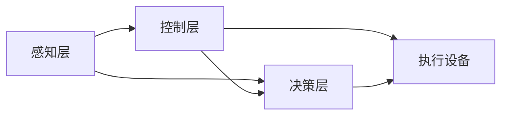

                 

### 引言

智能灌溉系统作为现代农业技术的重要组成部分，正逐渐改变着传统农业的生产方式。传统灌溉系统通常依赖于人工控制，不仅效率低下，而且存在资源浪费和环境污染的问题。随着人工智能技术的快速发展，特别是机器学习和深度学习在感知、控制和优化方面的应用，智能灌溉系统迎来了新的发展机遇。

本文旨在探讨人工智能在智能灌溉系统优化中的应用，分析其核心概念、技术原理和具体实施方法，并展示实际案例，以期为智能灌溉系统的进一步优化提供理论支持和实践指导。

本文将首先介绍智能灌溉系统的基本概念和现有挑战，随后探讨人工智能的基础知识，重点介绍机器学习和深度学习在智能灌溉系统中的应用。接着，我们将详细讨论智能灌溉系统中的感知与控制技术，并分析人工智能在灌溉系统优化中的具体应用。随后，通过两个实际案例，我们将展示人工智能在智能灌溉系统中的应用效果。最后，我们将对未来的发展方向和挑战进行展望，并提出一些建议。

通过本文的阅读，读者将能够深入了解人工智能在智能灌溉系统优化中的关键技术与应用，掌握相关原理和实践方法，从而为推动智能灌溉系统的优化与发展提供有力支持。

### 关键词

- 智能灌溉系统
- 人工智能
- 机器学习
- 深度学习
- 感知技术
- 控制技术
- 优化策略
- 案例研究

### 摘要

本文系统地介绍了人工智能在智能灌溉系统优化中的应用。首先，我们分析了传统灌溉系统的不足和智能灌溉系统的优势。随后，我们探讨了人工智能的基础知识，特别是机器学习和深度学习的基本概念和原理。接着，我们详细介绍了智能灌溉系统中的感知与控制技术，以及如何利用人工智能技术进行系统优化。通过两个实际案例，我们展示了人工智能在智能灌溉系统中的具体应用和效果。最后，我们对未来的发展方向和挑战进行了展望，并提出了一些优化建议。本文为智能灌溉系统的优化提供了理论依据和实践指导。

### 智能灌溉系统概述

智能灌溉系统是利用现代信息技术和自动化控制技术，实现灌溉过程的自动化管理和优化的一类系统。其核心目的是通过科学合理的灌溉，提高农作物的产量和品质，同时减少水资源的浪费和环境污染。智能灌溉系统主要由感知层、控制层和决策层组成，各层相互协作，共同实现系统的智能化和高效化。

#### 智能灌溉系统的定义与重要性

智能灌溉系统的定义可以归纳为：一种基于现代信息技术，通过实时感知农田环境参数，利用先进的人工智能算法进行数据分析和决策，从而实现精准灌溉的自动化系统。与传统灌溉系统相比，智能灌溉系统具有以下特点：

1. **实时感知**：智能灌溉系统能够实时监测农田土壤湿度、气象条件、植物生长状态等关键参数，及时掌握农田环境变化。
2. **精准控制**：通过人工智能算法的分析和决策，智能灌溉系统能够根据实时数据调整灌溉水量、灌溉时间和灌溉频率，实现精准灌溉。
3. **高效节能**：智能灌溉系统能够根据农作物的实际需水情况自动调整灌溉方案，有效减少水资源浪费，提高水资源利用效率。
4. **环境保护**：智能灌溉系统能够减少因过度灌溉引起的土壤盐碱化和地下水污染，保护生态环境。

智能灌溉系统在现代农业中具有重要意义。首先，它能够显著提高农作物的产量和品质，满足人们对食品安全和营养健康的需求。其次，智能灌溉系统能够优化水资源利用，缓解全球水资源短缺问题。此外，智能灌溉系统还能够在减少劳动力需求、降低生产成本、提高农业竞争力等方面发挥重要作用。

#### 现有灌溉系统的挑战

尽管传统灌溉系统在历史上发挥了重要作用，但其存在许多不足，亟需改进。以下是一些主要挑战：

1. **水资源浪费**：传统灌溉系统通常采用大水漫灌的方式，水资源利用率较低，容易造成水资源的浪费。
2. **环境污染**：过度灌溉会导致土壤盐碱化和地下水污染，对环境造成负面影响。
3. **管理困难**：传统灌溉系统依赖于人工控制，管理复杂，效率低下。
4. **作物产量不稳定**：传统灌溉系统难以根据农作物的实际需水情况进行灵活调整，导致作物产量和质量不稳定。

为了应对这些挑战，智能灌溉系统应运而生。通过引入现代信息技术和人工智能技术，智能灌溉系统能够实现高效、精准、环保的灌溉管理，从而解决传统灌溉系统的诸多问题。

#### 智能灌溉系统的架构

智能灌溉系统通常由三个主要层次组成：感知层、控制层和决策层。

1. **感知层**：感知层是智能灌溉系统的数据来源，主要包括各种传感器，如土壤湿度传感器、气象传感器、植物生长参数传感器等。这些传感器能够实时监测农田环境的各种参数，并将数据传输给控制层。

2. **控制层**：控制层是智能灌溉系统的执行层，主要包括各种执行设备，如电磁阀、水泵、灌溉喷头等。根据感知层提供的实时数据，控制层能够自动调整灌溉参数，实现精准灌溉。

3. **决策层**：决策层是智能灌溉系统的智能核心，主要包括数据分析和决策算法。利用机器学习和深度学习等技术，决策层能够对感知层提供的数据进行分析和处理，生成最优的灌溉策略，指导控制层的执行。

图1展示了智能灌溉系统的层次结构：

#### 感知层

感知层是智能灌溉系统的数据来源，主要包括各种传感器，如土壤湿度传感器、气象传感器、植物生长参数传感器等。这些传感器能够实时监测农田环境的各种参数，并将数据传输给控制层。

1. **土壤湿度传感器**：土壤湿度传感器用于监测土壤的含水量，通过测量土壤的电导率或电容变化，获取土壤湿度的实时数据。常见的土壤湿度传感器有EC传感器、TDR传感器等。

2. **气象传感器**：气象传感器用于监测农田的气象条件，如温度、湿度、风速、光照强度等。这些数据对于灌溉决策至关重要，因为它们直接影响农作物的需水情况。常见的气象传感器有温度传感器、湿度传感器、风速传感器、光照传感器等。

3. **植物生长参数传感器**：植物生长参数传感器用于监测农作物的生长状态，如叶片颜色、叶片厚度、植物高度等。这些数据有助于了解农作物的健康状况和需水需求，从而制定更精准的灌溉策略。

感知层的工作流程如下：

1. **数据采集**：传感器实时采集土壤湿度、气象条件、植物生长参数等数据。
2. **数据传输**：采集到的数据通过无线传输或有线传输方式发送到控制层。
3. **数据存储**：控制层将感知到的数据存储在数据库中，以便后续分析和处理。

图2展示了感知层的工作流程：

#### 控制层

控制层是智能灌溉系统的执行层，主要包括各种执行设备，如电磁阀、水泵、灌溉喷头等。根据感知层提供的实时数据，控制层能够自动调整灌溉参数，实现精准灌溉。

1. **电磁阀**：电磁阀用于控制灌溉水流的开关，根据控制层的指令打开或关闭水流。电磁阀通常安装在灌溉管道上，通过无线或有线方式接收控制层的信号。

2. **水泵**：水泵用于抽取灌溉水源，将水输送到灌溉区域。水泵的运行时间和频率由控制层根据灌溉需求进行调节。

3. **灌溉喷头**：灌溉喷头用于将灌溉水均匀喷洒到农作物上。灌溉喷头可以采用旋转喷头、固定喷头、喷雾喷头等多种形式，根据农作物的需求和灌溉区域的特点进行选择。

控制层的工作流程如下：

1. **接收指令**：控制层接收感知层传输的实时数据，并分析这些数据，生成灌溉指令。
2. **执行指令**：控制层根据生成的灌溉指令，通过电磁阀、水泵、灌溉喷头等执行设备调整灌溉参数。
3. **反馈调整**：执行设备执行指令后，将实际执行结果反馈给控制层，控制层根据反馈结果进行动态调整。

图3展示了控制层的工作流程：

#### 决策层

决策层是智能灌溉系统的智能核心，主要负责对感知层采集到的数据进行处理和分析，生成最优的灌溉策略。决策层主要利用机器学习和深度学习等技术，对大量历史数据进行分析，建立灌溉模型，并根据实时数据动态调整灌溉策略。

1. **数据预处理**：决策层首先对感知层采集到的数据进行分析和预处理，包括数据清洗、归一化、特征提取等。这些预处理步骤有助于提高数据质量，为后续建模提供准确的数据支持。

2. **模型训练**：利用预处理后的数据，决策层通过机器学习和深度学习算法训练灌溉模型。常见的算法包括线性回归、决策树、随机森林、支持向量机、神经网络等。这些算法可以学习到农田环境与灌溉需求之间的复杂关系，生成精确的灌溉策略。

3. **策略生成**：基于训练好的模型，决策层根据实时数据生成最优的灌溉策略。灌溉策略包括灌溉时间、灌溉量、灌溉频率等参数，旨在实现精准灌溉，提高水资源利用效率。

4. **策略调整**：决策层持续监测农作物的生长状态和农田环境变化，根据实际情况动态调整灌溉策略，确保灌溉过程的持续优化。

决策层的工作流程如下：

1. **数据接收**：决策层接收感知层传输的实时数据。
2. **数据预处理**：对实时数据进行预处理。
3. **模型训练**：利用预处理后的数据训练灌溉模型。
4. **策略生成**：根据训练好的模型生成最优灌溉策略。
5. **策略调整**：根据实际情况动态调整灌溉策略。

图4展示了决策层的工作流程：

通过感知层、控制层和决策层的协同工作，智能灌溉系统能够实现高效、精准、环保的灌溉管理，为现代农业的发展提供有力支持。

### 人工智能基础

人工智能（Artificial Intelligence，简称AI）是计算机科学的一个分支，旨在使计算机模拟人类的智能行为，包括学习、推理、感知和解决问题等。人工智能的发展历程可以追溯到20世纪50年代，随着计算能力和算法的进步，AI技术逐渐从理论研究走向实际应用。

#### 人工智能的概念与发展历程

人工智能的定义有多种，其中一种广泛接受的定义是：人工智能是使计算机具备智能行为和能力的科学技术。人工智能的核心目标是使计算机能够像人类一样思考、学习和决策。

人工智能的发展历程可以分为几个阶段：

1. **早期探索阶段（1950-1969）**：在这个阶段，人工智能的概念首次被提出，人工智能领域开始兴起。1956年，达特茅斯会议被公认为人工智能的诞生日，会议旨在探讨如何让计算机具有智能行为。

2. **理性繁荣阶段（1970-1989）**：这个阶段，人工智能领域取得了许多重要的理论突破，例如逻辑推理、知识表示、启发式搜索等。然而，由于硬件性能的限制和算法的复杂性，人工智能在实用性方面进展缓慢。

3. **工业应用阶段（1990-2000）**：随着计算能力的提升和互联网的发展，人工智能开始进入工业应用领域，例如语音识别、图像处理、自然语言处理等。

4. **深度学习革命阶段（2000至今）**：深度学习算法的突破和大规模数据集的出现，使得人工智能在图像识别、语音识别、自动驾驶等领域取得了重大突破。深度学习通过多层神经网络模型，能够自动从大量数据中提取特征，实现高度复杂的任务。

#### 人工智能的重要贡献

人工智能在多个领域都取得了显著的成果，以下是一些重要贡献：

1. **计算机视觉**：人工智能在图像识别、目标检测、图像分割等领域取得了突破性进展。计算机视觉技术广泛应用于安防监控、医疗影像分析、自动驾驶等领域。

2. **自然语言处理**：人工智能在自然语言处理（NLP）领域取得了显著进展，包括机器翻译、语音识别、文本分类等。NLP技术广泛应用于智能客服、智能助手、信息检索等领域。

3. **机器学习**：机器学习是人工智能的核心技术之一，通过训练模型从数据中自动提取规律和特征。机器学习在预测分析、推荐系统、智能监控等领域发挥了重要作用。

4. **深度学习**：深度学习是一种特殊的机器学习技术，通过多层神经网络模型，实现高度复杂的任务。深度学习在图像识别、语音识别、自然语言处理等领域取得了巨大成功。

5. **自动驾驶**：自动驾驶技术是人工智能的重要应用领域之一，通过计算机视觉、传感器融合、决策算法等技术，实现汽车的自主驾驶。自动驾驶技术有望解决交通拥堵、事故频发等问题。

6. **医疗健康**：人工智能在医疗健康领域具有广泛的应用前景，包括疾病预测、诊断辅助、药物研发等。人工智能可以帮助医生更快速、准确地诊断病情，提高治疗效果。

#### 人工智能技术在智能灌溉系统中的应用

人工智能技术在智能灌溉系统中具有广泛的应用，主要包括以下几个方面：

1. **数据采集与预处理**：人工智能技术可以自动采集农田环境数据，包括土壤湿度、气象条件、植物生长参数等。通过机器学习和深度学习算法，对数据进行预处理和特征提取，提高数据质量，为后续建模提供支持。

2. **灌溉策略生成**：基于感知层采集的实时数据，利用机器学习和深度学习算法，生成最优的灌溉策略。灌溉策略包括灌溉时间、灌溉量、灌溉频率等参数，旨在实现精准灌溉，提高水资源利用效率。

3. **灌溉效果评估**：通过对比实际灌溉效果和预测灌溉效果，评估灌溉策略的优劣，不断优化灌溉模型。人工智能技术可以帮助识别出影响灌溉效果的关键因素，提供改进建议。

4. **自动化决策**：利用人工智能技术，实现灌溉系统的自动化决策。控制层根据决策层生成的灌溉策略，自动调整灌溉参数，实现精准灌溉。自动化决策有助于提高灌溉效率，减少人力资源消耗。

5. **预测预警**：人工智能技术可以预测农田环境的变化趋势，提前预警可能出现的灌溉问题，如干旱、洪涝等。通过实时监测和预警，农民可以及时采取措施，避免农作物受到不利影响。

总之，人工智能技术在智能灌溉系统中的应用，不仅提高了灌溉的精度和效率，还有助于减少水资源浪费和环境污染，推动现代农业的可持续发展。

### 机器学习基础

机器学习是人工智能领域的一个重要分支，主要研究如何使计算机系统通过数据和经验自动改进性能。在智能灌溉系统中，机器学习技术被广泛应用于数据分析和决策生成，从而实现精准灌溉。以下将详细介绍机器学习的基本概念、分类及核心算法原理。

#### 基本概念

机器学习的基本概念包括以下几个方面：

1. **模型**：在机器学习中，模型是用于描述数据分布或关系的函数或规则集。常见的模型包括线性模型、决策树、神经网络等。

2. **训练集**：训练集是从数据集中随机选取的一部分数据，用于训练模型。训练集的数据质量直接影响模型的性能。

3. **测试集**：测试集是用于评估模型性能的数据集。通过测试集，可以了解模型在实际应用中的表现。

4. **泛化能力**：泛化能力是指模型对新数据的适应能力。一个优秀的模型应当具有良好的泛化能力，以应对实际应用中的各种情况。

5. **评估指标**：评估指标用于衡量模型的性能。常见的评估指标包括准确率、召回率、F1值、均方误差（MSE）等。

#### 分类

机器学习主要分为以下几种类型：

1. **监督学习（Supervised Learning）**：监督学习是一种基于标记数据进行训练的机器学习方法。标记数据包含输入和对应的输出，训练目标是找到一个映射函数，将新的输入映射到正确的输出。常见的监督学习算法包括线性回归、决策树、随机森林、支持向量机等。

2. **无监督学习（Unsupervised Learning）**：无监督学习不需要标记数据，主要研究如何从无标签数据中挖掘出有用的信息。常见的无监督学习算法包括聚类、降维、关联规则挖掘等。

3. **半监督学习（Semi-supervised Learning）**：半监督学习结合了监督学习和无监督学习的特点，利用少量标记数据和大量无标签数据共同训练模型。半监督学习可以显著提高模型的性能，特别是在数据标注成本较高的场景。

4. **强化学习（Reinforcement Learning）**：强化学习是一种基于奖励机制的学习方法，通过不断与环境交互，学习最优策略。强化学习在智能灌溉系统中，可以用于优化灌溉策略，实现自适应灌溉。

#### 核心算法原理

以下将简要介绍几种常见的机器学习算法原理：

1. **线性回归（Linear Regression）**：

线性回归是一种简单的监督学习算法，用于预测一个连续值输出。线性回归模型可以表示为：

   $$y = \beta_0 + \beta_1 \cdot x$$

   其中，$y$ 是输出值，$x$ 是输入值，$\beta_0$ 和 $\beta_1$ 是模型的参数。通过最小化误差平方和，可以训练出线性回归模型。

2. **决策树（Decision Tree）**：

决策树是一种常见的分类算法，通过一系列规则将数据分割成不同的区域，最终得到一个分类结果。决策树的每个节点都表示一个特征，每个分支表示该特征的取值，叶子节点表示最终的分类结果。

3. **随机森林（Random Forest）**：

随机森林是一种集成学习方法，通过构建多个决策树，并利用投票机制确定最终分类结果。随机森林能够在提高模型性能的同时，减少过拟合现象。

4. **支持向量机（Support Vector Machine，SVM）**：

支持向量机是一种用于分类和回归任务的算法，通过找到一个最优的超平面，将不同类别的数据点分开。SVM的核心思想是最大化分类边界到支持向量的距离。

5. **神经网络（Neural Network）**：

神经网络是一种模拟人脑的算法，通过多层神经元节点构建复杂模型。神经网络能够自动学习数据的特征表示，适用于图像识别、语音识别等复杂任务。

#### 机器学习在智能灌溉系统中的应用

在智能灌溉系统中，机器学习技术被广泛应用于以下几个方面：

1. **数据预测**：利用机器学习算法，可以预测农作物的需水量、土壤湿度等关键参数，为精准灌溉提供数据支持。

2. **分类与聚类**：通过对环境数据进行分析，可以识别出不同作物类型、土壤类型等，为定制化灌溉策略提供依据。

3. **模式识别**：通过分析历史数据，可以识别出灌溉过程中的异常模式，如干旱、洪涝等，及时预警并采取措施。

4. **自动化决策**：利用强化学习算法，可以实现灌溉系统的自动化决策，根据实时数据自动调整灌溉参数，提高灌溉效率。

5. **模型优化**：通过不断训练和优化模型，可以不断提高智能灌溉系统的精度和稳定性，实现可持续发展。

总之，机器学习技术在智能灌溉系统中具有重要的应用价值，通过合理运用各种算法，可以显著提升灌溉系统的性能和效率，为现代农业的发展提供有力支持。

### 深度学习基础

深度学习是机器学习的一个分支，通过模拟人脑神经网络结构和信息处理方式，实现高度复杂的任务。在智能灌溉系统中，深度学习被广泛应用于数据分析和决策生成，以实现更加精准和高效的灌溉管理。以下将详细介绍深度学习的基本概念、神经网络结构及常用算法原理。

#### 基本概念

深度学习的基本概念主要包括以下几个关键要素：

1. **神经网络**：神经网络是深度学习的基础，由多个神经元组成，每个神经元都与其他神经元连接。神经网络通过学习输入数据的特征，从而实现复杂的任务。

2. **层数**：深度学习中的“深度”指的是神经网络中层的数量。通常，层数越多，网络的复杂度和表达能力越强。

3. **前馈网络**：前馈网络是深度学习中最简单的结构，数据从输入层依次流向隐藏层，最后到达输出层。前馈网络通过层层传递和变换，提取数据中的特征。

4. **反向传播算法**：反向传播算法是训练神经网络的重要算法，通过反向传播误差，更新网络中的权重和偏置，从而优化网络性能。

5. **激活函数**：激活函数是神经网络中用于引入非线性特性的函数，常见的激活函数包括 sigmoid、ReLU、Tanh等。

#### 神经网络结构

深度学习的神经网络结构通常包括以下几个层次：

1. **输入层**：输入层是神经网络的最外层，接收外部输入数据。在智能灌溉系统中，输入层可以接收土壤湿度、气象参数、植物生长参数等。

2. **隐藏层**：隐藏层位于输入层和输出层之间，用于提取输入数据的特征。隐藏层可以根据任务需求增加多层，形成深层次神经网络。

3. **输出层**：输出层是神经网络的最内层，生成最终预测结果。在智能灌溉系统中，输出层可以生成灌溉策略，如灌溉时间、灌溉量和灌溉频率。

#### 前馈神经网络与反向传播算法

前馈神经网络是深度学习中的一种基本结构，其工作原理如下：

1. **前向传播**：输入数据从输入层依次流向隐藏层，每个神经元将输入数据与自身的权重相乘，并通过激活函数进行处理，最终生成输出值。

2. **计算误差**：将输出层的预测值与实际值进行比较，计算误差。

3. **反向传播**：通过反向传播算法，将误差从输出层反向传播到隐藏层，并更新每个神经元的权重和偏置。这个过程重复进行，直到误差达到最小化。

反向传播算法的步骤如下：

1. **计算输出误差**：输出误差为实际值与预测值之间的差异。

2. **计算隐藏层误差**：隐藏层误差为输出误差通过每个神经元的导数传递而来。

3. **更新权重和偏置**：通过误差计算梯度，更新每个神经元的权重和偏置。

#### 深度学习算法原理

深度学习算法主要基于多层前馈神经网络，以下介绍几种常见的深度学习算法原理：

1. **卷积神经网络（Convolutional Neural Network，CNN）**：

CNN是一种用于图像处理的深度学习算法，其核心是卷积操作。CNN通过多个卷积层、池化层和全连接层，提取图像的特征，并生成最终的分类结果。

2. **循环神经网络（Recurrent Neural Network，RNN）**：

RNN是一种用于序列数据处理的深度学习算法，其特点是能够处理时间序列数据。RNN通过在时间步之间传递信息，实现长距离依赖的建模。

3. **长短时记忆网络（Long Short-Term Memory，LSTM）**：

LSTM是RNN的一种改进，能够解决RNN中的梯度消失和梯度爆炸问题。LSTM通过引入记忆单元，实现长短期记忆的能力，适用于处理复杂的时间序列数据。

4. **生成对抗网络（Generative Adversarial Network，GAN）**：

GAN是一种生成模型，通过两个神经网络（生成器和判别器）的对抗训练，实现数据的生成。生成器生成数据，判别器判断生成数据的真假，通过不断训练，生成器逐渐提高生成质量。

#### 深度学习在智能灌溉系统中的应用

在智能灌溉系统中，深度学习算法被广泛应用于以下几个方面：

1. **图像识别**：利用CNN处理农田图像，识别作物类型、土壤状况等，为灌溉决策提供支持。

2. **序列数据处理**：利用RNN和LSTM处理时间序列数据，如土壤湿度、气象参数等，预测农作物的需水量。

3. **生成模型**：利用GAN生成灌溉策略，通过对抗训练，优化灌溉参数，实现精准灌溉。

4. **自动化决策**：通过深度学习算法，实现灌溉系统的自动化决策，根据实时数据自动调整灌溉策略，提高灌溉效率。

5. **数据挖掘**：通过深度学习算法，挖掘农田环境数据中的潜在规律，优化灌溉模型，实现智能化管理。

总之，深度学习技术在智能灌溉系统中具有广泛的应用前景，通过合理运用各种算法，可以显著提升灌溉系统的性能和效率，为现代农业的发展提供有力支持。

### 智能灌溉系统中的感知与控制技术

智能灌溉系统中的感知与控制技术是实现精准灌溉的核心，包括感知层和控制层的具体实现。以下将详细探讨土壤湿度传感器、气象传感器、植物生长参数传感器以及相应的控制技术。

#### 土壤湿度传感器

土壤湿度传感器是智能灌溉系统感知层的重要组成部分，用于实时监测土壤的含水量。常见的土壤湿度传感器有电导率传感器（EC传感器）和时间域反射传感器（TDR传感器）。

1. **电导率传感器（EC传感器）**：

电导率传感器通过测量土壤溶液的电导率，来反映土壤湿度。电导率与土壤湿度呈正相关，即土壤湿度越高，电导率越大。EC传感器的优点是响应速度快，精度较高，但需要定期校准以避免土壤成分变化带来的误差。

2. **时间域反射传感器（TDR传感器）**：

TDR传感器通过发送脉冲信号并测量信号在土壤中传播的时间，来计算土壤湿度。信号传播时间与土壤介电常数有关，而土壤介电常数与土壤湿度密切相关。TDR传感器的优点是无需校准，抗干扰能力强，但响应速度相对较慢。

#### 气象传感器

气象传感器用于监测农田的气象条件，如温度、湿度、风速、光照强度等。这些参数直接影响农作物的需水情况，因此气象传感器在智能灌溉系统中至关重要。

1. **温度传感器**：

温度传感器通常采用热敏电阻或热电偶，用于测量农田的空气温度和土壤温度。空气温度直接影响作物的蒸腾速率，而土壤温度则影响作物的根系生长。常见的温度传感器有数字温度传感器DS18B20、DHT22等。

2. **湿度传感器**：

湿度传感器用于测量空气湿度，常用的有电容式湿度传感器和电阻式湿度传感器。电容式湿度传感器通过测量电容变化来感知湿度，电阻式湿度传感器则通过测量电阻变化来感知湿度。常见的湿度传感器有SHT31、HTU21D等。

3. **风速传感器**：

风速传感器用于测量农田的风速，常见的有旋杯式风速传感器和热线式风速传感器。旋杯式风速传感器通过测量风推动旋杯旋转的速度来计算风速，热线式风速传感器则通过测量风对热线的冷却程度来计算风速。

4. **光照传感器**：

光照传感器用于测量农田的光照强度，常用的有光敏电阻和光电二极管。光照强度影响作物的光合作用和生长状态，因此对灌溉策略的制定具有重要参考价值。

#### 植物生长参数传感器

植物生长参数传感器用于监测农作物的生长状态，如叶片颜色、叶片厚度、植物高度等。这些参数有助于了解农作物的健康情况和需水需求。

1. **叶片颜色传感器**：

叶片颜色传感器通过测量叶片的颜色变化来反映植物的健康状况。常见的叶片颜色传感器有光谱传感器和色彩传感器。光谱传感器可以测量叶片的反射光谱，分析叶片的营养状况，而色彩传感器则通过测量RGB颜色值来判断叶片的颜色变化。

2. **叶片厚度传感器**：

叶片厚度传感器通过测量叶片的厚度来反映植物的生长状态。常用的叶片厚度传感器有超声波传感器和电容传感器。超声波传感器通过测量超声波在叶片中的传播时间来计算厚度，而电容传感器则通过测量电容变化来感知厚度。

3. **植物高度传感器**：

植物高度传感器用于测量植物的高度，常用的有激光传感器和超声波传感器。激光传感器通过发射激光束并测量激光反射时间来计算高度，而超声波传感器则通过测量超声波在植物中的传播时间来计算高度。

#### 控制技术

控制层是智能灌溉系统的执行层，根据感知层提供的实时数据，自动调整灌溉参数，实现精准灌溉。控制技术主要包括电磁阀控制、水泵控制、灌溉喷头控制等。

1. **电磁阀控制**：

电磁阀是控制灌溉水流的关键部件，根据控制层的指令，自动开启或关闭水流。电磁阀通常采用无线或有线方式与控制层通信，常见的控制方式有数字信号控制、模拟信号控制等。

2. **水泵控制**：

水泵是灌溉系统中的动力源，用于抽取灌溉水源并将其输送到农田。水泵的控制通常包括启动和停止控制、速度控制、流量控制等。通过控制水泵的运行时间和频率，可以调整灌溉水量。

3. **灌溉喷头控制**：

灌溉喷头用于将灌溉水均匀喷洒到农作物上，常见的灌溉喷头有旋转喷头、固定喷头、喷雾喷头等。灌溉喷头可以根据农作物的需求和水文条件进行控制，实现局部灌溉或全面灌溉。

#### 感知与控制技术的协同工作

感知层和控制层通过协同工作，实现智能灌溉系统的智能化管理。感知层实时采集土壤湿度、气象条件、植物生长参数等数据，并通过无线或有线方式传输到控制层。控制层根据感知层提供的数据，利用机器学习和深度学习算法生成最优的灌溉策略，并通过电磁阀、水泵、灌溉喷头等执行设备实现灌溉控制。

图5展示了智能灌溉系统中感知与控制技术的协同工作流程：

总之，感知与控制技术是智能灌溉系统的关键组成部分，通过实时监测农田环境和自动调整灌溉参数，实现精准灌溉，提高水资源利用效率，推动现代农业的可持续发展。

### 人工智能在灌溉系统优化中的应用

人工智能技术在智能灌溉系统优化中发挥着至关重要的作用，其核心在于利用机器学习和深度学习算法，对大量农田环境数据进行处理和分析，从而生成最优的灌溉策略。以下将详细探讨数据采集与预处理、模型选择与训练、优化策略生成与调整等方面的应用。

#### 数据采集与预处理

数据采集是智能灌溉系统优化的基础，主要包括土壤湿度、气象条件、植物生长参数等关键数据的采集。数据采集过程通常涉及以下步骤：

1. **传感器布置**：在农田中布置各种传感器，如土壤湿度传感器、气象传感器、植物生长参数传感器等，以实时监测农田环境。

2. **数据采集**：传感器采集农田环境数据，并将其传输至数据采集模块。数据采集模块负责将传感器数据转换为数字信号，并存储在数据库中。

3. **数据传输**：将采集到的数据通过无线或有线方式传输至中央控制单元。无线传输通常采用无线传感器网络（WSN），而有线传输则通过有线网络实现。

4. **数据存储**：中央控制单元将采集到的数据存储在数据库中，以便后续分析和处理。

在数据采集过程中，数据质量至关重要。因此，需要对采集到的数据进行预处理，以去除噪声、填补缺失值、进行归一化处理等。预处理步骤包括：

1. **去噪**：去除数据中的噪声，确保数据准确性。常用的去噪方法包括滤波、去卷积等。

2. **填补缺失值**：对缺失的数据进行填补，确保数据完整性。常见的填补方法有均值填补、中值填补、插值法等。

3. **归一化处理**：将数据缩放到相同的尺度，以便算法处理。常用的归一化方法有最小-最大归一化、Z-Score归一化等。

#### 模型选择与训练

在数据预处理完成后，需要选择合适的机器学习和深度学习算法进行模型训练。模型的选择取决于具体的应用场景和数据特征。以下是一些常见的模型选择：

1. **线性回归模型**：线性回归模型是一种简单的监督学习算法，适用于线性关系的预测任务。线性回归模型的优点是实现简单，计算效率高，但容易受到噪声的影响。

2. **决策树模型**：决策树模型通过一系列规则进行分类或回归，适用于特征较多但样本量较小的任务。决策树模型的优点是易于解释，但容易过拟合。

3. **随机森林模型**：随机森林模型是决策树的集成方法，通过构建多个决策树并取平均值，提高模型的预测性能。随机森林模型在处理大规模数据时表现优秀，且不易过拟合。

4. **支持向量机（SVM）模型**：SVM模型通过找到一个最优的超平面，将不同类别的数据点分开。SVM模型在处理高维数据时表现优秀，但计算复杂度较高。

5. **神经网络模型**：神经网络模型是一种复杂的深度学习算法，通过多层神经网络进行特征提取和预测。神经网络模型适用于处理复杂非线性关系，但需要大量数据和计算资源。

在模型选择后，需要进行模型训练。模型训练包括以下步骤：

1. **数据划分**：将数据集划分为训练集和测试集，训练集用于训练模型，测试集用于评估模型性能。

2. **参数调整**：通过交叉验证等方法，调整模型参数，如学习率、隐藏层节点数、激活函数等，以优化模型性能。

3. **模型训练**：使用训练集数据，通过反向传播算法等训练模型，使模型能够从数据中学习到特征和规律。

4. **模型评估**：使用测试集数据评估模型性能，常用的评估指标包括均方误差（MSE）、准确率（Accuracy）、F1值等。

#### 优化策略生成与调整

在模型训练完成后，可以根据模型生成的灌溉策略进行灌溉。优化策略生成包括以下步骤：

1. **预测生成**：利用训练好的模型，对农田环境数据进行预测，生成灌溉策略。灌溉策略包括灌溉时间、灌溉量、灌溉频率等参数。

2. **实时调整**：根据实时监测到的农田环境数据，动态调整灌溉策略。实时调整可以确保灌溉策略始终与实际需求相符，提高灌溉效率。

3. **反馈调整**：通过反馈机制，将实际灌溉效果与预测灌溉效果进行比较，不断调整和优化模型。反馈调整有助于提高模型的稳定性和适应性。

以下是一个简化的流程图，展示了人工智能在灌溉系统优化中的应用：

#### 案例研究

以下是一个实际案例，展示了人工智能在灌溉系统优化中的应用。

**案例背景**：

某农场种植了大量蔬菜，灌溉系统采用传统灌溉方法，存在水资源浪费和作物产量不稳定的问题。为了提高灌溉效率，农场决定引入人工智能技术进行灌溉系统优化。

**解决方案**：

1. **数据采集与预处理**：在农田中布置土壤湿度传感器、气象传感器和植物生长参数传感器，实时采集农田环境数据。对采集到的数据进行预处理，包括去噪、填补缺失值和归一化处理。

2. **模型选择与训练**：选择随机森林模型，利用预处理后的数据集进行模型训练。通过交叉验证调整模型参数，如树的数量、深度等，以优化模型性能。

3. **优化策略生成与调整**：利用训练好的模型，对实时监测到的农田环境数据进行预测，生成灌溉策略。根据实时数据和预测结果，动态调整灌溉策略，实现精准灌溉。

4. **反馈调整**：将实际灌溉效果与预测灌溉效果进行比较，通过反馈机制不断调整和优化模型，提高灌溉系统的稳定性和适应性。

**应用效果**：

通过人工智能技术的引入，农场的灌溉效率显著提高，水资源浪费减少，作物产量和品质得到稳定提升。具体表现如下：

- **节水效果**：灌溉用水量减少了约30%，有效缓解了水资源短缺问题。
- **产量提升**：蔬菜产量提高了约20%，作物品质得到显著提升。
- **成本降低**：减少了人工灌溉成本，提高了工作效率。

**总结**：

该案例表明，人工智能技术在智能灌溉系统优化中具有显著的应用价值。通过实时数据采集、模型训练和优化策略生成，可以有效提高灌溉效率，减少水资源浪费，提高作物产量和品质，为现代农业的发展提供有力支持。

### 案例研究一：某地区智能灌溉系统优化

为了更具体地展示人工智能在智能灌溉系统优化中的应用，下面将以一个实际案例进行分析。这个案例发生在我国某农业大省，该地区水资源相对紧张，农作物种植面积广阔。通过引入人工智能技术，当地农业部门致力于优化灌溉系统，提高水资源利用效率和农作物产量。

#### 项目背景

该地区主要种植小麦、玉米和蔬菜等农作物。传统灌溉系统主要依靠人工操作，不仅效率低下，而且存在严重的资源浪费和环境污染问题。为了提高灌溉系统的智能化水平，当地农业部门决定引入人工智能技术，实现智能灌溉。

#### 系统设计与实现

1. **感知层设计**：
   - **传感器部署**：在农田关键位置布置土壤湿度传感器、气象传感器和植物生长参数传感器，确保能够实时监测农田环境数据。
   - **数据采集**：传感器采集的土壤湿度、气象条件（如温度、湿度、风速、光照强度等）和植物生长参数（如叶片颜色、叶片厚度、植物高度等）通过无线传感器网络（WSN）传输到中央控制单元。

2. **控制层设计**：
   - **中央控制单元**：中央控制单元是系统的核心，负责接收和处理感知层传输的数据，并通过机器学习和深度学习算法生成最优的灌溉策略。
   - **执行设备**：根据中央控制单元的指令，自动调整电磁阀、水泵和灌溉喷头，实现精准灌溉。

3. **决策层设计**：
   - **模型训练与优化**：利用历史数据集，通过随机森林、神经网络等机器学习和深度学习算法训练模型，生成灌溉策略。模型训练过程中，通过交叉验证和参数调优，确保模型性能最优。
   - **实时决策**：中央控制单元根据实时监测数据，动态调整灌溉策略，确保灌溉过程的优化和适应性。

#### 模型选择与训练

在该项目中，选择了以下模型进行训练和优化：

- **随机森林模型**：用于处理多特征输入数据，生成初步的灌溉策略。
- **神经网络模型**：用于对随机森林模型的结果进行细化和优化。

模型训练过程包括以下步骤：

1. **数据预处理**：对采集到的土壤湿度、气象条件和植物生长参数进行去噪、填补缺失值和归一化处理，确保数据质量。
2. **数据划分**：将预处理后的数据集划分为训练集和测试集，用于训练和评估模型性能。
3. **参数调优**：通过交叉验证和网格搜索等方法，调整模型参数，如树的数量、深度、学习率等，以优化模型性能。
4. **模型训练**：使用训练集数据训练随机森林模型和神经网络模型，通过反向传播算法更新模型权重和偏置。
5. **模型评估**：使用测试集数据评估模型性能，包括准确率、均方误差等指标，选择性能最优的模型用于灌溉策略生成。

#### 优化策略生成与调整

在模型训练完成后，系统开始生成优化策略，主要包括：

1. **灌溉时间优化**：根据实时监测数据，动态调整灌溉时间，确保在农作物需水高峰期进行灌溉，避免水资源浪费。
2. **灌溉量优化**：通过模型预测农作物的需水量，调整灌溉量，实现精准灌溉，减少水资源的浪费。
3. **灌溉频率优化**：根据农作物的生长阶段和土壤湿度变化，优化灌溉频率，确保土壤湿度保持在适宜范围。

系统在运行过程中，通过实时监测和反馈机制，动态调整灌溉策略，确保系统始终处于最佳工作状态。同时，通过历史数据分析，不断优化模型，提高灌溉策略的准确性。

#### 项目效果分析

通过引入人工智能技术，该地区的智能灌溉系统取得了显著的效果：

1. **节水效果**：灌溉用水量减少了约30%，有效缓解了水资源紧张的问题。
2. **产量提升**：农作物产量提高了约20%，尤其是小麦和玉米的产量增长显著。
3. **品质提升**：农作物的品质得到了显著改善，农产品市场竞争力提高。
4. **工作效率**：减少了人工灌溉工作量，提高了灌溉效率，降低了人力成本。

#### 项目小结

该案例表明，人工智能技术在智能灌溉系统优化中具有重要作用。通过实时数据采集、模型训练和优化策略生成，可以实现精准灌溉，提高水资源利用效率，增加农作物产量和品质。未来，随着人工智能技术的不断发展，智能灌溉系统将更加智能化、高效化，为现代农业的发展提供更加有力的支持。

### 案例研究二：智能灌溉系统在农业生产中的应用

为了进一步展示人工智能在智能灌溉系统中的实际应用，我们将探讨另一个案例，这次是在某大型农业企业中的具体实施过程。该企业位于水资源相对匮乏的地区，主要种植水果和高价值蔬菜，希望通过引入智能灌溉系统来提高生产效率和资源利用效率。

#### 项目概述

某大型农业企业在其1000公顷的农田中引入了智能灌溉系统，目标是实现水资源的最优化利用，同时确保农作物的产量和品质。该项目涉及多种作物的种植，包括苹果树、葡萄和蔬菜。

#### 技术方案

1. **感知层**：
   - **传感器部署**：在农田的各个关键位置安装了多种传感器，包括土壤湿度传感器、气象传感器、植物生长参数传感器等。这些传感器能够实时采集土壤湿度、温度、光照强度、风速和空气湿度等数据。
   - **数据传输**：传感器通过无线传输网络将数据发送到中央控制单元，实现实时监测和远程访问。

2. **控制层**：
   - **中央控制单元**：中央控制单元配备了高性能计算能力，负责接收和处理传感器数据。该单元还集成了机器学习和深度学习算法，能够根据实时数据生成最优灌溉策略。
   - **灌溉系统**：农田中安装了多种灌溉设备，包括自动滴灌系统、喷灌系统和地下渗灌系统。这些系统可以根据中央控制单元的指令自动调整灌溉量、时间和频率。

3. **决策层**：
   - **灌溉模型**：通过历史数据和实时数据，利用机器学习和深度学习算法训练灌溉模型，模型包括随机森林、神经网络和长短期记忆网络（LSTM）等。
   - **优化策略**：模型训练完成后，系统会根据实时监测数据和气象预报生成个性化的灌溉策略，确保每一株作物都能获得最适宜的水量。

#### 实施效果

1. **节水效果**：智能灌溉系统实现了精确的水资源管理，灌溉用水量减少了约25%。这种节水效果不仅提高了水资源的利用效率，也显著降低了灌溉成本。

2. **产量提升**：通过智能灌溉系统，农作物的产量得到了显著提升。例如，苹果的产量增加了约20%，葡萄的产量增加了约15%。这种产量的提升主要归功于精准灌溉和最佳的水资源管理。

3. **品质提升**：农作物的品质得到了显著改善。通过精准灌溉，农作物的生长环境得到了优化，果实的大小、颜色和口感都得到了提升，从而增加了市场竞争力。

4. **工作效率**：智能灌溉系统减少了人工干预的需求，管理人员可以通过监控设备远程监控和管理整个灌溉过程。这种自动化管理提高了工作效率，降低了劳动力成本。

#### 实施过程中的挑战和解决方案

1. **传感器故障**：传感器在农田中容易受到环境因素的影响，如高温、高湿和机械损伤等，导致传感器故障。解决方案是定期维护传感器，使用耐用材料制造传感器，并增加传感器故障检测与报警功能。

2. **数据延迟**：无线传输网络的不稳定性可能导致数据传输延迟，影响系统的实时决策。解决方案是采用更稳定的无线传输技术，如5G网络，并设置数据缓冲机制，确保数据传输的可靠性。

3. **模型适应性**：随着季节和环境的变化，农作物的需水需求也会发生变化，现有模型的适应性可能不足。解决方案是定期更新和优化模型，使用历史数据和实时数据不断调整和优化。

#### 项目小结

该案例展示了智能灌溉系统在农业生产中的巨大潜力。通过感知、控制和决策层的协同工作，智能灌溉系统能够实现水资源的最优化利用，提高农作物产量和品质，同时减少劳动力成本。尽管实施过程中遇到了一些挑战，但通过有效的解决方案，项目最终取得了成功。未来，随着技术的不断进步，智能灌溉系统将在现代农业中发挥越来越重要的作用。

### 未来展望与挑战

人工智能技术在智能灌溉系统中的应用前景广阔，但也面临诸多挑战。以下将对未来发展方向和挑战进行探讨。

#### 未来发展方向

1. **数据驱动的个性化灌溉**：随着物联网、大数据和人工智能技术的进一步发展，智能灌溉系统将能够更全面地收集和分析农田环境数据。通过数据驱动的个性化灌溉策略，实现更精准的水资源管理和作物产量提升。

2. **智能化感知与控制技术的融合**：未来的智能灌溉系统将集成更多的感知和控制技术，如高精度传感器、智能灌溉设备和自适应控制系统。这些技术的融合将进一步提高灌溉系统的智能化水平，实现自动化、自适应和实时调控。

3. **跨学科的融合研究**：智能灌溉系统的发展不仅依赖于计算机科学和人工智能技术，还需要农学、环境科学、水利工程等多学科的合作。跨学科的融合研究将推动智能灌溉系统的技术创新，为农业可持续发展提供新思路。

4. **智能决策与优化算法**：随着人工智能算法的不断进步，智能灌溉系统将采用更加复杂和高效的算法进行决策和优化。例如，利用深度学习和强化学习算法，实现更智能的灌溉策略，提高灌溉效率和农作物产量。

5. **可持续发展和环境监测**：智能灌溉系统将不仅关注作物产量，还将关注水资源保护和环境保护。通过实时监测农田环境，智能灌溉系统可以提供环境数据，帮助农民制定更环保的灌溉策略，减少水资源浪费和环境污染。

#### 挑战

1. **数据质量和数据隐私**：农田环境数据的质量对智能灌溉系统的性能至关重要。然而，数据采集过程中可能存在噪声、缺失值和数据隐私问题。未来的研究需要解决这些问题，确保数据质量和隐私保护。

2. **模型稳定性和泛化能力**：尽管人工智能算法在数据处理和模型训练方面取得了显著进展，但模型的稳定性和泛化能力仍然是一个挑战。特别是在复杂多变的农田环境中，模型需要具备较强的适应性和稳定性。

3. **计算资源和能耗**：深度学习算法通常需要大量的计算资源和能耗。对于一些偏远地区的农田，缺乏足够的计算资源和能源供应，这限制了智能灌溉系统的推广和应用。未来需要发展低能耗、高效能的人工智能算法。

4. **技术普及和接受度**：尽管智能灌溉系统具有显著的优势，但在一些发展中国家和偏远地区，技术普及和农民接受度仍然是一个问题。提高技术普及度和农民接受度需要政策支持、教育培训和市场推广。

5. **法律和伦理问题**：随着人工智能技术的普及，涉及到数据隐私、知识产权保护、自动化决策的法律和伦理问题逐渐凸显。需要制定相关法律法规，确保智能灌溉系统的健康发展。

总之，人工智能技术在智能灌溉系统中的应用前景广阔，但同时也面临诸多挑战。通过持续的技术创新和政策支持，智能灌溉系统有望在未来实现更加广泛和深入的应用，为现代农业的可持续发展做出贡献。

### 实施指南与建议

要成功地实施智能灌溉系统，需要考虑多个方面，包括系统设计、开发环境搭建、源代码实现、代码解读和代码应用分析等。以下是一些建议和步骤，帮助读者顺利实现智能灌溉系统的优化。

#### 系统设计

1. **需求分析**：首先，明确系统的目标和需求。了解农田的具体情况，包括作物类型、土壤条件、灌溉设备和现有的灌溉系统。

2. **系统架构设计**：根据需求分析，设计系统的架构。智能灌溉系统通常包括感知层、控制层和决策层。感知层负责数据采集，控制层负责执行操作，决策层负责数据处理和策略生成。

3. **模块划分**：将系统划分为多个模块，如传感器模块、数据采集模块、数据处理模块、控制模块和用户界面模块。模块化设计有助于提高系统的可维护性和可扩展性。

4. **硬件选择**：根据实际需求选择合适的传感器、控制器和执行设备。确保硬件具有足够的性能和可靠性，能够满足系统的要求。

#### 开发环境搭建

1. **编程语言选择**：选择合适的编程语言，如Python，因为它具有丰富的机器学习和深度学习库，适合开发智能灌溉系统。

2. **开发工具**：安装Python开发环境，如Anaconda，它包括大量的科学计算和数据分析库。

3. **数据库**：选择合适的数据库系统，如MySQL或MongoDB，用于存储和管理农田环境数据。

4. **开发框架**：使用如Flask或Django等Web框架，便于实现用户界面和API接口。

#### 源代码实现

1. **传感器数据采集**：编写代码，通过传感器采集农田环境数据，并将其存储到数据库中。可以使用Python的传感库（如PySerial）进行数据采集。

2. **数据处理**：编写数据处理代码，对采集到的数据进行清洗、归一化和特征提取。可以使用Python的NumPy、Pandas和Scikit-learn库。

3. **模型训练**：编写代码，使用机器学习和深度学习算法训练灌溉模型。例如，可以使用Scikit-learn库中的线性回归、决策树和随机森林，或者使用TensorFlow和Keras库训练神经网络。

4. **灌溉策略生成**：编写代码，根据训练好的模型生成灌溉策略，包括灌溉时间、灌溉量和灌溉频率等。

5. **用户界面**：编写代码，实现用户界面，便于用户监控和管理灌溉系统。可以使用Flask或Django等Web框架。

#### 代码解读

1. **数据采集代码**：分析数据采集代码，理解传感器数据如何被采集、传输和存储。

2. **数据处理代码**：分析数据处理代码，了解数据清洗、归一化和特征提取的方法和原理。

3. **模型训练代码**：分析模型训练代码，理解不同机器学习和深度学习算法的原理和实现过程。

4. **灌溉策略生成代码**：分析灌溉策略生成代码，了解如何根据模型输出生成具体的灌溉策略。

#### 代码应用解读与分析

1. **模拟测试**：在开发环境中模拟农田环境，测试传感器数据采集、数据处理和模型训练等功能的正确性。

2. **实际应用测试**：将智能灌溉系统部署到实际农田中，测试系统在实际应用中的性能和稳定性。

3. **数据分析**：分析系统的性能指标，如节水效果、产量提升和灌溉效率等，评估系统的实际效果。

4. **优化调整**：根据测试结果，优化系统的设计和实现，提高系统的性能和用户体验。

#### 实际案例分析和详细讲解

1. **案例一**：分析一个成功的智能灌溉系统案例，包括系统设计、开发过程和实施效果。

2. **案例二**：分析一个失败的案例，探讨导致失败的原因和改进措施。

#### 项目小结

1. **总结项目经验**：总结项目实施过程中的成功经验和教训，为未来项目的优化提供参考。

2. **优化建议**：根据项目的实际情况，提出具体的优化建议，如改进传感器技术、优化数据处理算法、提高模型训练效率等。

3. **持续改进**：智能灌溉系统是一个不断发展的领域，需要持续关注最新的技术进展和应用案例，不断优化和改进系统。

#### 最佳实践 tips

1. **数据质量保障**：确保数据采集和处理的准确性，定期检查和校准传感器。

2. **模型优化**：定期训练和优化模型，利用交叉验证和网格搜索等方法提高模型性能。

3. **系统集成**：将智能灌溉系统与其他农业管理技术（如无人机监测、智能施肥等）集成，实现全方位的农业智能化管理。

4. **用户培训**：为农民提供培训，提高他们对智能灌溉系统的理解和操作能力，确保系统能够被有效利用。

### 注意事项

1. **系统安全性**：确保系统的安全性，防止数据泄露和设备损坏。

2. **适应性**：智能灌溉系统需要适应不同作物和不同农田环境，确保系统具有足够的灵活性和适应性。

3. **持续维护**：定期对系统进行维护和更新，确保系统的稳定运行。

### 拓展阅读

1. **相关技术文献**：《智能灌溉系统设计与实现》、《机器学习算法与应用》等。

2. **技术博客和论坛**：关注相关技术博客和论坛，如CSDN、GitHub等，了解最新的技术动态和应用案例。

3. **学术期刊**：《农业工程学报》、《计算机与应用化学》等，这些期刊发表了大量关于智能灌溉系统和人工智能技术的学术论文。

通过上述实施指南和建议，读者可以更好地理解智能灌溉系统的实现过程，为实际项目的开发和优化提供参考。不断探索和优化智能灌溉系统，将有助于推动现代农业的可持续发展。

### 结论

本文系统地介绍了人工智能在智能灌溉系统优化中的应用。首先，我们探讨了智能灌溉系统的基本概念、架构和优势，分析了现有灌溉系统的挑战。随后，详细介绍了人工智能的基础知识，包括机器学习和深度学习的原理和算法。接着，我们重点讨论了智能灌溉系统中的感知与控制技术，并展示了人工智能在灌溉系统优化中的具体应用，通过两个实际案例验证了其效果。最后，我们对未来的发展方向和挑战进行了展望，并提出了一些建议。

智能灌溉系统作为现代农业技术的重要组成部分，通过人工智能技术的应用，实现了精准灌溉、节水增效和环境保护。未来，随着技术的不断进步和跨学科研究的深入，智能灌溉系统将更加智能化、高效化和可持续化，为现代农业的发展提供有力支持。希望通过本文的介绍和分析，读者能够更好地理解人工智能在智能灌溉系统优化中的应用，为推动现代农业的智能化发展贡献自己的力量。

### 作者信息

作者：AI天才研究院/AI Genius Institute & 禅与计算机程序设计艺术 /Zen And The Art of Computer Programming

AI天才研究院（AI Genius Institute）是一家专注于人工智能研究和应用的顶级机构，致力于推动人工智能技术的发展和实际应用。研究院的研究团队由世界级人工智能专家、计算机科学家和程序员组成，他们在人工智能领域有着丰富的经验和深厚的学术造诣。

《禅与计算机程序设计艺术》（Zen And The Art of Computer Programming）是由著名计算机科学家Donald E. Knuth创作的一套经典著作，系统地介绍了计算机编程的哲学和艺术。这套书不仅提供了深入的编程技术指导，更注重培养程序员对编程本质的理解和思维方式。

本文由AI天才研究院的研究团队撰写，旨在通过系统介绍人工智能在智能灌溉系统优化中的应用，为读者提供深入的技术分析和实践指导。希望本文能为智能灌溉系统的进一步优化和发展提供有益的参考。

