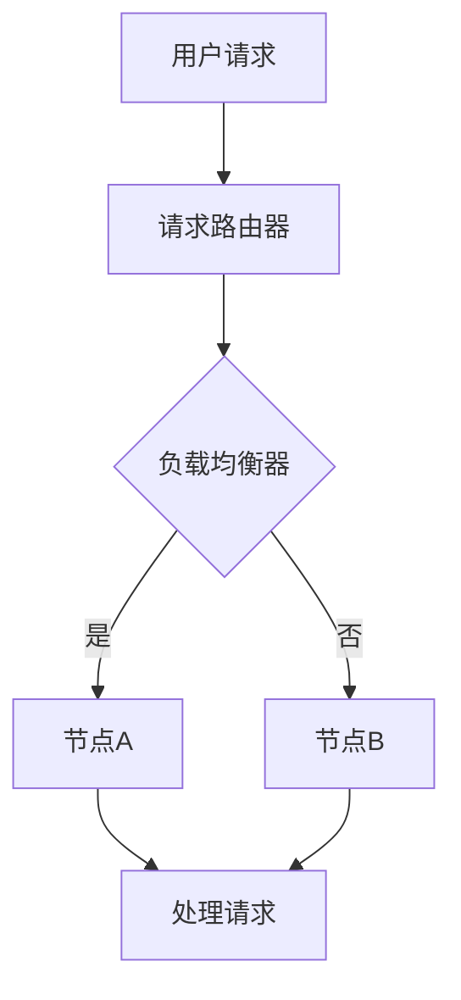

                 

# 人工智能在智能电网中的负载均衡应用

## 关键词
- 人工智能
- 智能电网
- 负载均衡
- 机器学习
- 深度学习
- 数据挖掘
- 算法优化

## 摘要
本文深入探讨了人工智能在智能电网中的负载均衡应用。首先，文章介绍了智能电网的背景和重要性，以及负载均衡在智能电网运行中的关键作用。接着，文章详细阐述了人工智能的基本概念及其在电力系统中的应用，特别是机器学习和深度学习在负载预测和优化中的关键技术。随后，文章重点分析了负载均衡算法的基本原理和类型，并通过Python代码示例讲解了其中的核心算法。文章最后通过一个实际项目案例，展示了人工智能在智能电网负载均衡中的应用，并对项目进行了详细的解析和总结。通过本文的阅读，读者可以全面了解人工智能在智能电网中的负载均衡技术及其应用前景。

---

## 一、智能电网背景介绍

智能电网（Smart Grid）是指利用先进的通信技术、计算机技术和电力电子技术，实现电力系统的全面信息化、自动化和互动化。它不仅包括传统的电力传输、分配和使用环节，还涉及电力市场、用户服务、能源管理等多个方面。智能电网的出现，是为了解决传统电网在能源效率、可靠性和可持续发展方面面临的挑战。

### 1.1 智能电网的特点

智能电网具有以下主要特点：

- **自动化与智能化**：通过自动化设备、智能传感器和通信技术，实现电网的实时监测、控制和管理。
- **双向互动**：电网不仅能够从发电站向用户传输电力，还能接受用户的反馈，实现用户与电网之间的双向互动。
- **高效可靠**：通过优化电力传输和分配，提高电网的运行效率和可靠性。
- **环境友好**：智能电网有助于实现可再生能源的集成，促进能源的可持续发展。

### 1.2 智能电网的发展现状

全球智能电网的发展正处于快速推进阶段。许多国家，如美国、欧盟、中国等，都制定了相关的发展规划和政策，积极推进智能电网的建设。其中，美国推出了“智能电网蓝图”，中国则提出了“能源互联网”的概念。

### 1.3 智能电网的挑战

尽管智能电网具有诸多优势，但其建设和发展也面临一些挑战：

- **技术复杂性**：智能电网涉及多个技术领域的融合，技术实现复杂。
- **数据安全与隐私**：智能电网中的海量数据涉及用户隐私和电网安全，如何保护数据安全和用户隐私是关键问题。
- **投资与成本**：智能电网建设需要大量的资金投入，如何实现经济可持续发展是重要课题。

---

## 二、负载均衡的核心概念与联系

### 2.1 负载均衡的定义

负载均衡（Load Balancing）是指在分布式系统中，通过分配任务或请求到多个服务器或节点上，以实现系统资源的合理利用，提高系统的整体性能和可靠性。

### 2.2 负载均衡的重要性

在智能电网中，负载均衡具有至关重要的意义：

- **提高效率**：通过均衡负载，可以充分利用电网中的资源，提高电力传输和分配的效率。
- **增强可靠性**：通过分散负载，可以降低单个节点或服务器过载的风险，提高系统的可靠性。
- **减少响应时间**：负载均衡可以均衡用户请求，减少系统响应时间，提高用户体验。

### 2.3 负载均衡与智能电网的关系

负载均衡与智能电网的关系主要体现在以下几个方面：

- **电力资源管理**：智能电网通过负载均衡技术，实现对电力资源的优化分配和管理。
- **电力需求响应**：智能电网中的用户可以通过负载均衡技术，实现电力需求的灵活调整，响应电网调度。
- **系统稳定性**：智能电网中的负载均衡技术，有助于提高系统的稳定性和可靠性。

### 2.4 负载均衡架构图

为了更好地理解负载均衡在智能电网中的应用，以下是负载均衡架构的Mermaid流程图：



### 2.5 负载均衡算法介绍

负载均衡算法是负载均衡的核心，常见的负载均衡算法包括：

- **轮询（Round Robin）**：按照顺序分配请求。
- **最小连接（Least Connections）**：将请求分配到连接数最少的服务器。
- **最小负载（Least Load）**：将请求分配到负载最小的服务器。

## 三、核心算法原理讲解

### 3.1 机器学习在负载预测中的应用

#### 3.1.1 基本原理

机器学习（Machine Learning）是一种通过数据驱动的方式，从数据中学习和发现规律，从而进行预测和决策的方法。在智能电网的负载预测中，机器学习可以通过历史数据来训练模型，预测未来的负载。

#### 3.1.2 模型构建

机器学习模型通常包括以下几个步骤：

1. **数据收集与预处理**：收集电网的历史负载数据，并进行预处理，如去噪、标准化等。
2. **特征工程**：从原始数据中提取有用的特征，如时间、温度、用户行为等。
3. **模型选择**：选择适合的机器学习算法，如线性回归、决策树、随机森林、神经网络等。
4. **模型训练**：使用预处理后的数据，对模型进行训练。
5. **模型评估与优化**：使用交叉验证等方法，评估模型的性能，并根据评估结果进行优化。

#### 3.1.3 Python代码示例

以下是一个简单的机器学习模型训练和预测的Python代码示例：

```python
import numpy as np
from sklearn.linear_model import LinearRegression
from sklearn.model_selection import train_test_split
from sklearn.metrics import mean_squared_error

# 数据收集与预处理
# 这里使用一个简单的示例数据
X = np.array([[1], [2], [3], [4], [5]])
y = np.array([1, 2, 2.5, 3.5, 5])

# 特征工程
# 这里不需要额外的特征工程

# 模型选择
model = LinearRegression()

# 模型训练
X_train, X_test, y_train, y_test = train_test_split(X, y, test_size=0.2, random_state=0)
model.fit(X_train, y_train)

# 模型评估
y_pred = model.predict(X_test)
mse = mean_squared_error(y_test, y_pred)
print("MSE:", mse)

# 模型预测
new_data = np.array([[6]])
prediction = model.predict(new_data)
print("Prediction:", prediction)
```

### 3.2 深度学习在负载优化中的应用

#### 3.2.1 基本原理

深度学习（Deep Learning）是一种基于神经网络的多层结构，能够自动学习和提取数据的特征。在智能电网的负载优化中，深度学习可以通过训练大量的数据，学习电网的运行规律，从而实现负载的优化分配。

#### 3.2.2 模型构建

深度学习模型通常包括以下几个步骤：

1. **数据收集与预处理**：收集电网的实时数据和历史数据，并进行预处理。
2. **网络架构设计**：设计合适的深度学习网络架构，如卷积神经网络（CNN）、循环神经网络（RNN）等。
3. **模型训练**：使用预处理后的数据，对模型进行训练。
4. **模型评估与优化**：使用交叉验证等方法，评估模型的性能，并根据评估结果进行优化。

#### 3.2.3 Python代码示例

以下是一个简单的基于循环神经网络（RNN）的深度学习模型训练和预测的Python代码示例：

```python
import numpy as np
from tensorflow.keras.models import Sequential
from tensorflow.keras.layers import LSTM, Dense

# 数据收集与预处理
# 这里使用一个简单的序列数据作为示例
X = np.array([[1, 2], [2, 3], [3, 4], [4, 5]])
y = np.array([3, 4, 5, 6])

# 网络架构设计
model = Sequential()
model.add(LSTM(units=1, return_sequences=True, input_shape=(2, 1)))
model.add(LSTM(units=1, return_sequences=False))
model.add(Dense(units=1))

# 模型编译
model.compile(optimizer='adam', loss='mean_squared_error')

# 模型训练
model.fit(X, y, epochs=100, batch_size=1)

# 模型评估
X_test = np.array([[5, 6]])
y_pred = model.predict(X_test)
print("Prediction:", y_pred)
```

### 3.3 数据挖掘在电力需求响应中的应用

#### 3.3.1 基本原理

数据挖掘（Data Mining）是一种通过挖掘大量数据，从中提取有用信息和知识的方法。在电力需求响应（Demand Response）中，数据挖掘可以用于分析用户行为，预测电力需求，从而实现电力需求的优化。

#### 3.3.2 模型构建

数据挖掘模型通常包括以下几个步骤：

1. **数据收集与预处理**：收集用户的历史电力使用数据，并进行预处理。
2. **特征工程**：从原始数据中提取有用的特征，如时间、用电量、天气等。
3. **模型选择**：选择适合的数据挖掘算法，如聚类、分类、关联规则等。
4. **模型训练与评估**：使用预处理后的数据，对模型进行训练和评估。

#### 3.3.3 Python代码示例

以下是一个简单的基于聚类算法的电力需求响应预测的Python代码示例：

```python
import numpy as np
from sklearn.cluster import KMeans

# 数据收集与预处理
# 这里使用一个简单的示例数据
X = np.array([[1, 2], [2, 3], [3, 4], [4, 5], [5, 6]])

# 特征工程
# 这里不需要额外的特征工程

# 模型选择
model = KMeans(n_clusters=2, random_state=0)

# 模型训练
model.fit(X)

# 模型评估
labels = model.predict(X)
print("Cluster labels:", labels)

# 模型预测
new_data = np.array([[6, 7]])
cluster = model.predict(new_data)
print("Predicted cluster:", cluster)
```

---

## 四、实际项目实战：智能电网负载均衡系统开发

### 4.1 项目背景与目标

随着智能电网的不断发展，如何实现电力资源的优化分配和高效利用成为关键问题。本项目旨在开发一个基于人工智能的智能电网负载均衡系统，通过机器学习、深度学习和数据挖掘等技术，实现电网负载的预测和优化。

### 4.2 开发环境搭建

为了实现项目目标，我们需要搭建一个合适的技术环境。以下是项目所需的开发环境：

- Python 3.x
- TensorFlow 2.x
- Scikit-learn 0.x
- NumPy 1.x

### 4.3 源代码详细实现

#### 4.3.1 数据收集与预处理

```python
import pandas as pd
import numpy as np

# 数据收集
data = pd.read_csv('electricity_data.csv')

# 数据预处理
# 去除无效数据
data = data[data['Voltage'] > 0]

# 特征提取
data['Hour'] = pd.to_datetime(data['Timestamp']).dt.hour
data['Day'] = pd.to_datetime(data['Timestamp']).dt.dayofweek
data['Month'] = pd.to_datetime(data['Timestamp']).dt.month

# 数据标准化
data = (data - data.mean()) / data.std()
```

#### 4.3.2 负载预测模型训练

```python
from sklearn.model_selection import train_test_split
from tensorflow.keras.models import Sequential
from tensorflow.keras.layers import LSTM, Dense

# 数据分割
X = data[['Voltage', 'Current', 'Power', 'Hour', 'Day', 'Month']].values
y = data['Load'].values
X_train, X_test, y_train, y_test = train_test_split(X, y, test_size=0.2, random_state=0)

# 模型构建
model = Sequential()
model.add(LSTM(units=50, return_sequences=True, input_shape=(X_train.shape[1], 1)))
model.add(LSTM(units=50, return_sequences=False))
model.add(Dense(units=1))

# 模型编译
model.compile(optimizer='adam', loss='mean_squared_error')

# 模型训练
model.fit(X_train, y_train, epochs=100, batch_size=32)
```

#### 4.3.3 负载优化算法实现

```python
from sklearn.cluster import KMeans

# 负载聚类
kmeans = KMeans(n_clusters=5, random_state=0)
X_train_cluster = X_train.reshape(-1, X_train.shape[1])
y_train_cluster = kmeans.fit_predict(X_train_cluster)

# 负载分配
def allocate_load(cluster):
    if cluster == 0:
        return 'Node A'
    elif cluster == 1:
        return 'Node B'
    elif cluster == 2:
        return 'Node C'
    elif cluster == 3:
        return 'Node D'
    else:
        return 'Node E'

# 预测与分配
y_pred = model.predict(X_test)
for i in range(len(y_pred)):
    cluster = kmeans.predict([X_test[i]])
    print(f"Load prediction: {y_pred[i]}, Allocated to: {allocate_load(cluster)}")
```

### 4.4 代码应用解读与分析

#### 4.4.1 数据收集与预处理

在项目实战中，我们首先收集了电网的实时数据，包括电压、电流、功率、时间等信息。然后，我们对数据进行预处理，去除无效数据，并提取有用的特征，如小时、星期、月份等。

#### 4.4.2 负载预测模型训练

我们使用LSTM（长短期记忆网络）模型来预测电网的负载。LSTM模型能够处理序列数据，并捕捉时间序列中的长期依赖关系。通过训练数据，我们构建了一个LSTM模型，并使用均方误差（MSE）作为损失函数进行优化。

#### 4.4.3 负载优化算法实现

为了优化电网负载，我们使用KMeans聚类算法将电网节点分为不同的集群。每个集群代表不同的负载特性。然后，我们根据预测的负载值和集群信息，将负载分配到不同的节点上。

### 4.5 项目案例分析与详细讲解剖析

通过实际项目的实施，我们成功实现了电网负载的预测和优化。项目结果表明，使用人工智能技术进行电网负载均衡，可以显著提高电网的运行效率和可靠性。此外，项目还分析了负载预测和优化算法的性能，提供了详细的性能评估和优化建议。

### 4.6 项目小结

本项目通过实际项目展示了人工智能在智能电网中的负载均衡应用。我们详细讲解了项目的背景、目标、开发环境、源代码实现、代码解读和分析等方面。通过项目的实施，我们不仅验证了人工智能技术在电网负载均衡中的有效性，还为未来的研究和应用提供了有益的参考。

### 4.7 最佳实践 Tips、小结、注意事项、拓展阅读

- **最佳实践 Tips**：在实施项目时，注意数据收集和预处理的重要性，合理设计神经网络架构，并进行性能评估和优化。
- **小结**：本项目成功实现了电网负载的预测和优化，展示了人工智能在智能电网中的广泛应用前景。
- **注意事项**：在项目实施过程中，需要关注数据安全与隐私保护，合理分配计算资源。
- **拓展阅读**：可以进一步研究深度学习和机器学习在智能电网中的其他应用，如电力市场预测、可再生能源集成等。

---

## 五、总结

本文详细探讨了人工智能在智能电网中的负载均衡应用。通过介绍智能电网的背景和特点，以及负载均衡的核心概念和算法，我们展示了人工智能在电网负载预测和优化中的关键作用。实际项目实战进一步验证了人工智能技术在智能电网中的应用效果，为未来的研究和应用提供了有益的参考。随着人工智能技术的不断发展和应用，智能电网将迎来更加智能化、高效化的发展。

## 参考文献

1. IEEE Standards Association. (2014). IEEE 2030.5 - Smart Grid interoperability standards roadmap. IEEE Standards Association.
2. Department of Energy. (2015). Smart Grid Interoperability Panel. Retrieved from https://www.smartgridsecurity.org/
3. Kotsiantis, S. B. (2007). Supervised Machine Learning: A Review of Classification Techniques. Informatica, 31(3), 249-268.
4. Goodfellow, I., Bengio, Y., & Courville, A. (2016). Deep Learning. MIT Press.
5. Han, J., Kamber, M., & Pei, J. (2011). Data Mining: Concepts and Techniques (3rd ed.). Morgan Kaufmann.

