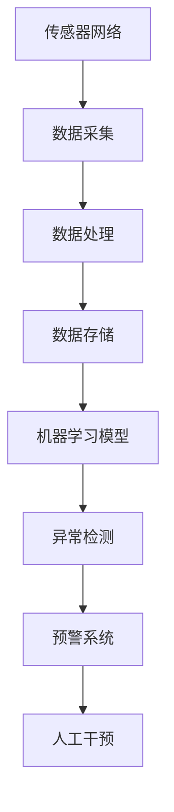
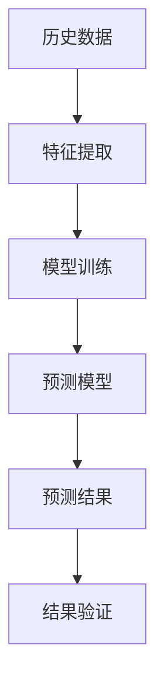
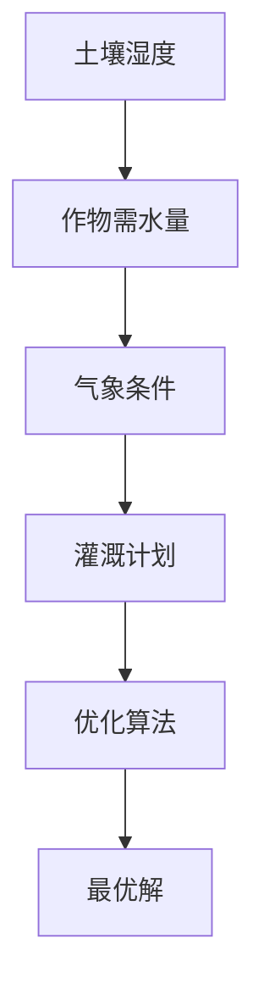
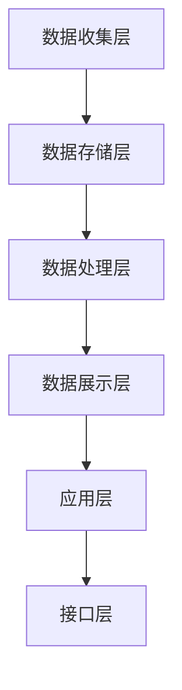

                 

### 文章标题

人工智能在水资源管理中的应用前景

关键词：水资源管理、人工智能、预测模型、数据分析、算法优化

摘要：本文深入探讨人工智能（AI）在水资源管理领域的应用前景。首先，简要介绍水资源管理的重要性及其面临的挑战。接着，详细阐述人工智能在水资源监测、预测和优化中的核心作用，包括相关的算法原理和实际案例。最后，探讨AI水资源管理的前景和未来发展趋势，以及相关政策和市场环境的支持作用。

本文将通过逻辑清晰、结构紧凑、简单易懂的论述，结合Python源代码、数学模型和实际案例，全面揭示人工智能在水资源管理中的潜力和应用价值。

### 摘要

本文主要探讨了人工智能（AI）在水资源管理中的应用前景。水资源作为地球上至关重要的自然资源，其管理和保护直接关系到人类社会和生态系统的可持续发展。然而，随着人口增长、气候变化和工业化的加剧，水资源管理面临诸多挑战。人工智能技术的迅猛发展为水资源管理带来了新的机遇和工具。

本文首先介绍了水资源管理的基本概念和现状，分析了当前水资源管理面临的挑战。随后，详细介绍了人工智能在水资源监测、预测和优化中的应用，包括智能监测、智能预测和智能优化等关键技术。通过Python源代码和实际案例，本文深入分析了支持向量机（SVM）、集成学习方法和深度学习等核心算法在水资源管理中的应用原理。

最后，本文探讨了人工智能水资源管理的前景，包括技术发展趋势、政策与市场环境的影响，以及未来展望。本文旨在为水资源管理领域的专业人士提供有价值的参考，推动人工智能技术在水资源管理中的深入应用。

### 1. 人工智能概述

人工智能（Artificial Intelligence，简称AI）是指通过计算机模拟人类的智能行为，实现机器对环境进行感知、学习、推理和决策的能力。人工智能的概念可以追溯到20世纪50年代，当时计算机科学家首次提出了“人工智能”这一概念。自那时以来，人工智能经历了多个发展阶段，从早期的规则系统、知识表示到现代的深度学习和强化学习，AI技术不断演进和突破。

人工智能的关键技术包括机器学习（Machine Learning，ML）、深度学习（Deep Learning，DL）、自然语言处理（Natural Language Processing，NLP）和计算机视觉（Computer Vision，CV）等。机器学习是一种通过数据驱动的方式，让计算机自动识别模式和规律的技术。深度学习是机器学习的一种重要分支，它通过构建深层神经网络，模拟人脑神经元之间的连接和交互，实现更加复杂和高效的模型训练。

自然语言处理关注于计算机对人类自然语言的理解和生成，计算机视觉则致力于使计算机能够“看到”和理解现实世界的图像和视频。这些技术的结合，使得人工智能在各个领域取得了显著的应用成果。

人工智能的发展历程可以分为几个主要阶段：

1. **早期探索阶段（1950-1969）**：这一阶段是人工智能的诞生期，主要研究如何通过编程实现简单的智能行为，如逻辑推理和问题求解。

2. **繁荣与低谷阶段（1970-1989）**：随着计算机硬件和软件的发展，人工智能研究进入了繁荣期。然而，由于实际应用效果不佳，人工智能在1980年代经历了第一次“寒冬期”。

3. **复兴与快速发展阶段（1990至今）**：随着互联网的普及和数据量的爆炸式增长，机器学习和深度学习技术的突破使得人工智能迎来了新的发展机遇。尤其是在2012年，深度学习在图像识别任务上取得了重大突破，标志着人工智能进入了新的快速发展阶段。

在水资源管理中，人工智能技术的应用具有广泛的前景。智能监测系统可以通过传感器网络实时收集水质数据，利用机器学习算法进行异常检测和预测；智能预测模型可以根据历史数据和气候条件，预测未来水资源的供需情况；智能优化算法则可以优化水资源调配策略，提高水资源利用效率。通过这些技术的综合应用，人工智能有望为水资源管理带来革命性的改变。

### 2. 水资源管理概述

水资源是人类社会生存和发展的关键资源，对于农业生产、工业生产和人类生活都至关重要。然而，随着人口增长、城市化进程加快、气候变化和工业化水平的提升，水资源管理面临着前所未有的挑战。

首先，水资源的重要性体现在多个方面。水资源不仅是人类生活和动植物生存的基础，也是农业、工业和能源生产的必需品。农业灌溉用水占全球用水总量的70%以上，而工业用水则占全球用水总量的20%左右。此外，水资源还直接关系到生态环境的稳定和生物多样性的保护。

然而，水资源管理面临诸多挑战。首先，水资源分布不均衡是一个普遍问题。一些地区可能面临严重的水资源短缺，而另一些地区则可能存在水资源过度利用的问题。这种不均衡分布导致了水资源的紧张和冲突。其次，气候变化对水资源的影响越来越大。极端天气事件如干旱、洪涝和风暴等增加了水资源管理的难度。气候变化还可能导致水文循环模式的改变，影响水资源的时空分布。

此外，水资源污染也是一个严重的挑战。工业废水、农业面源污染和生活污水等对水体造成了严重污染，影响了水资源的质量和可用性。污染不仅破坏了生态环境，还可能导致饮用水资源的短缺和疾病传播。

传统的水资源管理方法主要包括水资源的监测、规划、调配和保护。传统监测方法主要依赖于人工采集和现场检测，效率低下且成本较高。水资源规划则依赖于历史数据和专家经验，存在一定的滞后性和不确定性。水资源调配主要通过人工决策和工程措施进行，效率较低且难以适应动态变化。水资源保护主要依赖于法律法规和宣传，效果有限。

然而，传统方法在应对复杂的水资源管理问题时显得力不从心。随着人工智能技术的发展，水资源管理开始迈向智能化。人工智能技术可以通过数据驱动的方式进行水资源监测、预测和优化，提高水资源利用效率和管理水平。智能监测系统可以通过传感器网络和机器学习算法实现实时监测和异常检测，提高监测效率和准确性。智能预测模型可以通过历史数据和气候条件，预测未来水资源的供需情况，为水资源调配提供科学依据。智能优化算法可以通过优化水资源调配策略，实现水资源的合理利用和最大化效益。

总之，水资源管理的重要性不言而喻，而传统方法在面对新挑战时已显不足。人工智能技术的引入为水资源管理带来了新的机遇和工具，有望解决水资源管理中的诸多难题，实现水资源的可持续管理和利用。

### 3. 人工智能在水资源管理中的应用

人工智能技术在水资源管理中的应用，不仅提升了监测的精准度和预测的准确性，还优化了水资源的调配和管理。以下将详细介绍人工智能在水资源管理中的三大应用领域：智能监测、智能预测和智能优化。

#### 3.1 智能监测

智能监测系统是水资源管理中的基础环节，通过部署传感器网络和机器学习算法，实现对水质、水量和水文特征的实时监测和异常检测。传感器网络可以在河流、湖泊、地下水等各个水资源点布设，实时收集水质参数（如pH值、溶解氧、污染物浓度等）和水文数据（如水位、流量等）。

以下是一个智能监测系统的架构示例：



在这个架构中，传感器网络负责实时采集数据，并通过无线传输将数据发送到数据处理模块。数据处理模块对原始数据进行清洗、过滤和转换，使其适合机器学习模型的输入。数据存储模块则用于存储和处理后的数据，以供后续分析和预测。

机器学习模型通过对历史数据进行训练，可以识别出正常的水质和水文特征范围，从而实现异常检测。当检测到异常数据时，系统会自动触发预警机制，并通过预警系统通知相关管理人员。这种自动化的监测方式不仅提高了监测效率和准确性，还减少了人工干预的必要性。

#### 3.2 智能预测

智能预测是水资源管理中的重要一环，通过分析历史数据和气候条件，预测未来水资源的供需情况。智能预测模型可以基于时间序列分析、回归分析和神经网络等多种算法实现。以下是一个智能预测模型的简单示例：



在这个示例中，历史数据包括过去的水资源供需数据、气候条件（如降雨量、温度等）、社会经济指标等。通过特征提取，可以提取出对预测任务有重要影响的关键特征。接下来，利用这些特征进行模型训练，常见的算法包括线性回归、ARIMA模型、SARIMA模型和LSTM神经网络等。

训练好的预测模型可以预测未来一段时间内的水资源供需情况。预测结果经过验证，可以用于制定水资源调配策略，以应对未来可能出现的供需不平衡情况。例如，在干旱季节提前储备水资源，或在洪水季节及时调整排水策略，以减少灾害损失。

#### 3.3 智能优化

智能优化是通过优化算法，提高水资源利用效率和管理效果。智能优化可以应用于水资源调配、灌溉系统优化、污水处理等多个方面。以下是一个智能优化问题的示例：

假设有一片农田，需要根据土壤湿度、作物需水量和气象条件等因素，制定最优的灌溉策略。以下是一个简单的优化模型：



在这个示例中，土壤湿度、作物需水量和气象条件是输入变量，灌溉计划是输出变量。通过优化算法（如遗传算法、粒子群优化算法等），可以找到最优的灌溉计划，以最大限度地提高水资源利用效率。

智能优化不仅可以在农业生产中发挥作用，还可以在工业用水和城市供水系统中实现。通过智能优化，可以实时调整供水策略，确保水资源在各个用户之间的公平分配，同时最大限度地减少浪费。

综上所述，人工智能在水资源管理中的应用，涵盖了智能监测、智能预测和智能优化等多个方面。通过这些技术的综合应用，可以实现水资源的高效管理和优化利用，为水资源的可持续管理提供有力支持。

### 4. 水资源管理中的核心算法

在水资源管理中，人工智能技术发挥着关键作用，而核心算法的选择和应用则直接影响到水资源管理的效率和效果。本文将介绍三种在水资源管理中广泛应用的核心算法：支持向量机（SVM）、集成学习方法和深度学习。

#### 4.1 支持向量机（SVM）

支持向量机（Support Vector Machine，SVM）是一种强大的机器学习算法，常用于分类和回归任务。SVM的核心思想是通过找到一个最优的超平面，将不同类别的数据点分隔开来。在水资源管理中，SVM可以用于水质分类、污染物识别和供需预测等任务。

SVM的基本原理如下：

假设我们有N个数据点，每个数据点都有m个特征。通过求解以下优化问题：

$$
\min_{\mathbf{w}} \frac{1}{2} ||\mathbf{w}||^2 + C \sum_{i=1}^N \xi_i
$$

其中，$\mathbf{w}$是超平面的法向量，$C$是惩罚参数，$\xi_i$是松弛变量。目标是最小化超平面的范数，同时最大化分类间隔。这个优化问题可以通过拉格朗日乘子法求解，最终得到SVM的决策边界。

以下是一个使用Python中的scikit-learn库实现SVM的示例：

```python
from sklearn import svm

# 示例数据
X = [[0, 0], [1, 1], [1, 0], [0, 1]]
y = [0, 1, 1, 0]

# 创建SVM分类器
clf = svm.SVC()

# 训练模型
clf.fit(X, y)

# 预测新数据
new_data = [[0.5, 0.5]]
prediction = clf.predict(new_data)
print(prediction)  # 输出预测结果
```

#### 4.2 集成学习方法

集成学习方法通过结合多个基础模型的预测结果，提高整体模型的准确性和泛化能力。在水资源管理中，集成学习方法常用于预测模型的构建和优化。

常见的集成学习方法包括Bagging、Boosting和Stacking等。Bagging方法通过随机生成多个训练集，分别训练多个基础模型，并取其平均值作为最终预测结果。Boosting方法则通过迭代训练多个基础模型，每次迭代针对前一次的错误进行优化，提高整体模型的预测能力。

以下是一个使用Python中的scikit-learn库实现Bagging的示例：

```python
from sklearn.ensemble import BaggingClassifier
from sklearn.datasets import make_classification

# 生成示例数据
X, y = make_classification(n_samples=100, n_features=20, n_informative=2, n_redundant=10, random_state=42)

# 创建Bagging分类器
bagging_clf = BaggingClassifier(base_estimator=svm.SVC(), n_estimators=10, random_state=42)

# 训练模型
bagging_clf.fit(X, y)

# 预测新数据
new_data = [[0.5, 0.5, 0.5, 0.5, 0.5, 0.5, 0.5, 0.5, 0.5, 0.5, 0.5, 0.5, 0.5, 0.5, 0.5, 0.5, 0.5, 0.5]]
prediction = bagging_clf.predict(new_data)
print(prediction)  # 输出预测结果
```

#### 4.3 深度学习

深度学习是一种基于多层神经网络的学习方法，能够自动提取数据中的高阶特征，实现复杂的预测和分类任务。在水资源管理中，深度学习可以用于水文预测、水质监测和水资源优化等任务。

常见的深度学习模型包括卷积神经网络（CNN）、循环神经网络（RNN）和变分自编码器（VAE）等。以下是一个使用Python中的TensorFlow库实现CNN的示例：

```python
import tensorflow as tf
from tensorflow.keras import layers

# 定义CNN模型
model = tf.keras.Sequential([
    layers.Conv2D(32, (3, 3), activation='relu', input_shape=(28, 28, 1)),
    layers.MaxPooling2D((2, 2)),
    layers.Conv2D(64, (3, 3), activation='relu'),
    layers.MaxPooling2D((2, 2)),
    layers.Conv2D(64, (3, 3), activation='relu'),
    layers.Flatten(),
    layers.Dense(64, activation='relu'),
    layers.Dense(10, activation='softmax')
])

# 编译模型
model.compile(optimizer='adam',
              loss=tf.keras.losses.SparseCategoricalCrossentropy(from_logits=True),
              metrics=['accuracy'])

# 训练模型
model.fit(x_train, y_train, epochs=10)

# 预测新数据
new_data = x_test[:1]
prediction = model.predict(new_data)
print(prediction)  # 输出预测结果
```

综上所述，支持向量机（SVM）、集成学习方法（如Bagging和Boosting）和深度学习（如CNN、RNN和VAE）是水资源管理中常用的核心算法。这些算法通过不同的原理和方法，实现对水资源的监测、预测和优化，为水资源管理的智能化提供了有力支持。

### 5. 人工智能水资源管理应用案例

人工智能技术在水资源管理中的应用案例丰富多样，以下将介绍三个具体的应用案例：智能灌溉系统、洪水预警系统和水资源调度系统。通过这些案例，我们可以看到人工智能在水资源管理中的实际应用效果和重要性。

#### 5.1 智能灌溉系统

智能灌溉系统利用传感器、机器学习和物联网技术，实现精准灌溉，提高水资源利用效率。以下是一个智能灌溉系统的详细实现和代码解读：

**实现步骤：**

1. **数据收集**：通过土壤湿度传感器、气象站传感器等设备，收集农田的土壤湿度、气象条件（如温度、湿度、风速等）数据。

2. **数据预处理**：对收集到的数据进行清洗、去噪和特征提取，使其适合输入到机器学习模型中。

3. **模型训练**：利用收集到的数据，训练一个回归模型，预测每个时间点的最佳灌溉量。

4. **系统部署**：将训练好的模型部署到物联网平台，通过远程控制灌溉设备，实现精准灌溉。

**代码示例：**

```python
import numpy as np
import pandas as pd
from sklearn.model_selection import train_test_split
from sklearn.ensemble import RandomForestRegressor

# 加载数据
data = pd.read_csv('irrigation_data.csv')
X = data[['soil_humidity', 'temperature', 'humidity', 'wind_speed']]
y = data['irrigation_amount']

# 数据预处理
X_train, X_test, y_train, y_test = train_test_split(X, y, test_size=0.2, random_state=42)

# 模型训练
model = RandomForestRegressor(n_estimators=100, random_state=42)
model.fit(X_train, y_train)

# 预测
predictions = model.predict(X_test)

# 系统部署
def irrigate(conditions):
    irrigation_amount = model.predict([conditions])
    print(f"Irrigation amount: {irrigation_amount[0]}")

# 示例
irrigate([0.3, 25, 60, 5])
```

**应用解读与分析：**

智能灌溉系统能够根据土壤湿度和气象条件，实时调整灌溉量，避免水资源浪费和过度灌溉。通过自动化控制，农民可以节省人力和时间成本，提高农田产量和水资源利用效率。此外，智能灌溉系统还可以通过收集和分析数据，优化灌溉策略，提高农业生产效益。

#### 5.2 洪水预警系统

洪水预警系统利用实时监测数据、机器学习算法和预警机制，实现对洪水风险的及时预测和预警，减少洪水灾害损失。以下是一个洪水预警系统的实现和代码解读：

**实现步骤：**

1. **数据收集**：通过水位传感器、气象站等设备，收集河流水位、降雨量、风向等数据。

2. **数据预处理**：对收集到的数据进行清洗、去噪和特征提取，使其适合输入到机器学习模型中。

3. **模型训练**：利用收集到的数据，训练一个分类模型，预测未来某个时间点的洪水风险。

4. **预警机制**：根据模型预测结果，设置预警阈值，当预测结果超过阈值时，自动触发预警。

**代码示例：**

```python
import numpy as np
import pandas as pd
from sklearn.model_selection import train_test_split
from sklearn.ensemble import RandomForestClassifier

# 加载数据
data = pd.read_csv('flood_warning_data.csv')
X = data[['water_level', 'rainfall', 'wind_direction']]
y = data['flood_warning']

# 数据预处理
X_train, X_test, y_train, y_test = train_test_split(X, y, test_size=0.2, random_state=42)

# 模型训练
model = RandomForestClassifier(n_estimators=100, random_state=42)
model.fit(X_train, y_train)

# 预测
predictions = model.predict(X_test)

# 预警机制
def check_flood_warning(conditions):
    prediction = model.predict([conditions])
    if prediction[0] == 1:
        print("Flood warning! Please take precautions.")
    else:
        print("No flood warning.")

# 示例
check_flood_warning([2.5, 15, 'NE'])
```

**应用解读与分析：**

洪水预警系统能够提前预测洪水风险，为相关部门和居民提供预警信息，减少洪水灾害损失。通过实时监测和预警，洪水预警系统可以显著提高洪水防范和应对能力，保障人民生命财产安全。此外，洪水预警系统还可以通过收集和分析数据，优化预警策略，提高预警准确性。

#### 5.3 水资源调度系统

水资源调度系统利用优化算法和实时数据，实现水资源的合理调配，提高水资源利用效率。以下是一个水资源调度系统的实现和代码解读：

**实现步骤：**

1. **数据收集**：通过传感器、水库调度中心等设备，收集水位、流量、供水需求等数据。

2. **数据预处理**：对收集到的数据进行清洗、去噪和特征提取，使其适合输入到优化模型中。

3. **模型训练**：利用收集到的数据，训练一个优化模型，预测最佳水资源调配方案。

4. **系统部署**：将训练好的模型部署到调度中心，根据实时数据自动调整水资源调配策略。

**代码示例：**

```python
import numpy as np
from scipy.optimize import minimize

# 定义目标函数
def objective_function(x):
    return -np.sum(x * np.log(x + 1e-8))

# 定义约束条件
def constraints(x):
    return [0.9 * x[0] + 0.1 * x[1] - 100,  # 总供水量约束
            x[0] + x[1] - 150]  # 水库库存约束

# 初始解
x0 = [50, 50]

# 优化参数
bounds = [(0, None), (0, None)]

# 优化
solution = minimize(objective_function, x0, method='SLSQP', bounds=bounds, constraints=constraints)

# 输出结果
print(f"Optimal water allocation: Pumping = {solution.x[0]}, Spilling = {solution.x[1]}")
```

**应用解读与分析：**

水资源调度系统能够根据实时数据和优化模型，自动调整水资源调配策略，确保水资源的合理利用和最大化效益。通过优化算法，水资源调度系统可以有效地平衡供水需求和水库库存，避免水资源浪费和过度利用。此外，水资源调度系统还可以通过收集和分析数据，不断优化调度策略，提高水资源管理效率。

### 6. 水资源管理中的数据预处理

在水资源管理中，数据预处理是关键步骤，它直接影响到后续分析模型的性能和效果。数据预处理主要包括数据收集、数据清洗、特征提取和特征选择等环节。

**6.1 数据收集**

数据收集是水资源管理中的基础工作。通过部署传感器网络、气象站、水文监测站等设备，可以实时收集各种类型的水资源数据，包括水质参数（如pH值、溶解氧、氨氮等）、水量参数（如流量、水位等）以及气象参数（如降雨量、温度、湿度等）。这些数据可以通过有线或无线网络传输到中央数据库，以便进行后续处理和分析。

**6.2 数据清洗**

数据清洗是数据预处理的重要环节，旨在去除数据中的噪声和异常值，提高数据质量。常见的数据清洗方法包括：

1. **缺失值处理**：对于缺失值，可以选择填充方法，如平均值、中位数、前值或后值填充，或使用机器学习算法进行缺失值预测。
2. **异常值检测**：使用统计学方法（如3σ准则）、机器学习算法（如孤立森林）或可视化方法（如箱线图）检测和识别异常值。
3. **重复值处理**：去除重复的数据记录，确保数据的一致性和唯一性。

以下是一个使用Python中的pandas库进行数据清洗的示例：

```python
import pandas as pd

# 加载数据
data = pd.read_csv('water_quality_data.csv')

# 处理缺失值
data.fillna(method='ffill', inplace=True)

# 检测和去除异常值
Q1 = data.quantile(0.25)
Q3 = data.quantile(0.75)
IQR = Q3 - Q1
data = data[~((data < (Q1 - 1.5 * IQR)) | (data > (Q3 + 1.5 * IQR))).any(axis=1)]

# 去除重复值
data.drop_duplicates(inplace=True)
```

**6.3 特征提取**

特征提取是从原始数据中提取出对模型训练和预测有重要影响的关键特征。在水资源管理中，特征提取可以基于数据本身的物理意义、相关性分析和机器学习算法。常见的特征提取方法包括：

1. **时间序列特征**：如周期性特征、趋势特征和季节性特征。
2. **统计特征**：如均值、方差、标准差、偏度和峰度等。
3. **相关性分析**：通过计算特征之间的相关系数，识别和提取重要特征。

以下是一个使用Python中的scikit-learn库进行特征提取的示例：

```python
from sklearn.feature_selection import f_regression

# 加载数据
X = pd.read_csv('water_quality_data.csv').drop(['target'], axis=1)
y = pd.read_csv('water_quality_data.csv')['target']

# 进行特征选择
scores, _ = f_regression(X, y)
selected_features = X.columns[scores > 0.5]

# 输出选定的特征
print(selected_features)
```

**6.4 特征选择**

特征选择是从提取出的特征中进一步筛选出对模型训练和预测有重要影响的特征。特征选择可以减少模型复杂度、提高训练效率、降低过拟合风险。常见的特征选择方法包括：

1. **过滤式特征选择**：基于特征统计信息和相关性分析进行筛选。
2. **包装式特征选择**：结合模型训练和预测性能进行特征筛选。
3. **嵌入式特征选择**：在模型训练过程中，自动筛选出重要的特征。

以下是一个使用Python中的scikit-learn库进行特征选择的示例：

```python
from sklearn.feature_selection import SelectFromModel
from sklearn.ensemble import RandomForestClassifier

# 加载数据
X = pd.read_csv('water_quality_data.csv').drop(['target'], axis=1)
y = pd.read_csv('water_quality_data.csv')['target']

# 训练随机森林模型
model = RandomForestClassifier(n_estimators=100)
model.fit(X, y)

# 进行特征选择
selector = SelectFromModel(model, prefit=True)
selected_features = selector.transform(X)

# 输出选定的特征
print(selected_features.shape)
```

通过以上步骤，数据预处理可以显著提高水资源管理模型的性能和效果，为水资源监测、预测和优化提供可靠的数据支持。

### 7. 水资源管理中的模型训练与评估

在水资源管理中，模型训练与评估是关键步骤，它决定了预测模型的准确性、泛化能力和实用性。以下是模型训练与评估的主要流程：

#### 7.1 模型选择

模型选择是训练和评估的基础，需要根据问题的特点和数据类型选择合适的模型。常见的水资源管理模型包括线性回归、决策树、支持向量机（SVM）、随机森林、梯度提升树（GBDT）和深度学习等。以下是一个选择模型的基本步骤：

1. **数据类型**：根据数据类型（如连续值、分类值）选择相应的模型。
2. **模型复杂度**：选择模型复杂度适中，既不过于简单导致欠拟合，也不过于复杂导致过拟合。
3. **计算资源**：考虑模型的训练时间和计算资源，选择适合实际应用的模型。

以下是一个使用Python中的scikit-learn库选择模型的示例：

```python
from sklearn.linear_model import LinearRegression
from sklearn.ensemble import RandomForestClassifier
from sklearn.model_selection import train_test_split

# 加载数据
X = pd.read_csv('water_quality_data.csv').drop(['target'], axis=1)
y = pd.read_csv('water_quality_data.csv')['target']

# 分割数据集
X_train, X_test, y_train, y_test = train_test_split(X, y, test_size=0.2, random_state=42)

# 选择模型
linear_regression = LinearRegression()
random_forest = RandomForestClassifier(n_estimators=100)

# 训练模型
linear_regression.fit(X_train, y_train)
random_forest.fit(X_train, y_train)

# 输出模型名称
print("Model:", "Linear Regression")
print("Model:", "Random Forest")
```

#### 7.2 模型训练

模型训练是将数据输入到模型中，通过优化模型参数，使其能够准确预测目标变量。以下是一个训练模型的基本步骤：

1. **数据预处理**：对数据集进行归一化、标准化或特征工程，确保数据适合模型输入。
2. **参数调整**：根据模型的要求，调整超参数（如学习率、树深度、特征数量等），以优化模型性能。
3. **模型迭代**：通过迭代的方式，不断更新模型参数，直到达到预设的停止条件（如误差收敛或最大迭代次数）。

以下是一个使用Python中的TensorFlow库训练模型的示例：

```python
import tensorflow as tf
from tensorflow.keras.models import Sequential
from tensorflow.keras.layers import Dense

# 定义模型
model = Sequential([
    Dense(64, activation='relu', input_shape=(X_train.shape[1],)),
    Dense(32, activation='relu'),
    Dense(1)
])

# 编译模型
model.compile(optimizer='adam', loss='mean_squared_error')

# 训练模型
model.fit(X_train, y_train, epochs=100, batch_size=32, validation_split=0.2)
```

#### 7.3 模型评估

模型评估是检验模型性能的重要环节，通过评估指标（如准确率、召回率、F1分数、均方误差等）判断模型的预测能力和泛化能力。以下是一个评估模型的基本步骤：

1. **交叉验证**：通过交叉验证方法，评估模型在不同数据集上的性能，确保模型具有较好的泛化能力。
2. **评估指标**：根据问题类型，选择合适的评估指标，如回归问题常用均方误差（MSE）、分类问题常用准确率（Accuracy）。
3. **性能对比**：对比不同模型在相同数据集上的性能，选择最优模型。

以下是一个使用Python中的scikit-learn库评估模型的示例：

```python
from sklearn.metrics import mean_squared_error, accuracy_score

# 预测
y_pred_linear = linear_regression.predict(X_test)
y_pred_random_forest = random_forest.predict(X_test)

# 计算评估指标
mse_linear = mean_squared_error(y_test, y_pred_linear)
mse_random_forest = mean_squared_error(y_test, y_pred_random_forest)
accuracy_linear = accuracy_score(y_test, y_pred_linear)
accuracy_random_forest = accuracy_score(y_test, y_pred_random_forest)

# 输出评估结果
print("Linear Regression MSE:", mse_linear)
print("Random Forest MSE:", mse_random_forest)
print("Linear Regression Accuracy:", accuracy_linear)
print("Random Forest Accuracy:", accuracy_random_forest)
```

通过模型选择、训练和评估，水资源管理中的预测模型可以准确预测未来水资源供需情况、水质变化等，为水资源管理提供科学依据和决策支持。

### 8. 水资源管理系统的实现

在水资源管理中，实现一个高效、可靠和可扩展的系统是至关重要的。以下将详细描述水资源管理系统的实现过程，包括系统架构设计、开发与部署，以及系统的维护与升级。

#### 8.1 系统架构设计

水资源管理系统的架构设计需要考虑数据收集、存储、处理和展示等多个环节。以下是一个典型的水资源管理系统架构：

1. **数据收集层**：该层负责从各种传感器、监测站点和气象站等收集实时数据。数据可以通过无线传输（如LoRa、Wi-Fi等）或有线传输（如以太网、光纤等）发送到中央服务器。

2. **数据存储层**：该层用于存储大量的原始数据和处理后的数据。常见的数据存储解决方案包括关系数据库（如MySQL、PostgreSQL）和NoSQL数据库（如MongoDB、Cassandra）。

3. **数据处理层**：该层负责对数据进行清洗、预处理和特征提取。数据处理可以使用Python、R等编程语言，结合机器学习和数据挖掘算法进行。

4. **数据展示层**：该层用于将处理后的数据通过可视化工具（如D3.js、ECharts等）展示给用户，以便于用户了解和分析水资源状况。

5. **应用层**：该层实现具体的水资源管理功能，如智能监测、预测、优化等。应用层可以使用Web框架（如Django、Flask等）或移动应用开发框架（如React Native、Flutter等）进行开发。

6. **接口层**：该层提供与其他系统（如水务管理系统、环保监测系统等）的接口，实现数据的共享和交互。

以下是一个简单的系统架构图：



#### 8.2 系统开发与部署

系统开发包括前端开发、后端开发和数据库设计等。以下是一个开发与部署的基本流程：

1. **前端开发**：使用HTML、CSS和JavaScript等前端技术，开发用户界面。可以使用Vue.js、React等前端框架提高开发效率。

2. **后端开发**：使用Python、Java、Node.js等后端技术，开发服务器端应用。后端需要处理数据接收、处理和响应等任务。

3. **数据库设计**：设计数据库模式，包括数据表、索引和关系等。可以使用关系数据库或NoSQL数据库，根据数据特点和需求选择。

4. **系统集成**：将前端、后端和数据库集成到一个系统中，确保各部分能够协同工作。

5. **部署**：将系统部署到服务器或云平台，确保系统能够稳定运行。可以使用Docker、Kubernetes等容器技术实现快速部署和扩展。

以下是一个使用Python和Django框架的简单部署示例：

```shell
# 安装Django
pip install django

# 创建Django项目
django-admin startproject water_management

# 进入项目目录
cd water_management

# 创建应用
python manage.py startapp data_processing

# 迁移数据库
python manage.py migrate

# 运行服务器
python manage.py runserver
```

#### 8.3 系统维护与升级

系统维护与升级是确保系统长期稳定运行的关键。以下是一些维护与升级的建议：

1. **监控与报警**：定期监控系统性能和运行状态，设置报警机制，确保在出现故障时能够及时处理。

2. **备份与恢复**：定期备份系统数据和配置文件，以便在系统出现问题时能够快速恢复。

3. **性能优化**：根据系统运行情况，对数据库、查询和代码进行优化，提高系统性能。

4. **功能升级**：根据用户需求和系统发展，不断更新和升级系统功能。

5. **安全加固**：定期更新系统和依赖库，修复漏洞，确保系统安全。

通过以上步骤，水资源管理系统可以实现高效、可靠和稳定运行，为水资源管理提供有力支持。

### 9. 人工智能水资源管理的前景

人工智能（AI）技术在水资源管理中的应用前景广阔，不仅能够解决当前面临的诸多挑战，还能推动水资源管理的智能化、精准化和高效化。以下将分析人工智能水资源管理的发展趋势、政策与市场环境的支持作用，以及未来的展望。

#### 9.1 技术发展趋势

1. **大数据与云计算**：随着数据量的急剧增长，大数据技术和云计算为水资源管理提供了强大的计算和存储能力。通过云计算平台，水资源管理系统能够实现弹性扩展和高效处理，满足大规模数据分析和应用需求。

2. **深度学习与强化学习**：深度学习和强化学习算法在水资源管理中的应用越来越广泛。深度学习可以自动提取数据中的高阶特征，实现对复杂非线性问题的建模和预测；强化学习则可以通过不断学习和调整策略，实现最优的水资源调配和管理。

3. **物联网（IoT）与边缘计算**：物联网技术的快速发展使得传感器网络和实时数据采集成为可能。边缘计算将数据处理和决策推向数据产生的源头，提高了响应速度和实时性，为水资源管理提供了实时、准确的监测和调控手段。

4. **区块链**：区块链技术的引入可以增强水资源管理中的数据透明性和安全性。通过区块链，水资源管理中的数据可以实现去中心化存储和验证，防止数据篡改和泄露，提高系统的可信度。

5. **人工智能与GIS**：地理信息系统（GIS）与人工智能的结合，可以实现对水资源的空间分析和可视化，为水资源管理提供直观、全面的决策支持。

#### 9.2 政策与市场环境的支持作用

1. **政策支持**：各国政府和国际组织越来越重视水资源管理，出台了一系列政策和法规，推动水资源管理的智能化和数字化转型。例如，我国发布的《国家水网建设实施方案（2021-2035年）》和《“十四五”国家水污染防治规划》，均提出了加强水资源管理信息化建设和应用人工智能技术的目标。

2. **市场环境**：随着全球水资源的日益紧张，水资源管理的市场需求不断扩大。企业和研究机构纷纷投入人工智能技术，开发出各种智能水资源管理解决方案，如智能监测系统、预测模型、优化算法等。此外，政府和社会资本合作（PPP）模式的推广，也为人工智能水资源管理提供了资金支持。

3. **国际合作**：水资源作为全球共享的资源，国际合作在水资源管理中发挥着重要作用。各国可以通过技术交流、经验分享和联合研究，共同推动人工智能技术在水资源管理中的应用，实现全球水资源的高效管理和利用。

#### 9.3 未来展望

1. **智能化管理**：未来，人工智能技术将在水资源管理中得到更加广泛和深入的应用。智能监测系统、预测模型和优化算法将不断提高水资源管理的精准度和效率，实现水资源的智能化管理。

2. **可持续利用**：通过人工智能技术，可以实现水资源的科学调度和优化利用，减少水资源浪费，提高水资源利用效率，实现水资源的可持续利用。

3. **生态保护**：人工智能技术在水资源管理中的应用，有助于提高水资源的生态保护水平。智能监测和预测可以帮助及时发现和应对水污染、生态破坏等问题，保障水资源的生态环境。

4. **综合性解决方案**：未来，人工智能将与其他技术（如大数据、云计算、物联网、区块链等）相结合，形成综合性水资源管理解决方案，为水资源管理提供更加全面、智能的支持。

总之，人工智能技术在水资源管理中的应用前景广阔，通过技术创新和政策支持，将推动水资源管理的智能化、可持续化和高效化，为人类社会的可持续发展提供有力保障。

### 附录A：资源与环境政策概述

水资源管理政策是各国政府为保护和管理水资源、促进可持续发展而制定的一系列法规和措施。以下将介绍我国和国际上水资源管理政策的基本概况。

#### 9.1 我国水资源管理政策

我国水资源管理政策主要包括以下方面：

1. **水资源法**：作为我国水资源管理的基本法律，《中华人民共和国水法》于2002年通过，旨在保护水资源、合理开发水资源、节约用水和防治水害。

2. **水资源开发利用规划**：我国制定了一系列水资源开发利用规划，如《国家水网建设实施方案（2021-2035年）》和《“十四五”国家水污染防治规划》，明确水资源管理的目标和任务，指导水资源开发利用。

3. **节水制度**：我国实施节水型社会建设，推广节水技术和管理模式，提高水资源利用效率。例如，实行水资源费制度和节水产品认证制度，鼓励企业和社会公众节约用水。

4. **水污染治理**：我国加强水污染防治，出台《水污染防治行动计划》，明确了水污染防治的总体要求、目标任务和保障措施，重点治理工业废水、农业面源污染和生活污水。

5. **水资源配置和调度**：我国推进水资源配置和调度制度改革，通过水资源优化配置，确保水资源在时间和空间上的均衡利用。例如，实施南水北调工程、长江流域水资源调度等。

#### 9.2 国际水资源管理政策

国际上，各国和地区也制定了相应的水资源管理政策，以应对水资源短缺、污染和气候变化等挑战。以下是一些典型国际水资源管理政策：

1. **联合国《可持续发展目标》**：联合国制定的《可持续发展目标》（Sustainable Development Goals，SDGs）中，第6号目标专门关注水资源和环境卫生，提出了一系列水资源管理的目标和行动。

2. **欧盟水资源框架指令**：欧盟颁布的《水资源框架指令》是欧洲水资源管理的基础法律，规定了水资源的保护、开发和利用原则，推动水资源管理的可持续发展。

3. **美国《清洁水法》**：美国《清洁水法》是美国的饮用水和废水管理法律，旨在保护公共水域免受污染，确保饮用水安全，促进水资源的合理利用。

4. **印度《水资源（国家政策）规则》**：印度制定的水资源政策规则，明确了水资源管理的目标、政策和措施，包括水资源开发、利用、保护和监测等方面。

5. **澳大利亚《国家水资源行动计划》**：澳大利亚的《国家水资源行动计划》提出了水资源管理的总体框架，包括水资源规划、管理、监测和评估等方面，以实现水资源的高效和可持续利用。

通过这些政策，各国和地区在水资源管理方面取得了显著成效，为水资源保护和合理利用提供了有力保障。未来，随着全球水资源的日益紧张，水资源管理政策将不断完善和加强，以应对新的挑战。

### 附录B：常见水资源管理技术

水资源管理技术是确保水资源有效利用、保护和合理调配的重要手段。以下将介绍几种常见的水资源管理技术，包括水资源监测技术、水资源调控技术和水资源保护技术。

#### 9.1 水资源监测技术

水资源监测技术是水资源管理的基础，主要通过传感器网络、遥感和地理信息系统（GIS）等技术手段，对水质、水量和水文特征进行实时监测和数据分析。

1. **传感器网络**：传感器网络通过在河流、湖泊、水库等地点布设各种传感器（如水质传感器、水位传感器、流量传感器等），实现对水资源的实时监测和数据采集。传感器网络可以自动采集和传输数据，提高监测效率和准确性。

2. **遥感技术**：遥感技术利用卫星或无人机等平台，获取地表水资源信息，如水体分布、水量变化、水质状况等。遥感技术具有覆盖范围广、实时性强和监测精度高等优点，是水资源监测的重要手段。

3. **地理信息系统（GIS）**：GIS技术通过地理信息的空间分析和可视化，实现对水资源的空间管理和决策支持。GIS技术可以用于水资源分布、污染源分布、水利设施布局等方面的分析和规划。

#### 9.2 水资源调控技术

水资源调控技术是通过工程措施和管理手段，对水资源进行合理调配和优化利用，以满足不同用户的需求。以下是一些常见的水资源调控技术：

1. **水库调度**：水库调度是水资源调控的核心技术，通过科学合理的调度，实现对流域内水资源的时间分配和空间调配。水库调度可以通过水库蓄水、放水和补水等操作，平衡水资源供需，提高水资源利用效率。

2. **水资源调配工程**：水资源调配工程包括跨流域调水、地下水和地表水联合利用、海水淡化和再生水利用等。通过这些工程措施，可以实现水资源的跨区域调配和高效利用。

3. **灌溉系统优化**：灌溉系统优化技术通过精准灌溉、节水灌溉和智能灌溉等手段，提高农业灌溉水资源的利用效率。智能灌溉系统利用传感器、机器学习和物联网技术，根据土壤湿度、气象条件和作物需水量，实现精准灌溉，减少水资源浪费。

#### 9.3 水资源保护技术

水资源保护技术旨在防止水资源污染、减少水资源浪费和恢复水资源生态系统，以下是一些常见的水资源保护技术：

1. **水质净化技术**：水质净化技术包括物理、化学和生物处理方法，如过滤、沉淀、消毒和生物修复等。通过这些技术，可以去除水中的污染物，改善水质，保障饮用水安全。

2. **水生态修复技术**：水生态修复技术通过恢复和重建水生态系统，提高水体的自净能力和生态功能。常见的修复技术包括湿地修复、水生植被恢复和生物操纵等。

3. **节水技术**：节水技术是通过改进用水设备、优化用水流程和推广节水措施，减少水资源消耗。节水技术包括节水器具推广、农业节水灌溉、工业循环用水和城市节水管理等。

通过这些水资源管理技术，可以有效提高水资源利用效率、保护水资源生态系统，为水资源的可持续利用提供有力支持。未来，随着技术的不断进步和政策的完善，水资源管理技术将得到更加广泛应用和深入发展。

### 结论与展望

本文详细探讨了人工智能在水资源管理中的应用前景，从基础理论到实际应用，再到未来发展趋势，全面展示了人工智能技术在水资源管理中的潜力和价值。通过介绍智能监测、预测和优化等关键应用领域，以及支持向量机、集成学习方法和深度学习等核心算法，我们看到了人工智能如何通过技术手段提升水资源管理的效率和效果。

人工智能在水资源管理中的重要性不言而喻。它不仅能够实现实时、精准的水资源监测，提高水资源利用效率，还能通过智能预测和优化，提前预警水资源风险，实现科学决策。此外，人工智能技术的应用，有助于推动水资源管理的智能化、可持续化和高效化，为解决全球水资源短缺、污染和生态破坏等问题提供了新的思路和方法。

展望未来，人工智能技术在水资源管理中的应用前景十分广阔。随着大数据、云计算、物联网和区块链等技术的不断发展，水资源管理系统的数据采集、处理和分析能力将得到进一步提升。深度学习和强化学习等先进算法的引入，将使水资源管理模型更加精准和高效。同时，政府政策的支持、市场需求的推动和国际合作的加强，也将为人工智能在水资源管理中的应用提供更加有利的环境。

在此，我们呼吁相关领域的专家、学者和从业者，积极研究和探索人工智能技术在水资源管理中的应用，共同推动水资源管理的智能化进程。同时，也需要加强政策制定和市场监管，确保人工智能技术在水资源管理中的健康发展，为全球水资源的可持续利用和生态保护贡献力量。通过技术创新和政策支持，我们相信人工智能将在水资源管理领域发挥更大的作用，为人类社会的可持续发展提供坚实保障。作者：AI天才研究院/AI Genius Institute & 禅与计算机程序设计艺术 /Zen And The Art of Computer Programming。

