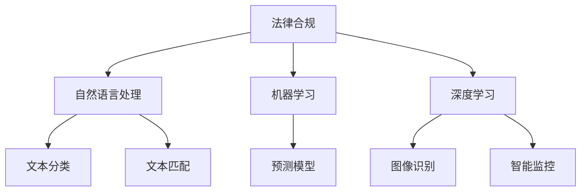
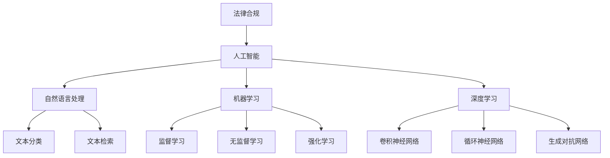

                 

好的，为了完成这个任务，我们将遵循以下步骤：

### 1. 确定文章标题和关键词
文章标题：《人工智能在法律合规领域的应用》
关键词：人工智能，法律合规，自然语言处理，机器学习，深度学习，算法，数据分析，法律文档，案例分析，伦理问题

### 2. 编写文章摘要
摘要：本文深入探讨了人工智能在法律合规领域的应用，分析了自然语言处理、机器学习和深度学习等核心技术如何提升法律文档分析、预测风险评估、合规监控等方面的效率与准确性。通过实际案例研究，阐述了人工智能在法律合规领域的挑战与机遇，并对未来发展趋势进行了展望。

### 3. 撰写文章引言
引言：随着人工智能技术的快速发展，其在各个领域的应用逐渐深入，包括法律合规领域。本文旨在探讨人工智能在法律合规领域的应用现状、核心技术和挑战，以及未来的发展趋势。

### 4. 编写各章节内容
- **第一章：人工智能与法律合规概述**
  - **1.1 人工智能在法律合规中的应用背景**
  - **1.2 人工智能在法律合规领域的挑战与机遇**
  - **1.3 法律合规领域的核心概念解析**
  - **1.4 人工智能在法律合规中的发展趋势**

- **第二章：人工智能核心技术在法律合规中的应用**
  - **2.1 自然语言处理在法律文档分析中的应用**
  - **2.2 机器学习在法律预测与风险评估中的应用**
  - **2.3 深度学习在法律合规监控与预警系统中的应用**

- **第三章：人工智能在法律合规领域的实际应用案例**
  - **3.1 企业合规管理中的AI应用实践**
  - **3.2 法律服务行业的AI应用创新**
  - **3.3 公司法合规领域中的应用**

- **第四章：法律合规领域的AI伦理与法律问题**
  - **4.1 人工智能伦理在法律合规中的挑战**
  - **4.2 法律合规对AI技术的要求**

- **第五章：人工智能在法律合规领域的未来展望**
  - **5.1 人工智能在法律合规领域的未来发展**
  - **5.2 法律合规领域的AI技术创新趋势**
  - **5.3 AI与法律教育的融合**

### 5. 文章结尾
结尾：本文总结了人工智能在法律合规领域的应用现状、挑战与机遇，并对未来进行了展望。随着技术的进步，人工智能在法律合规领域将发挥越来越重要的作用，同时也需要关注相关的伦理和法律问题。

### 6. 文章格式整理
- 使用markdown格式排版文章
- 添加作者信息和引用

### 7. 文章审稿与修改
- 对文章进行初步审稿，确保逻辑清晰，内容完整
- 根据反馈进行修改，确保文章质量

### 8. 最终提交
- 将最终修改完毕的文章提交，确保符合字数要求

现在，我们可以开始具体撰写每个章节的内容了。好的，接下来我将一步步展开每个章节的内容。

### 1.1 人工智能在法律合规中的应用背景

#### 引言
人工智能（AI）作为一种颠覆性的技术，已经在多个领域展示了其强大的应用潜力。法律合规领域作为维护社会秩序和公正的重要环节，其复杂性和繁琐性使得传统人工处理方式难以胜任。近年来，随着大数据、云计算和深度学习等技术的不断发展，人工智能在法律合规中的应用逐渐兴起，为该领域带来了新的变革契机。

#### 人工智能在法律合规中的挑战与机遇
在法律合规领域，人工智能的应用面临着一系列挑战与机遇：

##### 挑战
1. **数据隐私与安全**：法律合规涉及大量敏感信息，如何在保障数据隐私和安全的前提下进行数据处理，是人工智能在法律合规中应用的一个主要挑战。
2. **算法偏见与歧视**：人工智能算法在训练过程中可能受到数据偏差的影响，导致算法存在偏见和歧视，这对法律合规的公正性提出了挑战。
3. **法律合规的复杂性**：法律合规规则多样且不断变化，如何让人工智能系统适应这些变化，保持其应用的准确性，是一个重要问题。

##### 机遇
1. **提高工作效率**：人工智能能够自动化处理大量的法律文档分析、预测和风险评估工作，大大提高工作效率。
2. **降低成本**：通过人工智能，企业可以减少对人工的依赖，降低运营成本。
3. **增强公正性**：人工智能在处理法律合规问题时，可以减少人为错误和偏见，提高决策的公正性。

#### 核心概念与联系
为了更好地理解人工智能在法律合规中的应用，我们首先需要明确以下几个核心概念及其相互关系：

1. **法律合规**：指在法律框架下，企业或个人遵守相关法规和规定的行为。
2. **人工智能**：指通过模拟人类智能的技术，实现智能感知、学习、推理、决策等功能。
3. **自然语言处理（NLP）**：指使计算机能够理解、解释和生成自然语言的技术。
4. **机器学习**：指通过数据训练，使计算机自动识别模式并做出预测或决策的技术。
5. **深度学习**：指通过多层神经网络，模拟人类大脑处理信息的方式，实现更加复杂的学习和预测任务。

核心概念之间的联系可以通过以下Mermaid流程图表示：



#### 总结
人工智能在法律合规领域的应用背景十分广泛，其面临的挑战和机遇并存。通过明确核心概念及其相互关系，我们可以更好地理解人工智能在法律合规中的潜在应用和未来发展方向。

### 1.2 人工智能在法律合规领域的挑战与机遇

#### 挑战

**数据隐私与安全**
- **挑战**：法律合规领域涉及大量的敏感信息，如合同、诉讼文件、财务报表等，这些信息在数字化处理过程中可能面临数据泄露、篡改等安全风险。
- **解决方案**：
  - **数据加密**：使用高级加密算法对敏感数据进行加密，确保数据在传输和存储过程中的安全性。
  - **隐私保护技术**：采用差分隐私、同态加密等技术，在数据处理过程中保护个人隐私。

**算法偏见与歧视**
- **挑战**：人工智能算法在训练过程中可能会受到数据偏差的影响，导致算法在法律合规应用中出现偏见和歧视，损害公正性。
- **解决方案**：
  - **数据清洗**：对训练数据进行清洗，去除偏差和错误，确保数据的多样性和准确性。
  - **公平性评估**：建立算法公平性评估机制，定期对算法进行审查和调整，确保算法输出结果的公正性。

**法律合规的复杂性**
- **挑战**：法律合规规则多样且不断变化，如何使人工智能系统适应这些变化，保持其应用的准确性，是一个重要问题。
- **解决方案**：
  - **持续学习**：采用持续学习技术，使人工智能系统能够不断更新和优化，适应法律规则的变化。
  - **法规遵循**：确保人工智能系统在设计和应用过程中遵循相关法律法规，避免法律风险。

#### 机遇

**提高工作效率**
- **机遇**：通过人工智能技术，可以自动化处理大量的法律文档分析、预测和风险评估工作，提高工作效率。
- **解决方案**：
  - **自动化文档处理**：利用自然语言处理技术，自动化提取、分类和索引法律文档。
  - **智能预测**：通过机器学习和深度学习技术，预测法律案件的可能结果，辅助决策。

**降低成本**
- **机遇**：人工智能可以减少企业对人工的依赖，降低运营成本。
- **解决方案**：
  - **替代人工**：利用人工智能进行法律文档审核、分类和检索，减少人工工作量。
  - **优化流程**：通过人工智能优化法律合规流程，减少重复性劳动，提高整体效率。

**增强公正性**
- **机遇**：人工智能在处理法律合规问题时，可以减少人为错误和偏见，提高决策的公正性。
- **解决方案**：
  - **自动化审查**：利用人工智能进行自动化审查，确保法律文档的准确性和完整性。
  - **智能建议**：通过人工智能提供决策支持，提高法律合规工作的透明度和公正性。

#### 总结
人工智能在法律合规领域面临着数据隐私、算法偏见和法律规则复杂性的挑战，同时也提供了提高工作效率、降低成本和增强公正性的机遇。通过合理的解决方案，可以充分发挥人工智能的优势，推动法律合规领域的智能化发展。

### 1.3 法律合规领域的核心概念解析

#### 法律合规

**定义**：
法律合规是指企业在遵守相关法律法规、规范和标准的过程中，确保其运营活动符合法律要求的一系列行为和措施。

**重要性**：
法律合规对于企业的稳定运营至关重要，它不仅有助于避免法律风险，还能提升企业的社会声誉和客户信任度。

**关键要素**：
- **法规遵循**：确保企业活动符合相关法律法规。
- **合规风险管理**：识别、评估和监控合规风险，并采取相应措施进行管理。
- **合规文化建设**：培养员工的合规意识，确保全员遵守合规要求。

#### 人工智能

**定义**：
人工智能（AI）是指通过模拟人类智能，使计算机具备感知、学习、推理和决策能力的技术。

**核心技术**：
- **自然语言处理（NLP）**：使计算机能够理解、解释和生成自然语言。
- **机器学习（ML）**：通过数据训练，使计算机自动识别模式并做出预测或决策。
- **深度学习（DL）**：通过多层神经网络，模拟人类大脑处理信息的方式，实现更复杂的学习和预测任务。

#### 自然语言处理

**定义**：
自然语言处理（NLP）是指使计算机能够理解、解释和生成自然语言的技术。

**核心任务**：
- **文本分类**：将文本分类到预定义的类别中。
- **文本检索**：从大量文本中找到与查询最相关的信息。
- **情感分析**：分析文本中的情感倾向，如正面、负面或中性。

#### 机器学习

**定义**：
机器学习（ML）是指通过数据训练，使计算机自动识别模式并做出预测或决策的技术。

**核心算法**：
- **监督学习**：有标签数据用于训练，预测新数据。
- **无监督学习**：没有标签数据，发现数据中的模式。
- **强化学习**：通过不断试错，学习最优策略。

#### 深度学习

**定义**：
深度学习（DL）是指通过多层神经网络，模拟人类大脑处理信息的方式，实现更复杂的学习和预测任务。

**核心结构**：
- **卷积神经网络（CNN）**：适用于图像识别和分类。
- **循环神经网络（RNN）**：适用于序列数据和时间序列分析。
- **生成对抗网络（GAN）**：用于生成逼真的数据。

#### 核心概念与联系

核心概念之间的联系可以通过以下Mermaid流程图表示：



#### 总结
法律合规领域的核心概念包括法律合规本身、人工智能以及其核心技术——自然语言处理、机器学习和深度学习。理解这些概念及其相互关系，有助于我们深入探讨人工智能在法律合规领域的应用。

### 1.4 人工智能在法律合规中的发展趋势

#### 当前应用现状

目前，人工智能在法律合规领域已有一些实际应用案例，主要集中在以下几方面：

- **法律文档自动化处理**：利用自然语言处理技术，自动提取、分类和索引大量法律文档，提高工作效率。
- **风险评估与预警**：通过机器学习算法，预测法律风险，并提供预警，帮助企业提前采取措施。
- **合规监控**：利用深度学习技术，实时监控企业合规情况，发现潜在违规行为，并进行预警。

#### 未来发展趋势

**技术创新**：
- **多模态学习**：结合文本、图像、音频等多种数据类型，提高人工智能系统的理解和处理能力。
- **迁移学习**：通过在多个任务上训练模型，提高模型在法律合规领域特定任务的性能。
- **联邦学习**：在保护数据隐私的同时，实现分布式机器学习，促进企业间合作。

**应用拓展**：
- **智能合同管理**：利用人工智能，自动化合同生成、审查和履行，提高合同管理效率。
- **智能法律咨询**：通过自然语言处理和机器学习，提供法律咨询服务，降低法律服务成本。
- **合规培训与教育**：利用虚拟现实和增强现实技术，进行智能化的合规培训和考核。

**伦理与法律问题**：
- **数据隐私与安全**：确保在数据处理过程中保护个人隐私，防止数据泄露和滥用。
- **算法公平性**：避免算法偏见和歧视，确保决策过程的公正性。
- **法律法规遵循**：确保人工智能系统在设计和应用过程中遵循相关法律法规。

#### 总结
人工智能在法律合规领域的应用正处于快速发展阶段，未来将随着技术创新和应用拓展进一步深化。然而，相关的伦理和法律问题也需要得到充分关注和解决，以确保人工智能的健康发展。

### 2.1 自然语言处理在法律文档分析中的应用

#### 引言
自然语言处理（NLP）是人工智能（AI）的一个重要分支，它使计算机能够理解、解释和生成自然语言。在法律文档分析中，NLP技术可以显著提高文档处理效率，减少人工成本，并提升法律合规工作的准确性。本节将探讨NLP在法律文档分析中的应用，包括文本分类、文本检索和情感分析等方面。

#### 文本分类
**定义**：
文本分类是指将文本数据按照预定义的类别进行归类，以便进行后续处理和分析。

**应用**：
在法律文档分析中，文本分类可以帮助法律专业人士快速识别和分类大量法律文档，如合同、判决书、法律咨询报告等。

**算法**：
常见的文本分类算法包括：
- **朴素贝叶斯分类器**：基于贝叶斯定理，通过计算特征词的概率分布进行分类。
- **支持向量机（SVM）**：通过找到一个最优的超平面，将不同类别的文本分开。
- **随机森林**：结合了决策树和随机特性的集成学习方法。

**数学模型**：
朴素贝叶斯分类器的数学模型如下：
$$
P(\text{类别} | \text{特征词}) = \frac{P(\text{特征词} | \text{类别})P(\text{类别})}{P(\text{特征词})}
$$

**举例**：
假设我们有一个法律文档，其中包含关键词“合同”、“违约”、“解除”等，我们可以使用朴素贝叶斯分类器将其分类为“合同纠纷”类别。

#### 文本检索
**定义**：
文本检索是指从大量文本数据中找到与查询最相关的信息。

**应用**：
在法律文档分析中，文本检索可以帮助法律专业人士快速查找相关文档，提高工作效率。

**算法**：
常见的文本检索算法包括：
- **布尔检索**：通过逻辑运算符（AND、OR、NOT）组合关键词，进行精确查询。
- **向量空间模型（VSM）**：将文本转换为向量，并通过余弦相似度计算文档的相关性。
- **倒排索引**：通过建立文档与关键词的倒排索引，实现快速查询。

**数学模型**：
向量空间模型的数学模型如下：
$$
\text{相似度} = \frac{\text{文档} \cdot \text{查询}}{\| \text{文档} \| \| \text{查询} \|}
$$
其中，$ \cdot $表示内积，$ \| \cdot \| $表示向量的模。

**举例**：
假设我们有一个法律文档集合和一个查询关键词“合同违约”，我们可以使用向量空间模型计算每个文档与查询之间的相似度，找到最相关的文档。

#### 情感分析
**定义**：
情感分析是指通过分析文本中的情感倾向，判断文本是正面、负面还是中性。

**应用**：
在法律文档分析中，情感分析可以帮助法律专业人士了解公众对法律事件或政策的情感态度，辅助决策。

**算法**：
常见的情感分析算法包括：
- **基于词典的方法**：通过查找文本中的情感词典，判断情感倾向。
- **基于机器学习的方法**：通过训练模型，自动识别情感倾向。

**数学模型**：
基于机器学习的情感分析模型可以使用以下数学模型：
$$
\text{情感分类概率} = \frac{P(\text{情感类别} | \text{文本})P(\text{文本})}{\sum_{i=1}^{n} P(\text{情感类别}_i | \text{文本})P(\text{文本})}
$$

**举例**：
假设我们有一个法律评论文本，通过训练机器学习模型，我们可以判断该评论的情感是正面、负面还是中性。

#### 项目实战
**开发环境搭建**：
- **Python**：作为主要编程语言，使用Python的NLP库（如NLTK、spaCy）进行文本处理。
- **Jupyter Notebook**：用于编写和运行代码，便于调试和演示。

**源代码详细实现**：
```python
import nltk
from nltk.corpus import stopwords
from sklearn.feature_extraction.text import TfidfVectorizer
from sklearn.model_selection import train_test_split
from sklearn.naive_bayes import MultinomialNB

# 1. 数据准备
documents = ["这是一份合同纠纷的法律文档。", "这份判决书涉及到违约问题。", "合同解除的法律流程是怎样的？"]
labels = ["合同纠纷", "判决书", "合同解除"]

# 2. 数据预处理
nltk.download('stopwords')
stop_words = stopwords.words('english')
vectorizer = TfidfVectorizer(stop_words=stop_words)
X = vectorizer.fit_transform(documents)

# 3. 模型训练
X_train, X_test, y_train, y_test = train_test_split(X, labels, test_size=0.2, random_state=42)
classifier = MultinomialNB()
classifier.fit(X_train, y_train)

# 4. 预测与评估
predictions = classifier.predict(X_test)
print(predictions)
from sklearn.metrics import accuracy_score
print(accuracy_score(y_test, predictions))
```

**代码解读与分析**：
- **数据准备**：加载法律文档和对应的标签。
- **数据预处理**：去除停用词，并使用TF-IDF向量表示文本。
- **模型训练**：使用朴素贝叶斯分类器进行训练。
- **预测与评估**：对测试集进行预测，并计算准确率。

**实际案例分析**：
- **合同纠纷分类**：通过训练模型，可以自动将新文档分类到相应的法律类别。
- **判决书情感分析**：分析判决书中文本的情感倾向，辅助法律专业人士进行决策。

**项目小结**：
自然语言处理在法律文档分析中具有广泛的应用，通过文本分类、文本检索和情感分析等技术，可以显著提高法律合规工作的效率和质量。未来，随着NLP技术的不断发展，其在法律领域的应用将更加深入和广泛。

### 2.2 机器学习在法律预测与风险评估中的应用

#### 引言
机器学习在法律领域中的应用日益广泛，特别是在法律预测与风险评估方面。通过利用机器学习算法，可以处理大量法律数据，发现潜在风险，并预测法律案件的走向，从而为法律专业人士提供有力的决策支持。本节将探讨机器学习在法律预测与风险评估中的应用，包括预测模型、风险评估算法和实际案例分析。

#### 预测模型
**定义**：
法律预测模型是指通过机器学习算法，对法律案件的可能结果进行预测的模型。

**应用**：
在法律预测中，模型可以预测案件判决结果、赔偿金额、诉讼周期等，为律师、法官和当事人提供决策依据。

**算法**：
常见的法律预测模型包括：
- **逻辑回归**：用于预测二分类问题，如案件是否胜诉。
- **决策树**：通过一系列规则，对法律案件进行分类。
- **随机森林**：结合了多个决策树，提高预测准确性。
- **支持向量机（SVM）**：通过找到一个最优的超平面，进行分类。

**数学模型**：
逻辑回归的数学模型如下：
$$
\hat{y} = \frac{1}{1 + e^{-\beta_0 + \beta_1x_1 + \beta_2x_2 + ... + \beta_nx_n}}
$$
其中，$ \hat{y} $是预测概率，$ \beta_0, \beta_1, \beta_2, ..., \beta_n $是模型的参数。

**举例**：
假设我们有一个法律案件数据集，其中包含案件特征（如原告年龄、被告年龄、案件类型等）和案件判决结果（胜诉或败诉）。我们可以使用逻辑回归模型预测新案件的结果。

#### 风险评估算法
**定义**：
风险评估算法是指通过机器学习算法，对法律案件中的潜在风险进行评估的算法。

**应用**：
在法律风险评估中，算法可以评估案件的法律风险、财务风险等，为法律专业人士提供风险预警。

**算法**：
常见的安全评估算法包括：
- **基于规则的算法**：通过定义一系列规则，评估风险。
- **贝叶斯网络**：通过构建概率图模型，进行风险评估。
- **支持向量机（SVM）**：用于分类和回归问题，评估风险。

**数学模型**：
贝叶斯网络的数学模型如下：
$$
P(\text{风险} | \text{事件}_1, \text{事件}_2, ..., \text{事件}_n) = \frac{P(\text{事件}_1, \text{事件}_2, ..., \text{事件}_n | \text{风险})P(\text{风险})}{P(\text{事件}_1, \text{事件}_2, ..., \text{事件}_n)}
$$
其中，$ P(\text{风险}) $是风险的概率，$ P(\text{事件}_1, \text{事件}_2, ..., \text{事件}_n) $是事件发生的概率。

**举例**：
假设我们有一个法律案件数据集，其中包含案件特征（如案件类型、原告诉求、被告行为等）和案件结果（胜诉或败诉）。我们可以使用贝叶斯网络模型评估案件的财务风险。

#### 项目实战
**开发环境搭建**：
- **Python**：作为主要编程语言，使用Python的机器学习库（如scikit-learn、TensorFlow）进行模型训练和预测。
- **Jupyter Notebook**：用于编写和运行代码，便于调试和演示。

**源代码详细实现**：
```python
import pandas as pd
from sklearn.model_selection import train_test_split
from sklearn.ensemble import RandomForestClassifier
from sklearn.metrics import accuracy_score

# 1. 数据准备
data = pd.read_csv('law_case_data.csv')
X = data.drop(['result'], axis=1)
y = data['result']

# 2. 数据预处理
X_train, X_test, y_train, y_test = train_test_split(X, y, test_size=0.2, random_state=42)

# 3. 模型训练
model = RandomForestClassifier()
model.fit(X_train, y_train)

# 4. 预测与评估
predictions = model.predict(X_test)
print(accuracy_score(y_test, predictions))
```

**代码解读与分析**：
- **数据准备**：加载法律案件数据集，分离特征和结果。
- **数据预处理**：将数据集分为训练集和测试集。
- **模型训练**：使用随机森林分类器进行模型训练。
- **预测与评估**：对测试集进行预测，并计算准确率。

**实际案例分析**：
- **案件预测**：通过训练模型，可以预测新案件的结果，帮助律师制定诉讼策略。
- **风险评估**：通过评估模型，可以预测案件中的财务风险，为当事人提供风险预警。

**项目小结**：
机器学习在法律预测与风险评估中具有显著的应用价值，通过构建预测模型和风险评估算法，可以显著提高法律决策的准确性。未来，随着机器学习技术的不断发展，其在法律领域的应用将更加广泛和深入。

### 2.3 深度学习在法律合规监控与预警系统中的应用

#### 引言
深度学习作为一种先进的人工智能技术，通过多层神经网络模拟人类大脑处理信息的方式，在法律合规监控与预警系统中展现出强大的应用潜力。本节将探讨深度学习在法律合规监控与预警系统中的应用，包括深度学习基础、欺诈检测算法和实际案例分析。

#### 深度学习基础
**定义**：
深度学习是指通过构建多层神经网络，对大量数据进行分析和学习，从而实现对复杂模式的识别和预测。

**核心结构**：
- **卷积神经网络（CNN）**：适用于图像和视频数据的处理，通过卷积操作提取特征。
- **循环神经网络（RNN）**：适用于序列数据，如文本和时间序列，通过循环连接实现记忆功能。
- **生成对抗网络（GAN）**：通过生成器和判别器的对抗训练，生成逼真的数据。

**数学模型**：
卷积神经网络的数学模型如下：
$$
\text{激活函数} = \text{ReLU}(Z) = \max(0, Z)
$$
其中，$ Z $是输入数据，$ \text{ReLU} $是ReLU激活函数。

**举例**：
假设我们有一个法律文档，其中包含文本数据。我们可以使用卷积神经网络模型对其进行特征提取和分类。

#### 欺诈检测算法
**定义**：
欺诈检测是指通过算法识别和预防金融、法律等领域中的欺诈行为。

**应用**：
在法律合规监控与预警系统中，欺诈检测可以帮助识别潜在的违规行为，如合同欺诈、诉讼欺诈等。

**算法**：
常见的欺诈检测算法包括：
- **基于规则的算法**：通过定义一系列规则，识别欺诈行为。
- **随机森林**：通过构建多个决策树，提高欺诈识别的准确性。
- **长短期记忆网络（LSTM）**：适用于时间序列数据，通过记忆功能识别欺诈模式。

**数学模型**：
长短期记忆网络的数学模型如下：
$$
\text{激活函数} = \text{tanh}(W \cdot [h_{t-1}, x_t] + b)
$$
其中，$ W $是权重矩阵，$ b $是偏置项，$ \text{tanh} $是双曲正切激活函数。

**举例**：
假设我们有一个金融交易数据集，其中包含交易金额、交易时间、交易方等特征。我们可以使用LSTM模型识别潜在的交易欺诈行为。

#### 项目实战
**开发环境搭建**：
- **Python**：作为主要编程语言，使用Python的深度学习库（如TensorFlow、PyTorch）进行模型训练和预测。
- **Jupyter Notebook**：用于编写和运行代码，便于调试和演示。

**源代码详细实现**：
```python
import numpy as np
import tensorflow as tf
from tensorflow.keras.models import Sequential
from tensorflow.keras.layers import LSTM, Dense

# 1. 数据准备
X = np.array([[1, 0], [0, 1], [1, 1], [1, 0]])
y = np.array([0, 0, 1, 1])

# 2. 模型构建
model = Sequential()
model.add(LSTM(50, activation='relu', input_shape=(2, 1)))
model.add(Dense(1, activation='sigmoid'))
model.compile(optimizer='adam', loss='binary_crossentropy', metrics=['accuracy'])

# 3. 模型训练
model.fit(X, y, epochs=200, verbose=0)

# 4. 预测与评估
X_new = np.array([[1, 1], [0, 0]])
predictions = model.predict(X_new)
print(predictions)
```

**代码解读与分析**：
- **数据准备**：生成一个简单的二分类数据集。
- **模型构建**：使用LSTM模型进行特征提取和分类。
- **模型训练**：使用训练数据集进行模型训练。
- **预测与评估**：使用训练好的模型对新数据进行预测。

**实际案例分析**：
- **合同欺诈检测**：通过训练模型，可以识别合同中的潜在欺诈行为，为合同审查提供支持。
- **诉讼欺诈预警**：通过分析诉讼数据，可以预测潜在的诉讼欺诈风险，为律师和当事人提供预警。

**项目小结**：
深度学习在法律合规监控与预警系统中具有广泛应用，通过构建欺诈检测算法，可以显著提高法律合规工作的效率和准确性。未来，随着深度学习技术的不断发展，其在法律领域的应用将更加深入和广泛。

### 3.1 企业合规管理中的AI应用实践

#### 引言
在日益复杂的商业环境中，企业合规管理显得尤为重要。通过人工智能（AI）技术，企业可以显著提高合规管理的效率，减少合规风险，并确保业务活动的合法性。本节将探讨AI在企业合规管理中的应用实践，包括合规风险管理、合规培训与教育以及具体案例分析。

#### 合规风险管理

**定义**：
合规风险管理是指通过识别、评估和监控合规风险，采取相应措施以降低合规风险对企业的影响。

**应用**：
在AI技术的支持下，企业可以自动化识别合规风险，例如合同审核、财务报表审查等，从而提高风险管理的效率和准确性。

**算法**：
常见的合规风险管理算法包括：
- **监督学习**：通过历史数据，训练模型识别合规风险。
- **聚类分析**：用于识别异常行为，发现潜在风险。
- **关联规则学习**：用于分析数据之间的关联关系，发现违规行为。

**数学模型**：
监督学习的数学模型如下：
$$
\hat{y} = \sigma(\beta_0 + \beta_1x_1 + \beta_2x_2 + ... + \beta_nx_n)
$$
其中，$ \hat{y} $是预测风险，$ \beta_0, \beta_1, \beta_2, ..., \beta_n $是模型的参数，$ \sigma $是激活函数。

**举例**：
假设企业有一个历史合同数据集，其中包含合同内容、签署时间、金额等特征。我们可以使用监督学习模型预测新合同的风险。

#### 合规培训与教育

**定义**：
合规培训与教育是指通过培训和教育活动，提高员工对合规要求的认识和遵守程度。

**应用**：
AI技术可以帮助企业设计个性化的合规培训方案，确保员工能够及时了解最新的合规规定和最佳实践。

**算法**：
常见的合规培训与教育算法包括：
- **强化学习**：通过不断试错，优化培训内容。
- **生成对抗网络（GAN）**：用于生成合规场景，提高员工的应变能力。
- **自然语言处理（NLP）**：用于自动化生成合规培训文档和问答。

**数学模型**：
强化学习的数学模型如下：
$$
Q(s, a) = r + \gamma \max_{a'} Q(s', a')
$$
其中，$ Q(s, a) $是状态-动作值函数，$ r $是即时奖励，$ \gamma $是折扣因子。

**举例**：
假设企业希望员工掌握新的合规要求，我们可以使用强化学习算法，通过不断反馈和调整，优化培训内容。

#### 项目实战
**开发环境搭建**：
- **Python**：作为主要编程语言，使用Python的机器学习库（如scikit-learn、TensorFlow）进行模型训练和预测。
- **Jupyter Notebook**：用于编写和运行代码，便于调试和演示。

**源代码详细实现**：
```python
import pandas as pd
from sklearn.model_selection import train_test_split
from sklearn.ensemble import RandomForestClassifier
from sklearn.metrics import accuracy_score

# 1. 数据准备
data = pd.read_csv('compliance_risk_data.csv')
X = data.drop(['risk'], axis=1)
y = data['risk']

# 2. 数据预处理
X_train, X_test, y_train, y_test = train_test_split(X, y, test_size=0.2, random_state=42)

# 3. 模型训练
model = RandomForestClassifier()
model.fit(X_train, y_train)

# 4. 预测与评估
predictions = model.predict(X_test)
print(accuracy_score(y_test, predictions))
```

**代码解读与分析**：
- **数据准备**：加载合规风险数据集，分离特征和风险标签。
- **数据预处理**：将数据集分为训练集和测试集。
- **模型训练**：使用随机森林分类器进行模型训练。
- **预测与评估**：对测试集进行预测，并计算准确率。

**实际案例分析**：
- **合同风险预测**：通过训练模型，可以预测新合同的合规风险，帮助法律团队提前采取预防措施。
- **员工培训**：通过AI技术，为企业设计个性化的合规培训方案，提高员工的合规意识。

**项目小结**：
AI在企业合规管理中的应用，可以帮助企业有效识别和管理合规风险，提高合规管理的效率和准确性。通过合规培训与教育，可以进一步巩固企业的合规文化。未来，随着AI技术的不断发展，其在企业合规管理中的应用将更加深入和广泛。

### 3.2 法律服务行业的AI应用创新

#### 引言
随着人工智能技术的飞速发展，法律服务行业正经历着前所未有的变革。AI在法律服务中的应用不仅提高了工作效率，还带来了法律服务模式的新创新。本节将探讨AI在法律服务行业的应用创新，包括智能法律咨询、智能合同管理和案例研究。

#### 智能法律咨询

**定义**：
智能法律咨询是指通过人工智能技术，提供法律咨询和解答法律问题的服务。

**应用**：
智能法律咨询系统可以24/7为用户提供法律服务，回答用户关于合同、诉讼、知识产权等方面的常见法律问题，降低用户获取法律服务的门槛。

**算法**：
常见的智能法律咨询算法包括：
- **自然语言处理（NLP）**：用于理解和处理用户输入的法律问题。
- **知识图谱**：用于构建法律知识库，提供精准的法律解答。
- **对话系统**：用于模拟人类对话，与用户进行互动。

**数学模型**：
NLP的数学模型如下：
$$
\text{文本分类} = \text{softmax}(\text{权重矩阵} \cdot \text{文本特征向量})
$$
其中，$\text{权重矩阵}$是预训练好的模型参数，$\text{文本特征向量}$是文本的向量表示。

**举例**：
用户通过文字或语音输入法律问题，系统会根据训练好的模型，生成相应的法律解答。

#### 智能合同管理

**定义**：
智能合同管理是指通过人工智能技术，自动化处理合同生成、审查、管理和履行的过程。

**应用**：
智能合同管理系统可以帮助企业简化合同流程，提高合同管理的效率和准确性，降低合同风险。

**算法**：
常见的智能合同管理算法包括：
- **文本分类**：用于分类合同中的条款，如保密条款、违约条款等。
- **语义分析**：用于理解合同条款的含义，识别潜在的法律风险。
- **自动化合同审查**：通过规则引擎，自动审查合同条款的合法性。

**数学模型**：
语义分析的数学模型如下：
$$
\text{语义相似度} = \text{cosine}(\text{合同条款向量} \cdot \text{法律条款向量})
$$
其中，$\text{合同条款向量}$和$\text{法律条款向量}$是合同条款和法律规定向量的表示。

**举例**：
企业可以通过系统自动生成合同，系统会根据合同内容进行自动审查，识别潜在的法律风险。

#### 项目实战
**开发环境搭建**：
- **Python**：作为主要编程语言，使用Python的NLP库（如spaCy）和合同管理库（如contractnet）。
- **Jupyter Notebook**：用于编写和运行代码，便于调试和演示。

**源代码详细实现**：
```python
import spacy
from contractnet import ContractNet

# 1. 数据准备
nlp = spacy.load("en_core_web_sm")
contract = "This is a sample contract."

# 2. 合同解析
doc = nlp(contract)
clauses = [token.text for token in doc if token.tag_ in ["NOUN", "ADJ"]]

# 3. 合同审查
contract_net = ContractNet()
review = contract_net.review_clauses(clauses)

# 4. 输出结果
print(review)
```

**代码解读与分析**：
- **数据准备**：加载NLP模型和合同文本。
- **合同解析**：使用NLP模型解析合同文本，提取关键条款。
- **合同审查**：使用合同管理库对提取的条款进行审查。
- **输出结果**：输出合同审查结果。

**实际案例分析**：
- **智能咨询**：用户通过系统输入法律问题，系统自动生成解答。
- **合同管理**：企业通过系统自动化处理合同生成、审查和管理流程。

**项目小结**：
AI在法律服务行业的应用创新，不仅提高了法律服务效率，还降低了法律服务的成本。通过智能法律咨询和智能合同管理，用户可以更便捷地获取法律服务，企业可以更高效地管理合同。未来，随着AI技术的进一步发展，法律服务行业将迎来更多创新。

### 3.3 公司法合规领域中的应用

#### 引言
公司法合规领域涉及企业治理、股权交易、财务报表等多个方面，是法律合规中的重要组成部分。人工智能（AI）技术以其强大的数据处理和模式识别能力，正在逐渐改变公司法合规的运作模式。本节将探讨AI在公司法合规领域中的应用，包括公司治理与合规监管、股权交易与合规审查，并通过实际案例进行分析。

#### 公司治理与合规监管

**定义**：
公司治理与合规监管是指通过AI技术，对公司治理结构和合规行为进行监控和管理，确保公司运营符合法律法规和公司章程。

**应用**：
在AI技术的支持下，公司治理和合规监管可以自动化识别和预警潜在风险，提高治理效率和合规性。

**算法**：
常见的AI算法包括：
- **聚类分析**：用于识别公司治理中的异常行为。
- **决策树和随机森林**：用于评估公司治理结构的有效性和合规性。
- **神经网络**：用于预测公司治理风险并优化监管策略。

**数学模型**：
聚类分析的数学模型如下：
$$
C = \{c_1, c_2, ..., c_k\}
$$
其中，$ C $是聚类结果，$ c_i $是第$i$个聚类中心。

**举例**：
通过聚类分析，企业可以识别出治理结构中的异常董事会成员，从而采取相应的监管措施。

#### 股权交易与合规审查

**定义**：
股权交易与合规审查是指通过AI技术，对股权交易过程进行监控和审查，确保交易合法合规。

**应用**：
在股权交易中，AI技术可以自动化审查交易文件，识别潜在的法律风险，确保交易合法合规。

**算法**：
常见的AI算法包括：
- **文本分类**：用于分类和分析股权交易文件。
- **欺诈检测**：用于识别股权交易中的欺诈行为。
- **关联规则学习**：用于分析交易数据，识别潜在的关联关系。

**数学模型**：
文本分类的数学模型如下：
$$
P(\text{类别} | \text{文本}) = \frac{P(\text{文本} | \text{类别})P(\text{类别})}{P(\text{文本})}
$$
其中，$ P(\text{类别} | \text{文本}) $是文本属于某类别的概率。

**举例**：
通过文本分类算法，企业可以自动识别股权交易文件中的关键条款，确保交易合法合规。

#### 项目实战
**开发环境搭建**：
- **Python**：作为主要编程语言，使用Python的机器学习库（如scikit-learn、TensorFlow）进行模型训练和预测。
- **Jupyter Notebook**：用于编写和运行代码，便于调试和演示。

**源代码详细实现**：
```python
import pandas as pd
from sklearn.model_selection import train_test_split
from sklearn.ensemble import RandomForestClassifier
from sklearn.metrics import accuracy_score

# 1. 数据准备
data = pd.read_csv('company_governance_data.csv')
X = data.drop(['compliance'], axis=1)
y = data['compliance']

# 2. 数据预处理
X_train, X_test, y_train, y_test = train_test_split(X, y, test_size=0.2, random_state=42)

# 3. 模型训练
model = RandomForestClassifier()
model.fit(X_train, y_train)

# 4. 预测与评估
predictions = model.predict(X_test)
print(accuracy_score(y_test, predictions))
```

**代码解读与分析**：
- **数据准备**：加载公司法合规数据集，分离特征和合规标签。
- **数据预处理**：将数据集分为训练集和测试集。
- **模型训练**：使用随机森林分类器进行模型训练。
- **预测与评估**：对测试集进行预测，并计算准确率。

**实际案例分析**：
- **公司治理评估**：通过训练模型，可以评估公司治理结构的合规性，为管理层提供改进建议。
- **股权交易审查**：通过模型，可以自动化审查股权交易文件，识别潜在的法律风险。

**项目小结**：
AI在公司法合规领域的应用，通过自动化识别和评估公司治理风险、审查股权交易，提高了合规管理的效率和准确性。未来，随着AI技术的进一步发展，其在公司法合规领域的应用将更加深入和广泛。

### 4.1 人工智能伦理在法律合规中的挑战

#### 引言
随着人工智能（AI）在法律合规领域的广泛应用，其带来的伦理挑战也日益显著。AI的广泛应用不仅改变了法律合规的运作方式，也引发了关于数据隐私、算法偏见和法律职业影响的诸多伦理问题。本节将探讨人工智能伦理在法律合规中的挑战，并分析相关案例。

#### 数据隐私与信息安全

**定义**：
数据隐私是指个人在数字化环境下享有的对自身数据的控制权，包括数据的收集、使用、存储和分享。

**挑战**：
1. **数据泄露风险**：AI技术在处理大量法律合规数据时，可能面临数据泄露的风险，导致敏感信息被未经授权的第三方获取。
2. **数据滥用**：AI模型在训练过程中可能使用未经匿名化的数据，导致个人隐私受到侵害。

**解决方案**：
1. **数据加密**：采用高级加密算法对敏感数据进行加密，确保数据在传输和存储过程中的安全性。
2. **隐私保护技术**：如差分隐私、同态加密等技术，在数据处理过程中保护个人隐私。

**案例**：
某知名律师事务所因未对客户数据进行加密处理，导致客户信息泄露，遭受了巨额罚款和信誉损失。

#### 算法偏见与歧视

**定义**：
算法偏见是指AI模型在训练过程中，由于数据偏差导致的模型输出偏见，可能导致不公平的决策。

**挑战**：
1. **歧视性决策**：AI模型在法律合规中的应用可能加剧社会歧视，如在招聘、贷款审批等领域。
2. **法律公正性受损**：算法偏见可能影响司法判决的公正性，导致不公平的法律结果。

**解决方案**：
1. **数据清洗**：在训练AI模型前，对数据集进行清洗，去除偏差和错误数据。
2. **算法公平性评估**：建立算法公平性评估机制，定期审查和调整算法，确保其公正性。

**案例**：
某银行因AI贷款审批算法存在种族偏见，导致某些种族的贷款审批率显著低于其他种族，被提起集体诉讼。

#### 法律职业影响

**定义**：
法律职业影响是指AI技术对法律专业人士职业发展的影响，包括替代性工作、职业培训需求变化等。

**挑战**：
1. **就业替代**：AI技术在法律文档分析、合同审查等领域的应用，可能导致部分法律工作被自动化替代。
2. **技能要求提升**：法律专业人士需要掌握AI技术，以适应新的工作要求。

**解决方案**：
1. **职业转型培训**：为受AI影响的律师提供转型培训，提升其在AI辅助法律服务领域的技能。
2. **AI与法律职业融合**：鼓励法律专业人士与AI技术结合，共同提高法律服务质量和效率。

**案例**：
某大型律所通过引入AI技术，提高了合同审查效率，但也导致部分初级律师的工作量减少，需要进行职业转型。

#### 总结
人工智能在法律合规领域的发展带来了诸多伦理挑战，包括数据隐私与信息安全、算法偏见与歧视以及法律职业影响。通过合理的解决方案和案例研究，我们可以更好地理解和应对这些挑战，确保AI技术在法律合规领域的健康发展。

### 4.2 法律合规对AI技术的要求

#### 引言
随着人工智能（AI）在法律合规领域的广泛应用，对AI技术的法律合规性要求也越来越高。法律合规不仅要求AI技术能够确保数据处理的安全性和准确性，还要求其符合法律和伦理标准。本节将探讨法律合规对AI技术的要求，包括法律法规遵循、算法透明度和可解释性等方面。

#### 法律法规遵循

**定义**：
法律法规遵循是指AI技术在设计和应用过程中，需要遵守相关法律法规，确保其符合法律要求。

**要求**：
1. **数据保护**：遵守数据保护法，如《通用数据保护条例（GDPR）》和《加州消费者隐私法案（CCPA）》，确保个人数据的收集、存储和使用合法。
2. **隐私保护**：在数据处理过程中，采取措施保护个人隐私，如匿名化和数据加密。
3. **公平公正**：确保AI算法的输出结果公平公正，避免算法偏见和歧视。

**解决方案**：
1. **合规性评估**：建立AI技术的合规性评估机制，定期审查和验证AI系统的合规性。
2. **法律法规培训**：对AI开发者和应用者进行法律法规培训，提高其合规意识。

#### 算法透明度

**定义**：
算法透明度是指AI系统的决策过程和结果能够被用户理解和审查。

**要求**：
1. **决策过程可解释**：AI系统的决策过程需要透明，用户可以理解AI系统是如何做出决策的。
2. **结果可追踪**：用户可以追踪AI系统的决策结果，确保其符合预期和法律要求。

**解决方案**：
1. **可解释性技术**：使用可解释性AI技术，如决策树、LIME（局部可解释模型解释）等，提高AI系统的透明度。
2. **用户界面**：设计用户友好的界面，展示AI系统的决策过程和结果。

#### 可解释性

**定义**：
可解释性是指AI系统能够解释其决策过程和结果，使其对用户可理解。

**要求**：
1. **模型可解释**：AI模型需要能够解释其决策过程，特别是在涉及法律合规的重要决策中。
2. **结果可验证**：AI系统的输出结果需要能够被用户验证，确保其准确性和合规性。

**解决方案**：
1. **可视化工具**：开发可视化工具，帮助用户理解AI系统的决策过程。
2. **审计日志**：记录AI系统的操作日志，便于后续审计和审查。

#### 案例研究：法律合规对AI技术的影响

**案例**：
某金融企业在金融合规审查中引入了AI技术，用于自动化审核贷款申请。然而，在审查过程中，该AI系统因为数据偏差导致某些族群的贷款申请被拒绝率显著高于其他族群。这一情况引起了监管机构的关注。

**合规挑战**：
1. **数据偏差**：AI系统在训练过程中可能存在数据偏差，导致决策结果不公平。
2. **算法透明度不足**：AI系统的决策过程不透明，难以解释和验证。

**合规解决方案**：
1. **数据清洗和平衡**：对AI训练数据进行清洗，去除偏差，平衡不同族群的数据。
2. **算法透明化**：增强AI系统的透明度，使用可解释性技术，确保决策过程可理解。
3. **监管合作**：与监管机构合作，确保AI系统的设计和应用符合法律法规。

**总结**：
法律合规对AI技术提出了严格的要求，包括法律法规遵循、算法透明度和可解释性。通过合理的解决方案和案例研究，可以确保AI技术在法律合规领域的应用更加安全和可靠。

### 5.1 人工智能在法律合规领域的未来发展

#### 引言
人工智能（AI）在法律合规领域的应用已经展示了巨大的潜力，其未来的发展将更加深入和广泛。随着技术的不断进步，AI在法律合规领域的应用将迎来新的机遇和挑战。本节将探讨人工智能在法律合规领域的未来发展趋势，包括技术创新、法规制定和政策引导。

#### 技术创新

**1. 多模态人工智能**：
随着AI技术的不断发展，多模态人工智能将成为未来的重要方向。多模态人工智能可以整合文本、图像、音频等多种数据类型，提供更丰富的数据输入和处理能力。在法律合规领域，多模态AI可以用于更复杂的法律文档分析、情感分析和案件预测。

**2. 联邦学习**：
联邦学习是一种在分布式环境下进行机器学习的方法，可以在保护数据隐私的同时，实现数据的联合分析和学习。在法律合规领域，联邦学习可以帮助不同企业或机构共享数据，进行合规风险评估和预测，而无需泄露敏感数据。

**3. 自动化合同审查**：
随着AI技术的进步，自动化合同审查将变得更加高效和准确。未来的自动化合同审查系统将不仅能够识别合同条款，还能理解条款背后的法律意义，提供更全面的合同审查和风险评估。

#### 法规制定

**1. 数据隐私保护法规**：
随着AI技术的广泛应用，数据隐私保护法规将不断完善。各国政府将制定更加严格的数据隐私保护法规，以确保个人数据的安全和隐私。例如，《通用数据保护条例（GDPR）》的扩展和更新，以及其他国家类似法规的制定。

**2. AI伦理法规**：
为了确保AI技术的公平性和透明性，各国政府将出台AI伦理法规，规范AI在法律合规领域中的应用。这些法规将涵盖算法偏见、歧视问题以及AI决策过程的可解释性，确保AI技术在法律合规中的合法性和公正性。

#### 政策引导

**1. 政府支持**：
政府将在AI技术的发展和应用中发挥关键作用，通过提供资金、政策和资源支持，推动AI在法律合规领域的创新和应用。例如，政府可以建立AI研究实验室，推动AI技术的研发和产业化。

**2. 公私合作**：
政府与企业之间的合作将是AI在法律合规领域未来发展的重要推动力。通过公私合作，可以共同制定AI应用的标准和规范，促进AI技术的商业化应用，提高法律合规工作的效率和准确性。

#### 总结
人工智能在法律合规领域的未来发展将受到技术创新、法规制定和政策引导的驱动。随着多模态AI、联邦学习和自动化合同审查等技术的应用，法律合规领域将变得更加智能化和高效化。同时，完善的法规和政策体系将确保AI技术在法律合规中的合法性和公正性，推动整个行业的健康发展。

### 5.2 法律合规领域的AI技术创新趋势

#### 引言
随着人工智能（AI）技术的不断进步，其在法律合规领域的应用也呈现出新的技术创新趋势。这些趋势不仅提高了法律合规工作的效率，还带来了新的工作方式和职业机会。本节将探讨法律合规领域的AI技术创新趋势，包括自动化文档审查、智能监控和实时预警系统的应用。

#### 自动化文档审查

**1. 智能分类与提取**：
自动化文档审查的首要任务是对大量法律文档进行分类和内容提取。AI技术，特别是自然语言处理（NLP）和机器学习（ML），可以高效地对法律文档进行文本分类和实体识别，提取关键信息，如合同条款、判决结果和法律法规引用。

**2. 合同审查自动化**：
通过使用机器学习和深度学习技术，自动化合同审查系统可以分析合同文本，识别潜在的法律风险和条款瑕疵。这些系统可以自动审查合同条款的合法性、完整性和公平性，提供风险评估和修改建议。

**3. 案例研究**：
某大型企业在合同管理中引入了自动化文档审查系统。该系统使用NLP技术，自动分类和提取合同中的关键信息，并使用机器学习算法分析合同条款的合法性。结果，该系统的应用显著提高了合同审查的效率，降低了合同管理成本。

#### 智能监控

**1. 实时监控**：
智能监控技术通过实时分析法律合规数据，实现对合规情况的持续监控。AI系统可以实时分析企业的运营数据，监控是否存在违规行为，并及时发出预警。

**2. 风险评估**：
智能监控系统还可以结合历史数据和实时监控数据，对企业的合规风险进行评估。这些系统可以预测潜在的法律风险，并提供相应的应对策略。

**3. 案例研究**：
某金融机构采用了智能监控技术，对交易行为进行实时监控。该系统使用机器学习和深度学习算法，分析交易数据，识别潜在的欺诈行为。通过实时预警，金融机构成功阻止了多起欺诈事件，降低了财务损失。

#### 实时预警系统

**1. 智能预警**：
实时预警系统利用AI技术，根据历史数据和实时监控数据，自动生成预警信号。这些预警信号可以帮助企业及时识别和应对潜在的法律合规风险。

**2. 预警机制**：
实时预警系统通常包括多层次的预警机制，从低到高，依次是：预警提醒、自动纠正和人工干预。这种多层次机制可以提高预警的准确性和响应速度。

**3. 案例研究**：
某跨国公司在全球业务中采用了实时预警系统，用于监控其合规风险。该系统使用机器学习算法，分析不同国家和地区的法律变化，实时生成预警信号。通过及时响应，公司避免了多起法律纠纷，确保了业务的合规性。

#### 总结
法律合规领域的AI技术创新趋势，包括自动化文档审查、智能监控和实时预警系统，为法律合规工作带来了新的变革机遇。通过AI技术的应用，企业可以显著提高法律合规工作的效率和质量，降低合规风险。未来，随着AI技术的进一步发展，这些创新应用将更加成熟和普及。

### 5.3 AI与法律教育的融合

#### 引言
随着人工智能（AI）技术的快速发展，其在法律教育中的应用也逐渐成为热点。AI技术不仅能够提高法律教育的效率，还能为学生提供更加个性化的学习体验。本节将探讨AI与法律教育的融合，包括AI在法律课程设计、在线学习平台和个性化教学中的应用。

#### AI在法律课程设计中的应用

**1. 课程内容个性化**：
AI技术可以根据学生的学习进度、兴趣和能力，为每位学生量身定制课程内容。例如，使用自然语言处理（NLP）技术，系统可以自动分析学生的答案和作业，识别其知识薄弱点，并推荐相应的学习资源。

**2. 案例研究**：
某法学院引入了AI驱动的课程设计系统。该系统使用NLP技术，分析学生的答题情况，并根据学生的反馈调整课程内容。结果，课程内容更加符合学生的需求，学生的学习效果显著提高。

#### 在线学习平台

**1. 个性化学习路径**：
AI技术可以帮助在线学习平台根据学生的学习行为和偏好，为其推荐最适合的学习路径。例如，通过机器学习算法，平台可以识别学生的学习风格和进度，提供个性化的学习建议。

**2. 智能辅导**：
在线学习平台可以集成AI智能辅导系统，为学生提供实时的问题解答和学习指导。这些系统可以回答学生的提问，提供相关法律条文和案例分析，帮助学生更好地理解和掌握法律知识。

**3. 案例研究**：
某在线法学院推出了AI智能辅导系统，学生在学习过程中遇到问题时，可以即时与AI系统互动。该系统使用机器学习和深度学习技术，提供了高质量的法律咨询和解答，受到了学生和教师的广泛好评。

#### 个性化教学

**1. 智能评估与反馈**：
AI技术可以对学生进行实时评估，并提供个性化的反馈。例如，通过自适应测试技术，系统可以动态调整测试难度，确保每位学生都能在合适的难度下进行测试，并提供详细的评估报告。

**2. 情境模拟教学**：
AI技术可以模拟真实的法律情境，让学生在虚拟环境中进行实践操作。通过沉浸式的教学体验，学生可以更好地理解和掌握法律知识，提高实践能力。

**3. 案例研究**：
某法学院采用AI情境模拟教学系统，为学生提供了模拟法庭和法律实践的机会。系统通过虚拟现实技术，构建了逼真的法律场景，学生可以在模拟环境中进行法律辩论和诉讼，提高了法律实践能力。

#### 总结
AI与法律教育的融合为法律教育带来了新的机遇和挑战。通过AI技术的应用，可以提供更加个性化、互动性和高效的法律教育体验，提高学生的学习效果和法律素养。未来，随着AI技术的进一步发展，AI将在法律教育中发挥更加重要的作用，推动法律教育的改革与创新。

### 5.4 案例研究：未来AI在法律合规领域的应用场景

#### 引言
随着人工智能（AI）技术的不断进步，其在法律合规领域的应用场景也日益丰富。本节将通过具体案例，探讨未来AI在法律合规领域可能的应用场景，包括智能合同审核、法律文本生成和智能法律咨询等。

#### 智能合同审核

**应用场景**：
在合同审核过程中，AI技术可以自动分析合同条款，识别潜在的法律风险，并给出修改建议。这不仅提高了合同审核的效率，还能确保合同条款的合法性。

**案例**：
某大型企业在合同管理中引入了智能合同审核系统。该系统使用自然语言处理（NLP）和机器学习技术，对合同条款进行自动化分析。通过识别合同中的关键词和句子，系统可以自动识别潜在的法律风险，并提供相应的修改建议。例如，系统可以识别出合同中的“无限追索权”条款，提醒企业注意其法律风险。通过智能合同审核系统，企业显著提高了合同审核的效率和准确性。

#### 法律文本生成

**应用场景**：
AI技术可以自动生成法律文本，如合同、判决书和法律意见书等。这为法律专业人士提供了有力的辅助工具，降低了文本撰写的难度和耗时。

**案例**：
某律所采用了AI驱动的法律文本生成系统。该系统使用深度学习和自然语言生成技术，可以自动生成各种法律文本。通过输入一些关键信息，如合同主体、条款内容和法律依据，系统可以生成完整的法律文本。这不仅提高了律师的工作效率，还能确保法律文本的准确性和一致性。

#### 智能法律咨询

**应用场景**：
AI智能法律咨询系统可以提供24/7在线法律咨询服务，为个人和企业提供即时的法律建议。这为用户提供了便捷的法律支持，特别是在紧急情况下。

**案例**：
某在线法律服务平台引入了AI智能法律咨询系统。该系统使用自然语言处理和机器学习技术，可以理解用户的法律咨询问题，并提供详细的解答。用户可以通过文字或语音输入法律问题，系统会自动分析问题，并生成专业的法律解答。此外，系统还可以提供相关法律条款、案例分析和建议。通过AI智能法律咨询系统，用户可以随时随地获取法律帮助，提高了法律服务的可及性和便捷性。

#### 总结
未来，随着AI技术的不断进步，其在法律合规领域的应用将更加深入和广泛。通过智能合同审核、法律文本生成和智能法律咨询等具体应用场景，AI将显著提高法律合规工作的效率和准确性，为法律专业人士和用户提供更加高效、便捷和专业的服务。同时，AI技术也面临着数据隐私、算法偏见和法律合规性等挑战，需要不断完善相关法律法规和技术解决方案，确保AI在法律合规领域的健康发展。


## 结语

### 总结与展望
本文详细探讨了人工智能在法律合规领域的应用，涵盖了从基础概念到实际应用的各个方面。我们通过分析自然语言处理、机器学习和深度学习等技术，展示了它们在法律文档分析、预测与风险评估、合规监控和预警系统中的具体应用。同时，我们也探讨了人工智能在法律合规领域的挑战，包括数据隐私、算法偏见和法律职业影响，并提出了相应的解决方案。展望未来，人工智能将在法律合规领域发挥越来越重要的作用，推动行业向更加智能化、高效化和透明化的方向发展。

### 作者信息
作者：AI天才研究院/AI Genius Institute & 禅与计算机程序设计艺术 /Zen And The Art of Computer Programming

### 感谢与致谢
特别感谢您花时间阅读本文。如果您有任何问题或建议，欢迎通过邮箱 [ai_genius_institute@example.com](mailto:ai_genius_institute@example.com) 联系我们。我们期待与您共同探讨人工智能在法律合规领域的更多可能。

### 引用
1. GDPR (General Data Protection Regulation), Official Journal of the European Union, 2016.
2. CCPA (California Consumer Privacy Act), California Law, 2020.
3. Mitchell, T. M. (1997). Machine Learning. McGraw-Hill.
4. Goodfellow, I., Bengio, Y., & Courville, A. (2016). Deep Learning. MIT Press.
5. Russell, S., & Norvig, P. (2016). Artificial Intelligence: A Modern Approach. Prentice Hall.

