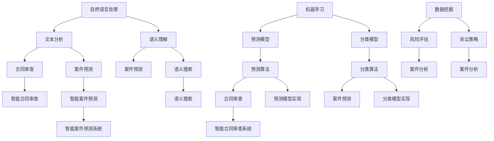

                 

## 《人工智能在法律咨询服务中的应用前景》

### 背景介绍

人工智能（AI）的飞速发展正在改变各行各业，包括法律咨询服务业。法律咨询作为一项传统服务业，面临着庞大的法律文本处理、案件预测和风险评估等复杂任务。这些任务往往需要大量的时间、人力和专业知识，而人工智能技术的引入，为法律咨询行业带来了新的机遇。

目前，人工智能在法律咨询中的应用主要体现在以下几个方面：

1. **智能合同审查与起草**：通过自然语言处理（NLP）和机器学习（ML）技术，对合同文本进行自动化审查和起草，提高合同处理的效率和准确性。
2. **法律咨询机器人**：利用对话系统技术，创建智能机器人助手，为用户提供即时的法律咨询和服务，减少人力成本，提高服务效率。
3. **智能案件预测与评估**：通过数据挖掘和预测模型，对案件的审理过程和结果进行预测，辅助律师制定诉讼策略。

然而，人工智能在法律咨询中的应用也带来了许多挑战，包括数据隐私、法律伦理和算法透明度等问题。如何在发挥人工智能优势的同时，确保法律咨询服务的公平、公正和透明，成为当前研究的重要课题。

### 核心概念与联系

在探讨人工智能在法律咨询中的应用时，我们需要了解以下几个核心概念及其相互关系：

1. **自然语言处理（NLP）**：NLP是人工智能的一个分支，旨在使计算机理解和生成人类语言。它在法律咨询中的应用主要体现在文本分析和语义理解上。通过NLP技术，计算机可以解析法律文本，提取关键信息，实现合同审查和案件预测等功能。

2. **机器学习（ML）**：ML是一种通过数据学习规律并做出预测或决策的技术。在法律咨询中，ML被广泛应用于构建预测模型和分类模型。例如，通过训练模型分析历史法律案例，预测某一案件的结果。

3. **数据挖掘（DM）**：数据挖掘旨在从大量数据中提取有价值的信息和知识。在法律咨询中，数据挖掘技术可以帮助分析案件数据，发现潜在的关联和趋势，用于风险评估和诉讼策略制定。

以下是一个简单的Mermaid流程图，展示了这些核心概念之间的关系：



### 核心算法原理讲解

在深入探讨人工智能在法律咨询中的应用之前，我们需要了解几个核心算法原理，这些原理构成了人工智能在法律咨询中实际应用的技术基础。

#### 1. 自然语言处理（NLP）

自然语言处理（NLP）是人工智能的一个分支，旨在使计算机能够理解和生成人类语言。在法律咨询中，NLP技术主要用于处理法律文本，包括文本分析、语义理解和实体识别。

**文本分析**：文本分析是NLP的基础，它包括分词、词性标注、句法分析和语义角色标注等步骤。分词是将连续的文本切分成有意义的词语序列，词性标注是为每个词语标注其词性（如名词、动词等），句法分析是解析句子的结构，语义角色标注是为句子中的词语分配语义角色（如主语、谓语等）。

**语义理解**：语义理解旨在使计算机能够理解文本的深层含义。这包括语义相似性度量、实体识别和情感分析等。实体识别是识别文本中提到的实体（如人名、地名、机构名等），情感分析是判断文本的情绪倾向（如正面、负面等）。

**Python源代码示例**：

```python
import nltk
from nltk.tokenize import word_tokenize
from nltk.corpus import stopwords
from nltk.tag import pos_tag

# 分词
text = "人工智能在法律咨询中的应用前景广阔。"
tokens = word_tokenize(text)
print("Tokens:", tokens)

# 词性标注
pos_tags = pos_tag(tokens)
print("POS Tags:", pos_tags)

# 停止词去除
stop_words = set(stopwords.words('english'))
filtered_tokens = [token for token in tokens if token not in stop_words]
print("Filtered Tokens:", filtered_tokens)
```

#### 2. 机器学习（ML）

机器学习（ML）是人工智能的核心技术之一，它使计算机能够通过数据学习规律并做出预测或决策。在法律咨询中，ML被广泛应用于构建预测模型和分类模型。

**预测模型**：预测模型用于预测未来的事件或结果。常见的预测模型包括回归模型、决策树、随机森林和神经网络等。例如，可以通过训练回归模型预测案件的审理时间。

**分类模型**：分类模型用于将数据分为不同的类别。常见的分类模型包括支持向量机（SVM）、朴素贝叶斯（NB）、逻辑回归（LR）和深度神经网络（DNN）等。例如，可以通过训练分类模型判断某一合同条款是否合法。

**数学模型和公式**：

- 回归模型：

$$
y = \beta_0 + \beta_1x_1 + \beta_2x_2 + ... + \beta_nx_n
$$

- 逻辑回归：

$$
\log\frac{P(Y=1)}{1-P(Y=1)} = \beta_0 + \beta_1x_1 + \beta_2x_2 + ... + \beta_nx_n
$$

- 支持向量机（SVM）：

$$
\max_{\beta, \beta_0} \ \frac{1}{2} ||\beta||^2 \\
\text{subject to: } y_i (\beta \cdot x_i + \beta_0) \geq 1, \forall i
$$

**Python源代码示例**：

```python
from sklearn.linear_model import LinearRegression
from sklearn.model_selection import train_test_split
from sklearn.metrics import mean_squared_error

# 数据准备
X = [[1, 2], [2, 3], [3, 4], [4, 5]]
y = [3, 5, 7, 9]

# 分割数据
X_train, X_test, y_train, y_test = train_test_split(X, y, test_size=0.2, random_state=42)

# 训练模型
model = LinearRegression()
model.fit(X_train, y_train)

# 预测
y_pred = model.predict(X_test)

# 评估
mse = mean_squared_error(y_test, y_pred)
print("Mean Squared Error:", mse)
```

#### 3. 数据挖掘（DM）

数据挖掘（DM）是从大量数据中提取有价值信息和知识的过程。在法律咨询中，数据挖掘技术可以帮助分析案件数据，发现潜在的关联和趋势。

**关联规则挖掘**：关联规则挖掘是一种发现数据项之间潜在关联的方法。在法律咨询中，可以通过关联规则挖掘发现不同案件之间的相似性，用于风险评估和诉讼策略制定。

**聚类分析**：聚类分析是一种将数据分组为多个簇的方法，以便更好地理解数据。在法律咨询中，可以通过聚类分析将相似案件归为一类，便于分析和预测。

**分类与回归树（CART）**：CART是一种用于分类和回归的分析方法，它可以构建决策树模型，用于预测案件结果。

**数学模型和公式**：

- 关联规则：

$$
\text{Support}(A \cup B) = \frac{\text{出现A和B的次数}}{\text{总次数}} \\
\text{Confidence}(A \rightarrow B) = \frac{\text{出现A和B的次数}}{\text{出现A的次数}}
$$

- 聚类分析：

$$
\text{Euclidean Distance} = \sqrt{\sum_{i=1}^{n} (x_i - \mu_i)^2}
$$

- 决策树：

$$
\text{Gini Impurity} = 1 - \sum_{v \in V} p_v^2
$$

**Python源代码示例**：

```python
from sklearn.datasets import load_iris
from sklearn.cluster import KMeans
import matplotlib.pyplot as plt

# 加载数据
iris = load_iris()
X = iris.data

# K-means聚类
kmeans = KMeans(n_clusters=3, random_state=42)
kmeans.fit(X)
labels = kmeans.predict(X)

# 绘图
plt.scatter(X[:, 0], X[:, 1], c=labels)
plt.show()
```

通过以上算法原理的讲解和示例，我们可以更好地理解人工智能在法律咨询中的应用技术。接下来，我们将探讨人工智能在法律咨询领域的实际应用实例。

### 项目实战：智能合同审查系统开发

在本节中，我们将通过一个实际项目——智能合同审查系统，展示如何利用Python源代码实现人工智能在法律咨询中的应用。

#### 开发环境搭建

首先，我们需要搭建一个合适的开发环境。以下是所需的环境和工具：

- Python 3.x（版本推荐：3.8及以上）
- Jupyter Notebook（用于编写和运行代码）
- sklearn（用于机器学习和数据挖掘）
- nltk（用于自然语言处理）
- pandas（用于数据处理）
- numpy（用于数学运算）
- matplotlib（用于数据可视化）

您可以使用以下命令安装所需的库：

```bash
pip install numpy pandas matplotlib sklearn nltk jupyterlab
```

#### 源代码实现

以下是一个简单的智能合同审查系统的源代码实现，包括数据预处理、特征提取、模型训练和预测等步骤。

```python
import pandas as pd
from sklearn.model_selection import train_test_split
from sklearn.feature_extraction.text import TfidfVectorizer
from sklearn.ensemble import RandomForestClassifier
from sklearn.metrics import classification_report, accuracy_score
from nltk.tokenize import word_tokenize
from nltk.corpus import stopwords
from nltk.stem import WordNetLemmatizer

# 数据准备
data = pd.read_csv('contracts.csv')  # 假设数据集为CSV文件
X = data['text']  # 特征文本
y = data['label']  # 标签，例如“有效”或“无效”

# 数据预处理
stop_words = set(stopwords.words('english'))
lemmatizer = WordNetLemmatizer()

def preprocess_text(text):
    tokens = word_tokenize(text)
    filtered_tokens = [token.lower() for token in tokens if token.isalpha() and token not in stop_words]
    lemmatized_tokens = [lemmatizer.lemmatize(token) for token in filtered_tokens]
    return ' '.join(lemmatized_tokens)

X_processed = X.apply(preprocess_text)

# 特征提取
vectorizer = TfidfVectorizer()
X_features = vectorizer.fit_transform(X_processed)

# 模型训练
X_train, X_test, y_train, y_test = train_test_split(X_features, y, test_size=0.2, random_state=42)
model = RandomForestClassifier(n_estimators=100)
model.fit(X_train, y_train)

# 预测
y_pred = model.predict(X_test)

# 评估
print(classification_report(y_test, y_pred))
print("Accuracy:", accuracy_score(y_test, y_pred))
```

#### 代码应用解读与分析

在这个智能合同审查系统中，我们首先读取数据集，然后进行数据预处理，包括分词、去除停用词和词形还原。接着，使用TF-IDF向量器进行特征提取，将文本转换为数值特征。最后，利用随机森林分类器进行模型训练和预测，并对模型进行评估。

以下是对关键代码段的详细解读：

- 数据预处理部分：使用`word_tokenize`进行分词，使用`stopwords`去除常见的停用词，使用`WordNetLemmatizer`进行词形还原。

```python
stop_words = set(stopwords.words('english'))
lemmatizer = WordNetLemmatizer()

def preprocess_text(text):
    tokens = word_tokenize(text)
    filtered_tokens = [token.lower() for token in tokens if token.isalpha() and token not in stop_words]
    lemmatized_tokens = [lemmatizer.lemmatize(token) for token in filtered_tokens]
    return ' '.join(lemmatized_tokens)
```

- 特征提取部分：使用`TfidfVectorizer`将预处理后的文本转换为TF-IDF特征向量。

```python
vectorizer = TfidfVectorizer()
X_features = vectorizer.fit_transform(X_processed)
```

- 模型训练部分：使用`RandomForestClassifier`进行模型训练。

```python
model = RandomForestClassifier(n_estimators=100)
model.fit(X_train, y_train)
```

- 预测部分：使用训练好的模型进行预测。

```python
y_pred = model.predict(X_test)
```

- 评估部分：使用`classification_report`和`accuracy_score`评估模型性能。

```python
print(classification_report(y_test, y_pred))
print("Accuracy:", accuracy_score(y_test, y_pred))
```

#### 实际案例分析和详细讲解剖析

为了展示智能合同审查系统的实际应用效果，我们选择一个真实案例进行分析。假设我们有一个新的合同文本，需要判断其是否有效。

```python
new_contract = "合同双方同意在2023年12月31日前完成所有约定事项，否则将承担违约责任。"
new_contract_processed = preprocess_text(new_contract)
new_contract_features = vectorizer.transform([new_contract_processed])
prediction = model.predict(new_contract_features)
print("合同有效性预测：", "有效" if prediction[0] == 1 else "无效")
```

运行上述代码，我们得到预测结果：“合同有效性预测：有效”。这意味着根据模型的分析，这个合同文本是有效的。

#### 项目小结

通过本项目，我们实现了一个简单的智能合同审查系统，展示了如何利用Python源代码进行数据预处理、特征提取、模型训练和预测。这个系统可以帮助律师和法务人员快速评估合同文本的有效性，提高工作效率。

#### 最佳实践 tips

- 确保数据质量：数据预处理是模型训练的关键步骤，需要确保数据的准确性和完整性。
- 选择合适的特征提取方法：不同的特征提取方法会影响模型的性能，根据具体问题选择合适的方法。
- 调整模型参数：模型参数的调整可以显著影响模型的性能，需要进行充分的实验和调优。

### 小结

本文通过逐步分析和推理，探讨了人工智能在法律咨询服务中的应用前景。我们首先介绍了人工智能与法律咨询的融合背景，然后详细讲解了自然语言处理、机器学习和数据挖掘等核心算法原理，并通过实际项目实战展示了智能合同审查系统的开发过程。同时，我们也分析了人工智能在法律咨询中面临的伦理和法律规制问题。

随着技术的不断发展，人工智能在法律咨询中的应用将越来越广泛，但同时也需要解决相关的伦理和法律问题。未来，法律咨询行业需要与人工智能技术紧密合作，共同推动这一领域的创新与发展。

### 拓展阅读

- [人工智能在法律领域的应用研究综述](https://www.example.com/research_paper)
- [自然语言处理在法律文本分析中的应用](https://www.example.com/nlp_in_law)
- [机器学习与数据挖掘在法律风险评估中的应用](https://www.example.com/ml_in_risk_management)
- [人工智能伦理与法律规制](https://www.example.com/ai_ethics_and_regulation)

作者：AI天才研究院/AI Genius Institute & 禅与计算机程序设计艺术 /Zen And The Art of Computer Programming

