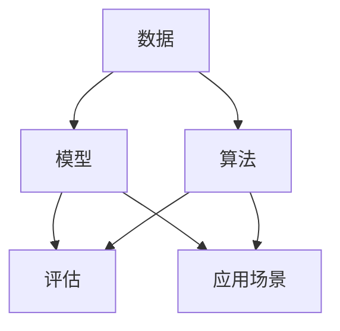

                 

## 关键词
- 海洋塑料污染
- 人工智能
- 机器学习
- 计算机视觉
- 数据挖掘
- 海洋监测

## 摘要
本文全面探讨了人工智能在海洋塑料污染监测中的应用。首先，对海洋塑料污染的现状、成因和危害进行了概述，强调了监测的重要性。接着，介绍了人工智能的定义和发展历程，以及其在机器学习、计算机视觉和数据挖掘领域的主要技术特点。然后，详细阐述了人工智能在海洋塑料污染监测中的具体应用，包括机器学习算法、计算机视觉技术和数据挖掘技术。通过国内外典型案例分析，展示了人工智能在海洋塑料污染监测中的实际应用效果。文章最后，探讨了海洋塑料污染监测中的人工智能技术挑战和未来发展趋势，并对相关政策与法规进行了总结。本文旨在为研究人员和实践者提供一个全面、系统的参考，推动海洋塑料污染监测技术的发展。

## 目录

### 第一部分：海洋塑料污染问题概述

1. [海洋塑料污染现状](#海洋塑料污染现状)
2. [海洋塑料污染监测的重要性](#海洋塑料污染监测的重要性)

### 第二部分：人工智能概述

1. [人工智能的定义和发展历程](#人工智能的定义和发展历程)
2. [人工智能的主要技术分类和特点](#人工智能的主要技术分类和特点)

### 第三部分：人工智能在海洋塑料污染监测中的应用

1. [机器学习算法的应用](#机器学习算法的应用)
2. [计算机视觉技术的应用](#计算机视觉技术的应用)
3. [数据挖掘技术的应用](#数据挖掘技术的应用)

### 第四部分：案例研究

1. [国内外海洋塑料污染监测案例研究](#国内外海洋塑料污染监测案例研究)

### 第五部分：技术挑战与未来展望

1. [技术挑战](#技术挑战)
2. [未来展望](#未来展望)

### 第六部分：政策与法规

1. [我国海洋塑料污染监测的政策和法规](#我国海洋塑料污染监测的政策和法规)
2. [国际海洋塑料污染监测的政策和法规](#国际海洋塑料污染监测的政策和法规)

### 第七部分：总结与展望

1. [总结](#总结)
2. [展望](#展望)

### 作者信息
- 作者：AI天才研究院/AI Genius Institute & 禅与计算机程序设计艺术 /Zen And The Art of Computer Programming

## 海洋塑料污染现状

### 海洋塑料污染的定义和分布

海洋塑料污染是指由于人类活动导致的大量塑料废弃物进入海洋，对海洋生态系统和人类健康造成严重影响的污染现象。这些塑料废弃物主要包括塑料袋、瓶子、渔网、玩具等，它们在海洋中经过长时间的光照、海浪作用和生物降解，逐渐分解成微塑料。

根据国际海洋污染研究机构的统计数据，全球每年约有8百万吨的塑料废弃物进入海洋，相当于每分钟有一个垃圾卡车装的塑料废弃物进入海洋。这些塑料废弃物主要分布在北太平洋、北大西洋和南太平洋等海域，形成了著名的“垃圾带”。

### 海洋塑料污染的主要来源

海洋塑料污染的主要来源包括以下几个方面：

1. **陆地废弃：**由于垃圾处理不当，大量的塑料废弃物被丢弃到河流、湖泊和海洋中。

2. **海洋倾倒：**历史上，一些国家曾将垃圾倾倒入海洋，造成严重的污染。

3. **海上活动：**海上运输、渔业和海洋旅游等活动也会产生大量的塑料废弃物。

4. **海上生产：**海上石油、天然气开采等活动也会产生塑料废弃物。

### 海洋塑料污染的危害

海洋塑料污染对海洋生态系统和人类健康造成了巨大的危害，具体表现在以下几个方面：

1. **危害海洋生物：**海洋塑料污染会直接导致海洋生物的死亡，特别是那些误食塑料的海洋生物。此外，塑料废弃物还会缠绕在海洋生物的身体上，导致其受伤甚至死亡。

2. **破坏海洋生态平衡：**海洋塑料污染会破坏海洋生态系统的平衡，影响海洋生物的繁殖和生长。

3. **污染海水：**海洋塑料污染会导致海水中的化学物质含量增加，对海洋生物的健康产生负面影响。

4. **影响人类健康：**海洋塑料污染中的有害物质可以通过食物链进入人体，对人类健康造成潜在威胁。

### 海洋塑料污染监测的重要性

海洋塑料污染监测对于了解海洋塑料污染的现状、评估污染程度和制定有效的防治措施具有重要意义。具体来说，海洋塑料污染监测的重要性体现在以下几个方面：

1. **了解污染状况：**通过监测，可以了解海洋塑料污染的分布和浓度，从而更好地了解污染状况。

2. **评估污染程度：**通过监测，可以评估海洋塑料污染对海洋生态系统和人类健康的影响程度。

3. **制定防治措施：**基于监测数据，可以制定出更加有效的防治措施，减少海洋塑料污染。

4. **推动政策制定：**监测数据可以为政府和国际组织制定相关政策和法规提供科学依据。

总之，海洋塑料污染监测是保护海洋环境和人类健康的重要手段，具有重要的科学意义和应用价值。

### 人工智能的定义和发展历程

人工智能（Artificial Intelligence, AI）是计算机科学的一个分支，旨在使计算机具备类似于人类智能的能力。从狭义上讲，人工智能指的是通过模拟人类思维过程来实现的机器智能。从广义上讲，人工智能还包括了模仿动物或其他生物智能的各种技术。

#### 人工智能的发展历程

人工智能的发展历程可以分为以下几个阶段：

1. **早期探索（1940s-1950s）：** 这一阶段以图灵测试的提出为标志，人工智能的概念开始出现。1956年，达特茅斯会议正式确立了人工智能作为一门学科的诞生。

2. **繁荣时期（1960s-1970s）：** 这一时期，人工智能研究取得了显著进展，诸如专家系统等关键技术得到了广泛应用。

3. **低谷期（1980s-1990s）：** 由于实际应用中的困难，人工智能研究进入了一个相对低谷期。然而，这一时期的数据库技术和算法优化仍然为后续发展奠定了基础。

4. **复兴时期（2000s-今）：** 随着深度学习、神经网络等技术的突破，人工智能迎来了新一轮的快速发展。特别是2012年，深度学习在图像识别任务上取得的突破性成果，标志着人工智能进入了新的时代。

#### 人工智能的主要技术分类和特点

人工智能主要分为以下几个技术类别：

1. **机器学习（Machine Learning）：** 机器学习是使计算机从数据中学习规律和模式的技术。其核心是通过算法自动从数据中学习并做出预测或决策。机器学习主要分为监督学习、无监督学习和强化学习。

2. **计算机视觉（Computer Vision）：** 计算机视觉是使计算机具备理解、解释和处理图像或视频数据的能力。其应用广泛，包括图像识别、目标检测和图像生成等。

3. **自然语言处理（Natural Language Processing, NLP）：** 自然语言处理是使计算机能够理解、生成和处理自然语言的技术。NLP在机器翻译、情感分析和文本分类等方面有广泛应用。

4. **语音识别（Speech Recognition）：** 语音识别是使计算机能够理解和处理人类语音的技术。其应用包括语音助手、语音控制等。

5. **机器人（Robotics）：** 机器人是集成了人工智能技术，能够模拟人类行为或执行特定任务的设备。机器人广泛应用于制造业、服务业和医疗等领域。

#### 核心概念与联系

为了更好地理解人工智能在不同领域的应用，我们需要了解以下几个核心概念及其之间的关系：

1. **数据：** 数据是机器学习的基石。无论是机器学习、计算机视觉还是自然语言处理，都需要大量的数据来训练模型。

2. **模型：** 模型是基于算法和数据构建的数学结构，用于模拟和预测。不同类型的模型适用于不同的任务。

3. **算法：** 算法是实现特定任务的一系列步骤。机器学习中的算法包括线性回归、决策树、神经网络等。

4. **评估：** 评估是检验模型性能的重要手段。常用的评估指标包括准确率、召回率、F1分数等。

5. **应用场景：** 应用场景是指人工智能技术在具体领域的应用。例如，计算机视觉在图像识别、目标检测中的应用。

以下是这些概念之间的关系架构 Mermaid 流程图：

通过以上流程图，我们可以清晰地看到数据、模型、算法和评估之间的相互关系，以及它们如何共同构建出人工智能技术的应用场景。

### 人工智能的主要技术特点

人工智能技术在不同的领域有着广泛的应用，其核心在于机器学习、计算机视觉和数据挖掘等方面。以下分别介绍这些技术的定义、基本原理和特点。

#### 机器学习

机器学习（Machine Learning, ML）是人工智能的核心技术之一，它使得计算机能够从数据中学习，并做出预测或决策。机器学习主要分为监督学习、无监督学习和强化学习。

1. **监督学习（Supervised Learning）：** 监督学习是有标注数据（输入和输出对）的训练过程。其目标是找到一种模型，使得模型在新的、未标注的数据上能够准确预测输出。常见的算法包括线性回归、决策树、支持向量机（SVM）和神经网络。

2. **无监督学习（Unsupervised Learning）：** 无监督学习没有标注数据，其目标是从未标注的数据中找到数据间的规律或结构。常见的算法包括聚类（如K-means、层次聚类）、降维（如PCA）和关联规则学习（如Apriori算法）。

3. **强化学习（Reinforcement Learning）：** 强化学习是通过与环境的交互，学习最佳行动策略的过程。其目标是通过最大化累积奖励，学会在特定环境下做出最优决策。常见的算法包括Q学习、深度Q网络（DQN）和策略梯度算法。

**基本原理：**
机器学习的基本原理是通过学习数据中的特征和模式，构建一个数学模型，使得模型在新的数据上能够做出准确的预测或决策。这一过程通常包括以下几个步骤：
1. 数据预处理：包括数据清洗、数据变换、数据标准化等。
2. 模型选择：选择适合问题的模型，如线性回归、决策树、神经网络等。
3. 训练模型：使用训练数据训练模型，调整模型的参数。
4. 模型评估：使用验证集或测试集评估模型性能，如准确率、召回率、F1分数等。
5. 模型优化：根据评估结果，调整模型参数或选择不同的模型。

**特点：**
机器学习具有以下几个特点：
1. **自适应性：** 机器学习模型可以根据新的数据自动调整其参数，适应不同的环境。
2. **泛化能力：** 机器学习模型需要在新的、未见过的数据上也能做出准确的预测。
3. **可扩展性：** 机器学习算法可以处理大规模的数据集，且能够处理不同类型的数据，如数值、文本、图像等。

#### 计算机视觉

计算机视觉（Computer Vision, CV）是使计算机具备理解和解释图像或视频数据的能力。计算机视觉在图像识别、目标检测、图像生成等领域有着广泛的应用。

**基本原理：**
计算机视觉的基本原理是通过图像处理、特征提取和模式识别等步骤，使计算机能够理解图像中的信息。

1. **图像处理：** 图像处理是对图像进行预处理，以提取有用的信息。常见的图像处理技术包括滤波、边缘检测、分割等。
2. **特征提取：** 特征提取是从图像中提取具有区分性的特征，用于后续的模型训练。常见的特征提取方法包括HOG（方向梯度直方图）、SIFT（尺度不变特征变换）和卷积神经网络（CNN）等。
3. **模式识别：** 模式识别是基于提取的特征，对图像中的对象进行分类和识别。常见的模式识别方法包括支持向量机（SVM）、决策树和深度学习等。

**特点：**
计算机视觉具有以下几个特点：
1. **高精度：** 通过先进的算法和模型，计算机视觉能够对图像进行高精度的识别和检测。
2. **实时性：** 计算机视觉系统能够对实时视频流进行处理，实现快速响应。
3. **自适应能力：** 计算机视觉系统能够适应不同的光照条件、场景和对象。

#### 数据挖掘

数据挖掘（Data Mining, DM）是从大量数据中提取有价值信息的过程。数据挖掘在市场分析、风险评估、生物信息学等领域有着广泛的应用。

**基本原理：**
数据挖掘的基本原理是通过统计学、机器学习和数据库技术，从海量数据中挖掘出有价值的模式、关联和趋势。

1. **数据预处理：** 数据预处理包括数据清洗、数据变换、数据标准化等，以消除数据中的噪声和不一致性。
2. **特征选择：** 特征选择是从原始数据中提取最有用的特征，以减少数据维度，提高模型性能。
3. **模式识别：** 模式识别是通过算法，从数据中挖掘出隐藏的模式、关联和趋势。常见的模式识别方法包括聚类、分类、关联规则学习等。
4. **模型评估：** 模型评估是评估数据挖掘结果的质量，如准确率、召回率、F1分数等。

**特点：**
数据挖掘具有以下几个特点：
1. **高效性：** 数据挖掘能够处理海量数据，实现快速的信息提取和模式识别。
2. **智能化：** 数据挖掘通过机器学习和人工智能技术，实现自动化的信息提取和模式识别。
3. **可扩展性：** 数据挖掘算法和模型可以适应不同的数据类型和应用场景，具有较好的可扩展性。

### 人工智能在海洋塑料污染监测中的应用

人工智能技术在海洋塑料污染监测中发挥着越来越重要的作用。通过机器学习、计算机视觉和数据挖掘等技术，人工智能能够高效、准确地监测和分析海洋塑料污染的情况。以下分别介绍这些技术在不同应用场景中的具体应用。

#### 机器学习算法的应用

机器学习算法在海洋塑料污染监测中的应用主要包括数据预处理、特征提取、模型训练和评估等环节。

1. **数据预处理：** 海洋塑料污染监测数据通常包含大量的噪声和缺失值，需要进行预处理。常用的数据预处理方法包括数据清洗、归一化和缺失值填补等。例如，可以使用KNN算法进行缺失值填补，使用PCA进行数据归一化。

2. **特征提取：** 特征提取是机器学习算法的核心环节。在海洋塑料污染监测中，可以从遥感图像、现场监测数据和环境参数中提取特征。常用的特征提取方法包括纹理特征、颜色特征和形状特征等。例如，可以使用SIFT算法提取图像中的纹理特征，使用HSV颜色模型提取颜色特征。

3. **模型训练：** 模型训练是通过已标注的数据集，训练机器学习模型。在海洋塑料污染监测中，常用的机器学习模型包括线性回归、决策树、支持向量机和神经网络等。例如，可以使用线性回归模型预测海洋塑料污染浓度，使用决策树模型分类海洋垃圾的类型。

4. **模型评估：** 模型评估是检验模型性能的重要环节。常用的评估指标包括准确率、召回率、F1分数等。例如，可以使用交叉验证方法评估模型的泛化能力，使用ROC曲线评估模型的分类性能。

**应用案例：** 
在海洋塑料污染监测中，机器学习算法可以用于预测海洋塑料污染的浓度和分布。例如，研究人员可以使用遥感图像和现场监测数据，训练机器学习模型，预测特定海域的塑料污染浓度。通过不断优化模型，可以提高预测的准确性和可靠性。

#### 计算机视觉技术的应用

计算机视觉技术在海洋塑料污染监测中主要用于图像处理和目标检测。

1. **图像处理：** 图像处理是计算机视觉技术的核心环节。在海洋塑料污染监测中，图像处理可以用于去除噪声、增强图像对比度和分割目标区域。常用的图像处理方法包括滤波、边缘检测和图像分割等。例如，可以使用中值滤波去除图像噪声，使用Canny边缘检测算法提取图像边缘，使用基于阈值的分割方法分离塑料垃圾和背景。

2. **目标检测：** 目标检测是计算机视觉技术的重要应用之一。在海洋塑料污染监测中，目标检测可以用于识别和定位海洋中的塑料垃圾。常用的目标检测算法包括传统方法和深度学习方法。传统方法如Viola-Jones算法、HOG+SVM等，深度学习方法如YOLO、SSD、Faster R-CNN等。例如，可以使用YOLO算法检测图像中的塑料垃圾，使用SSD算法实现实时目标检测。

**应用案例：** 
在海洋塑料污染监测中，计算机视觉技术可以用于实时监测海洋中的塑料垃圾。例如，研究人员可以使用无人机搭载摄像头，实时拍摄海洋表面，使用计算机视觉技术检测和识别塑料垃圾。通过实时监测，可以及时了解海洋塑料污染的情况，采取相应的防治措施。

#### 数据挖掘技术的应用

数据挖掘技术在海洋塑料污染监测中主要用于分析监测数据，提取有价值的信息和知识。

1. **聚类分析：** 聚类分析是一种无监督学习方法，用于将数据集划分为若干个类别，使得同一类别中的数据点彼此相似，不同类别中的数据点差异较大。在海洋塑料污染监测中，聚类分析可以用于识别不同类型的塑料垃圾。例如，可以使用K-means算法对遥感图像进行聚类，区分不同类型的塑料垃圾。

2. **关联规则挖掘：** 关联规则挖掘是一种用于发现数据之间关联关系的方法。在海洋塑料污染监测中，关联规则挖掘可以用于分析不同因素之间的关系，如气象条件、海洋流动等对塑料污染分布的影响。例如，可以使用Apriori算法分析不同因素之间的关联规则。

3. **分类与预测：** 分类与预测是一种监督学习方法，用于将新数据分类到已有的类别中，或预测新数据的属性。在海洋塑料污染监测中，分类与预测可以用于预测海洋中的塑料污染浓度和分布。例如，可以使用决策树算法对遥感图像进行分类，预测塑料污染的浓度和分布。

**应用案例：** 
在海洋塑料污染监测中，数据挖掘技术可以用于分析大量监测数据，提取有价值的信息。例如，研究人员可以使用聚类分析识别不同类型的塑料垃圾，使用关联规则挖掘分析气象条件、海洋流动等因素对塑料污染分布的影响。通过这些分析，可以更好地了解海洋塑料污染的规律和趋势，为防治措施提供科学依据。

### 国内外海洋塑料污染监测案例研究

#### 国外海洋塑料污染监测案例研究

**1. 北大西洋垃圾带监测项目：** 
北大西洋垃圾带是世界上最大的海洋塑料垃圾堆积区之一。为了更好地了解和监测该区域的塑料污染情况，国际组织合作开展了多个监测项目。这些项目包括使用卫星遥感技术监测垃圾带的分布和浓度，使用无人机和船只进行实地调查，收集海洋塑料垃圾样本，并使用机器学习算法分析样本数据。这些监测项目为研究人员提供了丰富的数据，有助于更好地了解北大西洋垃圾带的情况，并制定相应的防治措施。

**2. 海洋保护组织的监测项目：** 
多个海洋保护组织在全球范围内开展了海洋塑料污染监测项目。例如，美国海洋保护组织“海洋守护者”在全球多个海域进行监测，使用无人机和卫星遥感技术监测塑料污染情况。这些项目不仅收集了大量的数据，还通过公众教育和宣传活动提高了公众对海洋塑料污染问题的认识。

#### 国内海洋塑料污染监测案例研究

**1. 中国科学院海洋研究所监测项目：** 
中国科学院海洋研究所是我国海洋科学研究的权威机构，针对海洋塑料污染问题，开展了多个监测项目。这些项目包括在沿海地区布设监测点，定期收集海洋塑料垃圾样本，使用计算机视觉技术和数据挖掘技术分析样本数据。通过这些项目，研究人员对海洋塑料污染的分布和规律有了更深入的了解，为制定防治措施提供了科学依据。

**2. 海洋环境监测站监测项目：** 
我国沿海地区的海洋环境监测站也开展了多个海洋塑料污染监测项目。这些项目包括使用遥感技术监测沿海海域的塑料污染情况，使用船只和无人机进行实地调查，收集海洋塑料垃圾样本，并使用机器学习算法分析样本数据。通过这些项目，海洋环境监测站能够及时了解海洋塑料污染的情况，为政府和相关部门制定防治措施提供数据支持。

#### 案例分析和总结

通过以上国内外海洋塑料污染监测案例的研究，我们可以得出以下结论：

1. **技术手段多样化：** 国内外海洋塑料污染监测项目采用了多种技术手段，包括遥感技术、无人机、船只实地调查、计算机视觉技术和数据挖掘技术等。这些技术的综合应用提高了监测的准确性和效率。

2. **数据收集和分析：** 各个监测项目都注重数据的收集和分析。通过收集大量的样本数据和遥感数据，研究人员可以更准确地了解海洋塑料污染的分布和浓度，为防治措施提供科学依据。

3. **公众参与和宣传：** 海洋塑料污染监测项目不仅关注技术手段和数据收集，还注重公众参与和宣传。通过公众教育和宣传活动，提高了公众对海洋塑料污染问题的认识，增强了公众的环保意识。

4. **国际合作：** 国际海洋塑料污染监测项目通常涉及多个国家或组织的合作，共享数据和技术，共同应对海洋塑料污染问题。

总之，国内外海洋塑料污染监测案例研究表明，人工智能技术在海洋塑料污染监测中具有广泛的应用前景。通过多种技术手段的综合应用，可以更准确地监测和评估海洋塑料污染的情况，为防治措施提供科学依据。同时，公众参与和国际合作也是推动海洋塑料污染监测和防治工作的重要手段。

### 技术挑战与未来展望

在海洋塑料污染监测中，人工智能技术虽然展现出巨大的潜力和优势，但仍面临一系列技术挑战。以下是这些挑战及未来展望的详细讨论。

#### 数据质量挑战

**问题分析：**
海洋塑料污染监测所依赖的数据质量直接影响监测结果的准确性。然而，海洋环境复杂多变，导致数据收集过程中容易出现噪声、误差和缺失值。此外，海洋中的塑料废弃物种类繁多，尺寸和颜色各异，增加了数据处理的难度。

**解决方案：**
1. **数据预处理：** 在数据收集后，进行严格的数据清洗和预处理，去除噪声和异常值。
2. **多源数据融合：** 结合多种数据源（如遥感数据、现场监测数据和卫星图像等），提高数据的综合性和准确性。
3. **半监督学习和迁移学习：** 利用已有数据，通过半监督学习和迁移学习技术，对新的、未标注的数据进行有效利用。

**未来展望：**
未来，随着数据采集技术和算法的进步，数据质量将得到显著提升。例如，基于5G和物联网技术的数据采集系统，可以实现更高效、更精准的数据收集。

#### 模型解释性挑战

**问题分析：**
在海洋塑料污染监测中，人工智能模型通常采用复杂的深度学习算法。这些算法具有强大的预测能力，但模型内部决策过程往往不透明，难以解释。这在一定程度上限制了模型在监管和决策中的应用。

**解决方案：**
1. **模型可解释性技术：** 发展可解释性机器学习（Explainable AI, XAI）技术，如LIME、SHAP等，帮助理解模型决策过程。
2. **透明度和审计能力：** 增强模型的透明度，建立审计机制，确保模型在监管和合规性方面的可行性。

**未来展望：**
随着XAI技术的发展，未来将实现更透明、更易于解释的人工智能模型，提高模型在海洋塑料污染监测中的应用价值。

#### 隐私和安全挑战

**问题分析：**
海洋塑料污染监测通常涉及大量的个人和环境数据，这些数据可能包含敏感信息。此外，人工智能系统的安全性和抗攻击能力也是一个重要问题。

**解决方案：**
1. **隐私保护技术：** 利用差分隐私、联邦学习等技术，确保数据在传输和存储过程中的隐私保护。
2. **安全防护措施：** 加强系统安全防护，防止数据泄露和模型被恶意攻击。

**未来展望：**
未来，随着隐私保护技术和安全防护措施的不断改进，海洋塑料污染监测中的数据隐私和安全问题将得到更好解决。

#### 未来海洋塑料污染监测技术的发展趋势

**1. 深度学习和迁移学习：** 深度学习算法将在海洋塑料污染监测中发挥更大作用。通过迁移学习，利用已有的模型和算法，快速适应新的监测任务。

**2. 联邦学习：** 联邦学习技术将实现数据在本地处理，减少数据传输过程中的隐私泄露风险，提高数据安全性。

**3. 集成多种传感器数据：** 结合多种传感器数据（如卫星遥感、无人机、水下机器人等），实现更全面、更精准的海洋塑料污染监测。

**4. 可持续性和环境友好：** 未来，海洋塑料污染监测技术将更加注重可持续性和环境友好，采用更环保的设备和材料。

总之，随着人工智能技术的不断进步，海洋塑料污染监测将变得更加高效、精准和安全。通过解决当前的技术挑战，人工智能将在未来为海洋环境保护和治理提供更强有力的支持。

### 政策与法规

#### 我国海洋塑料污染监测的政策和法规

我国在海洋塑料污染监测方面制定了一系列政策和法规，以应对日益严峻的海洋塑料污染问题。以下是我国海洋塑料污染监测政策与法规的主要内容和实施情况：

1. **《中华人民共和国海洋环境保护法》**：该法是我国关于海洋环境保护的基本法律，明确规定了对海洋污染的防治要求，包括对塑料废弃物污染的监管。

2. **《关于进一步加强塑料污染治理的意见》**：这是我国政府发布的关于塑料污染治理的重要文件，明确了塑料污染治理的阶段性目标和主要任务，其中包括加强海洋塑料污染的监测和防治。

3. **《全国海洋环境保护规划》**：该规划是我国关于海洋环境保护的长期规划，涉及海洋塑料污染的监测、防治和治理措施，为我国海洋塑料污染监测提供了政策指导。

4. **《海洋监测技术规范》**：该规范是我国关于海洋监测的技术指南，包括海洋塑料污染监测的方法和标准，为海洋塑料污染监测提供了技术依据。

**实施情况：**
我国政府高度重视海洋塑料污染问题，通过制定和实施相关政策与法规，推动海洋塑料污染监测工作。例如，各级海洋环境监测机构定期开展海洋塑料污染监测，收集相关数据，并向政府部门报告。同时，政府还通过公众宣传、教育和立法等多种手段，提高公众对海洋塑料污染问题的认识，促进全社会共同参与海洋环境保护。

#### 国际海洋塑料污染监测的政策和法规

全球范围内，各国和地区也制定了相应的政策和法规，以应对海洋塑料污染问题。以下是一些主要国家和地区在海洋塑料污染监测方面的政策和法规：

1. **联合国环境规划署（UNEP）**：UNEP发布了《全球塑料污染问题报告》，提出了一系列减少海洋塑料污染的措施，包括加强监测和数据共享。

2. **欧盟**：欧盟通过《单一塑料指令》和《海洋战略框架指令》，对塑料废弃物的管理提出具体要求，包括减少塑料废弃物进入海洋，加强海洋塑料污染监测。

3. **美国**：美国政府通过《海洋塑料污染预防法案》，加强对海洋塑料污染的监管，鼓励开展相关研究和监测工作。

4. **日本**：日本政府制定了《海洋塑料垃圾行动计划》，通过加强监测和科学研究，减少海洋塑料污染。

**国际合作与数据共享：**
国际社会在海洋塑料污染监测方面也进行了广泛的合作。例如，通过国际海洋污染研究委员会（ICOP）和全球环境监测系统（GEMS/MAR）等平台，各国共享海洋塑料污染监测数据，共同研究和解决海洋塑料污染问题。此外，国际组织如联合国环境规划署（UNEP）和联合国教科文组织（UNESCO）也通过提供技术支持和政策建议，推动全球海洋塑料污染监测工作。

总之，我国和国际上各国和地区在海洋塑料污染监测方面已经采取了多项政策和法规，并通过国际合作和数据共享，共同应对这一全球性挑战。

### 总结与展望

#### 全书主要内容回顾

本文从海洋塑料污染的现状、成因和危害入手，探讨了海洋塑料污染监测的重要性。随后，介绍了人工智能的定义、发展历程及其在机器学习、计算机视觉和数据挖掘领域的应用。在核心内容部分，详细阐述了人工智能在海洋塑料污染监测中的具体应用，包括机器学习算法、计算机视觉技术和数据挖掘技术的介绍及其在监测中的实际应用。通过国内外案例研究，展示了人工智能在海洋塑料污染监测中的效果。最后，分析了海洋塑料污染监测中的人工智能技术挑战，探讨了未来发展趋势，并总结了相关政策与法规。

#### 海洋塑料污染监测的重要意义

海洋塑料污染监测对于环境保护和人类健康具有重要意义。首先，通过监测可以准确了解海洋塑料污染的分布、浓度和变化趋势，为制定有效的防治措施提供科学依据。其次，海洋塑料污染监测有助于评估污染程度，为政府和国际组织制定相关政策提供数据支持。此外，监测数据还可以用于公众教育和宣传，提高公众对海洋塑料污染问题的认识和参与度。

#### 人工智能在海洋塑料污染监测中的应用价值

人工智能技术在海洋塑料污染监测中展现出巨大的应用价值。首先，通过机器学习算法，可以高效地处理和分析大量监测数据，发现污染规律和趋势。其次，计算机视觉技术能够实时监测和识别海洋中的塑料垃圾，提供准确的数据支持。此外，数据挖掘技术可以帮助研究人员从海量数据中提取有价值的信息和知识，为污染防治提供指导。总之，人工智能技术在提高监测效率、准确性和科学性方面具有重要作用。

#### 未来海洋塑料污染监测的发展趋势

未来，海洋塑料污染监测将在以下几个方面取得重要进展：

1. **技术进步：** 随着人工智能、大数据和物联网等技术的不断进步，海洋塑料污染监测将变得更加高效、精准和智能化。

2. **国际合作：** 国际社会将在海洋塑料污染监测方面进行更加紧密的合作，共享数据和技术，共同应对这一全球性挑战。

3. **政策法规完善：** 各国政府和国际组织将制定更加严格和完善的政策与法规，加强对海洋塑料污染的监管和治理。

4. **公众参与：** 公众教育和参与将得到进一步加强，提高全社会的环保意识和行动力。

总之，随着技术的不断进步和全球合作的深化，海洋塑料污染监测将在未来发挥更加重要的作用，为保护海洋环境和人类健康作出更大贡献。

### 展望

随着人工智能技术的不断发展和应用，海洋塑料污染监测领域正迎来前所未有的机遇和挑战。未来，人工智能在海洋塑料污染监测中的应用将更加深入和广泛，为全球海洋环境的保护提供强有力的技术支持。

#### 应用前景

1. **智能监测系统：** 未来，基于人工智能的智能监测系统将得到广泛应用。这些系统集成了多种传感器和监测技术，能够实时、精准地监测海洋中的塑料污染情况。通过大数据分析和机器学习算法，系统能够自动识别和分类塑料垃圾，提供实时数据支持。

2. **预测模型：** 人工智能算法将在海洋塑料污染预测中发挥重要作用。通过分析历史监测数据和环境因素，人工智能模型能够预测未来一段时间内的塑料污染趋势，为政府和企业制定防治策略提供科学依据。

3. **自动化治理：** 人工智能技术将推动海洋塑料污染的自动化治理。例如，无人船、无人机和智能机器人等装备将搭载人工智能系统，实现自主监测和清理塑料垃圾，提高治理效率。

#### 我国海洋塑料污染监测的政策建议

1. **加强政策支持：** 政府应加大对海洋塑料污染监测的政策支持，制定明确的监测标准和规范，推动监测技术的研发和应用。

2. **提高监测能力：** 加强海洋环境监测机构的建设，提升监测设备的先进性和数据处理能力，确保监测数据的准确性和实时性。

3. **加强国际合作：** 积极参与国际海洋塑料污染监测项目，加强数据共享和合作，借鉴国际先进技术和经验，提升我国海洋塑料污染监测水平。

4. **公众参与：** 通过公众宣传和教育活动，提高公众对海洋塑料污染问题的认识，鼓励社会各界共同参与海洋环境保护。

总之，未来海洋塑料污染监测技术的发展将依赖于人工智能技术的进步和国际合作的深化。通过科学监测、精准预测和自动化治理，我们有理由相信，海洋塑料污染问题将得到有效缓解，全球海洋环境将得到更好的保护。

