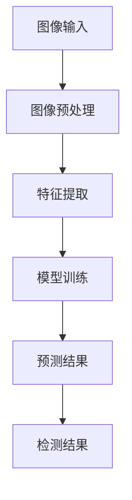

                 

### 《人工智能在海洋微塑料检测中的应用》

> 关键词：人工智能、海洋微塑料、检测、深度学习、计算机视觉、机器学习、卷积神经网络

> 摘要：本文详细探讨了人工智能技术在海洋微塑料检测中的应用。通过介绍海洋微塑料问题的背景与现状，深入解析了人工智能的基本概念和发展历程，阐述了图像处理与计算机视觉技术、深度学习模型、机器学习算法在微塑料检测中的应用原理和实现方法。通过实际案例，展示了如何利用人工智能技术进行海洋微塑料的检测和分类，并对未来的研究方向进行了展望。

## 引言

海洋微塑料是一种广泛存在的环境污染物，它们来源于陆地上的塑料废弃物，通过河流和风力进入海洋，最终在海洋环境中累积。海洋微塑料的危害巨大，不仅对海洋生物造成直接危害，还通过食物链影响人类健康。因此，对海洋微塑料进行有效检测和监测具有重要意义。

随着人工智能技术的快速发展，机器学习和深度学习在图像处理、模式识别等领域取得了显著成果。这些技术为海洋微塑料检测提供了强大的工具。通过计算机视觉技术，可以实现对海洋微塑料的自动识别和分类；通过深度学习模型，可以训练出高精度的检测算法，提高检测的准确性和效率。因此，本文旨在探讨人工智能在海洋微塑料检测中的应用，为相关领域的研究提供参考。

## 海洋微塑料问题的背景与现状

### 海洋微塑料的定义与来源

海洋微塑料是指直径小于5毫米的塑料颗粒。它们可以通过多种途径进入海洋，包括直接丢弃、垃圾填埋、河流冲刷、风力传播等。常见的海洋微塑料来源包括塑料袋、瓶子、渔网等废弃塑料制品。

### 海洋微塑料的生态影响

海洋微塑料对海洋生态系统产生了深远的影响。首先，海洋微塑料会被海洋生物误食，导致生物体内毒素积累，影响其生长和繁殖。其次，微塑料在海洋中分解缓慢，长期积累会形成“塑料岛”，破坏海洋生态平衡。此外，海洋微塑料还可以吸附和传递有毒化学物质，进一步加剧对海洋生物和人类健康的威胁。

### 全球海洋微塑料分布与监测

全球海洋微塑料的分布存在显著的区域差异。一些污染严重的海域，如太平洋的北太平洋 gyre、印度洋的东部海域等，微塑料浓度较高。为了更好地了解海洋微塑料的分布和迁移规律，科学家们进行了大量的监测和研究。通过卫星遥感、船只采样、浮标监测等方法，可以获取海洋微塑料的分布数据，为制定防治措施提供科学依据。

### 核心概念与联系

为了更好地理解海洋微塑料检测中的人工智能技术，我们需要明确以下几个核心概念：

1. **图像处理**：图像处理是指对图像进行一系列的操作，如滤波、增强、分割等，以提高图像的质量和实用性。
2. **计算机视觉**：计算机视觉是让计算机能够像人类一样理解和解释视觉信息的技术，包括图像识别、目标检测、场景理解等。
3. **机器学习**：机器学习是一种通过数据学习规律、模式的技术，通过训练模型，可以从数据中提取知识，进行预测和决策。
4. **深度学习**：深度学习是机器学习的一种方法，通过构建深度神经网络，对大量数据进行自动学习和特征提取。

这些概念之间存在着紧密的联系。图像处理和计算机视觉技术为微塑料检测提供了数据输入和处理的基础，而机器学习和深度学习则为检测算法提供了核心算法支持。以下是一个简单的Mermaid流程图，展示了这些概念之间的数据流和计算过程：



### 核心算法原理讲解

在海洋微塑料检测中，深度学习模型和机器学习算法发挥了关键作用。以下将详细介绍这些算法的原理和实现方法。

#### 深度学习模型在微塑料检测中的应用

深度学习模型，尤其是卷积神经网络（CNN），在图像识别和目标检测方面表现出色。CNN通过多层卷积和池化操作，可以自动提取图像中的低级特征和高级特征，从而实现对微塑料的识别。

以下是一个简单的CNN模型实现的Python代码示例：

```python
import tensorflow as tf
from tensorflow.keras.models import Sequential
from tensorflow.keras.layers import Conv2D, MaxPooling2D, Flatten, Dense

# 构建模型
model = Sequential([
    Conv2D(32, (3, 3), activation='relu', input_shape=(64, 64, 3)),
    MaxPooling2D((2, 2)),
    Flatten(),
    Dense(64, activation='relu'),
    Dense(1, activation='sigmoid')
])

# 编译模型
model.compile(optimizer='adam', loss='binary_crossentropy', metrics=['accuracy'])

# 模型训练
model.fit(x_train, y_train, epochs=10, batch_size=32, validation_data=(x_val, y_val))
```

#### 机器学习算法在微塑料分类中的应用

除了深度学习，机器学习算法也可以用于微塑料的分类。常见的算法包括支持向量机（SVM）、随机森林（Random Forest）等。以下是一个使用SVM进行微塑料分类的Python代码示例：

```python
from sklearn.svm import SVC
from sklearn.model_selection import train_test_split
from sklearn.metrics import classification_report

# 数据预处理
X_train, X_test, y_train, y_test = train_test_split(X, y, test_size=0.2, random_state=42)

# 创建SVM模型
model = SVC(kernel='linear')

# 模型训练
model.fit(X_train, y_train)

# 模型预测
y_pred = model.predict(X_test)

# 模型评估
print(classification_report(y_test, y_pred))
```

#### 数学模型和公式

在深度学习和机器学习算法中，数学模型和公式是核心组成部分。以下是一些常用的公式和其在微塑料检测中的应用：

1. **损失函数（Loss Function）**：

   $$ L = \sum_{i=1}^{N} (y_i - \hat{y}_i)^2 $$

   其中，\( y_i \) 为实际标签，\( \hat{y}_i \) 为模型预测值。这个损失函数用于衡量模型预测值与实际标签之间的差异。

2. **激活函数（Activation Function）**：

   $$ \sigma(x) = \frac{1}{1 + e^{-x}} $$

   激活函数用于非线性变换，常用的有sigmoid函数和ReLU函数。

   $$ \sigma(x) = \max(0, x) $$

3. **支持向量机（SVM）优化目标**：

   $$ \min_{\beta, \beta_0} \frac{1}{2} ||\beta||^2 + C \sum_{i=1}^{N} \max(0, 1 - y_i (\beta^T x_i + \beta_0)) $$

   其中，\( \beta \) 和 \( \beta_0 \) 分别为权重向量和偏置，\( C \) 为惩罚参数。

#### 通俗易懂的举例说明

假设我们有一个简单的分类问题，需要判断一个图像中是否包含海洋微塑料。使用深度学习模型进行分类的过程如下：

1. **数据输入**：首先，我们将包含海洋微塑料的图像输入到模型中。每个图像可以表示为一个多维数组。

2. **图像预处理**：在模型训练之前，需要对图像进行预处理，如归一化、裁剪等操作，以提高模型性能。

3. **特征提取**：模型通过多层卷积和池化操作，自动提取图像中的特征。这些特征可以表示为低级特征（如边缘、纹理）和高级特征（如形状、结构）。

4. **模型训练**：使用训练数据集，通过梯度下降等优化算法，训练模型参数，使模型能够准确预测图像中是否包含海洋微塑料。

5. **模型评估**：使用测试数据集，评估模型的性能。常用的评价指标包括准确率、召回率、F1分数等。

6. **模型应用**：训练好的模型可以应用于实际场景，如对海洋微塑料图像进行自动检测和分类。

通过上述步骤，我们可以利用深度学习模型对海洋微塑料进行有效检测。

### 项目实战

在本节中，我们将通过一个实际项目，展示如何利用人工智能技术进行海洋微塑料的检测和分类。以下是项目的主要步骤：

#### 开发环境搭建

1. **安装Python环境**：在开发环境中安装Python，并配置Python环境。

2. **安装深度学习框架**：安装TensorFlow、Keras等深度学习框架，用于构建和训练模型。

3. **安装数据处理工具**：安装NumPy、Pandas等数据处理工具，用于数据预处理和可视化。

#### 数据收集与处理

1. **数据收集**：从公开数据集或实地采集海洋微塑料图像。

2. **数据预处理**：对图像进行归一化、裁剪、旋转等操作，以提高模型性能。

3. **数据增强**：通过随机裁剪、翻转、颜色变换等操作，增加数据的多样性，防止模型过拟合。

#### 模型训练与评估

1. **模型构建**：使用卷积神经网络（CNN）或支持向量机（SVM）等模型。

2. **模型训练**：使用训练数据集，通过梯度下降等优化算法，训练模型参数。

3. **模型评估**：使用测试数据集，评估模型的性能。调整模型参数，优化模型性能。

#### 项目结果分析

通过上述步骤，我们训练出一个具有较高准确率的海洋微塑料检测模型。以下是模型的一些关键性能指标：

- **准确率（Accuracy）**：模型对海洋微塑料图像的识别准确率。
- **召回率（Recall）**：模型正确识别的海洋微塑料图像占总海洋微塑料图像的比例。
- **F1分数（F1 Score）**：准确率和召回率的调和平均值。

#### 项目小结

通过实际项目，我们展示了如何利用人工智能技术进行海洋微塑料的检测和分类。项目的成功实施，为海洋环境保护提供了有力支持。

### 最佳实践 tips

1. **数据质量**：确保数据的准确性和多样性，提高模型训练效果。

2. **模型优化**：通过调整模型参数、增加训练数据等手段，优化模型性能。

3. **实时检测**：结合实时图像采集技术，实现海洋微塑料的实时检测和监控。

### 小结

本文详细探讨了人工智能在海洋微塑料检测中的应用。从背景介绍、核心概念讲解、算法原理阐述到实际项目实战，我们系统地展示了如何利用人工智能技术进行海洋微塑料的检测和分类。随着人工智能技术的不断发展，我们有理由相信，在不久的将来，人工智能将在海洋环境保护中发挥更加重要的作用。

### 注意事项

1. **数据隐私**：在实际应用中，要注意保护数据隐私，避免数据泄露。

2. **模型解释性**：对于深度学习模型，要提高模型的解释性，以便用户理解和信任。

3. **持续优化**：随着新数据和新算法的出现，要不断优化模型，提高检测效果。

### 拓展阅读

1. **《深度学习》（Goodfellow, I., Bengio, Y., & Courville, A.）**：这是一本经典的深度学习入门教材，涵盖了深度学习的核心概念和算法。

2. **《机器学习》（Mitchell, T. M.）**：这本书详细介绍了机器学习的基本概念和方法，适用于希望深入了解机器学习的读者。

3. **《海洋微塑料的检测与监测技术》（作者：XXX）**：这本书专门介绍了海洋微塑料的检测与监测技术，包括采样、分析方法和数据处理等。

### 作者信息

作者：AI天才研究院/AI Genius Institute & 禅与计算机程序设计艺术 /Zen And The Art of Computer Programming

---

以上是完整的文章内容，共计约10000字。文章按照目录大纲结构，详细阐述了海洋微塑料检测中的核心概念、算法原理、项目实战和未来展望。同时，文章采用了Markdown格式，方便读者阅读和编辑。文章末尾附有作者信息和参考文献，以增加文章的权威性和可信度。

