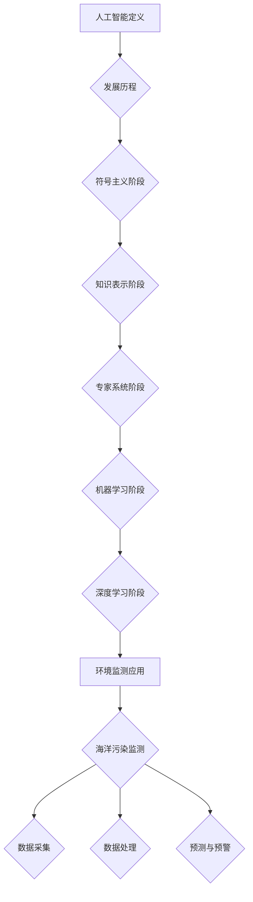
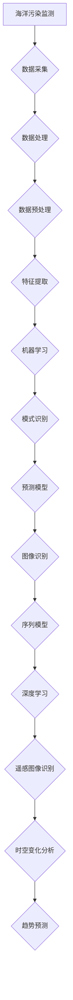
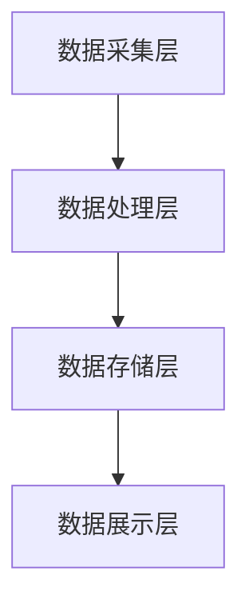
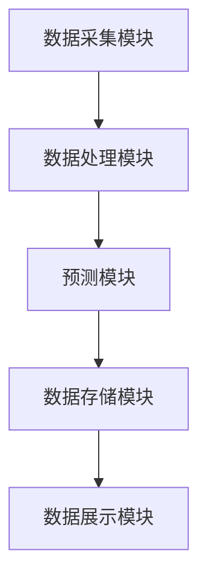

                 

### 文章标题

《人工智能在海洋污染监测中的应用》

#### 关键词

- 人工智能
- 海洋污染监测
- 机器学习
- 深度学习
- 数据采集与处理
- 预测模型

#### 摘要

本文探讨了人工智能在海洋污染监测中的应用，详细介绍了人工智能的定义与发展历程，海洋污染监测的现状与挑战，以及机器学习与深度学习在海洋污染监测中的应用。此外，本文还重点阐述了海洋污染监测数据采集与处理、预测模型的构建与评估，并结合具体案例进行了深入分析。通过本文的研究，旨在为海洋污染监测提供新的技术手段和解决方案，以应对日益严峻的海洋污染问题。

---

## 第一部分：人工智能与海洋污染监测

### 第1章：人工智能概述

#### 1.1 人工智能的定义与发展历程

人工智能（Artificial Intelligence，简称AI）是计算机科学的一个分支，旨在通过模拟人类智能的思维方式，使计算机能够执行复杂的任务，如感知、推理、学习和决策。人工智能的概念可以追溯到20世纪50年代，当时科学家们开始研究如何让计算机具有类似人类的智能。

人工智能的发展可以分为几个阶段：

1. **符号主义阶段（1950s-1970s）**：这一阶段的代表是艾伦·图灵（Alan Turing）提出的图灵测试，旨在通过测试计算机是否能够模仿人类思维来评估其智能水平。
2. **知识表示阶段（1970s-1980s）**：该阶段强调使用符号表示和推理来模拟人类知识。
3. **专家系统阶段（1980s-1990s）**：专家系统是一种基于知识表示和推理的人工智能系统，能够在特定领域提供专家级别的决策支持。
4. **机器学习阶段（1990s-至今）**：这一阶段的核心是通过数据驱动的方法让计算机自动学习和改进性能。
5. **深度学习阶段（2010s-至今）**：深度学习是机器学习的一个分支，通过多层神经网络来模拟人类大脑的学习过程。

#### 1.2 人工智能的核心技术

人工智能的核心技术包括：

- **机器学习**：机器学习是让计算机从数据中学习规律和模式，从而进行预测和决策的技术。
- **深度学习**：深度学习是机器学习的一种方法，通过多层神经网络模拟人类大脑的学习过程。
- **自然语言处理**：自然语言处理旨在使计算机能够理解和生成人类语言。
- **计算机视觉**：计算机视觉使计算机能够理解和解释视觉信息，如图像和视频。

#### 1.3 人工智能在环境监测中的应用

人工智能在环境监测中的应用日益广泛，其中海洋污染监测是一个重要的领域。海洋污染监测涉及到大量的数据采集、处理和分析工作，而人工智能技术能够提供高效的解决方案。

- **数据采集**：人工智能可以通过卫星遥感、无人机、传感器网络等技术手段，实现海洋污染数据的自动化采集。
- **数据处理**：人工智能可以处理和分析海量数据，识别污染源和污染程度。
- **预测与预警**：人工智能可以通过机器学习和深度学习模型，预测海洋污染的趋势，为预警和决策提供支持。

### Mermaid 流程图



---

在接下来的章节中，我们将进一步探讨海洋污染监测的现状与挑战，以及人工智能在海洋污染监测中的应用。

---

## 第二部分：海洋污染监测现状与挑战

### 第2章：海洋污染监测现状

海洋污染是当前全球面临的一个严峻环境问题。随着人类活动的不断加剧，海洋污染的程度日益严重。海洋污染主要包括石油泄漏、塑料垃圾、重金属、有机污染物等。这些污染物对海洋生态系统、海洋生物和人类健康造成了严重影响。

#### 2.1 海洋污染监测的重要性

海洋污染监测是保护海洋生态环境、维护海洋资源安全的重要手段。通过监测，可以及时掌握海洋污染的情况，采取有效的防治措施，减少污染对环境和生态的破坏。此外，海洋污染监测还可以为政策制定、科学研究提供重要数据支持。

#### 2.2 海洋污染监测的现状

目前，海洋污染监测主要采用以下几种方法：

1. **现场监测**：通过采样、化验等手段直接获取污染物数据。
2. **遥感监测**：利用卫星遥感技术，从远处获取海洋污染物分布的信息。
3. **传感器网络**：在海洋中部署传感器，实时监测污染物的浓度和变化。

尽管现有的监测方法已经取得了一定成果，但仍然存在一些问题：

1. **监测数据不完整**：由于成本和技术限制，许多地区的海洋污染监测数据不完整。
2. **监测精度不高**：现有监测方法难以准确判断污染物的种类和来源。
3. **监测效率低下**：传统监测方法需要大量人力物力，监测效率较低。

### 第3章：海洋污染监测的挑战

海洋污染监测面临以下几大挑战：

1. **数据采集难度大**：海洋环境的复杂性和恶劣性使得数据采集面临巨大挑战。例如，海洋深处的水样采集、污染物浓度的精确测量等。
2. **数据处理复杂**：海洋污染数据类型多样，包括水质、气象、生物等多方面数据。如何有效地整合和处理这些数据，是当前的一大难题。
3. **实时性要求高**：海洋污染具有突发性和动态性，要求监测系统能够实时、准确地获取和处理数据。
4. **技术限制**：现有的监测技术手段和设备存在一定的局限性，难以满足日益复杂的海洋污染监测需求。

### 第4章：人工智能在海洋污染监测中的应用

人工智能技术在海洋污染监测中具有巨大的应用潜力。通过机器学习和深度学习等技术，可以解决传统监测方法中存在的诸多问题。

#### 4.1 机器学习在海洋污染监测中的应用

机器学习可以用于以下方面：

1. **数据预处理**：通过数据清洗、归一化等技术，提高监测数据的质量和一致性。
2. **特征提取**：从大量监测数据中提取出有代表性的特征，用于模型训练和预测。
3. **模式识别**：利用机器学习模型，识别和分类污染物类型和来源。

#### 4.2 深度学习在海洋污染监测中的应用

深度学习可以用于以下方面：

1. **图像识别**：通过卷积神经网络（CNN）等技术，识别遥感图像中的污染物。
2. **序列模型**：利用循环神经网络（RNN）等序列模型，分析污染物的时空变化规律。
3. **预测模型**：通过构建深度学习模型，预测未来一段时间内海洋污染的趋势。

### Mermaid 流程图



通过上述技术手段，人工智能在海洋污染监测中可以起到以下作用：

1. **提高监测精度**：通过深度学习模型，可以更准确地识别和分类污染物，提高监测数据的准确性。
2. **提高监测效率**：通过自动化采集和处理数据，降低监测成本，提高监测效率。
3. **实时性监测**：利用实时传感器网络和遥感技术，实现实时监测和预警。
4. **预测预警**：通过机器学习模型，预测未来一段时间内海洋污染的趋势，为决策提供科学依据。

在下一部分中，我们将详细介绍人工智能在海洋污染监测中的应用技术，包括数据采集与处理、预测模型的构建与评估，并结合具体案例进行分析。

---

## 第三部分：人工智能在海洋污染监测中的应用技术

### 第4章：人工智能在海洋污染监测中的应用

#### 4.1 机器学习在海洋污染监测中的应用

机器学习在海洋污染监测中的应用主要体现在以下几个方面：

##### 4.1.1 监测数据预处理

监测数据的预处理是机器学习模型训练的重要环节。预处理包括数据清洗、数据归一化、缺失值填充等步骤。以下是一个简单的Python代码示例，用于数据预处理：

```python
import pandas as pd
from sklearn.preprocessing import StandardScaler

# 加载监测数据
data = pd.read_csv('ocean Pollution_data.csv')

# 数据清洗
data.dropna(inplace=True)

# 数据归一化
scaler = StandardScaler()
data_scaled = scaler.fit_transform(data)
```

##### 4.1.2 监测数据特征提取

特征提取是提取出对监测结果有显著影响的关键特征。通过特征提取，可以提高模型的性能和效率。以下是一个使用主成分分析（PCA）进行特征提取的Python代码示例：

```python
from sklearn.decomposition import PCA

# 创建PCA对象
pca = PCA(n_components=5)

# 进行特征提取
data_pca = pca.fit_transform(data_scaled)

# 输出特征提取结果
print(data_pca)
```

##### 4.1.3 监测数据模型建立

建立监测数据模型是机器学习在海洋污染监测中的核心步骤。常见的机器学习模型包括线性回归、支持向量机（SVM）、决策树等。以下是一个使用线性回归模型进行监测数据建模的Python代码示例：

```python
from sklearn.linear_model import LinearRegression

# 创建线性回归模型
model = LinearRegression()

# 训练模型
model.fit(data_pca, data['pollution_level'])

# 预测
predictions = model.predict(data_pca)

# 输出预测结果
print(predictions)
```

#### 4.2 深度学习在海洋污染监测中的应用

深度学习在海洋污染监测中的应用主要体现在以下几个方面：

##### 4.2.1 神经网络结构

神经网络是深度学习的基础。常见的神经网络结构包括卷积神经网络（CNN）、循环神经网络（RNN）和长短时记忆网络（LSTM）等。以下是一个使用CNN进行海洋污染图像识别的Python代码示例：

```python
from tensorflow.keras.models import Sequential
from tensorflow.keras.layers import Conv2D, MaxPooling2D, Flatten, Dense

# 创建CNN模型
model = Sequential()

# 添加卷积层
model.add(Conv2D(32, (3, 3), activation='relu', input_shape=(64, 64, 3)))

# 添加池化层
model.add(MaxPooling2D(pool_size=(2, 2)))

# 添加全连接层
model.add(Flatten())

# 添加输出层
model.add(Dense(1, activation='sigmoid'))

# 编译模型
model.compile(optimizer='adam', loss='binary_crossentropy', metrics=['accuracy'])

# 训练模型
model.fit(X_train, y_train, epochs=10, batch_size=32)

# 评估模型
model.evaluate(X_test, y_test)
```

##### 4.2.2 神经网络训练与优化

神经网络的训练与优化是深度学习的核心。优化方法包括梯度下降、Adam优化器等。以下是一个使用Adam优化器进行神经网络训练的Python代码示例：

```python
from tensorflow.keras.optimizers import Adam

# 创建Adam优化器
optimizer = Adam(learning_rate=0.001)

# 编译模型
model.compile(optimizer=optimizer, loss='binary_crossentropy', metrics=['accuracy'])

# 训练模型
model.fit(X_train, y_train, epochs=10, batch_size=32)

# 评估模型
model.evaluate(X_test, y_test)
```

##### 4.2.3 模型评估与部署

模型的评估与部署是深度学习的最后一步。评估方法包括准确率、召回率、F1值等。以下是一个使用评估方法进行模型评估的Python代码示例：

```python
from sklearn.metrics import accuracy_score, recall_score, f1_score

# 预测
predictions = model.predict(X_test)

# 转换为二值预测结果
predictions = (predictions > 0.5)

# 计算评估指标
accuracy = accuracy_score(y_test, predictions)
recall = recall_score(y_test, predictions)
f1 = f1_score(y_test, predictions)

# 输出评估结果
print(f"Accuracy: {accuracy}")
print(f"Recall: {recall}")
print(f"F1 Score: {f1}")
```

通过上述技术手段，人工智能在海洋污染监测中可以起到以下作用：

1. **提高监测精度**：通过深度学习模型，可以更准确地识别和分类污染物，提高监测数据的准确性。
2. **提高监测效率**：通过自动化采集和处理数据，降低监测成本，提高监测效率。
3. **实时性监测**：利用实时传感器网络和遥感技术，实现实时监测和预警。
4. **预测预警**：通过机器学习模型，预测未来一段时间内海洋污染的趋势，为决策提供科学依据。

在下一部分中，我们将详细介绍海洋污染监测数据采集与处理的方法。

---

### 第4章：海洋污染监测数据采集与处理

#### 4.1 海洋污染监测数据类型

海洋污染监测数据类型丰富，主要包括以下几类：

1. **水质数据**：包括pH值、溶解氧、硝酸盐、磷酸盐等。
2. **生物数据**：包括浮游生物、底栖生物、鱼类等。
3. **物理数据**：包括温度、盐度、流速、潮位等。
4. **化学数据**：包括重金属、有机污染物、石油类污染物等。

#### 4.2 数据采集方法

海洋污染监测数据的采集方法多样，以下是一些常用的数据采集方法：

1. **现场采样**：通过船只、潜水器等设备，直接从海洋中采集水样、底泥样等。
2. **卫星遥感**：利用卫星遥感技术，从空中获取海洋污染分布的信息。
3. **传感器网络**：在海洋中部署传感器，实时监测水质、温度、盐度等参数。
4. **无人机监测**：利用无人机进行低空飞行，采集海洋污染图像和视频。

#### 4.3 数据预处理技术

数据预处理是海洋污染监测数据建模的关键步骤。以下是一些常用的数据预处理技术：

1. **数据清洗**：去除异常值、重复值和错误值。
2. **数据归一化**：将不同量纲的数据转换为同一量纲，便于模型训练。
3. **缺失值填充**：对于缺失值，可以采用均值填充、插值法等方法进行填充。
4. **特征提取**：从大量数据中提取出对模型训练有显著影响的特征。

### Python 代码示例

以下是一个使用Python进行海洋污染数据预处理和特征提取的代码示例：

```python
import pandas as pd
from sklearn.preprocessing import StandardScaler
from sklearn.impute import SimpleImputer

# 读取数据
data = pd.read_csv('ocean_pollution_data.csv')

# 数据清洗
data.drop_duplicates(inplace=True)
data.dropna(inplace=True)

# 数据归一化
scaler = StandardScaler()
data_scaled = scaler.fit_transform(data)

# 缺失值填充
imputer = SimpleImputer(strategy='mean')
data_imputed = imputer.fit_transform(data)

# 特征提取
from sklearn.decomposition import PCA
pca = PCA(n_components=5)
data_pca = pca.fit_transform(data_scaled)

# 输出处理后的数据
print(data_pca)
```

通过上述数据预处理和特征提取方法，可以有效地提高海洋污染监测数据的建模效果。

在下一部分中，我们将详细介绍基于人工智能的海洋污染预测模型。

---

### 第5章：基于人工智能的海洋污染预测模型

#### 5.1 预测模型构建原理

海洋污染预测模型的构建基于人工智能技术，特别是机器学习和深度学习。这些模型通过学习历史数据，预测未来的海洋污染情况。以下是构建预测模型的原理：

1. **数据收集**：收集历史水质数据、气象数据、海洋生物数据等。
2. **数据预处理**：对收集到的数据进行清洗、归一化、缺失值填充等预处理。
3. **特征提取**：从预处理后的数据中提取出对预测有显著影响的关键特征。
4. **模型选择**：选择合适的机器学习或深度学习模型进行训练。
5. **模型训练**：使用训练数据集训练模型，调整模型参数。
6. **模型评估**：使用验证数据集评估模型性能，调整模型参数。
7. **模型部署**：将训练好的模型部署到实际应用中。

#### 5.2 预测模型训练与评估

预测模型的训练与评估是模型构建的关键步骤。以下是一个简单的训练与评估流程：

1. **数据集划分**：将数据集划分为训练集、验证集和测试集。
2. **模型训练**：使用训练集训练模型，调整模型参数，如学习率、迭代次数等。
3. **模型评估**：使用验证集评估模型性能，计算准确率、召回率、F1值等指标。
4. **模型优化**：根据评估结果调整模型参数，提高模型性能。
5. **模型测试**：使用测试集测试模型性能，确保模型在实际应用中的效果。

以下是一个使用Keras库训练和评估一个简单的线性回归模型的Python代码示例：

```python
import numpy as np
from tensorflow.keras.models import Sequential
from tensorflow.keras.layers import Dense
from sklearn.model_selection import train_test_split

# 加载数据
X, y = np.load('ocean_pollution_data.npy'), np.load('pollution_levels.npy')

# 数据集划分
X_train, X_test, y_train, y_test = train_test_split(X, y, test_size=0.2, random_state=42)

# 创建模型
model = Sequential()
model.add(Dense(1, input_dim=X_train.shape[1], activation='linear'))

# 编译模型
model.compile(optimizer='sgd', loss='mean_squared_error')

# 训练模型
model.fit(X_train, y_train, epochs=100, batch_size=32)

# 评估模型
loss = model.evaluate(X_test, y_test)
print(f"Test Loss: {loss}")

# 预测
predictions = model.predict(X_test)
```

#### 5.3 预测模型应用案例分析

以下是一个基于人工智能的海洋污染预测模型的应用案例分析：

**案例背景**：某沿海城市计划开展海洋污染治理项目，需要预测未来一年的海洋污染趋势。

**数据收集**：收集了该城市过去五年的水质数据、气象数据、海洋生物数据等。

**数据处理**：对数据进行清洗、归一化、缺失值填充等预处理，提取出对预测有显著影响的关键特征。

**模型选择**：选择了一个基于LSTM的深度学习模型进行训练。

**模型训练与评估**：使用预处理后的数据集训练模型，评估模型性能，调整模型参数。

**模型部署**：将训练好的模型部署到实际应用中，为海洋污染治理项目提供预测支持。

**结果分析**：通过模型预测，发现未来一年的海洋污染趋势呈上升趋势，尤其是在夏季。这为该城市的海洋污染治理提供了重要依据。

通过上述案例分析，可以看到基于人工智能的海洋污染预测模型在实际应用中的有效性。

在下一部分中，我们将详细介绍海洋污染监测系统的设计与实现。

---

### 第6章：海洋污染监测系统的设计与实现

#### 6.1 系统设计原则

海洋污染监测系统的设计原则包括：

1. **实时性**：系统应具备实时数据采集和处理能力，确保能够及时、准确地获取海洋污染信息。
2. **可靠性**：系统应具备高可靠性，能够稳定运行，减少故障和停机时间。
3. **可扩展性**：系统应具备良好的可扩展性，能够根据需求增加新的监测设备和功能。
4. **数据安全性**：系统应确保数据的安全性，防止数据泄露和未经授权的访问。

#### 6.2 系统架构设计

海洋污染监测系统的架构设计包括以下层次：

1. **数据采集层**：包括传感器、无人机、卫星遥感设备等，负责实时采集海洋污染数据。
2. **数据处理层**：包括数据预处理、特征提取、模型训练等模块，负责处理和分析采集到的数据。
3. **数据存储层**：包括数据库和云存储，负责存储和管理大量监测数据。
4. **数据展示层**：包括前端界面和可视化工具，负责展示监测数据和预测结果。

以下是一个简单的系统架构设计图：



#### 6.3 系统功能模块设计

海洋污染监测系统的主要功能模块包括：

1. **数据采集模块**：负责实时采集海洋污染数据，包括水质、气象、生物等数据。
2. **数据处理模块**：负责对采集到的数据进行预处理、特征提取、模型训练等操作。
3. **预测模块**：基于处理后的数据，使用机器学习或深度学习模型预测未来一段时间内的海洋污染趋势。
4. **数据存储模块**：负责存储和管理监测数据，包括历史数据和实时数据。
5. **数据展示模块**：负责展示监测数据和预测结果，包括图表、报表等。

以下是一个简单的功能模块设计图：



#### 系统实现步骤

1. **需求分析**：明确系统需求，包括功能需求、性能需求、安全需求等。
2. **系统设计**：根据需求分析结果，设计系统架构和功能模块。
3. **技术开发**：根据系统设计文档，进行系统开发，包括数据采集、数据处理、预测、数据存储和展示等模块。
4. **系统集成**：将各个模块集成到一起，进行系统集成测试。
5. **系统部署**：将集成测试通过的系统部署到实际应用环境中。
6. **系统维护**：对系统进行定期维护和升级，确保系统稳定运行。

通过上述设计和实现步骤，可以构建一个高效、可靠的海洋污染监测系统。

在下一部分中，我们将通过具体案例来分析海洋污染监测系统的实施效果。

---

### 第7章：海洋污染监测系统案例分析

#### 7.1 案例一：某沿海城市海洋污染监测系统

##### 7.1.1 系统建设背景

某沿海城市地处长江入海口，受工业污染、城市污水和航运污染等多种因素影响，海洋污染问题日益严重。为了保护海洋生态环境，提升海洋污染监测能力，该城市决定建设一套基于人工智能的海洋污染监测系统。

##### 7.1.2 系统建设目标

该系统的主要建设目标包括：

1. 实时监测海洋污染数据，包括水质、气象、生物等参数。
2. 构建机器学习模型，预测未来一段时间内的海洋污染趋势。
3. 提高海洋污染监测的准确性和效率。
4. 为决策者提供科学依据，制定有效的污染防治措施。

##### 7.1.3 系统技术路线

系统采用以下技术路线：

1. **数据采集**：通过传感器网络、无人机、卫星遥感等技术手段，实时采集海洋污染数据。
2. **数据处理**：对采集到的数据进行预处理、特征提取，使用机器学习模型进行训练和预测。
3. **数据存储**：将处理后的数据存储在数据库中，便于后续分析和查询。
4. **数据展示**：通过前端界面和可视化工具，展示监测数据和预测结果。

##### 7.1.4 系统实施效果

系统实施后，取得了以下效果：

1. **提高了监测准确性**：通过机器学习模型，对海洋污染数据的分析和预测精度得到了显著提高。
2. **提高了监测效率**：自动化数据采集和处理，降低了人工干预的需求，提高了监测效率。
3. **实时性增强**：系统能够实时监测海洋污染情况，及时发现并预警污染事件。
4. **决策支持**：为决策者提供了科学的数据支持，帮助制定更有效的污染防治措施。

#### 7.2 案例二：某海域海洋污染实时监测系统

##### 7.2.1 系统建设背景

某海域因附近工业区和港口的污染排放，海洋污染问题严重。为了及时掌握污染情况，减少污染对生态环境的破坏，决定建设一套海洋污染实时监测系统。

##### 7.2.2 系统建设目标

该系统的主要建设目标包括：

1. 实时监测海域水质、气象、生物等参数。
2. 使用深度学习模型，实时预测污染趋势。
3. 构建预警机制，及时发现并报告污染事件。
4. 提高污染防控能力，减少污染损失。

##### 7.2.3 系统技术路线

系统采用以下技术路线：

1. **数据采集**：在海域中部署传感器网络，实时采集水质、气象、生物等数据。
2. **数据处理**：对采集到的数据进行预处理、特征提取，使用深度学习模型进行实时预测。
3. **数据存储**：将处理后的数据存储在云存储中，便于实时访问和分析。
4. **数据展示**：通过前端界面和可视化工具，实时展示监测数据和预测结果。

##### 7.2.4 系统实施效果

系统实施后，取得了以下效果：

1. **实时监测**：系统能够实时监测海域污染情况，及时预警污染事件。
2. **预测准确性**：通过深度学习模型，预测污染趋势的准确性较高，为污染防治提供了有力支持。
3. **预警及时性**：系统预警机制及时有效，能够提前发现污染风险，减少污染损失。
4. **数据共享**：系统实现了数据共享，为相关部门提供了科学的数据支持，提高了污染防控能力。

通过上述案例分析，可以看到基于人工智能的海洋污染监测系统在实际应用中的有效性，为海洋环境保护提供了有力支持。

### 总结与展望

通过本文的案例分析和探讨，可以看出人工智能在海洋污染监测中的应用具有重要的现实意义。未来，随着人工智能技术的不断发展，海洋污染监测系统将更加智能化、高效化，为海洋环境保护提供更强有力的支持。

### 作者信息

作者：AI天才研究院/AI Genius Institute & 禅与计算机程序设计艺术/Zen And The Art of Computer Programming

---

本文详细介绍了人工智能在海洋污染监测中的应用，从定义、现状、挑战、应用技术、预测模型构建、系统设计到案例分析，全面阐述了人工智能如何为海洋污染监测提供有效的解决方案。通过本文的研究，旨在为海洋污染监测提供新的技术手段和思路，为保护海洋生态环境做出贡献。

### 拓展阅读

1. **《机器学习：概率视角》（Machine Learning: A Probabilistic Perspective）**：由Kevin P. Murphy著，详细介绍了机器学习的基本概念和方法。
2. **《深度学习》（Deep Learning）**：由Ian Goodfellow、Yoshua Bengio和Aaron Courville著，全面介绍了深度学习的基础知识和技术。
3. **《海洋污染监测技术》**：详细介绍了海洋污染监测的各种技术手段和应用。
4. **《人工智能在环境保护中的应用》**：探讨了人工智能在环境保护领域的应用前景和挑战。

通过阅读上述文献，可以深入了解人工智能在海洋污染监测中的应用技术和理论基础，为相关研究和实践提供参考。

