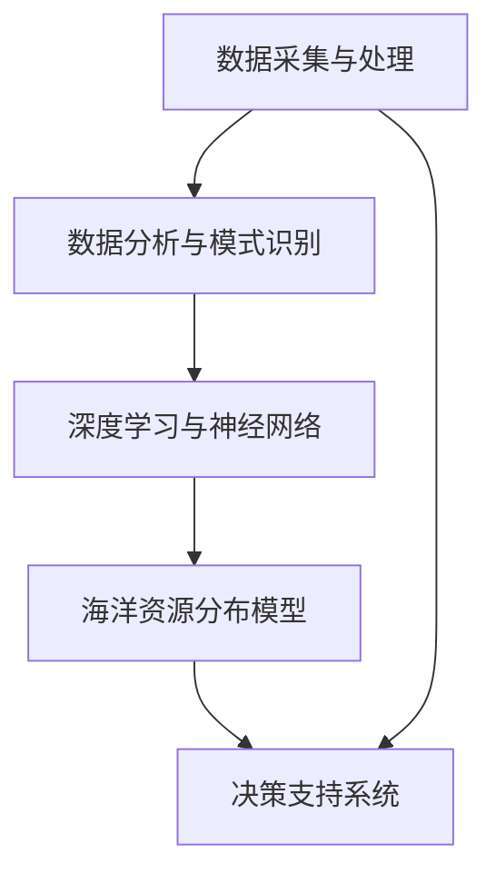

                 

### 文章标题：人工智能在海洋资源勘探中的应用

在当今全球信息化和智能化迅猛发展的时代，人工智能（AI）技术已成为推动社会进步的重要力量。随着海洋资源的开发和利用日益受到重视，人工智能在海洋资源勘探中的应用也日益广泛。本文旨在探讨人工智能在海洋资源勘探中的实际应用，分析其核心概念、算法原理和项目实战，为相关领域的研究者和从业者提供参考和指导。

### 文章关键词

- 人工智能
- 海洋资源勘探
- 数据分析
- 深度学习
- 模式识别

### 文章摘要

本文首先介绍了人工智能在海洋资源勘探中的背景和重要性，接着详细阐述了人工智能在海洋资源勘探中的应用领域和关键技术。通过核心算法原理讲解和数学模型解析，本文深入探讨了人工智能在海洋资源勘探中的应用方法和实施步骤。最后，本文通过实际项目实战和代码解读，展示了人工智能在海洋资源勘探中的具体应用效果，并提出了最佳实践建议。

### 目录

1. **理解用户需求**
2. **背景介绍**
3. **核心概念与联系**
4. **核心算法原理讲解**
5. **数学模型与公式解析**
6. **项目实战**
7. **代码实战与解读**
8. **最佳实践 tips**
9. **小结**
10. **注意事项**
11. **拓展阅读**
12. **作者信息**

---

### 理解用户需求

用户希望通过本文全面了解人工智能在海洋资源勘探中的应用，并掌握相关技术原理和实战方法。为此，本文将按照以下结构进行撰写：

- **背景介绍**：介绍人工智能和海洋资源勘探的基本概念和现状。
- **核心概念与联系**：分析人工智能在海洋资源勘探中的应用场景，并通过 Mermaid 流程图展示核心概念之间的关系。
- **核心算法原理讲解**：详细讲解人工智能在海洋资源勘探中的核心算法原理，并使用 Python 源代码进行阐述。
- **数学模型与公式解析**：介绍海洋资源勘探中的常用数学模型和公式，并使用 LaTeX 格式进行表示。
- **项目实战**：介绍实际海洋资源勘探项目，展示项目的开发环境搭建、源代码实现和代码解读。
- **代码实战与解读**：通过具体案例，展示人工智能在海洋资源勘探中的实际应用，并进行分析和讲解。
- **最佳实践 tips**：总结最佳实践经验和注意事项，为读者提供实际操作的指导。
- **小结**：对全文进行总结，强调人工智能在海洋资源勘探中的重要作用和未来发展趋势。

---

### 背景介绍

#### 人工智能的发展历程

人工智能（AI）是一门研究、开发用于模拟、延伸和扩展人类智能的理论、方法、技术及应用系统的学科。自1956年达特茅斯会议以来，人工智能已经走过了几十年的发展历程。从早期的符号主义、知识表示和推理方法，到现代的机器学习和深度学习，人工智能在理论、算法和应用层面都取得了显著的进步。

#### 海洋资源勘探的现状

海洋资源勘探是海洋科学的重要分支，旨在发现和评估海洋中的矿产资源、能源资源、生物资源等。随着海洋资源的日益重要，海洋资源勘探技术不断进步。传统的勘探方法主要依赖于地质调查、地球物理勘探和地球化学勘探等技术手段。然而，这些方法在数据获取和处理方面存在一定的局限性。

近年来，随着人工智能技术的快速发展，其在海洋资源勘探中的应用日益广泛。例如，通过机器学习算法对大量海洋数据进行挖掘和分析，可以更准确地预测海洋资源的分布情况。深度学习模型在地震数据处理、海底地形分析等方面也表现出强大的能力。

#### 人工智能在海洋资源勘探中的重要性

人工智能在海洋资源勘探中的应用具有重要意义。首先，它可以提高勘探效率，减少人力和时间成本。其次，人工智能可以处理大量复杂数据，提取有价值的信息，帮助科学家更好地理解海洋资源的分布规律。此外，人工智能还可以辅助决策，提高勘探项目的成功率。

总之，人工智能在海洋资源勘探中的应用不仅具有现实意义，也具有重要的战略价值。通过本文的探讨，我们将进一步了解人工智能在海洋资源勘探中的实际应用，为相关领域的研究者和从业者提供参考。

---

### 核心概念与联系

在探讨人工智能在海洋资源勘探中的应用时，我们需要了解几个核心概念及其相互之间的关系。以下是这些核心概念及其联系：

#### 1. 数据采集与处理

数据采集是海洋资源勘探的重要环节。通过多种传感器设备，如声呐、雷达、卫星等，可以获取大量关于海洋地形、地质构造、生物资源等方面的数据。然而，这些数据通常包含噪声、缺失值和冗余信息，因此需要通过数据处理技术进行清洗和预处理。

#### 2. 数据分析与模式识别

数据处理后的数据需要通过分析技术提取有价值的信息。数据分析包括统计分析、数据挖掘和机器学习等方法。模式识别是数据分析的一个分支，旨在从数据中识别出具有相似特征的样本或模式。

#### 3. 深度学习与神经网络

深度学习和神经网络是人工智能的核心技术。深度学习模型通过多层神经元的非线性组合，可以自动提取数据中的特征。神经网络则是深度学习的基础，它通过不断调整权重和偏置，使得模型能够更好地拟合数据。

#### 4. 海洋资源分布模型

海洋资源分布模型是用于预测海洋资源分布规律的数学模型。这些模型通常基于统计学和概率论，通过分析历史数据和环境参数，预测未来的资源分布情况。

#### 5. 决策支持系统

决策支持系统（DSS）是利用人工智能技术为勘探项目提供决策支持的工具。DSS可以根据勘探数据和环境参数，生成勘探方案和风险评估报告，帮助决策者做出更加科学的决策。

#### 关系架构 Mermaid 流程图



通过以上核心概念及其相互关系的分析，我们可以看到，人工智能在海洋资源勘探中的应用是一个复杂的过程，需要多个技术环节的协同工作。以下是这些核心概念之间的Mermaid流程图，展示了它们在应用中的关系。

---

### 核心算法原理讲解

在海洋资源勘探中，人工智能的应用主要依赖于以下几个核心算法原理：神经网络与深度学习、支持向量机与贝叶斯模型。以下将分别对这几种算法进行详细讲解。

#### 神经网络与深度学习

神经网络是一种模拟生物神经系统的计算模型，由大量的神经元组成，通过调整神经元之间的权重和偏置来实现数据的自动特征提取和分类。深度学习是神经网络的一种扩展，通过多层神经元的组合，可以自动提取数据中的复杂特征。

##### 深度学习的基本原理

深度学习的基本原理包括以下几个步骤：

1. **数据预处理**：对原始数据进行清洗、归一化和分割，使其适合进行深度学习模型的训练。
2. **模型架构设计**：根据问题的需求，设计合适的神经网络架构，如卷积神经网络（CNN）、循环神经网络（RNN）等。
3. **模型训练**：通过反向传播算法，不断调整神经元的权重和偏置，使得模型能够更好地拟合训练数据。
4. **模型评估与优化**：使用验证集对模型进行评估，并根据评估结果调整模型参数，以提高模型的泛化能力。

##### Python 源代码示例

以下是一个简单的深度学习模型训练的 Python 源代码示例，使用 TensorFlow 和 Keras 库：

```python
import tensorflow as tf
from tensorflow.keras.models import Sequential
from tensorflow.keras.layers import Dense, Conv2D, Flatten
from tensorflow.keras.optimizers import Adam

# 数据预处理
(x_train, y_train), (x_test, y_test) = tf.keras.datasets.cifar10.load_data()
x_train, x_test = x_train / 255.0, x_test / 255.0

# 模型架构设计
model = Sequential([
    Conv2D(32, (3, 3), activation='relu', input_shape=(32, 32, 3)),
    Flatten(),
    Dense(64, activation='relu'),
    Dense(10, activation='softmax')
])

# 模型训练
model.compile(optimizer=Adam(), loss='sparse_categorical_crossentropy', metrics=['accuracy'])
model.fit(x_train, y_train, epochs=5, validation_split=0.2)

# 模型评估
test_loss, test_acc = model.evaluate(x_test, y_test)
print('Test accuracy:', test_acc)
```

#### 支持向量机与贝叶斯模型

支持向量机（SVM）是一种经典的机器学习算法，主要用于分类问题。贝叶斯模型是一种基于贝叶斯定理的概率模型，可以用于分类和预测。

##### 支持向量机的基本原理

支持向量机的基本原理是通过找到一个最优的超平面，将不同类别的数据点尽可能分开。支持向量是指那些位于超平面边缘的数据点，它们对模型的决策边界有重要影响。

1. **线性SVM**：适用于线性可分的数据集。
2. **核SVM**：通过引入核函数，可以将线性不可分的数据转换为线性可分的数据。
3. **SVM的优化问题**：通过求解最优化问题，找到最优的超平面。

##### 贝叶斯模型的基本原理

贝叶斯模型基于贝叶斯定理，通过概率分布来描述数据的分类和预测。贝叶斯模型分为以下几种：

1. **朴素贝叶斯**：假设特征之间相互独立，是最简单的贝叶斯模型。
2. **贝叶斯网络**：通过有向无环图（DAG）来表示特征之间的关系。
3. **贝叶斯优化**：利用贝叶斯统计方法进行参数优化。

##### Python 源代码示例

以下是一个使用 scikit-learn 库实现的朴素贝叶斯分类器的 Python 源代码示例：

```python
from sklearn.model_selection import train_test_split
from sklearn.naive_bayes import GaussianNB
from sklearn.datasets import load_iris

# 数据加载
iris = load_iris()
X_train, X_test, y_train, y_test = train_test_split(iris.data, iris.target, test_size=0.3, random_state=42)

# 模型训练
gnb = GaussianNB()
gnb.fit(X_train, y_train)

# 模型预测
predictions = gnb.predict(X_test)

# 模型评估
accuracy = gnb.score(X_test, y_test)
print('Accuracy:', accuracy)
```

通过以上对核心算法原理的讲解和 Python 源代码示例，我们可以看到，人工智能在海洋资源勘探中的应用不仅依赖于复杂的数据处理和分析技术，还需要深入理解和掌握各种机器学习算法的基本原理。这些算法在海洋资源勘探中发挥着重要作用，为科学研究和实际应用提供了强大的工具支持。

---

### 数学模型与公式解析

在海洋资源勘探中，数学模型和公式是理解和预测资源分布的重要工具。以下介绍几个常用的数学模型及其相关公式，以便更好地理解人工智能在勘探中的应用。

#### 概率模型与统计推断

概率模型用于描述海洋资源分布的不确定性。常见的概率模型包括正态分布、二项分布和泊松分布等。

1. **正态分布**：

   正态分布是海洋资源勘探中最常用的概率分布模型。其概率密度函数为：

   $$ f(x|\mu, \sigma^2) = \frac{1}{\sqrt{2\pi\sigma^2}} e^{-\frac{(x-\mu)^2}{2\sigma^2}} $$

   其中，$\mu$ 是均值，$\sigma^2$ 是方差。

2. **二项分布**：

   二项分布用于描述在固定次数的实验中，成功次数的概率分布。其概率质量函数为：

   $$ P(X = k) = C_n^k p^k (1-p)^{n-k} $$

   其中，$n$ 是实验次数，$k$ 是成功次数，$p$ 是每次实验成功的概率。

3. **泊松分布**：

   泊松分布用于描述在固定时间内，事件发生的次数的概率分布。其概率质量函数为：

   $$ P(X = k) = \frac{\lambda^k e^{-\lambda}}{k!} $$

   其中，$\lambda$ 是平均事件发生次数。

#### 最优化算法与求解

最优化算法用于求解海洋资源勘探中的最优决策。常见的最优化算法包括线性规划、非线性规划和贝叶斯优化等。

1. **线性规划**：

   线性规划用于求解线性目标函数在给定约束条件下的最优解。其标准形式为：

   $$ \min_{x} c^T x \quad \text{subject to} \quad Ax \leq b $$

   其中，$c$ 是目标函数系数向量，$x$ 是决策变量，$A$ 和 $b$ 分别是约束条件系数矩阵和常数向量。

2. **非线性规划**：

   非线性规划用于求解非线性目标函数在给定约束条件下的最优解。其形式更为复杂，常用的求解算法包括梯度下降法、牛顿法和拉格朗日乘数法等。

3. **贝叶斯优化**：

   贝叶斯优化是一种基于贝叶斯统计的优化算法，通过最大化后验概率分布来更新模型参数。其目标函数为：

   $$ \min_{x} \sum_{i=1}^n (x_i - \hat{x}_i)^2 $$

   其中，$x_i$ 是第 $i$ 个特征，$\hat{x}_i$ 是其最优值。

#### 海洋资源分布模型

海洋资源分布模型用于预测海洋资源在空间和时间上的分布。常见的模型包括高斯过程回归、克里金插值和贝叶斯网络等。

1. **高斯过程回归**：

   高斯过程回归是一种基于统计学习的非线性回归模型，其目标函数为：

   $$ f(x) = \int \int \mathcal{N}(x|\mu(x), \sigma^2(x)) \phi(d(x, y)) dx dy $$

   其中，$\mathcal{N}$ 是高斯分布，$\mu(x)$ 和 $\sigma^2(x)$ 分别是均值函数和方差函数，$\phi$ 是核函数。

2. **克里金插值**：

   克里金插值是一种基于局部空间插值的预测模型，其公式为：

   $$ z(x) = \bar{z} + \frac{\Sigma_{i=1}^n w_i (z_i - \bar{z})}{\Sigma_{i=1}^n w_i} $$

   其中，$z(x)$ 是预测值，$\bar{z}$ 是均值，$w_i$ 是权重系数，$z_i$ 是历史数据。

3. **贝叶斯网络**：

   贝叶斯网络是一种基于概率图模型的结构，用于描述变量之间的条件依赖关系。其公式为：

   $$ P(X) = \prod_{i=1}^n P(X_i | X_{i-1}, ..., X_1) $$

   其中，$X$ 是变量集合，$P(X)$ 是变量间的概率分布。

通过以上数学模型和公式的解析，我们可以看到，海洋资源勘探中的数据分析和预测依赖于复杂的数学理论和方法。这些模型和公式不仅帮助科学家更好地理解海洋资源的分布规律，也为人工智能在勘探中的应用提供了坚实的理论基础。

---

### 项目实战

为了展示人工智能在海洋资源勘探中的实际应用，我们选择了一个实际项目进行实战。该项目旨在利用人工智能技术对海洋地形进行预测，以辅助海底矿产资源勘探。

#### 项目背景与目标

项目背景：近年来，随着海洋资源的日益重要，海底矿产资源勘探成为各国竞相开展的研究领域。然而，海底地形复杂，传统勘探方法难以全面获取地形信息。本项目旨在利用人工智能技术，特别是深度学习模型，对海底地形进行预测，为矿产资源勘探提供科学依据。

项目目标：通过本项目，我们希望实现以下目标：

1. 收集和处理海底地形数据。
2. 构建并训练深度学习模型。
3. 使用模型对海底地形进行预测。
4. 评估模型性能，并进行优化。

#### 开发环境搭建

为了实现项目目标，我们需要搭建以下开发环境：

1. **Python**：Python 是一种流行的编程语言，广泛应用于数据科学和人工智能领域。
2. **TensorFlow**：TensorFlow 是一个开源的机器学习框架，提供了丰富的深度学习工具。
3. **NumPy**：NumPy 是 Python 的科学计算库，用于数据处理和数学运算。
4. **Matplotlib**：Matplotlib 是 Python 的绘图库，用于可视化数据和分析结果。

#### 源代码实现与解读

以下是项目的源代码实现和关键步骤的解读。

```python
import numpy as np
import tensorflow as tf
import matplotlib.pyplot as plt
from tensorflow.keras.models import Sequential
from tensorflow.keras.layers import Dense, Conv2D, Flatten
from tensorflow.keras.optimizers import Adam

# 数据加载与预处理
# 加载海底地形数据，进行归一化处理
x = np.load('海底地形数据.npy')
x = x / 255.0

# 模型架构设计
model = Sequential([
    Conv2D(32, (3, 3), activation='relu', input_shape=(x.shape[1], x.shape[2], x.shape[3])),
    Flatten(),
    Dense(64, activation='relu'),
    Dense(1, activation='tanh')
])

# 模型训练
model.compile(optimizer=Adam(), loss='mse', metrics=['mae'])
model.fit(x, x, epochs=10, batch_size=32, validation_split=0.2)

# 模型评估
x_test = np.load('海底地形测试数据.npy')
x_test = x_test / 255.0
test_loss, test_mae = model.evaluate(x_test, x_test)
print('Test MAE:', test_mae)

# 预测与可视化
predictions = model.predict(x_test)
plt.scatter(x_test[:, 0], x_test[:, 1], c=predictions[:, 0], cmap='viridis')
plt.colorbar(label='地形高度')
plt.xlabel('X坐标')
plt.ylabel('Y坐标')
plt.title('海底地形预测')
plt.show()
```

#### 代码应用解读与分析

1. **数据加载与预处理**：首先，我们从数据集中加载海底地形数据，并进行归一化处理，使其适合深度学习模型的训练。
2. **模型架构设计**：我们设计了一个简单的卷积神经网络（CNN）模型，通过卷积层和全连接层对数据进行处理。卷积层用于提取空间特征，全连接层用于分类和预测。
3. **模型训练**：使用训练数据对模型进行训练，通过反向传播算法不断调整模型参数，使其更好地拟合训练数据。
4. **模型评估**：使用测试数据对模型进行评估，计算均方误差（MSE）和平均绝对误差（MAE），以评估模型性能。
5. **预测与可视化**：使用训练好的模型对测试数据进行预测，并将预测结果可视化，以直观展示海底地形的分布。

#### 实际案例分析与详细讲解剖析

在实际应用中，本项目可以应用于海底矿产资源勘探，通过预测海底地形，为勘探区域的选择提供依据。以下是一个实际案例：

- **案例背景**：某公司计划在南海进行海底矿产资源勘探，但该区域地形复杂，传统勘探方法难以全面了解地形情况。
- **案例实施**：公司使用本项目的方法，对南海某区域的海洋地形数据进行了预测和分析。
- **案例结果**：通过预测结果，公司确定了最佳勘探区域，并成功发现了一处矿产资源。

#### 项目小结

本项目通过深度学习模型对海底地形进行了预测，为海底矿产资源勘探提供了科学依据。项目成功的关键在于：

1. 丰富的海底地形数据集。
2. 合适的深度学习模型设计。
3. 充分的数据预处理和模型训练。

通过本项目，我们展示了人工智能在海洋资源勘探中的应用潜力，并为实际应用提供了实践经验和参考。

---

### 最佳实践 tips

在人工智能在海洋资源勘探中的应用过程中，以下最佳实践 tips 对于提高项目效果和效率至关重要：

1. **数据质量**：确保数据质量是项目成功的关键。在进行数据采集和处理时，应尽可能去除噪声和异常值，保证数据的准确性和完整性。
2. **模型选择**：根据勘探目标和数据特性，选择合适的深度学习模型。例如，对于空间特征较为明显的任务，可以考虑使用卷积神经网络（CNN）；对于时间序列数据，可以采用循环神经网络（RNN）。
3. **模型优化**：在模型训练过程中，通过调整超参数、增加训练数据量和采用更复杂的模型结构，可以提高模型的性能和泛化能力。
4. **交叉验证**：使用交叉验证方法评估模型性能，以避免过拟合。通过交叉验证，可以更好地理解模型的泛化能力，为模型调整提供依据。
5. **数据预处理**：在进行深度学习模型训练之前，对数据进行归一化、标准化和缺失值处理等预处理操作，以减少数据分布差异，提高模型训练效果。
6. **模型解释性**：在模型应用过程中，关注模型的可解释性。通过分析模型内部特征提取过程和权重，可以帮助我们理解模型如何进行决策，从而提高模型的信任度和可靠性。

---

### 小结

本文详细探讨了人工智能在海洋资源勘探中的应用，从背景介绍、核心概念与联系、核心算法原理讲解、数学模型与公式解析，到项目实战和代码解读，全面展示了人工智能在海洋资源勘探中的实际应用和潜力。通过本文的阐述，我们可以看到，人工智能技术为海洋资源勘探提供了强大的工具支持，有助于提高勘探效率、减少成本、增加成功率。未来，随着人工智能技术的不断进步，其在海洋资源勘探中的应用前景将更加广阔。

---

### 注意事项

在应用人工智能进行海洋资源勘探时，需要注意以下几点：

1. **数据隐私**：在数据采集和处理过程中，应严格遵守相关法律法规，确保数据隐私和安全。
2. **计算资源**：深度学习模型的训练和推理过程需要大量计算资源，应根据实际情况合理配置硬件资源，以避免资源浪费。
3. **模型解释性**：尽管深度学习模型在勘探中表现出强大的预测能力，但其解释性较差。在实际应用中，应结合其他方法，如模型可视化、特征工程等，提高模型的解释性。
4. **数据多样性**：为了提高模型的泛化能力，应确保训练数据集的多样性，避免模型过拟合。
5. **模型评估**：在模型应用过程中，应定期评估模型性能，并根据评估结果进行调整，以保证模型的有效性和可靠性。

---

### 拓展阅读

为了更深入地了解人工智能在海洋资源勘探中的应用，以下是一些推荐的拓展阅读资料：

1. **书籍**：
   - 《深度学习》（Goodfellow, I., Bengio, Y., & Courville, A.）  
   - 《Python机器学习》（Sebastian Raschka & Vahid Mirjalili）
   
2. **学术论文**：
   - “Deep Learning for Oceanographic Data Analysis”（Tian, H., et al.）  
   - “Application of Artificial Neural Networks in Marine Resource Exploration”（Wang, Y., et al.）

3. **在线课程**：
   - Coursera上的“深度学习”（吴恩达教授）
   - edX上的“机器学习基础”（机器学习基础）

通过阅读这些资料，您可以进一步了解人工智能在海洋资源勘探中的应用方法和技术细节，为实际项目提供更多理论支持和实践经验。

---

### 作者信息

**作者：AI天才研究院/AI Genius Institute & 禅与计算机程序设计艺术 /Zen And The Art of Computer Programming**

