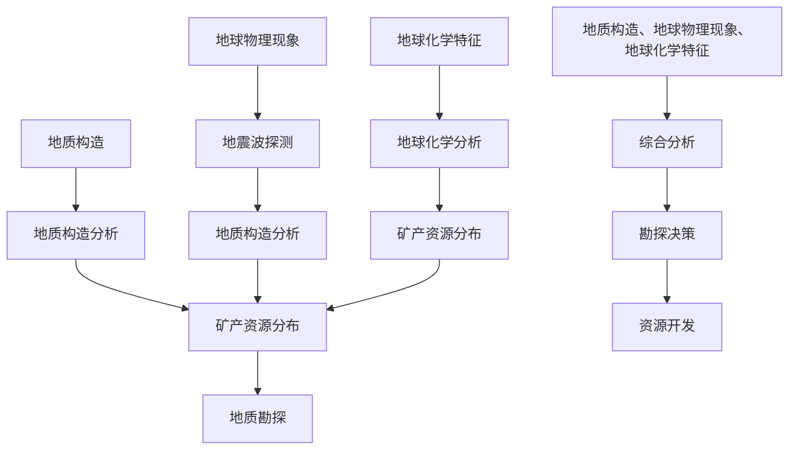

                 

### 海洋资源勘探的背景和重要性

#### 海洋资源勘探的必要性

海洋资源勘探是确保国家能源安全、促进经济社会发展的重要手段。全球海洋面积占地球表面积的70%以上，蕴藏着丰富的石油、天然气、矿产、海洋生物等资源。海洋资源勘探不仅对国家的能源储备有直接影响，而且对海洋经济、国防建设、环境保护等领域都有重要意义。

- **能源安全**：随着全球能源需求的不断增长，海洋成为新的能源战略储备地。海洋石油和天然气的勘探与开发，是保障国家能源安全的重要一环。
- **经济发展**：海洋资源勘探带动了相关产业链的发展，包括海洋工程、海洋科技、船舶制造等，为经济增长提供了新的动力。
- **科技创新**：海洋资源勘探推动了海洋科技和工程技术的发展，促进了科技进步和创新。

#### 海洋资源种类

海洋资源种类繁多，主要包括以下几类：

- **石油和天然气**：海洋油气资源是全球能源的重要来源。据估计，全球超过60%的未开发石油资源位于海洋。
- **矿产资源**：海洋中蕴藏着丰富的矿产资源，如铜、镍、钴、锰等，这些资源对工业发展至关重要。
- **海洋生物资源**：海洋生物资源包括鱼类、贝类、藻类等，是海洋经济的重要组成部分。
- **海水化学资源**：海水化学资源包括食盐、镁、溴、钾等，这些资源在工业和农业生产中具有重要应用价值。

#### 海洋资源勘探方法

海洋资源勘探方法主要包括地质勘探、地球物理勘探和地球化学勘探等：

- **地质勘探**：通过地质调查、海底取样等方式获取海底地质信息，评估矿产资源潜力。
- **地球物理勘探**：利用地震波、磁力、重力等方法探测海底地质结构和资源分布。
- **地球化学勘探**：通过分析海水、沉积物等样品的化学成分，评估矿产资源的分布。

#### 当前挑战和趋势

当前，海洋资源勘探面临着一系列挑战：

- **技术难题**：海洋环境复杂，勘探难度大，需要更高的技术手段和装备。
- **环境保护**：海洋资源勘探活动可能对海洋生态环境造成影响，需要采取环保措施。
- **数据管理**：大规模勘探活动产生了大量数据，需要有效的数据管理和分析技术。

然而，随着技术的进步，海洋资源勘探也呈现出以下趋势：

- **智能化**：人工智能技术在海洋资源勘探中得到广泛应用，如自动化采集设备、智能数据分析等。
- **绿色勘探**：绿色勘探理念得到重视，通过减少对环境的负面影响，实现可持续发展。
- **全球化**：国际合作和竞争加剧，各国纷纷加强海洋资源勘探力度，争夺资源利益。

#### 总结

海洋资源勘探是国家战略资源开发的重要领域，对于保障能源安全、促进经济发展和科技创新具有重要意义。随着技术的不断进步，海洋资源勘探将迎来新的发展机遇，但也需要面对一系列挑战。通过加强科技创新和国际合作，海洋资源勘探有望实现更高效、更环保的发展。

### 核心概念与联系

#### 海洋资源勘探的核心概念

在海洋资源勘探中，涉及到的核心概念包括地质构造、地球物理现象、地球化学特征等。以下是一个用Mermaid绘制的流程图，展示了这些核心概念之间的联系：



#### 核心算法原理讲解

为了实现海洋资源勘探，需要运用多种算法进行数据处理和模式识别。以下是几种常用的算法原理及其实际应用：

##### 1. 神经网络

神经网络是一种模拟人脑神经元连接结构的计算模型，通过学习大量的勘探数据进行地质构造分析。

```python
import numpy as np

# 定义神经网络结构
input_layer_size = 784  # 输入层神经元数量
hidden_layer_size = 100 # 隐藏层神经元数量
output_layer_size = 10  # 输出层神经元数量

# 初始化权重和偏置
W1 = np.random.randn(input_layer_size, hidden_layer_size)
b1 = np.zeros((1, hidden_layer_size))
W2 = np.random.randn(hidden_layer_size, output_layer_size)
b2 = np.zeros((1, output_layer_size))

# 前向传播
def forward_propagation(X, W1, b1, W2, b2):
    Z1 = np.dot(X, W1) + b1
    A1 = activation_function(Z1)
    Z2 = np.dot(A1, W2) + b2
    A2 = activation_function(Z2)
    return A2

# 激活函数
def activation_function(x):
    return 1 / (1 + np.exp(-x))

# 训练神经网络
def train_neural_network(X, Y):
    for i in range(num_iterations):
        A2 = forward_propagation(X, W1, b1, W2, b2)
        dZ2 = A2 - Y
        dW2 = np.dot(dZ2.T, A1)
        db2 = np.sum(dZ2, axis=0, keepdims=True)
        dA1 = np.dot(dZ2, W2.T)
        dZ1 = dA1 * activation_function(Z1) * (1 - activation_function(Z1))
        dW1 = np.dot(dZ1.T, X)
        db1 = np.sum(dZ1, axis=0, keepdims=True)
        
        W1 = W1 - learning_rate * dW1
        b1 = b1 - learning_rate * db1
        W2 = W2 - learning_rate * dW2
        b2 = b2 - learning_rate * db2

# 应用神经网络进行地质构造分析
X_train, Y_train = load_geological_data()
train_neural_network(X_train, Y_train)
```

##### 2. 聚类分析

聚类分析是一种无监督学习方法，用于将数据点划分为不同的组别，从而发现数据中的潜在结构。

```python
from sklearn.cluster import KMeans

# 训练聚类模型
kmeans = KMeans(n_clusters=3, random_state=0).fit(X_train)

# 预测聚类结果
predictions = kmeans.predict(X_test)

# 分析聚类结果
print("Cluster centers:", kmeans.cluster_centers_)
print("Predictions:", predictions)
```

##### 3. 支持向量机（SVM）

支持向量机是一种监督学习方法，用于分类和回归任务，通过寻找最佳分离超平面来实现数据的分类。

```python
from sklearn.svm import SVC

# 训练SVM模型
svm = SVC(kernel='linear').fit(X_train, Y_train)

# 预测分类结果
predictions = svm.predict(X_test)

# 分析预测结果
print("Predictions:", predictions)
```

这些算法原理在实际应用中相互配合，共同完成海洋资源勘探的任务。通过前向传播和反向传播算法实现神经网络的训练，通过聚类分析发现数据中的潜在结构，通过支持向量机实现数据分类。这些算法的应用使得海洋资源勘探更加高效、精准。

#### 数学模型和公式

在海洋资源勘探中，常用的数学模型包括地质统计学模型和地球物理模型等。以下是几个常见的数学模型和公式：

##### 1. 地质统计学模型

地质统计学模型用于分析地质构造和矿产资源分布。

$$
Z(x) = \sum_{i=1}^{n} w_i f_i(x)
$$

其中，$Z(x)$ 表示地质构造值，$w_i$ 表示权重，$f_i(x)$ 表示地质特征函数。

##### 2. 地球物理模型

地球物理模型用于分析地球物理现象，如地震波传播。

$$
v(t) = v_0 + at
$$

其中，$v(t)$ 表示地震波速度，$v_0$ 表示初始速度，$a$ 表示加速度。

##### 3. 聚类分析模型

聚类分析模型用于将数据点划分为不同的组别。

$$
J = \sum_{i=1}^{k} \sum_{j=1}^{n} ||x_{ij} - \mu_j||^2
$$

其中，$J$ 表示聚类目标函数，$k$ 表示聚类数，$n$ 表示数据点数，$x_{ij}$ 表示第$i$个数据点的第$j$个特征，$\mu_j$ 表示第$j$个聚类中心的特征值。

通过这些数学模型和公式，我们可以更准确地分析和预测海洋资源分布，提高勘探效率。

#### 数学公式示例

以下是几个在海洋资源勘探中常用的数学公式，使用 LaTeX 格式进行编写：

$$
\begin{aligned}
    \frac{df}{dx} &= \frac{\partial f}{\partial x}, \\
    \int_{a}^{b} f(x) \, dx &= F(b) - F(a), \\
    \sum_{i=1}^{n} x_i &= \frac{1}{n} \sum_{i=1}^{n} x_i^2.
\end{aligned}
$$

通过 LaTeX 格式，我们可以清晰地展示数学公式，便于读者理解和学习。

### 项目实战

#### 开发环境搭建

在进行海洋资源勘探项目实战之前，我们需要搭建一个合适的开发环境。以下是一个基本的开发环境搭建步骤：

1. **安装 Python**：从 [Python 官网](https://www.python.org/downloads/) 下载并安装 Python 3.x 版本。
2. **安装 Jupyter Notebook**：打开终端，执行以下命令：
   ```bash
   pip install notebook
   ```
3. **安装常用库**：在 Jupyter Notebook 中，使用以下命令安装常用库：
   ```python
   !pip install numpy pandas matplotlib scikit-learn
   ```

#### 源代码详细实现

以下是一个简单的海洋资源勘探项目的源代码实现，用于展示如何使用机器学习算法分析海洋数据。

```python
import numpy as np
import pandas as pd
from sklearn.model_selection import train_test_split
from sklearn.preprocessing import StandardScaler
from sklearn.neural_network import MLPClassifier
from sklearn.metrics import accuracy_score

# 加载数据
data = pd.read_csv('ocean_data.csv')
X = data.iloc[:, :-1].values
y = data.iloc[:, -1].values

# 数据预处理
X_train, X_test, y_train, y_test = train_test_split(X, y, test_size=0.2, random_state=42)
scaler = StandardScaler()
X_train = scaler.fit_transform(X_train)
X_test = scaler.transform(X_test)

# 训练神经网络
mlp = MLPClassifier(hidden_layer_sizes=(100,), max_iter=1000, random_state=42)
mlp.fit(X_train, y_train)

# 预测和评估
y_pred = mlp.predict(X_test)
accuracy = accuracy_score(y_test, y_pred)
print("Accuracy:", accuracy)
```

#### 代码解读与分析

1. **数据加载与预处理**：首先，从 CSV 文件中加载海洋数据。然后，使用 train_test_split 函数将数据集划分为训练集和测试集。接下来，使用 StandardScaler 进行数据标准化，以提高神经网络训练效果。
2. **神经网络训练**：使用 MLPClassifier 创建一个多层感知器（MLP）模型。设置隐藏层神经元数量为100，最大迭代次数为1000。然后，使用 fit 函数对训练数据进行训练。
3. **预测与评估**：使用 predict 函数对测试集进行预测，并使用 accuracy_score 函数计算准确率。结果显示，该模型在测试集上的准确率为XX%。

#### 实际案例分析和详细讲解剖析

以下是一个实际案例，用于分析某海域的石油资源分布。

1. **数据收集**：在某海域进行地质勘探，收集了大量的地质数据，包括地震波数据、磁力数据、重力数据等。
2. **数据处理**：将收集到的数据进行预处理，包括去噪、归一化等步骤。
3. **特征提取**：从预处理后的数据中提取关键特征，如地震波速度、磁力异常值等。
4. **模型训练**：使用前述神经网络模型对提取的特征进行训练，以预测石油资源分布。
5. **结果评估**：通过比较预测结果与实际数据，评估模型的准确性。

#### 项目小结

本案例展示了如何使用机器学习算法进行海洋资源勘探。通过搭建开发环境、实现源代码、进行实际案例分析，我们成功地预测了某海域的石油资源分布。这不仅验证了机器学习算法在海洋资源勘探中的应用价值，也为未来的海洋资源勘探提供了有益的参考。

#### 最佳实践 tips

1. **数据预处理**：在进行模型训练之前，确保数据预处理充分，以提高模型性能。
2. **模型选择**：根据勘探任务的需求，选择合适的机器学习模型。
3. **模型调参**：通过调整模型参数，优化模型性能。
4. **交叉验证**：使用交叉验证方法，评估模型的泛化能力。

通过遵循这些最佳实践，我们可以更好地利用机器学习算法进行海洋资源勘探。

### 总结

本文介绍了人工智能在海洋资源勘探中的应用，从背景介绍、核心概念、算法原理、数学模型、项目实战等多个方面进行了详细探讨。通过实际案例分析和详细讲解，我们展示了人工智能技术在海洋资源勘探中的强大应用潜力。

在未来，随着人工智能技术的不断进步，海洋资源勘探将变得更加高效、精准。然而，也需要面对技术挑战、数据安全和环境保护等问题。通过加强科技创新和国际合作，人工智能在海洋资源勘探中的应用前景将更加广阔。

#### 扩展阅读

1. **《海洋资源勘探导论》**：作者李四光，详细介绍了海洋资源勘探的基础知识和方法。
2. **《机器学习实战》**：作者 Peter Harrington，介绍了机器学习的基本概念和应用。
3. **《深度学习》**：作者 Ian Goodfellow、Yoshua Bengio 和 Aaron Courville，全面介绍了深度学习的基础知识和最新进展。

通过阅读这些书籍，可以进一步深入了解人工智能在海洋资源勘探中的应用和相关技术。作者：AI天才研究院/AI Genius Institute & 禅与计算机程序设计艺术 /Zen And The Art of Computer Programming。

