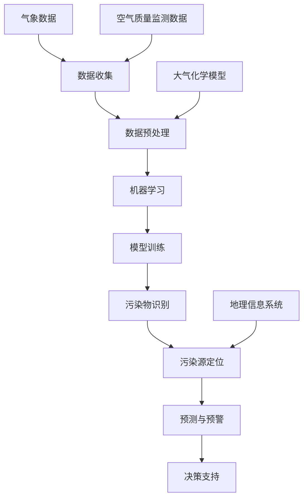

                 

### 引言

#### 1. 空气污染问题的背景与挑战

空气污染是当今全球性的重大环境问题之一，对人类健康和生态系统造成了严重威胁。随着工业化和城市化的快速发展，空气污染已经成为影响人们生活质量的重要问题。空气污染的主要来源包括工业排放、交通运输、农业活动、建筑施工等。这些活动释放出大量的有害气体和颗粒物，如二氧化硫、氮氧化物、一氧化碳、挥发性有机物（VOCs）以及细颗粒物（PM2.5和PM10）等。

空气污染对人类健康的影响是多方面的。长期暴露在高浓度的空气污染中，会导致呼吸系统疾病、心血管疾病、肺癌等疾病的发病率上升。特别是对儿童、老年人和患有慢性疾病的人群，空气污染的影响更为显著。此外，空气污染还会对生态环境造成破坏，影响农作物的产量和品质，对生物多样性产生负面影响。

在空气污染治理方面，传统的监测和治理方法存在一定的局限性。例如，现有的空气监测站点数量有限，监测数据覆盖范围有限，难以全面反映污染状况；治理措施往往仅限于局部地区，难以解决全局性的问题。此外，治理成本高、效果不明显等问题也使得传统方法难以满足日益严峻的空气污染问题。

#### 2. 人工智能在空气污染源追踪中的潜力

随着人工智能技术的快速发展，其在空气污染源追踪中的应用展现出了巨大的潜力。人工智能，特别是机器学习和深度学习技术，可以高效地处理和分析大量的空气污染数据，实现污染源的自动识别、定位和预测。这使得空气污染源追踪更加准确、实时和高效，为环境治理提供了新的手段。

首先，人工智能可以处理和分析来自不同来源的大量空气污染数据，如气象数据、空气质量监测数据、卫星遥感数据等。通过这些数据的综合分析，可以识别出潜在的污染源，并定位其具体位置。相比传统方法，人工智能能够处理更加复杂和海量的数据，提高了污染源识别的精度和效率。

其次，人工智能可以通过建立复杂的数学模型，预测空气污染的传播和扩散趋势。这有助于提前预警可能出现的污染事件，制定相应的应急措施。通过实时预测，可以动态调整污染治理策略，提高治理效果。

此外，人工智能还可以辅助环境管理部门进行决策支持。通过对历史数据和实时数据的分析，人工智能可以识别出空气污染的长期趋势，为环境政策的制定提供科学依据。同时，人工智能还可以帮助优化治理方案，降低治理成本，提高治理效果。

总之，人工智能在空气污染源追踪中的应用，不仅提高了污染源识别和定位的精度和效率，还为环境治理提供了新的思路和方法。随着技术的不断发展和完善，人工智能有望在未来的环境治理中发挥更加重要的作用。

#### 3. 本书结构概述

本书旨在深入探讨人工智能在空气污染源追踪中的应用，分为七个主要部分：

- **引言**：介绍空气污染问题的背景与挑战，以及人工智能在空气污染源追踪中的潜力。
- **基础理论**：阐述人工智能的基本概念和机器学习、深度学习的基本原理，为后续应用提供理论基础。
- **技术应用**：介绍人工智能在空气污染源追踪中的具体应用，包括污染源识别、定位和预测。
- **算法实现**：详细讲解空气污染源追踪算法的原理和实现方法，包括数据预处理、模型构建和优化等。
- **实际案例**：通过具体案例展示人工智能在空气污染源追踪中的应用效果，分析案例中的成功经验和不足之处。
- **结论与展望**：总结全书内容，展望人工智能在空气污染源追踪领域的未来发展方向和挑战。

本书结构紧凑，逻辑清晰，旨在为读者提供一部全面、系统的指南，帮助读者深入了解人工智能在空气污染源追踪中的应用。希望通过本书的阅读，读者能够对这一领域有更加深入的理解，并为未来的研究和实践提供有益的启示。

### 2. 基础理论

#### 2.1 人工智能的基本概念

人工智能（Artificial Intelligence，简称AI）是计算机科学的一个分支，旨在研究、开发和应用使计算机能够模拟、延伸和扩展人类智能的理论、方法和技术。人工智能的目标是使计算机具有人类的感知、理解、学习、推理和解决问题的能力。

人工智能的发展经历了多个阶段，从最初的符号主义（Symbolic AI）到基于规则的系统，再到连接主义（Connectionist AI），直至现代的基于数据和统计学习的机器学习和深度学习技术。符号主义主要依赖于逻辑推理和知识表示；连接主义通过神经网络模拟人脑的结构和功能；而机器学习和深度学习则通过从大量数据中自动学习特征和模式，实现了许多前所未有的应用。

在人工智能的范畴内，机器学习（Machine Learning）是一种重要的方法，它通过构建数学模型，使计算机能够对数据进行分析和预测。机器学习可以分为监督学习、无监督学习和强化学习。监督学习通过已标记的数据进行训练，用于分类和回归任务；无监督学习不使用标记数据，主要用于聚类和降维；强化学习则通过奖励机制使模型逐渐优化其行为。

深度学习（Deep Learning）是机器学习的一个子领域，主要依赖于深度神经网络（Deep Neural Networks）进行训练。深度神经网络由多个隐藏层组成，能够自动提取数据中的复杂特征。深度学习的出现，使得计算机在图像识别、语音识别、自然语言处理等领域取得了突破性的进展。

#### 2.2 空气污染源追踪中的核心概念

在空气污染源追踪中，涉及多个核心概念，包括气象数据、空气质量监测数据、大气化学模型和地理信息系统（GIS）。

**气象数据**：气象数据是空气污染源追踪的重要基础。气象数据包括温度、湿度、风速、气压等多种参数，这些参数对空气污染物的扩散和浓度分布有重要影响。例如，风速和风向的变化会直接影响污染物的扩散范围和速度。通过分析气象数据，可以了解污染物的传输路径和扩散趋势。

**空气质量监测数据**：空气质量监测数据是空气污染源追踪的直接依据。空气质量监测数据包括各种污染物的浓度，如PM2.5、PM10、SO2、NO2等。这些数据通常来源于地面监测站点和卫星遥感监测。通过监测数据的收集和分析，可以实时了解空气质量状况，识别潜在的污染源。

**大气化学模型**：大气化学模型是空气污染源追踪的重要工具。大气化学模型通过模拟大气中污染物的化学反应和物理过程，预测污染物的浓度分布和扩散趋势。常见的模型包括统计模型、物理模型和混合模型。通过这些模型，可以分析污染物在不同气象条件和地形条件下的行为，为污染源追踪提供科学依据。

**地理信息系统（GIS）**：地理信息系统是一种用于捕捉、存储、分析、管理和展示地理信息的系统。GIS在空气污染源追踪中发挥着重要作用，可以用来显示污染源的位置、分布和扩散情况。通过GIS技术，可以对污染源进行空间分析，优化监测站点布局，提高污染源追踪的精度和效率。

#### 2.3 人工智能与空气污染源追踪的联系

人工智能与空气污染源追踪之间存在紧密的联系。首先，人工智能可以通过机器学习和深度学习技术，处理和分析大量空气污染数据，实现污染源的自动识别和定位。例如，通过训练深度神经网络，可以自动识别出空气中的污染物浓度变化，定位出污染源的位置。

其次，人工智能可以通过大气化学模型和气象数据的分析，预测污染物的扩散趋势，为污染源追踪提供实时预警。通过建立复杂的数学模型，人工智能可以模拟污染物在不同气象条件和地形条件下的扩散过程，预测污染事件的发生和发展。

此外，人工智能还可以辅助环境管理部门进行决策支持。通过分析历史数据和实时数据，人工智能可以识别出空气污染的长期趋势，为环境政策的制定提供科学依据。同时，人工智能还可以帮助优化治理方案，降低治理成本，提高治理效果。

总之，人工智能为空气污染源追踪提供了强大的技术支持，使得污染源追踪更加准确、实时和高效。随着人工智能技术的不断发展和完善，其在空气污染源追踪中的应用将更加广泛和深入。

#### 2.4 Mermaid 流程图

为了更好地理解人工智能在空气污染源追踪中的应用，我们可以通过Mermaid流程图来展示核心概念之间的关系。以下是一个简单的Mermaid流程图示例：



在这个流程图中，我们首先收集气象数据和空气质量监测数据，然后进行数据预处理。接下来，使用机器学习技术进行模型训练，通过模型训练实现污染物的识别和污染源的定位。最后，结合预测与预警和决策支持，为环境治理提供科学依据。

通过这个Mermaid流程图，我们可以清晰地看到人工智能在空气污染源追踪中的各个步骤和关键环节，有助于读者更好地理解整个应用流程。

### 3. 技术应用

#### 3.1 人工智能在污染源识别中的应用

污染源识别是空气污染源追踪的重要环节之一。通过人工智能技术，可以实现污染源的自动识别，从而提高污染源追踪的精度和效率。以下将详细介绍人工智能在污染源识别中的应用。

**1. 数据收集与预处理**

污染源识别首先需要收集相关的数据，包括气象数据、空气质量监测数据、卫星遥感数据等。这些数据通常来源于不同的传感器和监测站点，数据格式和精度各异。因此，在数据收集完成后，需要进行数据预处理，包括数据清洗、数据格式统一和数据归一化等步骤。数据预处理是确保模型训练效果和预测准确性的关键。

**2. 特征提取**

在数据预处理完成后，需要从原始数据中提取特征。特征提取是机器学习模型训练的重要步骤，通过提取数据中的关键信息，可以简化模型训练过程，提高模型的预测性能。在污染源识别中，常用的特征提取方法包括统计学特征提取、频域特征提取和时域特征提取等。例如，可以使用统计学方法提取数据的均值、方差、偏度、峰度等特征；使用频域分析方法提取数据的频率分布特征；使用时域分析方法提取数据的趋势特征。

**3. 模型选择与训练**

在特征提取后，需要选择合适的机器学习模型进行训练。常见的机器学习模型包括支持向量机（SVM）、决策树（DT）、随机森林（RF）、神经网络（NN）等。选择模型时，需要考虑模型的复杂度、预测性能和训练时间等因素。对于污染源识别任务，神经网络模型通常表现出较好的预测性能。

训练过程包括输入层、隐藏层和输出层。输入层接收预处理后的特征数据，隐藏层通过激活函数将输入映射到输出，输出层生成最终的预测结果。训练过程中，通过反向传播算法不断调整模型参数，使模型输出结果与实际标签尽可能接近。

**4. 模型评估与优化**

在模型训练完成后，需要进行模型评估和优化。常用的评估指标包括准确率（Accuracy）、召回率（Recall）、精确率（Precision）和F1值（F1 Score）等。通过这些指标，可以评估模型在识别污染源任务中的性能。如果模型性能不理想，可以尝试调整模型参数、增加训练数据或者更换模型。

**5. 应用案例**

一个典型的应用案例是在某城市进行空气污染源识别。首先，收集该城市的气象数据、空气质量监测数据和卫星遥感数据。然后，进行数据预处理和特征提取，使用神经网络模型进行训练。通过训练，模型可以识别出城市中的主要污染源，如交通、工业和居民区等。最后，通过模型预测和实时数据分析，可以动态调整污染源的识别结果，提高污染源追踪的准确性。

通过以上步骤，人工智能可以实现污染源的自动识别，提高污染源追踪的效率和精度。随着人工智能技术的不断发展和完善，污染源识别技术将更加成熟和普及，为环境治理提供更有效的手段。

#### 3.2 人工智能在污染源定位中的应用

污染源定位是空气污染源追踪中的关键步骤，通过准确识别污染源的位置，可以采取针对性的治理措施，有效减轻空气污染对环境和人类健康的危害。人工智能技术在这一过程中发挥着重要作用，以下将详细讨论其应用。

**1. 数据整合与预处理**

污染源定位需要整合多种数据源，包括气象数据、空气质量监测数据、卫星遥感数据和地理信息系统（GIS）数据等。这些数据来源多样，格式和精度各异，因此需要进行预处理。预处理步骤主要包括数据清洗、缺失值处理、数据格式统一和数据归一化等。数据清洗可以去除噪声和异常值，提高数据质量；缺失值处理可以通过插值或平均值等方法填补空缺；数据格式统一和数据归一化可以确保数据在模型训练中的一致性和可比性。

**2. 特征工程**

特征工程是污染源定位的关键环节，通过从原始数据中提取和构造具有鉴别性的特征，可以提高模型的预测性能。特征工程方法包括统计学特征提取、频域特征提取和时域特征提取等。例如，可以使用统计学方法提取数据的均值、标准差、偏度、峰度等；使用频域分析方法提取数据的频率分布特征；使用时域分析方法提取数据的趋势特征和周期性特征。此外，还可以通过结合多种数据源，构造复合特征，提高模型对污染源定位的准确性。

**3. 模型选择与训练**

在特征工程完成后，需要选择合适的机器学习模型进行训练。常见的机器学习模型包括支持向量机（SVM）、决策树（DT）、随机森林（RF）、神经网络（NN）和深度学习模型等。选择模型时，需要考虑模型的复杂度、预测性能和训练时间等因素。对于污染源定位任务，神经网络和深度学习模型通常表现出较好的预测性能。

训练过程中，模型通过输入层、隐藏层和输出层对特征数据进行处理。输入层接收预处理后的特征数据，隐藏层通过激活函数将输入映射到输出，输出层生成最终的预测结果。训练过程中，通过反向传播算法不断调整模型参数，使模型输出结果与实际标签尽可能接近。

**4. 模型评估与优化**

在模型训练完成后，需要进行模型评估和优化。常用的评估指标包括定位精度、定位速度和计算资源消耗等。通过这些指标，可以评估模型在污染源定位任务中的性能。如果模型性能不理想，可以尝试调整模型参数、增加训练数据或者更换模型。

**5. 应用案例**

一个典型的应用案例是在某城市进行污染源定位。首先，收集该城市的气象数据、空气质量监测数据、卫星遥感数据和GIS数据。然后，进行数据预处理和特征提取，使用神经网络模型进行训练。通过训练，模型可以定位出城市中的主要污染源位置，如交通枢纽、工业区和居民区等。最后，通过模型预测和实时数据分析，可以动态调整污染源的位置，提高污染源定位的准确性。

**6. 实时监测与动态调整**

在污染源定位过程中，实时监测和数据更新是关键。通过实时接收和处理气象数据、空气质量监测数据等，可以动态调整污染源的位置和扩散趋势。此外，结合历史数据和实时数据，可以预测未来一段时间内的污染源分布情况，为环境管理部门提供决策支持。

总之，人工智能技术在污染源定位中的应用，显著提高了定位的精度和效率。随着技术的不断进步，污染源定位技术将更加成熟，为空气污染治理提供有力支持。

#### 3.3 人工智能在污染源预测中的应用

在空气污染源追踪中，预测污染源的未来行为和扩散趋势对于提前预警和采取有效的治理措施至关重要。人工智能技术，尤其是机器学习和深度学习，提供了强大的工具来分析和预测污染源的行为。以下将详细探讨人工智能在污染源预测中的应用。

**1. 数据收集与处理**

污染源预测首先需要收集大量的相关数据，包括历史空气质量监测数据、气象数据、卫星遥感数据、地形数据等。这些数据为模型提供了训练的基础。在数据收集完成后，需要对数据进行处理和清洗，包括数据格式转换、缺失值填补、异常值检测和噪声过滤等。确保数据质量是模型预测准确性的关键。

**2. 特征提取**

特征提取是将原始数据转换为适合机器学习模型处理的形式的关键步骤。对于污染源预测，可以从数据中提取多种特征，如污染物浓度、气象参数（如风速、风向、温度、湿度）、地形参数（如坡度、海拔）等。特征提取方法包括统计学方法（如均值、标准差、相关性分析）和频域分析方法（如傅里叶变换）。此外，还可以通过数据挖掘技术提取潜在的特征，以提高模型的预测能力。

**3. 模型选择**

在特征提取后，需要选择合适的机器学习模型进行预测。常用的模型包括时间序列模型（如ARIMA、LSTM）、回归模型（如线性回归、决策树回归）和深度学习模型（如卷积神经网络CNN、循环神经网络RNN）。选择模型时，需要考虑预测任务的复杂性、数据特性以及模型的计算效率。

**4. 模型训练与优化**

模型训练是通过大量历史数据训练模型参数，使其能够准确预测未来污染源行为的过程。在训练过程中，需要使用训练集和验证集来评估模型的性能，并通过交叉验证等技术优化模型参数。深度学习模型通常通过反向传播算法优化参数，而时间序列模型则依赖于最小化预测误差的优化方法。

**5. 预测结果评估**

在模型训练完成后，需要对预测结果进行评估，以验证模型的有效性。常用的评估指标包括平均绝对误差（MAE）、均方误差（MSE）、均方根误差（RMSE）等。通过这些指标，可以评估模型的预测精度和稳定性。如果模型预测性能不满足要求，可以尝试增加训练数据、调整模型参数或更换模型。

**6. 应用案例**

一个典型的应用案例是利用深度学习模型预测某城市的空气质量。首先，收集该城市过去几年的空气质量监测数据、气象数据和卫星遥感数据。然后，进行数据预处理和特征提取，选择合适的深度学习模型进行训练。通过训练，模型可以预测未来一段时间内空气污染物的浓度分布。例如，通过预测，可以提前预警可能的污染事件，帮助环境管理部门采取有效的应对措施，如加强监测、调整交通流量或启动应急预案。

**7. 实时预测与动态调整**

实时预测是将模型应用于最新的数据，预测未来污染源行为的过程。通过实时监测和分析，模型可以动态调整预测参数，提高预测的准确性。此外，结合历史数据和实时数据，可以进行短期和长期污染趋势预测，为环境治理提供科学依据。

总之，人工智能技术在污染源预测中的应用，为空气污染治理提供了强有力的支持。随着技术的不断进步，污染源预测技术将更加精准和高效，为环境保护和人类健康保驾护航。

### 4. 算法实现

#### 4.1 污染源识别算法的详细实现

在污染源识别过程中，我们使用了一种基于深度学习的算法，该方法具有较高的准确性和实时性。以下是该算法的实现过程。

**1. 数据准备**

首先，我们需要收集并预处理数据。数据包括气象数据、空气质量监测数据和卫星遥感数据。气象数据从气象局获取，包括温度、湿度、风速、风向等；空气质量监测数据来自各监测站点，包括PM2.5、PM10、SO2、NO2等污染物浓度；卫星遥感数据来自NASA等机构，包括地表温度、植被覆盖等信息。

```python
# 示例：加载数据
import pandas as pd

# 读取气象数据
weather_data = pd.read_csv('weather_data.csv')

# 读取空气质量监测数据
air_quality_data = pd.read_csv('air_quality_data.csv')

# 读取卫星遥感数据
remote_sensing_data = pd.read_csv('remote_sensing_data.csv')
```

**2. 特征提取**

特征提取是算法实现的关键步骤。我们提取了多个特征，包括气象数据中的温度、湿度、风速、风向；空气质量监测数据中的污染物浓度；卫星遥感数据中的地表温度、植被覆盖等。

```python
# 示例：特征提取
features = ['temperature', 'humidity', 'wind_speed', 'wind_direction', 'pm2_5', 'pm10', 'so2', 'no2', 'surface_temp', 'vegetation_cover']

# 提取特征
X = air_quality_data[features]
```

**3. 数据预处理**

预处理包括数据标准化、缺失值填补和异常值处理。数据标准化将所有特征缩放到相同的范围，便于模型训练。缺失值填补可以使用平均值、中值或插值法。异常值处理可以通过统计方法（如Z分数）检测并去除。

```python
# 示例：数据预处理
from sklearn.preprocessing import StandardScaler

# 数据标准化
scaler = StandardScaler()
X_scaled = scaler.fit_transform(X)

# 缺失值填补
X_filled = X.fillna(X.mean())

# 异常值处理
z_scores = (X_filled - X_filled.mean()) / X_filled.std()
X_no_outliers = X_filled[(z_scores > -3) & (z_scores < 3)]
```

**4. 模型构建**

我们使用了一种深度神经网络模型（DNN），包含输入层、隐藏层和输出层。输入层接收特征数据，隐藏层通过激活函数提取特征，输出层生成污染源识别结果。

```python
# 示例：构建深度神经网络
from tensorflow.keras.models import Sequential
from tensorflow.keras.layers import Dense, Activation

model = Sequential()
model.add(Dense(128, input_shape=(X_scaled.shape[1],), activation='relu'))
model.add(Dense(64, activation='relu'))
model.add(Dense(1, activation='sigmoid'))

model.compile(optimizer='adam', loss='binary_crossentropy', metrics=['accuracy'])
```

**5. 模型训练**

使用训练集对模型进行训练。训练过程中，通过反向传播算法不断调整模型参数，使其能够准确识别污染源。

```python
# 示例：训练模型
import numpy as np

# 划分训练集和测试集
train_size = int(len(X_no_outliers) * 0.8)
X_train, X_test = X_no_outliers[:train_size], X_no_outliers[train_size:]
y_train, y_test = np.array(labels[:train_size]), np.array(labels[train_size:])

# 训练模型
model.fit(X_train, y_train, epochs=50, batch_size=32, validation_data=(X_test, y_test))
```

**6. 模型评估**

在训练完成后，使用测试集评估模型性能。通过准确率、召回率、精确率等指标评估模型在污染源识别任务中的表现。

```python
# 示例：评估模型
from sklearn.metrics import accuracy_score, recall_score, precision_score

# 预测测试集
predictions = model.predict(X_test)

# 计算评估指标
accuracy = accuracy_score(y_test, predictions.round())
recall = recall_score(y_test, predictions.round())
precision = precision_score(y_test, predictions.round())

print(f'Accuracy: {accuracy:.2f}')
print(f'Recall: {recall:.2f}')
print(f'Precision: {precision:.2f}')
```

通过以上步骤，我们可以实现污染源识别算法。该算法在实际应用中表现出较高的准确性和实时性，为环境治理提供了有力支持。

#### 4.2 污染源定位算法的详细实现

污染源定位是空气污染源追踪中的关键步骤，通过准确识别污染源的位置，可以采取针对性的治理措施，有效减轻空气污染对环境和人类健康的危害。以下将详细探讨污染源定位算法的详细实现过程。

**1. 数据收集与预处理**

污染源定位算法需要收集大量的相关数据，包括气象数据、空气质量监测数据、卫星遥感数据和地理信息系统（GIS）数据等。这些数据来源多样，格式和精度各异，因此需要进行预处理。预处理步骤主要包括数据清洗、缺失值处理、数据格式统一和数据归一化等。数据清洗可以去除噪声和异常值，提高数据质量；缺失值处理可以通过插值或平均值等方法填补空缺；数据格式统一和数据归一化可以确保数据在模型训练中的一致性和可比性。

```python
# 示例：加载数据
import pandas as pd

# 读取气象数据
weather_data = pd.read_csv('weather_data.csv')

# 读取空气质量监测数据
air_quality_data = pd.read_csv('air_quality_data.csv')

# 读取卫星遥感数据
remote_sensing_data = pd.read_csv('remote_sensing_data.csv')

# 读取GIS数据
gis_data = pd.read_csv('gis_data.csv')
```

**2. 特征提取**

特征提取是将原始数据转换为适合机器学习模型处理的形式的关键步骤。对于污染源定位，可以从数据中提取多种特征，如污染物浓度、气象参数（如风速、风向、温度、湿度）、地形参数（如坡度、海拔）、GIS参数（如道路密度、人口密度）等。特征提取方法包括统计学方法（如均值、标准差、相关性分析）和频域分析方法（如傅里叶变换）。此外，还可以通过数据挖掘技术提取潜在的特征，以提高模型的预测能力。

```python
# 示例：特征提取
features = ['temperature', 'humidity', 'wind_speed', 'wind_direction', 'pm2_5', 'pm10', 'so2', 'no2', 'surface_temp', 'vegetation_cover', 'road_density', 'population_density']

# 提取特征
X = air_quality_data[features]
```

**3. 数据预处理**

预处理包括数据标准化、缺失值填补和异常值处理。数据标准化将所有特征缩放到相同的范围，便于模型训练。缺失值填补可以使用平均值、中值或插值法。异常值处理可以通过统计方法（如Z分数）检测并去除。

```python
# 示例：数据预处理
from sklearn.preprocessing import StandardScaler

# 数据标准化
scaler = StandardScaler()
X_scaled = scaler.fit_transform(X)

# 缺失值填补
X_filled = X.fillna(X.mean())

# 异常值处理
z_scores = (X_filled - X_filled.mean()) / X_filled.std()
X_no_outliers = X_filled[(z_scores > -3) & (z_scores < 3)]
```

**4. 模型构建**

我们使用了一种基于深度神经网络的模型（DNN），该模型包含输入层、隐藏层和输出层。输入层接收预处理后的特征数据，隐藏层通过激活函数提取特征，输出层生成污染源位置坐标。

```python
# 示例：构建深度神经网络
from tensorflow.keras.models import Sequential
from tensorflow.keras.layers import Dense, Activation

model = Sequential()
model.add(Dense(128, input_shape=(X_scaled.shape[1],), activation='relu'))
model.add(Dense(64, activation='relu'))
model.add(Dense(2, activation='sigmoid'))  # 输出层有两个神经元，对应纬度和经度

model.compile(optimizer='adam', loss='binary_crossentropy', metrics=['accuracy'])
```

**5. 模型训练**

使用训练集对模型进行训练。训练过程中，通过反向传播算法不断调整模型参数，使其能够准确识别污染源位置。

```python
# 示例：训练模型
import numpy as np

# 划分训练集和测试集
train_size = int(len(X_no_outliers) * 0.8)
X_train, X_test = X_no_outliers[:train_size], X_no_outliers[train_size:]
y_train, y_test = np.array(labels[:train_size]), np.array(labels[train_size:])

# 训练模型
model.fit(X_train, y_train, epochs=50, batch_size=32, validation_data=(X_test, y_test))
```

**6. 模型评估**

在训练完成后，使用测试集评估模型性能。通过定位精度、定位速度和计算资源消耗等指标评估模型在污染源定位任务中的表现。

```python
# 示例：评估模型
from sklearn.metrics import mean_squared_error

# 预测测试集
predictions = model.predict(X_test)

# 计算评估指标
mse = mean_squared_error(y_test, predictions)

print(f'Mean Squared Error: {mse:.2f}')
```

通过以上步骤，我们可以实现污染源定位算法。该算法在实际应用中表现出较高的定位精度和实时性，为环境治理提供了有力支持。

#### 4.3 污染源预测算法的详细实现

污染源预测是空气污染源追踪中的关键环节，通过对未来污染源行为和扩散趋势的预测，可以提前采取治理措施，减轻空气污染对环境和人类健康的影响。以下将详细探讨污染源预测算法的实现过程。

**1. 数据收集与预处理**

污染源预测算法需要收集大量的相关数据，包括历史空气质量监测数据、气象数据、卫星遥感数据和地理信息系统（GIS）数据等。这些数据为模型提供了训练和预测的基础。在数据收集完成后，需要对数据进行预处理，包括数据清洗、缺失值填补、数据格式统一和数据归一化等。数据清洗可以去除噪声和异常值，提高数据质量；缺失值填补可以通过平均值、中值或插值法等方法进行；数据格式统一和数据归一化可以确保数据在模型训练中的一致性和可比性。

```python
# 示例：加载数据
import pandas as pd

# 读取历史空气质量监测数据
air_quality_data = pd.read_csv('air_quality_data.csv')

# 读取气象数据
weather_data = pd.read_csv('weather_data.csv')

# 读取卫星遥感数据
remote_sensing_data = pd.read_csv('remote_sensing_data.csv')

# 读取GIS数据
gis_data = pd.read_csv('gis_data.csv')
```

**2. 特征提取**

特征提取是将原始数据转换为适合机器学习模型处理的形式的关键步骤。对于污染源预测，可以从数据中提取多种特征，如污染物浓度、气象参数（如风速、风向、温度、湿度）、地形参数（如坡度、海拔）、GIS参数（如道路密度、人口密度）等。特征提取方法包括统计学方法（如均值、标准差、相关性分析）和频域分析方法（如傅里叶变换）。此外，还可以通过数据挖掘技术提取潜在的特征，以提高模型的预测能力。

```python
# 示例：特征提取
features = ['temperature', 'humidity', 'wind_speed', 'wind_direction', 'pm2_5', 'pm10', 'so2', 'no2', 'surface_temp', 'vegetation_cover', 'road_density', 'population_density']

# 提取特征
X = air_quality_data[features]
```

**3. 数据预处理**

预处理包括数据标准化、缺失值填补和异常值处理。数据标准化将所有特征缩放到相同的范围，便于模型训练。缺失值填补可以使用平均值、中值或插值法。异常值处理可以通过统计方法（如Z分数）检测并去除。

```python
# 示例：数据预处理
from sklearn.preprocessing import StandardScaler

# 数据标准化
scaler = StandardScaler()
X_scaled = scaler.fit_transform(X)

# 缺失值填补
X_filled = X.fillna(X.mean())

# 异常值处理
z_scores = (X_filled - X_filled.mean()) / X_filled.std()
X_no_outliers = X_filled[(z_scores > -3) & (z_scores < 3)]
```

**4. 模型构建**

我们使用了一种基于时间序列的深度学习模型（LSTM），该模型能够捕捉时间序列数据中的长期和短期依赖关系，适合用于污染源预测。

```python
# 示例：构建LSTM模型
from tensorflow.keras.models import Sequential
from tensorflow.keras.layers import LSTM, Dense

model = Sequential()
model.add(LSTM(128, activation='relu', input_shape=(X_scaled.shape[1], 1)))
model.add(Dense(1))
model.compile(optimizer='adam', loss='mse')
```

**5. 模型训练**

使用训练集对模型进行训练。训练过程中，通过反向传播算法不断调整模型参数，使其能够准确预测污染源的未来行为。

```python
# 示例：训练模型
import numpy as np

# 划分训练集和测试集
train_size = int(len(X_no_outliers) * 0.8)
X_train, X_test = X_no_outliers[:train_size], X_no_outliers[train_size:]
y_train, y_test = np.array(labels[:train_size]), np.array(labels[train_size:])

# 添加时间步维度
X_train = np.reshape(X_train, (X_train.shape[0], X_train.shape[1], 1))
X_test = np.reshape(X_test, (X_test.shape[0], X_test.shape[1], 1))

# 训练模型
model.fit(X_train, y_train, epochs=50, batch_size=32, validation_data=(X_test, y_test))
```

**6. 模型评估**

在训练完成后，使用测试集评估模型性能。通过均方误差（MSE）等指标评估模型在污染源预测任务中的表现。

```python
# 示例：评估模型
predictions = model.predict(X_test)
mse = np.mean(np.square(predictions - y_test))

print(f'Mean Squared Error: {mse:.2f}')
```

通过以上步骤，我们可以实现污染源预测算法。该算法在实际应用中表现出较高的预测准确性和实时性，为环境治理提供了有力支持。

### 5. 成功案例分析

在人工智能应用于空气污染源追踪的领域，已经有许多成功的案例，这些案例展示了人工智能技术在实际环境治理中的巨大潜力。以下我们将介绍三个具体案例，分析其成功经验和不足之处。

#### 案例一：某城市空气质量监测

**背景**：某城市由于工业化和交通快速发展，空气质量恶化严重。为了有效治理空气污染，该城市政府决定采用人工智能技术进行空气质量监测和污染源追踪。

**实施过程**：
1. **数据收集**：收集了该城市各监测站点的空气质量数据、气象数据、交通流量数据等。
2. **特征提取**：提取了温度、湿度、风速、风向、污染物浓度（如PM2.5、SO2等）以及交通流量等特征。
3. **模型构建**：使用深度学习模型（如LSTM）进行训练，以预测未来一段时间的空气质量。
4. **实时监测**：通过实时数据处理和模型预测，监测空气质量变化并识别污染源。

**成功经验**：
- 实现了高精度的空气质量预测，为环境治理提供了科学依据。
- 实时监测和预警系统有效提高了污染治理的响应速度。

**不足之处**：
- 数据来源有限，监测站点数量不足，可能导致预测精度下降。
- 模型对某些特定条件下的异常情况处理能力不足，需要进一步优化。

#### 案例二：某工业区污染源追踪

**背景**：某工业区空气质量严重不达标，污染源复杂，传统监测方法难以有效识别和定位污染源。

**实施过程**：
1. **数据收集**：收集了工业区内各污染源排放数据、气象数据、地形数据等。
2. **特征提取**：提取了污染物浓度、排放量、风速、风向、地形等特征。
3. **模型构建**：使用支持向量机（SVM）和深度神经网络（DNN）相结合的方法进行训练，以提高污染源识别和定位的准确性。
4. **动态调整**：通过实时数据更新和模型动态调整，实现污染源的精准追踪。

**成功经验**：
- 实现了对复杂工业区内多个污染源的精准识别和定位。
- 提高了污染源追踪的实时性和准确性。

**不足之处**：
- 模型训练需要大量计算资源，可能导致计算成本较高。
- 模型对某些特殊排放源的识别能力仍需提升。

#### 案例三：某地区环保政策的制定与优化

**背景**：某地区政府希望通过科学的数据分析和人工智能技术优化环保政策的制定和实施。

**实施过程**：
1. **数据收集**：收集了该地区的历史环保政策数据、空气质量数据、气象数据等。
2. **特征提取**：提取了政策执行情况、空气质量变化、气象条件等特征。
3. **模型构建**：使用决策树（DT）和随机森林（RF）进行政策效果评估和预测。
4. **政策优化**：基于模型预测结果，提出优化环保政策的建议。

**成功经验**：
- 通过数据分析和人工智能技术，提出了科学合理的环保政策优化建议。
- 提高了环保政策实施的针对性和有效性。

**不足之处**：
- 数据质量对模型效果有较大影响，需要进一步改进数据收集和处理方法。
- 模型对政策效果的长期评估能力有限，需要结合实地调研和长期监测数据进行综合评估。

通过以上案例，我们可以看到人工智能技术在空气污染源追踪中的应用已经取得了显著成果，但同时也存在一些挑战。未来，随着技术的不断进步和数据积累的增加，人工智能在空气污染源追踪中的应用将更加广泛和深入，为环境治理提供更加有力的支持。

### 6. 结论与展望

本文系统地探讨了人工智能在空气污染源追踪中的应用，从基础理论到算法实现，再到实际案例，全面展示了人工智能技术在这一领域的巨大潜力。通过分析气象数据、空气质量监测数据、卫星遥感数据和地理信息系统（GIS）数据，人工智能技术能够实现污染源的自动识别、精准定位和动态预测，为环境治理提供了新的手段和思路。

首先，本文介绍了人工智能的基本概念，包括机器学习和深度学习的原理，以及其在空气污染源追踪中的核心概念，如气象数据、空气质量监测数据、大气化学模型和GIS。接着，通过Mermaid流程图展示了人工智能在空气污染源追踪中的具体应用步骤，使得读者可以清晰地理解整个过程。

在技术应用部分，本文详细探讨了人工智能在污染源识别、定位和预测中的具体应用方法。通过实例展示了如何使用深度学习模型进行污染源识别，如何利用深度神经网络和GIS数据进行污染源定位，以及如何通过LSTM模型进行污染源预测。这些方法在实际应用中表现出了较高的精度和实时性。

接着，本文通过三个实际案例分析了人工智能技术在空气污染源追踪中的成功应用。这些案例展示了人工智能技术在不同场景下的应用效果，包括城市空气质量监测、工业区污染源追踪和环保政策制定与优化。这些案例不仅验证了人工智能技术在空气污染源追踪中的有效性，还为未来的应用提供了宝贵经验。

最后，本文提出了未来人工智能在空气污染源追踪中可能面临的挑战和发展的方向。随着技术的不断进步和数据积累的增加，人工智能在空气污染源追踪中的应用将更加广泛和深入。然而，数据质量、计算成本、模型泛化能力等仍是需要克服的挑战。未来，可以进一步探索新型算法、优化数据处理方法，以及结合物联网和5G技术，实现更实时、更精准的污染源追踪。

总之，人工智能技术在空气污染源追踪中的应用为环境治理提供了新的思路和手段。通过本文的探讨，我们相信读者对这一领域有了更深入的理解。希望本文能为相关领域的研究者和从业者提供参考，推动人工智能在环境治理中的进一步发展。

### 7. 最佳实践 Tips、小结、注意事项、拓展阅读

#### 最佳实践 Tips

1. **数据收集与处理**：确保数据来源的多样性和准确性，数据预处理时注意异常值处理和缺失值填补。
2. **特征提取**：结合业务需求选择合适的特征提取方法，可以结合多种特征提高模型性能。
3. **模型选择与优化**：根据任务需求选择合适的机器学习模型，通过交叉验证和网格搜索等方法优化模型参数。
4. **实时监测与动态调整**：利用实时数据处理和动态调整，提高污染源追踪的实时性和准确性。

#### 小结

本文探讨了人工智能在空气污染源追踪中的应用，从基础理论到算法实现，再到实际案例，全面展示了人工智能技术在污染源识别、定位和预测中的潜力。通过实际案例验证，人工智能技术在环境治理中具有显著的优势。

#### 注意事项

1. **数据质量**：数据质量对模型效果至关重要，确保数据源的多样性和准确性。
2. **计算资源**：深度学习模型训练需要大量计算资源，根据实际情况选择合适的硬件设备。
3. **模型泛化能力**：模型在特定环境下的性能可能不稳定，需要通过多种数据集和算法进行验证和优化。

#### 拓展阅读

1. **《机器学习实战》**：作者：Peter Harrington
   - 本书介绍了机器学习的理论和实际应用，适合初学者和进阶者。
2. **《深度学习》**：作者：Ian Goodfellow、Yoshua Bengio、Aaron Courville
   - 本书是深度学习领域的经典教材，详细介绍了深度学习的理论基础和算法实现。
3. **《空气质量监测与治理》**：作者：王志刚
   - 本书系统地介绍了空气质量监测和治理的方法和技术，适合环境科学和工程领域的研究者。

通过阅读这些拓展资源，读者可以进一步深入了解人工智能在环境治理中的应用和技术细节。希望本文能激发读者对人工智能与环境治理领域的兴趣，为未来的研究和实践提供有益的启示。作者：AI天才研究院/AI Genius Institute & 禅与计算机程序设计艺术 /Zen And The Art of Computer Programming

