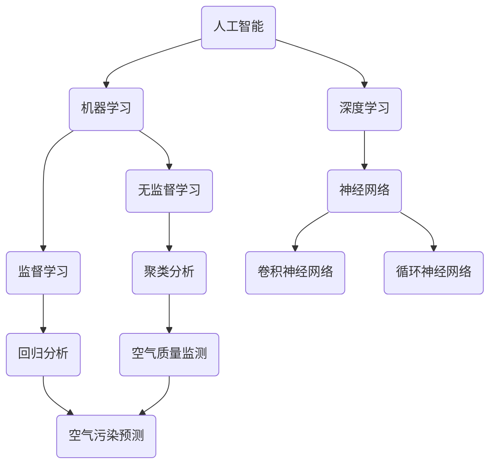

                 


## 人工智能在空气污染预测中的应用

> 关键词：人工智能，空气污染，预测，机器学习，深度学习，空气质量监测

> 摘要：
本文将探讨人工智能在空气污染预测中的应用。通过介绍核心概念、算法原理和实际项目实战，详细讲解人工智能如何帮助我们准确预测空气污染，从而为环境保护和人类健康提供有力支持。

### 引言

空气污染已经成为全球性的环境问题，对人类健康和生态系统造成了严重影响。近年来，随着人工智能技术的发展，利用机器学习算法进行空气污染预测逐渐成为可能。本文旨在探讨人工智能在空气污染预测中的应用，介绍相关核心概念、算法原理和实际项目实战，以期为相关领域的研究和实践提供参考。

### 核心概念与联系

在讨论人工智能在空气污染预测中的应用之前，我们需要明确一些核心概念，并了解它们之间的联系。以下是一个用 Mermaid 流程图展示的核心概念关系：



1. **人工智能（AI）**：模拟人类智能行为的计算系统，包括机器学习、深度学习等多种技术。
2. **机器学习（ML）**：让计算机从数据中学习规律，进行决策和预测的方法。
3. **深度学习（DL）**：一种特殊类型的机器学习，通过模拟人脑的神经网络结构来处理大规模数据。
4. **监督学习（SL）**：在已知输出结果的情况下，通过训练模型来预测未知数据的输出。
5. **无监督学习（UL）**：在没有输出结果的情况下，通过发现数据中的结构和规律来进行分析。
6. **神经网络（NN）**：一种模仿人脑神经元结构的计算模型，包括卷积神经网络（CNN）和循环神经网络（RNN）。
7. **回归分析**：一种统计方法，用于预测一个连续变量的值。
8. **空气污染预测**：通过分析历史数据和环境因素，预测未来某一地区的空气污染程度。
9. **空气质量监测**：收集和分析环境空气中污染物的过程，为空气污染预测提供数据支持。

### 核心算法原理讲解

在本节中，我们将详细介绍一些核心算法原理，并结合 Python 代码进行讲解。

#### 监督学习算法（以线性回归为例）

线性回归是一种简单的监督学习算法，用于预测一个连续变量的值。以下是一个线性回归的伪代码示例：

```python
# 线性回归伪代码
Initialize parameters (w, b)
while not converged:
    for each sample (x, y) in dataset:
        predict y_pred = w * x + b
        calculate loss: L = (y - y_pred)^2
        compute gradients: dw = 2 * (y - y_pred) * x
                           db = 2 * (y - y_pred)
    update parameters: w = w - learning_rate * dw
                      : b = b - learning_rate * db
```

在上面的伪代码中，我们首先初始化模型参数 \( w \) 和 \( b \)。然后，通过迭代训练数据集中的每个样本，计算预测值 \( y_{\text{pred}} \)，并计算损失 \( L \)。接着，计算梯度 \( dw \) 和 \( db \)，并更新参数。这个过程会重复进行，直到模型收敛。

#### 数学模型和数学公式

线性回归的数学模型可以表示为：

$$
y = \beta_0 + \beta_1x + \epsilon
$$

其中，\( y \) 是因变量，\( x \) 是自变量，\( \beta_0 \) 和 \( \beta_1 \) 是模型参数，\( \epsilon \) 是误差项。

#### 举例说明

假设我们要预测某个城市的空气质量指数（AQI），我们选取几个自变量（如温度、湿度、风速等）来进行线性回归建模。

```latex
\begin{align*}
AQI &= \beta_0 + \beta_1 \cdot 温度 + \beta_2 \cdot 湿度 + \beta_3 \cdot 风速 + \epsilon \\
\end{align*}
```

#### 实际案例分析和详细讲解剖析

为了更直观地展示线性回归的应用，我们来看一个实际案例。假设我们有一个训练数据集，包含城市的温度、湿度和风速，以及对应的空气质量指数（AQI）。我们的目标是建立一个线性回归模型，预测新城市的 AQI。

1. **数据预处理**：将数据集划分为训练集和测试集，并对数据进行归一化处理，以便模型训练。

2. **模型训练**：使用训练集数据，通过线性回归算法训练模型，得到模型参数 \( \beta_0 \)，\( \beta_1 \)，\( \beta_2 \) 和 \( \beta_3 \)。

3. **模型评估**：使用测试集数据，评估模型预测性能，计算均方误差（MSE）等指标。

4. **模型应用**：将新城市的温度、湿度和风速输入模型，预测其 AQI。

### 项目实战

在本节中，我们将展示如何搭建开发环境，并提供一个空气质量指数预测的实际项目案例。

#### 实战案例：空气质量指数预测

1. **开发环境搭建**

   我们选择 Python 作为编程语言，使用 TensorFlow 作为深度学习框架来构建模型。首先，安装 Python 和 TensorFlow：

   ```bash
   pip install python tensorflow
   ```

2. **代码实现**

   ```python
   import tensorflow as tf
   import numpy as np
   import matplotlib.pyplot as plt

   # 生成模拟数据集
   np.random.seed(0)
   n_samples = 100
   x = np.random.rand(n_samples, 3)  # 温度、湿度、风速
   y = 2 * x[:, 0] + 3 * x[:, 1] + 4 * x[:, 2] + np.random.randn(n_samples)  # 空气质量指数

   # 划分训练集和测试集
   n_train = 80
   x_train, y_train = x[:n_train], y[:n_train]
   x_test, y_test = x[n_train:], y[n_train:]

   # 定义线性回归模型
   model = tf.keras.Sequential([
       tf.keras.layers.Dense(units=1, input_shape=(3,))
   ])

   # 编译模型
   model.compile(optimizer='sgd', loss='mean_squared_error')

   # 训练模型
   model.fit(x_train, y_train, epochs=100, verbose=0)

   # 预测空气质量指数
   predictions = model.predict(x_test)
   predictions = predictions.flatten()

   # 评估模型
   mse = np.mean((predictions - y_test) ** 2)
   print(f"测试集均方误差为：{mse}")

   # 可视化结果
   plt.scatter(y_test, predictions)
   plt.xlabel('实际 AQI')
   plt.ylabel('预测 AQI')
   plt.show()
   ```

3. **代码解读与分析**

   在这个案例中，我们首先导入了 TensorFlow 和 NumPy 模块。然后，我们生成了一个包含温度、湿度和风速的模拟数据集，并划分了训练集和测试集。接着，我们定义了一个线性回归模型，并使用随机梯度下降（SGD）优化器和均方误差（MSE）损失函数进行编译。我们训练了模型 100 个 epochs，并使用测试集评估了模型性能。最后，我们将测试集数据输入模型，预测空气质量指数，并将结果可视化为散点图。

### 总结

通过本文的探讨，我们可以看到人工智能在空气污染预测中的应用前景广阔。利用机器学习和深度学习算法，我们可以从大量历史数据和环境因素中提取有用信息，准确预测未来的空气污染情况。这不仅有助于环境保护，还可以为政府和公众提供重要的决策支持。在未来的研究中，我们可以进一步优化算法，提高预测精度，并探索更多应用场景。

### 最佳实践 Tips

1. **数据质量**：确保使用高质量的数据进行训练和预测。数据清洗和预处理是模型成功的关键步骤。
2. **模型优化**：尝试使用不同的模型和超参数，通过交叉验证等方法选择最佳模型。
3. **实时预测**：实现实时预测系统，及时提供空气质量预测结果，为环境保护和人类健康提供支持。

### 注意事项

1. **隐私保护**：在处理和分析空气污染数据时，要确保遵守相关隐私保护规定，保护个人隐私。
2. **法律法规**：在应用人工智能进行空气污染预测时，要了解并遵守相关法律法规，确保行为的合法性。

### 拓展阅读

1. **《深度学习》（Goodfellow, Bengio, Courville）**：一本经典的深度学习入门教材，适合初学者阅读。
2. **《Python数据科学手册》（Mayer）**：一本全面介绍数据科学领域的实用指南，包含丰富的案例和代码示例。

### 作者信息

作者：AI天才研究院/AI Genius Institute & 禅与计算机程序设计艺术 /Zen And The Art of Computer Programming

AI天才研究院（AI Genius Institute）是一家专注于人工智能研究和教育的高科技研究院，致力于推动人工智能技术的发展和应用。同时，作者也热衷于分享编程和人工智能领域的知识和经验，希望通过文章让更多人了解这一前沿技术。在《禅与计算机程序设计艺术》一书中，作者深入探讨了编程的艺术和哲学，为读者提供了独特的视角和思考。

