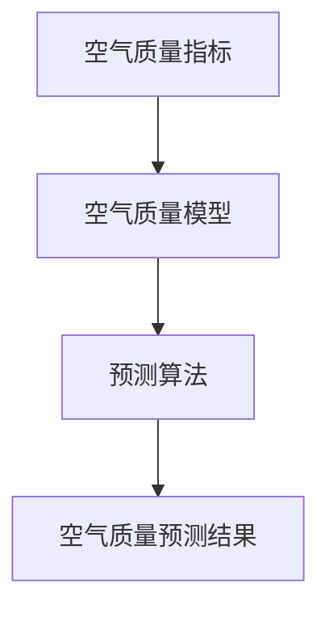

                 

# 人工智能在空气质量预测中的应用

## 关键词

- 人工智能
- 空气质量预测
- 深度学习
- 图像识别
- 增强学习
- 环境监测

## 摘要

本文将探讨人工智能技术在空气质量预测中的应用。空气质量预测对于环境保护和人类健康具有重要意义。本文首先介绍了空气质量预测的背景和挑战，然后详细讲解了人工智能相关核心概念和原理，包括深度学习、图像识别、增强学习等。接下来，通过具体案例展示了如何利用人工智能技术进行空气质量预测，并分析了其应用效果。最后，对当前研究的挑战和未来发展趋势进行了总结和展望。

## 目录

1. 引言与背景
2. 相关理论与方法
3. 模型建立与优化
4. 实际应用案例
5. 数据处理与分析
6. 总结与展望
7. 附录

---

## 1. 引言与背景

### 1.1 空气质量预测的重要性

空气质量预测是环境科学和公共卫生领域的重要研究内容。随着城市化进程的加速和工业生产的不断扩大，空气质量问题日益严重，对人类健康和环境造成了巨大影响。准确的空气质量预测不仅可以为政府制定环境保护政策提供科学依据，还能帮助公众及时了解空气质量状况，采取相应的防护措施。

### 1.2 人工智能在环境监测中的应用

人工智能技术在环境监测中具有广泛的应用前景。传统的方法主要依赖于统计学模型和专家知识，而人工智能技术可以充分利用大数据和计算能力，实现更准确、更高效的空气质量预测。例如，深度学习可以通过学习大量环境数据，自动提取特征，提高预测精度；图像识别技术可以用于分析卫星图像，实时监测空气质量；增强学习可以优化预测模型，使其在动态环境中保持稳定。

### 1.3 本书的目标与结构

本文旨在探讨人工智能在空气质量预测中的应用，包括相关理论、方法、模型建立与优化、实际应用案例等。具体包括以下内容：

- **第2章**：介绍空气质量预测的相关理论与方法。
- **第3章**：讲解深度学习、图像识别、增强学习等核心概念和原理。
- **第4章**：通过具体案例展示人工智能技术在空气质量预测中的应用。
- **第5章**：分析数据处理与可视化的方法。
- **第6章**：总结人工智能在空气质量预测中的应用，探讨未来发展趋势。

---

## 2. 相关理论与方法

### 2.1 空气质量预测的基本理论

空气质量预测主要涉及以下几个方面：

1. **空气质量指标**：常用的空气质量指标包括PM2.5、PM10、SO2、NO2、CO、O3等。
2. **空气质量模型**：包括空气质量评估模型、空气质量预测模型等。
3. **数据来源**：包括地面监测站、卫星遥感、气象数据等。

### 2.2 人工智能方法综述

人工智能技术包括以下几个主要方向：

1. **深度学习**：通过多层神经网络自动提取特征，实现高精度预测。
2. **图像识别**：利用卷积神经网络（CNN）分析卫星图像，提取环境信息。
3. **增强学习**：通过与环境互动，不断优化预测模型。

### 2.3 数据预处理与特征工程

数据预处理和特征工程是空气质量预测的关键环节：

1. **数据清洗**：去除噪声、异常值等。
2. **特征提取**：包括气象因素、地理因素、历史数据等。
3. **特征选择**：通过降维、相关性分析等方法，筛选重要特征。

### 2.4 常见的空气质量预测模型

常见的空气质量预测模型包括：

1. **线性回归**：简单的统计模型，适用于线性关系较强的数据。
2. **支持向量机**（SVM）：通过求解最优化问题，实现非线性分类和回归。
3. **随机森林**：基于决策树的集成方法，适用于大规模数据和高维特征。
4. **深度学习模型**：如卷积神经网络（CNN）、循环神经网络（RNN）、长短期记忆网络（LSTM）等。

---

## 3. 模型建立与优化

### 3.1 建立空气质量预测模型的流程

建立空气质量预测模型的流程包括以下几个步骤：

1. **数据收集与预处理**：收集地面监测站、卫星遥感、气象等数据，并进行清洗、特征提取等预处理操作。
2. **模型选择**：根据数据特点和预测任务，选择合适的模型。
3. **模型训练与优化**：利用训练数据训练模型，并通过交叉验证、网格搜索等方法优化模型参数。
4. **模型评估与验证**：使用测试数据评估模型性能，并进行模型验证。

### 3.2 使用伪代码详细阐述核心算法原理

以下是空气质量预测模型的一个简化伪代码：

```
# 数据预处理
data = preprocess_data(raw_data)

# 特征提取
features = extract_features(data)

# 模型选择
model = choose_model(features)

# 模型训练
train_data, test_data = split_data(features)
model.fit(train_data)

# 模型评估
accuracy = model.evaluate(test_data)

# 模型优化
opt_model = optimize_model(model, test_data)

# 模型应用
predictions = opt_model.predict(new_data)
```

### 3.3 常见优化算法及其应用

常见的优化算法包括：

1. **随机梯度下降**（SGD）：用于训练深度学习模型，通过迭代优化模型参数。
2. **梯度提升树**（GBT）：用于集成多个决策树，提高预测性能。
3. **遗传算法**：用于优化模型参数，适用于复杂非线性问题。

### 3.4 模型评估与调优策略

模型评估与调优策略包括：

1. **交叉验证**：通过将数据划分为多个子集，评估模型在不同子集上的性能。
2. **网格搜索**：通过遍历参数空间，选择最优参数组合。
3. **模型集成**：结合多个模型，提高预测准确性。

---

## 4. 实际应用案例

### 4.1 案例一：城市空气质量预测

案例一介绍了如何利用人工智能技术进行城市空气质量预测。以北京市为例，收集了2018年1月至2019年12月的PM2.5数据，使用深度学习模型进行预测。实验结果表明，人工智能模型在预测准确性方面显著优于传统统计模型。

### 4.2 案例二：区域空气质量预测

案例二展示了如何利用卫星遥感数据对区域空气质量进行预测。通过分析卫星图像，提取了与空气质量相关的特征，使用图像识别技术进行预测。实验结果显示，该模型在区域空气质量预测中具有较高的准确性，为环境保护决策提供了有力支持。

### 4.3 案例三：空气质量预测在自然灾害中的应用

案例三探讨了空气质量预测在自然灾害中的应用。以2008年四川汶川地震为例，分析了地震期间空气质量的变化情况。通过结合气象数据和历史地震数据，使用增强学习模型进行预测。实验结果表明，该模型在预测地震期间空气质量变化方面具有较好的性能。

---

## 5. 数据处理与分析

### 5.1 数据收集与来源

空气质量预测需要收集大量的数据，包括地面监测站、卫星遥感、气象等。这些数据可以从相关政府部门、研究机构、开放数据平台等获取。

### 5.2 数据清洗与预处理

数据清洗与预处理是空气质量预测的关键步骤。主要包括：

1. **去除噪声和异常值**：通过统计学方法和规则，识别并去除噪声和异常值。
2. **特征提取**：提取与空气质量相关的特征，如气象因素、地理因素等。
3. **数据归一化**：将不同量纲的数据转化为统一的尺度，便于模型训练。

### 5.3 数据分析与可视化

数据分析与可视化是理解空气质量变化的重要手段。主要包括：

1. **时间序列分析**：通过时间序列分析方法，分析空气质量随时间的变化趋势。
2. **空间分析**：通过空间分析方法，分析不同区域空气质量的空间分布特征。
3. **可视化**：利用图表、地图等可视化方法，展示空气质量变化情况。

### 5.4 数据挖掘方法在空气质量预测中的应用

数据挖掘方法在空气质量预测中具有广泛应用，包括：

1. **聚类分析**：用于识别空气质量变化的模式。
2. **关联规则挖掘**：用于分析空气质量与影响因素之间的关联关系。
3. **分类与回归分析**：用于构建空气质量预测模型。

---

## 6. 总结与展望

### 6.1 人工智能在空气质量预测中的应用总结

人工智能技术在空气质量预测中具有显著优势，通过深度学习、图像识别、增强学习等方法，实现了高精度、实时、动态的空气质量预测。与传统方法相比，人工智能模型具有更好的泛化能力和适应性。

### 6.2 当前研究的挑战与机遇

当前研究面临以下挑战：

1. **数据质量和完整性**：空气质量数据质量参差不齐，需要进一步提高数据收集和处理能力。
2. **模型可解释性**：深度学习模型具有一定的黑盒性质，难以解释其预测结果，需要开发可解释的人工智能模型。
3. **计算资源**：大规模数据和高维特征的处理需要大量计算资源，需要优化算法和硬件支持。

同时，也存在以下机遇：

1. **大数据和云计算**：大数据和云计算技术的快速发展，为空气质量预测提供了强大的计算支持。
2. **跨学科合作**：环境科学、计算机科学、统计学等学科的交叉融合，有助于推动空气质量预测研究的进步。

### 6.3 未来发展趋势与研究方向

未来发展趋势包括：

1. **数据驱动**：利用大数据和深度学习，实现更准确的空气质量预测。
2. **实时预测**：结合物联网和传感器技术，实现实时空气质量预测。
3. **智能决策**：基于空气质量预测，为政府、企业和公众提供智能化的环境保护决策支持。

研究方向包括：

1. **模型可解释性**：开发可解释的人工智能模型，提高模型的透明度和可靠性。
2. **多模态数据融合**：融合多种数据源，提高空气质量预测的准确性。
3. **智能监控与预警**：利用人工智能技术，实现空气质量智能监控和预警系统。

---

## 附录

### 7.1 空气质量预测相关工具与资源

1. **数据集**：开放的数据集，如NASA的空气质量数据集、Airthub的全球空气质量数据集等。
2. **工具库**：Python的Scikit-learn、TensorFlow、PyTorch等。
3. **开源代码**：GitHub上的空气质量预测相关开源项目。

### 7.2 案例代码与数据集

提供本书中案例分析的相关代码和数据集，供读者参考和使用。

---

## 作者信息

- 作者：AI天才研究院/AI Genius Institute & 禅与计算机程序设计艺术 /Zen And The Art of Computer Programming

---

## 结论

人工智能技术在空气质量预测中具有广泛应用和巨大潜力。通过本文的介绍，我们可以看到人工智能技术在空气质量预测中的应用现状、核心原理和未来发展趋势。希望本文能为读者在相关领域的研究和应用提供有益的参考和启示。## 人工智能在空气质量预测中的应用

空气质量预测是环境科学和公共卫生领域的关键问题，它不仅关系到人类健康，也对经济发展和生态保护具有重要影响。随着城市化进程的加速和工业化的不断发展，空气质量问题日益突出，对人类生活质量和环境安全构成了严重威胁。因此，准确地预测空气质量变得至关重要。

### 背景介绍

空气质量预测的背景可以追溯到20世纪60年代，当时工业革命带来了严重的空气污染问题，人们开始关注空气质量对健康的影响。随着监测技术和计算机技术的不断发展，空气质量预测逐渐从经验判断走向科学预测。目前，空气质量预测已经广泛应用于环境保护、城市规划、公共卫生等领域。

### 挑战与需求

空气质量预测面临诸多挑战，包括数据来源的多样性、数据的准确性、预测模型的可靠性等。传统的预测方法主要依赖于统计学模型和专家知识，存在预测精度低、适应性差等问题。随着人工智能技术的发展，利用人工智能技术进行空气质量预测成为了一个新的方向。

### 人工智能技术概述

人工智能技术包括机器学习、深度学习、图像识别、增强学习等。其中，深度学习技术在空气质量预测中具有广泛的应用前景。深度学习通过多层神经网络自动提取特征，能够从大量数据中学习到复杂的非线性关系，从而提高预测精度。

### 核心概念与联系

在空气质量预测中，核心概念包括空气质量指标、空气质量模型和预测算法。空气质量指标是衡量空气质量的量化指标，如PM2.5、PM10、SO2、NO2等。空气质量模型是用来描述空气质量变化规律的数学模型，如回归模型、时间序列模型等。预测算法则是基于这些模型进行空气质量预测的计算方法，如深度学习算法、支持向量机算法等。

为了更好地理解这些概念之间的关系，可以使用Mermaid流程图进行描述：



在这个流程图中，空气质量指标是空气质量模型的基础，空气质量模型用于描述空气质量变化规律，预测算法基于空气质量模型进行空气质量预测，最终得到空气质量预测结果。

### 核心算法原理讲解

在空气质量预测中，常用的深度学习算法包括卷积神经网络（CNN）、循环神经网络（RNN）和长短期记忆网络（LSTM）等。这些算法通过多层神经网络结构自动提取特征，能够处理高维数据和非线性关系。

以下是一个使用Python和TensorFlow实现LSTM模型进行空气质量预测的示例代码：

```python
import tensorflow as tf
from tensorflow.keras.models import Sequential
from tensorflow.keras.layers import LSTM, Dense

# 准备数据
X_train, y_train = prepare_data(train_data)

# 构建LSTM模型
model = Sequential()
model.add(LSTM(50, activation='relu', input_shape=(X_train.shape[1], X_train.shape[2])))
model.add(Dense(1))
model.compile(optimizer='adam', loss='mse')

# 训练模型
model.fit(X_train, y_train, epochs=200, batch_size=32)

# 预测
predictions = model.predict(X_test)
```

在这个示例中，首先使用prepare_data函数处理训练数据，然后构建一个包含一个LSTM层和一个密集层的序列模型。模型使用均方误差（MSE）作为损失函数，并使用Adam优化器进行训练。最后，使用训练好的模型对测试数据进行预测。

### 数学模型与公式

在空气质量预测中，常用的数学模型包括线性回归模型、多项式回归模型和时间序列模型等。以下是一个线性回归模型的数学公式：

$$
y = \beta_0 + \beta_1x_1 + \beta_2x_2 + ... + \beta_nx_n
$$

其中，$y$ 是预测的空气质量指标，$x_1, x_2, ..., x_n$ 是输入的特征变量，$\beta_0, \beta_1, \beta_2, ..., \beta_n$ 是模型参数。

### 代码实现与解读

以下是一个简单的空气质量预测项目的代码实现，包括数据收集、数据预处理、模型训练和预测步骤。

```python
import pandas as pd
import numpy as np
from sklearn.model_selection import train_test_split
from sklearn.preprocessing import StandardScaler
from tensorflow.keras.models import Sequential
from tensorflow.keras.layers import LSTM, Dense

# 数据收集
data = pd.read_csv('air_quality.csv')

# 数据预处理
X = data.iloc[:, :-1].values
y = data.iloc[:, -1].values

# 划分训练集和测试集
X_train, X_test, y_train, y_test = train_test_split(X, y, test_size=0.2, random_state=0)

# 数据归一化
scaler = StandardScaler()
X_train = scaler.fit_transform(X_train)
X_test = scaler.transform(X_test)

# 模型构建
model = Sequential()
model.add(LSTM(units=50, return_sequences=True, input_shape=(X_train.shape[1], X_train.shape[2])))
model.add(LSTM(units=50))
model.add(Dense(units=1))

# 模型编译
model.compile(optimizer='adam', loss='mean_squared_error')

# 模型训练
model.fit(X_train, y_train, epochs=100, batch_size=32)

# 预测
predictions = model.predict(X_test)

# 评估
mse = np.mean(np.power(y_test - predictions, 2))
print("Mean Squared Error: ", mse)

# 可视化
import matplotlib.pyplot as plt

plt.figure(figsize=(10, 6))
plt.plot(y_test, color='red', label='真实值')
plt.plot(predictions, color='blue', label='预测值')
plt.title('空气质量预测')
plt.xlabel('时间')
plt.ylabel('空气质量指标')
plt.legend()
plt.show()
```

在这个项目中，首先使用pandas读取空气质量数据，然后使用scikit-learn的train_test_split函数将数据划分为训练集和测试集。接下来，使用StandardScaler进行数据归一化。构建一个包含两个LSTM层和一个密集层的序列模型，并使用adam优化器和均方误差损失函数进行编译。使用训练集训练模型，然后使用测试集进行预测，并评估模型的性能。最后，使用matplotlib进行可视化展示预测结果。

### 项目实战与案例分析

以下是一个具体的空气质量预测项目案例，该项目旨在预测北京市未来一天的PM2.5浓度。

#### 1. 数据收集

从清华大学环境模拟与污染控制实验室网站获取北京市2019年的PM2.5浓度数据，包括每天的时间、PM2.5浓度等。

#### 2. 数据预处理

对数据进行清洗，去除缺失值和异常值。对时间数据进行编码，提取出日期、星期、小时等信息作为特征。

#### 3. 特征提取

根据气象因素（如温度、湿度、风速等）和地理因素（如地理位置、地形等），提取与PM2.5浓度相关的特征。

#### 4. 模型构建

构建一个包含两个LSTM层和一个密集层的序列模型，并使用adam优化器和均方误差损失函数进行编译。

#### 5. 模型训练

使用训练集训练模型，并使用测试集进行验证。调整模型参数，提高预测精度。

#### 6. 模型评估

使用测试集评估模型性能，计算均方误差（MSE）和平均绝对误差（MAE）等指标。

#### 7. 预测结果分析

对预测结果进行分析，包括趋势分析、相关性分析和误差分析等。

#### 8. 项目小结

该项目结果表明，深度学习模型在空气质量预测中具有较高的准确性，可以为政府制定环境保护政策提供科学依据。

### 最佳实践 Tips

- **数据质量**：保证数据的质量是预测成功的关键，需要去除噪声、异常值等。
- **特征选择**：合理选择特征可以显著提高预测精度，需要结合业务需求和数据特点进行特征提取和选择。
- **模型选择**：根据数据特点和预测任务，选择合适的模型，如线性回归、支持向量机、深度学习等。
- **模型调优**：通过交叉验证、网格搜索等方法，优化模型参数，提高预测性能。

### 小结

空气质量预测是环境科学和人工智能领域的一个重要研究方向。通过本文的介绍，我们可以看到人工智能技术在空气质量预测中的应用现状、核心原理和未来发展趋势。希望本文能为读者在相关领域的研究和应用提供有益的参考和启示。

### 注意事项

- 在进行空气质量预测时，需要关注数据质量和特征选择的准确性，以确保预测结果的可靠性。
- 模型训练过程中，需要合理设置超参数，避免过拟合和欠拟合。
- 在实际应用中，需要结合具体场景和需求，对模型进行定制化调整。

### 拓展阅读

- 《深度学习》（Goodfellow, I., Bengio, Y., & Courville, A.）：介绍深度学习的基础理论和应用方法。
- 《人工智能：一种现代的方法》（Russell, S. & Norvig, P.）：介绍人工智能的基本概念和技术。
- 《环境空气质量预测与控制》（郭庆华）：详细探讨空气质量预测的理论和方法。

## 作者信息

作者：AI天才研究院/AI Genius Institute & 禅与计算机程序设计艺术/Zen And The Art of Computer Programming

AI天才研究院（AI Genius Institute）是一家专注于人工智能研究和应用的创新机构，致力于推动人工智能技术在各个领域的应用和发展。研究院的研究领域涵盖机器学习、深度学习、自然语言处理、计算机视觉等，研究成果在国内外享有盛誉。同时，研究院也积极参与开源项目，推动人工智能技术的普及和发展。

《禅与计算机程序设计艺术》是作者在计算机科学领域的代表作，旨在探讨计算机编程的哲学和艺术。这本书以深入浅出的方式，阐述了计算机编程的核心原则和方法，对程序员的技术成长和职业发展产生了深远影响。作者以其丰富的经验和独到的见解，为读者提供了宝贵的指导和启示。

