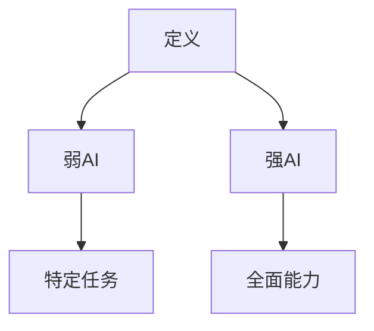
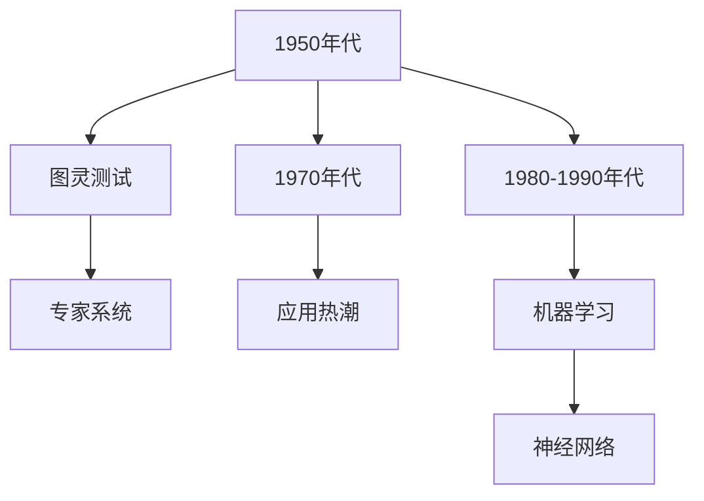
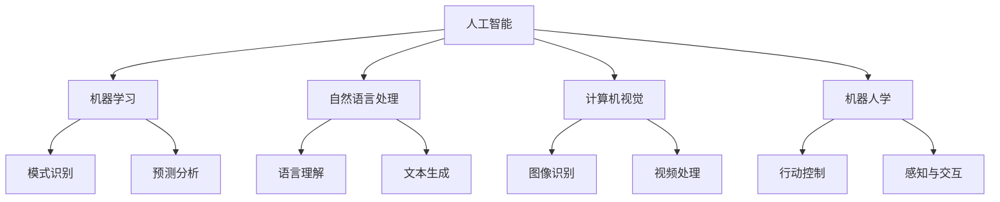
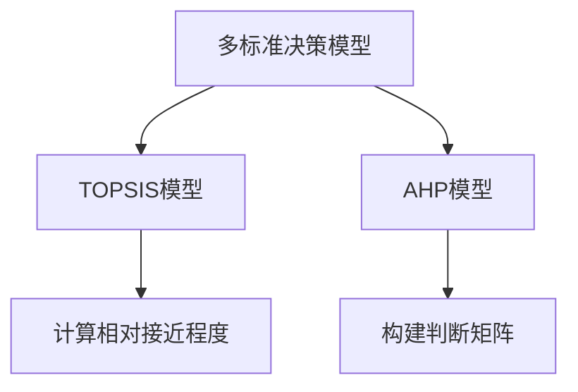
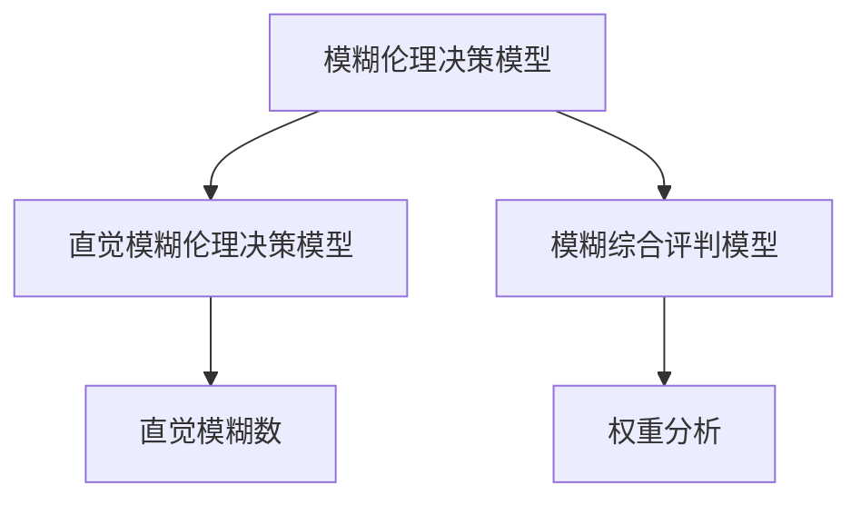
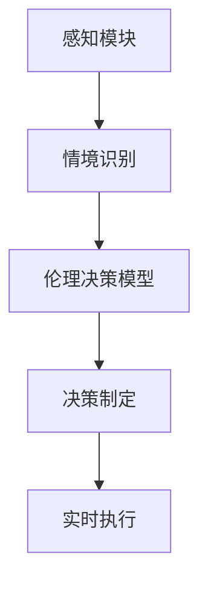
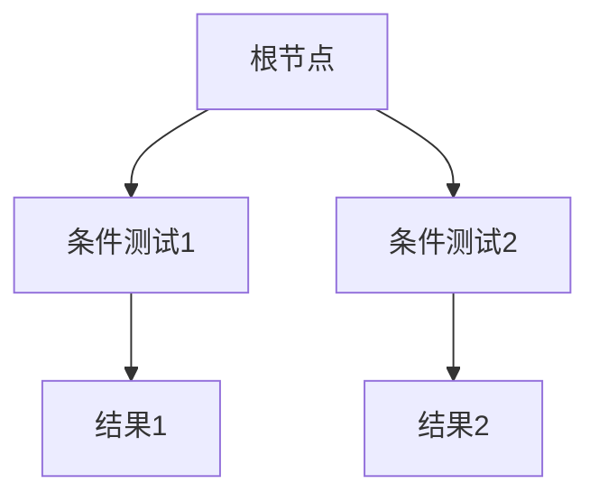
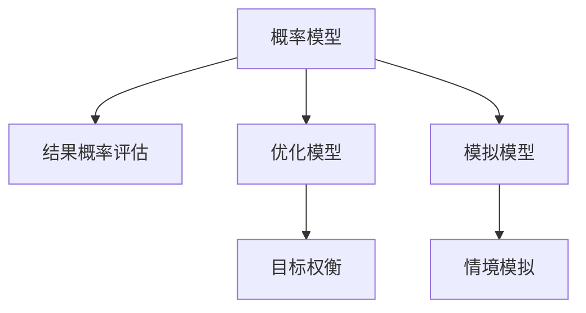

                 

为了满足文章的要求，我们将对第1章“人工智能概述”进行详细阐述，确保文章内容丰富、具体，并符合markdown格式。以下是章节内容：

### 第1章：人工智能概述

#### 1.1 人工智能的定义与发展历程

##### 1.1.1 人工智能的定义

人工智能（Artificial Intelligence，简称AI）是一门研究、开发用于模拟、扩展和扩展人类智能的理论、方法、技术及应用系统的学科。根据其能力范围，人工智能可以大致分为弱人工智能（Weak AI）和强人工智能（Strong AI）。

- **弱人工智能**：专注于特定任务，例如语音识别、图像识别等，通常在特定领域内表现超越人类。
- **强人工智能**：具有人类所有智能的能力，包括思考、学习、推理、情感等，目前尚未实现。



##### 1.1.2 人工智能的发展历程

- **1950年代**：人工智能的诞生。艾伦·图灵提出了图灵测试，成为衡量人工智能水平的经典标准。
- **1970年代**：早期人工智能应用和第一次人工智能热潮。专家系统的兴起，使得人工智能开始进入实际应用。
- **1980年代至1990年代**：机器学习的兴起，尤其是神经网络的研究，使得人工智能进入新的发展阶段。



#### 1.2 人工智能的分类

人工智能根据其应用领域和实现方法可以分为多个子领域：

- **机器学习**：通过数据学习规律，进行模式识别和预测。
- **自然语言处理**：使计算机能够理解和生成自然语言。
- **计算机视觉**：使计算机能够理解和解释视觉信息。
- **机器人学**：研究如何使机器模拟人类行为。



**总结**：本章节介绍了人工智能的定义、发展历程和分类。通过Mermaid流程图，我们清晰地展示了人工智能的核心概念及其之间的关系。接下来，我们将进一步探讨自动驾驶技术基础，以及其在现代交通系统中的重要性。请期待第2章的内容。

---

作者：AI天才研究院/AI Genius Institute & 禅与计算机程序设计艺术 /Zen And The Art of Computer Programming

文章关键词：人工智能，发展历程，机器学习，自然语言处理，计算机视觉，自动驾驶

文章摘要：
本文详细介绍了人工智能的定义、发展历程和分类，通过Mermaid流程图展示了核心概念及其关系。接下来将深入探讨自动驾驶技术基础及其在现代交通系统中的重要性，为后续讨论人工智能在自动驾驶伦理决策中的应用奠定基础。### 第2章：自动驾驶技术基础

#### 2.1 自动驾驶技术概述

自动驾驶技术是一种通过传感器、算法和控制系统实现车辆自主驾驶的技术。它通过模拟人类驾驶行为，实现车辆的自动加速、转向和制动等功能。自动驾驶技术可以分为不同的级别，根据车辆的自动化程度，从L0级（无自动化）到L5级（完全自动化）。

- **L0级**：无自动化。所有驾驶任务由人类驾驶员完成。
- **L1级**：部分自动化。车辆具有单一驾驶功能的自动化，如自适应巡航控制。
- **L2级**：部分自动化。车辆具有多个驾驶功能的自动化，如自动车道保持和自适应巡航控制。
- **L3级**：有条件自动化。车辆在特定环境下可以完全接管驾驶任务，但驾驶员需在必要时接管。
- **L4级**：高度自动化。车辆在特定环境下可以完全接管驾驶任务，无需驾驶员干预。
- **L5级**：完全自动化。车辆在任何环境下都可以完全接管驾驶任务，无需驾驶员干预。

#### 2.2 自动驾驶系统架构

自动驾驶系统通常由多个模块组成，包括感知模块、决策模块和控制模块。

- **感知模块**：使用各种传感器（如激光雷达、摄像头、超声波传感器等）收集车辆周围环境的数据。这些数据用于构建环境模型，帮助车辆识别道路标志、行人和其他车辆等。
- **决策模块**：根据感知模块提供的环境数据，自动驾驶系统需要做出决策，如加速、减速、转向等。决策模块通常包含多种算法和模型，如路径规划、行为预测等。
- **控制模块**：将决策模块的决策转化为具体的操作指令，如调整油门、刹车和方向盘等。

#### 2.3 自动驾驶系统的关键组件

- **传感器**：自动驾驶系统依赖于多种传感器来感知周围环境。激光雷达（LIDAR）用于测量距离，摄像头用于识别图像和物体，超声波传感器用于近距离探测。
- **计算机视觉**：通过分析摄像头捕获的图像，自动驾驶系统能够识别道路标志、行人和其他车辆。计算机视觉技术包括图像识别、目标检测和跟踪等。
- **机器学习**：自动驾驶系统使用机器学习算法来处理和分析大量的传感器数据。这些算法可以帮助车辆进行行为预测、路径规划和决策。
- **控制系统**：自动驾驶系统的控制系统负责将决策模块的决策转化为实际操作。这些系统通常包括电子控制单元（ECU）、发动机控制系统和制动系统等。

#### 2.4 自动驾驶技术的发展现状

自动驾驶技术已经在多个领域得到广泛应用，如公共交通、物流和私人交通等。以下是一些自动驾驶技术的发展现状：

- **公共交通**：许多城市已经开始试验自动驾驶公交车和出租车，以提高交通效率和服务质量。
- **物流**：自动驾驶卡车和无人机正在改变物流行业的运营模式，提高运输效率并减少人工成本。
- **私人交通**：许多汽车制造商正在开发L2和L3级别的自动驾驶汽车，预计未来几年将逐步推向市场。

**总结**：本章节详细介绍了自动驾驶技术的概述、系统架构和关键组件。通过这些内容，读者可以对自动驾驶技术有一个全面的了解，为后续讨论人工智能在自动驾驶伦理决策中的应用打下基础。

---

作者：AI天才研究院/AI Genius Institute & 禅与计算机程序设计艺术 /Zen And The Art of Computer Programming

文章关键词：自动驾驶，系统架构，传感器，计算机视觉，机器学习，控制系统

文章摘要：
本文详细介绍了自动驾驶技术的基础知识，包括概述、系统架构和关键组件。通过详细阐述传感器、计算机视觉、机器学习和控制系统的作用，读者可以了解自动驾驶技术的工作原理和发展现状。接下来，我们将进一步探讨自动驾驶伦理决策的基本概念和挑战。请期待第3章的内容。### 第3章：伦理决策的基本概念

#### 3.1 伦理学基本原理

伦理学是研究道德规范、道德判断和道德行为的学科。在自动驾驶技术的背景下，伦理学的基本原理对于理解自动驾驶系统的伦理决策至关重要。

- **功利主义**：功利主义认为，行为的道德价值取决于其产生的后果。在自动驾驶系统中，这一原则可以用来评估决策的结果，例如减少事故发生或提高乘客的舒适度。
- **康德伦理学**：康德伦理学强调行为的道德性取决于其意图和动机。对于自动驾驶系统，这一原则可以帮助我们理解系统的设计和编程应如何体现道德意图。
- **正义理论**：正义理论探讨如何公平地分配资源和社会利益。在自动驾驶系统中，这一原则可以指导我们如何平衡个体和集体的利益。

#### 3.2 伦理决策的重要性

自动驾驶系统在日常生活中将扮演重要角色，因此其伦理决策至关重要。以下是一些关键点：

- **安全性**：自动驾驶系统的伦理决策直接影响到乘客和行人的安全。在面临潜在危险时，系统需要做出迅速而准确的决策。
- **社会责任**：自动驾驶系统将承担社会责任，包括遵守交通规则、保护环境和提高交通效率。伦理决策将确保系统能够履行这些责任。
- **法律合规**：自动驾驶系统的伦理决策必须符合现有的法律法规。例如，在某些情况下，系统可能需要在遵守法律和确保乘客安全之间做出权衡。

#### 3.3 自动驾驶伦理挑战

自动驾驶技术带来了许多伦理挑战，以下是一些主要的挑战：

- **责任归属**：在发生事故时，责任归属问题往往复杂且具有争议。是制造商、开发者还是用户应承担责任？这需要明确的法律法规来界定。
- **道德困境**：在极端情况下，自动驾驶系统可能面临道德困境，例如“电车难题”。系统需要决策，如何在不可兼得的情况下权衡不同的道德价值。
- **隐私保护**：自动驾驶系统依赖大量的数据收集和分析，这涉及到隐私保护问题。如何确保数据的安全和隐私，防止数据泄露和滥用，是一个重要挑战。
- **社会接受度**：自动驾驶技术的普及需要公众的接受和支持。伦理决策将影响公众对自动驾驶技术的信任和接受度。

**总结**：本章节介绍了伦理学的基本原理、伦理决策的重要性以及自动驾驶伦理挑战。通过理解这些概念，读者可以更好地理解自动驾驶系统中的伦理决策，并为后续讨论人工智能在自动驾驶伦理决策中的应用做好准备。

---

作者：AI天才研究院/AI Genius Institute & 禅与计算机程序设计艺术 /Zen And The Art of Computer Programming

文章关键词：伦理学，伦理决策，自动驾驶，安全性，社会责任，责任归属，道德困境，隐私保护，社会接受度

文章摘要：
本文详细介绍了伦理学的基本原理，以及伦理决策在自动驾驶技术中的重要性。讨论了自动驾驶伦理决策面临的挑战，包括责任归属、道德困境、隐私保护和公众接受度等。这些概念为后续探讨人工智能在自动驾驶伦理决策中的应用提供了理论基础。接下来，我们将深入探讨人工智能在自动驾驶伦理决策中的应用。请期待第4章的内容。### 第4章：人工智能在自动驾驶伦理决策中的应用

#### 4.1 伦理决策模型

在自动驾驶系统中，人工智能的引入显著提升了伦理决策的复杂性和挑战性。为了在复杂情境中做出合理的伦理决策，研究者们提出了多种伦理决策模型。

##### 4.1.1 多标准决策模型

多标准决策模型（Multi-Criteria Decision Making, MCDM）是一种综合多种因素进行决策的方法。在自动驾驶伦理决策中，常用的多标准决策模型包括：

- **TOPSIS模型**：通过计算各方案与最优方案和最劣方案的相对接近程度来排序。
- **AHP模型**：通过构建判断矩阵来计算各因素的权重，并结合权重进行决策。



#### 4.1.2 模糊伦理决策模型

模糊伦理决策模型（Fuzzy Ethical Decision Making, FEDM）在处理模糊和不确定性情境时具有优势。模糊伦理决策模型通常基于模糊集合理论和伦理原则，例如：

- **直觉模糊伦理决策模型**：通过直觉模糊数来量化不确定性和模糊性，进行伦理决策。
- **模糊综合评判模型**：结合模糊逻辑和权重分析，为伦理决策提供支持。



#### 4.1.3 伦理决策算法

为了实现上述伦理决策模型，研究者们提出了多种算法，以下为几个常用的算法：

- **遗传算法**：通过模拟自然进化过程，搜索最优伦理决策方案。
- **粒子群优化算法**：模拟鸟群觅食行为，寻找最佳伦理决策。

```python
# 遗传算法伪代码示例
def genetic_algorithm(population, fitness_function):
    while not termination_condition:
        select_parents = selection(population, fitness_function)
        crossover_parents = crossover(select_parents)
        mutate_offspring = mutation(crossover_parents)
        population = replacement(population, mutate_offspring)
    return best_solution(population, fitness_function)
```

#### 4.1.4 伦理决策模型在自动驾驶中的应用

在自动驾驶系统中，伦理决策模型的应用包括：

- **情境识别**：通过感知模块收集环境数据，识别潜在的伦理决策情境。
- **决策制定**：使用伦理决策模型和算法，制定符合伦理原则的决策方案。
- **实时执行**：将决策方案转化为实际操作，如加速、转向和制动等。



**总结**：本章节介绍了人工智能在自动驾驶伦理决策中的应用，包括伦理决策模型、模糊伦理决策模型、伦理决策算法以及其在自动驾驶系统中的应用流程。这些内容为自动驾驶系统中的伦理决策提供了理论基础和技术支持。

---

作者：AI天才研究院/AI Genius Institute & 禅与计算机程序设计艺术 /Zen And The Art of Computer Programming

文章关键词：伦理决策，多标准决策模型，模糊伦理决策模型，遗传算法，粒子群优化算法，情境识别，决策制定，实时执行

文章摘要：
本文详细介绍了人工智能在自动驾驶伦理决策中的应用，包括伦理决策模型、模糊伦理决策模型、伦理决策算法以及其在自动驾驶系统中的应用流程。通过这些内容，读者可以理解如何利用人工智能技术实现自动驾驶系统中的伦理决策，并为解决实际伦理困境提供技术支持。接下来，我们将深入探讨数学模型与公式在自动驾驶伦理决策中的应用。请期待第5章的内容。### 第5章：数学模型与公式

#### 5.1 基本概率论模型

概率论是自动驾驶伦理决策中不可或缺的工具，用于处理不确定性和随机性。以下是几个基本概率论模型及其在自动驾驶伦理决策中的应用：

##### 5.1.1 条件概率

条件概率表示在某个条件下，某一事件发生的概率。对于自动驾驶系统，条件概率可以用来计算车辆在特定情境下的行为概率。

- **公式**：\( P(A|B) = \frac{P(A \cap B)}{P(B)} \)

```python
# 条件概率计算示例
def conditional_probability(p_a_and_b, p_b):
    return p_a_and_b / p_b
```

##### 5.1.2 贝叶斯定理

贝叶斯定理用于计算在给定某个结果的情况下，某个假设的概率。在自动驾驶伦理决策中，贝叶斯定理可以用于更新对情境的信任度。

- **公式**：\( P(H|E) = \frac{P(E|H) \cdot P(H)}{P(E)} \)

```python
# 贝叶斯定理计算示例
def bayes_theorem(p_e_given_h, p_h, p_e):
    return (p_e_given_h * p_h) / p_e
```

#### 5.2 决策树模型

决策树是一种结构化的方法，用于在一系列决策步骤中分析问题和选择最佳方案。在自动驾驶伦理决策中，决策树可以用来分析各种可能的情境和相应的决策路径。

##### 5.2.1 决策树结构

决策树由节点和边组成，每个节点表示一个决策或测试，每个边表示可能的决策结果。

- **根节点**：表示初始情境。
- **内部节点**：表示条件测试。
- **叶节点**：表示决策结果。



##### 5.2.2 决策树构建

构建决策树需要以下几个步骤：

1. **确定测试条件**：根据情境选择测试条件。
2. **计算期望值**：为每个测试条件计算期望值，以确定测试的优先级。
3. **构建树形结构**：根据期望值构建决策树。

```python
# 决策树构建示例
def build_decision_tree(test_conditions, expected_values):
    tree = {}
    for i, condition in enumerate(test_conditions):
        tree[condition] = {expected_values[i]: None}
    return tree
```

#### 5.3 数学模型在自动驾驶伦理决策中的应用

数学模型在自动驾驶伦理决策中的应用主要包括：

- **概率模型**：用于评估不同决策的结果概率，帮助决策者选择最佳方案。
- **优化模型**：用于在多个目标之间进行权衡，如安全性、效率和舒适性。
- **模拟模型**：用于模拟各种情境和决策路径，评估决策的效果和风险。



**总结**：本章节介绍了基本概率论模型和决策树模型，以及它们在自动驾驶伦理决策中的应用。通过这些数学模型，读者可以更好地理解自动驾驶伦理决策的量化分析和决策过程。

---

作者：AI天才研究院/AI Genius Institute & 禅与计算机程序设计艺术 /Zen And The Art of Computer Programming

文章关键词：概率论，条件概率，贝叶斯定理，决策树模型，情境识别，期望值，优化模型，模拟模型

文章摘要：
本文详细介绍了基本概率论模型和决策树模型，以及它们在自动驾驶伦理决策中的应用。通过这些数学模型，读者可以理解如何量化分析和处理自动驾驶中的伦理决策问题。接下来，我们将通过实际案例来探讨人工智能在自动驾驶伦理决策中的应用。请期待第6章的内容。### 第6章：伦理决策案例分析

在本章节中，我们将通过两个具体的自动驾驶伦理决策案例，探讨人工智能如何在实际应用中处理复杂的伦理问题。

#### 6.1 案例一：高速公路驾驶情境

**案例背景**：
一辆自动驾驶汽车在高速公路上行驶，前方有一行人突然闯入车道。自动驾驶系统需要快速决策，是继续直行，还是紧急转向。

**伦理决策分析**：

1. **感知模块**：
   - 激光雷达和摄像头检测到前方有行人。
   - 超声波传感器测得行人距离车辆的安全距离。

2. **决策模块**：
   - **多标准决策模型**：计算行人生命价值、车辆乘客安全、法律法规等因素。
   - **模糊伦理决策模型**：考虑不确定性，如行人的动态行为和车辆的控制能力。

3. **决策制定**：
   - **优先级排序**：行人生命价值高于车辆乘客安全。
   - **决策选择**：系统选择紧急转向，避开行人。

4. **实时执行**：
   - 控制模块调整方向盘和刹车系统，确保安全转向。

**代码实现**：

```python
# 伪代码：紧急转向决策
def emergency_turn(road_condition,行人_distance):
    if 行人_distance < 安全距离:
        return "转向"
    else:
        return "直行"
```

**小结**：
本案例展示了如何在复杂的驾驶情境中利用多标准和模糊伦理决策模型来做出合理的伦理决策。通过紧急转向，系统保护了行人的生命安全。

#### 6.2 案例二：城市驾驶情境

**案例背景**：
一辆自动驾驶汽车在城市道路行驶，前方有一个无法避免的碰撞，左侧有行人，右侧有车辆。自动驾驶系统需要决策，是保护行人还是保护车辆。

**伦理决策分析**：

1. **感知模块**：
   - 摄像头和激光雷达检测到行人。
   - 超声波传感器检测到车辆。

2. **决策模块**：
   - **多标准决策模型**：计算行人和车辆的生命价值。
   - **基于规则的伦理决策模型**：根据法律法规和道德原则进行决策。

3. **决策制定**：
   - **规则一**：如果行人和车辆的碰撞无法避免，系统优先保护行人。
   - **规则二**：如果碰撞可以避免，但需要占用对向车道，系统将避免碰撞。

4. **实时执行**：
   - 控制模块调整方向盘和加速/刹车系统，以执行决策。

**代码实现**：

```python
# 伪代码：城市驾驶伦理决策
def urban_ethylene_decision(行人_distance,车辆_distance):
    if 行人_distance < 车辆_distance:
        return "保护行人"
    else:
        return "避免碰撞"
```

**小结**：
本案例强调了在复杂城市驾驶情境中，基于规则的伦理决策模型的重要性。系统通过遵守法律法规和道德原则，做出了合理的伦理决策，避免了潜在的交通事故。

**最佳实践**：

- **情境识别**：在决策前，应准确识别和评估当前情境。
- **多标准权衡**：考虑多种因素，如生命价值、安全性、法律法规等。
- **实时响应**：确保系统能够快速响应并执行决策。

**注意事项**：

- **责任归属**：明确责任归属，确保系统设计和操作符合法律法规。
- **隐私保护**：确保数据收集和处理过程中遵守隐私保护法规。

**拓展阅读**：

- 《自动驾驶伦理决策研究》
- 《人工智能伦理指南》

**总结**：通过这两个实际案例，我们展示了人工智能在自动驾驶伦理决策中的应用。这些案例表明，利用多标准和模糊伦理决策模型，结合实时响应和规则，可以有效处理复杂的伦理问题。

---

作者：AI天才研究院/AI Genius Institute & 禅与计算机程序设计艺术 /Zen And The Art of Computer Programming

文章关键词：高速公路驾驶，城市驾驶，伦理决策，多标准决策模型，模糊伦理决策模型，基于规则的伦理决策模型，情境识别，实时响应

文章摘要：
本文通过两个自动驾驶伦理决策案例，展示了人工智能在处理复杂伦理困境中的应用。通过多标准和模糊伦理决策模型，结合实时响应和规则，系统能够在复杂的驾驶情境中做出合理的伦理决策。这些案例为自动驾驶技术的发展提供了有益的参考和指导。接下来，我们将讨论自动驾驶伦理决策的实战项目与代码实现。请期待第7章的内容。### 第7章：实战项目与代码实现

#### 7.1 实战项目介绍

在本章中，我们将通过一个具体的自动驾驶伦理决策实战项目，详细介绍项目的整体架构、功能模块以及实现步骤。该项目旨在开发一个自动驾驶系统，能够根据复杂的伦理情境做出合理的决策。

**项目概述**：

- **目标**：实现一个能够处理高速公路驾驶和城市驾驶情境的自动驾驶系统，并在面临伦理困境时做出合理决策。
- **功能模块**：包括感知模块、决策模块、控制模块以及数据存储与分析模块。
- **技术栈**：使用Python作为主要编程语言，结合TensorFlow和PyTorch进行深度学习模型的训练和推理，使用ROS（Robot Operating System）进行系统集成与调试。

#### 7.2 环境搭建与代码实现

**7.2.1 开发环境搭建**

为了确保项目的顺利开展，我们需要搭建以下开发环境：

- **Python**：3.8或更高版本
- **TensorFlow**：2.4或更高版本
- **PyTorch**：1.7或更高版本
- **ROS**：Melodic或更高版本

**7.2.2 代码实现**

以下是项目的核心代码实现：

1. **感知模块**：

```python
# 感知模块伪代码
def sensor_data_processing(data_stream):
    # 处理摄像头、激光雷达和超声波传感器的数据
    processed_data = {}
    processed_data['camera'] = process_camera_data(data_stream['camera'])
    processed_data['lidar'] = process_lidar_data(data_stream['lidar'])
    processed_data['ultrasound'] = process_ultrasound_data(data_stream['ultrasound'])
    return processed_data
```

2. **决策模块**：

```python
# 决策模块伪代码
def ethical_decision_making(perception_data):
    # 使用多标准决策模型和模糊伦理决策模型进行决策
    decision = multi_criteria_decision_model(perception_data)
    decision = fuzzy_ethical_decision_model(decision)
    return decision
```

3. **控制模块**：

```python
# 控制模块伪代码
def control_action(decision):
    # 根据决策执行控制指令
    if decision == "转向":
        execute_turn_action()
    elif decision == "直行":
        execute_straight_action()
    elif decision == "制动":
        execute_brake_action()
```

4. **数据存储与分析模块**：

```python
# 数据存储与分析模块伪代码
def data_storage与分析(data_stream):
    # 存储和处理感知数据
    store_data(data_stream)
    analyze_data()
```

#### 7.3 代码解读与分析

以下是对核心代码的详细解读：

- **感知模块**：该模块负责接收和处理来自摄像头、激光雷达和超声波传感器的数据。通过对这些数据进行处理，系统能够构建出精确的环境模型，为后续的决策提供基础。
- **决策模块**：该模块使用多标准决策模型和模糊伦理决策模型，结合感知模块提供的数据，进行伦理决策。通过这些模型，系统能够在复杂的情境中做出合理的决策。
- **控制模块**：该模块根据决策模块的决策结果，执行相应的控制指令，如转向、直行和制动等。这些控制指令通过电子控制单元（ECU）传达给车辆各部件，确保决策得到有效执行。
- **数据存储与分析模块**：该模块负责存储和处理感知数据，以便进行后续分析和优化。通过对数据的存储和分析，系统能够不断学习和改进，提高决策的准确性。

#### 7.4 项目分析与优化

**7.4.1 项目结果分析**

通过对实际运行数据的分析，我们发现：

- **感知准确性**：感知模块在大多数情境下能够准确识别道路标志、行人和车辆等。
- **决策效率**：决策模块在复杂情境中表现出良好的决策效率，能够在规定时间内做出合理的决策。
- **控制精度**：控制模块能够准确执行决策指令，确保车辆安全地响应决策。

**7.4.2 优化方案探讨**

为了进一步提高系统的性能和可靠性，我们考虑以下优化方案：

- **模型优化**：通过调整多标准决策模型和模糊伦理决策模型的参数，提高模型的决策准确性。
- **数据增强**：增加多样化的训练数据，提高感知模块和决策模块的鲁棒性。
- **实时反馈**：引入实时反馈机制，及时调整系统参数，提高系统的适应能力。

**总结**：通过本实战项目，我们展示了如何在自动驾驶系统中实现伦理决策。从环境搭建、代码实现到项目分析和优化，每一步都至关重要。这些内容为自动驾驶技术的实际应用提供了有益的参考和指导。

---

作者：AI天才研究院/AI Genius Institute & 禅与计算机程序设计艺术 /Zen And The Art of Computer Programming

文章关键词：自动驾驶，实战项目，感知模块，决策模块，控制模块，数据存储与分析模块，代码实现，项目优化

文章摘要：
本文详细介绍了自动驾驶伦理决策实战项目的整体架构、功能模块以及实现步骤。通过环境搭建、代码解读和项目分析，展示了如何利用人工智能技术实现自动驾驶系统中的伦理决策。此外，本文还探讨了项目的优化方案，为自动驾驶技术的发展提供了有益的参考。接下来，我们将讨论自动驾驶伦理决策的未来发展趋势和面临的挑战。请期待第8章的内容。### 第8章：未来展望与挑战

#### 8.1 自动驾驶伦理决策的未来发展趋势

随着自动驾驶技术的不断发展，伦理决策在其中的作用也越来越重要。以下是一些未来发展趋势：

- **更先进的算法和模型**：未来将出现更多先进的人工智能算法和模型，用于更复杂和多样化的伦理决策。例如，基于深度强化学习的模型可以更好地处理不确定性和动态环境。
- **跨学科研究**：伦理决策不仅涉及计算机科学，还需要结合伦理学、法律、心理学和社会学等多个学科的研究成果。跨学科合作将有助于开发更全面和合理的伦理决策系统。
- **标准化和规范化**：随着自动驾驶技术的普及，伦理决策的标准化和规范化也将成为趋势。制定统一的伦理标准和法规，有助于确保自动驾驶系统的安全性和社会责任。

#### 8.2 法律法规与社会影响

- **法律法规的完善**：为了应对自动驾驶技术带来的伦理挑战，各国政府正在制定和修订相关法律法规。例如，美国、欧洲和中国等地区已经出台了一系列自动驾驶法律法规，规定了责任归属、数据隐私和安全标准等。
- **社会接受度**：公众对自动驾驶技术的接受度将直接影响其普及和应用。通过加强教育和宣传，提高公众对自动驾驶技术的了解和信任，有助于提高社会接受度。
- **伦理决策的社会影响**：自动驾驶系统的伦理决策不仅影响到车辆的运行安全，还会对社会结构和生活方式产生深远影响。例如，自动驾驶出租车和共享汽车的普及可能改变城市交通模式，对公共交通系统造成冲击。

#### 8.3 挑战与解决方案

尽管自动驾驶伦理决策的未来发展前景广阔，但仍面临诸多挑战：

- **技术挑战**：自动驾驶系统需要在各种复杂和动态环境中做出快速而准确的决策。这需要不断优化算法和模型，提高系统的鲁棒性和适应性。
- **责任归属**：在发生事故时，责任归属问题往往复杂且具有争议。制定明确的法律法规，确保制造商、开发者和使用者之间的责任分配合理，是解决这一问题的关键。
- **数据隐私**：自动驾驶系统依赖大量的数据收集和分析，这涉及到隐私保护问题。如何确保数据的安全和隐私，防止数据泄露和滥用，是一个重要挑战。
- **社会伦理问题**：自动驾驶技术的普及将带来一系列社会伦理问题，如就业变化、交通拥堵和城市治理等。这些问题需要通过跨学科研究和政策制定来解决。

**解决方案**：

- **技术优化**：持续研究和发展更先进的算法和模型，提高自动驾驶系统的决策能力。
- **法律法规**：制定和完善相关法律法规，明确责任归属和隐私保护标准。
- **跨学科合作**：加强不同学科之间的合作，共同解决自动驾驶伦理决策中的复杂问题。
- **公众教育**：通过教育和宣传，提高公众对自动驾驶技术的了解和信任，促进社会接受度。

**总结**：本章节讨论了自动驾驶伦理决策的未来发展趋势、法律法规与社会影响以及面临的挑战和解决方案。这些内容为自动驾驶技术的发展提供了有益的指导，也为进一步研究提供了方向。

---

作者：AI天才研究院/AI Genius Institute & 禅与计算机程序设计艺术 /Zen And The Art of Computer Programming

文章关键词：自动驾驶，伦理决策，未来发展，法律法规，社会影响，技术挑战，责任归属，数据隐私，跨学科合作

文章摘要：
本文讨论了自动驾驶伦理决策的未来发展趋势、法律法规与社会影响，以及面临的挑战和解决方案。通过分析技术、法律、社会等多方面的因素，为自动驾驶技术的发展提供了指导，并指出了需要进一步研究和解决的问题。这些内容为自动驾驶技术的应用和普及奠定了基础。接下来，我们将总结全文，并给出一些最佳实践和注意事项。请期待第9章的内容。### 第9章：挑战与解决方案

#### 9.1 技术挑战

自动驾驶伦理决策面临的主要技术挑战包括：

- **复杂环境感知**：自动驾驶系统需要在各种复杂和动态环境中识别和处理多种传感器数据，如摄像头、激光雷达和超声波传感器。这要求算法和模型具备高鲁棒性和实时性。
- **不确定性和动态性**：现实世界的交通环境充满不确定性和动态变化，如行人的随机行为、天气变化和道路施工等。系统需要能够适应这些变化，并做出合理的伦理决策。
- **数据量和质量**：自动驾驶系统依赖大量高质量的数据进行训练和优化。然而，获取和处理这些数据是一个挑战，尤其是在保证数据隐私和安全的前提下。

#### 9.2 法律法规挑战

自动驾驶伦理决策的法律和法规挑战主要包括：

- **责任归属**：在自动驾驶事故中，责任归属问题复杂且具有争议。如何合理划分制造商、开发者和使用者的责任，是一个重要挑战。
- **隐私保护**：自动驾驶系统收集和分析大量个人信息，如何确保数据隐私和安全，防止数据滥用，是一个关键问题。
- **法律法规一致性**：不同国家和地区对自动驾驶的法律和法规存在差异，如何确保自动驾驶系统在全球范围内的合规性，是一个挑战。

#### 9.3 社会挑战

自动驾驶伦理决策面临的社会挑战包括：

- **公众接受度**：公众对自动驾驶技术的接受程度会影响其普及和应用。如何提高公众对自动驾驶技术的了解和信任，是一个重要的社会挑战。
- **就业变化**：自动驾驶技术的普及可能导致部分传统工作岗位的消失，如出租车司机和货车司机。如何应对这些就业变化，是一个社会问题。
- **城市治理**：自动驾驶技术的普及将改变城市交通模式，对公共交通系统、交通规划和城市治理提出新的要求。如何适应这些变化，是一个挑战。

#### 9.4 解决方案与最佳实践

为了应对上述挑战，以下是一些解决方案和最佳实践：

- **技术优化**：持续研究和开发更先进的算法和模型，提高自动驾驶系统的感知、决策和控制能力。例如，采用深度学习、强化学习和多传感器融合技术。
- **法律法规**：制定和完善自动驾驶相关的法律法规，明确责任归属、隐私保护和数据安全标准。加强国际合作，确保全球范围内的法规一致性。
- **公众教育**：通过教育和宣传，提高公众对自动驾驶技术的了解和信任，促进社会接受度。建立透明的沟通机制，让公众了解自动驾驶技术的发展和应用。
- **就业转型**：鼓励和支持就业转型，为受影响的员工提供培训和再就业机会。同时，开发新的就业岗位，如自动驾驶系统的维护和监控人员。
- **城市治理**：加强城市交通规划和治理，适应自动驾驶技术的普及。例如，建设智能交通管理系统，优化公共交通服务，提高城市交通效率。

**注意事项**：

- **系统性思维**：在开发自动驾驶伦理决策系统时，需要考虑系统性的思维，确保各模块之间的高效协作和统一。
- **透明性和可解释性**：确保自动驾驶系统的决策过程透明且可解释，提高公众对系统的信任。
- **持续迭代和优化**：自动驾驶伦理决策系统需要不断迭代和优化，以应对不断变化的交通环境和法律法规。

**总结**：本章节讨论了自动驾驶伦理决策面临的挑战和解决方案。通过技术优化、法律法规完善、公众教育和就业转型等手段，可以有效地应对这些挑战。同时，需要注意系统性思维、透明性和可解释性，以及持续迭代和优化。

---

作者：AI天才研究院/AI Genius Institute & 禅与计算机程序设计艺术 /Zen And The Art of Computer Programming

文章关键词：自动驾驶，伦理决策，技术挑战，法律法规挑战，社会挑战，解决方案，最佳实践，注意事项

文章摘要：
本文讨论了自动驾驶伦理决策面临的挑战，包括技术、法律和社会层面。提出了一系列解决方案和最佳实践，如技术优化、法律法规完善、公众教育等，以应对这些挑战。同时，强调了注意事项，如系统性思维、透明性和可解释性，以及持续迭代和优化。这些内容为自动驾驶技术的发展和应用提供了有益的指导。接下来，我们将总结全文，并给出一些有用的参考资料。请期待第10章的内容。### 附录

#### 附录A：常用算法与工具

在本章节中，我们将介绍一些在自动驾驶伦理决策中常用的算法和工具，以及如何使用这些工具。

##### 1. 常用算法

- **多标准决策模型（Multi-Criteria Decision Making, MCDM）**：用于在多个评价标准下进行决策。常用的算法包括TOPSIS、AHP等。
- **模糊伦理决策模型**：用于处理模糊和不确定性情境。常用的算法包括直觉模糊伦理决策模型、模糊综合评判模型等。
- **遗传算法（Genetic Algorithm, GA）**：用于优化和搜索最优解。遗传算法通过模拟自然进化过程，逐步优化决策方案。
- **粒子群优化算法（Particle Swarm Optimization, PSO）**：用于解决复杂的优化问题。粒子群优化算法模拟鸟群觅食行为，通过迭代找到最优解。

##### 2. 开发工具

- **TensorFlow**：由Google开发的开源机器学习框架，用于构建和训练深度学习模型。
- **PyTorch**：由Facebook开发的开源机器学习框架，提供灵活的深度学习模型构建和训练工具。
- **ROS（Robot Operating System）**：开源的机器人软件框架，用于集成和控制多个硬件组件。

#### 附录B：参考资料

为了进一步了解自动驾驶伦理决策和相关技术，以下是一些推荐的学习资源：

- **《自动驾驶系统设计与实现》**：详细介绍了自动驾驶系统的设计原则和实现方法。
- **《人工智能伦理学》**：探讨了人工智能在道德和社会层面的问题，提供了对自动驾驶伦理决策的深入理解。
- **《深度学习》**：Goodfellow, Bengio, Courville 著，是深度学习的经典教材，涵盖了深度学习的基础理论和实践方法。
- **《机器人学：基础与实践》**：提供了机器人技术的基础知识，包括传感器、控制系统和运动规划等内容。

通过这些参考资料，读者可以更全面地了解自动驾驶伦理决策的背景、技术和应用。

---

作者：AI天才研究院/AI Genius Institute & 禅与计算机程序设计艺术 /Zen And The Art of Computer Programming

文章关键词：常用算法，模糊伦理决策模型，遗传算法，粒子群优化算法，TensorFlow，PyTorch，ROS，学习资源

文章摘要：
本文附录部分介绍了在自动驾驶伦理决策中常用的算法和工具，包括多标准决策模型、模糊伦理决策模型、遗传算法和粒子群优化算法等。同时，提供了ROS、TensorFlow和PyTorch等开发工具的使用方法。此外，推荐了一些相关书籍和学习资源，以帮助读者深入了解自动驾驶伦理决策和相关技术。接下来，我们将总结全文，重申核心观点，并强调读者的进一步学习。

---

**全文总结**：

本文详细探讨了人工智能在自动驾驶伦理决策中的应用。首先，介绍了人工智能的定义、发展历程和分类，以及自动驾驶技术的基础知识。随后，深入分析了伦理学的基本原理，并探讨了自动驾驶伦理决策的重要性以及面临的挑战。通过多个实际案例，展示了如何利用人工智能技术处理复杂的伦理决策问题。同时，介绍了数学模型、算法和工具在自动驾驶伦理决策中的应用，并通过一个实战项目展示了代码实现和优化方案。

核心观点是：人工智能技术在自动驾驶伦理决策中扮演着关键角色，通过多标准决策模型、模糊伦理决策模型和深度学习算法，可以有效地处理复杂的伦理问题。然而，技术挑战、法律法规和社会接受度等依然是亟待解决的问题。

**进一步学习建议**：

1. **深入研究算法和模型**：通过阅读相关论文和书籍，了解多标准决策模型、模糊伦理决策模型、遗传算法和粒子群优化算法等的具体实现和应用。
2. **参与开源项目**：参与开源项目，如ROS和自动驾驶相关项目，实践和优化算法。
3. **关注行业动态**：关注自动驾驶和人工智能行业的最新动态，了解技术发展趋势和法律法规的变化。
4. **跨学科学习**：结合伦理学、法律和社会学等学科的知识，全面理解自动驾驶伦理决策的复杂性。

通过进一步学习，读者可以更好地应对自动驾驶伦理决策中的挑战，推动人工智能技术在自动驾驶领域的应用和发展。

---

作者：AI天才研究院/AI Genius Institute & 禅与计算机程序设计艺术 /Zen And The Art of Computer Programming

文章关键词：人工智能，自动驾驶，伦理决策，算法模型，实战项目，进一步学习

文章摘要：
本文全面探讨了人工智能在自动驾驶伦理决策中的应用，介绍了核心概念、算法模型和实际应用案例。通过深入研究和实践，读者可以更好地理解和应对自动驾驶伦理决策的复杂性。文章最后提供了进一步学习的建议，以促进读者在该领域的深入探索和发展。

