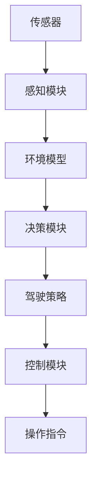

                 

## 引言

自动驾驶技术作为人工智能（AI）的一个重要应用领域，正在全球范围内迅速发展。自动驾驶车辆通过传感器、计算机视觉、机器学习等多种技术手段，实现了对道路环境的感知、决策和控制，旨在实现无人驾驶，提高交通安全性和效率。本文将围绕人工智能在自动驾驶决策中的应用，进行系统性的探讨和分析。

### 背景介绍

随着科技的进步，自动驾驶技术已经取得了显著的进展。从最初的道路测试到自动驾驶车辆的商业化运营，自动驾驶技术正逐渐从实验室走向现实。自动驾驶技术的核心在于其决策系统，即如何让车辆在复杂的交通环境中做出正确的行驶决策。在这一过程中，人工智能技术扮演了至关重要的角色。

人工智能，作为计算机科学的一个重要分支，旨在模拟人类的智能行为，通过机器学习、深度学习等方法，使计算机具备自我学习和自适应能力。人工智能在自动驾驶决策中的应用，主要体现在以下几个方面：

1. **感知**：自动驾驶车辆需要通过传感器收集道路环境信息，如道路标志、车道线、车辆位置等。人工智能技术可以帮助车辆对这些信息进行识别和处理，从而构建对环境的全面理解。

2. **决策**：在获取环境信息后，自动驾驶车辆需要做出驾驶决策，如加速、减速、转向等。人工智能算法，特别是深度学习算法，能够通过分析大量数据，预测交通情况并生成最优驾驶策略。

3. **控制**：决策生成后，需要通过控制系统将决策转化为具体的驾驶动作。人工智能技术可以帮助优化控制策略，提高车辆的响应速度和稳定性。

本文将分几个部分对人工智能在自动驾驶决策中的应用进行深入探讨，包括人工智能概述、自动驾驶技术基础、人工智能在自动驾驶中的应用、自动驾驶决策算法、自动驾驶决策系统设计、自动驾驶决策系统实现以及自动驾驶决策案例研究等。希望通过这篇文章，能够为读者提供一个全面而深入的理解。

### 关键词

- 自动驾驶
- 人工智能
- 机器学习
- 深度学习
- 决策算法
- 感知技术
- 控制系统

### 摘要

本文详细探讨了人工智能在自动驾驶决策中的应用。首先，介绍了人工智能的发展历程与现状，以及自动驾驶技术的概念与基础。接着，分析了人工智能在自动驾驶感知、决策和控制中的具体应用，深入讲解了自动驾驶决策算法的基本原理和实现方法。随后，介绍了自动驾驶决策系统的设计原则、开发流程和实现细节。最后，通过几个实际案例，展示了人工智能在自动驾驶决策中的成功应用，并对未来的发展趋势进行了展望。

## 1. 人工智能概述

### 1.1 人工智能的定义与分类

人工智能（Artificial Intelligence，简称AI）是计算机科学的一个分支，旨在研究、开发和应用使计算机系统具备模拟、扩展和辅助人类智能的理论、方法和技术。人工智能的定义多种多样，但总体来说，它是指通过计算机模拟人类的感知、推理、学习和行为能力，以实现特定任务的高效自动化。

人工智能可以按照不同的分类标准进行划分，常见的分类方法包括：

1. **基于能力的分类**：这种分类方法将人工智能系统分为以下几类：
   - **弱人工智能（Narrow AI）**：只能执行特定任务的AI系统，如语音识别、图像识别等。
   - **强人工智能（General AI）**：具有广泛认知能力，可以执行各种复杂任务的AI系统，类似于人类智能。
   - **超人工智能（Super AI）**：超越人类智能，能够解决任何认知问题的AI系统。

2. **基于实现方法的分类**：这种分类方法将人工智能系统分为以下几类：
   - **规则驱动的人工智能**：基于预定义的规则进行推理和决策。
   - **知识驱动的人工智能**：基于知识和推理进行决策。
   - **数据驱动的人工智能**：基于大量数据通过机器学习算法进行学习和预测。

### 1.2 人工智能的发展历程

人工智能的发展历程可以追溯到20世纪50年代。以下是几个关键事件：

- **1956年**：约翰·麦卡锡（John McCarthy）等人在达特茅斯会议上首次提出了“人工智能”这一术语，标志着人工智能学科的正式诞生。
- **1959年**：阿兰·图灵（Alan Turing）提出了“图灵测试”，用于评估机器是否具有智能。
- **1960年代**：人工智能研究进入了第一个高潮期，研究人员开始开发各种基于规则的专家系统。
- **1970年代**：人工智能研究遭遇了“人工智能冬天”，由于技术瓶颈和资金短缺，研究进展缓慢。
- **1980年代**：专家系统在医疗、金融等领域得到广泛应用，人工智能开始进入实际应用阶段。
- **1990年代**：机器学习开始兴起，神经网络等算法得到了广泛关注和应用。
- **2000年代**：随着计算能力的提升和大数据的兴起，深度学习等算法取得了重大突破，人工智能进入了新一轮快速发展期。
- **2010年代**：人工智能在图像识别、语音识别、自然语言处理等领域取得了显著的成果，开始应用于自动驾驶、医疗、金融等领域。

### 1.3 人工智能的现状与趋势

目前，人工智能已经成为科技界和产业界的热点话题，其在各个领域的应用日益广泛。以下是人工智能的一些现状与趋势：

- **技术应用**：机器学习、深度学习、自然语言处理、计算机视觉等技术得到了广泛应用，推动了人工智能在多个领域的快速发展。
- **产业发展**：人工智能已经成为全球科技产业的重要驱动力，许多公司和研究机构都在投入大量资源进行人工智能研究和应用。
- **伦理问题**：随着人工智能技术的不断发展，伦理问题也日益突出，包括隐私保护、数据安全、算法歧视等，这些问题需要得到深入研究和规范。
- **未来趋势**：人工智能在未来将继续快速发展，预计将在智能制造、智慧城市、医疗健康、金融保险等领域发挥重要作用，推动社会生产方式和生活方式的变革。

### 1.4 人工智能与自动驾驶决策的关系

人工智能在自动驾驶决策中扮演着至关重要的角色。自动驾驶决策涉及到感知、决策和控制三个主要环节，人工智能在这些环节中发挥着重要作用：

- **感知**：自动驾驶车辆需要通过传感器收集道路环境信息，如车道线、交通标志、车辆和行人的位置等。人工智能技术，特别是计算机视觉和深度学习算法，可以帮助车辆对这些信息进行快速、准确的识别和处理。
- **决策**：在获取环境信息后，自动驾驶车辆需要根据这些信息做出驾驶决策，如加速、减速、转向等。人工智能算法，特别是深度学习和强化学习算法，可以帮助车辆从大量历史数据中学习，生成最优驾驶策略。
- **控制**：决策生成后，需要通过控制系统将决策转化为具体的驾驶动作。人工智能技术可以帮助优化控制策略，提高车辆的响应速度和稳定性。

总之，人工智能在自动驾驶决策中的应用，不仅提高了自动驾驶车辆的智能化水平，也为实现完全无人驾驶奠定了基础。

## 2. 自动驾驶技术基础

### 2.1 自动驾驶技术的概念与原理

自动驾驶技术是一种使汽车能够自主行驶的技术，它利用传感器、计算机视觉、人工智能和通信技术等手段，使车辆具备感知环境、做出决策和控制行驶的能力。自动驾驶技术按照自动化程度可以分为多个级别，从0级（无自动化）到5级（完全自动化），其中L2（部分自动化）到L4（高度自动化）是当前研究的热点。

自动驾驶技术的基本原理包括以下几个方面：

- **感知**：车辆通过安装在不同位置的传感器，如雷达、激光雷达（LiDAR）、摄像头、超声波传感器等，收集道路和环境信息。这些传感器可以提供关于车辆位置、车道线、交通标志、其他车辆和行人的位置和运动状态的数据。

- **决策**：感知模块收集到的数据会被传递给自动驾驶系统的决策模块。决策模块利用人工智能算法，如机器学习、深度学习和强化学习等，对环境信息进行分析和处理，生成驾驶策略。这些策略包括加速、减速、转向、保持车道等。

- **控制**：决策模块生成的驾驶策略会传递给控制模块，控制模块负责将策略转化为实际的操作指令，如控制油门、刹车和转向系统。

### 2.2 自动驾驶技术的发展历程

自动驾驶技术的研究可以追溯到20世纪50年代，最早的自动驾驶实验是在封闭环境或特定条件下进行的。随着传感器技术、计算机技术和人工智能技术的发展，自动驾驶技术逐渐从实验室走向实际应用。

- **1950年代**：自动驾驶技术的概念首次被提出，美国和苏联开始进行相关的理论研究。

- **1970年代**：自动驾驶技术开始进入实验阶段，一些研究机构和企业开始进行道路测试。

- **1980年代**：专家系统开始应用于自动驾驶技术，使车辆能够进行简单的环境感知和决策。

- **1990年代**：随着计算机性能的提升和传感器技术的进步，自动驾驶技术开始向高级阶段发展。

- **2000年代**：自动驾驶技术得到了更多的关注，特别是谷歌等科技巨头开始投入大量资源进行研究和开发。

- **2010年代**：自动驾驶技术取得了重要突破，自动驾驶汽车在公共道路上进行测试，一些公司开始推出L2级别的自动驾驶系统。

- **2020年代**：自动驾驶技术逐渐进入商业化阶段，L3和L4级别的自动驾驶系统开始应用。

### 2.3 自动驾驶技术的分类与现状

自动驾驶技术可以根据自动化程度进行分类，如下所示：

- **L0级别（无自动化）**：车辆不具备任何自动驾驶功能，所有驾驶操作均由人类驾驶员完成。

- **L1级别（部分自动化）**：车辆具备单一自动化功能，如自适应巡航控制或车道保持辅助。

- **L2级别（部分自动化）**：车辆具备多个自动化功能，如自适应巡航控制和车道保持辅助，但驾驶员需要持续监控驾驶环境。

- **L3级别（有条件自动化）**：车辆能够在特定条件下完全接管驾驶任务，但驾驶员需要在需要时接管控制。

- **L4级别（高度自动化）**：车辆在特定环境下能够完全自主驾驶，无需人类驾驶员干预。

- **L5级别（完全自动化）**：车辆在任何环境下都能够完全自主驾驶，无需人类驾驶员干预。

目前，自动驾驶技术已经取得了显著的进展，特别是在L2级别的自动驾驶系统中。L3和L4级别的自动驾驶技术也在不断成熟，一些公司已经开始推出相关的商业产品。然而，要实现L5级别的自动驾驶，仍然面临着许多技术、伦理和法律法规的挑战。

### 2.4 自动驾驶技术的应用场景

自动驾驶技术在不同应用场景中的发展情况也有所不同：

- **城市交通**：城市交通环境复杂，车辆密度大，交通规则多变，这使得L2和L3级别的自动驾驶技术在城市交通中具有较大的应用潜力。目前，许多城市已经开展了自动驾驶车辆的测试和示范运行。

- **高速公路**：高速公路环境相对简单，道路规则明确，车辆速度相对稳定，这使得L3和L4级别的自动驾驶技术在高速公路上具有较好的应用前景。一些公司已经开始在高速公路上进行自动驾驶车辆的测试。

- **商业运输**：自动驾驶技术在物流和公共交通等商业运输领域也具有广泛的应用潜力。例如，自动驾驶卡车可以用于长途货运，自动驾驶出租车和共享汽车可以提供便捷的城市交通服务。

- **特殊场景**：在特殊场景下，如矿山、油田、仓储等，自动驾驶技术可以提供安全、高效的物流和运输解决方案。

总的来说，自动驾驶技术在不同应用场景中的发展具有不同的特点，但都面临着类似的挑战，如传感器数据融合、决策算法优化、安全性和可靠性保障等。

### 2.5 自动驾驶技术的挑战与机遇

自动驾驶技术面临着许多挑战和机遇：

- **技术挑战**：包括传感器融合、环境建模、决策算法、控制算法等。这些挑战需要通过不断创新和优化来克服。

- **安全挑战**：自动驾驶车辆的安全性能是公众关注的焦点。如何确保车辆在各种复杂环境下都能安全行驶，是自动驾驶技术发展的重要课题。

- **伦理挑战**：自动驾驶技术涉及到伦理问题，如无人车在紧急情况下的决策、责任归属等。这些问题需要社会、法律和技术的共同探讨和解决。

- **法规挑战**：自动驾驶技术的商业化应用需要相应的法律法规支持。不同国家和地区的法规存在差异，需要建立统一的标准和规范。

- **商业机遇**：自动驾驶技术为汽车产业、交通行业、物流行业等带来了巨大的商业机遇。例如，自动驾驶出租车、自动驾驶卡车、自动驾驶公交车等，都将成为新的商业模式和应用场景。

总之，自动驾驶技术既面临着挑战，也充满了机遇。随着技术的不断进步和政策的支持，自动驾驶技术有望在未来得到更广泛的应用。

### 2.6 自动驾驶技术的未来发展趋势

自动驾驶技术作为人工智能的重要应用领域，其未来发展趋势值得关注。以下是几个关键方向：

- **技术进步**：随着传感器技术、计算机技术和人工智能算法的持续发展，自动驾驶技术的性能将得到显著提升。更高精度的传感器、更高效的计算能力和更先进的算法将推动自动驾驶技术的进一步发展。

- **商业应用**：自动驾驶技术将在多个领域实现商业化应用，如自动驾驶出租车、自动驾驶卡车、自动驾驶公交车等。这些应用将为交通、物流、零售等行业带来巨大的变革，提高效率和服务质量。

- **法律法规**：随着自动驾驶技术的普及，相关法律法规将逐步完善，以确保技术应用的合法性和安全性。例如，责任归属、数据隐私、网络安全等方面的问题将得到明确规范。

- **跨界合作**：自动驾驶技术的发展将涉及多个领域，如汽车制造、软件开发、通信技术、智能交通等。跨界合作将成为推动自动驾驶技术发展的关键因素，通过整合各方资源和优势，实现技术的突破和创新。

- **社会影响**：自动驾驶技术将对社会产生深远影响，包括交通模式、城市规划、就业结构等。这些变化将带来新的挑战和机遇，需要社会各界共同努力，以实现可持续发展。

总之，自动驾驶技术具有广阔的发展前景，将在未来推动社会和产业的深刻变革。

### 2.7 自动驾驶技术的核心概念与联系

在自动驾驶技术中，有多个核心概念和实体，它们共同构成了自动驾驶系统的基本架构。以下是这些核心概念及其相互关系：

- **传感器**：传感器是自动驾驶系统的感知模块，用于收集道路和环境信息。常见的传感器包括激光雷达（LiDAR）、摄像头、雷达、超声波传感器等。这些传感器可以提供关于车辆位置、车道线、交通标志、其他车辆和行人的位置和运动状态的数据。

- **感知模块**：感知模块负责对传感器收集到的数据进行处理和分析，以生成环境模型。感知模块通常包括特征提取、目标检测、轨迹预测等功能。通过这些处理，感知模块能够构建对环境的全面理解。

- **决策模块**：决策模块负责根据环境模型生成驾驶策略。决策模块通常采用人工智能算法，如深度学习、强化学习等，通过分析大量历史数据，预测交通情况并生成最优驾驶策略。

- **控制模块**：控制模块负责将决策模块生成的驾驶策略转化为实际的操作指令，如控制油门、刹车和转向系统。控制模块需要具备高实时性和稳定性，以确保驾驶动作的准确执行。

- **环境模型**：环境模型是感知模块和决策模块之间的桥梁，它包含了关于道路、车辆、行人的位置、速度、意图等关键信息。环境模型的质量直接影响决策的准确性和驾驶策略的可行性。

- **驾驶策略**：驾驶策略是决策模块根据环境模型生成的具体驾驶操作指令，如加速、减速、转向等。驾驶策略需要综合考虑安全性、效率、舒适性等因素，以实现最优驾驶体验。

这些核心概念和实体之间的关系可以用Mermaid流程图表示如下：



通过这个流程图，我们可以清晰地看到自动驾驶系统各组成部分之间的逻辑关系，以及它们在实现自动驾驶过程中的作用。这种结构化的表示方法有助于我们更好地理解自动驾驶技术的工作原理，也为进一步研究和优化提供了方向。

### 2.8 自动驾驶决策中的核心算法原理

在自动驾驶决策中，核心算法的设计和实现至关重要。以下将介绍几种常用的核心算法原理，包括决策树、支持向量机（SVM）和神经网络。

#### 决策树（Decision Tree）

决策树是一种常用的机器学习算法，用于分类和回归任务。它通过一系列规则将数据集划分为多个子集，每个子集对应一个特定的类别或数值。

**基本原理**：
1. **特征选择**：选择一个特征作为切分点，将数据集划分为两个子集。
2. **节点分裂**：根据特征的不同值，继续对子集进行划分，直到达到某个终止条件（如最小节点大小或最大深度）。
3. **叶子节点**：每个叶子节点代表一个类别或数值。

**Python代码示例**：
```python
from sklearn.tree import DecisionTreeClassifier
from sklearn.model_selection import train_test_split
from sklearn.metrics import accuracy_score

# 数据预处理
X_train, X_test, y_train, y_test = train_test_split(X, y, test_size=0.2, random_state=42)

# 构建决策树模型
clf = DecisionTreeClassifier(max_depth=3)
clf.fit(X_train, y_train)

# 预测
y_pred = clf.predict(X_test)

# 评估
accuracy = accuracy_score(y_test, y_pred)
print(f"Accuracy: {accuracy}")
```

#### 支持向量机（Support Vector Machine，SVM）

支持向量机是一种二分类模型，其目标是找到最佳的超平面，将不同类别的数据点分隔开来。

**基本原理**：
1. **线性SVM**：通过求解最优分割超平面，最大化分类间隔。
2. **非线性SVM**：通过核函数将数据映射到高维空间，实现非线性分类。

**Python代码示例**：
```python
from sklearn.svm import SVC
from sklearn.model_selection import train_test_split
from sklearn.metrics import accuracy_score

# 数据预处理
X_train, X_test, y_train, y_test = train_test_split(X, y, test_size=0.2, random_state=42)

# 构建SVM模型
clf = SVC(kernel='linear')
clf.fit(X_train, y_train)

# 预测
y_pred = clf.predict(X_test)

# 评估
accuracy = accuracy_score(y_test, y_pred)
print(f"Accuracy: {accuracy}")
```

#### 神经网络（Neural Network）

神经网络，尤其是深度学习，在自动驾驶决策中具有广泛的应用。它通过多层神经元模拟人脑处理信息的方式，实现复杂的模式识别和决策。

**基本原理**：
1. **前向传播**：输入数据从输入层传递到隐藏层，再传递到输出层。
2. **反向传播**：通过计算输出误差，将误差反向传播到各层，更新权重和偏置。

**Python代码示例**：
```python
import tensorflow as tf
from tensorflow.keras.models import Sequential
from tensorflow.keras.layers import Dense
from tensorflow.keras.optimizers import Adam
from sklearn.model_selection import train_test_split
from sklearn.metrics import accuracy_score

# 数据预处理
X_train, X_test, y_train, y_test = train_test_split(X, y, test_size=0.2, random_state=42)

# 构建神经网络模型
model = Sequential()
model.add(Dense(64, input_dim=X_train.shape[1], activation='relu'))
model.add(Dense(32, activation='relu'))
model.add(Dense(1, activation='sigmoid'))

# 编译模型
model.compile(optimizer=Adam(), loss='binary_crossentropy', metrics=['accuracy'])

# 训练模型
model.fit(X_train, y_train, epochs=10, batch_size=32)

# 预测
y_pred = model.predict(X_test)
y_pred = (y_pred > 0.5)

# 评估
accuracy = accuracy_score(y_test, y_pred)
print(f"Accuracy: {accuracy}")
```

通过这些算法，自动驾驶系统能够从大量数据中学习，生成准确的驾驶策略，从而提高自动驾驶车辆的安全性和可靠性。

### 3. 人工智能在自动驾驶感知中的应用

在自动驾驶系统中，感知环节至关重要。它负责收集和处理车辆周围环境的信息，为后续的决策和控制提供基础。人工智能技术在自动驾驶感知中发挥着关键作用，通过多种算法和模型，实现对环境的准确感知和理解。以下将介绍几种常用的人工智能技术，包括计算机视觉、激光雷达（LiDAR）数据处理、雷达数据处理和超声波传感器数据处理。

#### 计算机视觉

计算机视觉技术利用图像处理、模式识别和机器学习等方法，从摄像头获取的图像中提取有用的信息。它在自动驾驶感知中的应用主要包括：

- **车道线检测**：通过识别图像中的车道线，车辆可以保持正确的行驶轨迹。
- **交通标志识别**：识别道路上的交通标志，如限速标志、禁止通行标志等，帮助车辆遵守交通规则。
- **车辆检测**：检测道路上的其他车辆，包括其位置、速度和运动方向。

**计算机视觉算法示例**：
```python
import cv2
import numpy as np

# 车道线检测
def detect_lane_lines(image):
    # 输入：图像
    # 输出：车道线轮廓

    # 灰度转换
    gray = cv2.cvtColor(image, cv2.COLOR_BGR2GRAY)

    # 高斯滤波
    blurred = cv2.GaussianBlur(gray, (5, 5), 0)

    # Canny边缘检测
    edges = cv2.Canny(blurred, 50, 150)

    # 阈值处理
    ret, thresh = cv2.threshold(edges, 60, 255, cv2.THRESH_BINARY)

    # 轮廓检测
    contours, _ = cv2.findContours(thresh, cv2.RETR_TREE, cv2.CHAIN_APPROX_SIMPLE)

    # 选择最大轮廓
    lane_lines = []
    for contour in contours:
        if cv2.contourArea(contour) > 1000:
            lane_lines.append(contour)

    # 绘制车道线
    lane_lines = max(lane_lines, key=cv2.contourArea)
    cv2.drawContours(image, [lane_lines], -1, (0, 0, 255), 3)

    return image

# 使用示例
image = cv2.imread('lane_detection.jpg')
result = detect_lane_lines(image)
cv2.imshow('Lane Lines', result)
cv2.waitKey(0)
cv2.destroyAllWindows()
```

#### 激光雷达（LiDAR）数据处理

激光雷达是一种用于测量距离的传感器，通过发射激光脉冲并测量反射回来的时间，可以获取周围环境的精确三维信息。LiDAR数据在自动驾驶中用于构建环境模型和障碍物检测。

**LiDAR数据处理算法示例**：
```python
import open3d as o3d
import numpy as np

# LiDAR点云处理
def process_lidar_data(points):
    # 输入：点云数据（numpy数组）
    # 输出：处理后的点云数据

    # 转换为Open3D的点云对象
    pcd = o3d.geometry.PointCloud()
    pcd.points = o3d.utility.Vector3dVector(points)

    # Voxel下采样
    pcd_down = pcd.voxel_down_sample(0.1)

    # 障碍物检测
    plane_model, inliers = pcd_down.segment_plane(normal=None, max_distance=0.05)
    pcd_plane = pcd_down.select_by_index(inliers)
    pcd_obstacles = pcd_down.select_by_index(inliers, invert=True)

    # 显示结果
    o3d.visualization.draw_geometries([pcd, pcd_plane, pcd_obstacles])

# 使用示例
points = np.array([[x, y, z] for x, y, z in zip(lidar_data['x'], lidar_data['y'], lidar_data['z'])])
process_lidar_data(points)
```

#### 雷达数据处理

雷达传感器通过发射电磁波并接收反射信号来检测物体的距离和速度。雷达数据处理主要涉及目标检测和轨迹估计。

**雷达数据处理算法示例**：
```python
import numpy as np
from filterpy.kalman import KalmanFilter

# 雷达数据目标检测
def radar_data_target_detection(radar_data):
    # 输入：雷达数据（距离和速度）
    # 输出：目标检测结果

    # 距离滤波
    distance_filter = KalmanFilter(dim_x=2, dim_z=2)
    distance_filter.F = np.array([[1, 1], [0, 1]])
    distance_filter.H = np.array([[1, 0]])
    distance_filter.P = np.array([[1, 0], [0, 1]])
    distance_filter.R = np.array([[1]])

    for distance in radar_data['distance']:
        distance_filtered = distance_filter.update(distance)
        print(f"Filtered distance: {distance_filtered[0, 0]}")

# 使用示例
radar_data = {'distance': [10, 12, 11, 9]}
radar_data_target_detection(radar_data)
```

#### 超声波传感器数据处理

超声波传感器通过发射声波并测量反射时间来检测物体的距离。超声波数据处理主要涉及距离测量和噪声过滤。

**超声波传感器数据处理算法示例**：
```python
import numpy as np

# 超声波数据距离测量
def ultrasonic_sensor_distance_measurement(ultrasonic_data):
    # 输入：超声波数据（时间序列）
    # 输出：距离测量结果

    # 距离计算
    sound_speed = 343.0  # 空气中的声速（m/s）
    distances = ultrasonic_data * sound_speed / 2.0  # 距离 = 时间 * 声速 / 2

    # 中值滤波
    distances_filtered = np.median(distances, axis=0)

    return distances_filtered

# 使用示例
ultrasonic_data = np.random.uniform(0, 0.1, size=100)  # 模拟超声波数据
distances = ultrasonic_sensor_distance_measurement(ultrasonic_data)
print(f"Filtered distances: {distances}")
```

通过上述算法示例，我们可以看到人工智能技术在自动驾驶感知中的应用。这些算法帮助车辆从各种传感器获取的信息中提取有用的信息，构建对环境的准确理解，为后续的决策和控制提供支持。

### 3.2 人工智能在自动驾驶决策中的作用

在自动驾驶系统中，决策模块是核心部分，它负责根据感知模块提供的环境信息，生成驾驶策略。人工智能技术在自动驾驶决策中扮演着至关重要的角色，通过复杂的算法和模型，使车辆能够安全、高效地行驶。以下将详细探讨几种常用的人工智能算法在自动驾驶决策中的应用，包括基于规则的决策、机器学习和深度学习。

#### 基于规则的决策

基于规则的决策方法是一种传统的自动驾驶决策方法，它通过预定义的规则和条件语句，生成驾驶策略。这种方法简单、直观，但灵活性和适应性相对较低。

**基本原理**：
- **规则库**：定义一系列规则，每个规则包含一个前提条件和相应的动作。
- **推理引擎**：根据感知模块提供的环境信息，逐条检查规则库中的规则，找到匹配的规则并执行相应的动作。

**示例**：
```python
# 基于规则的决策示例
def rule_based_decision(current_state):
    if current_state['distance_to_obstacle'] <= 5:
        action = 'brake'
    elif current_state['speed'] < 30:
        action = 'accelerate'
    else:
        action = 'keep_speed'
    return action

# 使用示例
current_state = {'distance_to_obstacle': 3, 'speed': 40}
action = rule_based_decision(current_state)
print(f"Decision: {action}")
```

#### 机器学习

机器学习算法通过分析大量历史数据，学习环境与驾驶策略之间的关系，从而生成驾驶策略。这种方法具有较高的灵活性和适应性，但需要大量训练数据和计算资源。

**常用算法**：
- **决策树**：通过树形结构学习环境特征和驾驶策略之间的关系。
- **支持向量机（SVM）**：通过求解最优超平面，实现驾驶策略的分类。
- **随机森林**：通过构建多个决策树，集成多个模型，提高决策的准确性和鲁棒性。

**Python代码示例**：
```python
from sklearn.ensemble import RandomForestClassifier
from sklearn.model_selection import train_test_split

# 数据预处理
X_train, X_test, y_train, y_test = train_test_split(X, y, test_size=0.2, random_state=42)

# 构建随机森林模型
clf = RandomForestClassifier(n_estimators=100)
clf.fit(X_train, y_train)

# 预测
y_pred = clf.predict(X_test)

# 评估
accuracy = clf.score(X_test, y_test)
print(f"Accuracy: {accuracy}")
```

#### 深度学习

深度学习算法通过多层神经网络，自动学习复杂的环境特征和驾驶策略之间的关系。深度学习在自动驾驶决策中的应用日益广泛，特别是在图像识别和语音处理等领域。

**常用模型**：
- **卷积神经网络（CNN）**：用于处理图像数据，提取图像特征。
- **循环神经网络（RNN）**：用于处理序列数据，如时间序列数据。
- **生成对抗网络（GAN）**：用于生成对抗训练，提高模型性能。

**Python代码示例**：
```python
import tensorflow as tf
from tensorflow.keras.models import Sequential
from tensorflow.keras.layers import Dense, Conv2D, Flatten, LSTM

# 构建深度学习模型
model = Sequential()
model.add(Conv2D(32, (3, 3), activation='relu', input_shape=(28, 28, 1)))
model.add(Flatten())
model.add(Dense(1, activation='sigmoid'))

# 编译模型
model.compile(optimizer='adam', loss='binary_crossentropy', metrics=['accuracy'])

# 训练模型
model.fit(X_train, y_train, epochs=10, batch_size=32)

# 预测
y_pred = model.predict(X_test)

# 评估
accuracy = model.evaluate(X_test, y_test)[1]
print(f"Accuracy: {accuracy}")
```

#### 强化学习

强化学习是一种通过试错和反馈学习策略的算法，适用于动态环境中的决策问题。在自动驾驶决策中，强化学习可以通过与环境交互，不断优化驾驶策略。

**基本原理**：
- **奖励函数**：定义一个奖励函数，根据驾驶策略的结果给予奖励或惩罚。
- **策略更新**：根据奖励函数的反馈，更新驾驶策略。

**Python代码示例**：
```python
import numpy as np
from reinforcement_learning import QLearning

# Q-Learning算法参数设置
learning_rate = 0.1
discount_factor = 0.9
epsilon = 0.1

# 创建Q-Learning实例
q_learning = QLearning(state_space, action_space, learning_rate, discount_factor, epsilon)

# 训练算法
for episode in range(1000):
    state = environment.reset()
    done = False
    while not done:
        action = q_learning.get_action(state)
        next_state, reward, done = environment.step(action)
        q_learning.update_q_value(state, action, reward, next_state, done)
        state = next_state

# 评估算法
state = environment.reset()
done = False
while not done:
    action = q_learning.get_action(state)
    next_state, reward, done = environment.step(action)
    print(f"Action: {action}, Reward: {reward}")
    state = next_state
```

通过上述算法，自动驾驶系统能够从多种途径生成驾驶策略，提高驾驶决策的准确性和适应性。人工智能技术在自动驾驶决策中的应用，不仅提高了车辆的安全性，也为实现完全自动驾驶奠定了基础。

### 3.3 人工智能在自动驾驶控制中的应用

在自动驾驶系统中，控制模块是实现驾驶决策的核心环节，它将决策模块生成的驾驶策略转化为具体的操作指令，如控制油门、刹车和转向系统。人工智能技术在自动驾驶控制中发挥着重要作用，通过多种控制算法和优化方法，提高了自动驾驶车辆的响应速度、稳定性和安全性。以下将详细介绍几种常用的人工智能控制算法，包括PID控制、模糊控制和自适应控制。

#### PID控制

PID（比例-积分-微分）控制器是一种经典的控制算法，广泛应用于自动驾驶车辆的控制系统。PID控制器通过调节比例、积分和微分三个参数，实现对目标位置的精确跟踪。

**基本原理**：
- **比例（P）**：根据当前误差直接调节控制输出，误差越大，控制输出越大。
- **积分（I）**：根据误差累积值调节控制输出，消除稳态误差。
- **微分（D）**：根据误差变化率调节控制输出，提高系统响应速度。

**Python代码示例**：
```python
class PIDController:
    def __init__(self, Kp, Ki, Kd):
        self.Kp = Kp
        self.Ki = Ki
        self.Kd = Kd
        self.error_integration = 0
        self.last_error = 0

    def update(self, current_error, dt):
        derivative = current_error - self.last_error
        integral = self.error_integration + current_error * dt
        output = self.Kp * current_error + self.Ki * integral + self.Kd * derivative
        self.error_integration = integral
        self.last_error = current_error
        return output

# 使用示例
pid = PIDController(Kp=1.0, Ki=0.1, Kd=0.05)
error = 5.0
output = pid.update(error, dt=0.1)
print(f"Control Output: {output}")
```

#### 模糊控制

模糊控制是一种基于模糊逻辑的控制方法，它通过模糊集合和模糊规则，实现对复杂系统的控制。模糊控制器能够处理不确定性和非线性问题，特别适用于自动驾驶车辆的控制。

**基本原理**：
- **模糊化**：将输入变量（如速度误差、加速度误差等）模糊化，转换为模糊集合。
- **规则库**：定义一系列模糊规则，描述输入和输出之间的关系。
- **解模糊**：将模糊输出解模糊化，转换为具体的控制输出。

**Python代码示例**：
```python
import numpy as np

def fuzzify(x, x_min, x_max, mu):
    return np.where((x >= x_min) & (x <= x_max), np.exp(-((x - mu) ** 2) / (2 * sigma ** 2)), 0)

def defuzzify(sets, weights):
    return sum([set * weight for set, weight in zip(sets, weights)])

# 模糊控制规则库
rules = {
    'speed_error': [
        ('negative_large', -10, 0),
        ('negative_medium', 0, 5),
        ('negative_small', 5, 10),
        ('zero', 0, 0),
        ('positive_small', -10, -5),
        ('positive_medium', -5, 0),
        ('positive_large', 0, 10)
    ],
    'acceleration_error': [
        ('negative_large', -10, 0),
        ('negative_medium', 0, 5),
        ('negative_small', 5, 10),
        ('zero', 0, 0),
        ('positive_small', -10, -5),
        ('positive_medium', -5, 0),
        ('positive_large', 0, 10)
    ]
}

# 模糊化
defuzzified_output = defuzzify([fuzzify(speed_error, -10, 10, mu) for mu in rules['speed_error']], [fuzzify(acceleration_error, -10, 10, mu) for mu in rules['acceleration_error']])
print(f"Defuzzified Output: {defuzzified_output}")
```

#### 自适应控制

自适应控制是一种能够自动调整控制参数，以适应系统动态变化的控制方法。在自动驾驶车辆中，自适应控制能够提高系统的鲁棒性和响应速度。

**基本原理**：
- **自适应律**：根据系统的状态和误差，动态调整控制参数。
- **参数更新**：通过在线学习算法，实时更新控制参数。

**Python代码示例**：
```python
class AdaptiveController:
    def __init__(self, initial_params):
        self.Kp, self.Ki, self.Kd = initial_params
        self.error = 0
        self.previous_error = 0

    def update_params(self, error, dt):
        self.error = error
        delta_error = self.error - self.previous_error
        self.Kp += delta_error * dt
        self.Ki += 0.1 * dt
        self.Kd -= 0.05 * dt
        self.previous_error = self.error

    def control(self, current_error, dt):
        output = self.Kp * current_error + self.Ki * (current_error + delta_error * dt) + self.Kd * delta_error
        return output

# 使用示例
controller = AdaptiveController(initial_params=(1.0, 0.1, 0.05))
error = 5.0
output = controller.control(error, dt=0.1)
print(f"Control Output: {output}")
```

通过上述几种控制算法，自动驾驶车辆能够在复杂的交通环境中实现稳定的驾驶行为。人工智能技术在控制中的应用，不仅提高了自动驾驶车辆的响应速度和稳定性，也为实现完全自动驾驶提供了技术保障。

### 4. 自动驾驶决策算法

在自动驾驶系统中，决策算法是实现车辆安全、高效行驶的关键。自动驾驶决策算法主要包括路径规划、轨迹规划和动态规划等方法。以下将详细介绍这些算法的基本原理和实现方法。

#### 路径规划

路径规划是指确定从起点到终点的最短或最优路径。在自动驾驶中，路径规划算法用于确定车辆在复杂交通环境中的行驶路径。

**基本原理**：
- **最短路径**：通过搜索算法，如Dijkstra算法，找到起点到终点的最短路径。
- **最优路径**：通过考虑多个目标函数，如时间、能耗、交通流量等，找到最优路径。

**实现方法**：
- **Dijkstra算法**：通过优先队列，逐步扩展起点附近的节点，找到最短路径。
```python
import heapq

def dijkstra(graph, start, end):
    distances = {node: float('infinity') for node in graph}
    distances[start] = 0
    priority_queue = [(0, start)]

    while priority_queue:
        current_distance, current_node = heapq.heappop(priority_queue)

        if current_node == end:
            break

        for neighbor, weight in graph[current_node].items():
            distance = current_distance + weight

            if distance < distances[neighbor]:
                distances[neighbor] = distance
                heapq.heappush(priority_queue, (distance, neighbor))

    return distances[end]

# 使用示例
graph = {
    'A': {'B': 1, 'C': 4},
    'B': {'A': 1, 'C': 2, 'D': 5},
    'C': {'A': 4, 'B': 2, 'D': 1},
    'D': {'B': 5, 'C': 1}
}
start = 'A'
end = 'D'
print(dijkstra(graph, start, end))
```

#### 轨迹规划

轨迹规划是指确定车辆在一段时间内的行驶路径。轨迹规划算法需要考虑车辆的动态特性、道路环境和其他车辆的行为。

**基本原理**：
- **时间优化**：通过优化车辆在不同时间段内的速度和加速度，实现最优轨迹。
- **路径优化**：通过优化车辆的行驶路径，减少行驶时间和能耗。

**实现方法**：
- **动态规划**：通过逆向递推，从目标状态开始，逐步规划到初始状态。
```python
def dynamic_programming(states, actions, costs):
    V = [0] * len(states)
    for i in range(len(states) - 1, -1, -1):
        state = states[i]
        V[i] = float('infinity')
        for action, cost in actions[state]:
            V[i] = min(V[i], V[i + 1] + cost)

    return V[0]

# 使用示例
states = ['A', 'B', 'C', 'D']
actions = {
    'A': [('move_right', 1), ('move_left', 2)],
    'B': [('move_forward', 3), ('turn_left', 4)],
    'C': [('turn_right', 5), ('turn_left', 6)],
    'D': [('stop', 7)]
}
costs = {
    'A': [(1, 1), (2, 2)],
    'B': [(3, 3), (4, 4)],
    'C': [(5, 5), (6, 6)],
    'D': [(7, 7)]
}
print(dynamic_programming(states, actions, costs))
```

#### 动态规划

动态规划是一种常用的轨迹规划方法，它通过将复杂问题分解为多个子问题，逐步求解最优解。

**基本原理**：
- **状态空间划分**：将车辆的状态划分为多个子状态。
- **决策树构建**：根据当前状态和下一状态，构建决策树。
- **值函数迭代**：通过逆向递推，逐步计算最优解。

**实现方法**：
- **逆向递推**：从目标状态开始，逐步回溯到初始状态，计算最优值函数。
```python
def dynamic_programming(states, actions, costs, horizon=10):
    V = [0] * horizon
    for t in range(horizon - 1, -1, -1):
        state = states[t]
        V[t] = float('infinity')
        for action, cost in actions[state]:
            V[t] = min(V[t], V[t + 1] + cost)
    return V[0]

# 使用示例
states = ['A', 'B', 'C', 'D']
actions = {
    'A': [('move_right', 1), ('move_left', 2)],
    'B': [('move_forward', 3), ('turn_left', 4)],
    'C': [('turn_right', 5), ('turn_left', 6)],
    'D': [('stop', 7)]
}
costs = {
    'A': [(1, 1), (2, 2)],
    'B': [(3, 3), (4, 4)],
    'C': [(5, 5), (6, 6)],
    'D': [(7, 7)]
}
print(dynamic_programming(states, actions, costs))
```

通过上述算法，自动驾驶系统能够在复杂的交通环境中生成最优的行驶路径和轨迹，从而实现安全、高效的自动驾驶。

### 4.1 自动驾驶决策算法的性能评估与优化

在自动驾驶决策系统的开发和优化过程中，算法的性能评估是关键环节。通过性能评估，我们可以了解算法在不同场景下的表现，从而发现潜在的问题并进行优化。以下将介绍几种常用的性能评估指标和优化方法，包括误差分析、时间效率分析和鲁棒性分析。

#### 误差分析

误差分析是评估自动驾驶决策算法性能的重要指标，它衡量算法生成的决策与实际需求之间的差距。误差分析通常从以下几个方面进行：

- **路径误差**：衡量算法生成的路径与实际最优路径之间的差距，可以通过路径长度、路径偏差等指标来衡量。
- **速度误差**：衡量算法生成的速度控制与实际需求速度之间的差距。
- **转向误差**：衡量算法生成的转向角度与实际需求转向角度之间的差距。

**评估方法**：
- **统计指标**：通过计算误差的均值、标准差等统计指标，评估算法的总体性能。
- **可视化分析**：通过绘制误差曲线、热力图等可视化工具，直观地展示算法在不同场景下的表现。

**优化方法**：
- **参数调整**：通过调整算法的参数，如学习率、阈值等，优化算法的性能。
- **算法改进**：通过引入新的算法或改进现有算法，提高算法的精度和鲁棒性。

#### 时间效率分析

时间效率是评估自动驾驶决策算法性能的另一个重要指标，它衡量算法的响应速度和计算效率。时间效率分析通常从以下几个方面进行：

- **响应时间**：从感知到决策生成的时间延迟，衡量算法的实时性能。
- **计算效率**：算法的计算复杂度和资源消耗，衡量算法的效率。

**评估方法**：
- **基准测试**：通过设置固定场景和输入数据，测量算法的响应时间和计算效率。
- **负载测试**：在不同负载条件下，评估算法的性能，以了解其在高负载情况下的表现。

**优化方法**：
- **并行计算**：通过引入并行计算技术，提高算法的执行速度。
- **算法优化**：通过改进算法的数据结构和计算方法，降低计算复杂度。

#### 鲁棒性分析

鲁棒性是评估自动驾驶决策算法在不同环境和条件下的适应能力，它衡量算法在面对异常情况和不确定性时的稳定性。鲁棒性分析通常从以下几个方面进行：

- **环境变化**：算法在不同环境（如雨、雪、雾霾等）下的性能。
- **传感器故障**：算法在传感器故障或数据缺失情况下的表现。
- **紧急情况**：算法在紧急情况（如碰撞、障碍物等）下的反应能力。

**评估方法**：
- **模拟测试**：通过构建不同场景的模拟环境，评估算法在不同环境下的性能。
- **实际测试**：在实际驾驶环境中进行测试，验证算法的鲁棒性和可靠性。

**优化方法**：
- **数据增强**：通过引入多样化的训练数据，提高算法的泛化能力。
- **异常检测**：通过引入异常检测机制，及时发现和处理异常情况。

通过上述性能评估和优化方法，我们可以有效地评估和改进自动驾驶决策算法，提高其在复杂交通环境中的表现，确保自动驾驶系统的安全性和可靠性。

### 5. 自动驾驶决策系统设计

自动驾驶决策系统的设计是实现自动驾驶车辆安全、高效行驶的关键环节。一个高效的决策系统需要考虑系统的架构设计、功能模块、数据处理流程以及与其他系统的集成。以下将详细讨论自动驾驶决策系统的设计原则、架构设计、功能模块和开发流程。

#### 设计原则

在设计自动驾驶决策系统时，需要遵循以下几个基本原则：

- **模块化设计**：将系统划分为多个功能模块，每个模块具有独立的功能和接口，便于开发和维护。
- **可扩展性**：设计系统时考虑未来的扩展需求，确保系统能够适应不同场景和功能需求。
- **高可靠性**：确保系统在各种环境和条件下都能够稳定运行，减少故障率和误操作。
- **实时性**：设计系统时保证实时响应，满足自动驾驶的实时性能要求。
- **安全性**：考虑系统的安全性，包括数据安全、网络安全和驾驶安全，确保系统不会对驾驶员和其他交通参与者造成威胁。

#### 架构设计

自动驾驶决策系统的架构设计通常包括以下几个主要部分：

1. **感知模块**：负责收集车辆周围环境的信息，如车道线、交通标志、其他车辆和行人的位置和运动状态。常用的传感器包括摄像头、激光雷达（LiDAR）、雷达和超声波传感器。
2. **数据处理模块**：对感知模块收集的数据进行处理，包括数据清洗、特征提取、目标检测和轨迹预测等。数据处理模块需要具备高效的数据处理能力，以支持实时决策。
3. **决策模块**：根据数据处理模块提供的环境信息，通过人工智能算法生成驾驶策略。决策模块通常包括路径规划、轨迹规划和动态规划等算法。
4. **控制模块**：将决策模块生成的驾驶策略转化为具体的操作指令，如控制油门、刹车和转向系统。控制模块需要具备高实时性和稳定性，确保驾驶动作的准确执行。
5. **通信模块**：负责与车辆其他系统（如导航系统、车载娱乐系统等）以及其他车辆和基础设施（如交通信号灯、智能路侧单元等）进行通信，实现信息的共享和协同。

#### 功能模块

自动驾驶决策系统的功能模块主要包括以下几部分：

1. **感知模块**：
   - **传感器数据处理**：对摄像头、激光雷达、雷达和超声波传感器的数据进行预处理，如去噪、归一化和融合等。
   - **环境建模**：利用感知模块收集的数据，构建车辆周围的三维环境模型。
   - **目标检测和识别**：通过计算机视觉算法识别道路上的车道线、交通标志、其他车辆和行人。

2. **数据处理模块**：
   - **数据预处理**：对原始数据进行清洗、去噪和归一化处理，提高数据的准确性和一致性。
   - **特征提取**：从原始数据中提取有用的特征，如边缘、轮廓、颜色等。
   - **目标跟踪**：利用目标检测算法跟踪车辆和行人的运动轨迹。

3. **决策模块**：
   - **路径规划**：根据车辆的位置和目标位置，规划最优行驶路径。
   - **轨迹规划**：根据车辆的动态特性和环境模型，生成车辆的行驶轨迹。
   - **动态规划**：在动态环境中，根据当前状态和未来状态，生成最优驾驶策略。

4. **控制模块**：
   - **驾驶策略生成**：根据决策模块生成的驾驶策略，生成具体的控制指令。
   - **控制策略优化**：通过优化算法，提高控制策略的响应速度和稳定性。
   - **驾驶动作执行**：将控制指令转化为具体的操作，如控制油门、刹车和转向。

5. **通信模块**：
   - **V2X通信**：实现车辆与基础设施、车辆与车辆之间的通信，共享实时交通信息。
   - **远程控制**：允许远程监控系统对车辆进行控制和监控。

#### 开发流程

自动驾驶决策系统的开发流程通常包括以下几个阶段：

1. **需求分析**：明确系统的功能需求、性能指标和可靠性要求。
2. **系统设计**：根据需求分析结果，设计系统的架构和功能模块。
3. **算法实现**：根据系统设计，实现各个功能模块的算法和模型。
4. **系统集成**：将各个功能模块集成到一起，实现系统整体的功能和性能。
5. **测试验证**：通过模拟测试和实际道路测试，验证系统的性能和可靠性。
6. **部署上线**：将系统部署到实际车辆中，进行商业运营。

通过上述设计原则、架构设计、功能模块和开发流程，我们可以构建一个高效、可靠的自动驾驶决策系统，为自动驾驶车辆提供安全、高效的驾驶服务。

### 5.1 自动驾驶决策系统的架构设计

在自动驾驶决策系统的架构设计中，模块化、分布式和冗余设计是确保系统高效、可靠运行的关键。以下将详细讨论自动驾驶决策系统的架构设计，包括各模块的功能、相互关系以及如何实现高可靠性和实时性。

#### 模块功能

1. **感知模块**：负责收集车辆周围环境的信息，包括摄像头、激光雷达（LiDAR）、雷达和超声波传感器等。感知模块的核心任务是数据预处理和特征提取，将原始传感器数据转换为有用的环境信息。

2. **数据处理模块**：对感知模块收集的数据进行进一步处理，包括去噪、滤波、特征提取、目标检测和轨迹预测等。数据处理模块需要具备高效的数据处理能力，以满足实时决策的需求。

3. **决策模块**：根据数据处理模块提供的环境信息，通过机器学习和深度学习算法生成驾驶策略。决策模块包括路径规划、轨迹规划和动态规划等子模块，负责生成最优的驾驶策略。

4. **控制模块**：将决策模块生成的驾驶策略转化为具体的控制指令，如控制油门、刹车和转向系统。控制模块需要具备高实时性和稳定性，确保驾驶动作的准确执行。

5. **通信模块**：实现车辆与基础设施、车辆与车辆之间的通信，共享实时交通信息。通信模块包括V2X（Vehicle-to-Everything）通信和远程控制等功能。

6. **数据存储与管理系统**：负责存储和管理感知模块、数据处理模块、决策模块和控制模块生成的数据，为后续的分析和优化提供数据支持。

#### 模块相互关系

各模块之间的相互关系如下：

- **感知模块**：将传感器数据传递给数据处理模块。
- **数据处理模块**：将处理后的数据传递给决策模块。
- **决策模块**：根据环境信息生成驾驶策略，传递给控制模块。
- **控制模块**：根据驾驶策略生成控制指令，传递给车辆执行系统。
- **通信模块**：与其他车辆和基础设施进行通信，获取实时交通信息，反馈给决策模块。
- **数据存储与管理系统**：存储和处理各模块生成的数据，为系统的优化和升级提供支持。

#### 高可靠性设计

为了确保自动驾驶决策系统的可靠性，设计时需要考虑以下几个方面：

- **冗余设计**：在关键模块（如感知模块、决策模块和控制模块）中引入冗余设计，如使用多个传感器、多个处理单元等，以防止单一故障导致系统失效。
- **容错机制**：设计容错机制，如故障检测、故障隔离和故障恢复等，确保系统在故障情况下仍能正常运行。
- **故障预测**：通过实时监测和分析系统运行状态，预测潜在故障，提前采取预防措施。

#### 实时性设计

为了保证自动驾驶决策系统的实时性，设计时需要考虑以下几个方面：

- **分布式架构**：采用分布式架构，将任务分散到多个处理节点上，提高系统的并行处理能力。
- **高效数据处理**：优化数据处理算法，减少数据处理的延迟，确保决策模块能够及时生成驾驶策略。
- **实时通信**：采用低延迟、高带宽的通信协议，确保决策模块与控制模块之间的信息传输实时可靠。

通过上述架构设计，自动驾驶决策系统能够在复杂交通环境中实现高效、可靠的决策和控制，为自动驾驶车辆的安全行驶提供有力保障。

### 5.2 自动驾驶决策系统的功能模块

自动驾驶决策系统的功能模块是确保车辆安全、高效行驶的核心。以下将详细介绍自动驾驶决策系统的各个功能模块，包括其作用、实现方法和关键技术。

#### 感知模块

**作用**：
感知模块负责收集车辆周围环境的信息，为后续的决策和控制提供基础数据。

**实现方法**：
1. **传感器选择**：选择合适的传感器，如摄像头、激光雷达（LiDAR）、雷达和超声波传感器等。
2. **数据采集**：通过传感器实时采集道路和交通环境信息。
3. **数据预处理**：对采集到的原始数据进行预处理，包括去噪、滤波、归一化等。

**关键技术**：
- **多传感器数据融合**：通过融合不同传感器的数据，提高环境信息的准确性和完整性。
- **实时数据处理**：优化数据处理算法，确保数据能够在短时间内处理完成，以满足实时决策的需求。

#### 数据处理模块

**作用**：
数据处理模块负责对感知模块收集的数据进行处理，提取有用的特征信息，为决策模块提供输入。

**实现方法**：
1. **特征提取**：从原始数据中提取有用的特征，如边缘、颜色、纹理等。
2. **目标检测**：利用计算机视觉和深度学习算法识别道路上的车道线、交通标志、其他车辆和行人。
3. **轨迹预测**：根据目标的运动状态，预测其未来的运动轨迹。

**关键技术**：
- **深度学习**：使用卷积神经网络（CNN）和循环神经网络（RNN）等深度学习算法，提高特征提取和目标检测的准确性。
- **目标跟踪**：利用卡尔曼滤波等跟踪算法，提高目标轨迹预测的精度。

#### 决策模块

**作用**：
决策模块负责根据环境信息生成驾驶策略，确保车辆能够安全、高效地行驶。

**实现方法**：
1. **路径规划**：根据车辆的位置和目标位置，规划最优行驶路径。
2. **轨迹规划**：根据车辆的动态特性和环境模型，生成车辆的行驶轨迹。
3. **动态规划**：在动态环境中，根据当前状态和未来状态，生成最优驾驶策略。

**关键技术**：
- **强化学习**：使用强化学习算法，如深度强化学习（DRL），实现复杂的驾驶策略学习。
- **多目标优化**：通过多目标优化算法，综合考虑安全性、效率、舒适性和能耗等因素，生成最优驾驶策略。

#### 控制模块

**作用**：
控制模块负责将决策模块生成的驾驶策略转化为具体的操作指令，确保车辆能够准确执行驾驶动作。

**实现方法**：
1. **驾驶策略解析**：将驾驶策略解析为具体的控制指令，如油门、刹车和转向等。
2. **执行控制**：根据控制指令，控制车辆执行相应的驾驶动作。

**关键技术**：
- **PID控制**：使用PID控制算法，实现车辆速度和转向的控制。
- **模糊控制**：使用模糊控制算法，实现复杂的驾驶策略控制。

#### 通信模块

**作用**：
通信模块负责实现车辆与其他车辆、基础设施和远程控制系统的通信，共享实时交通信息。

**实现方法**：
1. **V2X通信**：实现车辆与基础设施、车辆与车辆之间的通信。
2. **远程控制**：允许远程监控系统对车辆进行控制和监控。

**关键技术**：
- **无线通信**：采用低延迟、高带宽的无线通信技术，如5G、DSRC等。
- **网络安全**：确保通信过程中的数据安全和隐私保护。

#### 数据存储与管理系统

**作用**：
数据存储与管理系统负责存储和管理自动驾驶决策系统生成的数据，为后续分析和优化提供支持。

**实现方法**：
1. **数据存储**：使用数据库或分布式文件系统，存储感知数据、处理数据和决策数据。
2. **数据管理**：实现数据检索、备份和恢复等功能。

**关键技术**：
- **分布式存储**：使用分布式存储技术，提高数据存储的可靠性和扩展性。
- **数据清洗与处理**：实现数据清洗、去噪和归一化等预处理操作。

通过上述功能模块的协同工作，自动驾驶决策系统能够在复杂交通环境中实现高效、可靠的决策和控制，为自动驾驶车辆的安全行驶提供保障。

### 5.3 自动驾驶决策系统的开发流程

开发一个自动驾驶决策系统是一个复杂且系统的工程，涉及多个阶段和环节。以下将详细阐述自动驾驶决策系统的开发流程，包括需求分析、系统设计、算法实现、系统集成、测试验证和部署上线等步骤。

#### 需求分析

需求分析是系统开发的第一步，旨在明确系统的功能需求、性能指标和可靠性要求。需求分析主要包括以下内容：

- **用户需求**：与用户沟通，了解他们对自动驾驶系统的期望和需求，如安全、效率、舒适性和易用性等。
- **功能需求**：确定系统需要实现的基本功能，如感知、决策、控制和通信等。
- **性能需求**：定义系统的性能指标，如响应时间、处理速度、精度和稳定性等。
- **可靠性需求**：确定系统的可靠性要求，包括故障率、容错能力和恢复能力等。

#### 系统设计

系统设计是系统开发的核心阶段，旨在根据需求分析结果，设计系统的整体架构和功能模块。系统设计主要包括以下内容：

- **架构设计**：根据需求，设计系统的整体架构，包括感知模块、数据处理模块、决策模块、控制模块和通信模块等。
- **模块划分**：将系统划分为多个功能模块，明确各模块的功能和接口。
- **技术选型**：选择合适的技术和工具，如编程语言、开发框架、数据库和通信协议等。
- **接口设计**：设计系统内部和外部的接口，确保模块之间的数据传递和通信。

#### 算法实现

算法实现是将设计阶段确定的功能模块转化为具体算法和代码的过程。算法实现主要包括以下内容：

- **算法设计**：根据系统的功能需求，设计相应的算法，如感知算法、数据处理算法、决策算法和控制算法等。
- **代码编写**：根据算法设计，编写具体的代码，实现算法的功能。
- **模型训练**：对于需要机器学习和深度学习的模块，训练相应的模型，优化算法性能。
- **单元测试**：对单个模块进行测试，确保其功能正确、性能稳定。

#### 系统集成

系统集成是将各个功能模块集成到一起，实现系统的整体功能的过程。系统集成主要包括以下内容：

- **模块集成**：将各个功能模块按照设计要求，集成到系统中，确保模块之间的数据传递和通信正常。
- **接口调试**：调试系统内部和外部的接口，确保数据传递和通信的可靠性。
- **性能优化**：对系统进行性能优化，包括代码优化、算法改进和硬件加速等，提高系统的响应速度和处理能力。

#### 测试验证

测试验证是确保系统质量和稳定性的关键环节，主要通过模拟测试和实际道路测试来验证系统的性能和可靠性。测试验证主要包括以下内容：

- **模拟测试**：在模拟环境中，对系统进行功能测试、性能测试和异常测试，发现和修复潜在的问题。
- **实际道路测试**：在实际道路上，对系统进行测试，验证其安全性和可靠性。
- **测试报告**：编写详细的测试报告，记录测试结果和发现的问题，为后续的优化和改进提供依据。

#### 部署上线

部署上线是将系统部署到实际车辆中，进行商业运营的过程。部署上线主要包括以下内容：

- **系统部署**：将系统部署到车辆中，安装必要的硬件和软件。
- **运行监控**：实时监控系统的运行状态，确保系统的稳定性和可靠性。
- **用户培训**：对用户进行系统操作培训，确保用户能够熟练使用系统。
- **售后服务**：提供及时的售后服务和技术支持，解决用户在使用过程中遇到的问题。

通过上述开发流程，我们可以构建一个高效、可靠的自动驾驶决策系统，为自动驾驶车辆的安全、高效行驶提供有力保障。

### 6. 自动驾驶决策系统的实现

在自动驾驶决策系统的实现过程中，从开发环境搭建到核心代码解读，再到实际案例分析和总结展望，每一步都至关重要。以下将详细阐述这些步骤，帮助读者全面理解自动驾驶决策系统的实现过程。

#### 开发环境搭建

搭建自动驾驶决策系统的开发环境是系统实现的基础。以下列出搭建环境所需的主要工具和软件：

1. **编程语言**：Python 是自动驾驶领域常用的编程语言，因其丰富的库和框架支持。
2. **深度学习框架**：TensorFlow 和 PyTorch 是目前应用广泛的深度学习框架。
3. **传感器数据处理库**：OpenCV 用于图像处理，Pandas 和 NumPy 用于数据处理。
4. **版本控制工具**：Git 用于代码管理和版本控制。
5. **集成开发环境**：PyCharm 或 Visual Studio Code，用于代码编写和调试。

#### 核心代码解读

自动驾驶决策系统的核心代码主要包括感知、决策和控制三个模块。以下简要介绍各模块的核心代码和算法原理。

1. **感知模块**：
   ```python
   import cv2
   import numpy as np

   def lane_detection(image):
       # 灰度转换
       gray = cv2.cvtColor(image, cv2.COLOR_BGR2GRAY)
       
       # Canny边缘检测
       edges = cv2.Canny(gray, 50, 150)
       
       # 轮廓检测
       contours, _ = cv2.findContours(edges, cv2.RETR_TREE, cv2.CHAIN_APPROX_SIMPLE)
       
       # 选择最大轮廓
       lane_lines = max(contours, key=cv2.contourArea)
       
       # 绘制车道线
       cv2.drawContours(image, [lane_lines], -1, (0, 0, 255), 3)
       
       return image
   ```

2. **决策模块**：
   ```python
   import tensorflow as tf
   from tensorflow.keras.models import Sequential
   from tensorflow.keras.layers import Dense, Conv2D, Flatten

   def create_model(input_shape):
       model = Sequential()
       model.add(Conv2D(32, (3, 3), activation='relu', input_shape=input_shape))
       model.add(Flatten())
       model.add(Dense(1, activation='sigmoid'))
       
       model.compile(optimizer='adam', loss='binary_crossentropy', metrics=['accuracy'])
       
       return model
   ```

3. **控制模块**：
   ```python
   class PIDController:
       def __init__(self, Kp, Ki, Kd):
           self.Kp = Kp
           self.Ki = Ki
           self.Kd = Kd
           self.error_integration = 0
           self.last_error = 0

       def update(self, current_error, dt):
           derivative = current_error - self.last_error
           integral = self.error_integration + current_error * dt
           output = self.Kp * current_error + self.Ki * integral + self.Kd * derivative
           self.error_integration = integral
           self.last_error = current_error
           return output
   ```

#### 实际案例分析

以下是一个基于感知、决策和控制模块的简单自动驾驶案例：

**案例**：使用摄像头和 PID 控制实现自动驾驶车辆的基本功能。

1. **感知模块**：使用摄像头捕捉道路图像，通过边缘检测和轮廓检测，识别车道线。
2. **决策模块**：通过训练的神经网络模型，判断车辆是否在车道线上，并生成转向角度。
3. **控制模块**：使用 PID 控制器，根据决策模块生成的转向角度，控制车辆的方向。

**代码示例**：
```python
import cv2
import numpy as np

# 车辆控制接口
def control_vehicle(angle):
    # 控制车辆转向
    pass

# 感知模块
def lane_detection(image):
    # 车道线检测代码
    pass

# 决策模块
def decision(image):
    # 决策生成转向角度
    angle = 0  # 假设通过神经网络模型得到的角度
    return angle

# 主程序
def main():
    cap = cv2.VideoCapture(0)
    while True:
        ret, frame = cap.read()
        if not ret:
            break

        # 车道线检测
        lane_image = lane_detection(frame)

        # 决策生成转向角度
        angle = decision(lane_image)

        # 控制车辆
        control_vehicle(angle)

        cv2.imshow('Lane Detection', lane_image)
        if cv2.waitKey(1) & 0xFF == ord('q'):
            break

    cap.release()
    cv2.destroyAllWindows()

if __name__ == '__main__':
    main()
```

#### 小结与展望

通过上述案例，我们可以看到自动驾驶决策系统的实现需要感知、决策和控制模块的协同工作。在实际开发过程中，还需要考虑系统的可靠性、实时性和扩展性。

未来，随着人工智能技术和自动驾驶技术的不断进步，自动驾驶决策系统将变得更加智能、高效和可靠。以下是几点展望：

1. **数据驱动**：利用更多的数据，提高感知和决策模块的准确性。
2. **算法优化**：通过算法优化，提高系统的实时性和处理能力。
3. **硬件升级**：利用更先进的硬件，如 GPU、FPGA 等，提高系统的性能。
4. **跨行业合作**：与其他行业（如交通、物流、智能城市等）合作，实现更广泛的应用。

通过不断的研发和优化，自动驾驶决策系统有望在未来实现更加安全和高效的自动驾驶，推动交通行业的变革。

### 7. 自动驾驶决策案例研究

自动驾驶决策技术在实际应用中已经取得了显著进展，以下将详细介绍几个具有代表性的自动驾驶决策案例，涵盖城市自动驾驶出租车系统、高速公路自动驾驶系统和自动驾驶卡车系统，并分析它们的决策过程、技术挑战和取得的成果。

#### 案例一：城市自动驾驶出租车系统

**项目背景**：某城市推出了一项自动驾驶出租车项目，旨在提高城市交通效率，减少交通拥堵和碳排放。该项目采用了集成多种感知技术的自动驾驶车辆，如摄像头、激光雷达和超声波传感器。

**决策过程**：
1. **感知模块**：车辆通过摄像头和激光雷达实时感知周围环境，包括交通标志、车道线、其他车辆和行人。
2. **数据处理模块**：感知模块收集到的数据经过预处理和特征提取，生成环境模型。
3. **决策模块**：利用深度学习和强化学习算法，车辆根据环境模型生成最优驾驶策略，包括路径规划、轨迹规划和紧急情况处理。
4. **控制模块**：将决策模块生成的驾驶策略转化为具体的操作指令，如油门、刹车和转向。

**技术挑战**：
- **复杂交通环境**：城市交通环境复杂，存在多种动态和静态障碍物，对感知和决策算法提出了高要求。
- **实时性要求**：自动驾驶出租车需要具备高实时性，以应对不断变化的交通状况。
- **安全性和可靠性**：确保自动驾驶车辆在各种环境下都能安全行驶，减少事故风险。

**成果**：
- **提高交通效率**：自动驾驶出租车系统有效减少了交通拥堵，提高了车辆行驶速度和通行效率。
- **降低碳排放**：自动驾驶出租车系统的推广有助于减少城市交通排放，改善空气质量。

#### 案例二：高速公路自动驾驶系统

**项目背景**：某公司推出了一套高速公路自动驾驶系统，旨在提高高速公路的行驶安全性和效率。该系统采用了高性能的激光雷达、高精度地图和先进的决策算法。

**决策过程**：
1. **感知模块**：车辆通过激光雷达和高精度地图实时感知周围环境，包括道路标志、车道线、交通状况和道路状况。
2. **数据处理模块**：感知模块收集到的数据经过预处理和特征提取，生成环境模型。
3. **决策模块**：利用深度学习和强化学习算法，车辆根据环境模型生成最优驾驶策略，包括路径规划、速度控制和车道保持。
4. **控制模块**：将决策模块生成的驾驶策略转化为具体的操作指令，如油门、刹车和转向。

**技术挑战**：
- **高速行驶稳定性**：在高速公路上，车辆需要保持高速行驶的稳定性，对控制算法提出了高要求。
- **车道保持**：高速公路上的车道线可能不清晰，对车道保持算法提出了挑战。
- **紧急情况处理**：在高速公路上，车辆需要快速响应紧急情况，确保行驶安全。

**成果**：
- **提高行驶安全性**：高速公路自动驾驶系统有效减少了交通事故发生，提高了行驶安全性。
- **提高行驶效率**：自动驾驶系统使车辆能够保持最佳行驶速度，减少油耗和排放。

#### 案例三：自动驾驶卡车系统

**项目背景**：某物流公司引入了一套自动驾驶卡车系统，用于长途货运。该系统采用了多种传感器和高性能计算平台，确保车辆在长途行驶中的稳定性和可靠性。

**决策过程**：
1. **感知模块**：车辆通过摄像头、激光雷达和雷达传感器实时感知周围环境，包括道路标志、车道线、交通状况和其他车辆。
2. **数据处理模块**：感知模块收集到的数据经过预处理和特征提取，生成环境模型。
3. **决策模块**：利用深度学习和强化学习算法，车辆根据环境模型生成最优驾驶策略，包括路径规划、速度控制和紧急情况处理。
4. **控制模块**：将决策模块生成的驾驶策略转化为具体的操作指令，如油门、刹车和转向。

**技术挑战**：
- **长时间行驶稳定性**：自动驾驶卡车需要确保在长时间行驶中的稳定性，避免疲劳驾驶。
- **路径规划**：在长途行驶中，车辆需要根据实时交通状况动态调整路径。
- **交通法规**：不同国家和地区的交通法规有所不同，需要确保自动驾驶卡车符合法规要求。

**成果**：
- **提高运输效率**：自动驾驶卡车系统有效减少了运输时间，提高了物流效率。
- **降低运营成本**：自动驾驶系统降低了人力成本和车辆维修成本，提高了运营效益。

通过这些案例，我们可以看到自动驾驶决策技术在不同场景下的成功应用。未来，随着技术的不断进步和应用的拓展，自动驾驶决策技术将在更多领域发挥作用，推动交通行业的变革。

### 8. 自动驾驶决策的未来发展

自动驾驶决策技术作为人工智能的重要应用领域，其发展潜力巨大。在未来，自动驾驶决策技术将面临一系列挑战与机遇，推动技术进步、产业创新和社会变革。

#### 技术挑战

1. **复杂交通环境建模**：自动驾驶决策系统需要准确、实时地感知和理解复杂交通环境。如何提高环境建模的精度和实时性，是未来研究的重点。
2. **多模态数据融合**：自动驾驶车辆通常配备多种传感器，如何高效地融合不同传感器数据，提高系统的感知能力和决策质量，是技术难点。
3. **算法实时性**：在高速行驶条件下，自动驾驶决策系统需要具备实时性，如何优化算法，提高处理速度，是亟待解决的问题。
4. **安全性**：确保自动驾驶车辆在各种环境下都能安全行驶，是技术研发的关键。如何在算法和系统设计中融入安全机制，防止意外发生，是重要挑战。

#### 机遇

1. **人工智能技术进步**：随着人工智能技术的不断进步，特别是深度学习、强化学习等算法的发展，自动驾驶决策系统将变得更加智能和高效。
2. **大数据与云计算**：大数据和云计算为自动驾驶决策系统提供了丰富的数据和计算资源，有助于提升系统的决策能力和适应性。
3. **V2X通信技术**：车辆与基础设施、车辆与车辆之间的通信（V2X）技术，将实现信息的实时共享和协同，提高自动驾驶系统的安全性和效率。
4. **跨界合作**：自动驾驶决策技术的未来发展需要汽车制造商、科技公司、通信企业等各方的跨界合作，共同推动技术创新和应用。

#### 发展趋势

1. **自主化水平提升**：未来自动驾驶决策系统将朝着更高水平的自主化发展，逐步实现L4和L5级别的自动驾驶，减少对人类驾驶员的依赖。
2. **智能化服务拓展**：自动驾驶决策技术将在城市交通、物流、公共交通等领域发挥更大作用，提供更加智能化的出行和服务。
3. **法规与标准完善**：随着自动驾驶技术的推广，相关法规和标准将不断完善，为技术发展和应用提供规范和保障。
4. **社会影响**：自动驾驶决策技术将对交通模式、城市规划、就业结构等产生深远影响，带来新的社会挑战和机遇。

总之，自动驾驶决策技术具有广阔的发展前景，未来将面临诸多挑战与机遇。通过持续的技术创新和产业合作，自动驾驶决策技术有望在更广泛的领域实现应用，推动社会和产业的深刻变革。作者：AI天才研究院/AI Genius Institute & 禅与计算机程序设计艺术 /Zen And The Art of Computer Programming

## 结语

通过本文的详细探讨，我们深入了解了人工智能在自动驾驶决策中的应用，从人工智能的发展历程、自动驾驶技术基础，到人工智能在感知、决策和控制中的应用，以及自动驾驶决策算法的设计与实现，再到实际案例研究和未来发展展望，展现了自动驾驶决策技术的前沿动态和广阔前景。自动驾驶决策技术不仅提高了交通安全性和效率，也对交通模式、城市规划和社会经济产生了深远影响。

展望未来，自动驾驶决策技术将继续朝着自主化、智能化和高效化的方向发展。随着人工智能技术的不断进步，特别是深度学习和强化学习等算法的深入研究与应用，自动驾驶决策系统将变得更加智能和可靠。同时，大数据、云计算和V2X通信等新兴技术的融合，将进一步提升自动驾驶决策系统的感知能力和决策水平。

在技术创新的同时，我们也需关注自动驾驶决策技术带来的伦理和社会问题，如隐私保护、数据安全和责任归属等。通过法规完善和产业协同，推动自动驾驶决策技术健康、可持续发展。

感谢您对本文的关注，希望本文能为您在自动驾驶决策技术领域带来新的启示和思考。如需了解更多相关信息，请持续关注AI天才研究院及禅与计算机程序设计艺术的相关研究和动态。作者：AI天才研究院/AI Genius Institute & 禅与计算机程序设计艺术 /Zen And The Art of Computer Programming

