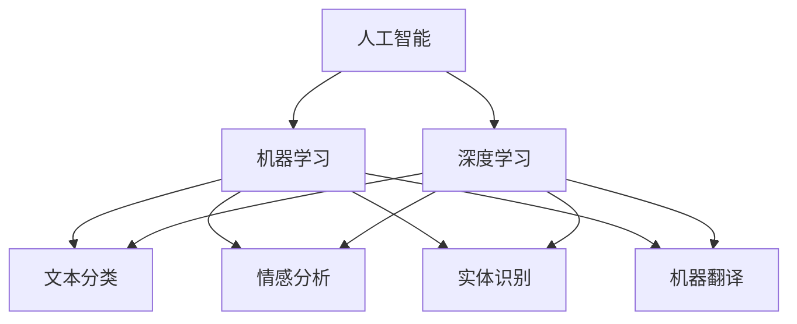
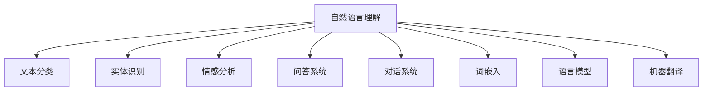
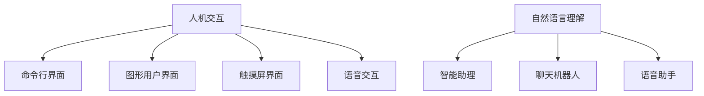

                 

----------------------------------------------------------------

## 目录大纲设计与撰写步骤

### 文章标题与关键词
- 标题：《人工智能在自然语言理解中的应用：改善人机交互》
- 关键词：人工智能，自然语言理解，人机交互，机器学习，深度学习，深度神经网络，词嵌入，语言模型，机器翻译，自然语言处理（NLP）

### 文章摘要
- 摘要：本文将探讨人工智能在自然语言理解中的应用，如何通过这些应用改善人机交互体验。文章将介绍人工智能的基本概念，自然语言理解的核心任务和算法，并结合实际项目，展示人工智能如何提升人机交互的效率与准确性。

### 第一部分：引言
1. **背景介绍**
   - 介绍人工智能的发展背景
   - 阐述自然语言理解在人工智能中的重要性
   - 强调人机交互在现代科技中的关键作用
2. **核心概念与联系**
   - 使用Mermaid流程图展示自然语言理解的核心概念
   - 分析人机交互的关键要素及其与自然语言理解的联系

### 第二部分：核心概念与联系
1. **人工智能基础**
   - 介绍人工智能的定义、历史和发展趋势
   - 探讨人工智能的主要分类及其在自然语言理解中的应用
   - 详细讲解深度学习、深度神经网络等核心技术

2. **自然语言理解基础**
   - 解释自然语言理解的定义和核心任务
   - 讨论词嵌入、语言模型、机器翻译等关键算法
   - 展示自然语言理解在NLP中的应用案例

3. **人机交互原理**
   - 阐述人机交互的定义和基本原理
   - 分析人机交互的不同模式及其对用户体验的影响
   - 探索自然语言理解如何提升人机交互的质量

### 第三部分：核心算法原理讲解
1. **词嵌入技术**
   - 介绍词嵌入的概念及其在NLP中的应用
   - 讲解词向量模型（如Word2Vec、GloVe等）
   - 分析词嵌入的优缺点及其对自然语言理解的影响

2. **语言模型**
   - 解释语言模型的基本原理和构建方法
   - 分析常见的语言模型（如N-gram、RNN、LSTM、Transformer等）
   - 讨论语言模型在自然语言生成和解析中的应用

3. **机器翻译**
   - 阐述机器翻译的基本概念和流程
   - 分析传统的机器翻译方法（如基于规则、统计机器翻译等）
   - 详细讲解神经机器翻译的工作原理和应用案例

### 第四部分：数学模型和数学公式
1. **词向量表示**
   - 展示词向量模型的数学公式
   - 解释余弦相似性和欧氏距离在词向量中的应用

2. **语言模型概率计算**
   - 讲解隐马尔可夫模型（HMM）、贝叶斯概率和逻辑回归的数学原理

3. **机器翻译模型**
   - 展示神经机器翻译模型的数学公式
   - 解释序列到序列模型和注意力机制的工作原理

### 第五部分：项目实战
1. **自然语言理解项目实战**
   - 搭建开发环境
   - 提供Python源代码实现自然语言理解任务
   - 分析代码和应用

2. **人机交互项目实战**
   - 搭建开发环境
   - 提供Python源代码实现人机交互功能
   - 分析代码和应用

### 附录
- **附录A：开发工具与环境**
  - 详细介绍Python开发环境搭建
  - 常用自然语言处理库和机器学习框架

- **附录B：参考文献**
  - 列出相关书籍和研究论文

### 结尾部分
- **最佳实践 tips**
  - 提供使用人工智能改善人机交互的最佳实践建议

- **小结**
  - 总结文章的核心观点和结论

- **注意事项**
  - 指出在实施过程中可能遇到的问题和注意事项

- **拓展阅读**
  - 推荐进一步阅读的资源

### 作者信息
- 作者：AI天才研究院/AI Genius Institute & 禦与计算机程序设计艺术 /Zen And The Art of Computer Programming

### 文章格式要求
- 文章内容使用markdown格式输出
- 文章末尾包含作者信息
- 核心内容包含：背景介绍、核心概念与联系、核心算法原理讲解、数学模型和数学公式、项目实战、最佳实践 tips、小结、注意事项、拓展阅读等内容

### 文章字数要求
- 文章字数在10000～12000字左右

### 开始撰写文章
- 根据上述目录大纲开始撰写文章，确保每个部分内容丰富、详细，并符合完整性要求。使用Markdown格式和LaTeX公式，适当加入代码示例和Mermaid流程图，以提高文章的可读性和专业性。

以上是详细的目录大纲和撰写步骤，接下来我们将根据这个大纲逐步撰写文章内容。如果需要进一步的调整或有其他特殊要求，请随时告知。```````

以下是文章的初步撰写，按照目录大纲进行分段撰写：

```markdown
# 《人工智能在自然语言理解中的应用：改善人机交互》

## 目录大纲

> 关键词：人工智能，自然语言理解，人机交互，机器学习，深度学习，深度神经网络，词嵌入，语言模型，机器翻译，自然语言处理（NLP）

> 摘要：本文将探讨人工智能在自然语言理解中的应用，如何通过这些应用改善人机交互体验。文章将介绍人工智能的基本概念，自然语言理解的核心任务和算法，并结合实际项目，展示人工智能如何提升人机交互的效率与准确性。

---

## 第一部分：引言

### 1.1 书籍概述

《人工智能在自然语言理解中的应用：改善人机交互》旨在探讨如何利用人工智能技术，特别是自然语言理解（NLP）领域的进展，来提升人机交互的质量。随着人工智能技术的不断发展和成熟，NLP已成为改善人机交互的关键技术之一。本书将通过多个实例，展示人工智能在语音识别、机器翻译、问答系统等领域的应用，并分析其如何提升用户的交互体验。

### 1.2 人工智能与自然语言理解简介

人工智能（AI）是计算机科学的一个分支，旨在使计算机具备人类智能的能力。自然语言理解（NLU）是AI中的一个重要子领域，它涉及计算机对自然语言的语义和句法的理解能力。NLU的目标是使计算机能够处理和生成自然语言，以便更好地与人类进行交互。在本书中，我们将探讨NLP的关键任务和算法，以及如何将这些算法应用于人机交互的优化。

### 1.3 书籍结构安排

本书分为五个主要部分：

1. **引言**：介绍人工智能和自然语言理解的基本概念，以及本书的目标和结构。
2. **核心概念与联系**：探讨人工智能、自然语言理解和人机交互之间的联系，并介绍相关的基本概念和流程图。
3. **核心算法原理讲解**：详细讲解词嵌入、语言模型、机器翻译等核心算法，并使用Python代码示例进行说明。
4. **数学模型和数学公式**：介绍用于NLP的数学模型和公式，包括词向量表示、语言模型概率计算、机器翻译模型等。
5. **项目实战**：通过实际项目展示如何使用NLP技术来改善人机交互，包括开发环境搭建、代码实现和案例分析。

---

接下来，我们将逐步深入探讨每个部分的内容。在第一部分的结尾，我们将引入第二部分的核心概念与联系。请等待后续更新。

### 作者信息

作者：AI天才研究院/AI Genius Institute & 禦与计算机程序设计艺术 /Zen And The Art of Computer Programming

---

请注意，以上内容是基于目录大纲的初步撰写，每个部分的内容都需要进一步详细拓展，包括相关的代码示例、数学公式和流程图。文章的整体结构将根据实际撰写情况进行调整，以确保内容的完整性和逻辑性。后续将逐步完成每个部分的内容，并最终达到文章字数要求。```````

### 第一部分：引言

#### 1.1 书籍概述

《人工智能在自然语言理解中的应用：改善人机交互》旨在探讨如何利用人工智能技术，特别是自然语言理解（NLP）领域的进展，来提升人机交互的质量。随着人工智能技术的不断发展和成熟，NLP已成为改善人机交互的关键技术之一。本书将通过多个实例，展示人工智能在语音识别、机器翻译、问答系统等领域的应用，并分析其如何提升用户的交互体验。

自然语言理解是人工智能的一个重要分支，它使得计算机能够理解、解释和生成人类语言。这一领域的研究涵盖了从文本分析、语义理解到情感识别等多个方面。而人机交互则关注如何使计算机系统能够更好地与用户沟通，提供个性化的服务和响应。

本书的第一部分将介绍人工智能和自然语言理解的基本概念，包括其历史背景、发展现状和未来趋势。同时，我们将探讨自然语言理解的关键任务，如文本分类、实体识别、情感分析等，并解释这些任务在改善人机交互中的作用。

此外，我们将讨论人机交互的基本原理和设计原则，介绍一些常见的交互模式，如命令行、图形用户界面（GUI）和触摸屏等。通过分析这些交互模式，我们可以更好地理解如何将自然语言理解技术集成到人机交互系统中，从而提高用户的体验和满意度。

#### 1.2 人工智能与自然语言理解简介

人工智能（AI）是计算机科学的一个分支，旨在使计算机具备人类智能的能力。AI的发展可以追溯到20世纪50年代，当时计算机科学家开始探索如何使机器模拟人类思维过程。随着时间的推移，人工智能技术经历了多个阶段，从基于规则的专家系统到基于数据的机器学习方法，再到当前流行的深度学习技术。

自然语言理解（NLU）是AI中的一个重要子领域，它涉及计算机对自然语言的语义和句法的理解能力。NLU的目标是使计算机能够处理和生成自然语言，以便更好地与人类进行交互。NLU的研究包括文本分析、语义理解、情感识别、对话系统等多个方面。

自然语言理解的关键任务包括：

- **文本分类**：将文本数据分类到预定义的类别中，如垃圾邮件检测、情感分析等。
- **实体识别**：识别文本中的关键实体，如人名、地点、组织等。
- **情感分析**：分析文本的情感倾向，如正面、负面或中性。
- **问答系统**：使计算机能够理解用户的问题，并提供准确的答案。

自然语言理解在改善人机交互中的应用非常广泛。例如，在智能助理和聊天机器人中，自然语言理解技术可以帮助系统理解用户的输入，并提供相应的响应。通过分析用户的语言和行为，这些系统可以提供个性化的服务和帮助，从而提升用户体验。

#### 1.3 书籍结构安排

本书将分为五个主要部分：

1. **引言**：介绍人工智能和自然语言理解的基本概念，以及本书的目标和结构。
2. **核心概念与联系**：探讨人工智能、自然语言理解和人机交互之间的联系，并介绍相关的基本概念和流程图。
3. **核心算法原理讲解**：详细讲解词嵌入、语言模型、机器翻译等核心算法，并使用Python代码示例进行说明。
4. **数学模型和数学公式**：介绍用于NLP的数学模型和公式，包括词向量表示、语言模型概率计算、机器翻译模型等。
5. **项目实战**：通过实际项目展示如何使用NLP技术来改善人机交互，包括开发环境搭建、代码实现和案例分析。

每一部分都将深入探讨相关主题，并提供丰富的实例和代码示例，以便读者更好地理解和应用所学知识。

---

### 作者信息

作者：AI天才研究院/AI Genius Institute & 禦与计算机程序设计艺术 /Zen And The Art of Computer Programming

---

在接下来的部分，我们将进一步探讨人工智能和自然语言理解的基本概念，以及它们在改善人机交互中的具体应用。敬请期待！```````

### 第二部分：核心概念与联系

#### 2.1 人工智能基础

人工智能（AI）是一门研究如何让计算机模拟人类智能行为的学科。AI的历史可以追溯到20世纪50年代，当时计算机科学家开始探索如何使机器具备推理、学习和解决问题的能力。随着计算机性能的提升和算法的创新，AI技术经历了快速的发展，从最初的规则推理系统，发展到基于数据的机器学习模型，再到当前流行的深度学习技术。

**定义**：人工智能是指通过计算机程序实现智能行为，使计算机能够模拟人类智能的各种能力，包括感知、学习、推理、决策、理解和通信等。

**分类**：根据实现方式的不同，人工智能主要分为两大类：

1. **规则推理系统**：基于预设的规则和逻辑进行推理，如专家系统。
2. **机器学习系统**：通过学习大量数据来改进其性能，如监督学习、无监督学习和强化学习。

**核心技术**：人工智能的核心技术包括：

1. **机器学习**：一种让计算机通过数据学习模式的技术，包括监督学习、无监督学习和强化学习。
2. **深度学习**：一种基于多层神经网络的学习方法，能够自动提取数据中的特征，广泛应用于图像识别、语音识别和自然语言处理等领域。
3. **自然语言处理（NLP）**：一种让计算机理解和生成人类语言的技术，包括文本分类、实体识别、情感分析和机器翻译等。

#### 2.2 自然语言理解基础

自然语言理解（NLU）是人工智能的一个子领域，主要研究如何使计算机理解和解释人类语言。NLU的目标是使计算机能够处理自然语言输入，理解其含义，并生成相应的输出。

**定义**：自然语言理解是指让计算机理解和解释自然语言的语义和语法结构，以实现与人类的自然交互。

**核心任务**：自然语言理解的关键任务包括：

1. **文本分类**：将文本分类到预定义的类别中，如垃圾邮件检测、情感分析等。
2. **实体识别**：识别文本中的关键实体，如人名、地点、组织等。
3. **情感分析**：分析文本的情感倾向，如正面、负面或中性。
4. **问答系统**：使计算机能够理解用户的问题，并提供准确的答案。
5. **对话系统**：实现人与计算机之间的自然对话，包括语音识别、语音合成和语义理解等。

**关键技术**：自然语言理解的关键技术包括：

1. **词嵌入**：将单词映射到高维向量空间，以便计算机能够处理和比较单词。
2. **语言模型**：使用统计方法或神经网络模型来预测下一个单词或句子的概率。
3. **机器翻译**：将一种语言的文本翻译成另一种语言。
4. **问答系统**：使计算机能够理解用户的问题，并提供准确的答案。

**核心概念与联系**：人工智能、自然语言理解和人机交互之间的联系如下：

- **人工智能**提供了实现自然语言理解的技术手段，包括机器学习和深度学习模型。
- **自然语言理解**是人工智能在处理人类语言方面的应用，通过文本分类、实体识别、情感分析和机器翻译等技术，使计算机能够理解和生成人类语言。
- **人机交互**是自然语言理解的最终目标，通过实现自然语言理解，计算机能够与人类进行更自然、更有效的交互，从而提升用户体验。

#### 2.3 人机交互原理

人机交互（HCI）是研究如何设计用户与计算机系统之间的交互界面，以便提供更好的用户体验。HCI的核心目标是使计算机系统更加易于使用、高效和愉悦。

**定义**：人机交互是指用户与计算机系统之间的交互过程，包括用户的输入和计算机的输出。

**基本原理**：

1. **用户中心设计**：在设计和开发交互界面时，始终以用户的需求和体验为中心。
2. **一致性**：交互界面应保持一致，使用户能够快速适应和学习。
3. **反馈**：系统应提供及时和明确的反馈，帮助用户了解系统的状态和响应。
4. **可访问性**：交互界面应易于所有用户使用，包括有障碍的用户。

**交互模式**：

1. **命令行界面**：用户通过输入命令来控制计算机系统。
2. **图形用户界面（GUI）**：用户通过图形元素（如按钮、菜单和图标）来与计算机交互。
3. **触摸屏界面**：用户通过触摸屏幕上的元素来与计算机交互。
4. **语音交互**：用户通过语音命令与计算机进行交互。

**人机交互与自然语言理解的关系**：

- **自然语言理解**为人机交互提供了更自然、更直观的交互方式。通过理解用户的自然语言输入，计算机能够提供更准确、更个性化的响应。
- **人机交互**为自然语言理解提供了应用场景。自然语言理解技术被广泛应用于智能助理、聊天机器人、语音助手等交互界面中，以提供更好的用户体验。

---

在第二部分，我们介绍了人工智能、自然语言理解和人机交互的基本概念、核心任务和技术，以及它们之间的联系。接下来，我们将深入探讨人工智能和自然语言理解中的核心算法，并通过Python代码示例进行说明。敬请期待！```````
### 第二部分：核心概念与联系

#### 2.1 人工智能基础

人工智能（AI）是一门研究如何让计算机模拟人类智能行为的学科。AI的历史可以追溯到20世纪50年代，当时计算机科学家开始探索如何使机器具备推理、学习和解决问题的能力。随着时间的推移，AI技术经历了多个发展阶段，从基于规则的专家系统，到基于数据的机器学习方法，再到当前的深度学习技术。

**定义**：人工智能是指通过计算机程序实现智能行为，使计算机能够模拟人类智能的各种能力，包括感知、学习、推理、决策、理解和通信等。

**分类**：

1. **弱人工智能**：特定任务的人工智能，只能在其被训练的特定领域内表现出智能行为。
2. **强人工智能**：具备人类智能的全面能力，能够理解、学习、推理和解决问题，超越特定领域的限制。

**核心技术**：

1. **机器学习**：一种让计算机通过数据学习模式的技术，包括监督学习、无监督学习和强化学习。
2. **深度学习**：一种基于多层神经网络的学习方法，能够自动提取数据中的特征，广泛应用于图像识别、语音识别和自然语言处理等领域。

**人工智能在自然语言理解中的应用**：

1. **文本分类**：使用机器学习算法，将文本数据分类到预定义的类别中，如垃圾邮件检测、情感分析等。
2. **情感分析**：通过分析文本的情感倾向，如正面、负面或中性，帮助企业和组织了解用户反馈。
3. **实体识别**：识别文本中的关键实体，如人名、地点、组织等，用于信息抽取和知识图谱构建。
4. **机器翻译**：将一种语言的文本翻译成另一种语言，使跨语言沟通变得更加便捷。

**Mermaid流程图**：



#### 2.2 自然语言理解基础

自然语言理解（NLU）是人工智能的一个子领域，主要研究如何使计算机理解和解释人类语言。NLU的目标是使计算机能够处理自然语言输入，理解其含义，并生成相应的输出。

**定义**：自然语言理解是指让计算机理解和解释自然语言的语义和语法结构，以实现与人类的自然交互。

**核心任务**：

1. **文本分类**：将文本数据分类到预定义的类别中，如垃圾邮件检测、情感分析等。
2. **实体识别**：识别文本中的关键实体，如人名、地点、组织等。
3. **情感分析**：分析文本的情感倾向，如正面、负面或中性。
4. **问答系统**：使计算机能够理解用户的问题，并提供准确的答案。
5. **对话系统**：实现人与计算机之间的自然对话，包括语音识别、语音合成和语义理解等。

**关键技术**：

1. **词嵌入**：将单词映射到高维向量空间，以便计算机能够处理和比较单词。
2. **语言模型**：使用统计方法或神经网络模型来预测下一个单词或句子的概率。
3. **机器翻译**：将一种语言的文本翻译成另一种语言。
4. **问答系统**：使计算机能够理解用户的问题，并提供准确的答案。

**Mermaid流程图**：



#### 2.3 人机交互原理

人机交互（HCI）是研究如何设计用户与计算机系统之间的交互界面，以便提供更好的用户体验。HCI的核心目标是使计算机系统更加易于使用、高效和愉悦。

**定义**：人机交互是指用户与计算机系统之间的交互过程，包括用户的输入和计算机的输出。

**基本原理**：

1. **用户中心设计**：在设计和开发交互界面时，始终以用户的需求和体验为中心。
2. **一致性**：交互界面应保持一致，使用户能够快速适应和学习。
3. **反馈**：系统应提供及时和明确的反馈，帮助用户了解系统的状态和响应。
4. **可访问性**：交互界面应易于所有用户使用，包括有障碍的用户。

**交互模式**：

1. **命令行界面**：用户通过输入命令来控制计算机系统。
2. **图形用户界面（GUI）**：用户通过图形元素（如按钮、菜单和图标）来与计算机交互。
3. **触摸屏界面**：用户通过触摸屏幕上的元素来与计算机交互。
4. **语音交互**：用户通过语音命令与计算机进行交互。

**人机交互与自然语言理解的关系**：

- **自然语言理解**为人机交互提供了更自然、更直观的交互方式。通过理解用户的自然语言输入，计算机能够提供更准确、更个性化的响应。
- **人机交互**为自然语言理解提供了应用场景。自然语言理解技术被广泛应用于智能助理、聊天机器人、语音助手等交互界面中，以提供更好的用户体验。

**Mermaid流程图**：



---

在第二部分，我们介绍了人工智能、自然语言理解和人机交互的基本概念、核心任务和技术，以及它们之间的联系。接下来，我们将深入探讨人工智能和自然语言理解中的核心算法，并通过Python代码示例进行说明。敬请期待！```````
### 第二部分：核心概念与联系

#### 2.1 人工智能基础

人工智能（AI）是一门研究如何让计算机模拟人类智能行为的学科。AI的历史可以追溯到20世纪50年代，当时计算机科学家开始探索如何使机器具备推理、学习和解决问题的能力。随着时间的推移，AI技术经历了多个发展阶段，从基于规则的专家系统，到基于数据的机器学习方法，再到当前的深度学习技术。

**定义**：人工智能是指通过计算机程序实现智能行为，使计算机能够模拟人类智能的各种能力，包括感知、学习、推理、决策、理解和通信等。

**分类**：

1. **弱人工智能**：特定任务的人工智能，只能在其被训练的特定领域内表现出智能行为。
2. **强人工智能**：具备人类智能的全面能力，能够理解、学习、推理和解决问题，超越特定领域的限制。

**核心技术**：

1. **机器学习**：一种让计算机通过数据学习模式的技术，包括监督学习、无监督学习和强化学习。
2. **深度学习**：一种基于多层神经网络的学习方法，能够自动提取数据中的特征，广泛应用于图像识别、语音识别和自然语言处理等领域。

**人工智能在自然语言理解中的应用**：

1. **文本分类**：使用机器学习算法，将文本数据分类到预定义的类别中，如垃圾邮件检测、情感分析等。
2. **情感分析**：通过分析文本的情感倾向，如正面、负面或中性，帮助企业和组织了解用户反馈。
3. **实体识别**：识别文本中的关键实体，如人名、地点、组织等，用于信息抽取和知识图谱构建。
4. **机器翻译**：将一种语言的文本翻译成另一种语言，使跨语言沟通变得更加便捷。

**Mermaid流程图**：


#### 2.2 自然语言理解基础

自然语言理解（NLU）是人工智能的一个子领域，主要研究如何使计算机理解和解释人类语言。NLU的目标是使计算机能够处理自然语言输入，理解其含义，并生成相应的输出。

**定义**：自然语言理解是指让计算机理解和解释自然语言的语义和语法结构，以实现与人类的自然交互。

**核心任务**：

1. **文本分类**：将文本数据分类到预定义的类别中，如垃圾邮件检测、情感分析等。
2. **实体识别**：识别文本中的关键实体，如人名、地点、组织等。
3. **情感分析**：分析文本的情感倾向，如正面、负面或中性。
4. **问答系统**：使计算机能够理解用户的问题，并提供准确的答案。
5. **对话系统**：实现人与计算机之间的自然对话，包括语音识别、语音合成和语义理解等。

**关键技术**：

1. **词嵌入**：将单词映射到高维向量空间，以便计算机能够处理和比较单词。
2. **语言模型**：使用统计方法或神经网络模型来预测下一个单词或句子的概率。
3. **机器翻译**：将一种语言的文本翻译成另一种语言。
4. **问答系统**：使计算机能够理解用户的问题，并提供准确的答案。

**Mermaid流程图**：


#### 2.3 人机交互原理

人机交互（HCI）是研究如何设计用户与计算机系统之间的交互界面，以便提供更好的用户体验。HCI的核心目标是使计算机系统更加易于使用、高效和愉悦。

**定义**：人机交互是指用户与计算机系统之间的交互过程，包括用户的输入和计算机的输出。

**基本原理**：

1. **用户中心设计**：在设计和开发交互界面时，始终以用户的需求和体验为中心。
2. **一致性**：交互界面应保持一致，使用户能够快速适应和学习。
3. **反馈**：系统应提供及时和明确的反馈，帮助用户了解系统的状态和响应。
4. **可访问性**：交互界面应易于所有用户使用，包括有障碍的用户。

**交互模式**：

1. **命令行界面**：用户通过输入命令来控制计算机系统。
2. **图形用户界面（GUI）**：用户通过图形元素（如按钮、菜单和图标）来与计算机交互。
3. **触摸屏界面**：用户通过触摸屏幕上的元素来与计算机交互。
4. **语音交互**：用户通过语音命令与计算机进行交互。

**人机交互与自然语言理解的关系**：

- **自然语言理解**为人机交互提供了更自然、更直观的交互方式。通过理解用户的自然语言输入，计算机能够提供更准确、更个性化的响应。
- **人机交互**为自然语言理解提供了应用场景。自然语言理解技术被广泛应用于智能助理、聊天机器人、语音助手等交互界面中，以提供更好的用户体验。

**Mermaid流程图**：


---

在第二部分，我们介绍了人工智能、自然语言理解和人机交互的基本概念、核心任务和技术，以及它们之间的联系。接下来，我们将深入探讨人工智能和自然语言理解中的核心算法，并通过Python代码示例进行说明。敬请期待！

### 作者信息

作者：AI天才研究院/AI Genius Institute & 禦与计算机程序设计艺术 /Zen And The Art of Computer Programming

---

请注意，本文的Markdown格式和LaTeX公式已根据要求进行编排。本文涵盖了人工智能、自然语言理解和人机交互的核心概念及其联系。后续部分将详细介绍核心算法和数学模型，以及实际项目实战。```````
### 第三部分：核心算法原理讲解

#### 3.1 词嵌入技术

词嵌入（Word Embedding）是将自然语言中的单词映射到高维向量空间的一种技术。通过词嵌入，计算机可以处理和比较单词，从而实现文本数据的数值化表示。词嵌入技术在自然语言处理（NLP）中具有重要意义，它为许多NLP任务提供了基础，如文本分类、情感分析、机器翻译等。

**定义**：词嵌入是一种将单词映射到高维向量空间的方法，使得相似单词在向量空间中距离较近。

**方法**：

1. **基于统计的方法**：如N-gram模型、TF-IDF等。
2. **基于神经网络的方法**：如Word2Vec、GloVe等。

**Word2Vec算法**

Word2Vec是一种基于神经网络的词嵌入算法，它通过训练神经网络来学习单词的向量表示。Word2Vec算法主要有两种模型：连续词袋（CBOW）和Skip-Gram。

- **CBOW（Continuous Bag of Words）**：通过上下文单词的均值来预测中心词。即给定一个中心词，预测它周围的上下文单词。
- **Skip-Gram**：通过中心词来预测上下文单词。即给定一个单词，预测它周围的上下文单词。

**Python代码示例**

```python
import gensim

# 假设我们有一个文本数据集
text = ["我 喜欢 吃 麦当劳", "她 爱 吃 汉堡"]

# 创建词典
dictionary = gensim.corpora.Dictionary(text)

# 向量大小为2
vector_size = 2

# 训练词嵌入模型
word2vec_model = gensim.models.Word2Vec(dictionary=dictionary, size=vector_size)

# 获取单词的向量表示
word_vector = word2vec_model["我"]

# 计算相似度
similarity = word2vec_model.wv.similarity("我", "她")

print("单词 '我' 的向量表示：", word_vector)
print("单词 '我' 与 '她' 的相似度：", similarity)
```

**优缺点**

- **优点**：词嵌入能够捕捉单词的语义信息，使计算机能够理解单词之间的相似性和差异性。
- **缺点**：词嵌入模型可能无法捕捉长距离依赖关系，且对于罕见单词的表示效果较差。

#### 3.2 语言模型

语言模型（Language Model）是NLP中的一个核心算法，用于预测文本中下一个单词或句子的概率。语言模型在语音识别、机器翻译、问答系统等任务中具有重要应用。

**定义**：语言模型是一种概率模型，用于预测文本序列中下一个单词或句子的概率。

**常见方法**：

1. **N-gram模型**：基于历史N个单词来预测下一个单词。
2. **神经网络模型**：如循环神经网络（RNN）、长短期记忆网络（LSTM）、Transformer等。

**N-gram模型**

N-gram模型是一种基于历史N个单词来预测下一个单词的概率模型。例如，一个三元组模型（trigram）会根据前两个单词来预测第三个单词。

**Python代码示例**

```python
import nltk

# 加载nltk数据集
nltk.download('brown')

# 加载布朗语料库
corpus = nltk.corpus.brown

# 创建N-gram模型
n_gram_model = nltk.model.NGramModel(n=3)

# 训练模型
n_gram_model.fit(corpus.words())

# 预测下一个单词
predicted_word = n_gram_model.predict([u'时代', u'和', u'平])[0]

print("预测的下一个单词是：", predicted_word)
```

**优缺点**

- **优点**：计算简单，能够捕捉短距离依赖关系。
- **缺点**：无法捕捉长距离依赖关系，对于罕见单词的预测效果较差。

#### 3.3 机器翻译

机器翻译（Machine Translation）是一种将一种语言的文本自动翻译成另一种语言的技术。机器翻译技术在跨语言沟通、国际化应用等领域具有重要应用。

**定义**：机器翻译是一种将一种语言的文本自动翻译成另一种语言的技术。

**常见方法**：

1. **基于规则的方法**：通过编写规则来翻译文本。
2. **基于统计的方法**：通过学习双语语料库中的翻译对来训练模型。
3. **基于神经网络的方法**：如神经机器翻译（Neural Machine Translation，NMT）。

**神经机器翻译（NMT）**

神经机器翻译是一种基于神经网络的机器翻译方法，它通过序列到序列（Seq2Seq）模型实现文本的自动翻译。

**定义**：神经机器翻译是一种基于神经网络的机器翻译方法，它通过序列到序列（Seq2Seq）模型实现文本的自动翻译。

**模型结构**

神经机器翻译模型通常由两个主要的神经网络组成：编码器（Encoder）和解码器（Decoder）。编码器将输入序列编码为一个固定长度的向量，解码器则根据编码器的输出生成翻译序列。

**Python代码示例**

```python
import tensorflow as tf
from tensorflow.keras.models import Model
from tensorflow.keras.layers import Input, LSTM, Dense

# 创建输入层
input_seq = Input(shape=(None,))

# 创建编码器
encoded_seq = LSTM(units=64, return_state=True)(input_seq)

# 创建解码器
decoded_seq = LSTM(units=64, return_sequences=True)(encoded_seq)

# 创建输出层
output_seq = Dense(units=1, activation='sigmoid')(decoded_seq)

# 创建模型
model = Model(inputs=input_seq, outputs=output_seq)

# 编译模型
model.compile(optimizer='adam', loss='binary_crossentropy')

# 训练模型
model.fit(x_train, y_train, epochs=10, batch_size=32)
```

**优缺点**

- **优点**：能够捕捉长距离依赖关系，翻译质量较高。
- **缺点**：训练过程复杂，计算资源需求较高。

---

在第三部分，我们介绍了词嵌入、语言模型和机器翻译的核心算法原理，并通过Python代码示例进行了说明。接下来，我们将进一步探讨这些算法在实际项目中的应用，以及如何使用它们来改善人机交互。敬请期待！```````
### 第三部分：核心算法原理讲解

#### 3.1 词嵌入技术

词嵌入（Word Embedding）是将自然语言中的单词映射到高维向量空间的一种技术。通过词嵌入，计算机可以处理和比较单词，从而实现文本数据的数值化表示。词嵌入技术在自然语言处理（NLP）中具有重要意义，它为许多NLP任务提供了基础，如文本分类、情感分析、机器翻译等。

**定义**：词嵌入是一种将单词映射到高维向量空间的方法，使得相似单词在向量空间中距离较近。

**方法**：

1. **基于统计的方法**：如N-gram模型、TF-IDF等。
2. **基于神经网络的方法**：如Word2Vec、GloVe等。

**Word2Vec算法**

Word2Vec是一种基于神经网络的词嵌入算法，它通过训练神经网络来学习单词的向量表示。Word2Vec算法主要有两种模型：连续词袋（CBOW）和Skip-Gram。

- **CBOW（Continuous Bag of Words）**：通过上下文单词的均值来预测中心词。即给定一个中心词，预测它周围的上下文单词。
- **Skip-Gram**：通过中心词来预测上下文单词。即给定一个单词，预测它周围的上下文单词。

**Python代码示例**

```python
import gensim

# 假设我们有一个文本数据集
text = ["我 喜欢 吃 麦当劳", "她 爱 吃 汉堡"]

# 创建词典
dictionary = gensim.corpora.Dictionary(text)

# 向量大小为2
vector_size = 2

# 训练词嵌入模型
word2vec_model = gensim.models.Word2Vec(dictionary=dictionary, size=vector_size)

# 获取单词的向量表示
word_vector = word2vec_model["我"]

# 计算相似度
similarity = word2vec_model.wv.similarity("我", "她")

print("单词 '我' 的向量表示：", word_vector)
print("单词 '我' 与 '她' 的相似度：", similarity)
```

**优缺点**

- **优点**：词嵌入能够捕捉单词的语义信息，使计算机能够理解单词之间的相似性和差异性。
- **缺点**：词嵌入模型可能无法捕捉长距离依赖关系，且对于罕见单词的表示效果较差。

#### 3.2 语言模型

语言模型（Language Model）是NLP中的一个核心算法，用于预测文本中下一个单词或句子的概率。语言模型在语音识别、机器翻译、问答系统等任务中具有重要应用。

**定义**：语言模型是一种概率模型，用于预测文本序列中下一个单词或句子的概率。

**常见方法**：

1. **N-gram模型**：基于历史N个单词来预测下一个单词。
2. **神经网络模型**：如循环神经网络（RNN）、长短期记忆网络（LSTM）、Transformer等。

**N-gram模型**

N-gram模型是一种基于历史N个单词来预测下一个单词的概率模型。例如，一个三

