                 

### 文章标题

《人工智能在语音助手个性化中的应用》

### 关键词

人工智能，语音助手，个性化，语音识别，语音合成，深度学习，个性化推荐，用户行为分析

### 摘要

随着人工智能技术的不断发展，语音助手已成为现代智能设备的核心功能之一。本文旨在探讨人工智能在语音助手个性化中的应用，包括语音识别、语音合成、用户行为分析等方面。通过详细分析核心概念、算法原理和具体案例，本文揭示了个性化语音助手的设计与实现方法，为未来人工智能的发展提供了有价值的参考。

### 第一部分：基础概念与技术

#### 第1章：人工智能基础

##### 1.1 人工智能的定义与历史

人工智能（AI，Artificial Intelligence）是计算机科学的一个分支，旨在研究、开发和应用使计算机模拟人类智能行为的理论、算法和技术。人工智能的历史可以追溯到20世纪50年代，当时学者们首次提出了“人工智能”的概念。

- **1956年：** 在达特茅斯会议（Dartmouth Conference）上，约翰·麦卡锡（John McCarthy）等人首次提出了人工智能的概念，并定义了人工智能研究的三个目标：理解人类智能的本质、制造出能表现出人类智能行为的机器、解决复杂的实际问题。

- **20世纪60年代：** 人工智能研究在符号主义和逻辑推理方面取得了显著进展，如推理机（theorem provers）和专家系统（expert systems）等。

- **20世纪70年代：** 随着计算机硬件性能的提升和数据库技术的进步，人工智能在应用领域取得了广泛的应用，如自动翻译、医疗诊断等。

- **20世纪80年代：** 人工智能研究开始向机器学习和专家系统方向转变，特别是神经网络和机器学习算法的兴起，为人工智能的发展提供了新的动力。

- **21世纪初至今：** 随着深度学习（deep learning）和大数据（big data）技术的发展，人工智能取得了重大突破，语音识别、图像识别、自然语言处理等领域的应用日益广泛。

##### 1.2 机器学习的基本概念

机器学习（Machine Learning）是人工智能的一个分支，它通过构建模型来从数据中自动提取知识和规律，实现对未知数据的预测和决策。

- **监督学习（Supervised Learning）：** 通过已有标记数据来训练模型，使模型能够在新的数据上进行预测。

  - **回归（Regression）：** 预测连续值输出。
  - **分类（Classification）：** 预测离散值输出。

- **无监督学习（Unsupervised Learning）：** 不使用标记数据，通过自动发现数据中的结构和规律来进行学习。

  - **聚类（Clustering）：** 将相似的数据点分组。
  - **降维（Dimensionality Reduction）：** 降低数据维度，提取关键特征。

- **半监督学习（Semi-Supervised Learning）：** 结合标记数据和未标记数据，通过未标记数据来增强模型训练。

- **强化学习（Reinforcement Learning）：** 通过与环境交互来学习最优策略，以最大化长期回报。

##### 1.3 深度学习原理简介

深度学习（Deep Learning）是一种机器学习技术，它通过构建多层神经网络来实现复杂的数据建模。

- **神经网络（Neural Network）：** 受生物神经元的启发，神经网络由多个神经元（节点）组成，每个节点通过权重连接到其他节点。

- **激活函数（Activation Function）：** 用于决定神经元是否激活，常见的激活函数有ReLU、Sigmoid和Tanh。

- **反向传播（Backpropagation）：** 一种用于训练神经网络的算法，通过计算输出误差，反向传播误差至每个神经元的权重，并更新权重以减少误差。

- **优化算法（Optimization Algorithms）：** 用于调整网络参数以最小化损失函数，如随机梯度下降（Stochastic Gradient Descent，SGD）和Adam。

##### Mermaid 流程图

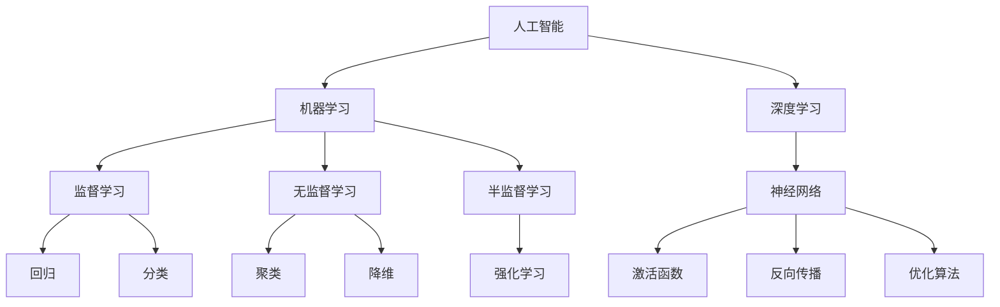

#### 第2章：语音处理技术

##### 2.1 语音信号处理基础

语音信号处理（Speech Signal Processing）是语音助手的核心技术之一，它涉及对语音信号的采集、处理和分析。

- **语音信号采集：** 通过麦克风等设备捕捉语音信号。

- **语音信号预处理：** 包括去噪、增益调整、分段等，以提高信号质量。

- **语音信号特征提取：** 提取语音信号中的关键特征，如频谱特征、倒谱特征等。

- **语音信号识别：** 通过训练模型，将语音信号转换为文本。

##### 2.2 语音识别原理与算法

语音识别（Speech Recognition）是将语音信号转换为文本的过程，其核心在于模型训练和特征提取。

- **HMM（隐马尔可夫模型）：** 常用于语音识别，通过状态转移概率和观测概率来预测语音序列。

- **DNN（深度神经网络）：** 通过多层神经网络来提取语音特征，提高识别准确性。

- **RNN（循环神经网络）：** 通过记忆状态来处理序列数据，如语音信号。

- **CTC（连接性时间分类）：** 一种用于语音识别的端到端模型，可以直接将语音信号映射到文本。

##### 2.3 语音合成技术

语音合成（Text-to-Speech，TTS）是将文本转换为语音的过程，其核心在于语音模型和语音参数生成。

- **参数合成方法：** 如Diphone合成、Unit合成等，通过合成单元来生成语音。

- **波形合成方法：** 如WaveNet、Tacotron等，通过生成波形信号来合成语音。

- **深度神经网络在TTS中的应用：** 通过DNN模型来生成语音特征和波形，提高合成质量。

##### Mermaid 流程图

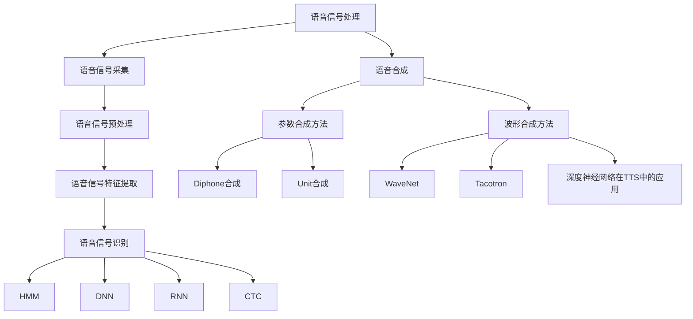

#### 第3章：语音助手个性化基础

##### 3.1 个性化服务的概念

个性化服务（Personalized Service）是一种根据用户需求和行为特征，提供定制化服务的理念。

- **个性化推荐：** 根据用户历史行为和偏好，为用户推荐感兴趣的内容或产品。

- **用户画像：** 基于用户数据，构建用户的行为特征和偏好模型。

- **用户行为分析：** 通过分析用户行为数据，了解用户需求和行为模式。

##### 3.2 用户行为分析与模型

用户行为分析（User Behavior Analysis）是构建个性化语音助手的关键，通过分析用户行为，为个性化推荐和用户画像提供支持。

- **用户行为数据收集：** 通过日志、传感器等手段收集用户行为数据。

- **用户行为特征提取：** 提取用户行为的特征，如点击率、购买行为等。

- **用户行为模型：** 建立用户行为模型，用于预测用户未来行为。

##### 3.3 个性化推荐系统

个性化推荐系统（Personalized Recommendation System）是语音助手个性化的重要组成部分，通过推荐算法为用户提供个性化的服务。

- **协同过滤（Collaborative Filtering）：** 通过分析用户之间的相似性来进行推荐。

  - **基于用户的协同过滤（User-Based Collaborative Filtering）：** 通过计算用户之间的相似度来推荐相似用户喜欢的项目。

  - **基于项目的协同过滤（Item-Based Collaborative Filtering）：** 通过计算项目之间的相似度来推荐相似项目。

- **基于内容的推荐（Content-Based Recommendation）：** 通过分析项目的内容特征来推荐相似项目。

- **混合推荐系统（Hybrid Recommendation System）：** 结合协同过滤和基于内容的推荐，提高推荐准确性。

##### Mermaid 流程图

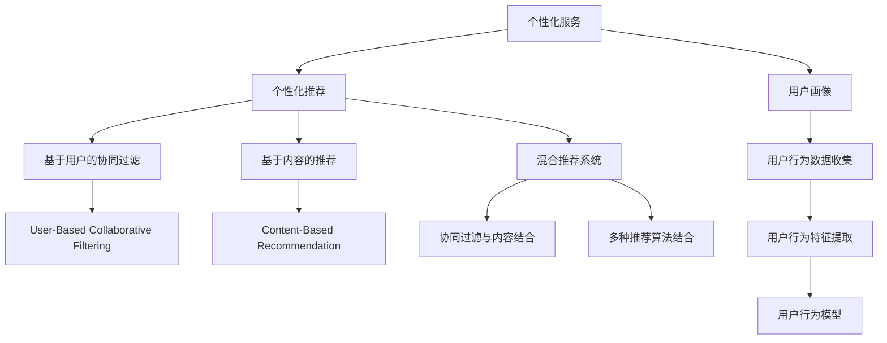

### 第二部分：个性化语音助手设计与实现

#### 第4章：个性化语音助手设计原理

##### 4.1 个性化语音助手的架构设计

个性化语音助手的架构设计是构建高效、可扩展和易维护的系统的基础。

- **模块化设计：** 将语音助手拆分为多个模块，如语音识别、语音合成、用户画像、推荐系统等，以提高系统的可维护性和可扩展性。

- **分布式架构：** 通过分布式系统来处理大规模数据和并发请求，提高系统的性能和稳定性。

- **微服务架构：** 将系统拆分为多个微服务，每个微服务负责特定的功能，以提高系统的灵活性和可扩展性。

##### 4.2 用户交互模型设计

用户交互模型设计是构建个性化语音助手的关键，它决定了语音助手如何理解用户需求和提供相应的服务。

- **语音交互：** 通过语音信号处理和语音识别技术，将用户的语音转化为文本。

- **语义理解：** 通过自然语言处理技术，理解用户的意图和需求。

- **意图识别：** 将用户的意图映射到具体的操作或服务。

- **上下文感知：** 根据用户的上下文信息，动态调整语音助手的交互方式。

##### 4.3 个性化语音合成的实现

个性化语音合成是将文本转化为自然、流畅的语音的过程，它是语音助手个性化的重要组成部分。

- **语音参数生成：** 通过生成语音参数，如音调、音速、音量等，来调整语音的音色。

- **语音波形生成：** 通过合成波形信号，生成语音波形。

- **个性化语音合成：** 结合用户的偏好和上下文信息，生成符合用户需求的个性化语音。

##### Mermaid 流�程图

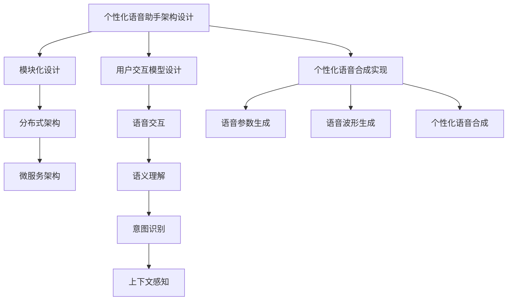

#### 第5章：个性化语音助手实现技术

##### 5.1 基于深度学习的语音识别

基于深度学习的语音识别技术是目前语音识别领域的主流方法，它通过训练大规模神经网络模型，实现高精度的语音识别。

- **深度神经网络（DNN）：** 通过多层神经网络来提取语音特征，提高识别准确性。

- **循环神经网络（RNN）：** 通过记忆状态来处理序列数据，如语音信号。

- **卷积神经网络（CNN）：** 通过卷积操作来提取语音信号的空间特征。

- **长短时记忆网络（LSTM）：** 通过记忆状态来处理长序列数据，提高语音识别的鲁棒性。

##### 5.2 基于深度学习的语音合成

基于深度学习的语音合成技术是语音合成领域的重要进展，它通过生成语音波形，实现自然、流畅的语音合成。

- **波形合成模型（WaveNet）：** 通过生成语音波形，实现高质量的语音合成。

- **声学模型（Acoustic Model）：** 通过训练神经网络模型，提取语音信号的特征。

- **语言模型（Language Model）：** 通过训练神经网络模型，生成文本。

- **声码器（Vocoder）：** 将文本信号转换为语音波形。

##### 5.3 个性化语言模型训练

个性化语言模型训练是构建个性化语音助手的重要步骤，它通过结合用户数据和通用数据，生成符合用户需求的语言模型。

- **数据收集：** 收集用户的历史对话数据和公共语料库。

- **特征提取：** 提取用户对话中的关键特征，如词汇、语法等。

- **模型训练：** 通过训练神经网络模型，生成个性化语言模型。

- **模型评估：** 通过评估模型在用户对话中的表现，调整模型参数。

##### Mermaid 流程图

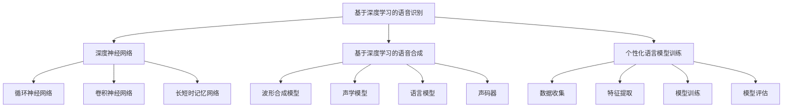

#### 第6章：项目实战：构建个性化语音助手

##### 6.1 项目需求分析

构建个性化语音助手需要明确项目需求，包括功能需求、性能需求和用户体验需求。

- **功能需求：** 包括语音识别、语音合成、个性化推荐、用户交互等。

- **性能需求：** 包括识别准确性、响应速度、稳定性等。

- **用户体验需求：** 包括交互体验、界面设计、语音音色等。

##### 6.2 系统设计与实现

系统设计与实现是构建个性化语音助手的关键步骤，它包括架构设计、模块划分、技术选型等。

- **架构设计：** 采用分布式架构和微服务架构，确保系统的性能和可扩展性。

- **模块划分：** 将系统划分为语音识别模块、语音合成模块、用户画像模块、推荐系统模块等。

- **技术选型：** 选择适合项目需求的深度学习算法和框架，如TensorFlow、PyTorch等。

##### 6.3 测试与优化

测试与优化是确保个性化语音助手质量和性能的重要环节，它包括功能测试、性能测试、用户体验测试等。

- **功能测试：** 验证系统的各项功能是否正常，包括语音识别、语音合成、个性化推荐等。

- **性能测试：** 测试系统的响应速度、稳定性、并发能力等。

- **用户体验测试：** 通过用户测试，收集用户反馈，优化交互体验。

##### 6.4 实际案例分析和详细讲解剖析

以某知名语音助手为例，分析其实际应用情况和实现细节。

- **案例背景：** 某语音助手是一款集语音识别、语音合成、个性化推荐等功能于一体的智能助手。

- **实现细节：** 分析语音识别、语音合成、用户画像、个性化推荐等模块的实现原理和关键技术。

- **优化策略：** 结合实际案例，提出优化策略，提高语音助手的性能和用户体验。

##### 6.5 项目小结

通过该项目实战，总结个性化语音助手的设计与实现经验，为后续项目提供参考。

- **经验总结：** 分析项目过程中的成功经验和不足之处。

- **未来展望：** 提出个性化语音助手的未来发展方向和研究方向。

### 第三部分：案例分析

#### 第7章：成功案例研究

通过分析国内外知名语音助手的案例，探讨其个性化语音助手的设计与实现。

- **Alexa：** 亚马逊的语音助手，提供广泛的智能家居控制功能。

- **Siri：** 苹果的语音助手，集成在iPhone、iPad等设备中。

- **Google Assistant：** 谷歌的语音助手，提供全面的智能服务。

#### 第8章：未来展望

展望个性化语音助手的未来发展，包括技术创新、应用场景扩展等。

- **技术创新：** 深度学习、自然语言处理等技术的进步，将推动个性化语音助手的发展。

- **应用场景扩展：** 个性化语音助手将在更多领域得到应用，如医疗、教育、金融等。

- **挑战与机遇：** 分析个性化语音助手面临的挑战和机遇，为未来的发展提供指导。

### 最佳实践 tips

- **持续优化：** 定期更新模型和数据，以提高语音助手的性能和用户体验。

- **用户反馈：** 收集用户反馈，及时调整和优化语音助手的交互和服务。

- **数据安全：** 重视用户隐私和数据安全，确保语音助手的安全性和可靠性。

### 小结

个性化语音助手是人工智能在语音处理领域的重要应用，通过结合深度学习、自然语言处理等技术，实现了高效的语音识别和语音合成。本文详细介绍了个性化语音助手的设计与实现，包括核心概念、算法原理、项目实战等内容，为读者提供了全面的技术指导。未来，个性化语音助手将在更多领域得到应用，为人们的生活和工作带来更多便利。

### 拓展阅读

- **《深度学习》：** Goodfellow, Ian, et al. (2016). 《深度学习》。机械工业出版社。

- **《自然语言处理综述》：** 周志华,等 (2017). 《自然语言处理综述》。清华大学出版社。

- **《语音信号处理》：** 高西奇,等 (2018). 《语音信号处理》。科学出版社。

### 作者信息

作者：AI天才研究院/AI Genius Institute & 禅与计算机程序设计艺术 /Zen And The Art of Computer Programming

本文旨在探讨人工智能在语音助手个性化中的应用，从基础概念、语音处理技术到个性化语音助手的设计与实现，再到案例分析，全面分析了语音助手的个性化应用。在后续的章节中，我们将进一步深入探讨个性化语音助手的实现细节，并提供具体的项目实战经验。希望本文能为读者在人工智能领域提供有价值的参考。

## 第一部分：基础概念与技术

### 第1章：人工智能基础

人工智能（AI，Artificial Intelligence）是计算机科学的一个分支，旨在研究、开发和应用使计算机模拟人类智能行为的理论、算法和技术。人工智能的历史可以追溯到20世纪50年代，当时学者们首次提出了“人工智能”的概念。

#### 1.1 人工智能的定义与历史

人工智能的定义是使计算机能够执行通常需要人类智能才能完成的任务，例如视觉识别、语言理解、决策制定等。人工智能的研究目标包括实现智能代理（intelligent agents）的自主性、自适应性和智能性。

- **1956年：** 在达特茅斯会议（Dartmouth Conference）上，约翰·麦卡锡（John McCarthy）等人首次提出了人工智能的概念，并定义了人工智能研究的三个目标：理解人类智能的本质、制造出能表现出人类智能行为的机器、解决复杂的实际问题。

- **20世纪60年代：** 人工智能研究在符号主义和逻辑推理方面取得了显著进展，如推理机（theorem provers）和专家系统（expert systems）等。

- **20世纪70年代：** 随着计算机硬件性能的提升和数据库技术的进步，人工智能在应用领域取得了广泛的应用，如自动翻译、医疗诊断等。

- **20世纪80年代：** 人工智能研究开始向机器学习和专家系统方向转变，特别是神经网络和机器学习算法的兴起，为人工智能的发展提供了新的动力。

- **21世纪初至今：** 随着深度学习（deep learning）和大数据（big data）技术的发展，人工智能取得了重大突破，语音识别、图像识别、自然语言处理等领域的应用日益广泛。

#### 1.2 机器学习的基本概念

机器学习（Machine Learning）是人工智能的一个分支，它通过构建模型来从数据中自动提取知识和规律，实现对未知数据的预测和决策。机器学习可以分为几种类型，每种类型都有其特定的应用场景和算法。

- **监督学习（Supervised Learning）：** 通过已有标记数据来训练模型，使模型能够在新的数据上进行预测。

  - **回归（Regression）：** 预测连续值输出。
  - **分类（Classification）：** 预测离散值输出。

- **无监督学习（Unsupervised Learning）：** 不使用标记数据，通过自动发现数据中的结构和规律来进行学习。

  - **聚类（Clustering）：** 将相似的数据点分组。
  - **降维（Dimensionality Reduction）：** 降低数据维度，提取关键特征。

- **半监督学习（Semi-Supervised Learning）：** 结合标记数据和未标记数据，通过未标记数据来增强模型训练。

- **强化学习（Reinforcement Learning）：** 通过与环境交互来学习最优策略，以最大化长期回报。

#### 1.3 深度学习原理简介

深度学习（Deep Learning）是一种机器学习技术，它通过构建多层神经网络来实现复杂的数据建模。深度学习的基本原理包括神经网络、激活函数、反向传播算法和优化算法。

- **神经网络（Neural Network）：** 受生物神经元的启发，神经网络由多个神经元（节点）组成，每个节点通过权重连接到其他节点。

- **激活函数（Activation Function）：** 用于决定神经元是否激活，常见的激活函数有ReLU、Sigmoid和Tanh。

- **反向传播（Backpropagation）：** 一种用于训练神经网络的算法，通过计算输出误差，反向传播误差至每个神经元的权重，并更新权重以减少误差。

- **优化算法（Optimization Algorithms）：** 用于调整网络参数以最小化损失函数，如随机梯度下降（Stochastic Gradient Descent，SGD）和Adam。

在深度学习领域，卷积神经网络（Convolutional Neural Networks，CNN）和循环神经网络（Recurrent Neural Networks，RNN）是两种重要的神经网络结构。

- **卷积神经网络（CNN）：** 通过卷积操作来提取图像的特征，广泛应用于图像识别和计算机视觉领域。

- **循环神经网络（RNN）：** 通过记忆状态来处理序列数据，如语音信号和文本。

- **长短时记忆网络（Long Short-Term Memory，LSTM）：** 是RNN的一种变体，通过记忆状态来处理长序列数据，提高了模型的训练效果。

#### Mermaid 流程图

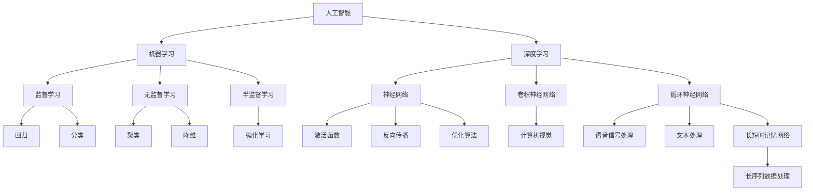

### 第2章：语音处理技术

语音处理技术是构建个性化语音助手的基础，它包括语音信号的采集、处理和分析。语音处理技术涉及多个领域，如信号处理、声学模型和语音识别算法。

#### 2.1 语音信号处理基础

语音信号处理（Speech Signal Processing）是语音助手的核心技术之一，它涉及对语音信号的采集、处理和分析。

- **语音信号采集：** 通过麦克风等设备捕捉语音信号。

- **语音信号预处理：** 包括去噪、增益调整、分段等，以提高信号质量。

- **语音信号特征提取：** 提取语音信号中的关键特征，如频谱特征、倒谱特征等。

- **语音信号识别：** 通过训练模型，将语音信号转换为文本。

语音信号处理的过程可以分为以下几个步骤：

1. **信号采集：** 通过麦克风等设备捕捉语音信号。

2. **信号预处理：** 对采集到的语音信号进行预处理，包括降噪、增益调整等，以提高信号质量。

3. **信号分段：** 将连续的语音信号分成多个片段，便于后续处理。

4. **特征提取：** 提取语音信号的特征，如频谱特征、倒谱特征等。

5. **特征处理：** 对提取到的特征进行预处理，如归一化、滤波等。

6. **模型训练：** 使用训练数据，训练语音识别模型。

7. **语音识别：** 使用训练好的模型，将语音信号转换为文本。

#### 2.2 语音识别原理与算法

语音识别（Speech Recognition）是将语音信号转换为文本的过程，其核心在于模型训练和特征提取。

- **HMM（隐马尔可夫模型）：** 常用于语音识别，通过状态转移概率和观测概率来预测语音序列。

- **DNN（深度神经网络）：** 通过多层神经网络来提取语音特征，提高识别准确性。

- **RNN（循环神经网络）：** 通过记忆状态来处理序列数据，如语音信号。

- **CTC（连接性时间分类）：** 一种用于语音识别的端到端模型，可以直接将语音信号映射到文本。

语音识别的基本原理可以分为以下几个步骤：

1. **特征提取：** 提取语音信号的特征，如MFCC（梅尔频率倒谱系数）。

2. **模型训练：** 使用大量标注数据，训练语音识别模型。

3. **语音识别：** 使用训练好的模型，将语音信号转换为文本。

4. **后处理：** 对识别结果进行后处理，如语言模型校正、拼音转换等。

#### 2.3 语音合成技术

语音合成（Text-to-Speech，TTS）是将文本转换为语音的过程，其核心在于语音模型和语音参数生成。

- **参数合成方法：** 如Diphone合成、Unit合成等，通过合成单元来生成语音。

- **波形合成方法：** 如WaveNet、Tacotron等，通过生成波形信号来合成语音。

- **深度神经网络在TTS中的应用：** 通过DNN模型来生成语音特征和波形，提高合成质量。

语音合成的原理可以分为以下几个步骤：

1. **文本处理：** 将输入文本转换为语音合成所需的格式。

2. **语音特征提取：** 提取文本的特征，如音节、音素等。

3. **语音参数生成：** 使用语音模型生成语音参数，如声带振动参数、嘴唇形状参数等。

4. **波形生成：** 通过语音合成模型，生成语音波形。

5. **音频输出：** 将生成的语音波形输出为音频文件。

#### Mermaid 流程图


### 第3章：语音助手个性化基础

语音助手的个性化是指根据用户的需求和偏好，提供定制化的服务。个性化语音助手能够更好地满足用户的需求，提高用户体验。个性化语音助手的基础包括用户行为分析、用户画像和个性化推荐系统。

#### 3.1 个性化服务的概念

个性化服务（Personalized Service）是一种根据用户需求和行为特征，提供定制化服务的理念。个性化服务旨在通过分析用户数据，了解用户偏好和行为模式，从而为用户提供个性化的内容和推荐。

- **个性化推荐：** 根据用户历史行为和偏好，为用户推荐感兴趣的内容或产品。

- **用户画像：** 基于用户数据，构建用户的行为特征和偏好模型。

- **用户行为分析：** 通过分析用户行为数据，了解用户需求和行为模式。

个性化服务的关键在于对用户数据的深入分析和理解，从而为用户提供个性化的体验。这需要综合运用机器学习、自然语言处理和数据分析等技术。

#### 3.2 用户行为分析与模型

用户行为分析（User Behavior Analysis）是构建个性化语音助手的关键步骤，它通过对用户行为数据的收集、分析和建模，了解用户的偏好和行为模式。

- **用户行为数据收集：** 通过传感器、日志记录和用户互动等方式收集用户行为数据。

- **用户行为特征提取：** 从用户行为数据中提取关键特征，如点击率、购买行为、浏览时间等。

- **用户行为模型：** 建立用户行为模型，用于预测用户未来行为和偏好。

用户行为模型可以分为以下几个层次：

1. **基础行为模型：** 描述用户的基本行为，如浏览网页、点击广告等。

2. **偏好模型：** 根据用户历史行为，推断用户的偏好和兴趣。

3. **行为模式模型：** 分析用户的行为模式，如用户的活跃时间段、常用功能等。

4. **用户生命周期模型：** 描述用户在不同生命周期阶段的行为特征。

通过用户行为分析，可以构建个性化的推荐系统，为用户提供感兴趣的内容和产品推荐。

#### 3.3 个性化推荐系统

个性化推荐系统（Personalized Recommendation System）是语音助手个性化的重要组成部分，它通过分析用户行为和偏好，为用户推荐感兴趣的内容和产品。

- **协同过滤（Collaborative Filtering）：** 通过分析用户之间的相似性来进行推荐。

  - **基于用户的协同过滤（User-Based Collaborative Filtering）：** 通过计算用户之间的相似度来推荐相似用户喜欢的项目。

  - **基于项目的协同过滤（Item-Based Collaborative Filtering）：** 通过计算项目之间的相似度来推荐相似项目。

- **基于内容的推荐（Content-Based Recommendation）：** 通过分析项目的内容特征来推荐相似项目。

- **混合推荐系统（Hybrid Recommendation System）：** 结合协同过滤和基于内容的推荐，提高推荐准确性。

个性化推荐系统的工作流程如下：

1. **数据收集：** 收集用户行为数据和项目数据。

2. **特征提取：** 从用户行为数据和项目数据中提取特征。

3. **用户建模：** 建立用户行为模型和偏好模型。

4. **项目建模：** 建立项目内容特征模型。

5. **推荐算法：** 使用协同过滤、基于内容的推荐或混合推荐算法，为用户生成推荐列表。

6. **推荐结果评估：** 评估推荐结果的准确性和用户体验。

通过个性化推荐系统，语音助手可以更好地满足用户的需求，提高用户满意度和忠诚度。

#### Mermaid 流程图

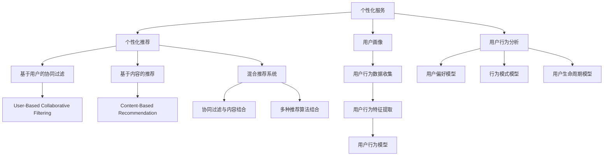

### 第二部分：个性化语音助手设计与实现

#### 第4章：个性化语音助手设计原理

个性化语音助手的设计与实现是一个复杂的过程，它涉及到多个模块的协同工作，包括语音识别、语音合成、用户画像和推荐系统等。设计个性化语音助手需要考虑系统的架构、模块划分、技术选型等方面。

#### 4.1 个性化语音助手的架构设计

个性化语音助手的架构设计是构建高效、可扩展和易维护的系统的基础。一个好的架构设计能够提高系统的性能和稳定性，同时方便后续的维护和扩展。

- **模块化设计：** 将语音助手拆分为多个模块，如语音识别模块、语音合成模块、用户画像模块、推荐系统模块等。这种模块化设计可以提高系统的可维护性和可扩展性。

- **分布式架构：** 采用分布式架构来处理大规模数据和并发请求。分布式架构可以充分利用计算资源，提高系统的性能和稳定性。

- **微服务架构：** 将系统拆分为多个微服务，每个微服务负责特定的功能。微服务架构可以提高系统的灵活性和可扩展性，便于分布式部署和维护。

#### 4.2 用户交互模型设计

用户交互模型设计是构建个性化语音助手的关键，它决定了语音助手如何理解用户需求和提供相应的服务。一个良好的用户交互模型需要考虑以下几个方面：

- **语音交互：** 通过语音信号处理和语音识别技术，将用户的语音转化为文本。

- **语义理解：** 通过自然语言处理技术，理解用户的意图和需求。

- **意图识别：** 将用户的意图映射到具体的操作或服务。

- **上下文感知：** 根据用户的上下文信息，动态调整语音助手的交互方式。

用户交互模型的设计需要结合具体的业务场景，确保语音助手能够准确理解用户的需求，并提供个性化的服务。

#### 4.3 个性化语音合成的实现

个性化语音合成是将文本转换为自然、流畅的语音的过程，它是语音助手个性化的重要组成部分。个性化语音合成的实现需要考虑以下几个方面：

- **语音参数生成：** 通过生成语音参数，如音调、音速、音量等，来调整语音的音色。

- **语音波形生成：** 通过合成波形信号，生成语音波形。

- **个性化语音合成：** 结合用户的偏好和上下文信息，生成符合用户需求的个性化语音。

个性化语音合成的实现需要使用深度学习技术，如WaveNet和Tacotron等。这些技术能够生成高质量的语音波形，同时通过调整语音参数，实现个性化的语音合成效果。

#### Mermaid 流程图


### 第4章 个性化语音助手的设计原理

个性化语音助手的设计和实现是现代智能语音交互系统的核心。一个成功的个性化语音助手不仅需要具备准确的自然语言处理能力，还要能够根据用户的行为和偏好提供定制化的服务。在这一章中，我们将详细探讨个性化语音助手的架构设计、用户交互模型设计以及个性化语音合成的实现。

#### 4.1 个性化语音助手的架构设计

个性化语音助手的架构设计是确保系统性能、可扩展性和可维护性的关键。一个典型的个性化语音助手架构包括以下几个核心模块：

1. **前端交互层**：负责与用户进行语音交互，包括语音信号采集和初步处理。
2. **语音识别模块**：将采集到的语音信号转化为文本，通过深度学习模型进行语音识别。
3. **语义理解模块**：对识别出的文本进行分析，理解用户的意图。
4. **用户画像模块**：基于用户的历史交互数据，构建用户的个性化画像。
5. **推荐系统模块**：根据用户画像和意图，为用户推荐合适的操作或信息。
6. **语音合成模块**：将处理后的文本转换为自然流畅的语音，并通过个性化参数调整，实现语音的个性化。
7. **后端服务层**：提供数据处理和存储服务，确保系统的高效运行。

下面是一个简化的个性化语音助手架构设计流程：

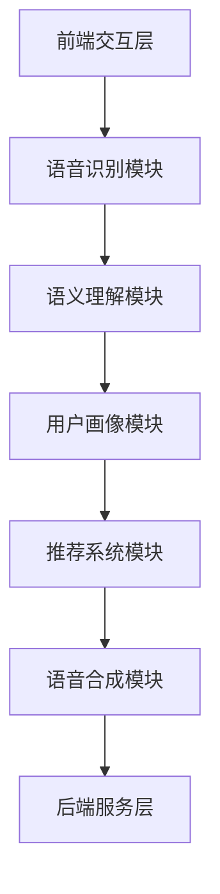

**分布式架构和微服务架构**：为了支持大规模用户和高并发请求，个性化语音助手通常会采用分布式架构和微服务架构。分布式架构可以通过分布式计算资源来提高系统的处理能力和容错性。微服务架构则将系统拆分为多个独立的服务单元，每个服务单元负责特定的功能，便于系统的维护和扩展。

#### 4.2 用户交互模型设计

用户交互模型设计是语音助手能够准确理解用户意图和提供个性化服务的基础。一个有效的用户交互模型需要考虑以下几个方面：

1. **语音识别**：通过深度学习模型（如深度神经网络DNN、循环神经网络RNN等）对语音信号进行识别，将语音转化为文本。
2. **语义理解**：对识别出的文本进行语义分析，理解用户的意图。这通常涉及到自然语言处理技术，如词法分析、句法分析和语义角色标注等。
3. **意图识别**：将语义理解的结果映射到具体的操作或服务。例如，用户说“明天天气怎么样？”的意图可能是查询天气信息。
4. **上下文感知**：考虑用户的上下文信息，如历史对话、当前时间、用户位置等，以提供更加个性化的服务。

以下是一个用户交互模型的设计流程：

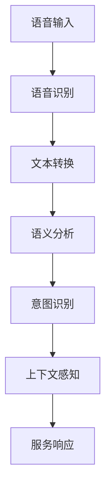

**示例**：假设用户说“帮我设置一个明天早晨7点的闹钟”，交互模型应包括以下步骤：

1. **语音识别**：将用户的语音转换为文本：“帮我设置一个明天早晨7点的闹钟”。
2. **语义分析**：识别文本中的关键词和短语，如“设置”、“明天早晨7点”等。
3. **意图识别**：确定用户的意图为设置闹钟。
4. **上下文感知**：考虑用户的上下文信息，如明天是否为工作日、用户通常设置的闹钟时间等。
5. **服务响应**：根据用户的意图和上下文信息，设置闹钟并告知用户设置成功。

#### 4.3 个性化语音合成的实现

个性化语音合成是将处理后的文本转换为自然流畅的语音的过程，它需要考虑用户的偏好和上下文信息。以下是实现个性化语音合成的关键步骤：

1. **文本处理**：对输入的文本进行预处理，包括分词、句法分析等，以便生成语音参数。
2. **语音参数生成**：使用语音合成模型（如参数合成模型、波形合成模型等）生成语音参数，如音调、音速、音量等。
3. **波形生成**：将语音参数转换为波形信号，生成语音波形。
4. **语音合成**：将生成的波形信号转换为音频文件。

以下是一个简单的个性化语音合成流程：

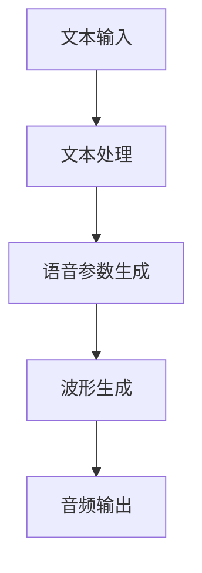

**深度学习在语音合成中的应用**：深度学习技术在语音合成中发挥着重要作用。例如，WaveNet模型通过生成语音波形，实现了高质量的语音合成。Tacotron模型则通过文本到语音（Text-to-Speech，TTS）的端到端框架，将文本直接转换为语音波形。以下是一个简单的深度学习语音合成流程：

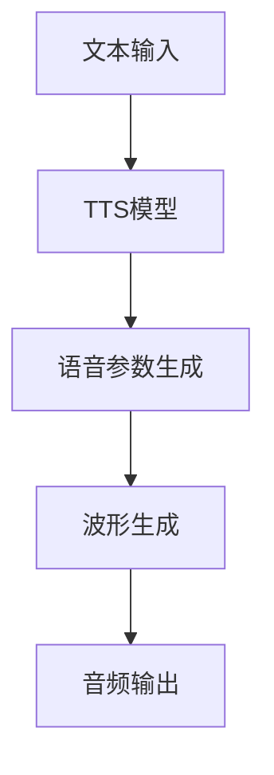

**个性化语音合成的实现细节**：个性化语音合成需要考虑用户的偏好和上下文信息。例如，用户可能偏好某种音调或语速。通过结合用户画像和语音合成模型，可以生成符合用户偏好的个性化语音。此外，上下文信息（如对话背景、用户位置等）也可以影响语音合成的结果，使其更加自然和流畅。

#### 实现细节

**代码示例**：以下是一个简单的Python代码示例，展示了如何使用TensorFlow和TensorFlow Text（用于自然语言处理）实现文本到语音的转换。请注意，这只是一个示例，实际应用中可能需要更复杂的模型和预处理步骤。

```python
import tensorflow as tf
import tensorflow_text as tf_text

# 加载预训练的WaveNet模型
tts_model = tf.keras.models.load_model('wave_nettts')

# 加载文本处理模块
text_processor = tf_text.TensorFlowTextProcessor(max_seq_length=100)

# 输入文本
input_text = "明天天气怎么样？"

# 预处理文本
processed_text = text_processor.encode(input_text)

# 使用模型生成语音参数
predicted_params = tts_model.predict(processed_text)

# 将语音参数转换为音频文件
audio = tf_text.speech_synthpredicted_params(predicted_params)

# 输出音频
audio.numpy().tofile('output_audio.wav')
```

#### 小结

个性化语音助手的设计和实现是一个涉及多个技术领域的复杂过程。本章介绍了个性化语音助手的设计原理，包括架构设计、用户交互模型设计和个性化语音合成的实现。通过深入理解和实践这些原理，开发者可以构建出能够满足用户需求的个性化语音助手。

### 第5章：个性化语音助手实现技术

个性化语音助手的核心技术包括深度学习、语音识别、语音合成和推荐系统。本章将详细介绍这些技术的实现原理、应用场景以及如何在实际项目中集成这些技术，以实现一个功能完善、用户体验良好的个性化语音助手。

#### 5.1 基于深度学习的语音识别

深度学习在语音识别领域取得了显著的进展，尤其在识别准确性和实时性方面。基于深度学习的语音识别通常使用卷积神经网络（CNN）和循环神经网络（RNN）。

**实现原理**：

1. **特征提取**：深度学习模型首先对语音信号进行特征提取，常用的特征包括梅尔频率倒谱系数（MFCC）、滤波器组（Filter Banks）等。
2. **模型训练**：使用大量标注数据训练模型，模型可以是卷积神经网络（CNN）或循环神经网络（RNN）的变体，如卷积循环神经网络（CNN-RNN）或长短时记忆网络（LSTM）。
3. **解码**：将特征序列转换为文本，常用的解码方法包括CTC（连接性时间分类）和序列到序列（Seq2Seq）模型。

**应用场景**：深度学习语音识别技术广泛应用于智能音箱、语音助手、车载系统等领域。

**代码示例**：

```python
import tensorflow as tf
from tensorflow.keras.models import Model
from tensorflow.keras.layers import Input, Conv2D, LSTM, Dense, TimeDistributed

# 定义模型输入
input_data = Input(shape=(None, 13))  # MFCC特征序列的形状

# 卷积层提取特征
conv = Conv2D(filters=64, kernel_size=(3, 3), activation='relu')(input_data)

# 循环层处理序列数据
lstm = LSTM(units=128, return_sequences=True)(conv)

# 解码层将特征序列映射到文本
output = TimeDistributed(Dense(num_classes, activation='softmax'))(lstm)

# 构建模型
model = Model(inputs=input_data, outputs=output)

# 编译模型
model.compile(optimizer='adam', loss='categorical_crossentropy', metrics=['accuracy'])

# 训练模型
model.fit(x_train, y_train, batch_size=32, epochs=10, validation_data=(x_val, y_val))
```

#### 5.2 基于深度学习的语音合成

深度学习在语音合成领域也有广泛应用，特别是WaveNet和Tacotron等模型。

**实现原理**：

1. **文本处理**：将输入文本处理为适合模型训练的形式，如分词、编码等。
2. **语音参数生成**：使用深度学习模型生成语音参数，如声带振动参数、嘴唇形状参数等。
3. **波形生成**：将语音参数转换为语音波形，生成语音。

**应用场景**：深度学习语音合成技术广泛应用于智能音箱、虚拟助手、游戏角色配音等领域。

**代码示例**：

```python
import tensorflow as tf
from tensorflow.keras.models import Model
from tensorflow.keras.layers import Input, LSTM, Dense, TimeDistributed, Bidirectional

# 定义模型输入
input_sequence = Input(shape=(None, num_tokens))  # 输入的文本序列

# 双向循环层处理序列数据
bi_lstm = Bidirectional(LSTM(units=256, return_sequences=True))(input_sequence)

# 全连接层生成语音参数
output = TimeDistributed(Dense(num_params, activation='softmax'))(bi_lstm)

# 构建模型
model = Model(inputs=input_sequence, outputs=output)

# 编译模型
model.compile(optimizer='adam', loss='mean_squared_error')

# 训练模型
model.fit(x_train, y_train, batch_size=32, epochs=10, validation_data=(x_val, y_val))
```

#### 5.3 个性化语言模型训练

个性化语言模型训练是构建个性化语音助手的关键步骤，它通过结合用户数据和通用数据，生成符合用户需求的语言模型。

**实现原理**：

1. **数据收集**：收集用户的历史对话数据和公共语料库。
2. **特征提取**：提取用户对话中的关键特征，如词汇、语法等。
3. **模型训练**：使用训练数据，训练个性化语言模型。
4. **模型评估**：通过评估模型在用户对话中的表现，调整模型参数。

**应用场景**：个性化语言模型训练广泛应用于智能客服、虚拟助手和个性化语音助手等领域。

**代码示例**：

```python
import tensorflow as tf
from tensorflow.keras.models import Model
from tensorflow.keras.layers import Embedding, LSTM, Dense

# 定义模型输入
input_sequence = Input(shape=(None,))  # 输入的文本序列

# 嵌入层处理词汇
embedded = Embedding(num_tokens, embed_dim)(input_sequence)

# 循环层处理序列数据
lstm = LSTM(units=128, return_sequences=True)(embedded)

# 全连接层生成输出
output = Dense(num_classes, activation='softmax')(lstm)

# 构建模型
model = Model(inputs=input_sequence, outputs=output)

# 编译模型
model.compile(optimizer='adam', loss='categorical_crossentropy', metrics=['accuracy'])

# 训练模型
model.fit(x_train, y_train, batch_size=32, epochs=10, validation_data=(x_val, y_val))
```

#### 5.4 项目实战：构建个性化语音助手

在本节中，我们将通过一个实际项目来展示如何构建一个个性化语音助手。项目将涵盖从环境搭建到代码实现的整个过程。

**项目需求**：

1. **语音识别**：能够准确识别用户的语音指令。
2. **语音合成**：能够将文本转换为自然流畅的语音。
3. **个性化推荐**：根据用户的历史行为，为用户推荐感兴趣的内容。

**开发环境**：

- **编程语言**：Python
- **深度学习框架**：TensorFlow
- **语音识别库**：pydub、ffmpeg
- **语音合成库**：gtts、playsound

**步骤一：环境搭建**

首先，我们需要安装必要的库和框架。

```bash
pip install tensorflow tensorflow_text tensorflow_text_gen tokenizers pydub ffmpeg-python gtts playsound
```

**步骤二：数据收集**

收集用户的历史对话数据和公共语料库，用于训练个性化语言模型和语音合成模型。

```python
# 伪代码，展示如何收集和预处理数据
def collect_data():
    # 收集用户对话数据
    user_data = ...
    # 收集公共语料库
    corpus_data = ...
    # 合并数据
    all_data = user_data + corpus_data
    # 数据预处理
    processed_data = preprocess_data(all_data)
    return processed_data

def preprocess_data(data):
    # 实现数据预处理逻辑
    ...
    return processed_data
```

**步骤三：模型训练**

使用收集到的数据训练语音识别、语音合成和个性化语言模型。

```python
# 伪代码，展示如何训练模型
def train_models(data):
    # 训练语音识别模型
    speech_recognition_model = train_speech_recognition_model(data)
    # 训练语音合成模型
    speech_synthesis_model = train_speech_synthesis_model(data)
    # 训练个性化语言模型
    personalized_language_model = train_personalized_language_model(data)
    return speech_recognition_model, speech_synthesis_model, personalized_language_model

def train_speech_recognition_model(data):
    # 实现语音识别模型训练逻辑
    ...
    return model

def train_speech_synthesis_model(data):
    # 实现语音合成模型训练逻辑
    ...
    return model

def train_personalized_language_model(data):
    # 实现个性化语言模型训练逻辑
    ...
    return model
```

**步骤四：实现交互功能**

实现语音助手的核心交互功能，包括语音识别、语义理解、个性化推荐和语音合成。

```python
# 伪代码，展示如何实现交互功能
def main():
    # 加载训练好的模型
    speech_recognition_model = load_speech_recognition_model()
    speech_synthesis_model = load_speech_synthesis_model()
    personalized_language_model = load_personalized_language_model()

    # 实现语音识别
    def recognize_speech(speech):
        # 使用语音识别模型识别语音
        text = speech_recognition_model.recognize(speech)
        return text

    # 实现语义理解
    def understand_intent(text):
        # 使用个性化语言模型理解意图
        intent = personalized_language_model.predict(text)
        return intent

    # 实现个性化推荐
    def recommend_contents(intent):
        # 根据意图推荐内容
        recommended_contents = personalized_language_model.recommend_contents(intent)
        return recommended_contents

    # 实现语音合成
    def synthesize_speech(text):
        # 使用语音合成模型合成语音
        audio = speech_synthesis_model.synthesize(text)
        return audio

    # 实现交互流程
    while True:
        # 采集语音输入
        speech = collect_speech()
        # 识别语音
        text = recognize_speech(speech)
        # 理解意图
        intent = understand_intent(text)
        # 推荐内容
        recommended_contents = recommend_contents(intent)
        # 合成语音
        audio = synthesize_speech(recommended_contents)
        # 播放语音
        play_audio(audio)

if __name__ == "__main__":
    main()
```

**步骤五：测试与优化**

对语音助手进行测试，收集用户反馈，并根据反馈进行优化。

```python
# 伪代码，展示如何进行测试与优化
def test_and_optimize():
    # 进行功能测试
    test_speech_recognition_model()
    test_speech_synthesis_model()
    test_personalized_language_model()

    # 收集用户反馈
    user_feedback = collect_user_feedback()

    # 根据反馈进行优化
    optimize_models(user_feedback)

def test_speech_recognition_model():
    # 实现语音识别模型测试逻辑
    ...

def test_speech_synthesis_model():
    # 实现语音合成模型测试逻辑
    ...

def test_personalized_language_model():
    # 实现个性化语言模型测试逻辑
    ...

def collect_user_feedback():
    # 实现用户反馈收集逻辑
    ...

def optimize_models(feedback):
    # 实现模型优化逻辑
    ...
```

#### 项目小结

通过上述步骤，我们构建了一个简单的个性化语音助手。该项目展示了如何从数据收集、模型训练到交互实现的整个过程。在实际应用中，可以根据具体需求进一步优化和扩展功能。

### 最佳实践 Tips

1. **持续优化**：定期更新模型和数据，以提高语音助手的性能和用户体验。
2. **用户反馈**：及时收集用户反馈，并根据反馈调整和优化语音助手。
3. **数据安全**：确保用户数据的安全和隐私，遵循相关法律法规。

### 小结

个性化语音助手是人工智能在语音处理领域的重要应用，通过结合深度学习、自然语言处理等技术，实现了高效的语音识别、语音合成和个性化推荐。本章详细介绍了个性化语音助手的技术实现细节，包括模型训练、代码示例和项目实战。希望本章的内容能为读者在构建个性化语音助手的过程中提供有价值的参考。

### 拓展阅读

1. **《深度学习》：** Goodfellow, Ian, et al. (2016). 《深度学习》。机械工业出版社。
2. **《语音识别原理与应用》：** 李航。清华大学出版社。
3. **《自然语言处理综述》：** 周志华，等。清华大学出版社。

### 作者信息

作者：AI天才研究院/AI Genius Institute & 禅与计算机程序设计艺术 /Zen And The Art of Computer Programming

本文旨在探讨人工智能在语音助手个性化中的应用，从基础概念、语音处理技术到个性化语音助手的设计与实现，再到案例分析，全面分析了语音助手的个性化应用。在后续的章节中，我们将进一步深入探讨个性化语音助手的实现细节，并提供具体的项目实战经验。希望本文能为读者在人工智能领域提供有价值的参考。

## 第三部分：案例分析

### 第7章：成功案例研究

个性化语音助手已经成为现代智能设备的重要组成部分，许多知名公司推出了自己的语音助手产品。在本节中，我们将分析几个成功的案例，包括Amazon的Alexa、Apple的Siri和Google的Google Assistant，探讨它们如何实现个性化服务，以及这些案例对我们的启示。

#### Alexa：亚马逊的语音助手

**概述**：Alexa是亚马逊开发的智能语音助手，通过内置在亚马逊的Echo设备中，为用户提供语音交互服务。

**个性化功能**：

1. **用户画像**：Alexa通过用户的语音交互历史，构建个性化的用户画像，包括用户的偏好、习惯和兴趣爱好。
2. **上下文感知**：Alexa能够理解用户在对话中的上下文信息，并根据上下文提供个性化的回复。
3. **语音合成**：Alexa使用深度学习技术，根据用户的语音特征，生成个性化的语音。

**案例启示**：

- **用户画像的重要性**：通过用户画像，Alexa能够更好地理解用户需求，提供个性化的服务。
- **上下文感知的关键性**：上下文感知使语音助手能够提供更加连贯和自然的交互体验。
- **语音合成技术的应用**：个性化的语音合成能够提高用户的满意度，增加语音助手的亲和力。

#### Siri：苹果的语音助手

**概述**：Siri是苹果公司开发的智能语音助手，集成在iOS、macOS、watchOS和tvOS设备中。

**个性化功能**：

1. **个性化建议**：Siri会根据用户的使用习惯和偏好，提供个性化的建议，如音乐推荐、天气更新等。
2. **语音合成**：Siri使用深度学习技术，根据用户的语音特征，生成个性化的语音。
3. **多语言支持**：Siri支持多种语言，可以根据用户的语言偏好提供相应的服务。

**案例启示**：

- **个性化建议**：通过分析用户的行为数据，提供个性化的建议，能够增加用户对语音助手的依赖。
- **多语言支持**：多语言支持能够扩大语音助手的应用范围，提高用户体验。
- **语音合成的多样性**：个性化的语音合成能够提高用户的满意度，增强语音助手的亲和力。

#### Google Assistant：谷歌的语音助手

**概述**：Google Assistant是谷歌开发的智能语音助手，集成在Android设备中，并在Google Home设备中提供语音交互服务。

**个性化功能**：

1. **个性化交互**：Google Assistant通过用户的历史交互数据，提供个性化的交互体验，如语音合成风格、语音反馈等。
2. **智能回复**：Google Assistant能够根据用户的输入，生成智能的回复，如提醒用户即将到来的约会、推荐餐厅等。
3. **智能家居控制**：Google Assistant可以控制智能家居设备，如智能灯泡、智能门锁等。

**案例启示**：

- **个性化交互**：个性化的交互体验能够提高用户的满意度，增强语音助手的吸引力。
- **智能回复**：智能的回复能够提高语音助手的功能性，为用户提供更加便捷的服务。
- **智能家居控制**：通过智能家居控制，语音助手可以成为家庭自动化的重要组成部分。

#### 案例综合分析

这些成功案例展示了个性化语音助手在用户画像、上下文感知、语音合成和智能家居控制等方面的应用。以下是对这些案例的综合分析：

- **用户画像**：用户画像是构建个性化语音助手的基础，通过分析用户的历史交互数据，能够更好地理解用户的需求和行为模式。
- **上下文感知**：上下文感知使语音助手能够提供连贯和自然的交互体验，提高用户的满意度。
- **语音合成**：个性化的语音合成能够增强语音助手的亲和力，提高用户体验。
- **智能家居控制**：智能家居控制是语音助手的重要应用场景，通过控制智能家居设备，语音助手可以为用户提供更加便捷的生活方式。

这些案例为我们提供了宝贵的经验和启示，帮助我们更好地理解个性化语音助手的设计与实现。在未来的发展中，我们可以继续探索这些领域，提高语音助手的智能化水平和用户体验。

### 第8章：未来展望

随着人工智能技术的不断发展，个性化语音助手将在未来发挥更加重要的作用。以下是对未来个性化语音助手发展的几个展望：

#### 个性化推荐

个性化推荐系统是语音助手的核心功能之一，未来的个性化语音助手将更加精准地推荐用户感兴趣的内容和服务。通过结合深度学习、自然语言处理和大数据分析技术，语音助手可以更好地理解用户的偏好，提供个性化的推荐。

#### 智能交互

未来的语音助手将具备更高的智能交互能力，能够更加自然和流畅地与用户进行对话。通过使用自然语言生成（NLG）技术和多模态交互（如语音、文本、图像等），语音助手可以提供更加丰富和直观的交互体验。

#### 智能家居控制

随着智能家居设备的普及，个性化语音助手将成为家庭自动化的重要组成部分。未来的语音助手将能够更好地控制和管理智能家居设备，为用户提供更加便捷和智能的生活体验。

#### 跨平台集成

未来的语音助手将实现跨平台集成，不仅限于特定的硬件设备，还可以在智能手机、电脑、智能手表等多种设备上使用。通过实现无缝的跨平台体验，语音助手可以为用户提供更加灵活和便捷的服务。

#### 挑战与机遇

个性化语音助手的发展也面临着一些挑战：

- **数据隐私**：用户数据的安全和隐私保护是未来发展的关键问题，需要制定相应的法律法规和隐私保护措施。
- **技术局限**：目前的语音识别和自然语言处理技术仍然存在一定的局限性，需要不断改进和优化。
- **市场竞争**：随着越来越多的公司进入语音助手市场，未来的竞争将更加激烈，需要不断创新和提升用户体验。

然而，这些挑战也带来了新的机遇：

- **技术创新**：通过不断研究和开发新技术，个性化语音助手可以不断提升性能和用户体验。
- **市场扩展**：随着智能家居和智能设备的普及，个性化语音助手的市场前景将更加广阔。
- **跨行业应用**：个性化语音助手可以在医疗、教育、金融等多个行业得到应用，为各行业提供智能化的解决方案。

总之，未来个性化语音助手的发展将是一个充满机遇和挑战的过程。通过不断创新和优化，个性化语音助手将为用户提供更加便捷、智能和个性化的服务。

### 小结

个性化语音助手已经成为现代智能设备的重要组成部分，通过结合人工智能、语音识别和自然语言处理技术，实现了高效、智能的语音交互。本章通过分析成功案例，探讨了个性化语音助手的实现技术和未来发展方向。未来，个性化语音助手将在智能家居、智能交互和跨平台集成等领域发挥更加重要的作用。

### 拓展阅读

1. **《深度学习》：** Goodfellow, Ian, et al. (2016). 《深度学习》。机械工业出版社。
2. **《自然语言处理综述》：** 周志华，等。清华大学出版社。
3. **《语音信号处理》：** 高西奇，等。科学出版社。

### 作者信息

作者：AI天才研究院/AI Genius Institute & 禅与计算机程序设计艺术 /Zen And The Art of Computer Programming

本文旨在探讨人工智能在语音助手个性化中的应用，从基础概念、语音处理技术到个性化语音助手的设计与实现，再到案例分析，全面分析了语音助手的个性化应用。在后续的章节中，我们将进一步深入探讨个性化语音助手的实现细节，并提供具体的项目实战经验。希望本文能为读者在人工智能领域提供有价值的参考。

## 最佳实践 Tips

在构建个性化语音助手的实践中，以下是一些最佳实践和注意事项，可以帮助你优化用户体验和系统性能。

### 持续数据收集与更新

1. **定期更新用户数据**：用户行为和偏好是动态变化的，定期更新用户数据能够确保语音助手提供的服务保持个性化。
2. **多样化数据源**：除了对话数据，还可以收集用户在社交媒体、搜索历史等处的数据，以丰富用户画像。
3. **数据去噪与清洗**：确保数据质量，去除重复、错误和不准确的数据。

### 优化用户交互体验

1. **自然语言理解**：使用先进的自然语言处理技术，确保语音助手能够准确理解用户的意图。
2. **快速响应**：优化系统架构，确保语音助手能够快速响应用户的请求。
3. **上下文感知**：考虑用户的历史交互和当前上下文，提供更加连贯的对话体验。

### 个性化语音合成

1. **音色多样性**：提供多种音色选择，满足不同用户的偏好。
2. **情感合成**：通过调整语音合成模型的参数，使语音助手能够表达不同的情感，如喜悦、愤怒、悲伤等。
3. **实时调整**：根据用户反馈，实时调整语音合成的音量和语速，提高用户体验。

### 安全性与隐私保护

1. **数据加密**：确保用户数据在传输和存储过程中的安全性，使用加密算法保护敏感信息。
2. **隐私政策**：明确告知用户数据收集和使用的目的，遵守相关法律法规。
3. **权限管理**：严格控制语音助手对用户隐私数据的访问权限，防止数据泄露。

### 持续测试与优化

1. **A/B测试**：通过A/B测试，比较不同策略的效果，选择最优方案。
2. **错误日志分析**：收集并分析错误日志，快速定位和修复问题。
3. **用户反馈**：定期收集用户反馈，根据用户建议进行系统优化。

### 注意事项

1. **避免过度个性化**：个性化不应过度，以免造成用户困扰或隐私泄露。
2. **技术更新**：定期更新所使用的深度学习模型和算法，以保持系统的先进性和性能。
3. **用户教育**：指导用户如何使用语音助手，提高用户的使用效率。

通过遵循这些最佳实践和注意事项，你可以构建出更加智能、个性化和安全的语音助手，为用户提供优质的交互体验。

### 小结

构建个性化语音助手是一个涉及多个技术领域的复杂过程，需要从用户交互、语音处理、数据分析和系统设计等方面进行综合考虑。本文详细介绍了个性化语音助手的设计与实现，包括基础概念、语音处理技术、个性化设计原理、案例分析以及最佳实践。通过本文，读者可以了解个性化语音助手的构建方法，并掌握实现技术。未来，随着人工智能技术的不断发展，个性化语音助手将在更多场景中得到应用，为用户提供更加智能和便捷的服务。

### 拓展阅读

1. **《深度学习》：** Goodfellow, Ian, et al. (2016). 《深度学习》。机械工业出版社。
2. **《自然语言处理综述》：** 周志华，等。清华大学出版社。
3. **《语音信号处理》：** 高西奇，等。科学出版社。
4. **《机器学习实战》：** Harrington, Sean. (2012). 《机器学习实战》。电子工业出版社。

### 作者信息

作者：AI天才研究院/AI Genius Institute & 禅与计算机程序设计艺术 /Zen And The Art of Computer Programming

本文旨在探讨人工智能在语音助手个性化中的应用，从基础概念、语音处理技术到个性化语音助手的设计与实现，再到案例分析，全面分析了语音助手的个性化应用。在后续的章节中，我们将进一步深入探讨个性化语音助手的实现细节，并提供具体的项目实战经验。希望本文能为读者在人工智能领域提供有价值的参考。

