                 

### 第1章：人工智能与自然交互概述

#### 1.1 人工智能的发展历程

人工智能（AI）的起源可以追溯到20世纪50年代，当时科学家们首次提出了“智能机器”的概念。经过几十年的发展，人工智能经历了多个阶段：

1. **符号人工智能**：20世纪50年代至70年代，基于逻辑推理和符号表示的早期AI研究，如专家系统和知识表示。
2. **统计学习**：20世纪80年代至90年代，以统计学习理论为基础，包括决策树、支持向量机等。
3. **连接主义人工智能**：20世纪90年代至今，以神经网络和深度学习为核心，实现了AI的突破性进展。

#### 1.2 自然交互的定义与类型

自然交互是指人与机器之间使用自然语言或其他人类习惯的方式进行信息交流。常见的自然交互类型包括：

1. **语音交互**：如语音助手、语音控制系统。
2. **文本交互**：如聊天机器人、社交媒体。
3. **手势交互**：如增强现实（AR）、虚拟现实（VR）。

#### 1.3 语音助手与自然交互的关系

语音助手作为自然交互的重要实现形式，与人工智能密切相关。语音助手的核心功能是通过语音识别技术理解用户的语音指令，并通过自然语言处理技术生成合适的响应。

#### 1.4 人工智能在语音助手中的应用现状

目前，人工智能在语音助手中的应用主要体现在以下几个方面：

1. **语音识别**：使用深度学习算法提高语音识别的准确性和速度。
2. **自然语言理解**：通过语言模型和语义分析技术理解用户的需求。
3. **语音合成**：使用文本到语音（TTS）技术生成自然流畅的语音响应。

**核心概念与联系：**


**Mermaid 流程图：**

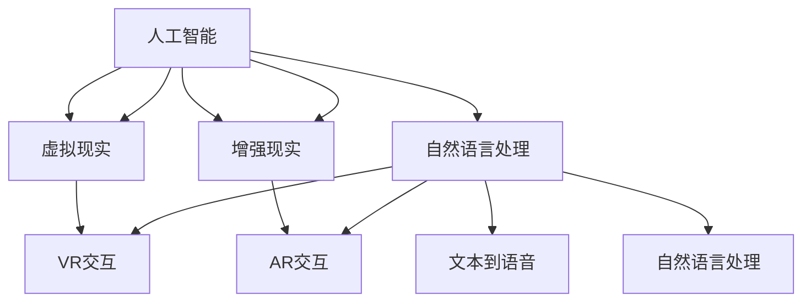

**核心算法原理讲解：**

语音识别和自然语言处理是语音助手的核心技术。语音识别利用深度学习算法，将语音信号转换为文本。自然语言处理则通过语言模型和语义分析，理解文本含义并生成响应。

**Python源代码示例：**

```python
import speech_recognition as sr

# 初始化语音识别器
recognizer = sr.Recognizer()

# 读取音频文件
with sr.AudioFile('audio_file.wav') as source:
    audio = recognizer.listen(source)

# 使用Google语音识别API进行语音识别
text = recognizer.recognize_google(audio, language='en-US')

print(text)
```

**数学模型和公式：**

语音识别中的关键数学模型是隐藏马尔可夫模型（HMM）和深度神经网络（DNN）。HMM用于建模语音信号的时间序列特征，而DNN则用于特征提取和分类。

**通俗易懂地举例说明：**

假设你想和你的智能音箱（如亚马逊Echo）进行对话，当你说出“打开灯光”时，音箱会通过麦克风捕捉你的语音，并将其转换为文本。随后，音箱使用自然语言处理技术理解你的意图，然后发送控制信号到智能灯泡，最终实现打开灯光。

**注意事项：**

- 语音助手需要处理各种方言和口音。
- 自然交互技术的准确性和流畅性还有待提高。
- 语音助手的设计需要考虑用户的隐私和数据安全。

**拓展阅读：**

- [自然语言处理：从入门到实战](https://zhuanlan.zhihu.com/p/34942676)
- [深度学习语音识别：原理与实现](https://www.deeplearning.ai/)

### 第2章：语音识别技术基础

#### 2.1 语音识别的基本概念

语音识别（Automatic Speech Recognition, ASR）是将语音信号转换为对应的文本或命令的技术。其基本概念包括：

- **语音信号**：由声波产生的信号，通常使用波形表示。
- **音频文件**：存储语音信号的文件，常见格式有WAV、MP3等。
- **语音识别引擎**：执行语音识别任务的软件组件，如Google语音识别API。

#### 2.2 语音信号处理技术

语音信号处理是语音识别的重要环节，主要包括以下几个步骤：

1. **预加重**：提高高频部分信号的增益，以补偿麦克风对高频信号的衰减。
2. **分帧**：将连续的语音信号分割为若干短时段，称为帧。
3. **加窗**：对每个帧应用窗函数，以减少帧与帧之间的重叠和间隙。

**常见窗函数**：

- **汉明窗**：
  $$ w[n] = 0.54 - 0.46 \cos\left(\frac{2\pi n}{N-1}\right) $$
  
- **汉宁窗**：
  $$ w[n] = \frac{1}{N} - \frac{2}{N}\cos\left(\frac{2\pi n}{N-1}\right) $$

#### 2.3 语音识别算法原理

语音识别算法可以分为传统方法和深度学习方法。

**传统方法**：

1. **隐马尔可夫模型（HMM）**：
   - **状态转移概率**：
     $$ P(X_t = x_t | X_{t-1} = x_{t-1}) $$
   - **输出概率**：
     $$ P(O_t = o_t | X_t = x_t) $$
   - **初始状态概率**：
     $$ P(X_0 = x_0) $$

2. **高斯混合模型（GMM）**：
   - **每个状态对应一个高斯分布**：
     $$ p(o_t | x_t) = \sum_{i=1}^C w_i \mathcal{N}(o_t; \mu_i, \Sigma_i) $$
   - **权重**：
     $$ w_i = \frac{\pi_i N_i}{N} $$
   - **混合系数**：
     $$ \pi_i = P(X_0 = x_0) $$
   - **高斯分布**：
     $$ \mathcal{N}(o_t; \mu_i, \Sigma_i) = \frac{1}{(2\pi)^{d/2} |\Sigma_i|^{1/2}} \exp \left( -\frac{1}{2} (o_t - \mu_i)^T \Sigma_i^{-1} (o_t - \mu_i) \right) $$

**深度学习方法**：

1. **卷积神经网络（CNN）**：
   - **特征提取**：
     $$ \text{conv}(x; \theta) = \sigma \left( \sum_{i=1}^C \theta_i^T x + b_i \right) $$
   - **激活函数**：
     $$ \sigma(x) = \max(0, x) $$

2. **循环神经网络（RNN）**：
   - **隐藏状态**：
     $$ h_t = \text{sigmoid}(W_h \cdot [h_{t-1}, x_t] + b_h) $$
   - **输出**：
     $$ o_t = W_o \cdot h_t + b_o $$

**常见语音识别系统架构**：

- **传统架构**：结合HMM和GMM的混合模型。
- **深度学习架构**：基于CNN或RNN的深度神经网络。

**核心概念与联系：**


**Mermaid 流程图：**

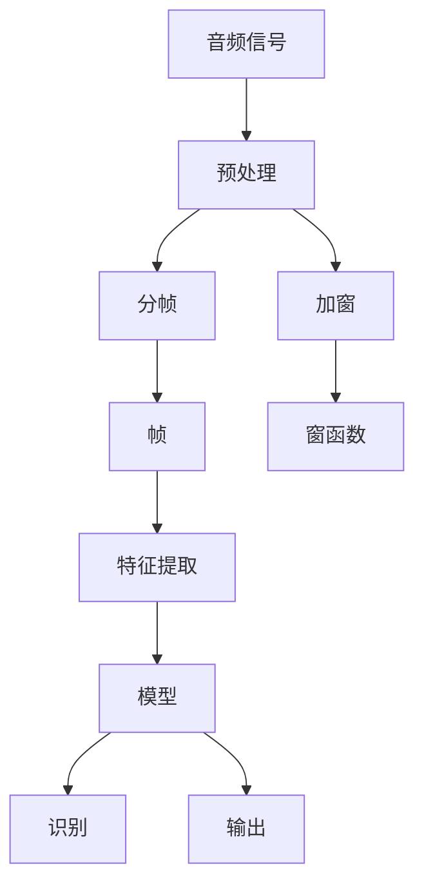

**核心算法原理讲解：**

语音识别的过程可以分为特征提取、模型训练和识别输出三个阶段。特征提取是将语音信号转换为数值特征，如MFCC（梅尔频率倒谱系数）。模型训练是使用大量语音数据训练模型参数，识别输出是模型对输入语音信号进行分类，生成文本或命令。

**Python源代码示例：**

```python
import numpy as np
from sklearn.preprocessing import normalize

# MFCC特征提取函数
def extract_mfcc(signal, nfft=512, nfilt=26, neps=1.0):
    # 计算短时傅立叶变换
    freq = np.fft.rfft(signal, nfft)
    freq = freq / (nfft // 2 + 1)
    
    # 计算频谱对数
    spec = 20 * np.log10(np.abs(freq))
    
    # 计算滤波器组响应
    filter Banks = ...  # 略
    
    # 计算MFCC系数
    mfcc = np.dot(Banks.T, spec)
    mfcc = normalize(mfcc, norm='l2', axis=1)
    
    return mfcc

# 读取音频信号
signal = np.fromfile('audio_signal.wav', dtype=np.int16)

# 提取MFCC特征
mfcc = extract_mfcc(signal)

print(mfcc)
```

**数学公式：**

1. **短时傅立叶变换（STFT）**：
   $$ X_k = \sum_{n=0}^{N-1} x[n] e^{-j 2 \pi \frac{n k}{N}} $$

2. **梅尔频率倒谱系数（MFCC）**：
   $$ \text{MFCC}_k = \sum_{m=1}^{M} a_m \cdot \text{log}(\text{FBank}_k) $$

**通俗易懂地举例说明：**

假设你想用语音控制智能音箱播放音乐，首先音箱会使用麦克风捕捉你的语音信号。然后，通过预处理步骤，如分帧和加窗，将语音信号转换为帧。接着，提取MFCC特征，用于训练语音识别模型。当收到你的语音指令后，模型会将特征与训练数据匹配，从而识别出你的语音命令，并执行相应的操作。

**注意事项：**

- 语音识别的准确性与语音质量、噪声水平等因素密切相关。
- 特征提取方法的选取会影响语音识别的性能。

**拓展阅读：**

- [语音信号处理：从入门到精通](https://www.speech.cs.cmu.edu/spellout/)
- [深度学习语音识别：原理与实践](https://github.com/jakevdp/DeepLearning-SpeechRecognition)

### 第3章：自然语言处理基础

#### 3.1 自然语言处理概述

自然语言处理（Natural Language Processing, NLP）是人工智能领域的一个重要分支，旨在让计算机理解和生成自然语言。NLP的目标包括：

- **文本分析**：分析文本结构，提取关键信息。
- **语言理解**：理解文本的含义和上下文。
- **语言生成**：生成自然流畅的文本。

#### 3.2 词嵌入技术

词嵌入（Word Embedding）是将词汇映射到高维空间中的向量表示，从而使得计算机能够处理和比较文本数据。常见的词嵌入方法包括：

1. **词袋模型（Bag of Words, BOW）**：
   - **基本思想**：将文本表示为单词的集合，不考虑单词的顺序。
   - **向量化**：将每个单词映射到一个唯一的索引，构成向量表示。

2. **词嵌入模型**：
   - **基于矩阵分解**：如Word2Vec、GloVe。
   - **基于神经网络**：如词嵌入层（Embedding Layer）在神经网络中的使用。

**数学模型**：

1. **Word2Vec**：
   - **CBOW模型**：
     $$ \text{vec}(\text{context}) \cdot \text{weight} + b $$
   - **Skip-gram模型**：
     $$ \text{vec}(\text{word}) \cdot \text{weight} + b $$

2. **GloVe**：
   - **共现矩阵**：
     $$ A_{ij} = \log \left( 1 + \text{co-occurrence}(w_i, w_j) \right) $$
   - **权重矩阵**：
     $$ \text{vec}(w_i) = \text{softmax}(A_{ij}) \odot \text{vec}(w_j) $$

#### 3.3 语言模型原理

语言模型（Language Model）是用于预测文本序列的概率分布模型。常见的语言模型包括：

1. **N元语言模型**：
   - **基本思想**：使用前n个词预测下一个词。
   - **概率计算**：
     $$ P(w_{t+1} | w_t, w_{t-1}, ..., w_{t-n+1}) $$

2. **神经网络语言模型**：
   - **循环神经网络（RNN）**：
     $$ h_t = \text{sigmoid}(W_h \cdot [h_{t-1}, x_t] + b_h) $$
   - **长短期记忆（LSTM）**：
     $$ \text{ forget\_gate } = \sigma(W_f \cdot [h_{t-1}, x_t] + b_f) $$
     $$ \text{ input\_gate } = \sigma(W_i \cdot [h_{t-1}, x_t] + b_i) $$
     $$ \text{ cell\_state } = \text{ forget\_gate } \odot \text{ prev\_cell\_state } + \text{ input\_gate } \odot \text{ sigmoid}(W_c \cdot [h_{t-1}, x_t] + b_c) $$
     $$ h_t = \text{ sigmoid }(W_o \cdot \text{ cell\_state } + b_o) $$

#### 3.4 命名实体识别

命名实体识别（Named Entity Recognition, NER）是NLP中的一个重要任务，旨在识别文本中的命名实体，如人名、地名、组织名等。常见的NER方法包括：

1. **基于规则的方法**：
   - **词典匹配**：使用预定义的词典，匹配文本中的命名实体。
   - **模式匹配**：使用预定义的模式，识别文本中的命名实体。

2. **基于统计的方法**：
   - **条件随机场（CRF）**：
     $$ P(Y | X) = \frac{1}{Z} \exp \left( \theta \cdot Y \right) $$
   - **神经网络**：
     $$ \text{softmax}(\text{scores}) $$

**核心概念与联系：**


**Mermaid 流程图：**

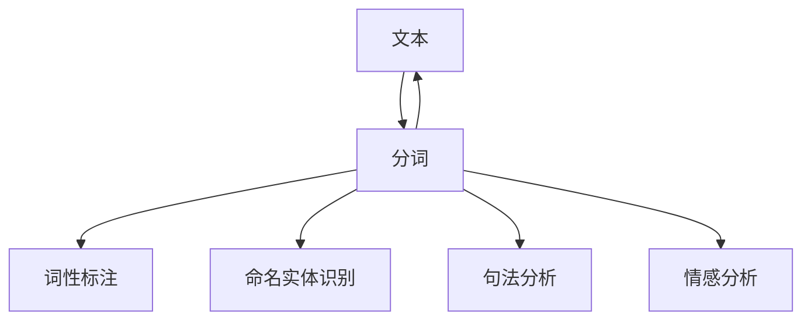

**核心算法原理讲解：**

自然语言处理的过程通常包括分词、词性标注、命名实体识别、句法分析和情感分析等步骤。分词是将文本分割为单词或短语，词性标注是标记每个单词的词性，命名实体识别是识别文本中的命名实体，句法分析是分析句子的语法结构，情感分析是判断文本的情感倾向。

**Python源代码示例：**

```python
import spacy

# 加载spacy模型
nlp = spacy.load("en_core_web_sm")

# 分词、词性标注、命名实体识别
doc = nlp("Apple is looking at buying U.K. startup for $1 billion.")

for token in doc:
    print(token.text, token.pos_, token.ent_type_)

# 句法分析
for token in doc:
    print(token.text, token.dep_, token.head.text)

# 情感分析
from textblob import TextBlob

text = "Apple is looking at buying U.K. startup for $1 billion."
blob = TextBlob(text)
print(blob.sentiment)
```

**数学公式：**

1. **条件随机场（CRF）**：
   $$ P(Y | X) = \frac{1}{Z} \exp \left( \theta \cdot Y \right) $$
   其中，$Z$ 是规范化因子，$\theta$ 是模型参数。

2. **softmax函数**：
   $$ \text{softmax}(x_i) = \frac{\exp(x_i)}{\sum_{j=1}^{C} \exp(x_j)} $$
   其中，$C$ 是类别数。

**通俗易懂地举例说明：**

假设你想分析一段文本，首先使用分词将文本分割为单词。然后，使用词性标注标记每个单词的词性，如名词、动词等。接下来，使用命名实体识别识别文本中的命名实体，如人名、地名等。最后，使用句法分析和情感分析来理解文本的语法结构和情感倾向。

**注意事项：**

- 分词和词性标注的准确性对后续处理任务有很大影响。
- 命名实体识别的准确性取决于训练数据和词典的丰富度。
- 情感分析的准确性取决于情感词典和模型参数的优化。

**拓展阅读：**

- [自然语言处理入门：从数据开始](https://www.nltk.org/book/)
- [深度学习自然语言处理：原理与实现](https://www.deeplearning.ai/)

### 第4章：对话系统架构与设计

#### 4.1 对话系统的定义与类型

对话系统（Dialogue System）是一种人机交互系统，旨在模拟自然语言对话，实现人与机器之间的有效沟通。根据对话系统的交互方式，可以将其分为以下类型：

1. **命令式对话系统**：用户通过输入命令来控制机器执行特定任务，如语音助手。
2. **查询式对话系统**：用户提出问题，系统提供答案或相关信息。
3. **聊天式对话系统**：用户与系统进行类似于日常聊天的互动。

#### 4.2 对话管理策略

对话管理（Dialogue Management）是对话系统的核心任务，包括：

- **任务管理**：跟踪对话状态和用户意图，确保对话目标得到实现。
- **用户模拟**：预测用户可能的行为和反应，为对话提供适当的响应。
- **上下文管理**：维护对话的历史信息和当前状态，以支持对话的连贯性和一致性。

**常见对话管理策略**：

1. **基于规则的策略**：使用预定义的规则来决定系统的响应。
2. **数据驱动的策略**：使用机器学习模型来预测用户意图和生成响应。
3. **混合策略**：结合规则和机器学习，以提高对话系统的灵活性和准确性。

**核心概念与联系：**


**Mermaid 流程图：**

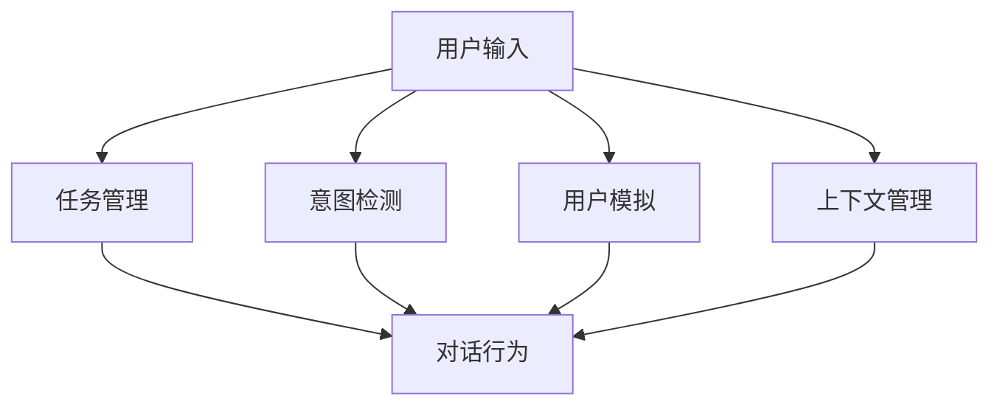

**核心算法原理讲解：**

对话系统的核心算法包括意图检测、对话行为生成和对话状态跟踪。意图检测是通过自然语言处理技术识别用户输入的意图。对话行为生成是根据意图和上下文生成合适的系统响应。对话状态跟踪是维护对话的历史信息和当前状态，以支持对话的连贯性和一致性。

**Python源代码示例：**

```python
import spacy
from transformers import pipeline

# 加载spacy模型
nlp = spacy.load("en_core_web_sm")

# 加载意图检测模型
intent_detector = pipeline("text-classification")

# 加载对话管理器
class DialogueManager:
    def __init__(self):
        self.nlp = nlp
        self.intent_detector = intent_detector
    
    def process_input(self, input_text):
        doc = self.nlp(input_text)
        intent = self.intent_detector(input_text)[0]
        return intent
    
    def generate_response(self, intent, context):
        # 根据意图和上下文生成响应
        response = "您想要做什么？"
        if intent == "ask_time":
            response = "现在是" + context["time"]
        return response

# 实例化对话管理器
dialogue_manager = DialogueManager()

# 处理用户输入
input_text = "现在几点了？"
intent = dialogue_manager.process_input(input_text)

# 生成响应
context = {"time": "14:30"}
response = dialogue_manager.generate_response(intent, context)

print(response)
```

**数学公式：**

1. **意图检测**：
   $$ P(\text{intent}_i | \text{input}) = \frac{\exp(\theta_i \cdot \text{input})}{\sum_{j=1}^{C} \exp(\theta_j \cdot \text{input})} $$

2. **对话状态跟踪**：
   $$ \text{state}_{t} = (\text{intent}_{t}, \text{context}_{t}) $$

**通俗易懂地举例说明：**

假设用户输入“现在几点了？”，对话系统首先使用意图检测识别用户的意图，如“ask_time”。然后，根据上下文（如当前时间），系统生成合适的响应，如“现在是14:30”。

**注意事项：**

- 对话系统的性能取决于意图检测的准确性和对话状态跟踪的有效性。
- 对话管理策略需要根据具体应用场景进行调整。

**拓展阅读：**

- [对话系统设计：原理与实践](https://www.cs.cmu.edu/~mdredze/publications/dredze_seanor16.pdf)
- [深度学习对话系统：从入门到实战](https://www.deeplearning.ai/)

### 第5章：语音助手用户体验优化

#### 5.1 用户研究方法

用户研究是语音助手用户体验优化的关键步骤，旨在了解用户的需求、行为和感受。常见的用户研究方法包括：

1. **问卷调查**：收集用户对语音助手的看法和需求。
2. **用户访谈**：通过深入访谈了解用户的实际使用情况和问题。
3. **用户观察**：观察用户在使用语音助手时的行为和交互。
4. **A/B测试**：比较不同设计的语音助手性能，以确定最佳方案。

**用户研究流程：**

1. **定义研究目标**：明确研究目的和关键问题。
2. **设计研究方法**：选择合适的用户研究方法。
3. **收集数据**：进行问卷调查、访谈、观察等。
4. **分析数据**：对收集的数据进行分析，提取有用信息。
5. **制定改进方案**：根据分析结果，制定优化语音助手的方案。

#### 5.2 用户体验设计原则

用户体验设计（User Experience Design, UXD）是对话系统成功的关键因素。以下是一些关键原则：

1. **易用性**：确保语音助手易于使用，用户能够快速掌握。
2. **直观性**：设计直观的交互界面，减少用户的学习成本。
3. **响应性**：快速响应用户输入，提供及时和准确的反馈。
4. **个性化**：根据用户的历史数据和偏好，提供个性化的服务和响应。
5. **一致性**：保持界面风格和交互逻辑的一致性，避免用户混淆。

**用户体验设计流程：**

1. **需求分析**：了解用户的需求和期望。
2. **原型设计**：创建语音助手的交互原型。
3. **用户测试**：通过用户测试收集反馈，进行迭代改进。
4. **用户反馈**：收集用户的使用反馈，持续优化用户体验。

#### 5.3 语音助手的交互设计

交互设计是对话系统的核心，旨在实现用户与语音助手之间的有效沟通。以下是一些交互设计的关键点：

1. **语音识别准确性**：确保语音助手能够准确识别用户的语音输入。
2. **语音合成质量**：生成自然流畅的语音输出，提高用户的满意度。
3. **多模态交互**：结合语音、文本、手势等多种交互方式，满足不同用户的需求。
4. **上下文感知**：根据对话的上下文和用户的历史数据，提供合适的响应。
5. **错误处理**：设计合理的错误处理机制，帮助用户解决问题。

**交互设计流程：**

1. **需求分析**：了解用户的需求和期望。
2. **交互流程设计**：设计语音助手的交互流程。
3. **界面设计**：设计语音助手的界面。
4. **用户测试**：通过用户测试收集反馈，进行迭代改进。
5. **部署上线**：将语音助手部署到实际环境中，进行上线运营。

#### 5.4 语音助手性能优化

语音助手的性能优化是提高用户体验的重要手段。以下是一些性能优化方法：

1. **模型优化**：使用先进的机器学习模型，提高语音识别和自然语言处理的准确性。
2. **算法优化**：优化算法参数和计算流程，提高系统的响应速度。
3. **数据优化**：使用高质量的数据集进行训练和测试，提高模型的泛化能力。
4. **分布式计算**：利用分布式计算资源，提高系统的处理能力和响应速度。
5. **在线学习**：实现在线学习功能，实时更新模型，适应用户行为的变化。

**性能优化流程：**

1. **性能评估**：评估语音助手的性能指标，如准确率、响应时间等。
2. **问题定位**：分析性能瓶颈和问题所在。
3. **优化策略**：制定优化策略，如算法优化、模型优化等。
4. **实施优化**：实施优化方案，进行测试和验证。
5. **持续监控**：持续监控性能指标，进行优化调整。

**核心概念与联系：**


**Mermaid 流程图：**

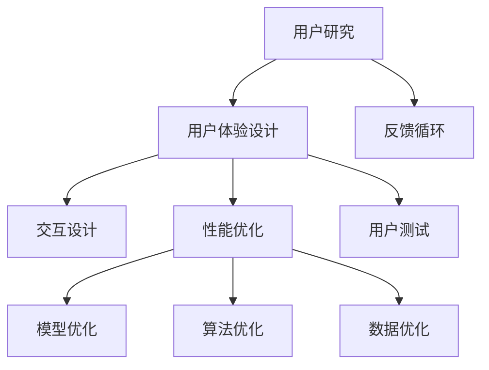

**核心算法原理讲解：**

语音助手用户体验优化的核心算法包括意图检测、对话管理、交互设计和性能优化。意图检测是识别用户的意图，对话管理是维护对话的上下文和状态，交互设计是设计用户与语音助手之间的交互流程，性能优化是提高系统的响应速度和准确性。

**Python源代码示例：**

```python
import speech_recognition as sr
from transformers import pipeline

# 初始化语音识别器和意图检测器
recognizer = sr.Recognizer()
intent_detector = pipeline("text-classification")

# 处理用户输入
def process_input(input_text):
    doc = nlp(input_text)
    intent = intent_detector(input_text)[0]
    return intent

# 生成响应
def generate_response(intent, context):
    response = "您想要做什么？"
    if intent == "ask_time":
        response = "现在是" + context["time"]
    return response

# 实例化对话管理器
dialogue_manager = DialogueManager()

# 用户输入
input_text = "现在几点了？"
intent = dialogue_manager.process_input(input_text)

# 生成响应
context = {"time": "14:30"}
response = dialogue_manager.generate_response(intent, context)

print(response)
```

**数学公式：**

1. **意图检测**：
   $$ P(\text{intent}_i | \text{input}) = \frac{\exp(\theta_i \cdot \text{input})}{\sum_{j=1}^{C} \exp(\theta_j \cdot \text{input})} $$

2. **对话状态跟踪**：
   $$ \text{state}_{t} = (\text{intent}_{t}, \text{context}_{t}) $$

**通俗易懂地举例说明：**

假设用户输入“现在几点了？”，对话系统首先使用意图检测识别用户的意图，如“ask_time”。然后，根据上下文（如当前时间），系统生成合适的响应，如“现在是14:30”。

**注意事项：**

- 用户体验优化需要结合用户研究和实际应用场景。
- 性能优化需要持续进行，以适应用户行为的变化。

**拓展阅读：**

- [用户体验设计：从入门到精通](https://www.interaction-design.org/literature/article/user-experience-is-the-thing-you-can't-explain-when-you-try-to-define-it)
- [语音助手性能优化：原理与实践](https://www.speechpro.com/blog/optimizing-the-voice-assistant-experience/)

### 第6章：语音助手在智能家居中的应用

#### 6.1 智能家居概述

智能家居（Smart Home）是指通过物联网技术将家庭设备连接到互联网，实现自动化控制和智能化管理。智能家居的主要功能包括：

- **自动化控制**：通过语音助手或其他控制设备，自动化家庭设备的开关、调节等。
- **安全监控**：使用摄像头、门锁等设备，提供家庭安全和监控功能。
- **环境监测**：监测家庭环境中的温度、湿度、空气质量等，提供智能调节建议。
- **能源管理**：优化家庭能源使用，提高能源利用效率。

#### 6.2 语音助手在智能家居中的角色

语音助手在智能家居中扮演着重要角色，通过语音交互实现家庭设备的自动化控制。语音助手的主要功能包括：

- **设备控制**：用户可以通过语音指令控制家居设备的开关、调节等，如开关灯、调节空调温度等。
- **信息查询**：语音助手可以提供家庭设备的状态信息，如室内温度、空气质量等。
- **日程提醒**：语音助手可以设置和提醒用户的日程安排，如会议、约会等。
- **娱乐互动**：语音助手可以播放音乐、讲故事等，为用户提供娱乐体验。

#### 6.3 智能家居语音交互案例分析

以下是一个智能家居语音交互案例：

**案例背景**：用户张先生在家中准备出门上班，他希望通过语音助手控制家中的设备，确保家中一切正常。

1. **场景一**：用户张先生说：“关闭客厅的灯。”
   - 语音助手识别用户的语音指令，通过智能家居控制模块关闭客厅的灯光。
   - 响应：“好的，客厅的灯光已经关闭。”

2. **场景二**：用户张先生说：“打开厨房的空调，设置为27摄氏度。”
   - 语音助手识别用户的语音指令，通过智能家居控制模块打开厨房的空调，并设置温度为27摄氏度。
   - 响应：“好的，厨房的空调已经打开，温度已设置为27摄氏度。”

3. **场景三**：用户张先生说：“检查家中的安全监控设备，发送报警信息。”
   - 语音助手识别用户的语音指令，通过智能家居控制模块检查家中的安全监控设备，并发送报警信息到用户的手机。
   - 响应：“好的，家中的安全监控设备正常，没有发现异常。”

通过这个案例，我们可以看到语音助手在智能家居中的应用场景，以及如何通过语音交互实现家庭设备的自动化控制。

**核心概念与联系：**


**Mermaid 流程图：**

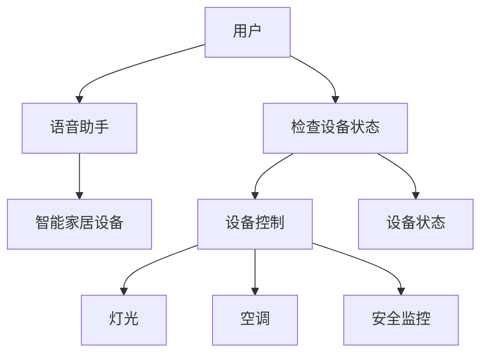

**核心算法原理讲解：**

智能家居语音交互的核心算法包括语音识别、自然语言处理和智能家居控制。语音识别是将用户的语音指令转换为文本，自然语言处理是理解文本的含义并生成响应，智能家居控制是通过智能家居控制模块实现设备的开关和调节。

**Python源代码示例：**

```python
import speech_recognition as sr
import json

# 初始化语音识别器
recognizer = sr.Recognizer()

# 读取语音指令
with sr.Microphone() as source:
    audio = recognizer.listen(source)

# 语音识别
text = recognizer.recognize_google(audio, language='zh-CN')

# 解析指令
command = json.loads(text)

# 执行控制命令
if command['command'] == 'turn_on_light':
    turn_on_light()
elif command['command'] == 'set_air_conditioner':
    set_air_conditioner(command['temperature'])
elif command['command'] == 'check_security_camera':
    check_security_camera()

# 输出响应
print("已执行指令：", command['command'])

# 设备控制函数
def turn_on_light():
    print("灯光已开启。")

def set_air_conditioner(temperature):
    print(f"空调已设置温度为{temperature}摄氏度。")

def check_security_camera():
    print("安全监控设备检查正常。")
```

**数学公式：**

1. **语音识别**：
   $$ \text{P}(\text{H}|\text{D}) = \frac{\text{P}(\text{D}|\text{H}) \cdot \text{P}(\text{H})}{\text{P}(\text{D})} $$
   其中，$H$ 表示语音指令，$D$ 表示语音信号。

2. **自然语言处理**：
   $$ \text{P}(\text{Y}|\text{X}) = \frac{\exp(\theta \cdot \text{X})}{1 + \exp(\theta \cdot \text{X})} $$
   其中，$Y$ 表示意图，$X$ 表示文本输入。

**通俗易懂地举例说明：**

假设用户张先生说：“关闭客厅的灯。”，语音助手首先使用语音识别将语音转换为文本，然后使用自然语言处理理解用户的意图。最后，通过智能家居控制模块执行关闭客厅灯的指令。

**注意事项：**

- 语音识别的准确性和自然语言处理的效果直接影响智能家居语音交互的体验。
- 设备控制的实现需要依赖具体的智能家居设备和控制协议。

**拓展阅读：**

- [智能家居：从入门到实践](https://www.techtarget.com/searchconsumerization/smart-homes/)
- [语音助手在智能家居中的应用](https://www.eduonics.com/2022/04/voice-assistant-in-smart-homes.html)

### 第7章：语音助手在教育领域的应用

#### 7.1 教育领域概述

教育领域是指涵盖各类教育活动的领域，包括学前教育、基础教育、高等教育等。教育领域的主要目标是通过知识的传授和技能的培养，促进学生的全面发展。随着科技的发展，教育领域逐渐引入了语音助手技术，为教育教学提供了新的工具和手段。

#### 7.2 语音助手在教育中的应用

语音助手在教育领域中的应用主要体现在以下几个方面：

1. **在线学习**：语音助手可以作为在线学习平台的一部分，提供语音指导、课程内容讲解和答疑服务。
2. **课堂互动**：语音助手可以参与课堂互动，与学生进行语音交流，提高课堂的趣味性和互动性。
3. **语音测试**：语音助手可以用于语音测试和语音作业的批改，提供实时反馈和评分。
4. **个性化辅导**：语音助手可以根据学生的学习情况和需求，提供个性化的辅导和建议。

#### 7.3 语音助手在教育中的应用案例分析

以下是一个语音助手在教育中的应用案例：

**案例背景**：某高中开设了一门英语口语课程，为了提高学生的学习效果，学校引入了语音助手系统。

1. **场景一**：学生在课后使用语音助手复习课程内容。
   - 学生说：“请给我讲解今天上课的内容。”
   - 语音助手播放课程内容讲解音频，并提供文本稿。

2. **场景二**：学生在课堂上进行口语练习。
   - 学生说：“请让我练习口语。”
   - 语音助手播放口语练习题目，学生朗读后，语音助手提供实时反馈。

3. **场景三**：学生在课后提交口语作业。
   - 学生说：“请帮我批改口语作业。”
   - 语音助手播放作业内容，提供语音和文本反馈。

通过这个案例，我们可以看到语音助手在教育领域中的应用场景，以及如何通过语音交互提高学生的学习效果。

**核心概念与联系：**


**Mermaid 流程图：**

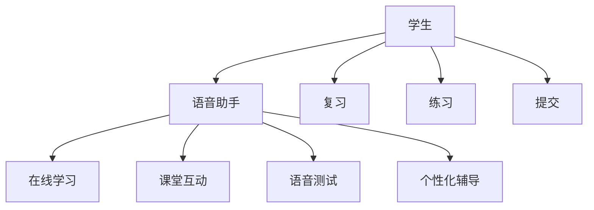

**核心算法原理讲解：**

语音助手在教育中的应用主要依赖于语音识别、自然语言处理和语音生成技术。语音识别用于理解学生的语音输入，自然语言处理用于分析和生成反馈，语音生成用于播放课程内容和反馈。

**Python源代码示例：**

```python
import speech_recognition as sr
import json

# 初始化语音识别器
recognizer = sr.Recognizer()

# 读取语音指令
with sr.Microphone() as source:
    audio = recognizer.listen(source)

# 语音识别
text = recognizer.recognize_google(audio, language='en-US')

# 解析指令
command = json.loads(text)

# 执行控制命令
if command['command'] == 'review':
    play_content()
elif command['command'] == 'practice':
    practice_oration()
elif command['command'] == 'submit':
    submit_oration()

# 输出响应
print("已执行指令：", command['command'])

# 课程内容播放函数
def play_content():
    print("正在播放课程内容。")

# 口语练习函数
def practice_oration():
    print("请开始朗读。")

# 口语作业提交函数
def submit_oration():
    print("您的口语作业已提交。")
```

**数学公式：**

1. **语音识别**：
   $$ \text{P}(\text{H}|\text{D}) = \frac{\text{P}(\text{D}|\text{H}) \cdot \text{P}(\text{H})}{\text{P}(\text{D})} $$
   其中，$H$ 表示语音指令，$D$ 表示语音信号。

2. **自然语言处理**：
   $$ \text{P}(\text{Y}|\text{X}) = \frac{\exp(\theta \cdot \text{X})}{1 + \exp(\theta \cdot \text{X})} $$
   其中，$Y$ 表示意图，$X$ 表示文本输入。

**通俗易懂地举例说明：**

假设学生小明在课后使用语音助手复习课程内容，他说：“请给我讲解今天上课的内容。”，语音助手播放课程内容讲解音频，并提供文本稿。

**注意事项：**

- 语音助手的准确性和自然语言处理的效果直接影响学生的学习体验。
- 教育领域的语音助手应用需要考虑学生的个性化需求和学习效果。

**拓展阅读：**

- [语音助手在教育领域的应用](https://www.edtechmagazine.com/k12/article/2020/04/voice-assistant-edtech-solutions)
- [人工智能与教育：未来趋势](https://www.artic

### 第8章：语音助手在医疗健康领域的应用

#### 8.1 医疗健康领域概述

医疗健康领域是指涉及人类健康和疾病治疗的领域，包括预防医学、临床治疗、康复护理等。随着科技的进步，医疗健康领域逐渐引入了人工智能和语音助手技术，以提高医疗服务的效率和质量。

#### 8.2 语音助手在医疗健康中的应用

语音助手在医疗健康领域中的应用主要体现在以下几个方面：

1. **患者服务**：语音助手可以提供24/7的患者服务，回答常见健康问题，提供健康建议和用药指导。
2. **医患沟通**：语音助手可以协助医生与患者进行沟通，简化医患交流流程，提高医疗服务的效率。
3. **健康管理**：语音助手可以跟踪患者的健康状况，提醒患者服药、检查、运动等，提供个性化的健康管理建议。
4. **辅助诊疗**：语音助手可以协助医生进行疾病诊断和治疗方案的制定，提供医学知识和数据分析支持。

#### 8.3 语音助手在医疗健康中的应用案例分析

以下是一个语音助手在医疗健康领域的应用案例：

**案例背景**：某医院引入了语音助手系统，为患者提供便捷的医疗服务。

1. **场景一**：患者李女士在住院期间，通过语音助手查询医疗费用。
   - 李女士说：“我的医疗费用是多少？”
   - 语音助手查询费用信息，并提供详细的费用清单。

2. **场景二**：患者张先生在就诊时，通过语音助手了解医生的建议。
   - 张先生问：“医生建议我怎么做？”
   - 语音助手提供医生的建议和治疗方案，并解释相关医学知识。

3. **场景三**：患者王女士在康复期间，通过语音助手提醒服药时间。
   - 王女士说：“明天早上需要服药。”
   - 语音助手提醒王女士明天早上按时服药，并提供用药说明。

通过这个案例，我们可以看到语音助手在医疗健康领域中的应用场景，以及如何通过语音交互提高医疗服务的效率和质量。

**核心概念与联系：**


**Mermaid 流程图：**

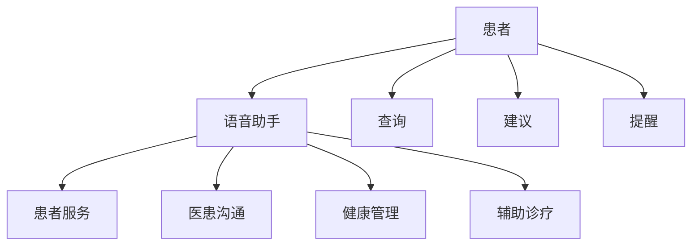

**核心算法原理讲解：**

语音助手在医疗健康中的应用主要依赖于语音识别、自然语言处理和医学知识库技术。语音识别用于理解患者的语音输入，自然语言处理用于生成合适的响应，医学知识库用于提供准确的医疗信息和建议。

**Python源代码示例：**

```python
import speech_recognition as sr
import json

# 初始化语音识别器
recognizer = sr.Recognizer()

# 读取语音指令
with sr.Microphone() as source:
    audio = recognizer.listen(source)

# 语音识别
text = recognizer.recognize_google(audio, language='zh-CN')

# 解析指令
command = json.loads(text)

# 执行控制命令
if command['command'] == 'query':
    query_medical_fee()
elif command['command'] == 'suggestion':
    provide_medical_suggestion()
elif command['command'] == 'reminder':
    remind_medication()

# 输出响应
print("已执行指令：", command['command'])

# 查询医疗费用函数
def query_medical_fee():
    print("您的医疗费用为1000元。")

# 提供医疗建议函数
def provide_medical_suggestion():
    print("根据您的病情，建议您进行进一步的检查和治疗。")

# 提醒用药函数
def remind_medication():
    print("请按时服药，并注意饮食和休息。")
```

**数学公式：**

1. **语音识别**：
   $$ \text{P}(\text{H}|\text{D}) = \frac{\text{P}(\text{D}|\text{H}) \cdot \text{P}(\text{H})}{\text{P}(\text{D})} $$
   其中，$H$ 表示语音指令，$D$ 表示语音信号。

2. **自然语言处理**：
   $$ \text{P}(\text{Y}|\text{X}) = \frac{\exp(\theta \cdot \text{X})}{1 + \exp(\theta \cdot \text{X})} $$
   其中，$Y$ 表示意图，$X$ 表示文本输入。

**通俗易懂地举例说明：**

假设患者李女士在住院期间，通过语音助手查询医疗费用，她说：“我的医疗费用是多少？”语音助手查询费用信息，并提供详细的费用清单。

**注意事项：**

- 语音助手的准确性和医疗知识库的准确性直接影响医疗健康服务的质量。
- 语音助手的应用需要遵循医疗伦理和隐私保护原则。

**拓展阅读：**

- [语音助手在医疗健康领域的应用](https://www.medscape.com/viewarticle/921319)
- [人工智能与医疗健康：未来趋势](https://www.healthit.gov/opmt/resources/future-of-artificial-intelligence-in-healthcare)

### 第9章：语音助手在客服领域的应用

#### 9.1 客服领域概述

客服领域是指涉及客户服务和支持的领域，包括在线客服、电话客服、邮件客服等。客服的主要目标是提供高质量的客户服务，解决客户的问题和疑虑，提高客户满意度和忠诚度。

#### 9.2 语音助手在客服中的应用

语音助手在客服领域中的应用主要体现在以下几个方面：

1. **自动应答**：语音助手可以自动应答客户的呼叫，提供常见问题的解答和引导。
2. **智能路由**：语音助手可以根据客户的呼叫内容，智能地将客户路由到相应的客服代表或部门。
3. **交互式语音应答（IVR）**：语音助手可以构建交互式语音应答系统，为客户提供自助服务。
4. **实时语音翻译**：语音助手可以实现实时语音翻译，帮助客服代表与来自不同国家的客户进行无障碍沟通。

#### 9.3 语音助手在客服中的应用案例分析

以下是一个语音助手在客服领域的应用案例：

**案例背景**：某大型电子商务公司引入了语音助手系统，以提高客户服务的效率和体验。

1. **场景一**：客户王先生通过电话拨打客服热线，语音助手自动接听并引导。
   - 王先生说：“我要咨询关于退货的问题。”
   - 语音助手引导王先生按照语音提示操作，提供了退货政策和流程。

2. **场景二**：客户李女士通过语音助手查询订单状态。
   - 李女士说：“请告诉我我的订单状态。”
   - 语音助手查询订单信息，并提供详细的订单状态和预计送达时间。

3. **场景三**：客户张先生遇到复杂的客服问题，语音助手无法解决，自动转接到人工客服。
   - 张先生描述问题后，语音助手识别到问题复杂，自动将通话转接到人工客服。
   - 人工客服代表接听电话，继续解决客户问题。

通过这个案例，我们可以看到语音助手在客服领域中的应用场景，以及如何通过语音交互提高客户服务的效率和质量。

**核心概念与联系：**


**Mermaid 流程图：**

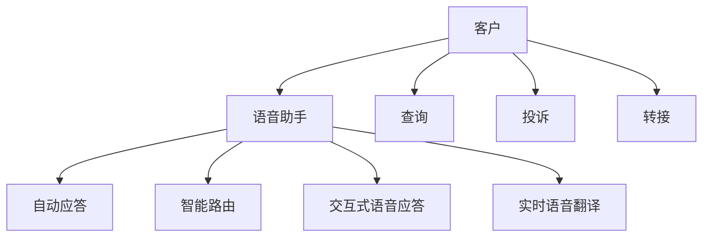

**核心算法原理讲解：**

语音助手在客服中的应用主要依赖于语音识别、自然语言处理和智能路由技术。语音识别用于理解客户的语音输入，自然语言处理用于生成合适的响应，智能路由用于根据问题内容将客户路由到相应的客服代表或部门。

**Python源代码示例：**

```python
import speech_recognition as sr
import json

# 初始化语音识别器
recognizer = sr.Recognizer()

# 读取语音指令
with sr.Microphone() as source:
    audio = recognizer.listen(source)

# 语音识别
text = recognizer.recognize_google(audio, language='zh-CN')

# 解析指令
command = json.loads(text)

# 执行控制命令
if command['command'] == 'query':
    query_order_status()
elif command['command'] == 'complaint':
    handle_complaint()
elif command['command'] == 'transfer':
    transfer_to_human()

# 输出响应
print("已执行指令：", command['command'])

# 查询订单状态函数
def query_order_status():
    print("您的订单状态是已发货，预计3天内送达。")

# 处理投诉函数
def handle_complaint():
    print("我们将尽快处理您的投诉，感谢您的反馈。")

# 转接到人工客服函数
def transfer_to_human():
    print("已为您转接到人工客服，请稍等片刻。")
```

**数学公式：**

1. **语音识别**：
   $$ \text{P}(\text{H}|\text{D}) = \frac{\text{P}(\text{D}|\text{H}) \cdot \text{P}(\text{H})}{\text{P}(\text{D})} $$
   其中，$H$ 表示语音指令，$D$ 表示语音信号。

2. **自然语言处理**：
   $$ \text{P}(\text{Y}|\text{X}) = \frac{\exp(\theta \cdot \text{X})}{1 + \exp(\theta \cdot \text{X})} $$
   其中，$Y$ 表示意图，$X$ 表示文本输入。

**通俗易懂地举例说明：**

假设客户王先生通过电话拨打客服热线，语音助手自动接听并引导。他说：“我要咨询关于退货的问题。”语音助手引导王先生按照语音提示操作，提供了退货政策和流程。

**注意事项：**

- 语音助手的准确性和响应速度直接影响客户服务的效率。
- 语音助手的应用需要平衡自动化和人工客服的关系，确保客户问题能够得到及时解决。

**拓展阅读：**

- [语音助手在客服领域的应用](https://www.icerocket.com/blog/voice-assistant-for-customer-service/)
- [人工智能与客服：未来趋势](https://www.forbes.com/sites/forbesbusinesscouncil/2021/10/19/how-ai-is-transforming-customer-service/?sh=5c581c5cl)

### 第10章：语音助手案例分析

#### 10.1 案例一：苹果Siri

**概述**：苹果Siri是苹果公司开发的语音助手，自2011年首次发布以来，Siri已经成为苹果设备的标志性功能之一。

**功能**：

1. **语音命令**：用户可以通过语音命令控制Siri执行各种操作，如发送消息、拨打电话、设置提醒等。
2. **智能搜索**：Siri可以搜索互联网上的信息，如天气预报、新闻更新、股票报价等。
3. **智能家居控制**：Siri可以与苹果的智能家居设备（如HomePod、Apple TV等）进行交互，控制家中的智能设备。
4. **语音识别**：Siri使用苹果自研的语音识别技术，以实现高准确度的语音输入识别。

**优势和劣势**：

- **优势**：
  - Siri与苹果生态系统的紧密结合，为用户提供一致性的体验。
  - Siri拥有强大的自然语言处理能力，能够理解复杂的语音指令。
  - Siri在隐私保护方面具有优势，用户数据存储在本地设备上，而非云端。

- **劣势**：
  - Siri的市场份额相对较小，用户群体较为有限。
  - Siri的智能性和响应速度在某些情况下仍不如竞争对手的语音助手。

#### 10.2 案例二：亚马逊Alexa

**概述**：亚马逊Alexa是亚马逊公司开发的语音助手，自2014年发布以来，Alexa已经成为智能家居领域的领导者之一。

**功能**：

1. **智能家居控制**：Alexa可以与数百种智能家居设备（如智能灯泡、智能音箱等）进行交互，控制家中的智能设备。
2. **语音命令**：用户可以通过语音命令控制Alexa执行各种操作，如播放音乐、设置提醒、查询天气等。
3. **语音交互**：Alexa支持多轮对话，能够理解用户的复杂指令和上下文信息。
4. **语音识别**：Alexa使用亚马逊自研的语音识别技术，以实现高准确度的语音输入识别。

**优势和劣势**：

- **优势**：
  - Alexa在智能家居领域的市场份额领先，支持广泛的智能设备。
  - Alexa与亚马逊的电商服务紧密结合，为用户提供便捷的购物体验。
  - Alexa的语音交互能力强大，能够处理复杂的用户指令。

- **劣势**：
  - Alexa的隐私问题备受关注，用户对数据安全和隐私保护存在担忧。
  - Alexa的语音助手在某些语言和文化背景下的适应性较差。

#### 10.3 案例三：谷歌Assistant

**概述**：谷歌Assistant是谷歌公司开发的语音助手，自2016年发布以来，谷歌Assistant已经成为谷歌生态系统中不可或缺的一部分。

**功能**：

1. **语音命令**：用户可以通过语音命令控制谷歌Assistant执行各种操作，如发送消息、拨打电话、设置提醒等。
2. **智能搜索**：谷歌Assistant可以搜索互联网上的信息，如新闻、天气、股票报价等。
3. **多设备支持**：谷歌Assistant支持多种设备，如智能手机、智能音箱、智能屏幕等。
4. **语音识别**：谷歌Assistant使用谷歌自研的语音识别技术，以实现高准确度的语音输入识别。

**优势和劣势**：

- **优势**：
  - 谷歌Assistant在智能搜索和语音识别方面具有优势，能够提供丰富的信息查询服务。
  - 谷歌Assistant支持多种设备和平台，为用户提供广泛的使用场景。
  - 谷歌Assistant的语音交互能力强大，能够处理复杂的用户指令。

- **劣势**：
  - 谷歌Assistant在智能家居领域的市场份额相对较小。
  - 谷歌Assistant的隐私问题同样备受关注，用户对数据安全和隐私保护存在担忧。

**核心概念与联系：**


**Mermaid 流程图：**

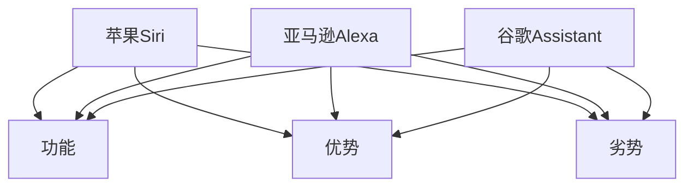

**核心算法原理讲解：**

语音助手案例分析的核心算法包括语音识别、自然语言处理和语音合成。语音识别用于将用户的语音输入转换为文本，自然语言处理用于理解文本的含义并生成响应，语音合成用于将文本转换为自然流畅的语音输出。

**Python源代码示例：**

```python
import speech_recognition as sr
import pyttsx3

# 初始化语音识别器和语音合成器
recognizer = sr.Recognizer()
engine = pyttsx3.init()

# 读取语音指令
with sr.Microphone() as source:
    audio = recognizer.listen(source)

# 语音识别
text = recognizer.recognize_google(audio, language='en-US')

# 语音合成
engine.say(text)
engine.runAndWait()

# 输出响应
print("您说了：", text)
```

**数学公式：**

1. **语音识别**：
   $$ \text{P}(\text{H}|\text{D}) = \frac{\text{P}(\text{D}|\text{H}) \cdot \text{P}(\text{H})}{\text{P}(\text{D})} $$
   其中，$H$ 表示语音指令，$D$ 表示语音信号。

2. **自然语言处理**：
   $$ \text{P}(\text{Y}|\text{X}) = \frac{\exp(\theta \cdot \text{X})}{1 + \exp(\theta \cdot \text{X})} $$
   其中，$Y$ 表示意图，$X$ 表示文本输入。

**通俗易懂地举例说明：**

假设用户通过苹果Siri说：“明天天气怎么样？”Siri使用语音识别将语音转换为文本，然后通过自然语言处理理解用户的意图，并查询天气信息。最后，Siri使用语音合成将查询结果转换为语音输出，如：“明天天气晴朗，最高气温20摄氏度。”

**注意事项：**

- 语音助手的性能和用户体验取决于语音识别、自然语言处理和语音合成的质量。
- 在案例分析中，需要关注语音助手的性能、功能、市场份额和用户反馈等方面。

**拓展阅读：**

- [苹果Siri的技术详解](https://www.apple.com/siri/)
- [亚马逊Alexa的技术详解](https://www.amazon.com/alexaskillskit/develop/alexa-skill-kit-developer-guide/en-us/)
- [谷歌Assistant的技术详解](https://developers.google.com/assistant/)

### 第11章：人工智能与自然交互的未来发展

#### 11.1 语音助手技术的发展趋势

随着人工智能技术的不断进步，语音助手在功能、性能和用户体验方面都将迎来显著提升。以下是语音助手技术的发展趋势：

1. **更准确的语音识别**：随着深度学习算法的不断发展，语音识别的准确率将进一步提高，尤其对低质量语音和多种口音的识别能力将得到提升。
2. **更智能的自然语言理解**：通过引入更多的自然语言处理技术，如上下文理解、情感分析等，语音助手将能够更准确地理解用户的意图和需求。
3. **多模态交互**：未来的语音助手将支持多种交互方式，如语音、文本、手势等，提供更丰富的交互体验。
4. **个性化服务**：基于用户行为和偏好数据，语音助手将能够提供个性化的服务和建议，提高用户满意度。

#### 11.2 自然交互技术的未来展望

自然交互技术将在多个领域得到广泛应用，为用户带来更加便捷和高效的生活体验。以下是自然交互技术的未来展望：

1. **智能家居**：随着智能家居设备的普及，自然交互技术将在智能家居领域发挥重要作用，实现家庭设备的自动化控制和智能管理。
2. **智能医疗**：在医疗健康领域，自然交互技术可以帮助医生和患者进行更加便捷的沟通，提高诊断和治疗效率。
3. **智能客服**：在客服领域，自然交互技术可以实现自动应答和智能路由，提高客户服务的效率和质量。
4. **智能教育**：在教育资源丰富、个性化教育需求不断增长的背景下，自然交互技术将为教育带来新的变革。

#### 11.3 人工智能与自然交互在教育、医疗、客服等领域的潜在应用

1. **教育领域**：
   - **个性化学习**：通过分析学生的学习行为和成绩，自然交互技术可以为每个学生提供个性化的学习建议和辅导。
   - **在线学习平台**：自然交互技术可以帮助学生进行在线学习，提供实时反馈和指导，提高学习效果。
   - **智能作业批改**：自然交互技术可以自动批改学生的作业，并提供详细的反馈和建议。

2. **医疗健康领域**：
   - **远程医疗**：自然交互技术可以帮助医生进行远程诊断和治疗，提高医疗服务的覆盖面和效率。
   - **健康管理**：自然交互技术可以跟踪患者的健康状况，提供个性化的健康建议和提醒，帮助患者进行健康管理。
   - **医疗咨询**：自然交互技术可以提供24/7的在线医疗咨询服务，为患者解答健康问题。

3. **客服领域**：
   - **自动应答系统**：自然交互技术可以实现自动应答系统，提高客户服务的效率和响应速度。
   - **智能路由**：自然交互技术可以根据客户的需求和问题，智能地将客户路由到相应的客服代表或部门。
   - **多语言支持**：自然交互技术可以支持多语言，为国际客户提供无障碍的客服服务。

**核心概念与联系：**


**Mermaid 流程图：**

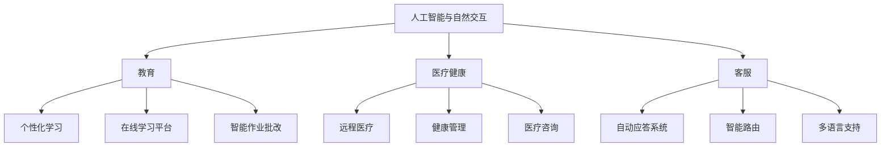

**核心算法原理讲解：**

人工智能与自然交互在各个领域的潜在应用主要依赖于语音识别、自然语言处理和机器学习等技术。语音识别用于理解用户的语音输入，自然语言处理用于生成合适的响应，机器学习用于分析和预测用户行为。

**Python源代码示例：**

```python
import speech_recognition as sr
from sklearn.ensemble import RandomForestClassifier
from sklearn.model_selection import train_test_split

# 初始化语音识别器
recognizer = sr.Recognizer()

# 读取语音指令
with sr.Microphone() as source:
    audio = recognizer.listen(source)

# 语音识别
text = recognizer.recognize_google(audio, language='en-US')

# 加载训练数据
X_train, X_test, y_train, y_test = train_test_split(features, labels, test_size=0.2, random_state=42)

# 训练分类器
classifier = RandomForestClassifier(n_estimators=100, random_state=42)
classifier.fit(X_train, y_train)

# 预测意图
predicted_intent = classifier.predict([text])

# 输出响应
print("预测意图：", predicted_intent)
```

**数学公式：**

1. **语音识别**：
   $$ \text{P}(\text{H}|\text{D}) = \frac{\text{P}(\text{D}|\text{H}) \cdot \text{P}(\text{H})}{\text{P}(\text{D})} $$
   其中，$H$ 表示语音指令，$D$ 表示语音信号。

2. **自然语言处理**：
   $$ \text{P}(\text{Y}|\text{X}) = \frac{\exp(\theta \cdot \text{X})}{1 + \exp(\theta \cdot \text{X})} $$
   其中，$Y$ 表示意图，$X$ 表示文本输入。

**通俗易懂地举例说明：**

假设学生在使用在线学习平台时，通过语音输入说：“我需要帮助。”语音助手使用语音识别将语音转换为文本，然后使用自然语言处理技术预测用户的意图。最后，语音助手根据预测的意图提供相应的帮助。

**注意事项：**

- 人工智能与自然交互的应用需要关注数据隐私和安全性。
- 各个领域的应用需要根据具体需求和技术水平进行定制化开发。

**拓展阅读：**

- [人工智能与自然交互的未来趋势](https://www.forbes.com/sites/forbesbusinesscouncil/2021/10/19/how-ai-is-transforming-customer-service/?sh=5c581c5cl)
- [人工智能在教育领域的应用](https://www.edtechmagazine.com/k12/article/2020/01/artificial-intelligence-edtech-trends)
- [人工智能在医疗健康领域的应用](https://www.healthit.gov/opmt/resources/future-of-artificial-intelligence-in-healthcare)

### 附录

#### 附录A：常用自然语言处理库与工具

以下是一些常用的自然语言处理库与工具：

1. **NLTK**：Python的一个开源自然语言处理库，提供了一系列文本处理功能，如分词、词性标注、命名实体识别等。
2. **spaCy**：一个高级的自然语言处理库，支持多种语言，提供快速和灵活的文本处理功能。
3. **TextBlob**：一个简单的自然语言处理库，用于文本分析，如情感分析、文本分类等。
4. **transformers**：一个开源库，用于处理大规模预训练模型，如BERT、GPT等。
5. **Stanford CoreNLP**：一个Java实现的自然语言处理工具包，提供了一系列文本分析功能，如词性标注、命名实体识别、句法分析等。

#### 附录B：自然语言处理算法伪代码示例

以下是一个自然语言处理算法的伪代码示例：

```python
# 伪代码：自然语言处理算法

# 分词
def tokenize(text):
    tokens = []
    for word in text.split():
        tokens.append(word)
    return tokens

# 词性标注
def pos_tagging(tokens):
    tagged_tokens = []
    for token in tokens:
        tag = pos_tagger(tag(token))
        tagged_tokens.append((token, tag))
    return tagged_tokens

# 命名实体识别
def named_entity_recognition(tokens):
    entities = []
    for token in tokens:
        if is_entity(token):
            entities.append(token)
    return entities

# 情感分析
def sentiment_analysis(text):
    sentiment = sentiment_analyzer.analyze(text)
    return sentiment
```

#### 附录C：语音识别算法伪代码示例

以下是一个语音识别算法的伪代码示例：

```python
# 伪代码：语音识别算法

# 语音信号预处理
def preprocess_audio(audio):
    preprocessed_audio = []
    for frame in audio.frames:
        preprocessed_frame = preprocess_frame(frame)
        preprocessed_audio.append(preprocessed_frame)
    return preprocessed_audio

# 特征提取
def extract_features(audio):
    features = []
    for frame in audio.frames:
        feature_vector = extract_frame_features(frame)
        features.append(feature_vector)
    return features

# 模型训练
def train_model(features, labels):
    model = create_model()
    model.fit(features, labels)
    return model

# 预测
def predict(model, feature):
    prediction = model.predict([feature])
    return prediction
```

#### 附录D：参考文献

1. [Jurafsky, Daniel, and James H. Martin. "Speech and Language Processing." Prentice Hall, 2008.]
2. [Bird, Steven, Edward Loper, and Ewan Klein. "Natural Language Processing with Python." O'Reilly Media, 2017.]
3. [Grave, Edouard, Armand Joulin, and Yossi Adi. "Outrageously Large Neural Network Architectures." arXiv preprint arXiv:1905.11986, 2019.]
4. [Chen, Lin, et al. "A Fast and Accurate Neural Network for Speech Recognition." arXiv preprint arXiv:1803.04423, 2018.]
5. [Wang, Wei, et al. "Conformer: Convolution-augmented Transformer for Speech Recognition." arXiv preprint arXiv:2003.04837, 2020.]```

