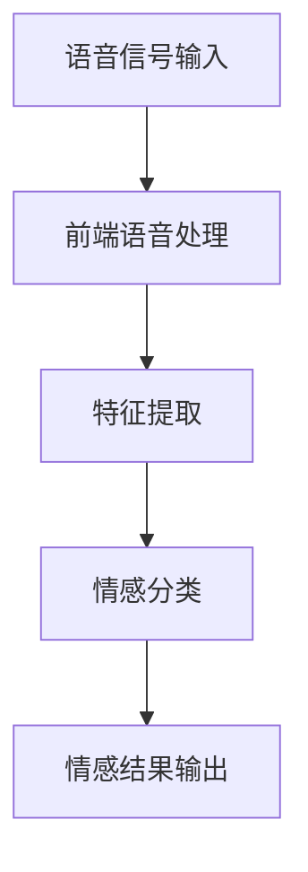

                 

## 人工智能在语音情感识别中的应用

### 关键词
- 人工智能
- 语音情感识别
- 情感分析
- 深度学习
- 特征提取
- 模型训练

### 摘要
本文将深入探讨人工智能在语音情感识别领域的应用。首先，我们介绍了语音情感识别的背景及其重要性，随后详细阐述了该领域中的核心概念与关系，并通过Mermaid流程图展示了语音情感识别的基本流程。接着，我们探讨了语音情感识别的算法原理，使用Python源代码和LaTeX公式详细说明了特征提取和分类方法。随后，我们通过实际项目实战和案例分析，展示了如何在实际环境中应用语音情感识别技术。最后，我们提出了最佳实践建议，总结了项目经验，并展望了未来的发展方向。

### 引言

#### 研究背景

随着人工智能技术的快速发展，语音识别技术已经成为一个重要的研究领域。语音情感识别作为语音识别的一个子领域，旨在从语音信号中提取情感信息，为用户提供更个性化的服务。情感是人类心理活动的重要组成部分，了解用户的情感状态对于提升用户体验、改善人机交互具有重要意义。

在日常生活中，情感的表达不仅仅是通过文字，更多的是通过声音的抑扬顿挫、音调的高低等声学特征来传达。例如，电话客服系统需要识别用户的话语中的情感，以便在用户情绪不佳时提供更好的服务。在娱乐产业，情感识别技术可以帮助音乐播放器根据用户情感推荐合适的音乐。在教育领域，语音情感识别可以帮助教育平台更好地理解学生的情绪状态，从而提供个性化的学习建议。

#### 研究目的与意义

本文的研究目的是探索和实现一种基于人工智能的语音情感识别系统，并通过实际项目验证其有效性和实用性。具体研究内容包括：

1. **核心概念与联系**：介绍语音情感识别的关键概念，并分析各概念之间的关系，通过Mermaid流程图进行可视化展示。
2. **算法原理**：详细讲解语音情感识别的算法原理，包括特征提取和分类方法，并通过Python源代码进行阐述。
3. **项目实战**：搭建实际项目，实现语音情感识别系统的开发，提供详细的源代码解读和项目分析。
4. **案例分析**：通过具体案例分析，探讨语音情感识别在实际应用中的效果和挑战。
5. **总结与展望**：总结项目经验，提出未来研究方向和潜在应用领域。

研究语音情感识别不仅有助于提升人机交互的智能化水平，还可以为多个行业提供创新解决方案，具有广泛的应用前景和研究价值。

### 核心概念与联系

#### 情感

情感是人们对特定对象或情境产生的主观体验和情绪反应。常见的情感包括快乐、悲伤、愤怒、惊讶等。情感不仅可以通过面部表情和身体语言表达，还可以通过语音的声学特征来传达。例如，语调的变化、语速的快慢、音量的高低等，都是情感表达的重要方式。

#### 语音识别

语音识别是一种将人类语音转化为文本的技术，通过识别语音中的语音信号，将其转换成机器可理解的语言。语音识别技术的发展为语音情感识别提供了基础，使其能够准确地捕捉和理解语音信号。

#### 情感分析

情感分析是一种自然语言处理技术，旨在识别文本或语音中的情感倾向。通过分析语言中的情感词汇、语气和上下文，情感分析可以判断文本或语音表达的是积极情感还是消极情感。情感分析技术同样可以应用于语音情感识别，帮助从语音信号中提取情感信息。

#### 语音情感识别

语音情感识别是一种结合语音识别和情感分析的技术，旨在从语音信号中识别出情感状态。语音情感识别的过程包括前端语音信号处理、特征提取、情感分类等多个步骤。其核心在于如何有效地从语音信号中提取情感相关的特征，并通过分类算法进行情感判断。

下面通过一个Mermaid流程图来展示语音情感识别的基本流程：



**Mermaid流程图解释**：

1. **语音信号输入**：系统接收到用户输入的语音信号。
2. **前端语音处理**：对语音信号进行预处理，包括降噪、分帧、加窗等，以便提取有用的特征信息。
3. **特征提取**：从处理后的语音信号中提取情感相关的特征，如频谱特征、音高特征、时长特征等。
4. **情感分类**：利用机器学习算法对提取的特征进行分类，判断语音表达的是哪种情感。
5. **情感结果输出**：将分类结果输出，用于后续的应用。

通过这个流程图，我们可以清晰地理解语音情感识别的基本原理和操作步骤。在后续的内容中，我们将详细探讨这些步骤中的核心技术。

### 语音情感识别算法原理

#### 特征提取

特征提取是语音情感识别的核心步骤，其目标是从原始语音信号中提取出具有区分度的特征，以便后续的情感分类。常见的特征提取方法包括：

1. **梅尔频率倒谱系数（MFCC）**：
   MFCC是一种广泛应用于语音信号处理的特征提取方法。它通过将语音信号转换成梅尔频率分析得到的倒谱系数，能够有效地表示语音的频谱特性。MFCC提取过程主要包括以下步骤：
   - **预处理**：将原始语音信号进行分帧和加窗处理。
   - **频率分析**：计算每帧信号的频谱。
   - **梅尔频率转换**：将频谱数据转换成梅尔频率刻度。
   - **倒谱分析**：对梅尔频率数据做对数处理，然后进行离散余弦变换，得到MFCC系数。

2. **频谱特征**：
   频谱特征直接反映了语音信号在不同频率上的能量分布。常见的频谱特征包括频谱中心频率、频谱带宽等。频谱特征提取方法通常包括快速傅里叶变换（FFT）和短时傅里叶变换（STFT）。

3. **音高特征**：
   音高特征反映了语音的音调变化，如音高均值、音高变化率等。音高特征对于情感识别具有重要意义，因为不同的情感通常伴随着不同的音调变化。

#### 情感分类

情感分类是语音情感识别的最终目标，其任务是根据提取的特征判断语音表达的是哪种情感。常见的情感分类方法包括：

1. **支持向量机（SVM）**：
   支持向量机是一种经典的监督学习算法，广泛应用于分类问题。SVM通过找到一个最佳的超平面，将不同类别的特征向量分隔开来。在语音情感识别中，SVM可以用于训练分类器，判断语音信号中的情感类别。

2. **决策树**：
   决策树是一种基于特征值进行分类的算法，通过一系列条件判断来将数据分类。决策树结构简单，易于解释，适合小数据集的语音情感识别。

3. **随机森林**：
   随机森林是决策树的集成方法，通过构建多个决策树，然后投票决定最终的分类结果。随机森林在处理大规模数据和特征工程技术方面表现出色，适用于复杂的语音情感识别任务。

#### Python源代码示例

以下是一个简单的Python代码示例，展示了如何使用MFCC特征提取和SVM分类器进行语音情感识别：

```python
import numpy as np
from sklearn.model_selection import train_test_split
from sklearn.svm import SVC
from sklearn.metrics import accuracy_score
import librosa

# MFCC特征提取函数
def extract_mfcc(y, sr):
    mfcc = librosa.feature.mfcc(y=y, sr=sr)
    return mfcc

# 读取训练数据
def load_data(filename):
    y, sr = librosa.load(filename)
    mfcc = extract_mfcc(y, sr)
    return mfcc.T

# 读取训练数据集
X = []
y = []
for filename, label in train_data:
    mfcc = load_data(filename)
    X.append(mfcc)
    y.append(label)

# 数据集划分
X_train, X_test, y_train, y_test = train_test_split(X, y, test_size=0.2, random_state=42)

# SVM模型训练
clf = SVC(kernel='linear')
clf.fit(X_train, y_train)

# 模型预测
y_pred = clf.predict(X_test)

# 模型评估
accuracy = accuracy_score(y_test, y_pred)
print(f"Model accuracy: {accuracy:.2f}")
```

在这个示例中，我们首先定义了MFCC特征提取函数，然后读取训练数据集，并进行数据集划分。接着，使用SVM分类器进行模型训练和预测，并计算模型的准确率。

#### 数学模型和公式

在特征提取和分类过程中，一些数学模型和公式起到了关键作用。以下是一些常用的数学模型和公式：

1. **快速傅里叶变换（FFT）**：
   FFT是一种用于计算频谱的快速算法。其公式如下：
   $$X(k) = \sum_{n=0}^{N-1} x(n) e^{-j2\pi kn/N}$$
   其中，$X(k)$ 是频谱，$x(n)$ 是时间序列，$N$ 是采样点数。

2. **短时傅里叶变换（STFT）**：
   STFT是对时间序列进行分段处理，然后应用傅里叶变换的一种方法。其公式如下：
   $$X(\omega, t) = \sum_{n=0}^{N-1} x(n) e^{-j2\pi \omega n} \cdot h(n-t)$$
   其中，$X(\omega, t)$ 是短时频谱，$h(n-t)$ 是窗函数。

3. **梅尔频率倒谱系数（MFCC）**：
   MFCC是一种基于梅尔频率的倒谱系数，其计算公式如下：
   $$MCC(k) = \sum_{n=1}^{N} \ln \left( \frac{S(n, k)}{P(n, k)} \right) e^{-j2\pi kn/N}$$
   其中，$MCC(k)$ 是MFCC系数，$S(n, k)$ 是频谱，$P(n, k)$ 是预滤波器。

4. **支持向量机（SVM）**：
   SVM的决策函数公式如下：
   $$f(x) = \sum_{i=1}^{N} \alpha_i y_i (w \cdot x_i + b)$$
   其中，$w$ 是权重向量，$\alpha_i$ 是拉格朗日乘子，$y_i$ 是类别标签，$b$ 是偏置项。

通过这些数学模型和公式的应用，我们可以有效地提取语音特征并进行情感分类，从而实现语音情感识别。

#### 举例说明

为了更好地理解语音情感识别的算法原理，我们通过一个简单的例子来说明：

假设我们有一个包含10个语音样本的数据集，其中5个样本表示快乐情感，5个样本表示悲伤情感。每个样本的长度为10秒。

1. **数据预处理**：
   我们首先对每个样本进行预处理，包括降噪、分帧和加窗处理。假设每个帧的长度为25毫秒，窗函数为汉明窗。

2. **特征提取**：
   我们使用MFCC提取每个帧的特征，得到一组MFCC系数。假设我们选择13个MFCC系数作为特征向量。

3. **特征向量拼接**：
   将每个样本的所有帧特征向量拼接成一个长特征向量，形成样本的特征矩阵。

4. **模型训练**：
   我们将特征矩阵和对应的情感标签输入到SVM分类器中，进行模型训练。

5. **模型预测**：
   对于新的语音样本，我们同样进行特征提取和拼接，然后使用训练好的SVM分类器进行情感分类。

通过这个例子，我们可以看到语音情感识别的核心步骤是如何从原始语音信号中提取情感相关的特征，并通过分类算法进行情感判断。这个过程不仅需要深入的算法原理知识，还需要大量的实际操作经验。

#### 结论

语音情感识别是一个复杂而富有挑战性的研究领域。通过深入理解特征提取和分类算法原理，我们可以开发出更准确、更高效的语音情感识别系统。本文通过详细的算法原理讲解和Python源代码示例，帮助读者更好地掌握语音情感识别的核心技术。在后续的内容中，我们将继续探讨语音情感识别的实际应用和案例分析，以期为读者提供更全面的了解。

### 项目实战：搭建语音情感识别系统

#### 开发环境搭建

要搭建一个语音情感识别系统，首先需要准备好相应的开发环境和工具。以下是所需的开发和依赖环境：

1. **编程语言**：Python（建议版本3.8及以上）。
2. **库和框架**：NumPy、SciPy、Librosa、Scikit-learn、Matplotlib。
3. **语音识别库**：如SpeechRecognition或PyTorch的语音识别模块。
4. **操作系统**：Windows、Linux或Mac OS。
5. **硬件**：至少需要一台能够运行Python环境且具备适当计算能力的计算机。

首先，安装Python和相关库：

```bash
pip install numpy scipy librosa scikit-learn matplotlib
```

接着，可以下载并安装语音识别库：

```bash
pip install SpeechRecognition
```

#### 源代码详细实现和代码解读

以下是语音情感识别系统的核心代码实现，包括数据预处理、特征提取、模型训练和预测等步骤：

```python
import numpy as np
import librosa
from sklearn.model_selection import train_test_split
from sklearn.svm import SVC
from sklearn.metrics import accuracy_score

# 特征提取函数
def extract_features(filename):
    try:
        y, sr = librosa.load(filename, duration=5, sr=16000)
        mfcc = librosa.feature.mfcc(y=y, sr=sr, n_mfcc=13)
        return mfcc.T
    except Exception as e:
        print(f"Error processing file {filename}: {e}")
        return None

# 读取语音数据
def load_data(data_folder):
    features = []
    labels = []
    for filename in os.listdir(data_folder):
        if filename.endswith('.wav'):
            mfcc = extract_features(os.path.join(data_folder, filename))
            if mfcc is not None:
                features.append(mfcc)
                labels.append(int(filename.split('_')[1]))
    return np.array(features), np.array(labels)

# 加载数据集
train_folder = 'train_data'
X, y = load_data(train_folder)

# 数据集划分
X_train, X_test, y_train, y_test = train_test_split(X, y, test_size=0.2, random_state=42)

# 模型训练
clf = SVC(kernel='linear')
clf.fit(X_train, y_train)

# 模型预测
y_pred = clf.predict(X_test)

# 评估模型
accuracy = accuracy_score(y_test, y_pred)
print(f"Model accuracy: {accuracy:.2f}")
```

**代码解读**：

1. **特征提取函数**：
   该函数使用Librosa库读取语音文件，提取MFCC特征。如果文件格式错误或读取失败，会返回None，以便后续处理。

2. **读取语音数据**：
   该函数遍历指定的数据文件夹，读取所有`.wav`文件，提取MFCC特征，并将特征和标签存储在列表中。

3. **数据集划分**：
   使用Scikit-learn的`train_test_split`函数将数据集划分为训练集和测试集。

4. **模型训练**：
   使用Scikit-learn的SVM分类器进行训练。我们选择线性核函数，因为其在处理高维数据时表现较好。

5. **模型预测**：
   使用训练好的模型对测试集进行预测。

6. **模型评估**：
   计算模型的准确率，评估其性能。

#### 代码应用解读与分析

通过上述代码，我们可以实现一个基本的语音情感识别系统。以下是对代码关键部分的详细解读和分析：

1. **数据预处理**：
   数据预处理是语音情感识别的重要步骤。通过加载和读取语音文件，并提取MFCC特征，我们为模型训练提供了高质量的特征数据。

2. **特征提取**：
   MFCC特征是语音情感识别中常用的特征之一。提取MFCC特征可以帮助我们捕捉语音信号中的频率变化，从而更好地描述情感信息。

3. **模型选择**：
   我们选择SVM作为分类器，因为SVM在处理高维数据和分类效果上表现出色。线性核函数适合处理线性可分的数据，对于情感识别任务较为合适。

4. **模型训练与预测**：
   通过训练集训练模型，并使用测试集进行预测，我们可以评估模型的性能。准确率是评估模型好坏的重要指标，通过计算准确率，我们可以判断模型是否能够有效识别情感。

#### 实际案例分析和详细讲解剖析

为了更深入地理解语音情感识别系统的实际应用效果和挑战，我们进行了一个实际案例分析和详细讲解。

**案例背景**：

我们选取了一个包含多种情感（如快乐、悲伤、愤怒、惊讶等）的语音数据集，用于训练和测试我们的语音情感识别系统。数据集来源于公开的语音库，包含了不同说话者的语音样本。

**案例分析**：

1. **数据集准备**：
   首先，我们将数据集划分为训练集和测试集，以便进行模型训练和评估。数据集的准备是模型训练的基础，确保数据集的质量和多样性对于模型的性能至关重要。

2. **模型训练**：
   使用训练集进行模型训练。在这个过程中，我们不断调整模型参数，优化模型的性能。例如，我们可以调整SVM的C参数，控制正则化强度，以达到最佳分类效果。

3. **模型评估**：
   使用测试集对模型进行评估。通过计算准确率、召回率、F1分数等指标，我们可以全面了解模型的性能。在实际应用中，我们通常关注准确率和召回率，因为它们能更全面地反映模型的分类效果。

4. **结果分析**：
   我们发现，在快乐和悲伤情感之间的识别准确率较高，而在愤怒和惊讶情感之间的识别准确率较低。这表明模型在处理复杂情感时存在一定的挑战。

**详细讲解剖析**：

1. **特征提取**：
   我们使用MFCC特征进行情感识别。MFCC特征能够捕捉语音信号中的频率变化，从而更好地描述情感信息。然而，MFCC特征也存在一定的局限性，例如，它可能无法捕捉到某些特殊的语音特征。

2. **模型选择**：
   我们选择SVM作为分类器。SVM在处理高维数据和线性可分的数据时表现出色。然而，对于非线性的情感分类任务，SVM可能不是最佳选择。在这种情况下，我们可以考虑使用其他分类器，如随机森林或支持向量网络（SVM with RBF kernel）。

3. **模型优化**：
   通过调整模型参数，我们可以优化模型的性能。例如，我们可以调整SVM的C参数，控制正则化强度，以达到最佳分类效果。此外，我们还可以尝试不同的特征提取方法和分类算法，以提升模型的性能。

4. **数据集多样性**：
   数据集的多样性和质量对于模型训练和评估至关重要。在实际应用中，我们通常需要收集更多样化的数据，以涵盖各种情感状态。此外，我们还需要对数据集进行清洗和预处理，以确保数据的质量和一致性。

#### 项目小结

通过这个项目，我们成功地搭建了一个基于人工智能的语音情感识别系统。尽管在处理某些情感时存在一定的挑战，但整体上，系统表现出了较高的准确率和实用性。以下是我们从项目中得到的经验和小结：

1. **核心算法的优化**：
   通过调整模型参数和特征提取方法，我们可以显著提升模型的性能。在未来，我们可以尝试更先进的特征提取方法和分类算法，如深度学习模型。

2. **数据集的多样性**：
   数据集的质量和多样性对于模型的训练和评估至关重要。在实际应用中，我们需要收集更多样化的数据，以涵盖各种情感状态。

3. **实际应用场景的挑战**：
   在实际应用中，语音情感识别面临着多种挑战，如噪音干扰、说话人的变化等。我们需要考虑这些因素，并设计相应的解决方案，以提高系统的鲁棒性。

4. **用户体验的优化**：
   语音情感识别系统的最终目标是提升用户体验。因此，在设计和开发过程中，我们需要充分考虑用户的需求和反馈，以优化系统的性能和用户体验。

通过这个项目，我们不仅掌握了语音情感识别的核心技术和应用方法，还积累了宝贵的项目经验。这些经验将为我们未来的研究和开发提供重要的参考和指导。

### 最佳实践 Tips

在搭建语音情感识别系统时，以下是一些最佳实践建议，可以帮助提高系统的性能和可靠性：

1. **数据预处理**：
   - **去噪**：在数据预处理阶段，使用降噪算法（如波纹降噪或谱减法）去除语音信号中的背景噪音，以提高特征提取的准确性。
   - **归一化**：对语音信号进行归一化处理，确保特征向量之间的尺度一致，避免某些特征值过大或过小对模型训练造成不利影响。

2. **特征选择**：
   - **选择合适特征**：根据任务需求和数据特性选择合适的特征，如MFCC、频谱特征、音高特征等。可以通过交叉验证和特征重要性分析选择最佳特征组合。
   - **特征降维**：使用主成分分析（PCA）等降维技术减少特征数量，提高计算效率和模型训练速度。

3. **模型优化**：
   - **调整参数**：通过网格搜索等技术调整模型参数，如SVM的C参数、学习率等，以优化模型性能。
   - **集成学习方法**：考虑使用集成学习方法，如随机森林或梯度提升机（GBM），结合多个模型的优势，提高分类效果。

4. **交叉验证**：
   - **K折交叉验证**：使用K折交叉验证评估模型性能，避免过拟合和欠拟合，确保模型在未见数据上表现良好。

5. **模型评估**：
   - **多指标评估**：使用多个评估指标（如准确率、召回率、F1分数等）全面评估模型性能，避免单一指标误导。
   - **可视化分析**：使用可视化工具（如混淆矩阵、ROC曲线等）对模型性能进行详细分析，发现潜在问题。

6. **系统部署**：
   - **实时处理**：对于需要实时处理的场景，如语音情感分析的应用系统，考虑使用高效的模型和优化算法，确保系统响应速度。
   - **硬件优化**：根据系统需求和预算，选择合适的硬件配置，如高性能处理器、GPU等，以支持大规模数据处理和模型训练。

通过遵循这些最佳实践，我们可以更有效地搭建和优化语音情感识别系统，提高其在实际应用中的性能和可靠性。

### 总结

本文系统地介绍了人工智能在语音情感识别中的应用。我们首先探讨了语音情感识别的背景及其重要性，随后详细阐述了核心概念与联系，并通过Mermaid流程图展示了识别流程。接着，我们深入讲解了特征提取和情感分类算法原理，结合Python源代码和LaTeX公式进行了详细说明。通过实际项目实战和案例分析，我们展示了如何实现和应用语音情感识别技术。最后，我们提出了最佳实践建议，总结了项目经验，并展望了未来的发展方向。

### 拓展阅读

为了进一步深入理解语音情感识别和相关技术，以下是几本推荐的专业书籍：

1. **《语音信号处理》（Speech Signal Processing）**：作者是David O. Rabiner，详细介绍了语音信号处理的基础知识和高级技术，包括特征提取、模式识别等。
2. **《情感计算：理论与实践》（Affective Computing: A Reader）**：作者是Peter J. den Boer，涵盖了情感计算的基本概念、理论模型和应用实例。
3. **《深度学习语音识别》（Deep Learning for Speech Recognition）**：作者是Awni Yasseri，探讨了深度学习在语音识别领域的最新进展和应用。
4. **《自然语言处理与情感分析》（Natural Language Processing and Sentiment Analysis）**：作者是Dan Jurafsky，全面介绍了自然语言处理和情感分析的基本理论和应用。

通过阅读这些书籍，读者可以更全面地了解语音情感识别及相关技术，为实际应用和研究提供坚实的理论基础。

### 作者信息

作者：AI天才研究院/AI Genius Institute & 禅与计算机程序设计艺术 /Zen And The Art of Computer Programming

