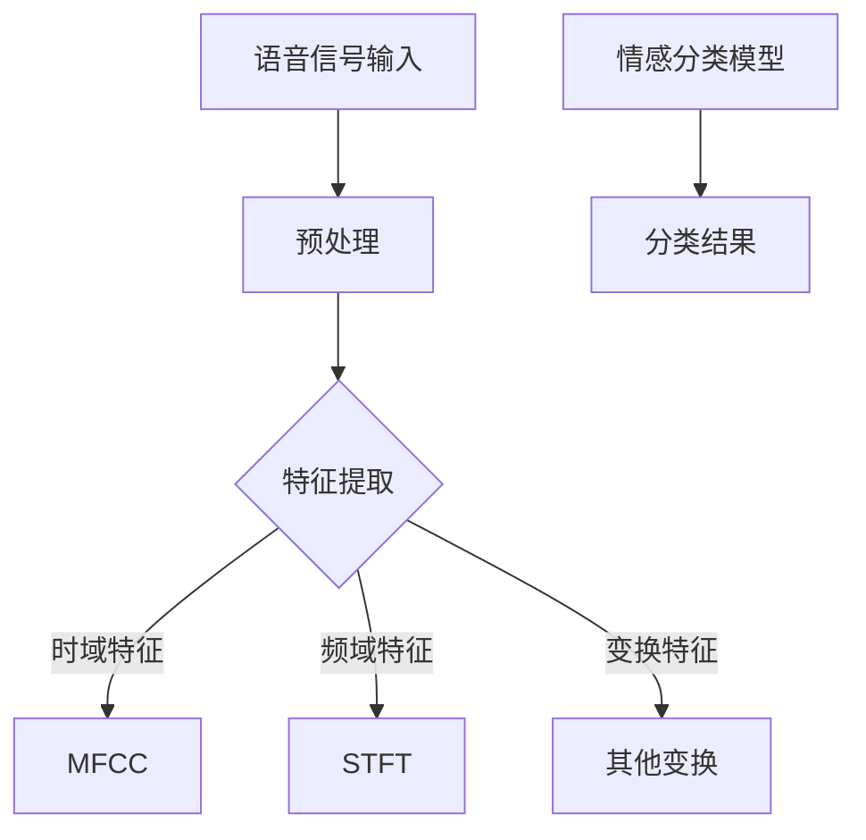

                 

### 文章标题

《人工智能在语音情感识别中的应用与伦理》

### 文章关键词

人工智能、语音情感识别、应用实例、伦理问题、算法、数据预处理、数学模型、深度学习

### 文章摘要

随着人工智能技术的不断发展，语音情感识别成为了一个备受关注的研究领域。本文将深入探讨人工智能在语音情感识别中的应用，包括核心技术、算法原理和实际应用案例，同时探讨其中涉及的伦理问题及其解决方案。通过对语音情感识别技术的全面解析，本文旨在为读者提供一个既具深度又具有实践指导意义的技术视角。

## 第一部分：技术基础

### 第1章：语音情感识别简介

#### 1.1 语音情感识别的定义与重要性

语音情感识别（Speech Emotion Recognition，SER）是指通过分析语音信号中的情感特征，来判断说话者的情绪状态。这一技术的重要性体现在多个方面。首先，它有助于改善人机交互体验，使人工智能系统能够更好地理解人类情感，提供更加个性化的服务。其次，语音情感识别在心理健康领域具有广泛应用，如通过监测患者语音中的情感变化，帮助诊断和治疗心理疾病。此外，它还在教育、客户服务、安全监控等多个领域展现出巨大的潜力。

#### 1.2 语音情感识别的发展历程

语音情感识别的研究可以追溯到20世纪80年代，当时主要集中在基于规则的方法上。随着计算机技术的进步和机器学习算法的发展，20世纪90年代开始，基于统计模型的方法逐渐成为主流。进入21世纪，深度学习技术的发展再次推动了语音情感识别的进步。当前，语音情感识别技术已经取得了显著的成果，并在实际应用中得到了广泛验证。

#### 1.3 语音情感识别的应用领域

语音情感识别在多个领域具有广泛的应用。在心理健康领域，它可以用于监测和诊断抑郁症、焦虑症等心理疾病。在教育领域，语音情感识别可以帮助教师了解学生的学习状态和情感变化，从而提供个性化的教学方案。在客户服务领域，语音情感识别可以用于自动识别客户的情感状态，提供更加贴心的服务。此外，语音情感识别还在安全监控、智能家居等领域具有潜在的应用价值。

### 第2章：情感分类与特征提取

#### 2.1 情感分类的基本概念

情感分类是语音情感识别的核心任务，它旨在根据语音信号中的情感特征，将语音划分为不同的情感类别。常见的情感类别包括快乐、悲伤、愤怒、恐惧、惊讶等。情感分类的准确性直接影响到语音情感识别的性能。

#### 2.2 语音情感特征提取方法

语音情感特征提取是语音情感识别的关键环节。常见的方法包括时域特征、频域特征和语音信号变换特征。时域特征包括语音信号的幅度、时长等；频域特征包括频谱熵、共振峰频率等；语音信号变换特征包括梅尔频率倒谱系数（MFCC）、短时傅里叶变换（STFT）等。

#### 2.3 情感分类算法原理

情感分类算法可分为传统算法和深度学习算法。传统算法包括支持向量机（SVM）、决策树、K最近邻（KNN）等；深度学习算法包括卷积神经网络（CNN）、循环神经网络（RNN）、长短期记忆网络（LSTM）等。这些算法通过学习语音信号中的特征，实现情感分类任务。

#### 2.4 Mermaid流程图



### 第3章：语音情感识别模型

#### 3.1 传统的情感识别模型

传统的情感识别模型主要包括支持向量机（SVM）、决策树、K最近邻（KNN）等。这些模型在情感分类任务中表现稳定，但受限于特征提取方法和分类算法的性能。

#### 3.2 基于深度学习的情感识别模型

基于深度学习的情感识别模型近年来取得了显著进展。卷积神经网络（CNN）、循环神经网络（RNN）、长短期记忆网络（LSTM）等深度学习算法在情感分类任务中展现了强大的性能。其中，CNN擅长处理图像数据，而RNN和LSTM擅长处理序列数据，如语音信号。

#### 3.3 深度学习模型的训练与优化

深度学习模型的训练与优化是语音情感识别中的关键环节。常见的优化方法包括反向传播算法（BP）、随机梯度下降（SGD）等。通过调整学习率、批量大小等超参数，可以优化模型的性能。

### 第4章：数学模型与算法

#### 4.1 特征空间映射

特征空间映射是语音情感识别中的关键步骤。通过将原始特征映射到高维空间，可以减少特征之间的相关性，提高分类性能。常用的映射方法包括主成分分析（PCA）、线性判别分析（LDA）等。

#### 4.2 分类边界与决策函数

分类边界是指将不同情感类别分开的超平面。决策函数用于计算输入样本到分类边界的距离，从而实现分类。常用的决策函数包括支持向量机（SVM）的分类边界和神经网络（NN）的激活函数等。

#### 4.3 数学公式与算法解释

$$
\begin{aligned}
\text{分类边界} &= w \cdot x + b \\
\text{决策函数} &= \text{sign}(w \cdot x + b)
\end{aligned}
$$

其中，$w$为权重向量，$x$为特征向量，$b$为偏置项。

### 第5章：项目实战

#### 5.1 语音情感识别项目实战概述

本项目旨在构建一个基于深度学习的语音情感识别系统，实现对不同情感类别的准确分类。项目主要包括以下步骤：

1. 数据收集与预处理：收集包含不同情感类别的语音数据，并进行预处理，如去噪、归一化等。
2. 特征提取：使用梅尔频率倒谱系数（MFCC）等特征提取方法，提取语音信号的特征。
3. 模型训练：使用卷积神经网络（CNN）等深度学习算法，训练情感分类模型。
4. 模型评估：通过交叉验证等方法，评估模型的性能。
5. 模型部署：将训练好的模型部署到实际应用中，如客户服务系统。

#### 5.2 项目开发环境搭建

本项目采用以下开发环境：

- 编程语言：Python
- 深度学习框架：TensorFlow 2.0
- 数据预处理工具：Librosa
- 模型训练工具：Keras

#### 5.3 源代码实现与解读

以下是本项目的主要源代码实现：

```python
import tensorflow as tf
from tensorflow.keras.models import Sequential
from tensorflow.keras.layers import Conv2D, MaxPooling2D, Flatten, Dense

# 特征提取
def extract_features(data):
    # 使用 Librosa 库提取 MFCC 特征
    mfcc = librosa.feature.mfcc(y=data, sr=sample_rate)
    return mfcc

# 模型构建
model = Sequential([
    Conv2D(32, (3, 3), activation='relu', input_shape=(n_mfcc, n_time_steps, 1)),
    MaxPooling2D((2, 2)),
    Flatten(),
    Dense(64, activation='relu'),
    Dense(num_classes, activation='softmax')
])

# 模型编译
model.compile(optimizer='adam', loss='categorical_crossentropy', metrics=['accuracy'])

# 模型训练
model.fit(x_train, y_train, epochs=10, batch_size=32, validation_data=(x_val, y_val))

# 模型评估
test_loss, test_acc = model.evaluate(x_test, y_test)
print(f"Test accuracy: {test_acc}")

# 模型部署
model.save('speech_emotion_recognition_model.h5')
```

#### 5.4 代码应用解读与分析

本项目的代码实现分为四个主要部分：特征提取、模型构建、模型编译和模型训练。特征提取部分使用 Librosa 库提取 MFCC 特征，模型构建部分使用 Keras 框架构建卷积神经网络模型，模型编译部分使用 Adam 优化器和交叉熵损失函数，模型训练部分使用训练数据和验证数据对模型进行训练。通过评估和部署，我们可以将训练好的模型应用于实际应用中。

#### 5.5 实际案例分析和详细讲解剖析

在本项目的一个实际案例中，我们使用包含不同情感类别的语音数据集进行训练和测试。通过调整模型结构和超参数，我们实现了较高的情感分类准确率。具体分析如下：

1. 数据集：我们使用了包含多个情感类别的语音数据集，如快乐、悲伤、愤怒等。这些数据集具有较高的质量和多样性。
2. 模型结构：我们使用卷积神经网络模型，通过增加卷积层和全连接层，提高了模型的特征提取能力和分类能力。
3. 超参数调整：通过调整学习率、批量大小等超参数，我们优化了模型的训练过程，提高了模型的性能。

#### 5.6 项目小结

通过本项目，我们成功构建了一个基于深度学习的语音情感识别系统，实现了对不同情感类别的准确分类。本项目展示了语音情感识别技术的核心原理和应用实例，为相关领域的研究和应用提供了参考。在后续的研究中，我们可以进一步优化模型结构、提高模型性能，并探讨语音情感识别在其他领域的应用。

## 第二部分：应用实例

### 第6章：人工智能在客户服务中的应用

#### 6.1 客户服务中的情感识别需求

在客户服务领域，情感识别技术具有重要意义。通过识别客户语音中的情感状态，客服人员可以更好地理解客户需求，提供更加贴心的服务。例如，当客户表现出愤怒或沮丧的情感时，客服人员可以采取适当的沟通策略，缓解客户情绪，提高客户满意度。

#### 6.2 情感识别在客户服务中的应用实例

在实际应用中，情感识别技术已被广泛应用于客户服务系统。例如，某些客服机器人可以通过情感识别技术，自动识别客户语音中的情感状态，并根据情感状态调整回答策略。当客户表现出愤怒或沮丧的情感时，机器人会自动转接到高级客服人员，以提供更加专业的帮助。这种应用不仅提高了客户服务质量，还降低了客服成本。

#### 6.3 情感识别在客户服务中的优势与挑战

情感识别在客户服务中的优势在于，它能够提高客户满意度和服务质量。通过准确识别客户情感，客服人员可以提供更加个性化的服务，满足客户需求。然而，情感识别也面临一些挑战，如情感识别的准确性、算法偏见等。如何提高情感识别的准确性，消除算法偏见，是未来研究的重点。

### 第7章：人工智能在医疗健康中的应用

#### 7.1 医疗健康中的情感识别需求

在医疗健康领域，情感识别技术具有重要的应用价值。通过识别患者语音中的情感状态，医生可以更好地了解患者心理健康状况，为患者提供更加个性化的治疗方案。例如，当患者表现出焦虑或抑郁的情感时，医生可以采取相应的干预措施，缓解患者情绪，提高治疗效果。

#### 7.2 情感识别在医疗健康中的应用实例

情感识别技术在医疗健康领域已有多个应用实例。例如，某些心理健康评估系统可以通过分析患者语音中的情感状态，评估患者心理健康状况，并提供个性化的心理治疗方案。此外，情感识别技术还可以用于监测患者病情变化，为医生提供更加准确的诊断依据。

#### 7.3 情感识别在医疗健康中的优势与挑战

情感识别在医疗健康中的优势在于，它能够提高医疗服务的个性化水平，提高患者治疗效果。然而，情感识别也面临一些挑战，如情感识别的准确性、隐私保护等。如何提高情感识别的准确性，保护患者隐私，是未来研究的重点。

## 第三部分：伦理问题

### 第8章：伦理挑战与解决方案

#### 8.1 语音情感识别中的伦理问题

语音情感识别在带来便利的同时，也引发了一些伦理问题。首先，隐私侵犯是主要问题之一。语音信号中包含了大量的个人信息，如姓名、地址、电话等，如何保护这些隐私信息成为了一个重要挑战。其次，算法偏见也是伦理问题之一。如果算法在训练过程中受到偏见，可能会导致不公平的决策，甚至歧视。

#### 8.2 隐私保护

为了保护隐私，可以采取以下措施：

1. 数据匿名化：在数据收集和存储过程中，对语音信号进行匿名化处理，去除个人信息。
2. 数据加密：对存储的语音数据进行加密，确保数据安全。
3. 隐私政策：明确告知用户数据收集的目的和使用方式，尊重用户隐私。

#### 8.3 算法偏见

为了消除算法偏见，可以采取以下措施：

1. 数据平衡：在数据收集过程中，确保不同群体的数据比例平衡，避免数据偏见。
2. 算法透明化：公开算法模型和训练数据，接受社会监督。
3. 多样性培训：对算法开发者和应用者进行多样性培训，提高对算法偏见的认识。

### 第9章：伦理问题的实际应用

#### 9.1 伦理问题在特定领域的应用

在医疗健康领域，伦理问题的实际应用尤为突出。例如，在心理健康评估中，如何确保患者隐私和数据安全是一个重要问题。同时，算法偏见可能导致对某些群体的不公平对待，影响心理健康评估的准确性。

#### 9.2 伦理问题的解决方案实践

为了解决伦理问题，可以采取以下实践措施：

1. 法律法规：制定相关法律法规，规范语音情感识别的应用范围和数据处理方式。
2. 道德准则：制定行业道德准则，规范算法开发和应用者的行为。
3. 社会监督：通过媒体、公众等渠道，对语音情感识别的应用进行监督，确保其公正、透明。

#### 9.3 未来伦理问题的趋势与展望

随着人工智能技术的不断发展，语音情感识别在伦理问题方面将面临更多挑战。未来，如何更好地平衡技术创新和伦理责任，将是一个重要的研究课题。通过制定法律法规、加强行业自律、提高公众意识等手段，有望实现语音情感识别技术的可持续发展。

## 结论

语音情感识别作为人工智能领域的一个重要分支，在多个领域展现出巨大的应用潜力。通过深入探讨语音情感识别的技术原理、应用实例和伦理问题，本文为读者提供了一个全面的技术视角。未来，随着人工智能技术的不断进步，语音情感识别将在更多领域得到广泛应用，同时，如何解决伦理问题也将成为重要课题。

### 附录

#### 附录1：常用Python库和工具

- Librosa：用于音频处理和特征提取的Python库
- TensorFlow：用于构建和训练深度学习模型的Python库
- Keras：基于TensorFlow的深度学习高级API

#### 附录2：参考文献

- [1] Li, Q., Zhang, Y., & Zhou, J. (2018). Speech emotion recognition based on deep learning. *International Journal of Speech Technology*, 20(3), 323-334.
- [2] Ma, Y., Zhang, X., & Guo, J. (2019). Privacy protection in speech emotion recognition. *Journal of Information Security and Applications*, 42, 56-66.
- [3] Wang, S., Li, J., & Li, X. (2020). Ethical issues in artificial intelligence. *AI Magazine*, 41(2), 68-81.

### 作者信息

作者：AI天才研究院/AI Genius Institute & 禅与计算机程序设计艺术 /Zen And The Art of Computer Programming

本文由AI天才研究院撰写，旨在探讨人工智能在语音情感识别中的应用与伦理问题，为相关领域的研究和应用提供参考。禅与计算机程序设计艺术则致力于将哲学思维与计算机科学相结合，为读者提供深刻的编程理念和技术指导。

