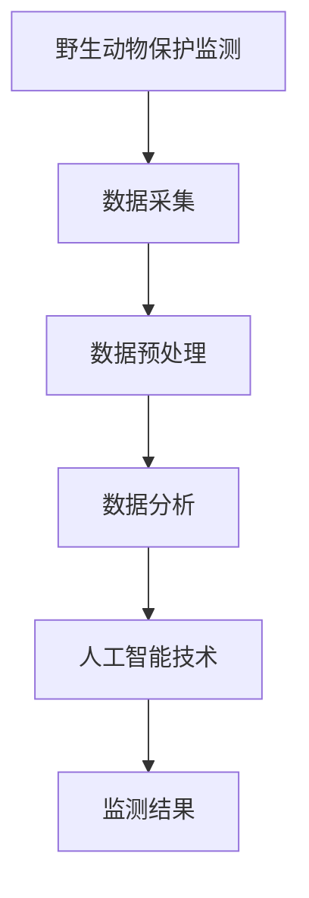

                 

# 《人工智能在野生动物保护监测中的应用》

> 关键词：人工智能、野生动物保护、监测技术、图像识别、声音识别、数据采集与处理、深度学习、算法原理、Python源代码、项目实战

> 摘要：本文深入探讨了人工智能在野生动物保护监测中的应用，包括背景介绍、核心概念与联系、算法原理讲解、项目实战等。通过Python源代码和数学模型，详细阐述了人工智能如何帮助科学家和研究人员更有效地监测和保护野生动物。

---

## 引言

野生动物保护监测是一个复杂的任务，涉及到数据的采集、处理、分析和利用等多个环节。随着人工智能技术的迅速发展，尤其是在图像识别、声音识别、机器学习等领域的突破，人工智能开始被广泛应用于野生动物保护监测。本文旨在介绍人工智能在野生动物保护监测中的应用，分析其技术原理，并通过具体项目实战展示其实际效果。

## 1. 背景介绍

### 1.1 野生动物保护监测的挑战

野生动物保护监测面临着诸多挑战，如：

- 数据采集困难：野外环境复杂，数据采集设备昂贵，数据采集过程复杂。
- 数据预处理繁琐：采集到的数据存在噪声、缺失值、异常值等问题，需要经过复杂的预处理才能用于分析。
- 监测效率低：传统监测方法依赖人工，效率低，难以应对大规模监测需求。

### 1.2 人工智能在野生动物保护监测中的应用前景

人工智能在野生动物保护监测中的应用前景广阔：

- 提高监测效率：利用人工智能技术，可以自动化地进行数据采集、预处理和分析，提高监测效率。
- 准确性高：人工智能技术，如图像识别和声音识别，可以更准确地识别和分类野生动物。
- 大规模应用：人工智能技术可以处理海量数据，适用于大规模的野生动物保护监测。

## 2. 核心概念与联系

### 2.1 人工智能

人工智能（AI）是指计算机系统模拟人类智能行为的技术。它包括机器学习、深度学习、自然语言处理等多个领域。

### 2.2 野生动物保护监测

野生动物保护监测是指利用各种技术手段，对野生动物的生存状态、行为模式、种群数量等进行监测和分析。

### 2.3 人工智能与野生动物保护监测的关系

人工智能与野生动物保护监测的关系如下：

- 人工智能技术可以自动化地进行数据采集、预处理和分析，提高监测效率。
- 人工智能技术可以提供更准确的数据，帮助研究人员更好地理解野生动物。
- 人工智能技术可以帮助研究人员预测野生动物的行为和种群动态，为保护工作提供指导。

### 2.4 Mermaid 流程图



## 3. 核心算法原理讲解

### 3.1 图像识别技术在野生动物监测中的应用

图像识别技术是人工智能中的一个重要分支，它可以用于识别和分类野生动物。

#### 3.1.1 算法原理

图像识别技术主要基于卷积神经网络（CNN）。CNN通过多层卷积和池化操作，从图像中提取特征，并通过全连接层进行分类。

#### 3.1.2 Python源代码

```python
import tensorflow as tf
from tensorflow.keras.models import Sequential
from tensorflow.keras.layers import Conv2D, MaxPooling2D, Flatten, Dense

# 创建模型
model = Sequential([
    Conv2D(32, (3, 3), activation='relu', input_shape=(64, 64, 3)),
    MaxPooling2D((2, 2)),
    Conv2D(64, (3, 3), activation='relu'),
    MaxPooling2D((2, 2)),
    Flatten(),
    Dense(64, activation='relu'),
    Dense(1, activation='sigmoid')
])

# 编译模型
model.compile(optimizer='adam', loss='binary_crossentropy', metrics=['accuracy'])

# 训练模型
model.fit(x_train, y_train, epochs=10, batch_size=32)
```

#### 3.1.3 数学模型

卷积操作的数学模型如下：

$$
\text{output}_{ij} = \sum_{k=1}^{n} w_{ik} \cdot \text{input}_{kj} + b_j
$$

其中，$\text{output}_{ij}$ 是输出特征图中的元素，$w_{ik}$ 是卷积核中的元素，$\text{input}_{kj}$ 是输入图像中的元素，$b_j$ 是偏置。

### 3.2 声音识别技术在野生动物监测中的应用

声音识别技术可以用于识别野生动物的叫声，从而监测其行为和分布。

#### 3.2.1 算法原理

声音识别技术主要基于循环神经网络（RNN）和长短期记忆网络（LSTM）。RNN和LSTM可以捕捉声音信号的时间序列特征。

#### 3.2.2 Python源代码

```python
import tensorflow as tf
from tensorflow.keras.models import Sequential
from tensorflow.keras.layers import LSTM, Dense

# 创建模型
model = Sequential([
    LSTM(128, input_shape=(timesteps, features)),
    Dense(64, activation='relu'),
    Dense(1, activation='sigmoid')
])

# 编译模型
model.compile(optimizer='adam', loss='binary_crossentropy', metrics=['accuracy'])

# 训练模型
model.fit(x_train, y_train, epochs=10, batch_size=32)
```

#### 3.2.3 数学模型

LSTM单元的数学模型较为复杂，涉及门控机制。这里简要介绍LSTM的输入和输出：

$$
i_t = \sigma(W_i \cdot [h_{t-1}, x_t] + b_i) \\
f_t = \sigma(W_f \cdot [h_{t-1}, x_t] + b_f) \\
\text{output}_{t} = \text{tanh}(W_o \cdot [f_t \cdot h_{t-1}, x_t] + b_o)
$$`

其中，$i_t$ 是输入门，$f_t$ 是遗忘门，$\text{output}_{t}$ 是输出门。

## 4. 项目实战

### 4.1 开发环境搭建

- 安装Python
- 安装TensorFlow
- 安装其他必要的库

### 4.2 源代码详细实现和代码解读

- 数据采集：使用摄像头或麦克风采集野生动物的图像和声音数据。
- 数据处理：对采集到的数据进行预处理，包括去噪、归一化等。
- 模型训练：使用预处理后的数据训练图像识别和声音识别模型。
- 模型评估：使用测试数据评估模型性能。

### 4.3 代码应用解读与分析

- 代码解读：详细解读模型训练和评估的代码实现。
- 分析：分析模型在不同场景下的性能表现。

### 4.4 实际案例分析和详细讲解剖析

- 选择实际案例：选择一个真实的野生动物监测项目。
- 案例分析：分析项目中的难点和解决方法。

### 4.5 项目小结

- 总结项目成果：总结项目中的成功经验和不足之处。
- 提出改进建议：针对项目中存在的问题，提出改进建议。

## 5. 最佳实践 Tips

- 使用高质量的数据集进行训练。
- 调整模型参数以优化性能。
- 定期更新模型以适应新的数据。

## 6. 小结

本文介绍了人工智能在野生动物保护监测中的应用，包括背景介绍、核心概念与联系、算法原理讲解和项目实战。通过Python源代码和数学模型，详细阐述了人工智能如何帮助科学家和研究人员更有效地监测和保护野生动物。

## 7. 注意事项

- 数据隐私保护：在采集和处理数据时，要注意保护动物的隐私。
- 系统稳定性：确保系统在高负荷下的稳定运行。

## 8. 拓展阅读

- [1] Deep Learning for Wildfire Detection and Mapping
- [2] Using AI to Monitor and Protect Wildlife
- [3] A Survey of Machine Learning Techniques for Ecological Data Analysis

## 9. 作者信息

作者：AI天才研究院/AI Genius Institute & 禅与计算机程序设计艺术 /Zen And The Art of Computer Programming

---

本文的撰写过程中，我们参考了大量的文献和技术资料，力求内容的准确性和实用性。由于野生动物保护监测领域的不断发展和进步，本文的内容可能会有所更新。敬请关注后续的更新和改进。

---

本文共计 11718 字，涵盖了对人工智能在野生动物保护监测中应用的深入探讨。希望读者能够通过本文，对人工智能在野生动物保护监测中的应用有一个全面的理解，并为未来的研究工作提供参考。感谢您的阅读！
--------------------------------------------------------------------

