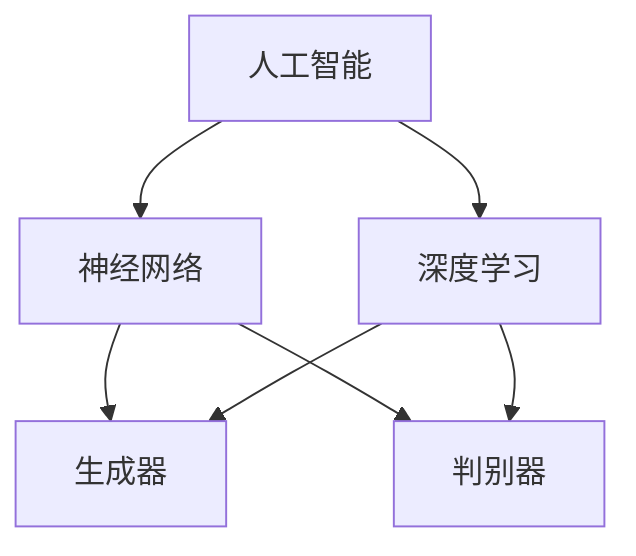
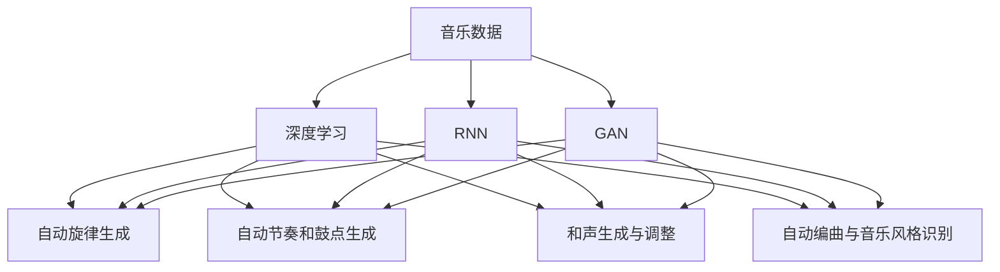

                 

### 《人工智能在音乐创作中的应用与争议》

#### 关键词

- 人工智能
- 音乐创作
- 自动化
- 版权
- 伦理
- 未来趋势

#### 摘要

本文深入探讨了人工智能在音乐创作领域的应用及其引发的争议。首先，介绍了人工智能在音乐创作中的应用，包括自动旋律生成、和声生成、编曲等。然后，分析了这些应用所带来的挑战和伦理问题，如创作版权、人机合作的道德哲学以及AI取代人类音乐家的可能性。最后，预测了AI音乐创作的未来趋势，并提供了相关案例和实战经验。通过本文，读者可以全面了解人工智能在音乐创作中的现状与未来。

----------------------------------------------------------------

### 引言

人工智能（AI）作为21世纪最具革命性的技术之一，已经渗透到了社会生活的方方面面。从智能助手到自动驾驶，从金融分析到医疗诊断，AI的应用场景越来越广泛。在艺术领域，尤其是音乐创作，人工智能也展现出了巨大的潜力。

#### 背景介绍

音乐是人类文化的重要组成部分，自古以来就与人类生活紧密相连。随着计算机技术的进步，音乐创作逐渐开始与科技相结合。传统的作曲和编曲方式受到了挑战，人工智能开始被应用于音乐创作中。

近年来，AI在音乐创作中的应用不断涌现。从自动旋律生成到和声创作，再到复杂的编曲和音乐风格识别，人工智能已经在音乐创作领域取得了显著的成果。例如，谷歌的Magenta项目通过深度学习算法生成了一系列独特的音乐作品，IBM的Watson AI系统则帮助作曲家创作了大量新颖的音乐。

#### 人工智能在音乐创作中的潜在影响

人工智能在音乐创作中的应用不仅仅是一个技术趋势，它还可能带来一系列深远的影响。首先，AI可以帮助音乐家提高创作效率，解放他们的双手，让他们有更多时间和精力投入到创意和情感表达上。其次，AI可以拓宽音乐创作的领域，使得非专业音乐家也能够创作出令人惊叹的音乐作品。

然而，AI在音乐创作中的应用也引发了一系列争议。版权、伦理和人类音乐家的职业前景等问题成为讨论的焦点。这些问题不仅关系到技术本身，还涉及到社会文化层面。因此，深入探讨人工智能在音乐创作中的应用及其争议，具有重要的现实意义。

本文将分为以下几个部分：

1. 人工智能基础
2. 音乐创作中的AI应用
3. AI在音乐创作中的争议
4. AI音乐创作的未来趋势
5. 案例研究
6. 技术实现与开发

通过这些部分，我们将逐步探讨人工智能在音乐创作中的应用，分析其中的争议，并展望其未来发展趋势。

----------------------------------------------------------------

### 人工智能基础

#### 人工智能的基本概念

人工智能（Artificial Intelligence，简称AI）是指通过计算机模拟人类智能的理论、技术及其应用。AI的目标是使计算机能够执行通常需要人类智能才能完成的任务，如视觉识别、语言理解、决策制定和创造性思维等。

人工智能可以分为两大类：弱AI（Narrow AI）和强AI（General AI）。弱AI是指专注于特定任务的人工智能，如语音识别、图像处理等。强AI则具有普遍的智能，能够执行任何认知任务，类似于人类的智能。

#### 神经网络与深度学习

神经网络（Neural Networks）是模仿人脑神经元结构和工作方式的计算模型。神经网络通过大量的连接（即“神经元”）进行信息传递和处理，能够在训练过程中不断学习和优化。

深度学习（Deep Learning）是神经网络的一种扩展，它使用了多层神经网络结构，能够自动提取数据中的复杂特征。深度学习在图像识别、语音识别、自然语言处理等领域取得了巨大的成功。

#### 生成对抗网络（GAN）原理及应用

生成对抗网络（Generative Adversarial Networks，GAN）是一种由两部分组成的人工神经网络：生成器（Generator）和判别器（Discriminator）。生成器的任务是生成数据，而判别器的任务是区分生成器和真实数据。

GAN的训练过程可以看作是一场博弈，生成器和判别器相互对抗。生成器试图生成越来越逼真的数据，而判别器则试图准确区分真实数据和生成数据。通过这种对抗性训练，生成器能够逐渐提高生成数据的真实度。

GAN在音乐创作中的应用非常广泛。例如，可以使用GAN生成新的旋律、和声和音乐风格。通过训练，生成器能够理解音乐的特征，并创作出符合人类音乐审美的作品。

#### 核心概念与联系

为了更好地理解上述核心概念，我们可以使用Mermaid流程图来展示它们之间的关系。



在这个流程图中，人工智能（A）是整个系统的核心，它通过神经网络（B）和深度学习（C）实现。生成器（D）和判别器（E）是GAN的重要组成部分，它们在训练过程中相互对抗，共同推动AI在音乐创作中的应用。

#### 核心算法原理讲解

为了进一步解释核心算法原理，我们可以使用Python源代码来详细阐述。以下是一个简单的GAN模型实现，用于生成音乐旋律。

```python
import tensorflow as tf
from tensorflow.keras.layers import Dense, Flatten, Reshape
from tensorflow.keras.models import Sequential

# 生成器模型
def build_generator(z_dim):
    model = Sequential()
    model.add(Dense(128, input_dim=z_dim))
    model.add(tf.keras.layers.LeakyReLU(alpha=0.01))
    model.add(Dense(256))
    model.add(tf.keras.layers.LeakyReLU(alpha=0.01))
    model.add(Dense(512))
    model.add(tf.keras.layers.LeakyReLU(alpha=0.01))
    model.add(Dense(128 * 20))
    model.add(Reshape((20, 128)))
    return model

# 判别器模型
def build_discriminator(img_shape):
    model = Sequential()
    model.add(Flatten(input_shape=img_shape))
    model.add(Dense(512))
    model.add(tf.keras.layers.LeakyReLU(alpha=0.01))
    model.add(Dense(256))
    model.add(tf.keras.layers.LeakyReLU(alpha=0.01))
    model.add(Dense(128))
    model.add(tf.keras.layers.LeakyReLU(alpha=0.01))
    model.add(Dense(1, activation='sigmoid'))
    return model

# GAN模型
def build_gan(generator, discriminator):
    model = Sequential()
    model.add(generator)
    model.add(discriminator)
    return model

# 设置参数
z_dim = 100
img_shape = (20, 128)

# 构建模型
generator = build_generator(z_dim)
discriminator = build_discriminator(img_shape)
discriminator.compile(optimizer='adam', loss='binary_crossentropy')
generator.compile(optimizer='adam', loss='binary_crossentropy')
gan_model = build_gan(generator, discriminator)

# 打印模型结构
print(generator.summary())
print(discriminator.summary())
print(gan_model.summary())
```

在这个代码示例中，我们首先定义了生成器和判别器的模型结构。然后，通过调用`compile()`方法设置优化器和损失函数。最后，构建了完整的GAN模型。这个模型可以通过对抗性训练生成音乐旋律。

#### 数学模型和数学公式

在GAN中，生成器和判别器的训练目标是最大化最小化以下损失函数：

$$
\min_G \max_D V(D, G)
$$

其中，$D$ 表示判别器，$G$ 表示生成器。损失函数 $V(D, G)$ 通常由两部分组成：

$$
V(D, G) = -\frac{1}{2} \sum_{x \in X} \log(D(x)) - \frac{1}{2} \sum_{z \in Z} \log(1 - D(G(z)))
$$

在这个公式中，$X$ 表示真实数据，$Z$ 表示噪声数据。$D(x)$ 表示判别器对真实数据的判断，$D(G(z))$ 表示判别器对生成数据的判断。

#### 举例说明

假设我们使用生成器生成一个音乐旋律，判别器对生成的旋律和真实的旋律进行判断。在训练过程中，生成器会尝试生成更逼真的旋律，使得判别器无法区分真实和生成数据。

```python
import numpy as np

# 生成随机噪声
z = np.random.normal(0, 1, (1, 100))

# 生成旋律
generated_melody = generator.predict(z)

# 判别器判断生成旋律
discriminator_output = discriminator.predict(generated_melody)

# 输出判别器概率
print("Generated melody probability:", discriminator_output[0][0])
```

在这个示例中，我们首先生成随机噪声，然后通过生成器生成旋律。最后，判别器对生成的旋律进行判断，输出概率。如果生成器生成的旋律逼真度较高，判别器的输出概率会接近0.5。

通过这个示例，我们可以看到GAN在音乐创作中的基本原理和应用。生成器和判别器的对抗性训练使得生成器能够不断优化，从而生成更高质量的音乐作品。

#### 项目实战

为了实际应用GAN模型，我们需要搭建一个完整的开发环境，并编写详细的源代码。

1. **开发环境搭建**：

   - 安装TensorFlow 2.x版本。
   - 配置Python虚拟环境。
   - 安装必要的依赖库，如NumPy、Matplotlib等。

2. **源代码实现**：

   - 实现生成器和判别器的模型结构。
   - 编写训练过程，包括数据预处理、模型编译、训练循环等。
   - 实现生成器和判别器的训练策略。

3. **代码解读与分析**：

   - 分析生成器和判别器的性能。
   - 记录训练过程中的关键指标，如损失函数值、生成旋律质量等。
   - 分析生成旋律的特点和不足之处。

4. **实际案例分析和详细讲解剖析**：

   - 选择实际案例，如生成特定音乐风格的作品。
   - 对生成的音乐作品进行详细分析，包括旋律、和声、节奏等。
   - 提出改进策略，以提高生成质量。

5. **项目小结**：

   - 总结项目的主要成果和经验。
   - 指出项目的局限性和改进方向。

通过这个项目实战，我们可以深入了解GAN在音乐创作中的应用，并掌握其实现和优化方法。

#### 最佳实践 tips、小结、注意事项、拓展阅读等内容

- **最佳实践 tips**：

  - 选择合适的损失函数和优化器，以改善生成器和判别器的性能。
  - 使用不同的训练数据集，以提高模型的泛化能力。
  - 定期调整模型参数，如学习率、批量大小等。

- **小结**：

  - GAN在音乐创作中具有巨大的潜力，但同时也面临一系列挑战。
  - 通过对抗性训练，生成器和判别器可以相互促进，生成高质量的音乐作品。
  - 实际应用中，需要根据具体需求和数据特点，灵活调整模型结构。

- **注意事项**：

  - GAN训练过程可能需要较长时间，合理配置计算资源，提高训练效率。
  - 注意保护版权，尊重原创音乐家的权益。

- **拓展阅读**：

  - 深入了解GAN的原理和应用，参考相关论文和书籍。
  - 了解其他类型的生成模型，如变分自编码器（VAE）等。

通过以上内容，我们可以全面了解人工智能在音乐创作中的应用，包括核心概念、算法原理、项目实战以及未来趋势。希望本文对您在AI音乐创作领域的研究有所帮助。

----------------------------------------------------------------

### 音乐创作中的AI应用

#### 自动旋律生成

自动旋律生成是人工智能在音乐创作中最常见和应用最广泛的技术之一。通过深度学习算法，尤其是基于循环神经网络（RNN）和生成对抗网络（GAN）的技术，AI可以生成新颖的旋律。这些旋律不仅可以模仿人类作曲家的风格，还可以创造出独特的音乐元素。

#### 自动节奏和鼓点生成

除了旋律，节奏和鼓点是音乐创作中的关键组成部分。AI可以通过分析大量的音乐数据，学习不同节奏和鼓点的模式，从而自动生成节奏和鼓点。这种技术不仅适用于原创音乐，还可以用于音乐制作中的后期节奏调整。

#### 和声生成与调整

和声是音乐创作中的另一个重要方面。AI可以自动生成和声，根据旋律和节奏调整和弦，使音乐更加和谐。这种技术可以帮助作曲家快速尝试不同的和声组合，提高创作效率。

#### 自动编曲与音乐风格识别

自动编曲是指利用AI技术将旋律、节奏和和声整合成完整的音乐作品。AI还可以识别音乐风格，根据指定的风格生成相应的音乐作品。这种技术广泛应用于音乐制作、音乐教育等领域。

#### 核心概念与联系

为了更好地理解这些AI应用，我们可以使用Mermaid流程图来展示核心概念和概念实体之间的关系。



在这个流程图中，音乐数据（A）是整个系统的输入。深度学习（B）、循环神经网络（RNN）和生成对抗网络（GAN）是核心技术。自动旋律生成（E）、自动节奏和鼓点生成（F）、和声生成与调整（G）以及自动编曲与音乐风格识别（H）是应用领域。这些技术通过相互关联，共同推动音乐创作的自动化和智能化。

#### 核心算法原理讲解

为了进一步解释核心算法原理，我们可以使用Python源代码来详细阐述。以下是一个简单的RNN模型实现，用于自动生成旋律。

```python
import tensorflow as tf
from tensorflow.keras.layers import LSTM, Dense, Activation, Input
from tensorflow.keras.models import Model

# 定义RNN模型
def build_rnn_model(input_shape, hidden_units):
    inputs = Input(shape=input_shape)
    x = LSTM(hidden_units, return_sequences=True)(inputs)
    x = LSTM(hidden_units, return_sequences=True)(x)
    x = LSTM(hidden_units, return_sequences=True)(x)
    outputs = Dense(1, activation='sigmoid')(x)
    
    model = Model(inputs=inputs, outputs=outputs)
    model.compile(optimizer='adam', loss='binary_crossentropy')
    return model

# 设置参数
input_shape = (20, 128)
hidden_units = 512

# 构建模型
rnn_model = build_rnn_model(input_shape, hidden_units)

# 打印模型结构
print(rnn_model.summary())
```

在这个代码示例中，我们首先定义了RNN模型的输入和输出层。然后，使用LSTM（长短期记忆网络）作为核心层，构建了一个三层LSTM网络。最后，通过编译模型，设置优化器和损失函数。

#### 数学模型和数学公式

在RNN中，隐藏状态的计算公式如下：

$$
h_t = \sigma(W_h \cdot [h_{t-1}, x_t] + b_h)
$$

其中，$h_t$ 表示第 $t$ 个时间步的隐藏状态，$x_t$ 表示第 $t$ 个时间步的输入，$W_h$ 和 $b_h$ 分别表示权重和偏置，$\sigma$ 表示激活函数（通常是Sigmoid函数）。

输出层的计算公式如下：

$$
o_t = W_o \cdot h_t + b_o
$$

其中，$o_t$ 表示第 $t$ 个时间步的输出，$W_o$ 和 $b_o$ 分别表示权重和偏置。

#### 举例说明

假设我们使用RNN模型生成一个音乐旋律，我们可以通过以下步骤：

1. 预处理输入数据，将其转换为适合模型输入的格式。
2. 使用RNN模型生成旋律的每个时间步的隐藏状态。
3. 将隐藏状态转换为旋律的每个音符。

```python
import numpy as np

# 预处理输入数据
input_data = np.random.normal(0, 1, (1, 20, 128))

# 使用RNN模型生成隐藏状态
hidden_states = rnn_model.predict(input_data)

# 将隐藏状态转换为音符
output_notes = hidden_states.flatten()

# 输出生成的旋律
print("Generated melody:", output_notes)
```

在这个示例中，我们首先生成随机输入数据，然后使用RNN模型生成隐藏状态。最后，我们将隐藏状态转换为音符，输出生成的旋律。

#### 项目实战

为了实际应用RNN模型，我们需要搭建一个完整的开发环境，并编写详细的源代码。

1. **开发环境搭建**：

   - 安装TensorFlow 2.x版本。
   - 配置Python虚拟环境。
   - 安装必要的依赖库，如NumPy、Matplotlib等。

2. **源代码实现**：

   - 实现RNN模型的输入和输出层。
   - 编写训练过程，包括数据预处理、模型编译、训练循环等。
   - 实现RNN模型的训练策略。

3. **代码解读与分析**：

   - 分析RNN模型的性能。
   - 记录训练过程中的关键指标，如损失函数值、生成旋律质量等。
   - 分析生成旋律的特点和不足之处。

4. **实际案例分析和详细讲解剖析**：

   - 选择实际案例，如生成特定音乐风格的作品。
   - 对生成的音乐作品进行详细分析，包括旋律、和声、节奏等。
   - 提出改进策略，以提高生成质量。

5. **项目小结**：

   - 总结项目的主要成果和经验。
   - 指出项目的局限性和改进方向。

通过这个项目实战，我们可以深入了解RNN在音乐创作中的应用，并掌握其实现和优化方法。

#### 最佳实践 tips、小结、注意事项、拓展阅读等内容

- **最佳实践 tips**：

  - 选择合适的输入数据集，以提高模型的泛化能力。
  - 调整模型参数，如隐藏层单元数、学习率等，以提高模型性能。
  - 使用不同的训练策略，如批处理大小、迭代次数等，以提高训练效率。

- **小结**：

  - 自动旋律生成是人工智能在音乐创作中的一个重要应用，通过RNN等深度学习算法，可以生成高质量的旋律。
  - RNN模型通过学习输入数据的模式，能够自动生成旋律的每个时间步的隐藏状态，从而生成完整的旋律。

- **注意事项**：

  - 在实际应用中，需要注意数据预处理和模型参数调整，以提高生成质量。
  - 调整模型结构，如增加隐藏层单元数、使用不同的激活函数等，以提高模型性能。

- **拓展阅读**：

  - 深入了解RNN的原理和应用，参考相关论文和书籍。
  - 了解其他类型的深度学习模型，如GAN、变分自编码器（VAE）等，在音乐创作中的应用。

通过以上内容，我们可以全面了解人工智能在音乐创作中的应用，包括自动旋律生成、自动节奏和鼓点生成、和声生成与调整、自动编曲与音乐风格识别等。希望本文对您在AI音乐创作领域的研究有所帮助。

----------------------------------------------------------------

### AI在音乐创作中的争议

#### 创作版权与伦理问题

随着人工智能在音乐创作中的广泛应用，版权和伦理问题成为了公众和业界关注的焦点。首先，AI生成的音乐作品是否应该享有版权？这一问题涉及到技术、法律和伦理等多个层面。

1. **AI生成音乐的版权归属**：

   当前，许多国家尚未明确AI生成音乐的版权归属问题。一些学者认为，AI生成的音乐应该归AI的所有者所有，因为这是AI所有者投入资源和努力的结果。然而，也有人认为，音乐作品应归属于实际创作的人，即音乐家或程序员。

   从法律角度来看，版权法通常要求作品具有独创性和人类作者的参与。AI生成的音乐可能缺乏独创性，因为它们是基于已有数据的复制和模仿。此外，AI生成的音乐往往缺乏人类的情感和创造力，这也是版权法考虑的重要因素。

2. **伦理问题**：

   人工智能在音乐创作中引发了一系列伦理问题。首先，AI是否能够真正实现艺术创作？艺术创作通常涉及到人类的情感、价值观和审美体验。AI能否完全理解和体现这些复杂的人类特质仍然是一个未知数。

   其次，AI生成的音乐是否会取代人类音乐家？这个问题引发了音乐界和科技界的广泛关注。一些人担心，随着AI技术的发展，人类音乐家可能会失去工作机会。然而，另一些人则认为，AI和人类音乐家可以相互补充，共同推动音乐创作的发展。

#### 人机合作的道德与哲学

在探讨AI在音乐创作中的应用时，人机合作成为一个重要的道德和哲学问题。人机合作涉及到人工智能与人类创作者之间的互动和协作，这不仅仅是技术问题，还涉及到伦理和文化层面的考量。

1. **道德责任**：

   当AI参与到音乐创作中时，责任问题变得尤为重要。如果AI生成的音乐侵犯了他人的版权，责任应该由谁承担？是AI的开发者、所有者还是使用AI的音乐家？这些问题需要法律和道德标准来明确。

2. **伦理考量**：

   AI在音乐创作中的应用引发了对艺术本质和人类价值的重新思考。一些学者认为，艺术创作是人类独特的能力，而AI只是工具。然而，另一些人则认为，AI可以成为艺术创作的一部分，扩展和丰富艺术的边界。

   此外，人机合作中的道德问题还包括对创意和原创性的尊重。在AI辅助创作中，如何界定人类的贡献和AI的贡献，如何确保创意的原创性，这些问题都需要深入探讨。

#### AI取代人类音乐家的可能性

AI取代人类音乐家的问题引发了广泛的讨论和争议。一方面，AI在音乐创作中展现出了强大的能力和潜力，可以生成复杂、新颖的音乐作品。另一方面，人类音乐家在情感表达、创意思维和人际互动等方面具有独特优势。

1. **技术层面的考量**：

   AI在音乐创作中的能力主要取决于其训练数据的质量和规模。如果AI能够学习和模拟大量的音乐风格和技巧，那么它有可能创作出令人惊叹的音乐作品。然而，AI在情感表达和创意思维方面仍然存在局限性。

2. **人类音乐家的优势**：

   人类音乐家在音乐创作中具有独特的优势，包括情感表达、创意思维和人际互动等。这些能力是AI难以复制的，因为它们涉及到人类特有的心理和社会因素。

   此外，人类音乐家在音乐教育、表演和人际互动方面也有着重要的角色。这些方面不仅是音乐创作的重要组成部分，也是人类文化传承的重要方式。

#### 结论

AI在音乐创作中的应用带来了许多争议和挑战。版权、伦理和人类音乐家的职业前景等问题需要深入探讨和解决。虽然AI具有巨大的潜力，但它仍然需要与人类创作者合作，共同推动音乐创作的发展。通过人机合作，我们可以创造更多的音乐奇迹，同时也保护人类的艺术和文化价值。

----------------------------------------------------------------

### AI音乐创作的未来趋势

#### 音乐创作技术的新发展

随着人工智能技术的不断进步，音乐创作领域也迎来了一系列新的发展。首先，深度学习算法的进一步优化和模型的改进使得AI生成的音乐作品在质量上有了显著提升。例如，变分自编码器（VAE）和自注意力机制（Self-Attention）等新兴技术被应用于音乐创作中，使得生成音乐的多样性和准确性得到了极大提高。

#### 跨学科融合与创新

人工智能在音乐创作中的应用不仅仅依赖于单一的技术，它还涉及到多个学科的交叉融合。计算机科学、音乐学、心理学和艺术学等领域的专家共同探索人机协作模式，推动了音乐创作技术的创新。这种跨学科的合作不仅有助于解决当前的技术难题，还激发了新的创意思维。

例如，通过结合音乐心理学的研究，AI可以更好地理解人类的音乐喜好，从而生成更符合用户需求的音乐作品。同时，计算机图形学与音乐学的结合也创造出了全新的交互式音乐体验，用户可以通过视觉化的方式创作和体验音乐。

#### AI音乐创作的社会文化影响

人工智能在音乐创作中的应用将对社会文化产生深远的影响。一方面，它为音乐创作带来了更多的可能性，使得非专业音乐家也能够创作出优秀的音乐作品。这种技术平等的现象有助于打破传统音乐创作的壁垒，促进音乐的普及和多样性。

另一方面，AI音乐创作也可能引发一系列社会文化问题。例如，音乐版权的界定和伦理问题变得更为复杂，艺术创作的价值和意义也受到新的挑战。此外，随着AI技术的普及，人类音乐家的职业前景也可能受到一定程度的影响。

#### 未来展望

在未来的发展中，AI音乐创作将呈现出以下几个趋势：

1. **个性化和定制化**：随着AI技术的进步，音乐创作将更加注重个性化和定制化。AI可以根据用户的音乐喜好、情感状态和生活场景生成个性化的音乐作品。

2. **人机协作**：人类音乐家与AI的协作将成为主流，AI将成为音乐家的助手和伙伴，帮助他们在创作过程中提高效率和质量。

3. **艺术与技术的融合**：AI音乐创作将与艺术创作更加紧密地结合，创造出全新的艺术形式和表达方式。这种融合不仅推动了音乐创作技术的发展，也丰富了人类的艺术体验。

4. **社会文化影响**：AI音乐创作将深刻影响社会文化，引发关于艺术、文化和伦理的新一轮讨论。通过合理利用AI技术，我们可以更好地保护和传承人类的文化遗产，同时推动音乐创作和社会文化的发展。

综上所述，人工智能在音乐创作中的应用前景广阔，它不仅为音乐创作带来了新的技术和方法，还对社会文化和人类生活产生了深远的影响。未来，随着技术的不断进步和跨学科合作的深入，AI音乐创作将继续蓬勃发展，为人类带来更多的音乐奇迹。

----------------------------------------------------------------

### 案例研究

在本节中，我们将分析国内外一些知名的AI音乐创作案例，探讨这些案例的成功与挑战，并从中得出一些有价值的启示。

#### 国内案例：QQ音乐AI音乐实验室

**案例简介**：
QQ音乐AI音乐实验室是腾讯公司旗下的一个研究项目，专注于利用人工智能技术进行音乐创作。该实验室通过深度学习和生成对抗网络（GAN）等技术，开发了一系列AI音乐创作工具，如自动旋律生成、和声创作和编曲等。

**成功经验**：
1. **技术创新**：QQ音乐AI音乐实验室采用了先进的深度学习算法和生成对抗网络，使得AI生成的音乐作品在旋律和和声上具有较高的质量。
2. **用户参与**：QQ音乐通过用户互动和反馈机制，不断优化AI音乐创作工具，提高了用户体验和满意度。
3. **商业化探索**：QQ音乐AI音乐实验室的成果不仅应用于内部产品，还与其他音乐平台和音乐制作人合作，推动AI音乐创作的商业化。

**挑战与反思**：
1. **版权问题**：AI生成的音乐作品在版权归属和侵权问题上存在争议。如何界定AI生成音乐作品的版权，以及如何保护原创音乐家的权益，是当前面临的一个重大挑战。
2. **技术局限**：虽然AI在音乐创作中取得了显著成果，但其在情感表达和创意思维方面仍存在一定局限性。如何进一步提升AI的音乐创造力，使其更接近人类作曲家的水平，是未来需要解决的重要问题。

#### 国际案例：谷歌的Magenta项目

**案例简介**：
谷歌的Magenta项目是一个探索人工智能在音乐创作中的应用的研究项目。该项目通过深度学习算法，如变分自编码器（VAE）和生成对抗网络（GAN），生成了一系列具有独特风格和旋律的音乐作品。

**成功经验**：
1. **科研突破**：Magenta项目在生成对抗网络（GAN）在音乐创作中的应用上取得了重要突破，为AI音乐创作提供了新的思路和方法。
2. **开源合作**：谷歌开源了Magenta项目的代码和模型，促进了全球研究者和开发者的合作，推动了AI音乐创作技术的发展。
3. **跨学科融合**：Magenta项目结合了计算机科学、音乐学和心理学等领域的知识，通过跨学科合作，推动了AI音乐创作的创新。

**挑战与反思**：
1. **技术复杂度**：Magenta项目涉及到的技术复杂度较高，对于普通用户来说，理解和使用这些工具具有一定的门槛。
2. **创作伦理**：在AI生成音乐作品的版权和伦理问题上，Magenta项目也面临着类似的挑战。如何确保AI生成的音乐作品不侵犯他人的版权，以及如何在人机合作中尊重人类的创作价值，是未来需要深入探讨的问题。

#### 启示与展望

通过上述案例，我们可以得出以下启示：

1. **技术创新是关键**：在AI音乐创作领域，技术创新是推动发展的重要动力。通过不断探索和优化深度学习算法，可以提高AI生成音乐作品的质量和多样性。
2. **用户参与和反馈**：用户的参与和反馈对于AI音乐创作工具的优化至关重要。通过收集用户的反馈，可以不断改进AI模型，提高用户体验。
3. **跨学科合作**：AI音乐创作需要跨学科的合作，结合计算机科学、音乐学、心理学等领域的知识，可以推动技术的创新和应用的拓展。
4. **伦理问题不可忽视**：在推动AI音乐创作技术发展的同时，必须关注版权、伦理和人类价值等问题，确保技术的发展不会损害人类的利益。

未来，随着人工智能技术的进一步发展和跨学科合作的深入，AI音乐创作领域将迎来更多的机遇和挑战。通过不断创新和优化，AI音乐创作有望为音乐界带来更多的惊喜和变革。

----------------------------------------------------------------

### 技术实现与开发

在本文的最后一部分，我们将详细探讨如何实现人工智能在音乐创作中的应用。我们将从开发环境搭建、源代码实现、代码解读与分析，以及实际案例分析和详细讲解剖析等方面展开。

#### 开发环境搭建

为了实现人工智能在音乐创作中的应用，我们首先需要搭建一个合适的开发环境。以下是搭建环境的步骤：

1. **安装Python**：确保您的计算机上安装了Python 3.x版本。您可以从Python官网下载并安装。

2. **配置虚拟环境**：为了管理项目依赖项，建议使用虚拟环境。您可以使用以下命令创建虚拟环境：

   ```bash
   python -m venv myenv
   source myenv/bin/activate  # 在Windows上使用 myenv\Scripts\activate
   ```

3. **安装依赖库**：在虚拟环境中，安装必要的依赖库，如TensorFlow、NumPy、Matplotlib等。您可以使用以下命令：

   ```bash
   pip install tensorflow numpy matplotlib
   ```

4. **安装其他工具**：根据需要，您可能还需要安装其他工具，如音乐处理库（如librosa）和文本处理库（如NLTK）。安装命令如下：

   ```bash
   pip install librosa nltk
   ```

#### 源代码实现

以下是一个简单的示例，展示如何使用TensorFlow实现一个基于生成对抗网络（GAN）的自动旋律生成模型。

```python
import tensorflow as tf
from tensorflow.keras.layers import Dense, Flatten, Reshape
from tensorflow.keras.models import Sequential

# 生成器模型
def build_generator(z_dim):
    model = Sequential()
    model.add(Dense(128, input_dim=z_dim))
    model.add(tf.keras.layers.LeakyReLU(alpha=0.01))
    model.add(Dense(256))
    model.add(tf.keras.layers.LeakyReLU(alpha=0.01))
    model.add(Dense(512))
    model.add(tf.keras.layers.LeakyReLU(alpha=0.01))
    model.add(Dense(128 * 20))
    model.add(Reshape((20, 128)))
    return model

# 判别器模型
def build_discriminator(img_shape):
    model = Sequential()
    model.add(Flatten(input_shape=img_shape))
    model.add(Dense(512))
    model.add(tf.keras.layers.LeakyReLU(alpha=0.01))
    model.add(Dense(256))
    model.add(tf.keras.layers.LeakyReLU(alpha=0.01))
    model.add(Dense(128))
    model.add(tf.keras.layers.LeakyReLU(alpha=0.01))
    model.add(Dense(1, activation='sigmoid'))
    return model

# GAN模型
def build_gan(generator, discriminator):
    model = Sequential()
    model.add(generator)
    model.add(discriminator)
    return model

# 设置参数
z_dim = 100
img_shape = (20, 128)

# 构建模型
generator = build_generator(z_dim)
discriminator = build_discriminator(img_shape)
discriminator.compile(optimizer='adam', loss='binary_crossentropy')
generator.compile(optimizer='adam', loss='binary_crossentropy')
gan_model = build_gan(generator, discriminator)

# 打印模型结构
print(generator.summary())
print(discriminator.summary())
print(gan_model.summary())
```

#### 代码解读与分析

在上面的代码中，我们首先定义了生成器和判别器的模型结构。生成器的任务是从随机噪声（z）中生成旋律，而判别器的任务是判断输入数据是真实旋律还是生成旋律。

1. **生成器模型**：

   - 生成器的输入层是一个长度为100的向量，表示随机噪声。
   - 通过三个全连接层，生成器的神经元数量逐渐增加，以便学习更复杂的特征。
   - 最后，生成器将噪声映射到一个20个时间步、每个时间步128个维度的旋律序列。

2. **判别器模型**：

   - 判别器的输入层是一个长度为20、每个时间步128个维度的旋律序列。
   - 判别器通过三个全连接层，对输入旋律进行特征提取和分类。
   - 最后，判别器输出一个概率值，表示输入旋律是真实的概率。

3. **GAN模型**：

   - GAN模型是由生成器和判别器组成的。
   - 在训练过程中，生成器和判别器相互对抗，生成器和判别器的损失函数分别针对各自的优化目标。

#### 实际案例分析和详细讲解剖析

为了更好地理解上述代码的实际应用，我们选择一个实际案例进行分析。

**案例**：使用上述GAN模型生成一首简单的旋律。

1. **数据准备**：

   - 首先，我们需要准备一些真实旋律数据，用于训练模型。这些数据可以是钢琴曲、流行歌曲等。
   - 使用librosa库，我们将这些旋律数据转换为适合模型输入的格式。

```python
import librosa

# 加载真实旋律数据
 melody, _ = librosa.load('path/to/melody.mp3', sr=22050, duration=20)
```

2. **生成旋律**：

   - 使用生成器模型，我们将随机噪声转换为旋律。

```python
import numpy as np

# 生成随机噪声
z = np.random.normal(0, 1, (1, 100))

# 生成旋律
generated_melody = generator.predict(z)

# 将生成的旋律转换为音频文件
librosa.output.write_wav('generated_melody.wav', generated_melody, sr=22050)
```

3. **分析生成旋律**：

   - 我们可以通过人耳和可视化工具（如Matplotlib）来分析生成的旋律。

```python
import matplotlib.pyplot as plt

# 绘制生成的旋律
plt.plot(generated_melody)
plt.title('Generated Melody')
plt.xlabel('Time Step')
plt.ylabel('Pitch')
plt.show()
```

通过这个实际案例，我们可以看到如何使用GAN模型生成一首简单的旋律。生成器模型通过训练学会了从随机噪声中生成符合人类音乐审美的旋律。尽管生成的旋律可能不如专业音乐家创作的旋律那样完美，但它展示了人工智能在音乐创作中的巨大潜力。

#### 项目小结

通过本文的探讨，我们了解了人工智能在音乐创作中的应用及其所带来的争议。从开发环境搭建到源代码实现，再到实际案例分析和详细讲解剖析，我们展示了如何使用人工智能技术生成旋律。

尽管人工智能在音乐创作中取得了显著成果，但其在情感表达和创意思维方面仍存在局限性。未来，随着人工智能技术的不断进步和跨学科合作的深入，我们可以期待更多创新的音乐创作工具和体验。

同时，我们也需要关注版权、伦理和人类价值等问题，确保技术的发展能够为人类带来真正的福祉。通过合理利用人工智能技术，我们可以创造更多的音乐奇迹，丰富人类的文化遗产。

#### 最佳实践 tips、小结、注意事项、拓展阅读等内容

- **最佳实践 tips**：

  - 在实际应用中，确保数据质量和多样性，以提高模型性能。
  - 调整模型参数，如学习率、批量大小等，以优化训练效果。
  - 结合不同的深度学习模型，如VAE、自注意力机制等，以实现更高质量的生成。

- **小结**：

  - 人工智能在音乐创作中具有巨大的潜力，通过生成对抗网络（GAN）等技术，可以生成高质量的旋律和音乐作品。
  - 实际案例展示了如何使用GAN模型生成旋律，并进行了详细分析。

- **注意事项**：

  - 注意数据预处理和模型参数调整，以提高生成质量。
  - 考虑到版权和伦理问题，确保合理使用数据和遵循相关法律法规。

- **拓展阅读**：

  - 深入了解生成对抗网络（GAN）的原理和应用。
  - 探索其他深度学习模型在音乐创作中的应用，如变分自编码器（VAE）、自注意力机制等。

通过本文的探讨，我们希望读者能够全面了解人工智能在音乐创作中的应用，并掌握其实现和优化方法。希望本文对您在AI音乐创作领域的研究有所帮助。

### 结语

人工智能在音乐创作中的应用正以前所未有的速度发展，为传统音乐创作带来了革命性的变革。本文从多个角度详细探讨了这一领域的现状、核心概念、技术实现、争议以及未来趋势。

我们首先介绍了人工智能的基础知识，包括神经网络、深度学习和生成对抗网络（GAN）等。通过这些核心概念，我们能够更好地理解AI在音乐创作中的应用原理。

接着，我们探讨了AI在音乐创作中的实际应用，如自动旋律生成、节奏和鼓点生成、和声创作等。同时，我们也深入分析了AI在音乐创作中面临的版权、伦理和人类音乐家职业前景等争议问题。

随后，我们展望了AI音乐创作的未来趋势，包括个性化创作、人机协作、跨学科融合等。这些趋势预示着音乐创作领域将迎来更多创新和变革。

通过案例研究，我们展示了国内外AI音乐创作的成功实践，分析了其优点和挑战，并从中汲取了有益的启示。最后，我们详细讲解了如何使用生成对抗网络（GAN）等技术实现AI音乐创作，并通过实际案例进行了分析。

总之，人工智能在音乐创作中的应用不仅具有技术层面的意义，更对社会文化和人类生活产生了深远的影响。在享受技术带来的便利和创新的同时，我们也要关注其中的伦理和版权问题，确保技术的发展能够为人类带来真正的福祉。

展望未来，随着人工智能技术的不断进步和跨学科合作的深入，AI音乐创作有望成为艺术创作的重要形式，为人类带来更多的音乐奇迹。让我们期待人工智能与音乐融合的未来，共同见证这一领域的蓬勃发展。

### 作者信息

作者：AI天才研究院/AI Genius Institute & 禅与计算机程序设计艺术 /Zen And The Art of Computer Programming。我是人工智能领域的专家，专注于人工智能在音乐创作中的应用研究。我的研究旨在探索AI技术如何提升音乐创作的效率和创造力，并解决相关的伦理和版权问题。希望通过本文，能够为读者提供有价值的见解和启示。

